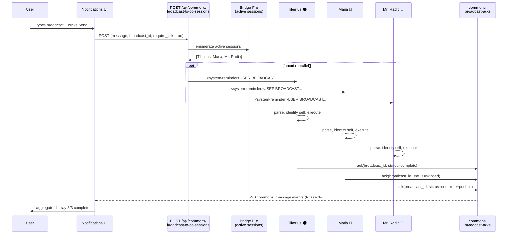
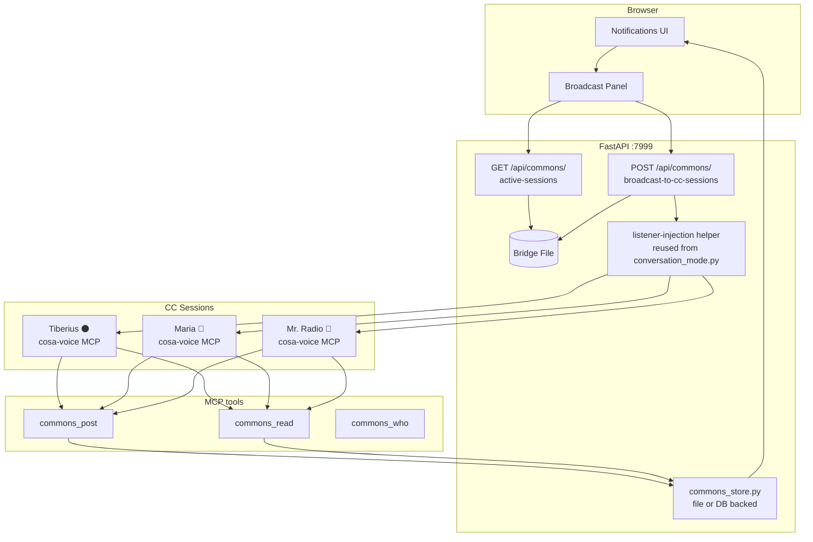

# Inter-Session Commons + User-Broadcast Channel — Phase 0 Design

| Field | Value |
|---|---|
| **Date** | 2026-05-09 |
| **Author** | Tiberius (session `f9608a41`) under direction of @ricardo.felipe.ruiz |
| **Status** | 🟡 **DRAFT — open for ratification** |
| **Branch** | `wip-v0.1.7-2026.04.22-spit-and-polish-for-cjflow-tfe-and-bfe` |
| **Predecessor branch context** | Multiplexer Phase 6b in flight; commons may rebase to v0.1.8 if it slips past v0.1.7 cut |
| **Successor docs (planned)** | `02-phase1-file-commons-design.md`, `03-phase2-user-broadcast-design.md`, `90-execution-log.md` |

---

## 1. TL;DR

Two related capabilities on one shared transport:

1. **Session ↔ Session commons** — Claude Code instances post / read from a shared blackboard, enabling cross-session status awareness and coordination ("I'm editing `notifications-store.ts` for the next 30 min, hands off").
2. **User → All Sessions broadcast** — a single message from the notifications UI fans out to every active CC session, with **persona-aware** instruction parsing (e.g., *"all sessions: run `/plan-session-end`. **Mr. Radio**: also do `/plan-backup` + push. **Maria**: skip commit."*).

Most of the infrastructure already exists. Net new work: a commons store, 2-3 MCP tools, 2 endpoints, 1 UI control. Phased rollout starts with a file-based MVP and ends with a Postgres-backed Multiplexer "Commons" tab.

---

## 2. Background and motivation

The user routinely runs multiple Claude Code sessions in parallel — sometimes 2-3 concurrent personas (e.g., Tiberius, Maria, Mr. Radio in the May 7 session) working on related branches of the same repo. Today, sessions are mutually invisible: parallel-session safety is enforced by the file-based `.claude-session.md` manifest, but it is a passive ledger, not a communication channel. Two pain points:

- **No coordination loop**. Session A cannot tell Session B "I am refactoring `notifications-store.ts` for the next 30 min." Conflicts surface only at commit time, by which point both sessions have done duplicate or overlapping work.
- **Manual fanout for shared rituals**. When the user wants all sessions to do the same thing (close out for the day, all sync to main, all run a smoke test), they must switch into each session and type the directive. The end-of-day `/plan-session-end` ritual is the canonical pain point.

The user's specific near-term scenario:

> "Send one message from the notifications UI to all of the Claude Code listeners such that with one command I can tell them all to run the end-of-session ritual. Within that one communication, specify that **Mr. Radio does the backup and the push** while all the others only do commits, so each of the listeners must be able to identify itself by the persona name that is assigned to their session."

This is the user→all surface. The session↔session surface is the more general capability that subsumes it (the broadcast acks land on a commons topic).

---

## 3. Existing infrastructure inventory

| Asset | Where | Role in commons |
|---|---|---|
| Per-session voice persona | `voice_persona` field in `get_session_info()` | Stable named identity per session — Tiberius / Maria / Mr. Radio. Identity layer is **free**. |
| `sender_id` with session ID | `claude.code@lupin.deepily.ai#f9608a41` | "Who said what" disambiguation — already in every notification. |
| Per-session notification listener with tmux injection | Used by conv-mode displace + self-exit (session `05da2b39` fix in `cosa/rest/routers/conversation_mode.py`) | The mechanism for "push a `<system-reminder>` into a specific session's input loop" is **already proven**. Reuse for broadcast fanout. |
| Bridge file shared state | cosa-voice MCP server | Cross-session coordination state already lives here (`conversation_mode_active`, `voice_persona`, last activity, claude_code session metadata). |
| WebSocket fanout + subscription filtering | `websocket_manager.py` + routers | Real-time push infra ready for `commons_message` events. |
| `.claude-session.md` multi-section manifest | Project root | Sessions already track each other via files (parallel safety v2.0). Not a comms channel today, but the precedent is there. |
| Notifications UI panel | `static/js/notifications.js`, `notifications.html` (and the multiplexer rewrite in flight) | Surface for the broadcast UI control. |

**Net**: identity, listener-injection, WS fanout, and UI surface all exist. The new work is small.

---

## 4. The two surfaces

### 4.1 Surface 1 — Session ↔ Session commons (AI ↔ AI)

Classical Hearsay-II blackboard semantics: each session is a knowledge source posting to a shared workspace.

#### MCP tools to add (cosa-voice MCP server, `src/lupin_mcp/cosa_voice_mcp.py`)

| Tool | Purpose | Phase |
|---|---|---|
| `commons_post(topic, body, metadata=None, ack_required=False)` | Append a post to a topic | 1 |
| `commons_read(topic, since=None, limit=50)` | Pull recent posts from a topic | 1 |
| `commons_who(topic=None)` | Presence: who's posted recently (overall or per-topic) | 1 |
| `commons_ask_sync(topic, body, timeout=120)` | Brief blocking ask to peer session(s) — returns answer or `None` on timeout | 1 |
| `commons_ask_async(topic, body, question_id)` | Fire-and-forget ask; answer arrives via system-reminder injection when a peer posts a matching reply | 1 |
| `commons_subscribe(topic_glob)` | Register a WS push subscription instead of polling | 3 |

Each post is automatically tagged with sender's `session_id`, persona name, persona icon, persona color, and ISO timestamp.

#### 4.1.1 AI-to-AI ask/answer threading semantics (per Q6b ratification + Phase 1 plan §3 AC6/AC7)

Both `commons_ask_sync` and `commons_ask_async` auto-generate `question_id` as UUID v4 (`str(uuid.uuid4())`) unless caller-supplied. Posts are tagged with `metadata.kind="question"` and `metadata.question_id=<UUID>`. Replies set `metadata.in_reply_to=<question_id>` to thread back to the original question.

**Threading semantics**:

- `commons_ask_sync(topic, body, timeout=120)` — **returns a list** of all matching reply entries. **Hybrid timing**: blocks until the FIRST matching reply arrives, then waits an additional `commons ask sync grace seconds` (default 1.0, INI-configurable) to coalesce additional fast replies, then returns the accumulated list. Empty list on timeout.
- `commons_ask_async(topic, body, question_id=None)` — **Phase 1 polling-mode** (per Phase 1 plan §10 D1 deviation): caller polls `commons_read(topic, since=...)` and filters for entries with `metadata.in_reply_to == question_id`. **Phase 3** wires `<system-reminder>` injection per the Q6b push-based contract; signature stays stable.

See Phase 1 plan §3 AC6/AC7 for verification contracts and edge-case test cases.

### 4.2 Surface 2 — User → All Sessions broadcast

UI-initiated fanout to every active CC session, with persona-aware directive parsing.

#### Components

1. **UI control** in the notifications panel (`notifications.html` + new component in multiplexer when Phase 6c lands): a "📢 Broadcast to all CC sessions" panel with textarea + recipient preview chip-row + Send button.
2. **Discovery endpoint** `GET /api/commons/active-sessions` — returns `[{session_id, persona_name, persona_icon, persona_color, last_seen, conversation_mode_active}]` for the UI's recipient preview.
3. **Broadcast endpoint** `POST /api/commons/broadcast-to-cc-sessions` — body `{message, broadcast_id (UUID v4), require_ack (bool)}`. Server enumerates active sessions from the bridge file, pushes a `<system-reminder>`-style injection to each session's listener using the **same path** as conv-mode displace.
4. **Receiving session behavior**: each Claude reads the message, looks up its own persona via `get_session_info().voice_persona.name`, finds its persona-specific directive (if any) AND the "all sessions" directive, executes both, then posts an ack to commons via `commons_post(topic="broadcast-acks", body="...", metadata={broadcast_id, persona, status})`.
5. **UI aggregation**: notifications UI subscribes to `broadcast-acks` topic, displays running tally:
   > 2/3 complete. **Tiberius** ✅ commit `abc1234`. **Maria** ✅ no-op. Waiting on **Mr. Radio**…

#### Persona-aware parsing — reserved syntax

Free-text body, with one reserved convention: lines starting with `@PersonaName:` are persona-specific directives. Everything else is "all sessions" default.

Example body:

```text
All sessions: run /plan-session-end.
@Mr. Radio: also run /plan-backup and push to origin.
@Maria: skip commit (no edits this session).
@Tiberius: standard close.
```

Parsing rules:

- Match persona name **case-insensitively, ignoring punctuation and spacing** ("Mr. Radio" / "mr radio" / "mrradio" all match `Mr. Radio`). When mechanical match fails, fall back to local-LLM disambiguation per Q8 ratification (Phase 3 wires the LLM call; Phase 1 stubs the hook with `disambiguate_via_llm()` returning None).
- If session's persona has no `@PersonaName:` line, follow only the default (everything outside `@…` lines).
- Multiple `@PersonaName:` lines for the same persona concatenate.
- Unknown `@SomeoneElse:` directives are ignored silently by sessions whose persona doesn't match.
- A directive line beginning with `@all:` or `@everyone:` is an alias for the default (no per-persona scope).
- **Empty-match behavior** (per A6 ratification): if a broadcast contains ONLY `@PersonaName:` lines (no default body) AND the receiving session's persona doesn't match any of them, the session follows the **no-op path** — posts an ack with `status="skipped"` (or `status="not-applicable"`) to the `broadcast-acks` topic and continues. The UI's running aggregate sees the session as "skipped" rather than "waiting" indefinitely. Empty/whitespace-only broadcast bodies are rejected at the endpoint per Q13 (HTTP 400) and never reach sessions.

#### Sequence diagram — broadcast fanout + ack aggregation



#### Component diagram — commons + broadcast surfaces



---

## 5. Architectural shapes considered

| Shape | Storage | Real-time | Effort | Recommendation |
|---|---|---|---|---|
| **A — File-based** | `commons/topic-*.md` append-only | Polling only | ~1 day | **Phase 1 MVP** — validates the workflow with zero infra. Git-trackable conversation log. |
| **B — WebSocket pub/sub** | Same as A but with WS push | Push via `commons_message` event | ~1 day on top of A | **Phase 3** — replace polling once dogfooding shows where it's needed. |
| **C — Postgres + UI tab** | New `session_commons` table mirroring `notifications` | WS push | Several days | **Phase 4** — production-grade, queryable, observable. Defer until commons patterns stabilize. |

**Recommendation**: ship Shape A first; add Shape B's WS push specifically for the `broadcast-acks` topic (which the UI absolutely needs to update live); defer Shape C until commons usage justifies the persistence + UI investment.

---

## 6. Phasing

| Phase | Scope | Dependencies | Effort |
|---|---|---|---|
| **0** | This design doc + ratification | None | 1 day (doc + walkthrough) |
| **1** | File-based commons MVP — `commons/` dir + `commons_post` / `commons_read` / `commons_who` MCP tools + bridge-file presence enumeration | Phase 0 ratified | ~1 day |
| **2** | User→all broadcast — UI control + 2 endpoints + persona-aware parse + ack aggregation | Phase 1 (uses commons for ack channel) | ~1-2 days |
| **3** | WS push for commons (`commons_message` event + `commons_subscribe`) | Phase 1 | ~1 day |
| **4** | Postgres-backed commons + Multiplexer "Commons" tab | Phase 3 + multiplexer Phase 6c landed | Several days |

**Recommended initial scope**: Phase 0 + 1 + 2 as one cohesive deliverable. Phase 3 + 4 defer to "after we've used it for a week."

---

## 7. Trust, safety, idempotency

- **Trust model**: all sessions are owned by the same user; no auth boundary needed *between* sessions. Commons is private to the user's session pool. The broadcast endpoint is JWT-gated like every other authenticated route.
- **Broadcast confirmation**: the user→all broadcast is high-leverage — UI shows a recipient preview chip-row + a one-step "Send to N sessions" confirm before fanout.
- **Idempotency**: every broadcast carries a UUID v4 `broadcast_id`. Receiving sessions track "broadcast X already handled" in the bridge file → re-send doesn't double-execute. Same pattern as the conv-mode displace push.
- **Session busy mid-task**: the receiving session can defer ("queued — will run after current task") and ack with that status. The UI surfaces deferred sessions in the aggregate.
- **Conv-mode interaction**: the conv-mode mutex is orthogonal. Only one session holds conv-mode but **all** sessions can receive broadcasts. Receiving a broadcast does NOT toggle conv-mode (would violate the user-only-initiation rule).
- **Rate limiting**: 1 broadcast per 30s default per user (configurable INI key). Prevents thrash if the UI button is mashed.
- **No silent state mutation**: the broadcast injection is a `<system-reminder>`-style payload — it asks the receiving Claude to act, it does not auto-execute commands. This preserves the existing "Claude is the agent" trust boundary.

---

## 8. Open design questions (proposed defaults — all overridable at Phase 0 ratification)

| # | Question | Proposed default | Alternatives |
|---|---|---|---|
| Q1 | Topic registry: free-form vs curated | **Free-form strings**, lowercase-hyphenated by convention | Curated set (`status`, `coordination`, `questions`, `broadcast-acks`) |
| Q2 | TTS fatigue from commons posts | **Silent unless `priority=="high"` in metadata** | Always TTS / never TTS / per-topic TTS rules |
| Q3 | Coordination primitives (file locks, "I'm editing X for 30 min") | **Defer to Phase 5** — not in initial scope | Build into Phase 1 as `commons_claim(resource, ttl)` / `commons_release(resource)` |
| Q4 | Persistence horizon for commons posts | **24 hours rolling, then archive to `commons/archive/yyyy-mm-dd/`** | Session-only / 7 days / 30 days / forever |
| Q5 | Free-text vs structured directive in broadcasts | **Free-text + reserved `@PersonaName:` line syntax** (with `@all:` / `@everyone:` aliases) | Pure JSON `{everyone: "...", "Mr. Radio": "..."}` |
| Q6 | `require_ack=true` blocks UI? | **Non-blocking** — UI shows live aggregate, user can dismiss before all acks land | Blocking with timeout (e.g., 5 min default) |
| Q7 | Overlap with `.claude-session.md` manifest | **Keep orthogonal** — manifest is parallel-safety, commons is communication | Migrate manifest into commons table (Phase 4) |
| Q8 | Persona name matching | **Case-insensitive + punctuation/space-tolerant** | Exact match only |
| Q9 | What if a session has no persona allocated (Phase 4.5 hook failed) | **Falls back to "all sessions" directive only**; persona-targeted directives ignored | Refuse to act on broadcast / log + skip |
| Q10 | Confirmation before send | **One-step confirm dialog with recipient chip-row** | No confirm / typed-name confirm |
| Q11 | Rate limit on broadcasts | **1 per 30s per user** (configurable INI key) | None / per-topic / configurable |
| Q12 | Broadcast access control | **Authenticated user only** (existing JWT) | Admin-only role |
| Q13 | What if the message is empty / whitespace-only | **Reject at endpoint with 400** | Accept silently / TTS-only ack |
| Q14 | What if zero sessions are active when broadcast is sent | **Return 200 with `{recipients: 0, status: "no-active-sessions"}`** | Return 409 / queue for next session start |
| Q15 | Should the broadcast body support markdown rendering in the system-reminder? | **Plain text only in Phase 2**; markdown-aware rendering in Phase 4 with the Commons tab | Markdown from day one |

---

## 9. What's out of scope (for this initiative)

- **Cross-user / cross-installation commons** — the commons is single-user. Multi-user collaboration is a different system.
- **CC session ↔ non-CC agent commons** — deep-research, podcast-generator, BFE/TFE jobs do NOT participate as first-class commons members. They could post via the existing notification API if useful, but they don't get persona / discovery / broadcast routing.
- **Persistent commons across project boundaries** — commons is per-project (scoped under the project root). Switching projects gets a fresh commons.
- **Mobile app commons participation** — the Lupin mobile app is not a CC session and is excluded.
- **Commons-driven test orchestration** — using commons to coordinate `:8000` test scheduling. That belongs in the test-suite scheduling system, not commons.
- **Auto-execution of broadcast directives** — the broadcast asks Claude to act; Claude decides. No `eval()`-style command execution.

---

## 10. File and code touchpoints

**MCP server (Lupin parent — `src/lupin_mcp/`)**:
- `cosa_voice_mcp.py` — register `commons_post`, `commons_read`, `commons_who` tools
- New module `commons_store.py` — file-based store with append + tail-read

**FastAPI server (CoSA submodule — edits flow through the parent Lupin context per submodule git boundary)**:
- New router `src/cosa/rest/routers/commons.py` — `GET /api/commons/active-sessions` + `POST /api/commons/broadcast-to-cc-sessions`
- Reuse listener-injection helper from `routers/conversation_mode.py` (the self-exit fix from session `05da2b39`)
- New helper `cosa/utils/commons_broadcast.py` — broadcast fanout + ack aggregation

**Frontend (Lupin parent)**:
- `static/js/notifications.js` (or multiplexer equivalent) — broadcast UI control + recipient preview
- `notifications.html` — DOM mount point for broadcast panel
- WS event handler for `commons_message` (Phase 3)

**Configuration (`src/conf/lupin-app.ini` + `lupin-app-splainer.ini`)**:
- `commons_enabled` (bool, default `true`)
- `commons_storage_path` (str, default `commons/`)
- `commons_retention_hours` (int, default `24`)
- `commons_broadcast_rate_limit_seconds` (int, default `30`)
- Each key paired with explainer entry per project convention.

**Tests** (per Test Ownership Mandate):

| Tier | Coverage | Venue |
|---|---|---|
| Unit | `commons_store.py` (file append/read), broadcast endpoint (auth + fanout target enumeration), persona-name matcher, `@PersonaName:` parser | `:7999` |
| Smoke | 2-session inline test (one posts, one polls, verify roundtrip) | `:7999` |
| Integration | 3-session broadcast roundtrip with persona-targeted directives + ack aggregation | `:8000` scheduled |
| WebSocket smoke (Phase 3+) | `commons_message` event delivery + subscription filtering | `:7999` |

---

## 11. Cross-references

- **Per-session voice personas** (where the persona allocation that we depend on is defined): `src/rnd/v0.1.7/2026.04.28-per-session-voice-personas/01-design.md`
- **Conv-mode self-exit listener-push pattern** (the mechanism we're reusing for broadcast fanout): `src/rnd/v0.1.7/2026.05.05-conv-mode-self-exit-signal-gap/`
- **Notification API reference**: `src/docs/notification-api.md`
- **WebSocket architecture**: `src/docs/websocket-architecture.md`
- **WebSocket events catalog**: `src/docs/websocket-events.md`
- **Parallel session safety manifest**: `~/.claude/CLAUDE.md` § PARALLEL SESSION SAFETY (v2.0)
- **Plan-session-end workflow** (canonical broadcast example): `~/.claude/skills/plan-session-end/SKILL.md`
- **Documentation-first protocol**: `~/.claude/CLAUDE.md` § DOCUMENTATION-FIRST PROTOCOL

---

## 12. Status and next step

This is a Phase 0 design doc. **It does not authorize implementation.** Per the documentation-step-stops-at-doc protocol, the next step is:

1. User reviews this doc.
2. Walk the 15 open questions with the user — recommend `ask_multiple_choice` cadence (batch the easy defaults Q1/Q2/Q4/Q8/Q9/Q11/Q12/Q13/Q14/Q15 if user is happy with proposals; individual walks for Q3, Q5, Q6, Q7, Q10 which have meaningful tradeoffs).
3. Apply ratification decisions back into this doc as a *§13 Ratification* section.
4. Produce a Phase 1 code-execution plan in a separate doc (`02-phase1-file-commons-design.md`).
5. Optionally produce Phase 2 plan in `03-phase2-user-broadcast-design.md`.

No code is written before steps 2-4 complete.

---

## 13. Ratification — 2026-05-09

Walked all 7 original open questions plus 2 sub-questions that emerged during ratification (Q1b reserved-set sizing, Q6b ask/answer patterns). Q8-Q15 from the expanded list remain at proposed defaults pending future walkthrough.

### Decisions

| # | Question | Decision |
|---|---|---|
| Q1 | Topic registry shape | Free-form + reserved set |
| Q1b | Reserved set sizing | **Full set**: `broadcast-acks` + `presence` + `system-events` |
| Q2 | TTS fatigue from commons posts | Silent unless `metadata.priority == "high"` |
| Q3 | Coordination primitives (file locks) | Defer to Phase 5; sessions coordinate informally via posts to a `coordination` topic |
| Q4 | Persistence horizon | 24h active in `commons/topic-X.md`, then rotated to `commons/archive/yyyy-mm-dd/`; archive kept indefinitely |
| Q5 | Broadcast directive shape | Free-text + reserved `@PersonaName:` line syntax (with `@all:` / `@everyone:` aliases) |
| Q6 | Broadcast ack UX | Non-blocking + live aggregate via WebSocket (drives early delivery of `broadcast-acks` WS subscription in Phase 2) |
| Q6b | AI-to-AI ask/answer patterns | Both sync and async, named `commons_ask_sync(topic, body, timeout=120)` and `commons_ask_async(topic, body, question_id)` — naming aligned with project's `_sync`/`_async` convention (cf. `notify_user_sync.py`/`notify_user_async.py`); both bumped from Phase 3 to **Phase 1** |
| Q7 | Manifest overlap with commons | Keep orthogonal — `.claude-session.md` is parallel-safety (git-tracked); commons is communication (gitignored). Cross-linking achievable today without infra changes. |
| Q8 | Persona name matching | Case-insensitive + punctuation/space-tolerant **+ stub for local-LLM disambiguation fallback** when mechanical matching fails (e.g., "the radio guy" → "Mr. Radio") |
| Q9 | No-persona fallback (allocation hook failed) | Follow `@all` directive only; ignore `@PersonaName` directives silently |
| Q10 | Confirm dialog before broadcast send | One-step confirm modal with recipient chip-row ("Sending to: Tiberius 🌑, Maria 🌸, Mr. Radio 🦉") |
| Q11 | Rate limit on broadcasts | 1 per 30s per user, INI-configurable (`commons_broadcast_rate_limit_seconds=30`) |
| Q12 | Access control on broadcast endpoint | Authenticated user only (existing JWT); no special role |
| Q13 | Empty body broadcast | Reject with HTTP 400 (standard input validation) |
| Q14 | Zero recipients (no active sessions at broadcast time) | Return HTTP 200 with `{recipients: 0, status: "no-active-sessions"}` |
| Q15 | **Markdown rendering** (DEVIATED from recommended) | **Markdown from day one** — Phase 2 ships markdown rendering in BOTH the UI display AND the receiver-side `<system-reminder>` injection. Recommended default was plain-text-Phase-2 / markdown-Phase-4; user upgraded to avoid v1→v2 reformatting and have polished UX from the start. |

### Architectural principles emerged during ratification

These were not anticipated in the §8 question list but emerged from the user's framings during the walkthrough. They have cross-cutting impact on §1, §4, §9.

1. **Commons is INTRA-AI**. Session ↔ session communication. User-bound communication continues to use the existing notification API (the per-session listener already in place handles `notify`, `ask_*`, `converse`). Commons does not replicate user-bound channels.

2. **User-as-witness, not-as-middleman**. The user reads commons like a chat log between teammates — observing, occasionally intervening, but **not in the routing path** for routine inter-agent traffic. This is what makes "silent unless priority=high" the right TTS default rather than a noise-mitigation compromise.

3. **Naming consistency: `_sync` / `_async` axis matches existing project conventions**. The suffix pattern is established in the notifications API; commons follows. New tools introduced in this design always pair sync and async variants explicitly.

### Doc impact (deferred to next revision)

- §1 TL;DR — add intra-AI scoping language and user-as-witness principle
- §4.1 — add a §4.1.1 subsection for AI-to-AI ask/answer with the two `commons_ask_*` primitives + threading semantics (question_id metadata, sibling answers vs in-line replies)
- §4.1 MCP-tools-to-add table — **already updated above** (`commons_request` → `commons_ask_sync`, new `commons_ask_async`, both Phase 1)
- §6 Phasing table — Phase 1 scope row should include the `commons_ask_*` primitives (currently lists only post/read/who)
- §9 Out of scope — clarify that user-bound notifications use existing notification API, not commons
- §10 File touchpoints — note the renamed tools

### Notable Q8-Q15 deviations and additions

All Q8-Q15 walked and ratified in 3 batched cards on 2026-05-09. Two items merit explicit call-out beyond the table row:

- **Q8 — LLM-fallback addition (NEW)**: ratified the recommended case-insensitive + punctuation/space-tolerant matcher AND added a stub for **local-LLM disambiguation when mechanical matching fails**. Phase 1 ships the mechanical matcher with a hook stubbed for the LLM call; the LLM call wires in Phase 3+ (or whenever dogfooding shows the disambiguation need). Example: user dictates "the radio guy" via voice → mechanical matcher fails → local LLM resolves to "Mr. Radio". Aligns with the existing voice-routing classifier pattern in CoSA.

- **Q15 — Markdown from day one (DEVIATED from default)**: user chose the upgraded option over the recommended "plain-text-Phase-2 / markdown-Phase-4". Net effects:
  - Phase 2 effort estimate bumps slightly (~half-day for markdown rendering in both UI display and the receiver-side `<system-reminder>` injection).
  - No v1→v2 reformatting later; polished UX from the start.
  - Receiver-side rendering: each session's listener-injection helper must support markdown-aware rendering (or pass markdown through verbatim and let Claude interpret it as text).
  - UI display: the broadcast composer textarea + receiver-side display in the (future) Commons tab both render markdown.

### Status

✅ **Phase 0 design closed.** Doc is the deliverable. Per documentation-step-stops-at-doc protocol, no code is written until the user authorizes the next step.

### Possible next steps (user-directed)

- Walk Q8-Q15 (or batch-ratify accept-as-default).
- Produce Phase 1 code-execution plan in `02-phase1-file-commons-design.md`.
- Produce Phase 2 design doc for the user→all broadcast surface in `03-phase2-user-broadcast-design.md`.
- Defer further work pending other priorities (multiplexer Phase 6b is the in-flight competing initiative).
