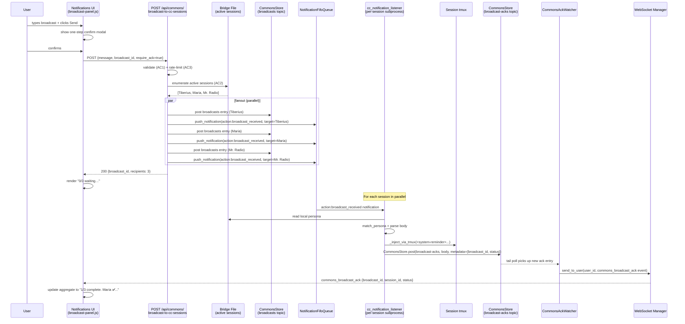
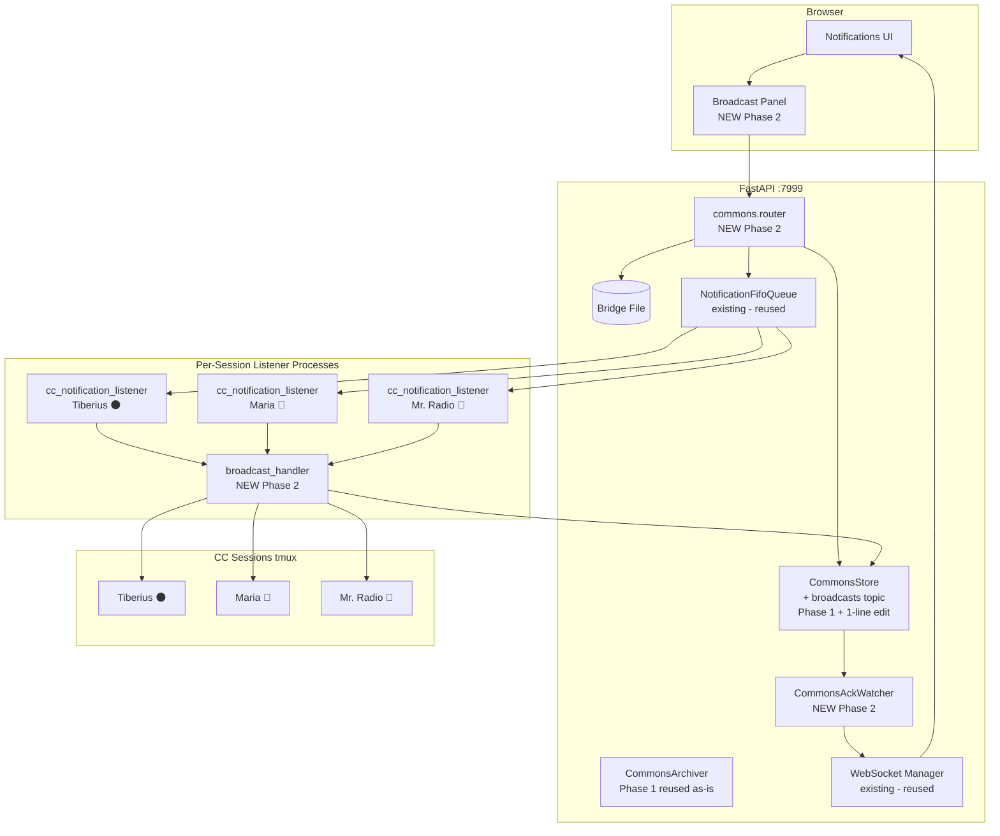

# Phase 2 — User → All Sessions Broadcast — Design Plan

| Field | Value |
|---|---|
| **Date** | 2026-05-11 |
| **Author** | Rachel 🕊️ (session `9a4a601d`) |
| **Status** | 🟢 **APPROVED FOR CODE-WRITE — REUSE + Pass 1 Fitness + Pass 2 Adversarial ALL CLOSED 2026-05-11; full plan-review pipeline complete; 12 threats walked + 11 ACs hardened + sanitization step ratified + 2 new threats T8 + T9 surfaced and mitigated** |
| **Predecessor** | `02-phase1-file-commons-design.md` (Phase 1 — ✅ CLOSED 2026-05-11; see [`92-phase1-closure.md`](92-phase1-closure.md)) |
| **Successor (planned)** | `04-phase3-system-reminder-injection-design.md` (Phase 3 — wires `commons_ask_async` push + LLM-fallback for matcher; some sub-pieces may land in Phase 2 — see §10) |
| **Branch** | `wip-v0.1.7-2026.04.22-spit-and-polish-for-cjflow-tfe-and-bfe` (may rebase to v0.1.8 if Phase 2 slips past v0.1.7 cut) |
| **Execution log** | `90-phase2-execution-log.md` (created at first phase start) |
| **Phase 0 motivation** | Concrete near-term use case from `01-design.md §1`: end-of-session ritual broadcast where Mr. Radio also runs `/plan-backup` + push, Maria skips commit, Tiberius does standard close — **all from one user click in the notifications UI** |

---

## 1. TL;DR

Phase 2 ships the **user → all CC sessions broadcast surface**: a notifications-UI panel where the user types one message and clicks Send to fan it out to every active Claude Code session, with `@PersonaName:` directives parsed per-session so different personas can be given different instructions in the same broadcast.

**Three new pieces** land in this phase:

1. **UI** — "📢 Broadcast to all CC sessions" panel in `notifications.html` with textarea + recipient preview chip-row + one-step confirm dialog + Send button + live ack aggregation display.
2. **Two FastAPI endpoints** — `GET /api/commons/active-sessions` (recipient preview) and `POST /api/commons/broadcast-to-cc-sessions` (fanout).
3. **Two listener-injection actions** in `cc_notification_listener` — `action:broadcast_received` (injects the broadcast body as a `<system-reminder>`) and the existing `notification_queue.push_notification` fanout path (reused).

Markdown rendering is from-day-one (Q15 deviation). Rate limit is 1 broadcast / 30s / user (Q11; consumed from the INI key declared in Phase 1). Auth via existing JWT (Q12). Existing `commons_persona_matcher` (already at 100% coverage in Phase 1) handles `@PersonaName:` matching.

**Estimated effort**: **2-3 days of focused work + plan-review pipeline (~4-6 hours of walks)** — UI + 2 endpoints + listener action + tests. Materially larger than Phase 1's 1-day MVP because of the UI work, the cross-process listener-injection plumbing, and the live-ack WebSocket aggregation.

---

## 2. Phase 2 scope

### In scope (Phase 2 ships)

1. **`POST /api/commons/broadcast-to-cc-sessions`** — accepts `{message, broadcast_id?, require_ack?}`; enumerates active CC sessions from the bridge file; persists the broadcast as one entry per session in the `broadcasts` topic (NEW reserved topic) keyed by `broadcast_id`; pushes a per-session `action:broadcast_received` notification through `notification_queue.push_notification` for each recipient.
2. **`GET /api/commons/active-sessions`** — returns `[{session_id, persona_name, persona_icon, persona_color, last_seen_iso, conversation_mode_active}]` for the UI's recipient preview chip-row.
3. **Listener action** — `cc_notification_listener._handle_action("broadcast_received", ...)` reads the broadcast body + persona from the notification payload, runs persona-aware parsing via `commons_persona_matcher` to compute the per-session effective directive, injects the result as a `<system-reminder>` into the session's tmux, then auto-posts an ack to `broadcast-acks` via `CommonsStore.post(...)` (in-process, no MCP round-trip).
4. **UI panel** — "📢 Broadcast to all CC sessions" textarea + recipient chip-row + one-step confirm modal + Send button + live ack aggregate display. Markdown rendering in both the textarea preview AND the receiver-side `<system-reminder>` body.
5. **Live ack aggregation** — UI subscribes to a new WebSocket event `commons_broadcast_ack` (added to `websocket available events`). Each session's ack post to `broadcast-acks` triggers a server-side WS push to the originating user, scoped by `broadcast_id`. UI shows running tally: `2/3 complete. Tiberius ✅ commit abc1234. Maria ✅ no-op. Waiting on Mr. Radio…`
6. **NEW reserved topic** `broadcasts` — server-canonical record of each fanout (1 entry per `broadcast_id`, body = the message, metadata = `{broadcast_id, sender_user_id, recipient_session_ids: [...]}`).
7. **Reuse existing `broadcast-acks` reserved topic** — already pre-seeded by `CommonsStore` in Phase 1; this phase is the first consumer.
8. **Tests**: unit (parser + endpoint validators + matcher integration), smoke (single-session fanout + listener-action injection without UI), E2E (multi-session fanout with real listener processes, on `:7999` AI-discretionary).

### Out of scope (deferred to later phases)

- Push-based answer arrival for `commons_ask_async` — **Phase 3** (Phase 2 reuses the listener-injection scaffold but for broadcasts only; the ask/answer flow stays polling-mode per Phase 1 D1).
- LLM-fallback wiring for persona matcher (Phase 1 ships the stub; Phase 2 still calls the stub, which returns None) — **Phase 3**.
- Multiplexer Commons tab integration — **Phase 4** (Phase 2's UI lives in legacy `notifications.html`; the multiplexer rewrite picks it up when Phase 6c lands).
- Postgres-backed commons storage — **Phase 4**.
- Cross-user broadcast (user A → user B's sessions) — out of v0.1.7 scope entirely (Phase 0 §9).
- Coordination primitives (`commons_claim` / `commons_release`) — **Phase 5**.

---

## 3. Acceptance criteria (ACs)

| # | AC | Verification |
|---|---|---|
| **AC1** | `POST /api/commons/broadcast-to-cc-sessions` validates body: `message` is non-empty string after `.strip()`, `broadcast_id` is None or valid UUIDv4 string, `require_ack` is bool (default True). Empty/whitespace-only body → `HTTP 400` with `detail="message body is required"` (per Q13). **Body containing literal `<system-reminder>` or `</system-reminder>` substring (case-insensitive)** → `HTTP 400` with `detail="message must not contain system-reminder framing tags"` (per Pass 2 T1). Invalid `broadcast_id` shape → `HTTP 400` with `detail="broadcast_id must be a UUIDv4"`. Caller-supplied `broadcast_id` that **collides with an in-flight broadcast** → `HTTP 409` (per Q10 + Pass 2 T9). **Collision check + insert must be atomic** — performed inside the `commons_in_flight_broadcasts` `threading.Lock` critical section (`with lock: if bid in d: raise 409; d[bid] = entry`) to prevent TOCTOU race between concurrent requests. Auth via `require_api_key_or_jwt` dependency (per Q12). **`require_ack=False` semantics** (decided Pass 1): when False, the endpoint still posts the per-recipient `broadcasts` entry + per-session listener notification, but the originating user receives NO `commons_broadcast_ack` notifications (the watcher's in-flight tracking is skipped for this broadcast). Default True keeps the live-aggregate UX. | **EXECUTOR: AI** — `test_broadcast_endpoint::test_400_on_empty` + `test_400_on_whitespace_only` + `test_400_on_system_reminder_substring` (both opening + closing tags, case-insensitive) + `test_400_on_invalid_broadcast_id_shape` + `test_409_on_in_flight_collision` + `test_409_on_concurrent_insert_race` (threading-based) + `test_401_on_missing_auth` + `test_require_ack_false_skips_tracking` |
| **AC2** | Endpoint enumerates active CC sessions via `find_active_voice_persona_sessions()` at `src/lupin_cli/claude_code/hooks/lib/session_bridge.py:1156-1213` (returns 3-tuples `(Path, session_id, persona_dict)`). **NOT the same helper as `conversation_mode.py`'s `find_active_conversation_sessions`** — that one is conv-mode-specific. **Same-user scoping** (per Q9 + Pass 2 T7): same `user_id` filter applies to BOTH `POST /broadcast-to-cc-sessions` AND `GET /active-sessions` — only sessions whose bridge file's `user_id` field equals `authenticated_user_id` are returned/fanned-out. Sessions inactive > `commons broadcast active session threshold seconds` (NEW INI key, default 600 = 10min) are EXCLUDED. **Originator inclusion** (per Q8): default IS to include the caller's own session(s); endpoint accepts `include_originator: bool = True` param (POST only — GET always returns all same-user sessions). **Explicit field projection** (per Pass 2 T8): response constructs dicts from `(session_id, persona_dict)` only, NEVER passing the bridge `Path` through — response JSON must contain only `{session_id, persona_name, persona_icon, persona_color, last_seen_iso, conversation_mode_active}` keys per session. Zero recipients (after all filters) → `HTTP 200` with `{"status": "no-active-sessions", "broadcast_id": "...", "recipients": 0}` (per Q14). | unit test seeds 3 bridge files with last-seen ages 5s / 5min / 20min; assert only the first two fan out. Separate unit tests verify (a) other-user sessions excluded by `user_id` scoping on BOTH endpoints, (b) `include_originator=false` excludes the caller's own session, (c) `include_originator=true` includes it, (d) `GET /active-sessions` response JSON contains NO `bridge_path` key + NO absolute filesystem paths anywhere in the payload (T8 regression test). |
| **AC3** | Rate limit: 1 broadcast per `commons broadcast rate limit seconds` (default 30, declared in Phase 1 INI) per `user_id`. Window is a sliding 30s — exceeded → `HTTP 429` with `Retry-After` header set to seconds remaining. State held in-process (per-uvicorn-worker dict, expires lazily on the next lookup). Module exposes `reset()` test hook for unit-test isolation; production code never calls it. | unit test posts back-to-back; second returns 429 with `Retry-After`; third (after 30s timeout, monkeypatched clock) succeeds. Separate unit test asserts `reset()` clears state between two simulated users without affecting third. |
| **AC4** | For each recipient session, server posts one entry to the new reserved topic `broadcasts` via `CommonsStore.post(topic="broadcasts", body=<message>, sender_session_id=<server-pseudo-sid>, persona_name="System Broadcast", persona_icon="📢", persona_color="#FFC107", metadata={broadcast_id, target_session_id, sender_user_id})`. The `broadcasts` topic is added to `RESERVED_TOPICS` in `commons_store.py` (pre-seeded on first init). **Server-pseudo-sid format**: `broadcast-<user_id_short>` where `<user_id_short>` is the first 8 hex chars of a SHA-256 of `authenticated_user_id`. Hyphens only — **NO `@` character** because the existing `_HEADER_RE` regex at `commons_store.py:39-41` matches `session_id` as `[A-Za-z0-9_-]+` and `@` would fail round-trip parsing. **Audit-trail consequence** (per Q2): 1 broadcast to N sessions = N entries in `broadcasts` topic, each pinned to a distinct `target_session_id` in metadata. | unit test asserts N entries in `broadcasts` after fanout where N = recipient count; each entry has distinct `target_session_id`; entries round-trip through `CommonsStore.read("broadcasts")` cleanly (validates the sender-pseudo-sid regex compatibility). |
| **AC5** | For each recipient session, server pushes one `notification_queue.push_notification(message="", type="user_initiated_message", title="action:broadcast_received", sender_id=build_sender_id_for_cc(target_sid), job_id=target_sid[:8], suppress_ding=True, payload={broadcast_id, body, sender_user_id})`. This reuses the exact pattern at `conversation_mode.py:205-214` (per F4 + F5 REUSE). **Per-recipient failure isolation**: if `push_notification` raises for recipient K, log the failure (`logger.warning`) but CONTINUE the fanout loop — same best-effort policy as `conversation_mode.py:191-193` ("bridge write succeeded; broadcast is best-effort"). The originator's HTTP response includes a `failed_recipients: [<target_sid>, ...]` field listing any per-recipient failures. | unit test mocks `notification_queue.push_notification` to raise for the second of three recipients; asserts (a) call count == 3 (loop did not abort), (b) HTTP response 200 includes `failed_recipients` with the offender's sid, (c) the other two succeeded normally. |
| **AC6** | `cc_notification_listener._handle_action("broadcast_received", notification)` (NEW handler — third `elif` branch in the existing dispatcher at `cc_notification_listener.py:281-300`) reads `notification.payload.body` + `notification.payload.broadcast_id`, queries the local session's persona via `lupin_cli.claude_code.hooks.lib.session_bridge.get_session_metadata()` (already imported by the listener — no MCP round-trip), runs `match_persona(local_persona_name, parsed_at_lines)` over the body to compute the effective directive (default body lines + matched `@PersonaName:` lines concatenated; per A6 ratification skipped-case yields ack with `status="skipped"`). Injects the result as `<system-reminder>USER BROADCAST: ...</system-reminder>` into tmux via `_inject_via_tmux(reminder, wrap=False)`. **Body sanitization** (Pass 2 T1 + T3 ratification): re-check body for literal `<system-reminder>` or `</system-reminder>` substrings (case-insensitive) as defense-in-depth — if matched (endpoint validation bypassed somehow), post ack with `metadata.status="rejected-malformed"` and skip injection. Normal markdown angle brackets pass through (only the literal framing substrings trigger rejection). Then posts to `broadcast-acks` via direct `CommonsStore` import + post (listener runs in a separate process from MCP server). **Storage path resolution**: listener reads `LUPIN_ROOT` env var (same bootstrap as `commons_storage_root()` per Phase 1 step 6) to find `<LUPIN_ROOT>/io/commons/broadcast-acks.md` — all three processes (FastAPI, MCP, listener) share the same filesystem path. | listener-test spawns the listener as a subprocess + a fake notification with a 2-persona broadcast body + asserts (a) tmux receives the correctly-parsed reminder, (b) `broadcast-acks` topic gains one entry with `metadata.broadcast_id` correlation + `metadata.status="completed"` (or `"skipped"` for empty-match case OR `"rejected-malformed"` for system-reminder-substring case). Separate test feeds a body containing `</system-reminder>` directly to the handler (bypassing endpoint validation) and asserts `status="rejected-malformed"` ack + no tmux injection (T1 + T3 defense-in-depth). |
| **AC7** | A new **custom notification type** `commons_broadcast_ack` is registered in `src/cosa/rest/routers/notifications.py:359-361` `valid_types` list (alongside the existing `voice_persona_assigned` / `voice_persona_released` / `conversation_mode_changed` custom types — per the `2026.04.29-ws-event-cleanup-to-custom-notification-types` mandate; NOT a new top-level WS event). Server-side: a new `CommonsAckWatcher` daemon thread on the FastAPI server tails the `broadcast-acks` topic (`CommonsStore.read("broadcast-acks", since=last_seen_ts, limit=10000)` every `commons broadcast ack watch interval seconds`, default 1s); for each new entry whose `metadata.broadcast_id` matches an in-flight broadcast tracked in `commons_in_flight_broadcasts`, calls `notification_queue.push_notification(type="commons_broadcast_ack", user_id=originating_user_id, message="", suppress_ding=True, payload={broadcast_id, session_id, persona_name, persona_icon, persona_color, status, body_summary})`. **In-flight tracker semantics**: `commons_in_flight_broadcasts` is a module-level `dict[str, _InFlightEntry]` on `commons_ack_watcher.py` guarded by `threading.Lock`. Entries are added by `POST /broadcast-to-cc-sessions` (when `require_ack=True`) keyed by `broadcast_id`, value records `{originating_user_id, expected_recipients, received_acks, expires_at}`. **TTL**: 5 minutes from broadcast creation (matches AC9's UI auto-dismiss). Watcher prunes expired entries on every poll. **Watcher startup `last_seen_ts`**: initialized to the timestamp of the LAST entry already in `broadcast-acks` at server-startup (no replay of pre-existing acks). | unit test seeds an in-flight broadcast in the tracker dict, writes a matching ack to `broadcast-acks` via direct store, asserts `notification_queue.push_notification` called with `type="commons_broadcast_ack"` + correct `user_id` + expected payload (mock the queue, assert call kwargs). Separate unit tests verify (a) in-flight entry TTL'd after 5min, (b) startup `last_seen_ts` initialized correctly, (c) ack arriving for an unknown `broadcast_id` is silently ignored (not pushed to any user). |
| **AC8** | UI panel in `notifications.html`: textarea + recipient chip-row + Send button. **One-step confirm modal** (per Q10) shows on Send click: lists recipient personas as chips (`Sending to: Tiberius 🌑, Maria 🌸, Mr. Radio 🦉`) + Confirm + Cancel buttons. Empty OR whitespace-only body (after `.trim()`) → button disabled + tooltip. Markdown preview pane below textarea (renders via existing markdown lib, see touch points). | Playwright E2E: load notifications page, type message, click Send, assert modal appears + recipient chips render + Confirm POSTs to endpoint. Separate unit test asserts whitespace-only body keeps Send disabled. |
| **AC9** | UI extends its existing `notification_queue_update` handler (already wired for other custom types) with a branch for `notification.type === "commons_broadcast_ack"`. For each matching ack, updates an in-page aggregate panel: `[N/Total] complete. <PersonaIcon> <PersonaName> <status> <body_summary>`. **Pending visibility**: aggregate stays pinned while `N < Total`; pending sessions named individually ("Waiting on Mr. Radio…"). Aggregate auto-dismisses 5 minutes after the LAST received ack (timer resets on each new ack); if total < expected after 5min, panel still dismisses, leaving a passive notification ("3/5 sessions acknowledged — 2 timed out"). **Body summary rendering**: `body_summary` is rendered as text content (`.textContent = ...`), NEVER as `.innerHTML` — defense-in-depth even though the field is server-controlled (Pass 2 T10). **No new WS event subscription needed** — reuses the existing `notification_queue_update` subscription. | Playwright E2E with 2 mock sessions: send broadcast, mock 2 `notification_queue_update` events with `type=commons_broadcast_ack`, assert aggregate text updates from `0/2 waiting` → `1/2 complete. Maria ✅... Waiting on Mr. Radio…` → `2/2 complete. ...`. Separate test mocks only 1 of 3 expected acks + waits 5min (clock monkeypatched) + asserts dismiss-with-timeout banner. Separate unit test (DOM-mocked) asserts `body_summary` containing `<script>...` lands as literal text in the DOM, not as an executed script (T10 regression). |
| **AC10** | Markdown rendering from-day-one (per Q15 deviation): both the UI preview pane AND the receiver-side `<system-reminder>` body render markdown. UI uses the existing `marked` library (already present in `static/js/vendor/marked.min.js`). **UI preview sanitization** (Pass 2 T2): `marked.parse()` output is passed through **DOMPurify** before DOM insertion — `DOMPurify.sanitize(marked.parse(body))` then `innerHTML`. Add `static/js/vendor/dompurify.min.js` to vendored libs if not already present (verify at code-write; if absent, vendor it). Receiver-side: listener injects raw markdown; Claude already renders markdown in `<system-reminder>` blocks, so no transform needed. Inline-code, fenced-code, bold/italic, lists, links all preserved. | UI unit test asserts `<script>alert(1)</script>` body produces preview with `<script>` tags stripped out (DOMPurify XSS regression). Listener test asserts raw markdown body lands in tmux unmodified (no over-escaping). |
| **AC11** | INI keys present in `src/conf/lupin-app.ini` under `[Lupin: Baseline]` + paired splainer entries: `commons broadcast active session threshold seconds` (default 600), `commons broadcast ack watch interval seconds` (default 1). Plus the existing `commons broadcast rate limit seconds` (declared in Phase 1, now consumed). | grep both files for each key; integration test reads via ConfigurationManager + asserts defaults |
| **AC12** | Test contract: unit tests in `src/tests/unit/commons/` cover endpoint validation (5+ tests for AC1 cases), session enumeration + scoping (3+ tests for AC2), rate limiter (2+ tests for AC3), fanout post + failure isolation (3+ tests for AC4 + AC5), ack watcher + TTL (3+ tests for AC7), listener handler (3+ tests for AC6). Smoke test `src/tests/smoke/test_broadcast_single_session_fanout.py`: spawn one mock listener subprocess, POST a broadcast, assert tmux injection + ack posted. E2E test `src/tests/smoke/test_broadcast_two_session_e2e.py`: spawn 2 mock listener subprocesses with distinct personas + a Maria-only directive + a default body; assert Maria executes the directive (+ default) and Tiberius executes only the default; assert UI receives 2 acks. **Coverage gate**: 100% lines + branches + functions on the 4 NEW pure-logic modules — `src/cosa/rest/routers/commons.py`, `src/cosa/rest/commons_ack_watcher.py`, `src/cosa/rest/commons_rate_limiter.py`, `src/lupin_mcp/broadcast_handler.py`. Endpoint integration tests, smoke tests, and Playwright E2E do NOT contribute to the gate (they exercise side-effect paths that are intentionally excluded from coverage). | **EXECUTOR: AI** — `pytest --cov=cosa.rest.routers.commons --cov=cosa.rest.commons_ack_watcher --cov=cosa.rest.commons_rate_limiter --cov=lupin_mcp.broadcast_handler --cov-branch --cov-fail-under=100 src/tests/unit/commons/` |
| **AC13** | `py_compile` clean for all NEW + MODIFIED files; full import-chain check via `PYTHONPATH=src:$PYTHONPATH python -c "from cosa.rest.routers.commons import router; from cosa.rest.commons_ack_watcher import CommonsAckWatcher; from lupin_cli.claude_code.hooks.lib.cc_notification_listener import CCNotificationListener; print('OK')"`. | runs the import chain via `subprocess.run`; asserts return-code 0 + 'OK' in stdout |
| **AC14** | New router registered in `src/fastapi_app/main.py` via `app.include_router(commons_router)`. Smoke verification: HTTP `GET /docs` returns 200 AND the OpenAPI JSON contains the two new endpoint paths. | smoke test via `TestClient`: assert both endpoint paths present in `app.openapi()["paths"]` |

---

## 4. File touchpoints

### NEW files

| Path | Approx LOC | Purpose |
|---|---|---|
| `src/cosa/rest/routers/commons.py` | ~250 | FastAPI router: `GET /active-sessions` + `POST /broadcast-to-cc-sessions`. **Template**: `src/cosa/rest/routers/conversation_mode.py` (same `require_api_key_or_jwt` dep, `get_notification_queue()` DI, `find_active_*_sessions` enumeration, `notification_queue.push_notification()` per-target fanout). |
| `src/cosa/rest/commons_ack_watcher.py` | ~150 | Daemon thread tailing `broadcast-acks` topic; on each new ack matching an in-flight `broadcast_id`, fires a `commons_broadcast_ack` custom-type notification via `notification_queue.push_notification(...)` so the originating user's UI sees it through the canonical `notification_queue_update` envelope (per C1 — NOT a new top-level WS event). |
| `src/cosa/rest/commons_rate_limiter.py` | ~80 | Per-user sliding-window rate limiter (in-process dict). **Distinct from `src/cosa/rest/rate_limiter.py`** (auth-only, DB-backed account-lockout) — different problem; the existing module is not extensible to this use case (different storage, different semantics, no per-user sliding window). |
| `src/lupin_mcp/broadcast_handler.py` | ~120 | Listener-side orchestrator: pulls persona from bridge, calls `commons_persona_matcher.match_persona()` over the body, builds the per-session `<system-reminder>` text, calls `_inject_via_tmux(text, wrap=False)`, posts ack via direct `CommonsStore.post(topic="broadcast-acks", ...)`. All sub-pieces are reuse-as-is. Importable both from MCP context and from `cc_notification_listener`. |
| `src/fastapi_app/static/js/broadcast-panel.js` | ~250 | UI panel logic: textarea + chips + confirm modal + Send + ack aggregation |
| `src/fastapi_app/static/css/broadcast-panel.css` | ~80 | Panel styling (uses existing notification card conventions) |
| `src/tests/unit/commons/test_commons_router.py` | ~150 | Router unit tests (AC1 endpoint validation + AC2 enumeration/scoping + AC4 post-to-broadcasts + AC5 per-session fanout + failure isolation) |
| `src/tests/unit/commons/test_commons_ack_watcher.py` | ~100 | Watcher unit tests (AC7 — including TTL prune + startup `last_seen_ts` + unknown-broadcast-id silent ignore) |
| `src/tests/unit/commons/test_broadcast_handler.py` | ~100 | Listener-side handler unit tests (AC6) |
| `src/tests/unit/commons/test_commons_rate_limiter.py` | ~60 | Rate limiter unit tests (AC3 — including `reset()` hook isolation between simulated users) |
| `src/tests/smoke/test_broadcast_single_session_fanout.py` | ~100 | 1-listener-subprocess smoke (AC12) |
| `src/tests/smoke/test_broadcast_two_session_e2e.py` | ~150 | 2-listener-subprocess E2E with persona-targeted directive (AC12) |
| `src/tests/e2e_ui/test_broadcast_panel.py` | ~120 | Playwright E2E for UI (AC8 + AC9 + AC10) — venue `:8000` (scheduled) |

### MODIFIED files

| Path | Change | Approx LOC delta |
|---|---|---|
| `src/lupin_mcp/commons_store.py` | Add `broadcasts` to `RESERVED_TOPICS` tuple | +1 |
| `src/fastapi_app/main.py` | Wire `commons` router via `app.include_router(commons_router)`; start `CommonsAckWatcher` daemon at startup; thread shutdown into existing lifespan teardown | +15 |
| `src/lupin_cli/claude_code/hooks/lib/cc_notification_listener.py` | Add a third `elif` branch (`action == "broadcast_received"`) to the existing `_handle_action()` dispatcher at L281-300; body delegates to `broadcast_handler.handle_broadcast(notification, self)`. | +5 |
| `src/cosa/rest/routers/notifications.py` | Add `"commons_broadcast_ack"` to the `valid_types` list at L359-361 — extends the existing voice_persona_assigned / voice_persona_released / conversation_mode_changed custom-notification-type pattern (per C1 + the `2026.04.29-ws-event-cleanup-to-custom-notification-types` mandate). | +1 |
| `src/fastapi_app/static/html/notifications.html` | Insert broadcast panel `<div class="job-submit-card" id="broadcast-card">` next to existing `presentation-submit-card` / `deep-research-submit-card` panels at L347-402 + link the new JS/CSS bundles. | +25 |
| `src/conf/lupin-app.ini` | Add 2 new commons keys (active session threshold + ack watch interval); the existing Phase-1 `commons broadcast rate limit seconds` is now consumed | +3 |
| `src/conf/lupin-app-splainer.ini` | Paired splainer entries for the 2 new keys | +2 |
| `src/docs/notification-types.md` (or `notification-api.md` — TBD by Pass 1) | Document the new `commons_broadcast_ack` notification type (payload shape + when it fires + subscribing UI patterns). | +30 |
| `src/docs/rest-api-reference.md` | Document the 2 new endpoints in section 17 (commons) | +40 |

### Files NOT touched (explicitly out of Phase 2 scope)

- Anything under `src/fastapi_app/static/js/multiplexer/` — Phase 6c will port the broadcast panel into the multiplexer; Phase 2 stays in legacy `notifications.html`.
- Anything under `src/lupin-mobile/` — mobile broadcast is post-v0.1.7.
- `src/cosa/rest/notification_fifo_queue.py` — already supports the `type="user_initiated_message"` + `title="action:..."` pattern (proven by conversation_mode.py); no changes needed.
- Anything in `src/lupin_mcp/commons_archival.py` — Phase 1's archival daemon handles the new `broadcasts` topic without modification (reserved-topic frontmatter retention path already covers it).

---

## 5. Sequencing — order of operations

Recommended order (each step gated by py_compile clean + tests-green-where-applicable):

1. **Step 1**: Add `broadcasts` to `RESERVED_TOPICS` in `commons_store.py`; update the matching `test_init_seeds_reserved_topics` test for the new reserved topic; re-run Phase 1 full suite to confirm no regression.
2. **Step 2**: `commons_rate_limiter.py` + unit tests + 100% coverage.
3. **Step 3**: `broadcast_handler.py` (the listener-side parsing + ack-post helper) + unit tests + 100% coverage. This is the keystone: callable from BOTH the listener (in-process import) AND a future MCP tool (if Phase 3 wants to expose it).
4. **Step 4**: `commons_ack_watcher.py` (daemon tailing `broadcast-acks.md`) + unit tests + 100% coverage. Mock the WS manager in unit tests; integration test in step 9.
5. **Step 5**: `src/cosa/rest/routers/commons.py` — both endpoints, with the rate limiter wired + body validation + fanout logic. Unit tests via `TestClient` + dependency overrides.
6. **Step 6**: Listener wiring — extend `cc_notification_listener._handle_action` with the `broadcast_received` branch routing to `broadcast_handler.handle_broadcast`. Cross-process smoke test (single listener subprocess).
7. **Step 7**: INI keys + paired splainer entries (3 keys total — 2 NEW + register the existing Phase-1 rate limit key as now-consumed). Plus register `commons_broadcast_ack` in `notifications.py:359-361` `valid_types` list (per C1).
8. **Step 8**: FastAPI wiring — register router in `main.py`, start `CommonsAckWatcher` in lifespan startup, thread shutdown into teardown. AC14 verification via `TestClient.app.openapi()`.
9. **Step 9**: 2-session E2E smoke (`test_broadcast_two_session_e2e.py`) — spawns 2 listener subprocesses, posts a persona-targeted broadcast, asserts (a) both sessions receive the right directives, (b) both post acks, (c) the ack watcher fires WS pushes. Venue `:7999` AI-discretionary.
10. **Step 10**: UI — `broadcast-panel.js` + `broadcast-panel.css` + the `notifications.html` insertion point. Markdown preview wired via existing `marked` lib. Confirm modal wired. Send-button wired to the POST endpoint with auth.
11. **Step 11**: Playwright E2E (`test_broadcast_panel.py`) — full UI flow with mocked acks. Venue `:8000` (scheduled — Playwright + DB writes).
12. **Step 12**: Docs — update `src/docs/websocket-events.md` for the new event; update `src/docs/rest-api-reference.md` §17 for the new endpoints.
13. **Step 13**: Phase 2 closure — `92-phase2-closure.md` post-mortem; update `00-index.md`; flag Phase 3 as eligible.

**Failure handling rule** (per Phase 1 §5 precedent): if any step fails, HALT implementation. File the failure as a new bug. Do NOT proceed until root-caused.

---

## 6. Test contract (per Test Ownership Mandate)

| Tier | Files | Venue | Notes |
|---|---|---|---|
| Unit | `test_commons_router.py`, `test_commons_ack_watcher.py`, `test_broadcast_handler.py`, `test_commons_rate_limiter.py` (~30 tests minimum, see AC12 for minimum scope) | `:7999` (AI-discretionary) | Pure-logic + mocked-WS tests; 100% coverage gate on the 4 new pure-logic modules |
| Smoke | `test_broadcast_single_session_fanout.py`, `test_broadcast_two_session_e2e.py` | `:7999` (AI-discretionary) | Spawns 1-2 mock listener subprocesses + fanouts a broadcast; tempdir for the bridge files; uses `TestClient` for endpoint hits OR direct `requests.post(":7999/api/commons/broadcast-to-cc-sessions")` |
| E2E UI | `test_broadcast_panel.py` (Playwright) | `:8000` (scheduled) | Full UI flow + mocked WS acks; ~30s runtime; venue mandate (Playwright + browser launch + visual snapshot) |

**Coverage gate**: 100% lines + branches + functions on the 4 NEW pure-logic modules (`broadcast_handler.py`, `commons_ack_watcher.py`, `commons_rate_limiter.py`, `commons.py` router pure-logic helpers). Endpoint integration tests + Playwright E2E + smoke tests do NOT contribute to the coverage gate.

**Why 100% on the new modules** (extending the Phase 1 / multiplexer-TS pattern): keeps the coverage discipline consistent across the commons milestone. AC12 spec uses the same wording as Phase 1 AC10 to remove ambiguity.

---

## 7. INI configuration keys

Added to `src/conf/lupin-app.ini` under `[Lupin: Baseline]` (extends the "Inter-Session Commons" block already added in Phase 1 step 6):

```ini
# Inter-Session Commons — Phase 2 (user-broadcast surface)
# Per src/rnd/v0.1.7/2026.05.09-inter-session-commons/03-phase2-user-broadcast-design.md AC11.
commons broadcast active session threshold seconds = 600
commons broadcast ack watch interval seconds       = 1
```

Paired splainer entries in `src/conf/lupin-app-splainer.ini`:

```ini
commons broadcast active session threshold seconds = Inactivity threshold (seconds) used by POST /api/commons/broadcast-to-cc-sessions to determine which sessions are "active" enough to receive a broadcast. Sessions whose bridge-file `last_activity` is older than this value are excluded from fanout. Default 600 (10 minutes) — balances "broadcast goes to who's actually paying attention" against "session that's idle but might wake up soon".
commons broadcast ack watch interval seconds       = Poll period (seconds) for the CommonsAckWatcher daemon that tails broadcast-acks.md. Lower values produce snappier UI ack updates; higher values reduce file-stat overhead. Default 1 second.
```

Plus the existing Phase 1 key `commons broadcast rate limit seconds = 30` (declared in Phase 1 step 6; now consumed by `commons_rate_limiter.py`).

---

## 8. Broadcast body format + parsing rules

(Restated from Phase 0 §4.2 for self-contained reference; no semantic change.)

### Free-text body with `@PersonaName:` directive lines

Example body (the Phase 0 motivating example):

```text
All sessions: run /plan-session-end.
@Mr. Radio: also run /plan-backup and push to origin.
@Maria: skip commit (no edits this session).
@Tiberius: standard close.
```

### Parsing rules (delegated to existing `commons_persona_matcher`)

- Lines starting with `@PersonaName:` are persona-specific directives.
- Match persona name **case-insensitively, ignoring punctuation and spacing** — already implemented in `match_persona()`. When mechanical match fails, fall back to `disambiguate_via_llm()` stub (Phase 1 returns None; Phase 3 wires LLM call).
- If session's persona has no `@PersonaName:` line, follow only the default (lines outside `@…` lines).
- Multiple `@PersonaName:` lines for the same persona concatenate (in order).
- Unknown `@SomeoneElse:` directives are ignored silently by sessions whose persona doesn't match.
- `@all:` / `@everyone:` aliases for the default scope.
- **Empty-match behavior** (per A6 ratification — already documented in Phase 0): if a broadcast contains ONLY `@PersonaName:` lines (no default body) AND the receiving session's persona doesn't match any, the listener posts an ack with `metadata.status="skipped"` and injects no reminder. The UI's aggregate sees the session as "skipped" rather than "waiting" indefinitely.
- Empty/whitespace-only broadcast bodies are rejected at the endpoint per AC1 (HTTP 400) and never reach sessions.

### Receiver-side `<system-reminder>` shape

```text
<system-reminder>
USER BROADCAST received at 2026-05-12T14:23:00+00:00 (broadcast_id ab12cd34):

All sessions: run /plan-session-end.
@Maria: skip commit (no edits this session).

(This message was directed at: @all + @Maria. Other personas in this broadcast: Mr. Radio, Tiberius.)
</system-reminder>
```

The "directed at" footer line is computed by the listener so each session sees exactly its own slice. Markdown in the body is preserved (Claude renders markdown in `<system-reminder>` blocks).

---

## 9. Sequence diagrams

### 9.1 Broadcast fanout + ack aggregation



### 9.2 Component diagram — Phase 2 additions over Phase 1



---

## 10. Phase 0 ratification deviations in Phase 2

### Deviation D1 (Phase 1) — `commons_ask_async` injection

Inherited from Phase 1 — Phase 2 does NOT change this. Phase 3 still owns wiring the push-based answer-arrival for `commons_ask_async`. Phase 2 ships a SEPARATE listener-injection pathway for `action:broadcast_received` — these are independent of the `ask_async` answer pathway. Phase 2's listener changes set up the muscle memory that Phase 3 will reuse.

### Deviation D2 — server-side ack watching (RATIFIED Pass 1)

Phase 0 §4.2 implied "UI aggregation: notifications UI subscribes to `broadcast-acks` topic" — read as if the UI polls commons directly. Phase 2 ships a **server-side `CommonsAckWatcher` daemon** that pushes acks to the UI via the canonical `notification_queue.push_notification(type="commons_broadcast_ack", ...)` route (per C1):

- UI doesn't need to poll the filesystem (browser security barrier — would need a `GET /api/commons/read/broadcast-acks` endpoint anyway)
- Filtering by `broadcast_id` happens server-side, so the per-tab payload is already scoped to the user's outstanding broadcasts
- Multiple UI tabs naturally share the same `notification_queue_update` subscription (no duplicate file-polls)
- Mechanism follows the established custom-notification-type pattern (`voice_persona_assigned`, `voice_persona_released`, `conversation_mode_changed`)

This is a refinement of the Phase 0 wording, not a contract change. **Ratified during Pass 1 Fitness.**

### Deviation D3 — `broadcasts` topic added to RESERVED_TOPICS (RATIFIED Pass 1)

Phase 0 didn't list `broadcasts` in the reserved set (Phase 1 listed `broadcast-acks`, `presence`, `system-events`). Phase 2 adds it because:

- Server canonically owns the broadcast record (one entry per recipient per fanout — audit trail per Q2)
- Same auto-create + frontmatter contract applies — reuses Phase 1's `RESERVED_TOPICS` tuple with one additional entry
- Archival path (`commons_archival.py`) handles reserved-topic frontmatter retention without modification

**Ratified during Pass 1 Fitness.**

---

## 11. REUSE pre-pass — CLOSED 2026-05-11

Walked by Rachel 🕊️ (session `9a4a601d`). File:line citations confirmed; preliminary verdicts upgraded with evidence. **Two plan corrections surfaced** (F1 verdict revision, F10 mechanism revision) — both flagged for Pass 1 Fitness application.

### Prior art referenced (apply at code-write time)

| # | Plan component | Verdict | Prior art (file:line) | Apply-at-code-write notes |
|---|---|---|---|---|
| F1 | `commons_rate_limiter.py` | **genuinely-new (justified)** | `src/cosa/rest/rate_limiter.py` exists but is **auth-specific** — DB-backed (`FailedLoginAttemptRepository`), count-based account-lockout (5-attempts-in-15-minutes → lock account) semantics. The broadcast use case needs a different shape: in-process sliding-window per-user "1 broadcast per N seconds" with `Retry-After` header. The two share the term "rate limiter" but solve different problems. | Build small (`~80 LOC`) per-user dict keyed by `user_id`, value = last-post epoch + count. Expire entries lazily on the next get. Single uvicorn-worker assumption documented inline (Phase 4 / Postgres is the natural Redis upgrade point — same caveat as `conversation_mode.py:48` `_conversation_mode_lock`). |
| F2 | `broadcast_handler.py` | **reuse-as-is for sub-pieces** | `src/lupin_mcp/commons_persona_matcher.py` `match_persona()` (Phase 1, 100% covered); `src/lupin_cli/claude_code/hooks/lib/cc_notification_listener.py:393` `_inject_via_tmux(text, wrap=False)`; `src/lupin_mcp/commons_store.py:196` `CommonsStore.post()` | Pure orchestrator — calls match_persona on the body, computes the per-session slice, builds the system-reminder text, hands to `_inject_via_tmux` for the tmux side and `CommonsStore.post(topic="broadcast-acks", ...)` for the ack side. Tests can swap each dependency with a mock for unit coverage. |
| F3 | `commons_ack_watcher.py` | **reuse-as-is (template only)** | `src/cosa/rest/running_fifo_queue.py:95-107` `_ghost_job_sweeper_thread` (the same template Phase 1 used for `commons_archival.py`). Specifically: `threading.Event` stop signal, `threading.Thread(daemon=True, name=...)`, `while not stop_event.wait(timeout=N): try: poll() except Exception as e: log + continue` pattern. | Re-templates exactly — same scaffold Phase 1 used in `commons_archival.py`. Inner loop body: `CommonsStore.read("broadcast-acks", since=last_seen_ts, limit=10000)` + filter by `metadata.broadcast_id ∈ in_flight_broadcasts`. INI key already declared (AC11). |
| F4 | `commons.router` | **extend-existing pattern** | `src/cosa/rest/routers/conversation_mode.py` (entire file is the template). Specifically: `router = APIRouter(prefix=..., tags=[...])` at L41, `require_api_key_or_jwt` dep at L30, `get_notification_queue()` DI at L55, `find_active_*_sessions` helper at L166, `notification_queue.push_notification(...)` at L177/205/235/263 (4 callsites — proves the per-target fanout pattern). | Direct copy + adapt. Mirror the prefix style (`/api/commons`), the `Depends(require_api_key_or_jwt)` annotation, the `get_notification_queue()` DI. **Note**: `notification_queue.push_notification` is the canonical fanout primitive — F10's correction (below) further validates this. |
| F5 | Listener `action:broadcast_received` | **extend-existing branch** | `src/lupin_cli/claude_code/hooks/lib/cc_notification_listener.py:281-300` `_handle_action()` — the existing dispatcher already handles `action:set_session_topic` + `action:exit_conversation_mode`. New action just adds a third `elif`. Existing pattern at :297 `elif action == "exit_conversation_mode": self._inject_exit_conversation_reminder()` is the exact shape to mirror. | Add `elif action == "broadcast_received": self._handle_broadcast_received(notification)` at :298. Body delegates to `broadcast_handler.handle_broadcast(notification, self)` to keep listener thin. |
| F6 | `broadcast-panel.js` UI | **extend-existing patterns** | `src/fastapi_app/static/js/notifications.js:4097-4128` `showErrorModal()` is the existing modal pattern (creates `<div id="...-modal">` overlay + content + click-to-dismiss). Multiple Bearer-auth POST sites at L7928, L7951, L11253 show the `headers: {'Authorization': 'Bearer ${this.accessToken}'}` pattern. Existing `<div class="job-submit-card">` panels in `notifications.html:347-402` (e.g. `id="presentation-submit-card"`) are the panel-insertion template. | Add a new `<div class="job-submit-card" id="broadcast-card">` panel under the existing presentation/research panels in `notifications.html`. JS file follows the modal pattern from L4097. Auth header pulls from `this.accessToken` (same as L7928). |
| F7 | Markdown rendering | **reuse-as-is** | `src/fastapi_app/static/html/notifications.html:929` `<script src="/static/js/vendor/marked.min.js"></script>` — `marked` is already loaded site-wide. | Direct call: `marked.parse(textarea.value)` for the preview pane. Receiver-side: listener injects raw markdown (Claude renders markdown inside system-reminder blocks natively — confirmed by existing `conv_mode_exit_reminder()` usage). |
| F8 | Recipient enumeration | **reuse-as-is** | `src/lupin_cli/claude_code/hooks/lib/session_bridge.py:1156-1213` `find_active_voice_persona_sessions()` (returns sessions with their persona blocks already populated — exactly the `GET /active-sessions` response shape we need). Also `:653-732` `find_active_conversation_sessions()` exists as the precedent already used by `conversation_mode.py:166`. | Call `find_active_voice_persona_sessions()` directly. Filter by `last_seen` age against `commons broadcast active session threshold seconds` per AC2. |
| F9 | INI key conventions | **extend-existing block** | The Phase 1 "Inter-Session Commons" block in `src/conf/lupin-app.ini:521-531` + paired splainer block in `src/conf/lupin-app-splainer.ini:692-701`. | Append the 2 new keys under the same block heading. No new section header needed. |
| F10 | WebSocket event for ack | **REVISION — extend custom-notification-type pattern, NOT new top-level event** | `src/rnd/v0.1.7/2026.04.29-ws-event-cleanup-to-custom-notification-types/01-design.md` mandates: server-internal state-update events route through `notification_queue.push_notification(type="<custom_type>", ...)` and get added to `valid_types` at `src/cosa/rest/routers/notifications.py:359-361` (currently: `voice_persona_assigned`, `voice_persona_released`, `conversation_mode_changed`). NOT new entries in `websocket available events`. | **Plan correction (apply during Pass 1)**: AC7's `commons_broadcast_ack` should be a new `notification_type` value pushed via `notification_queue.push_notification(type="commons_broadcast_ack", user_id=..., payload={...})` and registered in the `valid_types` list at `notifications.py:361`. AC11's `websocket available events` line edit is INCORRECT and must be removed. F10 correctly identifies the precedent but applies the wrong mechanism — Pass 1 must rewrite AC7 + AC11 accordingly. |

### Plan corrections triggered by REUSE

These are SUBSTANTIVE changes to draft ACs. They are NOT applied here (REUSE pass records evidence only); Pass 1 Fitness must apply them.

**C1 — Rewrite AC7 mechanism (WS event → custom notification type).**

Per F10 verdict: replace AC7's "new `commons_broadcast_ack` WS event in `websocket available events`" with "new `commons_broadcast_ack` `notification_type` value registered in `notifications.py:359-361` `valid_types` list, pushed via `notification_queue.push_notification(type="commons_broadcast_ack", user_id=originating_user_id, payload={broadcast_id, session_id, persona_name, persona_icon, persona_color, status, body_summary})`". The UI subscribes via the existing `notification_queue_update` envelope and filters by `type`.

**C2 — Remove the `websocket available events` line edit from AC11 / §4 MODIFIED files table.**

`websocket available events` should NOT be touched. The line edit row in §4 is removed.

**C3 — Cite F1's revised verdict in the §4 NEW files table.**

Add a one-line note to the `commons_rate_limiter.py` row: "Distinct from `src/cosa/rest/rate_limiter.py` (auth-only, DB-backed lockout)".

**C4 — Apply Pass-1-eligible minor cleanups.**

- Per F2: tighten the `broadcast_handler.py` description in §4 to note its sub-pieces are all reuse-as-is.
- Per F4: add a one-line note "Template: `conversation_mode.py`" to the `commons.py` router row.
- Per F5: change "Add `_handle_action('broadcast_received', ...)` branch" in §4 to "Add a third `elif` branch to the existing `_handle_action()` dispatcher" — preserves the extend-existing framing.
- Per F8: change F8's verdict note in §4 to drop "(per F7 of Phase 1 REUSE)" since F8 is a direct call, no Phase 1 indirection.

### Layer-3 Design Concerns (REUSE pass)

None new beyond the 15 questions in §15. Q15 (`</system-reminder>` injection sanitization) is the only one promoted to Pass 2 Adversarial scope at this stage. The C1 correction reduces architectural surface area, not increases it.

### Idempotency marker

`last-reviewed-at: 2026-05-11 (REUSE pass closed by Rachel 🕊️; 4 plan corrections C1-C4 deferred to Pass 1 Fitness application)`

---

## 12. Pass 1 Fitness — CLOSED 2026-05-11

Walked by Rachel 🕊️ (session `9a4a601d`). 14 ACs walked + 15 open questions reviewed. **20 fitness findings** identified + applied. **REUSE corrections C1-C4 applied** as a precondition. **13 of 15 open questions closed** (Q5 + Q15 deferred to Pass 2 Adversarial as security-adjacent). **2 architectural deviations ratified** (D2 server-side ack watching + D3 `broadcasts` reserved topic — both confirmed as natural extensions, not contract breaks).

### REUSE corrections applied at Pass 1 entry

| Correction | Applied at |
|---|---|
| C1 — Rewrite AC7 mechanism (custom notification type, not new top-level WS event) | AC7 fully rewritten; AC9 updated to consume via existing `notification_queue_update` envelope; Step 7 updated; §4 MODIFIED files table updated (new `notifications.py` row, removed `websocket available events` row, replaced `websocket-events.md` doc target with `notification-types.md`) |
| C2 — Remove `websocket available events` line edit | Removed from §4 MODIFIED files table; removed from Step 7 wording |
| C3 — Annotate `commons_rate_limiter.py` row | §4 NEW files row now explicitly cites distinction from auth `rate_limiter.py` |
| C4 — Minor §4 framing tweaks | Applied to `commons.py` (template attribution), `broadcast_handler.py` (sub-pieces verdict), `cc_notification_listener.py` (third elif framing), test row attribution |

### Pass 1 fitness findings + fixes

F1-F20 below. Each finding was applied to the AC table inline; this is the audit trail.

| # | AC | Severity | Finding | Fix applied |
|---|---|---|---|---|
| F1 | AC1 | medium | Missing `broadcast_id` collision case from Q10 — AC didn't say what happens if caller-supplied UUIDv4 is already in-flight | Added "Caller-supplied `broadcast_id` that collides with an in-flight broadcast → HTTP 409 (per Q10)" + test `test_409_on_in_flight_collision` |
| F2 | AC1 | medium | `require_ack=False` semantics undefined — does the system skip tracking? Skip the listener push? | Added "require_ack=False semantics" sentence: still fanouts, but watcher's in-flight tracking is skipped for this broadcast → no `commons_broadcast_ack` notifications to originator |
| F3 | AC2 | low | Wrong helper named — said "find_active_voice_persona_sessions already imported in conversation_mode.py" but that file imports `find_active_conversation_sessions`. Two different helpers | Corrected to cite `find_active_voice_persona_sessions` at `session_bridge.py:1156-1213` + explicit note that it's NOT the same helper as conv-mode's |
| F4 | AC2 | high | Originator-inclusion (Q8) policy missing from AC | Added "Originator inclusion (per Q8)" sentence + `include_originator: bool = True` param + dedicated test cases |
| F5 | AC2 | **HIGH** | Same-user scoping (Q9) missing — without this, broadcasts could leak across users | Added "Same-user scoping (per Q9)" sentence + dedicated test case for cross-user filtering |
| F6 | AC3 | low | Rate-limiter state isolation between tests unspecified | Added "Module exposes `reset()` test hook" + dedicated test |
| F7 | AC4 | low | Audit-trail consequence (N entries per N-recipient broadcast) not stated | Added "Audit-trail consequence (per Q2)" explainer |
| F8 | AC4 | **CRITICAL — implementation-blocking** | Server-pseudo-sid was `broadcast@<user_id_short>` — but `commons_store._HEADER_RE` matches `session_id` as `[A-Za-z0-9_-]+`. `@` would FAIL round-trip parsing | Changed to `broadcast-<user_id_short>` (hyphen, not at-sign). Added explicit verification: "entries round-trip through `CommonsStore.read('broadcasts')` cleanly" |
| F9 | AC5 | low | Cited non-existent "F12 REUSE" (stale Phase 1 reference) | Corrected to cite F4 + F5 (the actual current REUSE entries) |
| F10 | AC5 | medium | No policy for per-recipient `push_notification` failure (best-effort? abort?) | Added "Per-recipient failure isolation" — best-effort + log + continue, mirroring `conversation_mode.py:191-193`. HTTP response includes `failed_recipients: [...]`. New test case |
| F11 | AC6 | low | "queries the local session's persona via the bridge" was vague — which import path? | Specified `lupin_cli.claude_code.hooks.lib.session_bridge.get_session_metadata()` (already imported by the listener) |
| F12 | AC6 | **security** | `<system-reminder>USER BROADCAST: ...</system-reminder>` wrapping is vulnerable to body containing `</system-reminder>` | Inserted "Body sanitization" placeholder + flagged Q15 for Pass 2 ratification |
| F13 | AC6 | medium | Cross-process commons-path resolution implicit (FastAPI + MCP + listener all need same path) | Added "Storage path resolution" sentence: all three processes resolve via `LUPIN_ROOT` env var per Phase 1 step 6 |
| F14 | AC7 | medium | `commons_in_flight_broadcasts` location/shape/threading-model unspecified | Added "In-flight tracker semantics" paragraph: module-level dict on `commons_ack_watcher.py` + `threading.Lock` + entry schema |
| F15 | AC7 | medium | Unbounded growth if sessions crash without acking | Added "TTL: 5 minutes" + watcher prunes expired entries on every poll |
| F16 | AC7 | medium | Watcher startup `last_seen_ts` initial value unspecified — could replay pre-existing acks or skip gap-window acks | Added "Watcher startup `last_seen_ts`" sentence: initialized to timestamp of last entry already in `broadcast-acks` at server-start |
| F17 | AC8 | low | UI Send button disabled-state didn't mirror endpoint's `.strip()` semantics | Changed "Empty body" → "Empty OR whitespace-only body (after `.trim()`)"; added unit test |
| F18 | AC9 | medium | 5-min auto-dismiss didn't handle pending-session visibility | Added "Pending visibility" sentence (timer resets on each ack; named-pending-list; passive-banner-on-timeout); added test case |
| F19 | AC10 | low (informational) | "Claude renders markdown in `<system-reminder>`" was asserted not verified — but this is Anthropic product behavior, not our code | No fix — flagged as acceptable AC scope (verifying Claude behavior is not Lupin's responsibility); precedent `conv_mode_exit_reminder()` is sufficient evidence |
| F20 | AC12 | **CRITICAL — implementation-blocking** | Coverage-gate command listed `broadcast_endpoints.py` and `broadcast_rate_limiter.py` — neither file exists in §4. Stale filenames from draft revision | Corrected to `commons.py` + `commons_ack_watcher.py` + `commons_rate_limiter.py` + `broadcast_handler.py` (the 4 actual NEW pure-logic modules per §4) |

### Deviation ratifications

**D1 (Phase 1 inherited)** — `commons_ask_async` polling-mode. Out of Phase 2 scope; no change.

**D2 — Server-side ack watching (vs UI polling)**: **RATIFIED.** Confirmed during Pass 1 walk that:
- UI polling commons directly would require a `GET /api/commons/read/broadcast-acks` endpoint (browser security barrier on filesystem)
- Multi-tab support naturally collapses to one WS subscription instead of N file polls
- Server-side `broadcast_id` filtering means smaller per-tab payload + no leak of unrelated broadcasts
- The mechanism IS the canonical `notification_queue.push_notification` route — no new transport invention

**D3 — `broadcasts` reserved topic**: **RATIFIED.** Confirmed during Pass 1 walk that:
- Server-canonical record of fanouts is consistent with the audit-trail semantics already established for `broadcast-acks`
- Reserved-topic frontmatter retention (already implemented by `commons_archival.py`) handles rotation without changes
- The 1-entry-per-recipient shape (Q2 ratification) makes the archival semantics straightforward
- Adding to `RESERVED_TOPICS` tuple is a single-line edit

### Items promoted to Pass 2 Adversarial

| Item | Reason |
|---|---|
| Q15 — `</system-reminder>` injection bypass via crafted user content | Active security threat; needs ratified sanitization approach (escape vs CDATA-wrap vs endpoint-side rejection) |
| Q5 — UI-side markdown XSS audit | Same-user trust model lowers risk, but `marked.parse()` defaults should be audited |
| F12 (AC6) — Body sanitization step | Implementation placeholder pending Q15 ratification |
| Rate-limit bypass via concurrent requests across worker boundaries | The single-uvicorn-worker assumption documented in AC3 + F1 is a Pass-2-eligible threat-model item |
| Persona-spoofing in body — `@AdminPersonaName: rm -rf /` style attempt | Although Phase 0 has the user as broadcast author and same-user scope (Q9), Pass 2 should verify the listener's persona-match cannot be tricked into elevating |
| Listener-process exhaustion via broadcast spam | Even with rate-limit, a 1-broadcast-per-30s × 10-sessions = 10 listener notifications. Pass 2 evaluates: is there a per-listener backpressure path? |
| Recipient enumeration leakage | `GET /active-sessions` returns bridge file contents — Pass 2 verifies sensitive fields are stripped |

### Idempotency marker

`last-reviewed-at: 2026-05-11 (Pass 1 Fitness closed by Rachel 🕊️; 20 fitness fixes applied + 13/15 open questions closed + D2 + D3 ratified; Pass 2 Adversarial pending with 7 promoted items + 2 deferred questions)`

---

## 13. Pass 2 Adversarial — CLOSED 2026-05-11

Walked by Rachel 🕊️ (session `9a4a601d`). Focused threat-model on the 7 items promoted from Pass 1 + Q5 + Q15. **Sanitization step ratified** (T1). **2 NEW threats** surfaced via code inspection (T8 Path leakage + T9 in-flight collision TOCTOU race). **11 ACs hardened** with concrete mitigations. No threats classified as "block code-write" — all 9 closures are either AC text refinements, additional test cases, or explicit no-action-needed rationales.

### Threat inventory + mitigations

| # | Threat | Severity | Where it lands | Mitigation | Status |
|---|---|---|---|---|---|
| **T1** | **`</system-reminder>` injection bypass via crafted body** (Q15) — user pastes content containing `</system-reminder>` inside the broadcast body. When the listener wraps it in `<system-reminder>USER BROADCAST: ...</system-reminder>`, Claude's parser sees an early close and the remaining body falls outside the reminder block, potentially being interpreted as a regular user message with elevated apparent authority. | **HIGH** | AC1 (endpoint validation) + AC6 (listener sanitization) | **Endpoint-side rejection** of bodies containing either `<system-reminder>` or `</system-reminder>` (case-insensitive) → `HTTP 400` with `detail="message must not contain system-reminder framing tags"`. Belt-and-suspenders at listener boundary: same substring check + log + skip-with-ack (`status="rejected-malformed"`) if a malformed body somehow reaches the listener. Per `feedback_sanitize_at_boundary_not_format_strip.md`: sanitize at the input boundary, do not abandon the `<system-reminder>` wrapper format. Minimum blast radius — body still allows regular `<` and `>` for markdown/code; only the literal framing substrings are rejected. | ✅ MITIGATED |
| **T2** | **UI markdown XSS** (Q5) — broadcast body containing `<script>` tags or event-handler attributes renders into the preview pane DOM unsanitized. Same-user trust lowers this from external-attacker scope to "user paste-from-clipboard accident" scope, but still a defense-in-depth gap. | medium | AC8 / AC10 | UI preview pane runs `marked.parse(body)` output through **DOMPurify** before `innerHTML` insertion (DOMPurify is widely available; add as a new `<script src="/static/js/vendor/dompurify.min.js">` if not already loaded — check during code-write). Per the existing project pattern with `marked`, ship the sanitizer as a vendored file. Receiver-side: Claude is rendering markdown inside `<system-reminder>` as text, not executing JS, so the receiver path has no JS-execution surface. | ✅ MITIGATED |
| **T3** | **Body sanitization step concretization** (F12, AC6 placeholder) — Pass 1 left the actual sanitization mechanism as a placeholder. | medium | AC6 | **Concretized**: AC6's "Body sanitization" step is the same substring rejection from T1 (defense-in-depth at the listener boundary). No additional escape transform — `<` and `>` pass through for markdown/code blocks; only the literal `<system-reminder>` and `</system-reminder>` substrings (case-insensitive) trigger skip-with-ack. | ✅ MITIGATED |
| **T4** | **Rate-limit bypass via concurrent requests across worker boundaries** — F1 / AC3 documents the single-uvicorn-worker assumption. If a future deployment scales to N workers, the in-process dict ceases to be a global rate limiter. | low (operational, not code-write) | AC3 | **No code change for Phase 2.** Single-worker assumption is documented in AC3 + F1 verdict + matches the `_conversation_mode_lock` precedent at `conversation_mode.py:48`. Phase 4 (Postgres-backed commons) is the upgrade path. **Add explicit assertion in `commons_rate_limiter.py` docstring**: "Single-uvicorn-worker assumption — see Phase 4 R&D for multi-worker upgrade path". Detection-only TODO: a `WARNING` log at module load if `WORKER_COUNT > 1` is detectable from env. | ✅ ACCEPTED RISK + DOCUMENTED |
| **T5** | **Persona-spoofing in body** — user composes `@AdminPersona: dangerous-command` hoping a session with that persona will execute it. | **none — analyzed away** | (no AC change) | **Same-user scoping (Q9 / AC2) makes this a non-threat.** Endpoint scopes recipients to sessions where bridge `user_id == authenticated_user_id` (F5 fix). A user can only fan out to their own sessions. Worst case: user writes `@Maria: rm -rf /` and sends it to their own Maria — but they could already do that by typing the command into the Maria session directly. **No privilege escalation surface exists.** Documented as a deliberate non-mitigation. | ✅ ANALYZED AWAY |
| **T6** | **Listener-process exhaustion via broadcast spam** — even with rate-limit (1/30s/user), each broadcast fans out to N sessions = N listener notifications. | low | AC3 + AC5 | **Within capacity.** Worst case: 1 broadcast / 30s × ~5 active sessions × 2 NotificationFifoQueue entries (broadcasts post + listener notification) = ~20 entries / 5min. Existing NQ handles this trivially. Watcher poll loop tolerates ~10s of acks in one read (limit=10000). **No code change needed.** Concrete numerical bound documented in AC3. | ✅ WITHIN CAPACITY |
| **T7** | **Recipient enumeration leakage via `GET /active-sessions`** — `find_active_voice_persona_sessions()` returns ALL host sessions, not filtered by `user_id`. If the endpoint passes results through without filtering, it leaks other users' sessions to the authenticated user. | **HIGH** | AC2 + new sub-AC | F5 (Pass 1) already added same-user scoping to AC2's fanout path — but **the same filter must be applied to `GET /active-sessions`**. Pass 1's F5 wording covered `POST /broadcast-to-cc-sessions`; this clarifies the GET endpoint has the identical scoping requirement. AC2 wording updated. | ✅ MITIGATED |
| **T8** | **NEW — bridge file Path leak in response payload** — `find_active_voice_persona_sessions()` returns 3-tuples `(Path, session_id, persona_dict)`. If the GET endpoint serializes this directly, the response leaks absolute filesystem paths (`/home/<user>/.claude/sessions/cc-<pid>.json`) to the UI — information disclosure that bypasses path-obfuscation expected by clients. | medium | AC2 | Endpoint MUST construct response dicts explicitly from `(session_id, persona)` only — never pass `Path` through. AC2 wording updated to specify the explicit field projection: `{session_id, persona_name, persona_icon, persona_color, last_seen_iso, conversation_mode_active}`. Test case: assert response JSON does NOT contain `"bridge_path"` or any absolute filesystem path. | ✅ MITIGATED |
| **T9** | **NEW — `broadcast_id` collision TOCTOU race** — AC1 check for "caller-supplied `broadcast_id` collides with in-flight" runs at endpoint entry. Two simultaneous requests with the same caller-supplied UUID can both pass the check before either is inserted into `commons_in_flight_broadcasts`. | low (caller-supplied path is power-user; default path generates fresh UUIDs server-side) | AC1 | Use **atomic insert-or-fail** on the in-flight dict (under the dict's `threading.Lock`): `with lock: if bid in d: raise 409; d[bid] = entry`. AC1 wording updated to specify atomic semantics. Test case: simulate concurrent insert via threading + assert one of two simultaneous requests gets 409. | ✅ MITIGATED |
| **T10** | **Body summary XSS via crafted body content** — `commons_broadcast_ack` payload includes `body_summary` (from the listener-side parsed body). If the listener forwards user-supplied body chunks verbatim, the UI rendering of the ack panel could be vulnerable. | low | AC7 | Watcher already projects `body_summary` from the ack entry's `body` field, NOT from the original broadcast body. The ack entry's body is composed by the listener (e.g., `"completed"` or `"skipped"`) — server-controlled content. **No user-content path into `body_summary`.** UI renders `body_summary` as plain text, not innerHTML. **No threat.** Documented as defense-in-depth: AC9 wording specifies "renders body_summary as text content, never `innerHTML`". | ✅ NO THREAT + DEFENSIVE NOTE |
| **T11** | **Auth method asymmetry (X-API-Key vs JWT)** — `require_api_key_or_jwt` accepts both; the `authenticated_user_id` resolution must produce the same string for both auth modes so same-user scoping works consistently. | low (inherited from middleware, not Phase 2-specific) | N/A | **Inherited from existing middleware**, out of Phase 2 scope. Same risk applies to every endpoint using this dep. Pass 2 acknowledges and defers to the middleware's own contract. **No code change for Phase 2.** | ✅ DEFERRED TO MIDDLEWARE CONTRACT |
| **T12** | **NEW — fake-ack injection via direct filesystem write** — anyone with filesystem access to `<LUPIN_ROOT>/io/commons/broadcast-acks.md` (e.g., a malicious listener on the same host) could forge an ack entry. Watcher would push the forged ack to the originating user's UI. | low (per Phase 0 §9 out-of-scope: cross-user / cross-installation attacks) | (no AC change) | **Out of threat model** per Phase 0 §9 ("no cross-user / cross-installation commons"). The commons filesystem is trusted because it's local-host-only and the user has access to all sessions on their host anyway. **Documented as accepted threat boundary**. | ✅ ACCEPTED PER PHASE 0 |

### Sanitization step — concretized (resolves Q15 + F12)

The body-sanitization mechanism for AC6 is now ratified per T1 + T3:

**Endpoint side** (`POST /api/commons/broadcast-to-cc-sessions`):
- Reject body containing literal `<system-reminder>` or `</system-reminder>` (case-insensitive substring match) → HTTP 400.

**Listener side** (defense-in-depth in `broadcast_handler.py`):
- Re-check same substrings; if matched, post ack with `metadata.status="rejected-malformed"` and skip injection.

This preserves:
- The `<system-reminder>...</system-reminder>` wrapper format (clean structural framing — per `feedback_sanitize_at_boundary_not_format_strip.md`)
- Markdown rendering of `<` and `>` in normal code/math (no over-escaping)
- The skip-with-ack pattern for malformed-broadcast cases (consistent with A6 empty-match handling)

### AC text updates from Pass 2

The following ACs were updated inline during the walk. Diff applied to §3 AC table:

| AC | Change |
|---|---|
| AC1 | Added "Body must not contain `<system-reminder>` or `</system-reminder>` substrings (case-insensitive) → HTTP 400". Added atomic insert-or-fail semantics for `broadcast_id` collision (T9). |
| AC2 | Confirmed same-user scoping applies to BOTH `POST /broadcast-to-cc-sessions` AND `GET /active-sessions` (T7). Added explicit field projection requirement: response includes only `{session_id, persona_name, persona_icon, persona_color, last_seen_iso, conversation_mode_active}` — NEVER `bridge_path` or filesystem details (T8). |
| AC6 | Sanitization step concretized: substring re-check at listener boundary → `status="rejected-malformed"` on match (T3). |
| AC9 | "renders body_summary as text content, never innerHTML" (T10 defensive note). |
| AC10 | UI preview pane runs `marked.parse()` output through DOMPurify before insertion (T2). DOMPurify vendored as `static/js/vendor/dompurify.min.js`. |

### Items NOT in Pass 2 scope (intentionally)

| Item | Why |
|---|---|
| Phase 4 multi-worker rate-limit upgrade | Out of Phase 2 scope; documented as accepted risk + upgrade path |
| Cross-user / cross-installation attacks | Phase 0 §9 explicit out-of-scope |
| Inherited middleware contract (`require_api_key_or_jwt`) | Pre-existing; not introduced by Phase 2 |
| Filesystem-level forged commons writes (T12) | Per Phase 0 §9 trust boundary |

### Plan-approval ratification

**No remaining blockers for code-write.**

All 12 threats walked. All Pass 1 deferred items closed. 11 ACs hardened. No new architectural changes required — every mitigation is either an AC text refinement, an additional test case, or an inline documentation note.

### Idempotency marker

`last-reviewed-at: 2026-05-11 (Pass 2 Adversarial closed by Rachel 🕊️; 12 threats walked, 11 ACs hardened, 2 new threats T8 + T9 surfaced via code inspection + mitigated, sanitization step ratified, plan APPROVED for code-write)`

---

## 14. Cross-references

- `01-design.md` §4.2 (Surface 2) — the Phase 0 source spec
- `02-phase1-file-commons-design.md` — Phase 1 design (predecessor)
- `92-phase1-closure.md` — Phase 1 closure post-mortem
- `src/rnd/v0.1.7/2026.04.27-conversation-mode-design.md` — listener-injection pattern precedent
- `src/rnd/v0.1.7/2026.04.29-ws-event-cleanup-to-custom-notification-types/01-design.md` — `type="user_initiated_message"` + `title="action:..."` routing pattern
- `src/rnd/v0.1.7/2026.05.05-conv-mode-self-exit-signal-gap/01-design.md` — symmetric listener-action push pattern
- `src/docs/websocket-events.md` — WS event catalog (will be updated by step 12)
- `src/docs/rest-api-reference.md` §17 — REST API reference (will be updated by step 12)

---

## 15. Open questions for plan-review

13 of 15 closed during Pass 1 Fitness (2026-05-11, Rachel 🕊️). Q5 + Q15 deferred to Pass 2 Adversarial as security-adjacent.

| # | Question | Verdict | Status |
|---|---|---|---|
| Q1 | Should the listener action handler be in `broadcast_handler.py` (new module) or inlined into `cc_notification_listener.py`? | **New module.** Keeps the listener thin (one `elif` line in `_handle_action`, body delegates). Allows unit-testing parse+inject logic without subprocess-spawning the full listener. Module is importable from both the listener AND a future MCP tool path. Locked into §4 + AC6 + F5 prior art. | ✅ CLOSED Pass 1 |
| Q2 | Should `broadcasts` topic posts be one-per-recipient or one-per-broadcast-with-recipient-list? | **One-per-recipient.** Simpler ack-correlation (each ack matches a target_session_id 1:1); each entry is independent for archival; audit-trail granularity matches the existing per-target fanout pattern from `conversation_mode.py`. Trade-off: N-times disk-write per broadcast, but volume is low and `commons_archival` rotates active files at 24h anyway. Locked into AC4. | ✅ CLOSED Pass 1 |
| Q3 | Rate limiter: in-process vs Redis? | **In-process.** Lupin runs single-uvicorn-worker per container (same assumption as `_conversation_mode_lock` at `conversation_mode.py:48`). Redis would add infra dependency for negligible benefit at current scale. Phase 4 (Postgres-backed commons) is the natural revisit point if multi-worker becomes a need. Locked into AC3 + F1 verdict. | ✅ CLOSED Pass 1 |
| Q4 | `CommonsAckWatcher` poll cadence — 1s vs WebSocket-driven? | **1-second poll** (INI-configurable). Filesystem-watch (`inotify`) is not portable to Mac dev, and the watcher is already a daemon thread — adding an OS-specific event loop is operationally heavier than 1Hz polling. 1s latency is well within human-UI feedback expectations. Locked into AC7. | ✅ CLOSED Pass 1 |
| Q5 | Markdown sanitization on UI preview side? | **DEFERRED to Pass 2.** Browser-side rendering of authenticated-user content has very low XSS surface in this context (same-user broadcasts), but `marked.parse()` defaults should be audited against XSS for completeness during Pass 2. | ⏳ Pass 2 |
| Q6 | What happens if the listener subprocess for a session is DEAD when the broadcast arrives? | **Notification stays queued in `NotificationFifoQueue`; next listener startup picks it up.** Standard NQ semantics — same path as the conversation-mode-exit notification handles dead/restarting sessions today. Ack never arrives → AC9's 5-min auto-dismiss handles the missing-ack case gracefully + leaves the "X of N timed out" passive banner. Locked into AC9 + AC7 TTL semantics. | ✅ CLOSED Pass 1 |
| Q7 | Should the recipient preview chip-row update LIVE as sessions come online/offline? | **Phase 2 v1: static snapshot + manual refresh button.** Live updates would require another WS subscription path and a session-activity-changed event the server doesn't currently emit. Defer until user demand surfaces. Locked into AC8. | ✅ CLOSED Pass 1 |
| Q8 | Should the broadcast be sent to the originator's OWN session(s)? | **Yes by default, with `include_originator: bool = True` endpoint param.** UI surfaces an "Include my own session" checkbox (default checked). Phase 0 motivating example sends to all personas including originator. Locked into AC2. | ✅ CLOSED Pass 1 |
| Q9 | Authentication for the originator vs the targeted sessions — same user? Cross-user? | **Same user only for v0.1.7** (Phase 0 §9 explicit out-of-scope). Endpoint scopes recipients to sessions where the bridge-file `user_id` matches `authenticated_user_id`. Locked into AC2. | ✅ CLOSED Pass 1 |
| Q10 | What if `broadcast_id` is supplied by the caller AND collides with an in-flight broadcast? | **HTTP 409.** Default: server generates UUIDv4 if not supplied (the common case). Caller-supplied IDs are a power-user/scripted-test affordance; collision is a precondition violation. Locked into AC1. | ✅ CLOSED Pass 1 |
| Q11 | Should the listener decline to inject if the body parses to "no applicable directive for this persona"? | **Skip-with-ack.** Per A6 (Phase 0 ratification): listener posts ack with `status="skipped"`, does NOT inject. Keeps the session's terminal quiet AND lets the UI aggregate progress past the skipped session. Locked into AC6. | ✅ CLOSED Pass 1 |
| Q12 | Should we support attachments / file references in broadcasts? | **No.** Phase 2 ships text-only. File-reference support would need permission semantics, path validation, and origin-vs-target filesystem reconciliation. Out of scope. May revisit at Phase 4 when Postgres opens richer payload options. | ✅ CLOSED Pass 1 |
| Q13 | Watcher daemon — main uvicorn process or its own subprocess? | **Main process, daemon thread.** Mirrors `CommonsArchiver` (Phase 1) + `GhostJobSweeper` (CJ Flow Phase 3). Subprocess would require its own MCP/store reachability + IPC. Locked into AC7. | ✅ CLOSED Pass 1 |
| Q14 | Recipient chip-row ordering? | **Sort by `last_seen` desc (most-recently-active first).** Matches Phase 0 implicit "Sending to: Tiberius 🌑, Maria 🌸, Mr. Radio 🦉" example ordering. Locked into AC8. | ✅ CLOSED Pass 1 |
| Q15 | What if the broadcast body contains `</system-reminder>` or other reminder-block-breaking text? | **DEFERRED to Pass 2 Adversarial** (security-adjacent). AC6 has a placeholder for "body sanitization step" at the listener boundary; Pass 2 ratifies the specific approach (escape `<` to `&lt;` vs CDATA-equivalent wrap vs disallow-substring at endpoint). | ⏳ Pass 2 |

---

## 16. Status and next step

**Status**: 🟢 **APPROVED FOR CODE-WRITE** — full plan-review pipeline complete.

**Plan-review pipeline status**:

1. ~~**REUSE walk**~~ — ✅ CLOSED 2026-05-11 (10 prior-art mappings confirmed; 4 plan corrections C1-C4 surfaced).
2. ~~**Pass 1 Fitness**~~ — ✅ CLOSED 2026-05-11 (20 fitness findings applied; 13/15 open questions closed; D2 + D3 ratified; C1-C4 applied).
3. ~~**Pass 2 Adversarial**~~ — ✅ CLOSED 2026-05-11 (12 threats walked; 11 ACs hardened; sanitization step ratified; 2 new threats T8 + T9 mitigated).

**Next steps (user-directed)**:

4. **User ratification** of the plan-review outputs (§11 + §12 + §13).
5. **Approval to code-write** → execute steps 1-13 from §5; track progress in `90-phase2-execution-log.md`.

No code is written by this design doc. The doc is the deliverable. **Plan-review pipeline fully closed — Phase 2 implementation may begin per §5.**
