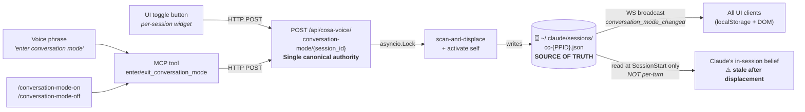

# Background Synthesis — Today's Conversation Mode Architecture

**Purpose**: distill the two predecessor docs into one read-before-implementation reference so the May 12 canonical plan isn't read in a vacuum. Implementers should read this doc to understand what exists today, then the canonical plan, then the relevant per-phase design doc before touching code.

**Predecessors**:
- [`../2026.04.27-conversation-mode-design.md`](../2026.04.27-conversation-mode-design.md) — original v1 design + §11 v1.1 mutex addendum (264 lines)
- [`../2026.04.30-conv-mode-three-layer-enforcement/01-design.md`](../2026.04.30-conv-mode-three-layer-enforcement/01-design.md) — three-layer enforcement refinement (369 lines)

**Companion**: [`00-index.md`](00-index.md), [`2026.05.12-tts-interaction-mode-solo-chorus.md`](2026.05.12-tts-interaction-mode-solo-chorus.md), [`03-open-questions.md`](03-open-questions.md)

---

## 1. What "conversation mode" is today

Conversation mode is a **per-session render-mode signal** that, when active, makes Claude auto-`notify()` its full reply on every closing turn so the response reaches the user via TTS without manual intervention. It originated as a single-session feature (April 27), grew a multi-session mutex (April 28, §11), and gained three-layer enforcement to handle Claude's stale-belief problem (April 30).

The system today comprises **four coupled mechanisms**:

1. **Per-session state** — a single boolean `conversation_mode_active` per Claude Code session, held in a bridge file.
2. **Multi-session mutex** — at most one session has `conversation_mode_active=true` across all of the user's CC sessions, enforced server-side via scan-and-displace.
3. **Three-layer enforcement** — inbound text wrapping, MCP param override, and Stop-hook auto-narrate, all gated on bridge state.
4. **UI rendering** — sender-card pinning, soft-green-glow visual cue, bell↔phone toggle, displaced-event handlers.

These four mechanisms are what solo mode preserves and what chorus mode partly replaces.

---

## 2. The three coupled state surfaces

| Surface | Where | Update cadence | Authority |
|---|---|---|---|
| Bridge file | `~/.claude/sessions/cc-{PPID}.json` | Every toggle | Canonical |
| UI cache | localStorage + DOM | WS event `conversation_mode_changed` | Read-through cache of bridge |
| Claude's belief | In-context `get_session_info()` call | **Once at SessionStart only** | Read-through; can go stale |

**The architectural gap**: Claude's in-session belief is set once at SessionStart and never refreshed. When session A is displaced by session B activating conversation mode, A's bridge flips to `false` and A's UI unpins — but A's Claude still believes it's the holder. A's next assistant turn calls `notify()` with conv-mode params (`priority="high"`, `suppress_ding=True`), causing cross-talk: the user hears both A's response and B's response, even though only B is "supposed" to be speakerphone-active.

The three-layer enforcement (April 30) exists specifically to mitigate this gap.

---

## 3. The multi-session mutex (April 28, §11)

**Invariant**: at most one bridge with `conversation_mode_active=true` exists in `SESSION_DIR` at any time per OS-user.

**Mechanism** (`src/cosa/rest/routers/conversation_mode.py:164-225`):

1. POST `/api/cosa-voice/conversation-mode/{sid}` with `{"active": true}` arrives.
2. The router acquires `asyncio.Lock()`.
3. `find_active_conversation_sessions()` scans `SESSION_DIR` for any other bridge with `active=true`.
4. For each found: atomically flip `active=false` in that bridge, broadcast `conversation_mode_changed` with `displaced=true, displaced_by=<requester_sid>`, push `action:exit_conversation_mode` listener action to that session.
5. Activate self: write `active=true` to the requester's bridge, broadcast `conversation_mode_changed`.
6. Release Lock.
7. Response includes `displaced_sessions: list[str]`.

**All four activation surfaces** (UI POST, voice phrase, slash command, MCP tool) route through this endpoint. The MCP tool was refactored (decision §11.2) to call the canonical HTTP endpoint internally — it does NOT write the bridge directly — so the mutex applies uniformly.

**User-only initiation** (decision §11.3): Claude must NEVER call `enter_conversation_mode()` or `exit_conversation_mode()` on its own initiative. Only in direct response to a user utterance (voice phrase, typed request, slash command). Documented in three concentric layers: MCP `instructions=` block + tool docstrings + `~/.claude/skills/conversation-mode-guardrails/SKILL.md`.

**HTTP-fallback bypass** (known risk, Risk #7 in the April 30 doc): when the FastAPI endpoint is briefly unreachable, the MCP tool falls back to direct bridge write at `cosa_voice_mcp.py:1295` with NO scan-and-displace. Both sessions could end up `active=true` simultaneously. Documented but not yet patched.

---

## 4. The three-layer enforcement (April 30)

Each layer is independently gated on `get_conversation_mode(session_id)`:

### Layer 1 — Input wrapping (`conv_mode_wrap` helper)

Wraps inbound-to-Claude text at injection points with a two-surface XML envelope when conv mode is active:

- For voice source: `<voice-message from-distance="true" priority="high" suppress-ding="true">{sanitized_user_text}</voice-message>` + trailing `<system-reminder>{contract_body}</system-reminder>`.
- For other sources (terminal-typed, hook-idle-prompt, hook-permission-prompt): `{sanitized_text}` + trailing `<system-reminder>{source-specific contract_body}</system-reminder>`.

**Injection-point coverage** (Phase 2 of the April 30 plan):
- `cc_notification_listener._inject_via_tmux` — voice text injected via tmux.
- `user_prompt_submit` hook — terminal-typed prompts.
- `anything_else_ask` — idle-aware Stop-hook re-prompts.

**Explicitly NOT wrapped** (outbound paths):
- `permission_request.py`, `notification.py`, `_send_gist_response` — TTS-to-user paths. Wrapping them would corrupt the user's TTS feed.

**Sanitization** (`sanitize_for_wrap`): strips user content from the first occurrence of `</voice-message` or `<system-reminder` (case-insensitive) to end-of-string. Closes the prompt-injection escape vector without sacrificing the structural XML format.

### Layer 2 — MCP param override (`_notify_impl` bidirectional gate)

When `notify()` is called, `_notify_impl` (cosa_voice_mcp.py:723-834) consults the bridge:

- **Bridge=true** (conv mode active): force `suppress_ding=True`, force `priority="high"` if lower, strip fenced code blocks from message.
- **Bridge=false + sender is CC + caller passed `suppress_ding=True`**: invert `suppress_ding` to `False` so the user hears a ding. This is the **cross-talk audible cue** — when a displaced session leaks a quiet notify, the user is signaled audibly that the session has stale belief.
- **Bridge=false + non-CC sender OR `suppress_ding=False`**: pass-through unchanged.
- **`_internal_call=True`**: bypass the gate entirely (used by `set_session_topic` and other internal MCP tools).

This is the cross-talk leak cue that the May 12 plan removes in chorus mode (because in chorus, a quiet notify is a legitimate pattern, not a leak symptom).

### Layer 3 — Stop-hook auto-narrate

Fires after every assistant turn:

- If `conv_mode_active=false`: pass-through.
- If the last turn contains an `mcp__cosa-voice__notify` ToolUseBlock: pass-through (Claude self-narrated).
- If `last_autonarrated_turn_id` in bridge equals current turn: pass-through (already narrated).
- Else: extract TextBlock text from the transcript, strip code blocks, drop tool-call narration paragraphs, call `send_tts(..., priority="high", suppress_ding=True)`, stamp `last_autonarrated_turn_id`.

This catches "console-only response" failures where Claude wrote a reply but forgot to call `notify()`.

---

## 5. UI rendering (multiplexer side)

- **Per-session toggle widget** in the sender-card header — bell icon (default/notification mode) vs phone icon (conversation mode active).
- **Pinning**: when any session has `active=true`, its sender card is pinned to DOM index 0 of `#notifications-list`. Both copies of `moveSenderCardToTop` were patched to respect the pin (lines ~9317 and ~15163).
- **Visual cue**: soft green glow border + box-shadow on the active card, matching the corner-pause-button accent palette.
- **Displaced events**: WS event with `displaced=true, displaced_by=<sid>` triggers `pauseTTS()` on the displaced session's UI, unpins the card, flips the toggle to bell.
- **localStorage convention**: `notifications_conversation_modes` is an object keyed by `session_id` (matches the `SESSION_NAMES_KEY` pattern). Not suffixed keys.

---

## 6. What solo mode preserves (pixel-perfect)

Solo mode's contract: behave **identically** to today's system. The May 12 plan's `tts interaction mode = solo` branch wraps all of the above behind a mode check that defaults to "behave as today."

| Mechanism | Solo behavior |
|---|---|
| Per-session bridge field | `speakerphone_on` (renamed from `conversation_mode_active`); default `false` for new sessions |
| Multi-session mutex | Active — scan-and-displace runs on every activate |
| Asyncio.Lock | Held during activate/deactivate |
| `find_active_speakerphone_sessions` (renamed helper) | Used by displacement scan |
| Layer 1 (input wrap) | Active when speakerphone is on |
| Layer 2 (param override) | Active in both directions (forces conv-mode params when on; cross-talk cue when off + CC + suppress_ding=True) |
| Layer 3 (Stop-hook auto-narrate) | Active when speakerphone is on |
| UI toggle widget | bell↔phone (today's UI) |
| Pinning + soft-green-glow | Active when any session is speakerphone-on |
| Displaced events | Fire on displace |
| User-only initiation rule | Enforced in MCP tool docstrings + per-turn server rider |

The naming rename (`conversation_mode_*` → `speakerphone_*`) is applied to solo and chorus uniformly — solo's behavior doesn't change, only the labels.

---

## 7. What chorus mode changes

Chorus mode's contract: N sessions can be speakerphone-on simultaneously. Persona voices disambiguate at the listener's ear; the cosa-voice TTS queue already serializes playback.

| Mechanism | Chorus behavior | Why |
|---|---|---|
| Per-session bridge field | Default `true` for new sessions | At-distance is the default |
| Multi-session mutex | **Disabled** — no scan, no displace | Multiple holders are valid |
| Asyncio.Lock | **Not held** on activate | No mutex to protect |
| `find_active_speakerphone_sessions` | Helper exists but **not called** in chorus path | Solo branch still uses it |
| Layer 1 (input wrap) | Active when speakerphone is on (same as solo) | Wrapping doesn't depend on mutex |
| Layer 2 (param override) | **One-directional** — only the bridge=true branch runs; the cross-talk cue (bridge=false + CC + suppress_ding=True → invert) is **disabled** | In chorus, quiet notify is a legitimate pattern, not a leak symptom |
| Layer 3 (Stop-hook auto-narrate) | Active when speakerphone is on (same as solo) | Stop-hook coverage doesn't depend on mutex |
| UI toggle widget | phone↔speaker (new UI) | Both states valid steady-states; no "currently displaced" intermediate to signal |
| Pinning + soft-green-glow | **Disabled** | No single active session to highlight |
| Displaced events | **Not emitted** | No displacement |
| User-only initiation rule | Enforced same as solo | Orthogonal to mutex semantics |

**Rider content also varies** between modes — see the May 12 plan §"Server changes" for the 4-variant rider matrix (solo+speakerphone-on / solo+phone / chorus+speakerphone-on / chorus+phone). The relevant difference: solo riders include a monopoly notice ("activating in another session will displace you"); chorus riders don't.

---

## 8. Known risks carried into both modes

These predecessors-doc risks remain relevant for solo and chorus:

| # | Risk | Status |
|---|---|---|
| 1 | **Multi-worker uvicorn lock** — `asyncio.Lock` is process-local; doesn't survive `--workers N`. Affects solo only (chorus doesn't use the Lock). | Documented, deferred. If Lupin moves to multi-worker, solo's mutex needs Redis or DB advisory lock. |
| 2 | **MCP HTTP-fallback bypass** — when the FastAPI endpoint is briefly unreachable, the MCP fallback writes the bridge directly without scan-and-displace. Affects solo only. | Risk #7 in April 30 doc; documented, deferred. |
| 3 | **Claude's stale belief** — set once at SessionStart, never refreshed. The three-layer enforcement mitigates but doesn't fully solve. | Both modes inherit. The May 12 plan's per-turn rider injection (via the hook system-reminder) provides per-turn refresh, partially closing the gap. |
| 4 | **Discipline drift** — Claude may forget to auto-`notify()` despite the rider. Layer 3 (Stop-hook auto-narrate) catches this. | Both modes inherit. |
| 5 | **`<voice-message>` envelope injection vector** — user voice content containing literal `</voice-message` or `<system-reminder` strings. `sanitize_for_wrap` closes this. | Both modes inherit; sanitization runs in both. |
| 6 | **Per-session TTS queue isolation** — today single global queue at the listener's ear. Solo's mutex means only one session speaks anyway; chorus relies on the queue serializing N voices at the user's ear. | Chorus-specific risk to monitor: does the global queue suffice when N sessions speak concurrently, or do we need fairness/priority semantics? Audit candidate. |
| 7 | **Pre/post tool use injection paths** — Phase 2 of the April 30 plan audited but didn't exhaustively sweep. May still harbor un-wrapped inbound paths. | Both modes inherit. Re-sweep recommended before Phase 6 of the solo/chorus plan (hook rider content split). |

---

## 9. File-level hot paths (current line numbers)

| File | Purpose | Current line span |
|---|---|---|
| `src/cosa/rest/routers/conversation_mode.py` | HTTP router + mutex enforcement | ~286 lines; mutex logic at 164-225 |
| `src/lupin_mcp/cosa_voice_mcp.py` | MCP server, `notify` + tools | `_notify_impl` 723-834; `get_session_info` 1283-1322; `_flip_conversation_mode` + tools 1325-1465 |
| `src/lupin_cli/claude_code/hooks/lib/session_bridge.py` | Bridge file getters/setters | Conv-mode helpers 653-807 |
| `src/lupin_cli/claude_code/hooks/lib/hook_common.py` | Per-turn rider builder + `conv_mode_wrap` | 1005-1200 |
| `src/lupin_cli/claude_code/hooks/lib/cc_notification_listener.py` | Voice listener + tmux inject | Search for `action:exit_conversation_mode` |
| `src/lupin_cli/claude_code/hooks/user_prompt_submit.py` | Terminal prompt wrap | 52-92 |
| `src/lupin_cli/claude_code/hooks/stop.py` | Stop-hook auto-narrate | Front of stop hook (added April 30) |
| `src/fastapi_app/static/js/multiplexer/` | Multiplexer UI | Sender card, toggle, pinning, displaced handlers |

Note: the line numbers above describe today's code. The solo/chorus refactor rewrites these to be mode-aware; phase-specific design docs (`10`–`17`) will track the new line ranges as each phase lands.

---

## 10. Reading order for implementers

1. **This doc** (`02`) — understand today's system as a coherent whole.
2. **Canonical plan** (`2026.05.12-tts-interaction-mode-solo-chorus.md`) — understand the proposed change.
3. **Open questions** (`03`) — see what's deferred and why.
4. **The relevant phase design doc** (`10` for Phase 1 INI plumbing, `11` for Phase 2 bridge rename, etc.) — read this before touching code for that phase.
5. **Decisions log** (`90`) — consult when you hit a design question that feels like it should be settled.

If you find yourself confused by a design choice that isn't explained in the canonical plan or the relevant phase doc, that's a signal to check the predecessors or open a new entry in `03-open-questions.md`.
