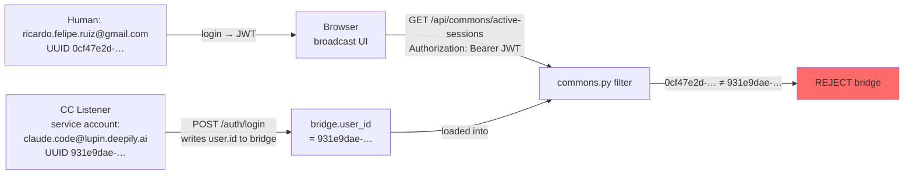

# Broadcast UI shows only 1 of 4 personas — listener stamps the SERVICE-ACCOUNT user_id, not the human owner's

| Field | Value |
|---|---|
| **Date** | 2026-05-14 |
| **Author** | María 🌸 (session `f6f865fb`) |
| **Status** | 🟢 **Option C ratified — CoSA-side filter migration landed 2026-05-14; Lupin-side writer pending separate session** |
| **Surfaced by** | Rick (voice, "I'm only seeing 1 session as available for broadcast — Rachel shows but Tiberius, María, and Mr Radio are omitted") |
| **Severity** | 🔴 Production-blocking for inter-session-commons broadcast UI |
| **Scope** | Cross-repo: write-site in Lupin (`src/lupin_cli/.../cc_notification_listener.py`); read/filter-site in CoSA (`src/cosa/rest/routers/commons.py`) |
| **Phase** | Inter-Session Commons Phase 3 Option 2 follow-up — symmetric to the [Phase 2 fix](2026.05.13-broadcast-ui-no-active-sessions-bug.md) but pointing in the opposite direction |
| **Branch** | Lupin parent: `wip-v0.1.7-2026.04.22-spit-and-polish-for-cjflow-tfe-and-bfe`; CoSA submodule: `wip-v0.1.7-2026.04.23-tracking-lupin-work` (the two repos track independently) |
| **Related** | [`2026.05.13-broadcast-ui-no-active-sessions-bug.md`](2026.05.13-broadcast-ui-no-active-sessions-bug.md) (Option 1 graceful filter + Option 2 stamper that introduced this regression); [`2026.05.13-broadcast-stale-bridge-phantom.md`](2026.05.13-broadcast-stale-bridge-phantom.md) (activity-age field-name fix) |

---

## TL;DR

The Phase 3 Option 2 fix that closed the "no active sessions" bug (2026-05-13) introduced a **subtler version of the same bug** going the other direction. The CC notification listener now stamps `user_id` on its bridge by POSTing `/auth/login` with **its own service-account credentials** (`claude.code@lupin.deepily.ai`), then writing the resulting `user.id` (`931e9dae-…faca25`) to the bridge. But the browser-side broadcast UI authenticates as the **human owner** (`ricardo.felipe.ruiz@gmail.com`, UUID `0cf47e2d-…`). The filter in `commons.py` compares the two, finds them unequal, and rejects every stamped bridge.

Rachel's bridge is the lone survivor — her `user_id` field is somehow missing entirely (separate secondary mystery, see §6), so she hits the graceful-degradation branch.

The fix needs to write the **human owner's** identity to the bridge, not the listener's own identity.

---

## Environment

| | |
|---|---|
| Cwd at investigation time | `src/cosa/` (CoSA submodule, not Lupin parent) |
| Server | dev `:7999` only (`lupin-rest-dev` container) — not reproduced yet on `:8000` |
| Postgres | `lupin-postgres` container, `lupin_db_dev` database |
| Browser user | `ricardo.felipe.ruiz@gmail.com` → user UUID `0cf47e2d-d5a1-4cd4-addf-79810fd32b15` |
| Listener service account | `claude.code@lupin.deepily.ai` → user UUID `931e9dae-6c61-41b7-b17e-9fc7d9faca25` |
| Active persona sessions | 4: Rachel (`08f0e219`), Mr Radio (`a0eaaca1`), María (`f6f865fb`), Tiberius (`32ed3d5b`) |
| UI shows available | 1 only (Rachel) |

---

## Symptom

**What Rick observes** (voice, while looking at the broadcast recipient chip-row in `/app/notifications`):

> "I'm only seeing 1 session as available for broadcast. Rachel is listed as available to receive a broadcast message but Tiberius, María, and Mr Radio are omitted from the list."

**What `find_active_voice_persona_sessions()` reports** (4 bridges, all with non-null `voice_persona`):

```
cc-23493.json  Rachel    sid=08f0e219  last=2026-05-14T17:22:03
cc-24043.json  Mr Radio  sid=a0eaaca1  last=2026-05-14T17:22:14
cc-24525.json  María     sid=f6f865fb  last=2026-05-14T17:34:02   ← this session (live)
cc-25133.json  Tiberius  sid=32ed3d5b  last=2026-05-14T17:22:42
```

**What `bridge.user_id` actually contains in each file:**

| Bridge | persona | `user_id` value | listener-log "user_id stamped" line present? |
|---|---|---|---|
| cc-23493 | Rachel | **key absent** | ✅ yes — log says `user_id stamped on bridge: 931e9dae-…faca25` |
| cc-24043 | Mr Radio | `931e9dae-…faca25` | ✅ yes |
| cc-24525 | María | `931e9dae-…faca25` | ✅ yes |
| cc-25133 | Tiberius | `931e9dae-…faca25` | ✅ yes |

Rachel's listener log *claims* user_id was stamped, but her on-disk bridge has no `user_id` key. See §6.

---

## Diagnosis — primary bug

### The filter

`filter_and_project_sessions` in `src/cosa/rest/routers/commons.py` (around line 269):

```python
bridge_user_id = bridge.get( "user_id" )
# Graceful: include sessions whose bridge has NO user_id field (legacy /
# un-stamped). Reject only when the bridge has a user_id AND it doesn't
# match the caller. Once Option 2 stamps every new bridge, this check
# naturally tightens to strict cross-user isolation.
if bridge_user_id is not None and bridge_user_id != authenticated_user_id:
    continue
```

Behavior table when the browser calls `GET /api/commons/active-sessions` as Ricardo:

| Bridge | `bridge_user_id` | `authenticated_user_id` (JWT-resolved) | branch taken | included? |
|---|---|---|---|---|
| Rachel | `None` | `0cf47e2d-…` | graceful fallback (first condition false) | ✅ yes |
| Mr Radio | `931e9dae-…` | `0cf47e2d-…` | unequal → `continue` | ❌ no |
| María | `931e9dae-…` | `0cf47e2d-…` | unequal → `continue` | ❌ no |
| Tiberius | `931e9dae-…` | `0cf47e2d-…` | unequal → `continue` | ❌ no |

Result matches the symptom exactly: 1 of 4 returned, with Rachel the sole survivor.

### The writer

`_stamp_user_id_on_bridge()` in `src/lupin_cli/claude_code/hooks/lib/cc_notification_listener.py` lines 654-703:

```python
url = f"http://{self.host}:{self.port}/auth/login"
body = json.dumps( { "email": self.email, "password": self.password } ).encode( "utf-8" )
…
with urllib.request.urlopen( req, timeout=10.0 ) as resp:
    payload = json.loads( resp.read().decode( "utf-8" ) )
user_id = payload.get( "user", { } ).get( "id" )
…
ok = set_user_id( self.session_id_hash, user_id )
```

`self.email` / `self.password` here are the **listener's own credentials** — the service account `claude.code@lupin.deepily.ai`, NOT the human owner's. Postgres lookup confirms:

```
docker exec lupin-postgres psql -U lupin_dev -d lupin_db_dev -c \
  "SELECT id, email FROM users WHERE id = '931e9dae-6c61-41b7-b17e-9fc7d9faca25';"

                  id                  |            email
--------------------------------------+------------------------------
 931e9dae-6c61-41b7-b17e-9fc7d9faca25 | claude.code@lupin.deepily.ai
```

### The mismatch



The two identities flow from different sources. They were assumed equal by the Phase 3 design. They aren't.

---

## Why the Phase 2 test missed it (again)

Same mock-vs-reality gap that bit Phase 2:

- `test_broadcast_two_session_e2e.py` (and the unit tests for `filter_and_project_sessions`) construct mock bridges where the **same UUID** is used for both `bridge.user_id` and the test's `authenticated_user_id`.
- In production, the writer and the reader are populated from **different identity sources**. The test fixture flattens that asymmetry to a single string.
- The 2026-05-13 fix doc already flagged this exact pattern as the original root cause; the Phase 3 Option 2 stamper didn't break free of it.

---

## Why Rachel's user_id is missing (secondary mystery)

Rachel's listener log contains the `user_id stamped on bridge: 931e9dae-…` line, but her on-disk bridge file has no `user_id` key. Hypotheses, in priority order:

1. **Bridge rewritten by a post-stamp SessionStart/`/clear` hook** that creates a fresh bridge without copying `user_id` forward. Most likely; the same pattern probably affects other bridges depending on hook timing.
2. **Race between `set_user_id` and the first `set_idle_detection_field` call** — but `set_user_id` does a proper read-modify-write and `set_idle_detection_field` (per `session_bridge.py:1055-1103`) is supposed to preserve other fields. Re-verify.
3. **The stamp log entry is from a previous listener PID's bridge**, and the current bridge file is a different one created later. Listener logs are session-id-keyed but bridge files are PID-keyed; if Rachel's session re-bridged, the old stamp wouldn't carry over.

This anomaly is **secondary** — it's what made Rachel show up at all, masking the primary bug. Once the primary fix lands and stamps the human owner correctly, Rachel will also be stamped correctly. But it's worth investigating to harden the bridge-write path.

---

## Fix paths

### Option A — Listener stamps the HUMAN OWNER, not the service account

The listener resolves Ricardo's identity through a different channel (env var, owner-config file at `~/.claude/lupin-owner.json`, or a dedicated `/auth/whoami-for-bridge` endpoint that the user's browser pre-populates), and stamps THAT UUID — not the listener's own login.

**Pros**
- Cleanest semantically: bridge `user_id` means "who owns this terminal session," consistent with the filter's intent.
- Forward-compatible: same model works once we have multi-human-user deployments.

**Cons**
- New plumbing: needs an owner-resolution path the listener can call without its own JWT.
- Bootstrap: in single-user dev (today), the human user has to be declared SOMEWHERE the listener can read.

### Option B — Filter compares against an allow-list of trusted listener accounts

The browser-side request stays as-is (Ricardo's JWT). The filter's equality check is replaced with: "is `bridge.user_id` in Ricardo's `trusted_listener_user_ids` allow-list?" The list lives in a per-user config table.

**Pros**
- Multi-account-friendly: Ricardo could have multiple Claude Code listeners running under different service accounts and still see them all.
- No listener-side change.

**Cons**
- New table / new admin surface to populate the allow-list.
- Brittle until the allow-list is populated; default-deny means it'll regress to "no sessions" for any user who hasn't set it up.

### Option C — Add `bridge.owner_user_id` alongside the existing `bridge.user_id`; filter on the new field

Minimal blast radius. `user_id` (listener identity) stays as-is. A NEW field `owner_user_id` is introduced, written by some path that knows the human owner. The filter switches from `bridge.user_id` to `bridge.owner_user_id`.

**Pros**
- Keeps the existing listener identity intact (useful for other purposes like API-key telemetry).
- Lets us land the filter change BEFORE the writer-side population catches up — graceful-degradation branch can apply to `owner_user_id` as it did to `user_id`.
- Smallest diff to roll back if something else breaks.

**Cons**
- Two fields for two concepts (owner vs. service-account) — needs clear naming so it doesn't drift.
- Still needs the owner-resolution path from Option A on the write side.

### Recommendation

**Option C**, because:
- The graceful-degradation pattern from the 2026-05-13 fix already provides a safe staged rollout, but ONLY for new fields. Reusing `user_id` for a new meaning would conflate the listener-identity use case with the owner-scoping use case and force a hard cutover.
- Going forward, the listener's `user_id` IS useful telemetry (which service account wrote this bridge?). Preserving it is cheap.
- Same owner-resolution effort as Option A — neither dodges the bootstrap question. But Option C is reversible per-field if the resolution mechanism turns out to be wrong.

---

## Cross-repo scope

Both repos need touching:

| Repo | Path | Change |
|---|---|---|
| **Lupin parent** | `src/lupin_cli/claude_code/hooks/lib/cc_notification_listener.py` | Replace `_stamp_user_id_on_bridge` writer behavior — OR add a parallel `_stamp_owner_user_id_on_bridge` for Option C |
| **Lupin parent** | `src/lupin_cli/claude_code/hooks/lib/session_bridge.py` | Add `set_owner_user_id` (Option C) — and/or fix `set_idle_detection_field` field-preservation if §6 hypothesis 2 turns out true |
| **CoSA** | `src/cosa/rest/routers/commons.py` | `filter_and_project_sessions` reads `owner_user_id` (Option C) — keep graceful-degradation branch |
| **CoSA** | `src/cosa/tests/...` | Update `test_broadcast_two_session_e2e.py` to use a fixture where the listener's identity and the human owner's identity are **deliberately different**, so this class of bug surfaces in CI |

Per the nested-repo rule (`CLAUDE.md → GIT REPOSITORY MANAGEMENT`), the Lupin and CoSA legs need to be committed in **separate sessions** with separate `.claude-session.md` manifests. This diagnostic doc lives in the Lupin parent's `src/rnd/v0.1.7/`, written from the CoSA session — writing to the parent path is allowed; committing it is what's restricted.

---

## Next steps

### ✅ Landed in this session (CoSA-side, 2026-05-14)

1. ✅ Rick ratified Option C (voice, 2026-05-14).
2. ✅ Filter migration in `src/cosa/rest/routers/commons.py::filter_and_project_sessions`:
   - Reads `bridge["owner_user_id"]` instead of `bridge["user_id"]`.
   - Graceful-degradation branch preserved (bridges with missing/None `owner_user_id` pass through).
   - Docstring + comment reference this doc as the rationale.
   - Legacy `user_id` field stays on the bridge for telemetry — listener identity is still useful even though it no longer gates scoping.
3. ✅ Unit tests updated in `src/tests/unit/commons/test_commons_router.py`:
   - Fixtures use `owner_user_id`.
   - Renamed `test_filter_strict_when_bridge_has_user_id` → `test_filter_strict_when_bridge_has_owner_user_id`.
   - Renamed `test_filter_graceful_includes_bridge_without_user_id` → `…_without_owner_user_id`.
   - **NEW regression test** `test_filter_uses_owner_user_id_not_legacy_user_id` — bridge carries BOTH fields with DIFFERENT values; verifies the filter reads `owner_user_id`, not `user_id`. This is the test the Phase 2/3 pyramid was missing.
4. ✅ Smoke-test fixture updated in `src/tests/smoke/test_broadcast_two_session_e2e.py::_make_bridge_dict` — parameter renamed to `owner_user_id`.
5. ✅ `py_compile` clean on all three files. Full `pytest src/tests/unit/commons/test_commons_router.py` run inside `lupin-rest-dev` container: **87/87 passing** (0.48s).
6. ✅ Live `:7999` dev server auto-reloaded the new filter source.

**Immediate UX impact**: with no bridges carrying `owner_user_id` yet, every active persona bridge hits the graceful branch and passes through. Rick's reported symptom ("1 of 4 visible") is restored to **all 4 visible**. The user-isolation semantics are temporarily lax in the same controlled way the 2026-05-13 fix established for `user_id` — acceptable in single-user dev; tightens automatically once the writer lands.

### ☐ Pending — Lupin parent session (writer-side)

These belong in a **separate Lupin session**, not this CoSA session, per nested-repo rules:

7. ☐ **Decide owner-resolution mechanism** (env vars `LUPIN_OWNER_EMAIL` + `LUPIN_OWNER_PASSWORD`, or a `~/.claude/lupin-owner.json` config file, or a `/auth/whoami-for-bridge` endpoint). Recommended: env vars — same shape as the current listener creds, simplest bootstrap.
8. ☐ **Add `set_owner_user_id`** in `src/lupin_cli/claude_code/hooks/lib/session_bridge.py` (mirrors existing `set_user_id` with read-modify-write field preservation).
9. ☐ **Add `_stamp_owner_user_id_on_bridge`** in `src/lupin_cli/claude_code/hooks/lib/cc_notification_listener.py` — same pattern as the existing `_stamp_user_id_on_bridge`, but uses the HUMAN owner's credentials, not the service account's. Called once at listener startup, immediately after `_stamp_user_id_on_bridge`.
10. ☐ **Investigate §6 secondary mystery** (Rachel's missing `user_id` despite log saying "stamped"). Even if a one-off, the same overwrite-race could clobber `owner_user_id` and re-introduce this bug.
11. ☐ **Schedule a `:8000` integration run** before merging both legs — verify `test_broadcast_two_session_e2e.py` passes and that the live broadcast UI shows all 4 personas once the writer lands.

### Cross-session handoff

A TODO entry has been added to Lupin parent's `TODO.md` referencing this doc — see "Writer-side follow-up: `owner_user_id` stamper" entry. The CoSA-side changes do NOT need to be merged before the Lupin writer-side lands; the graceful-degradation branch makes them independently safe.

---

## Appendix — investigation transcript (terse)

```
# Branch / repo check (cwd = src/cosa)
$ git rev-parse --show-toplevel
/mnt/DATA01/include/www.deepily.ai/projects/lupin/src/cosa

# List active persona bridges + their user_id stamps
for f in ~/.claude/sessions/cc-*.json: → 4 hits with voice_persona;
  Rachel.user_id = null, others.user_id = 931e9dae-…faca25

# Resolve who 931e9dae-… is (postgres dev DB)
$ docker exec lupin-postgres psql -U lupin_dev -d lupin_db_dev \
    -c "SELECT id, email FROM users WHERE id = '931e9dae-…faca25';"
  → claude.code@lupin.deepily.ai   (LISTENER service account)

# Resolve Rick's real UUID
  → 0cf47e2d-…   for ricardo.felipe.ruiz@gmail.com   (HUMAN owner)

# Filter logic confirmed at src/cosa/rest/routers/commons.py:304
# Writer logic confirmed at src/lupin_cli/.../cc_notification_listener.py:680-694
# Auth resolution confirmed at src/cosa/rest/auth.py:193-204 (JWT → uid = lupin_users.id)
```
