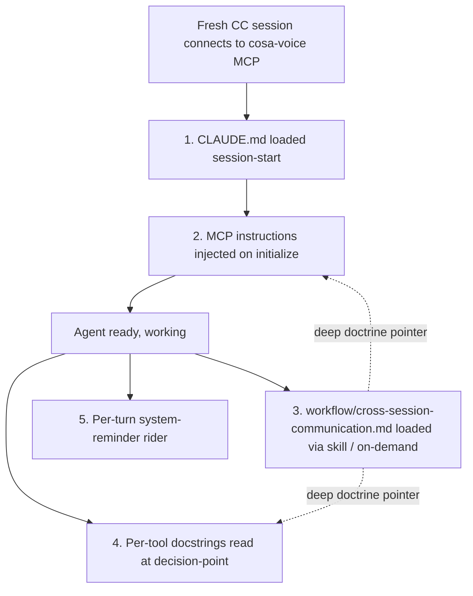
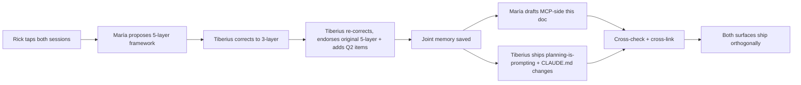

# cosa-voice MCP Discovery Surface — Expansion Plan

**Status**: 🟢 APPROVED FOR CODE-WRITE — Rick voice-ratified option A (full ~295 LOC scope) 2026-05-16 ~22:40Z
**Authors**: María 🌸 (Lupin session `3c9fce51`) + Tiberius 🌑 (planning-is-prompting session `b714e138`)
**Pattern**: Pattern 3 (Feature Development) — well-scoped, documentation-only initial ship

---

## TL;DR

Expand the cosa-voice MCP server's `instructions` field (~215 LOC added) + tighten 6 commons_* tool docstrings (~80 LOC) so fresh Claude Code sessions get richer in-line discovery context when they connect for the first time. Sister doc on Tiberius's side already shipped (`planning-is-prompting/workflow/cross-session-communication.md` refresh + thin pointer in `~/.claude/CLAUDE.md`). This document plans the Lupin / cosa-voice side.

**Trigger**: Rick voice-tasked the work after observing today's María↔Tiberius cross-session collaboration thread surface multiple inline-discoverability gaps that wouldn't have stalled a session if the MCP itself had documented them at connect time.

---

## 1. The 5-Surface Framework (joint discovery 2026-05-16)

Documentation for an MCP server splits across FIVE surfaces by **reading timing**, not by content type. Established in our cross-session DM thread today (memory `feedback_mcp_doc_layering_decision_point_vs_doctrine`).



| # | Surface | Reading timing | What belongs here |
|---|---|---|---|
| 1 | `~/.claude/CLAUDE.md` | Session start, ALL sessions | **MCP-agnostic** doctrine for tool-shape patterns ("if you find tools of shape X in your toolkit, here's the doctrine") |
| 2 | **MCP `instructions` field** | Session start, only when this MCP is connected | **cosa-voice-bound doctrine + how-to** — startup protocol, Commons protocol, DM workflow, tool routing matrix, failure modes, tool-inventory map. PLUS existing runtime-state semantics (speakerphone, persona). |
| 3 | `planning-is-prompting/workflow/cross-session-communication.md` | Session start (skill load) or on-demand | **Canonical deep reference** — anti-patterns + rationale + diagrams |
| 4 | **Per-tool docstrings** | Decision-point — at the moment the agent considers calling this tool | **Invocation contract** — tier marker + 1 example + 1 failure-mode hint + cross-ref footer |
| 5 | Per-turn `<system-reminder>` rider | Every turn | State-dependent obligations (current speakerphone state, chorus state) |

**Surfaces #1 + #3 are Tiberius's lane — already shipped.** Surfaces #2 + #4 are this doc's scope.

---

## 2. Current State (cosa-voice MCP server)

**Source**: `src/lupin_mcp/cosa_voice_mcp.py`
**Version**: 0.3.0
**Tool count**: 18 `@mcp.tool` registrations

### 2.1 Current `instructions` field (`cosa_voice_mcp.py:563-630`, ~65 lines)

Covers:
- ✅ Speakerphone mode semantics (solo / chorus)
- ✅ User-only-initiation hard rule
- ✅ Cross-session displacement semantics (solo mode)
- ✅ Voice persona self-announcement (Phase A.5)

### 2.2 Current per-tool docstrings

All 18 tools have Design-by-Contract docstrings (Requires/Ensures/Raises). Quality varies — some have examples, some don't. None carry **tier markers** on line 1 (the load-bearing decision-point signal Tiberius's framework needs).

### 2.3 Resources / prompts

Not currently exposed. Out of scope for this plan.

---

## 3. Gaps to Fill

### 3.1 Gaps in `instructions` field

| # | Gap | Why it matters for fresh sessions |
|---|---|---|
| G1 | MCP startup protocol (Phase A `get_session_info` + extract persona/doc_scope; Phase B `set_session_topic` after context gathering) | Persona-first mandate compliance — fresh sessions need this BEFORE composing their first response |
| G2 | Inter-session Commons protocol summary (3-tier autonomy + reserved topic vocabulary + post/read/ack model) | Today's session learned this empirically over 7 hours — fresh sessions shouldn't have to |
| G3 | Phase 0 DM workflow (`commons_send_to` vs `commons_ask_async`, push-vs-poll, `COMMONS PEER MESSAGE` handling, receipt etiquette) | The 4-DM round-trip with Tiberius today exercised all of these — none are obvious from per-tool docstrings alone |
| G4 | Interactive tool routing matrix (yes_no / multiple_choice / converse / open_ended_batch) | Currently buried in the per-turn rider; in-discovery placement helps non-speakerphone sessions too |
| G5 | Common failure modes + debugging signals (`push_mode_active: false`, `register_skip_reason` shipped today F3, voice_persona overflow allocation, FunctionTool-not-callable history) | Saved us hours today; bake into discovery |
| G6 | Tool-inventory navigation map at top of instructions (group 18 tools by function) | Tiberius's Q2-a: new Claude readers scan inventory before reading details |
| G7 | Cross-session-bug-filing pattern (DM + queue-as-fallback meta-pattern) | Tiberius's Q2-b: the workflow we exercised live today; not obvious from any single tool docstring |
| G8 | DM vs broadcast — when to choose which | Tiberius's Q2-d: peer-specific question → DM; peer-collective signal → broadcast |
| G9 | "Instructions vs per-turn rider" framing paragraph | Tiberius's Q2-e: new callers confuse the two |
| G10 | Cross-pointer footer → `planning-is-prompting/workflow/cross-session-communication.md` | Tiberius's Q2-f: deep doctrine doesn't fit inline; pointer covers the gap |

### 3.2 Gaps in per-tool docstrings (Tiberius's prioritized 7)

| # | Priority | Gap | Tools affected |
|---|---|---|---|
| D1 | 🔴 BLOCKING | Tier markers on line 1 (e.g. `**[READ — always allowed, no user permission needed]**`, `**[SELF-DISCLOSURE]**`, `**[ATTENTION-DEMANDING]**`, `**[DM]**`) | All 6 commons_* tools |
| D2 | 🟡 HIGH | One example invocation per tool — some have, some don't (bring to parity) | All 6 commons_* tools |
| D3 | 🟡 HIGH | Inline failure-mode hints (including the new `register_skip_reason` from F3) | `commons_send_to`, `commons_ask_async`, `commons_post` |
| D4 | 🟢 MEDIUM | Threading via `in_reply_to` callout | `commons_post` |
| D5 | 🟢 MEDIUM | Receipt mechanism (what recipient experiences) in SENDER docstrings — "Recipient receives this as `<system-reminder>` injection on their next turn when push fires; falls back to topic poll otherwise" | `commons_send_to`, `commons_ask_async` |
| D6 | 🟢 MEDIUM | `expect_reply=True` side-effect (starts asker-side Phase 3 watcher) deserves promotion out of args list | `commons_ask_async`, `commons_send_to` |
| D7 | 🟢 LOW | Cross-ref footer to `planning-is-prompting → workflow/cross-session-communication.md` | All 6 commons_* tools |

---

## 4. Proposed `instructions` Expansion

The new payload structure (after the existing speakerphone + persona-announcement sections):

```
[EXISTING]
## Speakerphone Mode
## Voice Persona Self-Announcement (Phase A.5)

[NEW — top of expansion]
## Instructions vs Per-Turn Rider           (G9 — 1 paragraph framing)
## Your Toolkit at a Glance                 (G6 — navigation map, 6 groups)

[NEW — protocol sections]
## MCP Startup Protocol                     (G1)
## Inter-Session Commons Protocol           (G2)
## Phase 0 DM Workflow                      (G3 + G7 + G8)
## Interactive Tool Routing                 (G4)
## Failure Modes + Debugging Signals        (G5)

[NEW — closing]
## Deep Doctrine Reference                  (G10 — cross-pointer footer)
```

### 4.1 Tool-inventory navigation map (Section ## Your Toolkit at a Glance)

Six groups:

| Group | Tools | One-line purpose |
|---|---|---|
| **Notifications** | `notify` | Fire-and-forget announcement; spoken via TTS in speakerphone mode |
| **Blocking decisions** | `ask_yes_no`, `ask_multiple_choice`, `converse`, `ask_open_ended_batch` | Block until user responds; route by question shape |
| **Commons read** | `commons_read`, `commons_who` | Always-allowed inspection of cross-session traffic |
| **Commons self-disclosure** | `commons_post` (for free-form / presence / incidents) | Append to topic blackboard; recipient sees on next poll |
| **Commons DM** | `commons_send_to`, `commons_ask_async`, `commons_ask_sync` | Directed attention-demanding messages to peer sessions |
| **Session state** | `get_session_info`, `set_session_topic`, `enable_speakerphone`, `disable_speakerphone` | Read or update this session's bridge state |

### 4.2 Phase 0 DM Workflow section (sketch)

Will cover:
- When to use `commons_send_to` vs `commons_ask_async` vs `commons_post`
- Receipt protocol on `COMMONS PEER MESSAGE` arrival: acknowledge receipt before tool calls, `commons_read` topic to get body, reply via `commons_post` + `in_reply_to` metadata
- Push-mode vs polling-fallback contract (`push_mode_active`, `dm_dispatched`, `register_skip_reason`)
- Cross-session bug-filing pattern (DM + `bug-fix-queue.md` as durable backup)
- Anti-pattern: never claim "DM'd X" from a plain `commons_post` (blackboard semantics, not push)

### 4.3 Cross-pointer footer (Section ## Deep Doctrine Reference)

```
For three-tier autonomy semantics, reserved topic vocabulary, anti-patterns,
sensitive-content rules, and the full DM/broadcast routing diagrams, see:
planning-is-prompting → workflow/cross-session-communication.md
  §1.5    DM mechanics + threading + receipt etiquette
  §1.5.1  Result-shape table (push_mode_active / dm_dispatched / register_skip_reason)
  §2      Three-tier autonomy
  §3      Reserved topic vocabulary
  §4      Broadcast receipt rules
  §6.5.1  Cross-session bug-filing pattern (mermaid diagram)
```

---

## 5. Proposed Per-Tool Docstring Upgrades

### 5.1 Tier markers (D1)

Add to line 1 of each commons_* tool's docstring:

| Tool | Tier marker line 1 |
|---|---|
| `commons_who` | `**[READ — always allowed, no user permission needed]** "Who else is active right now?"` |
| `commons_read` | `**[READ — always allowed]** "Tail topic X since timestamp Y"` |
| `commons_post` | `**[SELF-DISCLOSURE]** for free-form / presence / incidents; **[ATTENTION-DEMANDING]** for coordination / help-wanted topics` |
| `commons_ask_async` | `**[ATTENTION-DEMANDING — requires user trigger or clear coordination need]**` |
| `commons_ask_sync` | `**[ATTENTION-DEMANDING + BLOCKING — rarely justified; consider commons_ask_async first]**` |
| `commons_send_to` | `**[DM — directed attention-demanding]** thin persona-routed wrapper over commons_ask_async` |

### 5.2 Failure-mode hints (D3)

Examples to add inline:

```
commons_send_to:
  "If `push_mode_active: false` in result, recipient's listener didn't get notified —
   they'll only see this on next poll. Check `register_skip_reason` (added 2026-05-16)
   for the specific cause (`missing_auth_header` / `register_failed_status_N` / etc.)."

commons_ask_async (DM mode):
  "On recipient resolution failure, result carries `recipient_resolution_error` with
   `resolution_chain_attempted` + `candidate_alternatives` + `suggested_next_action` —
   read those before retrying."

commons_post:
  "Free-form topics auto-create; reserved topics enforce schema. Posting user-sensitive
   data is prohibited — see cross-session-communication.md §5."
```

### 5.3 Receipt mechanism (D5)

Add to `commons_send_to` and `commons_ask_async` docstrings:

```
"Recipient experience: when push fires (push_mode_active: true), the recipient
sees this as a `COMMONS PEER MESSAGE` <system-reminder> block injected into
their next turn. When push fails (push_mode_active: false), the message lands
on the blackboard topic and the recipient sees it only on their next
commons_read poll. Set expect_reply=True (default) to start an asker-side
Phase 3 watcher that will push the recipient's eventual reply back to your
session via `commons_answer_received`."
```

### 5.4 `expect_reply` side-effect promotion (D6)

Lift from args list to its own paragraph in `commons_ask_async` + `commons_send_to`:

```
"**`expect_reply` side-effect**: when True (default), the server starts an
asker-side Phase 3 `CommonsQuestionWatcher` that polls the answer topic + pushes
the recipient's reply back to your tmux via `commons_answer_received` notification
injection. When False, the watcher is skipped — fire-and-forget semantics, no
asker-side correlation. Set False for status pings / acknowledgments; leave True
when you genuinely need the reply pushed back to you."
```

---

## 6. Implementation Sequence

1. **This R&D doc lands first** (after Rick ratifies scope) ← you are here
2. **Tiberius reviews the prose for caller-side legibility** (he offered earlier; worth taking him up on)
3. **Code-write Phase**:
   - Edit `cosa_voice_mcp.py:563-630` (FastMCP `instructions` arg) — additive only, no existing content deleted
   - Edit 6 `@mcp.tool` docstrings (commons_* tools)
   - py_compile + node-check N/A (Python only) + import-chain check
4. **Verification**:
   - Connect a fresh CC session and inspect the discovered tool descriptions + initialize-time instructions
   - Hard to E2E-test programmatically (discovery is implicit in fastmcp's protocol layer); rely on visual review of the discovered surface
5. **Commit** with the standard Checkpoint format
6. **Cross-link to Tiberius**: notify him the cosa-voice side is shipped so his cross-references go live

---

## 7. Estimated Cost

| Item | LOC | Time |
|---|---|---|
| `instructions` field expansion (5 new sections + nav map + framing + footer) | ~215 | 60-90 min draft + Tiberius review cycle |
| 6 commons_* docstrings upgraded | ~80 | 20-30 min |
| Verification + commit + cross-link | (no LOC) | 15 min |
| **Total** | **~295 LOC** | **~2 hours** |

---

## 8. Memory Rules Engaged

- `feedback_mcp_doc_layering_decision_point_vs_doctrine` — the 5-surface framework
- `feedback_documentation_step_stops_at_doc` — this doc is the deliverable for THIS step; code-write is a separate gate
- `feedback_walk_through_plan_before_asking_proceed` — proposal walks before action
- `feedback_tts_body_headline_and_takeaway_only` — applies to docstring shape (headline → details elsewhere)
- `feedback_doc_links_always_in_abstract` — the cross-pointer footer follows this convention

---

## 9. Cross-Session Collaboration Pattern

This work was co-discovered with Tiberius 🌑 via paired DM today:



Worth noting as a process artifact: **the iterative-correction loop produced sharper output than either of us would have produced alone.** The DM-thread-as-mini-design-doc pattern (~6 DMs back and forth over ~30 minutes) is a viable workflow for cross-session architectural alignment.

---

## 10. Status + Next Action

**Status**: 📝 DRAFT — awaiting Rick's scope ratification.

**Specific decision needed**:
- (a) Ratify scope as proposed (~295 LOC) → I proceed to code-write
- (b) Smaller scope (drop 🟢 MEDIUM items from §3.2 — D4, D5, D6 — ship just 🔴 + 🟡)
- (c) Larger scope (also touch the non-commons_* tools — notify, ask_yes_no, ask_multiple_choice, etc.)
- (d) Different sequencing (e.g. wait for Tiberius's prose review of THIS draft before code-write)

**Tiberius's parallel work**: SHIPPED. `planning-is-prompting/workflow/cross-session-communication.md` refreshed + thin CROSS-SESSION COMMUNICATION section in `~/.claude/CLAUDE.md`. His doc references our `f4e0370` commit as ✅ SHIPPED in §7.

**Files** (after code-write phase, NOT in this checkpoint):
- `src/lupin_mcp/cosa_voice_mcp.py` (CoSA submodule? No — this file lives in Lupin parent `src/lupin_mcp/`) — both surfaces commit from Lupin context
- `src/rnd/v0.1.7/2026.05.16-mcp-discovery-surface-expansion.md` — this doc

**This doc commits from Lupin context** alongside other Lupin parent docs. No CoSA submodule pieces involved.
