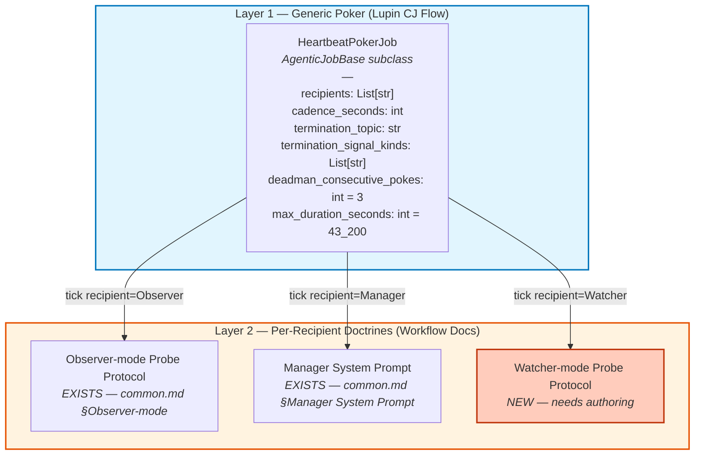
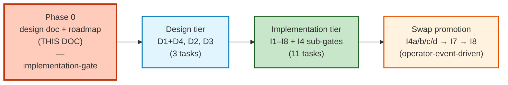

# Generic Heartbeat Poker — Lupin-side Abstraction Design

| Field | Value |
|---|---|
| **Date** | 2026-05-20 (origin) + 2026-05-21 (all ratifications: Q3, doctrine-home γ, persona-allocation out-of-scope, work-breakdown 15-task lock) |
| **Status** | 🟢 **Phase 0 complete — all open Qs ratified + 15-task breakdown locked (2026-05-21, Lupin session `bc15c374`)**. Ready for cascaded plan-review (REUSE → Pass 1 Fitness → Pass 2 Ownership-Language Audit) per the sequential discipline ratified in Phase 0 amendment Q11. |
| **Author** | Tiberius 🌑 (Lupin sessions `173c0b35` + `bc15c374`) + Rick (designer/user) — pre-planning dialogue + work-breakdown ratification |
| **Workflow stage** | Phase 0 complete (formal design doc + roadmap). Pattern 5 (Architecture & Design) selected; Pattern 6 (Research-Driven) framing applied via existing Lupin agentic-job patterns as research inputs. Next: cascaded plan-review. |
| **Related docs** | `planning-is-prompting/workflow/plan-review-cascaded-common.md` §Observer-mode Probe Protocol (the existing parallel recipient-side protocol); `planning-is-prompting/src/rnd/2026.05.17-cascaded-plan-review-pipeline.md` §10.18 (Run-4 retrofit); existing shell-script `lupin/src/scripts/cascade_heartbeat_scheduler.py` |
| **TODO seeds** | Lupin `TODO.md` v1.1 codification close + `--observer` flag + `commons_send_to` routing entries (filed 2026-05-20 by Tiberius session `173c0b35`) |

---

## 1. Origin

End-of-day 2026-05-20 voice-message from Rick to Tiberius 🌑 (Lupin session `173c0b35`):

> "I have some thoughts around design how we could continue to improve the mechanics of this process that we've been working on the last couple days the cascaded review process. Currently, we're counting on the planning is prompting repo to implement and run the heartbeat function what I'd like to do is create an agenticjob object that I can drop into the to-do bucket or schedule to run after midnight while I'm asleep, in which this lightweight job object would contain an abstraction of the heartbeat loop such that at runtime when it instantiated, we can specify we have N number of recipients of these heartbeats such as you and Maria, who may or may not want to be reminded at regular intervals to check on the status of those the work is delegated to like our author and our three reviewers last night. I'd like us to abstract this in such a way as to allow you to queue up a job for the implementer in this case Roscoe, she stopped a dozen times last night and was dormant instead of powering through if we had a generic job object that allowed you to start the job and allow you to check in on her on a regular basis so that she wouldn't pause and so she would power through and at every step or phase completed document and checkpoint her work. Go ahead and start the planning is prompting start here workflow, I want to think out loud my way through how we would abstract something like this for both of these used cases that we've seen in under three days."

**Core ask**: abstract the cascade heartbeat shell-script into a Lupin-side `AgenticJobBase` subclass so it can:
- Drop into the CJ Flow `todo` queue OR schedule via `scheduled_at` (post-midnight off-peak default)
- Take `N` recipients as config (Manager, Observer, Watcher-of-implementer, etc.)
- Serve TWO observed use cases — cascade heartbeat (María + Tiberius last night) + implementer keep-alive (Tiberius watching Roscoe; Roscoe paused ~12 times overnight going dormant; phase-checkpoint enforcement would have kept her powering through)

---

## 2. Three use cases enumerated (per Rick's correction mid-conversation)

| # | Use case | Recipient role | What recipient does on tick |
|---|----------|----------------|------------------------------|
| 1 | **Observer** (María's role in cascade) | Peer session outside the cascade review chain | Probes commons (`commons_who` + `commons_read` on coordination topic); DMs Manager if anything unread |
| 2 | **Manager / Facilitator** (Tiberius cascade role) | Orchestrator at the center of the cascade | Universal-step-zero disk-read on every active topic; checks each worker's last-post timestamp; advances pipeline state |
| 3 | **Watcher of implementer** (Tiberius watching Roscoe-shaped sessions) | Peer session external to the implementer | Probes implementer's commons activity; DMs implementer if dormant; requests phase-checkpoint commit at phase boundaries |

**The structural insight** (Rick's correction at conversation turn 2 was load-bearing): all three use cases share the SAME poker shape — wake `N` peers on a cadence until a termination signal fires. The variance is entirely on the recipient side; the poker doesn't need to know which role-type its recipient is playing.

---

## 3. Two-layer architecture (locked-shape)



**Layer 1 — Generic poker** is use-case-agnostic Lupin infrastructure. ONE class, three pure-config params. Stays simple.

**Layer 2 — Per-recipient doctrines** are workflow-doc protocols that codify what each role does when poked. Two already exist (Observer + Manager); a NEW Watcher-mode protocol needs authoring as part of this design.

---

## 4. Decisions locked during conversation

### Q1 — Recipient state model → **Path A (one minimal poker class)**

My original framing was "stateless vs stateful poker." Rick's correction surfaced that the state-tracking I was attributing to the implementer case actually lives in the **Watcher's recipient behavior**, not the poker abstraction. The poker stays simple; per-recipient state (last-post-timestamp, phase counter, dormancy threshold) lives in the recipient's role doctrine, not in the poker's config.

### Q2 — Termination model → **Three layered exits, in priority order**

Inherit the proven pattern from existing `cascade_heartbeat_scheduler.py`:

| Exit | Trigger | Behavior |
|------|---------|----------|
| **Clean** | `kind: <one_of_signal_kinds>` posted to `termination_topic` | Stop poking, exit 0, log success |
| **Dead-man's-switch** | 3 silent pokes in a row (no recipient response) | Fire `notify()` to user; **KEEP poking** (don't auto-die — user decides) |
| **Hard cap** | `max_duration_seconds` exceeded (default 12h) | Stop poking, exit, fire `notify()` with timeout reason |

**Key design call**: dead-man's-switch ESCALATES, doesn't terminate. Silence might just mean recipients are heads-down in tool work, not phantom.

**Per-use-case signal kinds** (config-driven, not class-baked):
- Cascade case: `["cascade_complete"]` (already in `plan-review-cascaded-defaults.md` kind enum)
- Implementer-keep-alive case: `["implementation_done", "implementation_blocked"]` — **NEW kinds** to add to defaults.md enum during implementation pass

### Concurrent-poker routing → **Two separate jobs, independent; recipient routes via `poke_body` metadata**

When Manager is simultaneously running a cascade AND watching an implementer, that's two distinct work streams. Each gets its OWN poker job. The two pokers are fully independent — no cross-coordination — each with its own lifecycle, cadence, termination signal, dead-man's-switch.

**Recipient-side options** (operator decides per scenario):

| Setup | When to use |
|---|---|
| Two separate recipient sessions | When persona pool has headroom; clean separation, no context-switching |
| Same session, two pokers | When persona pool is at ceiling; recipient uses `poke_body` JSON metadata to dispatch each tick to the right role-handler |

**Poke body shape** (JSON, recipient parses on tick):

```json
{ "kind": "heartbeat", "workstream": "<cascade-id-or-impl-id>", "role": "manager|observer|watcher" }
```

**Failure-mode-#6 risk** (signal-density-obscures-needle) re-emerges with concurrent ticks. Three mitigations:
1. **Stagger cadences** — choose values that are NOT integer multiples (e.g., 150s + 240s rarely collide; 150s + 300s collide every other Poker-B tick)
2. **Activate Observer-mode probe protocol** — already codified in v1.1; the parallel safety net catches what concurrent-tick density buries
3. **Recipient-side prioritization** — when ticks collide on the same session, recipient handles cascade-orchestration tick before watcher tick (orchestration-load is higher-stakes)

---

## 5. Ratified design decisions (2026-05-21)

### Q3 — Relationship to existing daemon → **RATIFIED 2026-05-21: (b) Co-exist during validation + concrete swap-criteria**

**Ratified by Rick** (session `bc15c374` interactive `ask_yes_no`, 2026-05-21).

**Sharpening argument added at ratification** (not in yesterday's analysis): the locked re-evaluation gates at design-doc §10.18.12 require the cascade infrastructure to stay STABLE across Runs 5+6+7. Swapping `cascade_heartbeat_scheduler.py` during that window confounds anomalies in those runs with the new-daemon variable. Doctrine-purity argument for (b) above and beyond yesterday's "novel-territory-first" framing.

**Concrete swap-criteria** (prevents drift into perpetual co-existence):

| # | Criterion | Why |
|---|---|---|
| 1 | ≥2 implementer-keep-alive runs end-to-end with clean termination via `implementation_done` signal | Validates clean-signal path on novel use case |
| 2 | ≥1 dead-man's-switch escalation fires correctly (not false-positive, not silent) | Validates the layered-exit middle-tier in production |
| 3 | ≥1 hard-cap (`max_duration_seconds`) timeout fires correctly (can be deliberate test run) | Validates outer-tier exit + notify |
| 4 | ≥1 concurrent-poker routing exercise (two pokers active simultaneously) | Validates the `poke_body` JSON dispatch + cadence-stagger mitigations from §4 |
| **then** | Run 7 closes (cascade re-evaluation gates clear) | Doctrine-purity preserved |
| **swap** | Add `cascade` to registered-doctrines layer; one cascade run in parallel with shell-script daemon (belt-and-suspenders); then retire `cascade_heartbeat_scheduler.py` + `start-cascade-heartbeat.sh` | Final migration is mechanical |

**Original options preserved for archaeological context**:
- (a) Replace outright — REJECTED on §10.18.12 confound argument
- (b) Co-exist during validation — ACCEPTED with the 5-criterion swap-gate above

### Open Q — Where does the Watcher-mode Probe Protocol live? → **RATIFIED 2026-05-21: (γ) Lupin-first with explicit PIP-promotion triggers**

**Ratified by Rick** (session `bc15c374` interactive `ask_multiple_choice` + clarification `ask_yes_no`, 2026-05-21). Yesterday's lean was (β) new PIP file; revised at ratification to (γ) Lupin-first because the Observer-mode protocol's actual codification arc was Lupin-first then PIP-promotion at v1.1, and Lupin is currently the only project running implementer-keep-alive — putting it in PIP immediately would be premature generalization.

**CODE vs DOCTRINE clarification** (load-bearing distinction surfaced at ratification):

| Layer | What it is | Where it lives | Migration semantics |
|---|---|---|---|
| **Layer 1 — Generic Poker** | `HeartbeatPokerJob` (Python `AgenticJobBase` subclass) | **Lupin permanently** — `lupin/src/cosa/agents/...` | NEVER migrates. CJ Flow is Lupin infrastructure |
| **Layer 2 — Per-recipient doctrines** | Workflow protocols teaching recipient behavior on tick | Lupin-first → PIP-promote on trigger | THIS is what γ governs |

Only the Watcher-mode PROTOCOL DOCTRINE migrates. The CODE stays in Lupin forever. PIP is doctrine, not infrastructure.

**Today's home** (γ ratification): `lupin/src/docs/agents/implementer-watch-protocol.md`

**PIP-promotion target** (when triggers fire): `planning-is-prompting/workflow/implementer-watch-protocol.md`

**Concrete PIP-promotion triggers** (prevents indefinite Lupin-staging):

| # | Trigger | Why this is the right gate |
|---|---|---|
| 1 | ≥1 non-Lupin project lands an implementer-keep-alive-shaped use case | Demonstrates cross-project re-usability; same empirical-anchor threshold Observer-mode passed at v1.1 |
| 2 | OR ≥2 distinct Lupin use cases require Watcher-mode | Within-Lupin generality proves the protocol shape is role-doctrine, not implementation-detail |

Promote when EITHER trigger fires.

**Original options preserved for archaeological context**:
- (α) Same file as Observer-mode — REJECTED: bloats cascade-doctrine with non-cascade content
- (β) New PIP file immediately (yesterday's lean) — REJECTED: premature generalization; ignored Observer-mode codification precedent
- (γ) Lupin-first with promotion triggers — ACCEPTED with CODE-vs-DOCTRINE clarification

### Open Q — Persona-allocation strategy under concurrent work streams → **RATIFIED 2026-05-21: OUT-OF-SCOPE for the poker abstraction**

**Ratified by Rick** (session `bc15c374` interactive `ask_yes_no`, 2026-05-21).

Lupin's persona pool is currently 8 (maria, mr radio, Rachel, Tiberius, Rio, Tiffany, Krishna, sam) + Arnold overflow. A 6-session cascade + a 2-session implementer-watch + an active controller = up to 9 sessions. Pool ceiling is a real operational constraint.

**This is NOT a poker-abstraction question** — the poker supports any number of recipients. It's a scenario-design question: how does the operator decide which persona plays which role when work streams overlap?

**Operator-side options** (NOT baked into the poker class — governed by user + Manager judgment per scenario):

| Setup | When to use |
|---|---|
| Pre-allocate roles at scenario launch (manual) | Pool has headroom; clean role assignments up front |
| Pool-expansion (grow persona pool — already grown 6→8 in v0.1.7) | Recurring ceiling pressure across multiple scenarios |
| Same-session-two-roles pattern | Pool at ceiling; recipient context-switches per tick via `poke_body` JSON dispatch (already supported by §4 concurrent-poker routing decision) |

**Rationale for out-of-scope ratification**:

1. The poker class doesn't need to know about persona pool ceilings or role assignment — those are operator decisions
2. Same-session-two-roles is already supported by the `poke_body` JSON dispatch (§4 concurrent-poker routing)
3. Persona pool sizing is governed by the existing voice-persona allocation R&D doc (`2026.04.28-per-session-voice-personas` + `2026.05.16-voice-persona-stale-bridge-and-sam-overflow`), not this design

**No safety cap added**: rejected the option of baking a `max_concurrent_recipients` safety cap into the poker class — over-subscription is an operator failure mode best caught at scenario-design time, not by the poker's config validator.

---

## 6. Work breakdown — 15 tasks (4 design + 11 implementation)

**Ratified 2026-05-21 (Lupin session `bc15c374`)**: three observations applied to the initial 13-task draft, yielding final tally of **4 design + 11 implementation = 15 tasks**. See §9 Ratification log.

### Execution-gate sequencing



### Design tier (4 tasks)

| # | Task | Output |
|---|------|--------|
| **Phase 0** | Formal design doc + roadmap | THIS doc, expanded with execution plan + per-phase ACs. **Implementation-gate**: no I-task starts until Phase 0 is reviewed and merged. |
| D1+D4 | Class spec + integration patterns | `HeartbeatPokerJob` class shape (fields, methods, lifecycle) bound to integration constraints: `QueueableJob` protocol satisfaction, `AgenticJobBase` parent contract, `ApiResourceManager` interaction surface, commons-store interaction patterns |
| D2 | Watcher-mode Probe Protocol authoring | New protocol doc at `lupin/src/docs/agents/implementer-watch-protocol.md` (γ ratification: Lupin-first + 2 PIP-promotion triggers per §5) |
| D3 | Co-exist semantics + 5 swap-criteria detailed design | Concrete operational doc: how the two systems coexist during validation, observation taxonomy, swap-promotion decision tree, retirement playbook |

### Implementation tier (11 tasks)

| # | Task | Verification |
|---|------|--------------|
| I1 | Build `HeartbeatPokerJob` class | Subclass `AgenticJobBase`, satisfy `QueueableJob` protocol. Unit tests for cadence + recipient routing + `poke_body` JSON construction |
| I2 | Implement layered exits | Clean (signal-kind match) + dead-man's-switch (3-silent escalation, **NO auto-terminate**) + hard-cap (`max_duration_seconds`). `notify()` integration on dead-man + hard-cap. Unit + smoke tests |
| I3 | Author Watcher-mode Probe Protocol body | Per D2 spec; lives at `lupin/src/docs/agents/implementer-watch-protocol.md` |
| **I4a** | ≥ 2 clean co-exist runs | Operator-event-driven: heartbeat poker runs in parallel with `cascade_heartbeat_scheduler.py`; both fire correctly, no divergence, no false signals |
| **I4b** | ≥ 1 dead-man's-switch event handled | Operator-event-driven: implementer goes 3 ticks silent, escalation fires, user can decide whether to intervene |
| **I4c** | ≥ 1 hard-cap event handled | Operator-event-driven (can be deliberate test): `max_duration_seconds` elapses, `notify()` fires with timeout reason |
| **I4d** | ≥ 1 concurrent-poker scenario handled | Operator-event-driven: two pokers active simultaneously, recipient routes via `poke_body` JSON, cadence-stagger mitigations from §4 honored |
| I5 | Add new termination signal kinds | Add `implementation_done` + `implementation_blocked` to `plan-review-cascaded-defaults.md` kind enum |
| I6 | Test pyramid | Unit (class + protocol-satisfy) + smoke (CJ Flow ingestion + `scheduled_at`) + integration (poker + recipient end-to-end on `:7999`) + E2E (real cascade replay on `:8000`, scheduled). 100% coverage per Lupin-wide mandate |
| I7 | Swap-promotion to cascade use case | After all 5 swap-criteria clear (I4a–d + Run 7 closes), add `cascade` to registered-doctrines layer; one cascade run in parallel with shell-script daemon (belt-and-suspenders) |
| I8 | Retire legacy shell-script daemon | Delete `cascade_heartbeat_scheduler.py` + `start-cascade-heartbeat.sh`. Migrate any consumers. Update PIP docs that reference the script |

### Sub-gates I4a–d are operator-event-driven

Per Observation 3 ratification: these four sub-gates each trip on their own production event over days or weeks. They are NOT calendar-sequenceable. Treat as a checklist; ratify each independently as the event fires.

---

## 7. Cross-references

| Reference | Purpose |
|---|---|
| `planning-is-prompting/workflow/p-is-p-00-start-here.md` | Pre-planning workflow entry point (the canonical doc that frames this conversation as pre-planning Interactive Requirements Elicitation) |
| `planning-is-prompting/workflow/plan-review-cascaded-common.md` §Observer-mode Probe Protocol | Existing parallel recipient-side protocol; structural template for the new Watcher-mode protocol |
| `planning-is-prompting/workflow/plan-review-cascaded-common.md` §Heartbeat Handling | Existing daemon-kickoff doctrine; references the to-be-replaced shell script |
| `planning-is-prompting/src/rnd/2026.05.17-cascaded-plan-review-pipeline.md` §10.18.7 | Failure mode #6 (`signal-density-obscures-needle`) — the concurrent-poker-tick risk referenced above |
| `lupin/src/scripts/cascade_heartbeat_scheduler.py` | Existing shell-script daemon being abstracted |
| `lupin/src/cosa/agents/agentic_job_base.py` | Abstract base class the new `HeartbeatPokerJob` would inherit from |
| `lupin/src/cosa/rest/queue_protocol.py` | `QueueableJob` protocol the new job must satisfy |
| `lupin/CLAUDE.md` §CJ FLOW | Existing CJ Flow architecture context (agentic pool, ghost-job sweeper, ApiResourceManager) |
| `lupin/TODO.md` | Filed TODO seeds (v1.1 codification close + `--observer` flag follow-on + `commons_send_to` routing priority bump) |

---

## 8. Session status at parking time

**End-of-day 2026-05-20, Tiberius session `173c0b35`**:

- Codification pass for v1.1 cascade doctrine: shipped PIP-side at commit `adcd96d` (María's session, NOT pushed pending Rick's EOD greenlight)
- Lupin TODO.md edits: codification close + `--observer` flag + `commons_send_to` routing (in working tree, awaiting commit)
- This design conversation: parked at Q3 (relationship to existing daemon) and doctrine-home open Q
- Phase 6c Node C: still in flight (Roscoe)
- Phase 7a implementation: gated on Phase 6c close
- Sam: still on LookML track (separate)

**Resume in the morning** by re-reading this doc + Tiberius's auto-memory + the Q3 / doctrine-home open Qs above.

— Tiberius 🌑 (Lupin session `173c0b35`), end-of-day 2026-05-20

---

## 9. Ratification log

| Date | Subject | Ratifier session | Commit |
|---|---|---|---|
| 2026-05-21 | Q3 → (b) co-exist + 5 swap-criteria | Tiberius `bc15c374` | `0d1d489` |
| 2026-05-21 | Doctrine-home → (γ) Lupin-first + 2 PIP-promotion triggers | Tiberius `bc15c374` | `0d1d489` |
| 2026-05-21 | Persona-allocation → out-of-scope for poker abstraction | Tiberius `bc15c374` | `0d1d489` |
| 2026-05-21 | Obs 1: Merge D1 + D4 into single "class spec + integration patterns" task | Tiberius `bc15c374` | (pending, this session) |
| 2026-05-21 | Obs 2: Rename D5 → "Phase 0 — Formal design doc + roadmap" + tag as implementation-gate | Tiberius `bc15c374` | (pending, this session) |
| 2026-05-21 | Obs 3: Split I4 → I4a/b/c/d (one sub-gate per swap-criterion) | Tiberius `bc15c374` | (pending, this session) |

---

## 10. Session status — 2026-05-21 (15-task breakdown lock + Phase 0 close)

**Lupin session `bc15c374` (Tiberius 🌑, post-context-clear resume)**:

- Yesterday's three open Qs all ratified at commit `0d1d489` (Q3 + doctrine-home γ + persona-allocation out-of-scope)
- Today's three work-breakdown observations all ratified (D1+D4 merge, D5 → Phase 0, I4 split)
- Final tally: 4 design + 11 implementation = 15 tasks
- This doc refreshed to incorporate all six ratifications + 15-task breakdown (§5 header rename, §6 wholesale replacement, §9 ratification log, §10 today's status)
- Doc status promoted: WIP → Phase 0 complete
- **Next**: route this doc through cascaded plan-review (REUSE → Pass 1 Fitness → Pass 2 Ownership-Language Audit) per Phase 0 amendment Q11 sequential discipline

**Outstanding**: refreshed doc + 6 ratifications in this session not yet committed (parent-Lupin working tree state at refresh time).

— Tiberius 🌑 (Lupin session `bc15c374`), 2026-05-21
