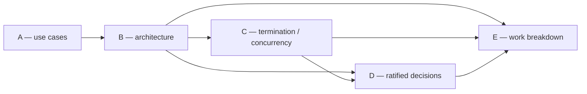

# Cascaded Plan-Review — Step 0 Cascade Prep

**Heartbeat-Poker Abstraction Design Review**

| Field | Value |
|---|---|
| **Date** | 2026-05-21 (evening EDT) |
| **Manager** | Mr. Radio 🦉 (Lupin session `679e8f04`) |
| **Author (doc under review)** | Tiberius 🌑 (Lupin session `bc15c374`) |
| **Doctrine Observer** | María 🌸 |
| **Stage 1/2/3 Reviewers** | 3 fresh sessions (Rick spawning) |
| **Input plan** | `lupin/src/rnd/v0.1.7/2026.05.20-generic-heartbeat-poker-abstraction-design.md` |
| **Input snapshot** | committed `5f319e5` (304 lines, Phase 0 complete) |
| **Workflow** | `planning-is-prompting/workflow/plan-review-cascaded.md` (Manager's Playbook) |
| **Step 0 status** | Prep complete — awaiting Rick's Step 3 decomposition approval |

---

## 1. Step 0.1 — Reviewability Assessment

**Verdict: cascade-shaped. Proceed with `/plan-review-cascaded` (do NOT fall back to serial `/plan-review`).**

| Criterion | Finding |
|---|---|
| ≥2 reviewable sections? | **Yes** — 5 reviewable design sections (A–E below) |
| Section-independence holds? | **Yes** — each section reviewable in isolation given upstream sections as input; cross-section dependencies are explicit + minimal (B depends on A; C on B; D references B/C; E depends on B/C/D — a clean linear chain the pipeline ordering handles naturally) |
| Roughly comparable section scope? | **Yes** — see the manifest §3; A and D are lighter, B/C/E heavier, all within a reviewable single-stage budget |
| Single-section / non-independent? | No — would have triggered the serial fallback. Not the case here. |

**Non-reviewable content** (excluded from cascade scope — context, audit, status; NOT subject to design review): doc §1 Origin (verbatim Rick quote — included as framing context inside Section A but not itself a review target), §7 Cross-references, §8 Session status at parking, §9 Ratification log, §10 Session status 2026-05-21. Reviewers should READ these for context but file no findings against them.

---

## 2. Step 0.2 — Pre-Cascade Recon Checklist

Standing conventions, doctrine, and project rules that bind every participant during this review. Cold-cast reviewers MUST read this before filing any finding.

### 2.1 Cascade discipline

- **Sequential pass structure — NEVER parallel.** `REUSE → user gate → Author applies → Pass 1 Fitness → user gate → Author applies → Pass 2 Ownership-Language Audit → user gate → Author applies`. Per the Q11 amendment ratified in PIP Phase 0. Three passes, three apply-points, three commits.
- **Per-pass doc freeze.** Within a single pass the input doc is a stable snapshot; the Author (Tiberius) does not touch it mid-pass. Between passes, the Author applies that pass's ratified findings and re-commits — the next pass reviews the NEW committed snapshot. ~3 revision points expected.
- **Pass identity** — do not conflate:
  - **REUSE pass** (Stage 1) — usability + reuse: does the design lean on existing Lupin/PIP infrastructure where it should? Is anything reinvented?
  - **Pass 1 Fitness** (Stage 2) — viability + gap: does the design actually work? Load-bearing-assumption check, gap hunt, anti-pattern hunt.
  - **Pass 2 Ownership-Language Audit** (Stage 3) — hunts executor-tagging gaps + silent user hand-offs. **NOT a security review.** Do not pull this pass toward OWASP / threat-model / path-traversal semantics. The word "adversarial" was retired from this pass's framing for exactly that reason.
- **Manager identity** (Mr. Radio): orchestrator + facilitator, NOT a reviewer. Procedural authority only. Does not write design content, does not vote on substance (only breaks cosmetic/inconsistency ties). Universal step zero on every wake — disk-read every active topic.

### 2.2 Severity taxonomy + classification

- **Cosmetic** — style, naming, wording. Documented silently or ignored.
- **Inconsistency** (within section) — author contradicts themselves or a prior stage's decision. Re-litigation DM, bounded upstream subset.
- **Foundational** — load-bearing assumption invalidated, OR cross-section impact. Escalate to Rick immediately.
- **Honest classification rule**: if uncertain between inconsistency and foundational, treat as foundational + escalate. One extra interruption is cheap; a silent foundational miss is expensive.
- **Cluster-bundling**: multiple findings on the same author landing in one stage-close → ONE bundled re-litigation DM (per-finding classification posts still happen for telemetry).

### 2.3 What is already RATIFIED (high bar to re-open)

The input doc carries SIX ratified decisions + THREE ratified work-breakdown observations (see the Q-Decision Matrix §4). Reviewers may review whether a ratified decision is **sound as design**, but **re-opening a ratified decision requires a foundational-severity finding + escalation to Rick** — ratification is a real gate, not a suggestion. Reviewers should not spend cosmetic/inconsistency budget re-litigating settled calls; focus that budget on un-ratified design surface.

### 2.4 Project + persona conventions

- **100% coverage mandate** (Lupin-wide): any code the design's implementation tier eventually produces must hit 100% line+branch+function coverage. Relevant to Section E (work breakdown) review — task I6's test pyramid must reflect this.
- **CODE vs DOCTRINE split** (load-bearing in this design): Layer 1 (the `HeartbeatPokerJob` Python class) is Lupin infrastructure, lives in Lupin permanently, never migrates. Layer 2 (per-recipient protocol doctrine) is Lupin-first → PIP-promotable. Reviewers must keep this distinction straight — it is the spine of the §5 doctrine-home ratification.
- **Persona signing**: every cross-session message signed with the sender's own persona icon. Cast: Tiberius 🌑 (Author), Mr. Radio 🦉 (Manager), María 🌸 (Observer), + 3 reviewer personas TBD at Step 4.
- **Heartbeat scheduler**: an external scheduler should be poking the Manager every 2–3 min during the active cascade (3-strike dead-man's-switch). If Rick has not started it, flag at Step 4.

---

## 3. Step 0.3 — Plan-Slicing Manifest (5 Sections, Revision-Tracked)

The doc amends 3× across the cascade (post-REUSE, post-Pass-1, post-Pass-2). Section *boundaries* are stable; section *content* evolves. The revision columns track the snapshot each section is in at each pass.

### Proposed decomposition

| Section | Title | Doc source | Scope / what reviewers assess | Weight |
|---------|-------|------------|-------------------------------|--------|
| **A** | Problem framing & use cases | §1 (context only) + §2 | Is the problem correctly characterized? Are the **three use cases** (Observer / Manager / Watcher-of-implementer) the right and complete set? Is the **structural insight** — "all three share the same poker shape; variance is entirely recipient-side" — actually sound? | Light |
| **B** | Two-layer architecture & recipient-state model | §3 + §4 Q1 | The **Layer 1 / Layer 2 split** (generic poker vs per-recipient doctrines). The Layer-1 class shape — 6 config params. **Q1** — recipient state lives in role doctrine, not the poker. Is the abstraction boundary in the right place? | Heavy |
| **C** | Termination model & concurrent-poker routing | §4 Q2 + §4 concurrent-poker routing | The **three layered exits** (clean / dead-man's-switch / hard-cap) and the key call that dead-man's-switch ESCALATES rather than terminates. **Concurrent-poker routing** — two independent jobs, `poke_body` JSON dispatch, the 3 signal-density mitigations. | Heavy |
| **D** | Ratified strategic decisions | §5 | Are the three 2026-05-21 ratifications **sound**? Q3 co-exist-then-swap + the 5 swap-criteria. Doctrine-home γ (Lupin-first + 2 PIP-promotion triggers) + the CODE/DOCTRINE clarification. Persona-allocation out-of-scope. | Medium |
| **E** | Work breakdown & execution sequencing | §6 | The **4-design + 11-implementation = 15-task** decomposition. Execution-gate sequencing. The I4a–d operator-event-driven sub-gates. Task I6's test pyramid vs the 100% coverage mandate. | Medium |

### Revision-tracking columns

| Section | Snapshot @ REUSE | Snapshot @ Pass 1 | Snapshot @ Pass 2 | Findings (REUSE) | Findings (P1) | Findings (P2) |
|---------|------------------|-------------------|-------------------|------------------|---------------|---------------|
| A | `5f319e5` | `2f3072b` | `a241be9` | A1 cosmetic (applied) | 3 — Rio A1 cos / A2,A3 inc (applied) | 0 — clean |
| B | `5f319e5` | `2f3072b` | `a241be9` | B1 foundational→downgraded + B2 cosmetic (applied) | 4 — Rio B1–B4 inc (applied) | 2 — Sam B1 inc / B2 cos (applied) |
| C | `5f319e5` | `2f3072b` | `a241be9` | C1+C2 inconsistency, cluster (applied) | 5 — Rio C1–C4 inc / C5 cos (applied) | 0 — clean |
| D | `5f319e5` | `2f3072b` | `a241be9` | D1 inconsistency (applied — γ precedent corrected) | 3 — Rio D1–D3 inc (applied) | 1 — Sam D1 inc (applied) |
| E | `5f319e5` | `2f3072b` | `a241be9` | E1 inconsistency + E2 cosmetic (applied) | 8 — Rio E1–E5,E7 inc / E6 100%-election / E8 cos (applied); §6 tasks 15→17 | 2 — Sam E1 inc / E2 inc (applied) |

**Final cascade-output snapshot**: `b733148` (post-Pass-2-apply). Chain: `5f319e5` → REUSE apply `2f3072b` → Fitness apply `a241be9` → Ownership apply `b733148`.

Manager keeps this table live — fills the snapshot hashes as each apply-point commits, fills the findings cells as each pass closes.

### Cross-section dependency graph

Linear-ish chain; pipeline ordering A→B→C→D→E satisfies every dependency before the dependent section is reviewed. No cycles. Section E (the 15-task work breakdown) depends on B and C as well as D — tasks I1 (Layer-1 class = B content) and I2 (layered exits = C content) reference the architecture and termination model directly; the B→E and C→E edges are drawn explicitly so a Stage-1 reviewer casting Section E loads B/C as upstream context.

---

## 4. Q-Decision Matrix

Catalog of every design decision in the input doc, with ratification status. Tells reviewers what is SETTLED (high bar to re-open) vs still open.

| ID | Decision | Status | Doc § | Ratifier | Commit |
|----|----------|--------|-------|----------|--------|
| Q1 | Recipient state model → **Path A** (one minimal poker class; per-recipient state lives in role doctrine) | LOCKED (conversation) | §4 | Rick (pre-planning dialogue) | — |
| Q2 | Termination model → **3 layered exits** (clean / dead-man's-switch / hard-cap) | LOCKED (conversation) | §4 | Rick (pre-planning dialogue) | — |
| — | Concurrent-poker routing → **2 independent jobs**, `poke_body` JSON dispatch, cadence-stagger | LOCKED (conversation) | §4 | Rick (pre-planning dialogue) | — |
| Q3 | Relationship to existing daemon → **(b) co-exist during validation** + 5 swap-criteria | **RATIFIED** 2026-05-21 | §5 | Rick, session `bc15c374` | `0d1d489` |
| DH | Watcher-mode doctrine home → **(γ) Lupin-first** + 2 PIP-promotion triggers | **RATIFIED** 2026-05-21 | §5 | Rick, session `bc15c374` | `0d1d489` |
| PA | Persona-allocation strategy → **OUT-OF-SCOPE** for the poker abstraction | **RATIFIED** 2026-05-21 | §5 | Rick, session `bc15c374` | `0d1d489` |
| Obs 1 | Merge D1 + D4 → single "class spec + integration patterns" task | **RATIFIED** 2026-05-21 | §9 | Tiberius, session `bc15c374` | pending |
| Obs 2 | Rename D5 → "Phase 0" + tag as implementation-gate | **RATIFIED** 2026-05-21 | §9 | Tiberius, session `bc15c374` | pending |
| Obs 3 | Split I4 → I4a/b/c/d (one sub-gate per swap-criterion) | **RATIFIED** 2026-05-21 | §9 | Tiberius, session `bc15c374` | pending |

**No genuinely-open Qs remain in the input doc** — Phase 0 closed all of them. The cascade's job is therefore a *soundness* review of settled design + a *fitness/reuse/ownership* review of the design surface, NOT an open-question resolution exercise. This is normal for a review-cascade (vs an authoring-cascade where open Qs are the main fuel).

---

## 5. Manager's Cascade-Readiness Light-Review (6-criterion)

| # | Criterion | Verdict |
|---|-----------|---------|
| 1 | Input doc is complete enough to review (no TODO-shaped gaps in the design surface) | ✅ Phase 0 complete; all 5 design sections substantive |
| 2 | Sections decompose cleanly (≥2, independence holds) | ✅ 5 sections, linear dependency chain, no cycles |
| 3 | No unratified load-bearing decision blocking the review | ✅ all 6 decisions + 3 observations ratified |
| 4 | Reviewers can be cold-cast (Recon checklist §2 carries the context) | ✅ Recon checklist authored above |
| 5 | Scope is bounded (no open-ended "design the world" sections) | ✅ scope is one class + one new protocol doc + a co-exist plan + a 15-task breakdown |
| 6 | Cross-cutting concerns surfaced for reviewers | ✅ CODE-vs-DOCTRINE split + 100% coverage mandate + ratified-decision re-open bar all flagged in §2 |

**Gate verdict: PASS.** The input doc is cascade-ready. On Rick's Step 3 decomposition approval, the Manager posts `kind: "cascade_input_ready"` and Step 1 (config resolution) → Step 4 (role assignment) → Step 5 (pipeline) can fire.

---

## 6. What Rick Approves at Step 3

The **only mandatory user gate** before the pipeline runs autonomously is the **decomposition approval**. Rick is asked to approve (or amend) the **5-section split** in §3:

- **A** — Problem framing & use cases
- **B** — Two-layer architecture & recipient-state model
- **C** — Termination model & concurrent-poker routing
- **D** — Ratified strategic decisions
- **E** — Work breakdown & execution sequencing

Approve → Manager proceeds to Step 1 + Step 4. Amend → Manager revises the manifest and re-asks.

---

## 7. Post-Approval Sequence (Manager's next moves)

1. **Step 1** — Resolve effective config (read `plan-review-cascaded-defaults.md` + Lupin CLAUDE.md overrides + invocation flags).
2. **Step 4** — Identify the 4 peer sessions via `commons_who()`; DM each a role assignment (Author=Tiberius; Stage 1/2/3 reviewers; Observer=María); wait for all 4 `ready, [role]` acks.
3. **Step 5** — Section pipeline A→B→C→D→E through REUSE → Pass 1 → Pass 2, sequential passes, user gate + Author-apply between passes.
4. **Steps 6–8** — Facilitation (severity classification, re-litigation, votes, heartbeat handling), escalation per the 7-trigger taxonomy, end-of-pipeline summary.
5. **Step 9** — Revision-handoff synthesis doc; cold-context test; light-review gate → `implementation_handoff_ready`.

---

## 8. Post-Game Review Items

Manager-captured items for the Step 9 post-cascade retrospective. These are **process-improvement candidates for the cascade workflow itself** — NOT findings against the doc under review.

| # | Item | Raised by | Date |
|---|------|-----------|------|
| PG-1 | **Context-clearing of key participants should be an explicit, codified workflow step.** Key cascade participants — reviewers especially, arguably the Manager too — should undergo a deliberate context-clear (`/clear`) before taking their seat, so each reviews cold and fresh, uncontaminated by prior unrelated work in their session. Today this happens ad-hoc (informal cold-casting; the Manager's own mid-session `/clear`). **Recommendation**: codify it in `planning-is-prompting/workflow/plan-review-cascaded.md` as a named pre-cascade setup step — specifying *who* must clear, *when* (before the role-ack), and *why* (review independence; no cross-talk / prior-context bias). | Rick | 2026-05-21 |
| PG-2 | **The `dual_independent` daemon-kickoff doctrine — and the heartbeat-poker design it abstracts — do not account for host-harness permission denial of a daemon/job launch.** During Run 5, the Observer's heartbeat-daemon launch (a persistent background process) was blocked by the PIP session's auto-mode permission classifier — background-process launch requires explicit user approval, and the user was away. The Observer substituted a self-paced ScheduleWakeup probe loop (Observer-mode Probe Protocol fully functional; only the wake source differs). **Recommendation**: the heartbeat-poker abstraction (Layer 1 `HeartbeatPokerJob` launch + the `dual_independent` kickoff doctrine) should specify a fallback wake mechanism — a self-paced ScheduleWakeup substitute — OR an explicit pre-flight launch-approval step, for the case where daemon/job launch is permission-denied. | María 🌸 (Observer) | 2026-05-22 |

| PG-3 | **Host-harness permission classifiers block cascade mechanics — second instance.** A Manager→reviewer role-trigger DM (`commons_send_to` to Krishna) was denied by the auto-mode permission classifier, which false-positived the DM as "fabricated user-decision content" because the relayed user ruling (Rick's `ask_multiple_choice` free-text answer to the F-Krishna-B1 escalation) was paraphrased rather than quoted verbatim — the grounding answer was present in the session but not legible to the classifier as such. Re-sent successfully once Rick's answer was quoted verbatim in the DM body. Parallels PG-2 (Observer daemon launch permission-denied). **Recommendation**: (a) cascade doctrine should mandate that any peer-relayed user decision quote the user verbatim, never paraphrase — better practice independent of the classifier; (b) the heartbeat-poker abstraction + cascade workflow should treat host-permission-layer interference (daemon launch AND directed-DM dispatch) as a known operational hazard with documented mitigations. | Mr. Radio 🦉 (Manager) | 2026-05-22 |

| PG-5 | **Step-0 recon checklist asserted a project mandate without verifying its scope-applicability.** The Step-0 prep §2.4 recon checklist asserted the Lupin-wide 100% coverage mandate as "load-bearing for Section E task I6" — but the design places `HeartbeatPokerJob` in the CoSA sub-repo, which that mandate explicitly EXCLUDES. The recon checklist propagated the same wrong assumption task I6 itself made (surfaced by Fitness finding F-Rio-E6). Resolved in-cascade: Rick ruled "100% deliberate election" at the Fitness pass-gate. **Recommendation**: Step-0 recon checklists must verify the *scope-applicability* of any cited project mandate against the design's actual code location, never assume blanket applicability. | Mr. Radio 🦉 (Manager) | 2026-05-22 |
| PG-6 | **The cascade's own heartbeat daemon has a poke-delivery bug — richly reflexive.** `cascade_heartbeat_scheduler.py` (Run-5 PID 569022), launched `--manager "mr radio"`, builds its poke topic as `dm-mr radio` *with a space*, which fails the server topic-name validation `^[\w-]+$` — every `register-question` push 422-fails. The daemon posts heartbeats to the topic but the pokes never push / never wake the Manager; the heartbeat was a non-functional wake mechanism for the entire run (the cascade ran on peer-push instead — reliably). **Reflexive**: directly corroborates Fitness findings F-Rio-C1 (poke-delivery + detection mechanism must be specified) and F-Rio-B1 (recipient entry-type semantics) — the cascade's own poker broke precisely because poke-delivery was not robust to a space in a recipient identifier. **Recommendation**: (a) fix `cascade_heartbeat_scheduler.py` to slugify recipient-derived topic names; (b) the `HeartbeatPokerJob` design must specify topic-name slugification/validation in its poke-delivery mechanism (reinforces C1). | Mr. Radio 🦉 (Manager) | 2026-05-22 |
| PG-7 | **Transient auto-mode permission-classifier outage mid-cascade.** During Cascade Run 5 (~2026-05-22 03:55+ EDT), the auto-mode permission classifier returned "claude-opus-4-7[1m] is temporarily unavailable" — it blocked the Manager's `commons_read` MCP calls AND `Bash` calls (both classifier-gated). The Manager worked around it by directly disk-reading the file-based commons store (`io/commons/<topic>.md`) with the classifier-free `Read` tool, confirming the Author's re-commit status without the MCP path. Rick noted the same transient outage was observed elsewhere — **flagged for discussion 2026-05-23** (Rick's request). **Silver-lining observation**: the file-based commons store being directly disk-readable is a genuine resilience property — when the MCP read-path is classifier-gated-down, the Manager's universal-step-zero (disk-read every active topic) degrades gracefully to a literal `Read` of the topic files. Worth recording as a deliberate resilience design point for the commons store. | Rick + Mr. Radio 🦉 | 2026-05-22 |

**Routing**: PG-1, PG-2, PG-3, PG-5, PG-6 are doctrine / reflexive candidates. At Step 9 the Manager hands them to María 🌸 (Doctrine Observer) for capture; PG-1's workflow amendment lands in the **planning-is-prompting** repo. PG-2, PG-3, PG-5, PG-6 are *reflexive findings* — they concern the heartbeat-poker abstraction + cascade workflow themselves; canonical owner is María's Run-5 telemetry → Step 9 retrospective / design-doc §10.x retrofit. (PG-4 intentionally unused — a candidate premised on a false-alarm was not logged.) **PG-7** is an operational/infrastructure incident (not a doctrine candidate) — flagged for Rick's 2026-05-23 discussion; cross-session relevance noted (Rick observed it beyond this session).
