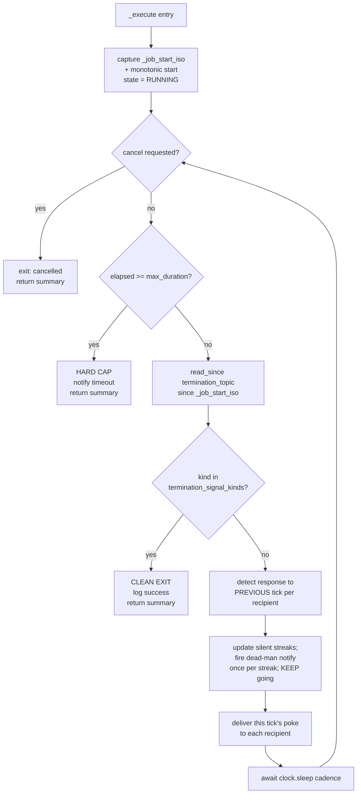

# Heartbeat Poker — D1+D4: Class Spec + Integration Patterns

| Field | Value |
|---|---|
| **Date** | 2026-05-22 |
| **Status** | 🟢 Design-tier task **D1+D4 complete** — class spec authored. Feeds I1 (build) + I2 (layered exits). |
| **Task** | D1+D4 — "Class spec + integration patterns" (first design-tier task per §6 of the design doc) |
| **Author** | Rio ⚡ (Lupin session `76351966`, implementer) — managed by Tiberius 🌑 |
| **Builds on** | `src/rnd/v0.1.7/2026.05.20-generic-heartbeat-poker-abstraction-design.md` (doc-snapshot `b733148`, post-Cascade-Run-5) |
| **Binds to** | `src/cosa/agents/agentic_job_base.py` (`AgenticJobBase`), `src/cosa/rest/queue_protocol.py` (`QueueableJob`) |
| **Commit status** | UNCOMMITTED on disk — never-auto-commit policy; commit is a separate Rick-authorized step |
| **Executor** | `AI` — every implementation task (I1, I2) derived from this spec is `EXECUTOR: AI` |

---

## 1. Scope

D1+D4 outputs the **`HeartbeatPokerJob` class shape** — fields, methods, lifecycle — bound to its
three integration constraints:

1. **`QueueableJob` protocol** satisfaction
2. **`AgenticJobBase` parent contract**
3. **commons-store interaction patterns**

Plus the **hard requirement** from finding F-Rio-E7: a **clock-injection seam** so the
cadence / tick / hard-cap loop is time-mockable — the prerequisite for I6's 100%
branch-coverage target.

This is a **spec**, not the implementation. I1 writes the code; I2 implements the layered
exits. Signatures, field tables, and lifecycle pseudocode below are the contract those
tasks build to.

---

## 2. Supporting types

### 2.1 `RecipientSpec` — per-recipient config (finding F-Rio-B1)

A frozen dataclass. `recipients` is a `List[RecipientSpec]`, never a bare `List[str]` — a flat
string list cannot carry the per-recipient `role` that the `poke_body` requires, nor
disambiguate the identifier type.

| Field | Type | Purpose |
|---|---|---|
| `identifier` | `str` | Addressable id — a persona-name (for `commons_send_to` routing) OR a raw session-id |
| `identifier_type` | `str` | `"persona"` or `"session_id"` — tells the gateway how to route delivery + how to match liveness |
| `role` | `str` | `"manager"` / `"observer"` / `"watcher"` — opaque passthrough; stamped into `poke_body.role`; the poker NEVER branches on it (§2 structural insight of the design doc) |

`__post_init__` validates `identifier_type ∈ {"persona","session_id"}` and
`role ∈ {"manager","observer","watcher"}`, raising `ValueError` with context on a bad value.
`frozen=True` — config is immutable after construction.

### 2.2 `Clock` — the clock-injection seam (finding F-Rio-E7)

A single injected seam controlling **all** time behavior, so I6 can drive the loop
deterministically without real waiting.

```python
class Clock( Protocol ):
    def monotonic( self ) -> float: ...        # elapsed-time source — drives the hard cap
    def now_iso( self ) -> str: ...            # wall-clock ISO string — job_start_ts + tick send-times
    async def sleep( self, seconds: float ) -> None: ...   # inter-tick wait
```

| Implementation | Use | Behavior |
|---|---|---|
| `SystemClock` (default) | production | wraps `time.monotonic`, `cu.get_current_datetime_iso`, `asyncio.sleep` |
| `FakeClock` | I6 unit tests | `sleep( s )` advances an internal monotonic + wall counter by `s` and returns immediately; `monotonic` / `now_iso` read those counters |

One injection point. With `FakeClock` a test forces the hard-cap branch, the 3-silent-tick
branch, and any cadence count in microseconds — no real sleeps. This is what makes I6's
100% branch coverage *achievable*; without it the sleep-loop is untestable.

### 2.3 `CommonsGateway` — the commons-store interaction seam

The poker runs server-side, in-process, as an `AgenticJobBase` in the agentic pool. It does
**not** use the cosa-voice MCP tool surface (that is for CC sessions). It uses an in-process
gateway over the commons backend.

```python
class CommonsGateway( Protocol ):
    def send_to( self, recipient: RecipientSpec, body: str ) -> None: ...
    def last_post_ts( self, recipient: RecipientSpec ) -> Optional[str]: ...
    def read_since( self, topic: str, since_iso: str ) -> List[dict]: ...
```

| Method | Maps to | Used for |
|---|---|---|
| `send_to` | `commons_send_to(recipient, body)` | poke delivery (§4 of design doc) |
| `last_post_ts` | `commons_who()` row lookup → `last_post_ts` | response detection |
| `read_since` | `commons_read(topic, since=...)` | clean-termination check |

Default implementation wraps the server-side `CommonsStore` class. **Open for I1** (§9):
bind these three methods to the exact `CommonsStore` API — that binding requires reading
the commons-store module and is a build-time detail, not a design-time one.

Injectable + protocol-typed so I6 supplies a `FakeCommonsGateway` (scripted responses) and
never touches the real commons store.

---

## 3. `HeartbeatPokerJob` — class shape

### 3.1 Class attributes

```python
class HeartbeatPokerJob( AgenticJobBase ):
    JOB_TYPE   = "heartbeat_poker"
    JOB_PREFIX = "hp"                 # id_hash → "hp-a1b2c3d4"
```

### 3.2 Constructor

```python
def __init__(
    self,
    # --- poker config: 5 required ---
    recipients               : List[RecipientSpec],
    cadence_seconds          : int,
    termination_topic        : str,
    termination_signal_kinds : List[str],
    workstream_id            : str,
    # --- poker config: 2 defaulted (§3 of design doc) ---
    deadman_consecutive_pokes : int = 3,
    max_duration_seconds      : int = 43_200,    # 12h
    # --- injected seams (default = real) ---
    clock   : Clock          = None,             # None → SystemClock()
    commons : CommonsGateway = None,             # None → CommonsStore-backed default
    # --- AgenticJobBase parent params ---
    user_id      : str  = None,
    user_email   : str  = None,
    session_id   : str  = None,
    scheduled_at : str  = None,
    monopolize   : bool = False,
    debug        : bool = False,
    verbose      : bool = False,
) -> None
```

Calls `super().__init__( user_id, user_email, session_id, scheduled_at, monopolize, debug,
verbose )` first (parent sets `id_hash`, `state`, timestamps, etc.), then stores the poker
config + seams.

### 3.3 Constructor validation

Each check raises `ValueError` with context (each is a distinct branch I6 must cover):

| Invariant | Rule |
|---|---|
| `recipients` non-empty | `len( recipients ) >= 1` |
| `cadence_seconds` positive | `cadence_seconds > 0` |
| `max_duration_seconds` positive | `max_duration_seconds > 0` |
| `deadman_consecutive_pokes` ≥ 1 | `deadman_consecutive_pokes >= 1` |
| `termination_signal_kinds` non-empty | `len( ... ) >= 1` |
| `termination_topic` non-empty | truthy string |

`RecipientSpec` enum validation lives in its own `__post_init__` (§2.1).

### 3.4 Instance fields beyond the parent

| Field | Type | Purpose |
|---|---|---|
| `recipients` … `max_duration_seconds` | (config) | the 7 config params, stored verbatim |
| `_clock` | `Clock` | injected or `SystemClock()` |
| `_commons` | `CommonsGateway` | injected or default |
| `_job_start_iso` | `str` | wall-clock ISO at `_execute()` entry — the clean-exit guard anchor |
| `_silent_streak` | `Dict[str,int]` | per-recipient consecutive-silent-poke counter (keyed by `identifier`) |
| `_dms_fired` | `Dict[str,bool]` | per-recipient "dead-man notify already fired this streak" flag |
| `_last_tick_iso` | `Dict[str,Optional[str]]` | per-recipient send-time of the most recent poke |
| `_tick_count` | `int` | total ticks delivered — feeds the exit summary |
| `_dms_escalations` | `int` | total dead-man escalations fired — feeds the exit summary |

---

## 4. Lifecycle

### 4.1 `do_all()` — sync bridge (satisfies `AgenticJobBase` abstract)

```
do_all():
    self.started_at = self._clock.now_iso()
    try:
        result = asyncio.run( self._execute() )
    finally:
        self.completed_at = self._clock.now_iso()
    self.answer_conversational = result
    return result
```

### 4.2 `_execute()` — the poke loop (async; satisfies `AgenticJobBase` abstract)



**Step detail:**

1. **Cancel check** — `if self._cancel_requested:` → graceful cancelled-exit. (`AgenticJobBase`
   provides `_cancel_requested` + `request_cancel()`; the loop honors it every iteration.)
2. **Hard cap** — `(_clock.monotonic() - start) >= max_duration_seconds` → fire
   `notify_completion()` with a timeout reason, return. Disposition is **`_transition_to_done`**
   (finding F-Rio-E4a — a timeout is a clean stop, not a crash); see §5.4 for how that is
   achieved (return normally, never raise).
3. **Clean-termination check** — `_commons.read_since( termination_topic, _job_start_iso )`;
   if any returned entry's `kind` is in `termination_signal_kinds` → clean exit, return.
   The `since=_job_start_iso` filter **is** the clean-exit guard (finding F-Rio-C4): a stale
   signal from a prior run sitting in the topic is dated before `_job_start_iso` and is
   excluded — timestamp-based, survives topic-retention pruning (the prototype's `initial_size`
   byte-offset did not).
4. **Response detection** — for each recipient with a non-`None` `_last_tick_iso`: read
   `_commons.last_post_ts( recipient )`; if it advanced past `_last_tick_iso[r]` →
   recipient revived → reset `_silent_streak[r] = 0`, `_dms_fired[r] = False`; else →
   `_silent_streak[r] += 1`. First iteration has no previous tick → detection skipped.
5. **Dead-man's-switch** — if `_silent_streak[r] >= deadman_consecutive_pokes` and not
   `_dms_fired[r]`: fire `notify_progress( ..., priority="high" )` escalation, set
   `_dms_fired[r] = True`, `_dms_escalations += 1`. **KEEP poking** — the dead-man's-switch
   ESCALATES, never terminates (§4 design doc key call). The per-recipient streak counter
   means one responsive recipient never masks another's silence; the `_dms_fired` flag means
   one notify per streak, not one per tick past threshold; the reset on revival re-arms a
   later streak.
6. **Poke delivery** — for each recipient build `poke_body` (§4.3) and
   `_commons.send_to( recipient, json.dumps( poke_body ) )`; record
   `_last_tick_iso[r] = _clock.now_iso()`; `_tick_count += 1` once per tick round.
7. **Sleep** — `await self._clock.sleep( cadence_seconds )`, then loop.

### 4.3 `poke_body` construction (finding F-Rio-C2)

```json
{ "kind": "heartbeat", "workstream": "<workstream_id>", "role": "<recipient.role>" }
```

`kind` is the literal `"heartbeat"`; `workstream` from the job's `workstream_id` config;
`role` stamped per-recipient from that `RecipientSpec`. The poker stamps all three and
**never branches on `role`** — opaque passthrough for the recipient's own dispatch.

---

## 5. Integration constraints

### 5.1 `QueueableJob` protocol — satisfied by inheritance

`AgenticJobBase` already implements every `QueueableJob` member (identity, routing,
timestamps, question/answer, `job_type`, status, scheduling, and the three methods).
`HeartbeatPokerJob` inherits all of it; it must only:

- override `JOB_TYPE` / `JOB_PREFIX` (→ `job_type` property + `id_hash` prefix);
- implement the abstract `last_question_asked` property;
- implement the abstract `do_all()` and `_execute()`.

`code_ran_to_completion()` / `formatter_ran_to_completion()` are inherited and correct
(they read `state` / `answer_conversational`).

### 5.2 `last_question_asked` (abstract — must override)

```python
@property
def last_question_asked( self ) -> str:
    return ( f"Heartbeat poker — {self.workstream_id}: "
             f"{len( self.recipients )} recipient(s) @ {self.cadence_seconds}s cadence" )
```

### 5.3 `AgenticJobBase` parent contract

- Constructor delegates to `super().__init__(...)` — parent owns `id_hash`, `push_counter`,
  `run_date`, `state`, `error`, `_cancel_requested`, `artifacts`, scheduling fields.
- The loop honors `_cancel_requested` (§4.2 step 1) — wiring `request_cancel()` for free.
- Escalation/exit notifications reuse the parent's `notify_progress()` /
  `notify_completion()` — no new notification plumbing.
- `is_cacheable` inherited as `False` — correct; a poker run is never cached.

### 5.4 CJ Flow dispatch + transition disposition

`HeartbeatPokerJob` is an `AgenticJobBase` → `RunningFifoQueue._process_job` dispatches it
to the agentic `ThreadPoolExecutor`; it holds **one pool slot for its whole lifetime** (the
deliberately-accepted tradeoff of §3 of the design doc — pool must be sized `≥ N+1`; prod
resize is task I10).

The poker does **not** call `_transition_to_done` / `_transition_to_dead` itself — the
queue's `Future.add_done_callback` does, keyed on whether `do_all()` **returned** or
**raised**:

| Exit | `do_all()` behavior | Queue transition |
|---|---|---|
| Clean (signal match) | returns summary string | `_transition_to_done` |
| Hard cap (`max_duration_seconds`) | returns summary string | `_transition_to_done` ✅ (F-Rio-E4a) |
| Cancelled | returns summary string | `_transition_to_done` |
| Unexpected exception | raises | `_transition_to_dead` |

So hard-cap **must return normally** (never raise) to land in `done` — §4.2 step 2 honors
this. The dead-man's-switch never terminates, so it is never an exit row.

---

## 6. Method summary

| Method | Sig | Purpose |
|---|---|---|
| `__init__` | see §3.2 | config + seam injection + validation |
| `last_question_asked` | `→ str` (property) | queue-UI display string |
| `do_all` | `→ str` | sync bridge — `asyncio.run( _execute() )` |
| `_execute` | `async → str` | the poke loop (§4.2) |
| `_build_poke_body` | `(RecipientSpec) → dict` | §4.3 JSON envelope |
| `_deliver_tick` | `async → None` | one tick: build + `send_to` every recipient + record send-time |
| `_detect_responses` | `async → None` | update `_silent_streak` / `_dms_fired` from `last_post_ts` |
| `_check_clean_termination` | `async → bool` | `read_since` + signal-kind match |
| `_fire_deadman` | `(RecipientSpec) → None` | one-shot escalation `notify_progress` |
| `_exit_summary` | `(reason: str) → str` | sets `answer_conversational`, returns the summary |

Decomposing the loop into small helpers is deliberate — each is an independently
unit-testable surface for I6's 100% branch target.

---

## 7. Clock-injection seam — why it is load-bearing

I6 holds `HeartbeatPokerJob` to **100% line + branch + function** coverage
(`pytest-cov --cov-branch --cov-fail-under=100`, `coverage.py` — NOT `c8`). The cadence /
hard-cap loop is a sleep loop; without an injected clock, exercising the hard-cap branch
would take 12 real hours and the 3-silent-tick branch would take three real cadence
intervals. `FakeClock` (§2.2) collapses all of that to deterministic, instant test runs:

- hard-cap branch → `FakeClock` reports elapsed `>= max_duration_seconds` on demand;
- 3-silent-tick branch → `FakeCommonsGateway` returns a non-advancing `last_post_ts`;
- revival-reset branch → gateway advances `last_post_ts` mid-test;
- clean-exit branch → gateway returns a matching `kind` from `read_since`.

Every branch reachable, every branch fast. The seam is the **prerequisite** the design doc
(finding F-Rio-E7) names — it is in this spec, satisfying the D1+D4 hard requirement.

---

## 8. Traceability — design-doc decisions this spec honors

| Source | Honored by |
|---|---|
| §3 — 7 config params (5 required + 2 defaulted) | §3.2 constructor |
| F-Rio-B1 — `recipients: List[RecipientSpec]` | §2.1 |
| F-Rio-B4 — recipient doctrine-loaded before first poke | launch prerequisite; owned by D3 runbook, not the class |
| §4 Q2 — three layered exits | §4.2 steps 2/3/5 (I2 implements) |
| §4 — poke delivery + response detection | §2.3 gateway + §4.2 steps 4/6 |
| F-Rio-C4 — clean-exit guard via `since=job_start_ts` | §4.2 step 3 |
| F-Rio-C2 — `poke_body` field provenance | §4.3 |
| F-Rio-E4a — hard-cap → `_transition_to_done` | §5.4 |
| F-Rio-E7 — clock-injection seam | §2.2 + §7 |
| §2 structural insight — poker never branches on `role` | §4.3 (opaque passthrough) |

---

## 9. Open items handed to I1 (the build task)

1. **`CommonsGateway` ↔ `CommonsStore` binding** — bind the three gateway methods to the
   exact server-side `CommonsStore` API. Requires reading the commons-store module; a
   build-time detail, deliberately not resolved at design time.
2. **Persona-addressing detection ambiguity** — if a recipient is `identifier_type="persona"`
   and the persona pool has duplicate active sessions, `last_post_ts` lookup is ambiguous.
   The default gateway should resolve to the most-recently-active session for that persona;
   the spec **recommends `session_id` addressing** for any recipient where unambiguous
   liveness detection is critical. I1 implements the resolution + documents the recommendation.
3. **`implementation_done` / `implementation_blocked` signal kinds** — new termination
   kinds; added to `plan-review-cascaded-defaults.md` by task **I5**, consumed here as
   `termination_signal_kinds` config values (no class change needed).

---

## 10. Status

D1+D4 complete — class spec on disk, **uncommitted** per the never-auto-commit policy
(commit is a separate Rick-authorized step; Tiberius is escalating the commit policy to
Rick). Next task in the chain: **D2** — author the Watcher-mode Probe Protocol at
`src/docs/agents/implementer-watch-protocol.md`.

— Rio ⚡ (Lupin session `76351966`), 2026-05-22
