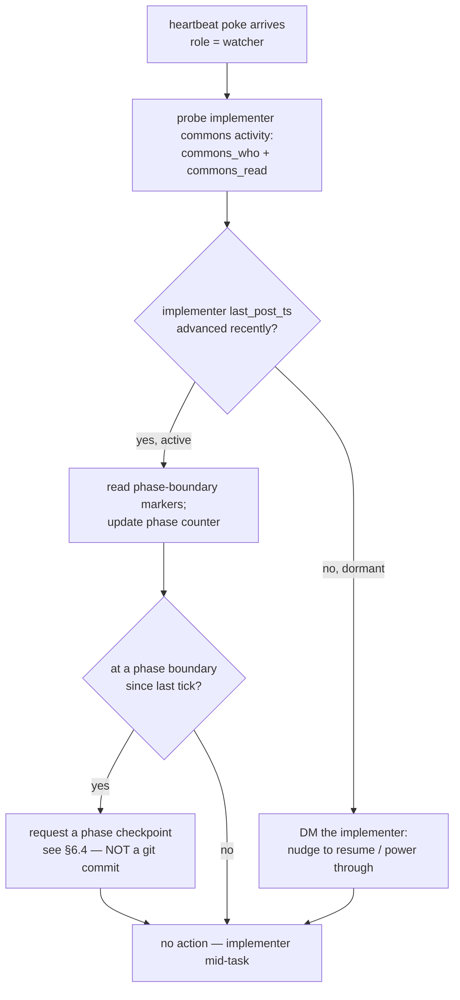

# Heartbeat Poker — D2: Watcher-mode Probe Protocol Spec

| Field | Value |
|---|---|
| **Date** | 2026-05-22 |
| **Status** | 🟢 Design-tier task **D2 complete** — protocol spec authored. Feeds I3 (protocol body authoring). |
| **Task** | D2 — "Watcher-mode Probe Protocol authoring" (2nd design-tier task per §6 of the design doc) |
| **Author** | Rio ⚡ (Lupin session `76351966`, implementer) — managed by Tiberius 🌑 |
| **Builds on** | `2026.05.20-generic-heartbeat-poker-abstraction-design.md` (`b733148`); `2026.05.22-heartbeat-poker-d1d4-class-spec.md` |
| **Specs the file** | `src/docs/agents/implementer-watch-protocol.md` — authored by task **I3** |
| **Commit status** | UNCOMMITTED on disk — never-auto-commit policy |
| **Executor** | `AI` — D2 (this spec) and I3 (the protocol body) are both `EXECUTOR: AI` |

---

## 1. Scope

D2 is design-tier. It produces the **spec** for the Watcher-mode Probe Protocol — the
required structure, content, and load-bearing requirements. Task **I3** authors the actual
protocol body at `src/docs/agents/implementer-watch-protocol.md` *per this spec*.

D2 does **not** write the protocol itself — exactly as D1+D4 specced the `HeartbeatPokerJob`
class and I1 builds it. This file is the contract I3 builds to.

---

## 2. The Watcher role — Layer-2 doctrine

The heartbeat poker is two layers (design doc §3): **Layer 1** is the use-case-agnostic
`HeartbeatPokerJob` (specced in D1+D4 — it never branches on recipient role); **Layer 2**
is the per-recipient doctrine that tells a poked session *what to do* on a tick.

The **Watcher-mode Probe Protocol** is the Layer-2 doctrine for design-doc §2 **use case 3**
— a peer session watching an implementer (the "Tiberius watching Roscoe" shape; the shape
this very session is living, Tiberius watching Rio). It is **NEW** — the Observer-mode and
Manager-mode doctrines already exist; Watcher-mode does not.

A poke carries `role: "watcher"` as opaque passthrough; the recipient session must already
be doctrine-loaded with this protocol *before* the first poke lands (design doc §3,
F-Rio-B4 — recipient cold-cast is a launch prerequisite, owned operationally by D3).

---

## 3. Doctrine home + PIP-promotion (γ ratification)

Per the 2026-05-21 γ ratification (design doc §5):

| Item | Value |
|---|---|
| **Today's home** | `lupin/src/docs/agents/implementer-watch-protocol.md` (Lupin-first) |
| **PIP-promotion target** | `planning-is-prompting/workflow/implementer-watch-protocol.md` |
| **Why Lupin-first** | Premature-generalization guard — Lupin is currently the only project running implementer-keep-alive; PIP-committing now would generalize ahead of cross-project evidence |

**PIP-promotion triggers** (promote when EITHER fires):

1. ≥1 non-Lupin project lands an implementer-keep-alive-shaped use case, OR
2. ≥2 distinct Lupin use cases require Watcher-mode.

I3's authored protocol must carry this doctrine-home + trigger table verbatim in its own
header, so a future reader knows the promotion gate. Promotion itself is a git move on
explicit user authorization (never-auto-commit) — `EXECUTOR: AI`.

---

## 4. Structural template

I3 models the protocol on the **existing Observer-mode Probe Protocol**
(`planning-is-prompting/workflow/plan-review-cascaded-common.md` §Observer-mode Probe
Protocol) — same shape: role definition → trigger → per-tick behavior steps → escalation
path → cross-references. Watcher-mode is a sibling doctrine, not a novel format.

---

## 5. Required protocol structure (the section outline I3 produces)

I3's `implementer-watch-protocol.md` must contain, in order:

1. **Header** — doctrine-home + PIP-promotion trigger table (§3 above).
2. **Role** — what a Watcher is; the implementer-keep-alive use case.
3. **Activation** — the protocol is loaded at recipient cold-cast; the poke (`role:
   "watcher"`) is the per-tick trigger.
4. **Per-tick behavior** — the numbered steps of §6.1 below.
5. **Phase-boundary-marker contract** — the two-sided dependency of §6.3.
6. **Post-escalation path** — §6.5.
7. **Cross-references.**

---

## 6. Required content — load-bearing requirements

### 6.1 Per-tick behavior (design doc §2 use case 3)

On each heartbeat poke, the Watcher session:

The three codified behaviors (each must be `EXECUTOR`-tagged per §7):
- **Probe** — `commons_who()` + `commons_read()` on the implementer's coordination topic.
- **Nudge-if-dormant** — DM the implementer when dormant (see §6.2 for "dormant").
- **Request-checkpoint-at-boundary** — at a phase boundary, request a checkpoint (§6.4).

### 6.2 Dormancy detection — reuses `commons_who().last_post_ts`

Per design-doc Q1 prior-art: no new state primitive. The Watcher reads
`commons_who().last_post_ts` for the implementer's session; "dormant" = no advance across
a Watcher-defined threshold (the protocol sets the threshold; recommend ≥2 missed cadence
intervals before nudging, to avoid false alarms on a heads-down implementer).

### 6.3 Phase-boundary-marker dependency — **NAMED content requirement** (F-Rio-E3)

The Watcher can derive *phase boundaries* (needed for §6.1 step "request checkpoint") **only
if the implementer emits phase-boundary markers**. This is an unstated dependency the
design doc surfaced as F-Rio-E3 / Q1; D2 hereby NAMES it as a hard content requirement.

I3's protocol MUST codify the **two-sided contract**:

- **Implementer side (prerequisite)** — at every task/phase boundary the implementer MUST
  emit a phase-boundary marker: a structured `commons_post` to its coordination topic
  carrying machine-parseable metadata, e.g. `{"kind": "progress", "phase_boundary": true,
  "task_done": "<id>", "task_next": "<id>"}`. *(This session's own D1+D4 → D2 progress
  notes to `dm-tiberius` are exactly this marker shape — the contract is already proven in
  practice.)*
- **Watcher side** — the Watcher reads the topic, filters on `metadata.phase_boundary ==
  true`, and counts markers to maintain its phase counter.

Without the implementer-side emission the Watcher's phase counter is **blind** — the
protocol must state this dependency explicitly, not assume it.

### 6.4 "Checkpoint" definition — reconciled with never-auto-commit ⚠️

Design-doc §2 use case 3 says the Watcher "requests phase-checkpoint **commit**" and cites
the `/plan-session-checkpoint` skill. **D2 flags a policy collision and resolves it:** an
autonomous git commit violates the never-auto-commit policy (commits require explicit user
authorization) — the exact conflict surfaced and ratified earlier in this run (Tiberius's
2026-05-22 correction: "checkpoint does NOT mean a git commit").

**Resolution — I3's protocol MUST define "checkpoint" as:**
1. Leave the work **complete, documented, and reviewable on disk**, AND
2. Emit the phase-boundary marker / progress note (§6.3).

I3's protocol MUST NOT instruct the implementer to autonomously `git commit`. The
`/plan-session-checkpoint` skill is referenced for its **work-organization shape** (a clean
mid-work stopping point), NOT as authorization to commit. Git commits remain a separate,
explicit, user-authorized step.

### 6.5 Post-escalation path

When the Layer-1 poker's dead-man's-switch fires (3 silent pokes → `notify()` to the user),
the protocol must state what the Watcher does next: the escalation is the *poker's*
`notify()` to the user; the **Watcher keeps probing and keeps nudging** (the dead-man's
switch escalates, never terminates — design doc §4). The protocol must make clear the
Watcher does not stand down on escalation — it continues until a clean termination signal
or hard cap ends the poker run.

---

## 7. EXECUTOR-tagging mandate (F-Sam-E1)

I3's authored protocol must itself `EXECUTOR`-tag **every recipient behavior it codifies**:
the §6.1 tick-behaviors (probe / nudge / request-checkpoint), the §6.3 phase-marker
emission, and the §6.5 post-escalation path. All Watcher behaviors are `EXECUTOR: AI`
(the Watcher is a CC session); the one exception to call out — spawning a fresh recipient
session is `EXECUTOR: HUMAN` (design doc §3 cold-cast step 1), but that is a launch
prerequisite owned by D3, not a per-tick Watcher behavior.

---

## 8. Cross-references

| Reference | Purpose |
|---|---|
| `plan-review-cascaded-common.md` §Observer-mode Probe Protocol | Structural template (§4) |
| `/plan-session-checkpoint` skill | Work-organization shape for the checkpoint (§6.4) — NOT a commit mandate |
| `2026.05.20-...-design.md` §2 use case 3, §5 γ ratification | Source of the Watcher role + doctrine-home |
| `2026.05.22-heartbeat-poker-d1d4-class-spec.md` | Layer-1 poker the protocol pairs with |
| design doc §3 / F-Rio-B4 | Recipient cold-cast prerequisite (D3 owns it operationally) |

---

## 9. Handoff to I3

I3 authors `src/docs/agents/implementer-watch-protocol.md` per §5 (structure) + §6 (content)
+ §7 (EXECUTOR tags). I3 must also address the §6.3 phase-boundary-marker dependency in the
protocol body (the design doc's I3 row names this explicitly).

---

## 10. Status

D2 complete — protocol spec on disk, **uncommitted** per the never-auto-commit policy. Next
in the chain: **D3** — co-exist semantics + 5 swap-criteria detailed design (incl. the
recipient-cold-cast launch-prerequisite runbook).

— Rio ⚡ (Lupin session `76351966`), 2026-05-22
