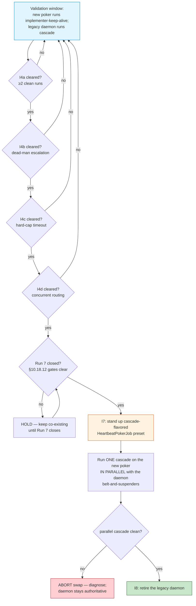

# Heartbeat Poker — D3: Co-exist Semantics + Swap-Criteria + Retirement Playbook

| Field | Value |
|---|---|
| **Date** | 2026-05-22 |
| **Status** | 🟢 Design-tier task **D3 complete** — operational doc authored. Closes the design tier (D1+D4, D2, D3 all done). |
| **Task** | D3 — "Co-exist semantics + 5 swap-criteria detailed design" (3rd / final design-tier task per §6 of the design doc) |
| **Author** | Rio ⚡ (Lupin session `76351966`, implementer) — managed by Tiberius 🌑 |
| **Builds on** | `2026.05.20-...-design.md` (`b733148`) §5 Q3; `2026.05.22-heartbeat-poker-d1d4-class-spec.md`; `...-d2-watcher-protocol-spec.md` |
| **Drives** | swap-validation gates I4a-d, swap-promotion I7, retirement I8 |
| **Commit status** | UNCOMMITTED on disk — never-auto-commit policy |
| **Executor** | `AI` for D3 authoring; per-step `EXECUTOR` tags inline below |

---

## 1. Scope

D3 is the third and final design-tier task. It produces the **concrete operational doc**
for the validation-and-swap phase:

1. **Co-existence model** — how the new `HeartbeatPokerJob` runs alongside the legacy
   `cascade_heartbeat_scheduler.py` daemon during validation (§2).
2. **Observation taxonomy** — what to observe while both run (§3).
3. **5 swap-criteria + decision tree** — the §5 Q3 gates, mapped to tasks I4a-d, with
   programmatic pass criteria + ownership (§4, §5).
4. **Retirement playbook** — how I8 retires the legacy daemon without losing behavior (§6).
5. **Recipient cold-cast launch-prerequisite runbook** — the §3 three-step sequence,
   `EXECUTOR`-tagged (§7) — per finding F-Sam-B1.

D3 designs; tasks I4a-d / I7 / I8 execute against it. Those are operator-event-driven and
sit **after** the I10 finish line of the current run.

---

## 2. Co-existence model

Per the §5 Q3 ratification — **(b) co-exist during validation**. The decisive argument:
the cascade re-evaluation gates at pipeline-doc §10.18.12 require the cascade infrastructure
to stay STABLE across Runs 5+6+7; swapping `cascade_heartbeat_scheduler.py` mid-window would
confound anomalies in those runs with the new-daemon variable.

**During the validation window the two systems own different workstreams:**

| System | Owns | Status during validation |
|---|---|---|
| Legacy `cascade_heartbeat_scheduler.py` (shell-script daemon) | The **cascade** heartbeat | UNCHANGED — stays the source of truth for cascade through Run 7 |
| New `HeartbeatPokerJob` (CJ Flow agentic job) | The **implementer-keep-alive** runs (the novel use case) | Exercised + validated against the 5 swap-criteria |

They do **not** overlap on the same workstream during validation — so "co-existence" is
*parallel non-interference*, not *redundant double-coverage*. The new poker proves itself on
the novel use case; the cascade stays on the proven daemon until the swap.

---

## 3. Observation taxonomy

What to observe while both systems run (the evidence base for the swap-gate ratifications):

| Category | What to watch | Pass shape |
|---|---|---|
| **Clean termination** | New poker exits on `implementation_done` signal posted after `job_start_ts` | `_transition_to_done`, zero false early-exits |
| **Dead-man's-switch** | 3 silent pokes → `notify()` once per streak; poking continues | fires on genuine silence, never on a responsive recipient |
| **Hard cap** | `max_duration_seconds` elapses → `notify()` + clean stop | `_transition_to_done`, timeout reason logged |
| **Concurrent routing** | Two pokers active → each tick routes to the correct role-handler via `poke_body` | no cross-poker signal bleed |
| **Non-interference** | New poker + legacy daemon running together | neither reads/triggers the other's `termination_topic`; no commons collision; no false signals |
| **Pool occupancy** | Agentic-pool slot held by the poker | fast-lane + other agentic jobs not starved (pool sized ≥ N+1) |

---

## 4. The 5 swap-criteria — detailed

From §5 Q3, with programmatic pass criteria. Each maps to a swap-validation task. **Ownership
(F-Sam-D1): the validation run is `EXECUTOR: AI`; the go/no-go gate-ratification is
`EXECUTOR: HUMAN` (operator).** A criterion is "cleared" only against its programmatic pass
criterion — never a subjective "fires correctly."

| # | Task | Criterion | Programmatic pass criterion | Pre-swap satisfiable? |
|---|---|---|---|---|
| 1 | **I4a** | ≥2 implementer-keep-alive runs, clean termination via `implementation_done` | both runs reach `_transition_to_done` with `implementation_done` logged; zero false early-exits | yes |
| 2 | **I4b** | ≥1 dead-man's-switch escalation, correct | `notify()` fires exactly once per silent streak on a genuinely-silent recipient (verified vs `commons_who().last_post_ts`), never on a responsive one | yes (deliberate test) |
| 3 | **I4c** | ≥1 hard-cap timeout, correct | a `max_duration_seconds` run reaches hard-cap exit with `_transition_to_done` + timeout-reason `notify()`; elapsed ≥ `max_duration_seconds` (± one cadence) | yes (deliberate test) |
| 4 | **I4d** | ≥1 concurrent-poker routing exercise | two pokers run concurrently, every tick routes to the correct role-handler via `poke_body`, no cross-poker signal bleed | yes — via two implementer-watch pokers OR a deliberate two-poker test (the canonical cascade+implementer pairing cannot occur until post-swap) |
| then | — | Run 7 closes (cascade re-evaluation gates §10.18.12 clear) | the §10.18.12 gates recorded clear | n/a — event-driven |
| swap | **I7→I8** | execute the migration | see §5 + §6 | post-`then` only |

All four I4a-d sub-gates are **operator-event-driven** — each trips on its own production
event over days/weeks, or via a deliberate test run (F-Rio-E4b). They are a checklist, not
a calendar sequence; ratify each independently as its event fires.

---

## 5. Swap-promotion decision tree

Every gate diamond's go/no-go is `EXECUTOR: HUMAN` (operator ratification against the §4
programmatic pass criterion). The validation runs feeding each gate are `EXECUTOR: AI`.

---

## 6. Retirement playbook (task I8)

When the swap decision tree reaches I8:

1. **Migrate the budget-check logic FIRST** `EXECUTOR: AI` — the cascade-specific functions
   `check_section_budgets` + `fire_budget_warning` live *inside* `cascade_heartbeat_scheduler.py`.
   They are NOT generic poker behavior (the Layer-1 poker correctly omits them) — they are
   Manager-mode doctrine. Migrate them into the Manager-mode Layer-2 doctrine **before**
   deleting the script, or the behavior is silently lost (finding F-Rio-E2 / RA-A1 E-side).
2. **Migrate external consumers** `EXECUTOR: AI` — find every caller / referencer of the
   script + `start-cascade-heartbeat.sh`; re-point them at the cascade-flavored
   `HeartbeatPokerJob` preset.
3. **Delete the daemon** `EXECUTOR: AI` (edit) — remove `cascade_heartbeat_scheduler.py` +
   `start-cascade-heartbeat.sh`. The deletion lands in the working tree; the **commit** is a
   separate explicit user-authorized step (never-auto-commit).
4. **Update PIP docs** `EXECUTOR: AI` — `plan-review-cascaded-common.md` §Heartbeat Handling
   and any other PIP doc referencing the shell script.

Retirement is gated on the §5 parallel-cascade run being clean (decision tree node J). If
the parallel cascade diverges, ABORT — the daemon stays authoritative until diagnosed.

---

## 7. Recipient cold-cast launch-prerequisite runbook (F-Sam-B1)

A poke carries `role` (a doctrine *selector*), never the doctrine *body* — so the recipient
session must already be doctrine-loaded **before the first poke lands** (design doc §3,
F-Rio-B4). This is a launch prerequisite of *every* poker run; D3 owns it operationally as
a runbook:

| Step | Action | Executor | Notes |
|---|---|---|---|
| 1 | **Spawn the recipient session** | `HUMAN` | Spawning a fresh CC session is outside the AI tool surface — a legitimate human launch step |
| 2 | **DM the role brief + Layer-2 doctrine pointer** to that session | `AI` | e.g. `commons_send_to(recipient, "<role brief> — load <doctrine path>")` |
| 3 | **Load the doctrine into the recipient's context** | `AI` | the recipient session reads the Layer-2 protocol it was pointed at (Observer-mode / Manager-mode / Watcher-mode `implementer-watch-protocol.md`) |

**Gate**: a `HeartbeatPokerJob` MUST NOT be launched until step 3 completes for **every**
recipient in its `recipients` roster — else the first poke reaches a session that does not
know what to do with it. The launching operator confirms cold-cast completion as a
pre-launch checklist item.

---

## 8. Cross-references

| Reference | Purpose |
|---|---|
| design doc §5 Q3 | The co-exist ratification + 5 swap-criteria source |
| design doc §3 / F-Rio-B4 / F-Sam-B1 | Cold-cast prerequisite (§7) |
| design doc §6 I4a-d / I7 / I8 | The tasks D3 drives |
| `cascade_heartbeat_scheduler.py` | The legacy daemon retired by I8; source of the budget-check functions |
| pipeline-doc §10.18.12 | Cascade re-evaluation gates — the "then" gate |
| `d1d4-class-spec.md`, `d2-watcher-protocol-spec.md` | Sibling design-tier outputs |

---

## 9. Status

D3 complete — operational doc on disk, **uncommitted** per the never-auto-commit policy.
**This closes the design tier** — D1+D4, D2, D3 all done. Next in the chain: **I1** — build
the `HeartbeatPokerJob` class (code lands in `src/cosa/agents/`; edited freely, CoSA commits
are not made from this parent-Lupin session).

— Rio ⚡ (Lupin session `76351966`), 2026-05-22
