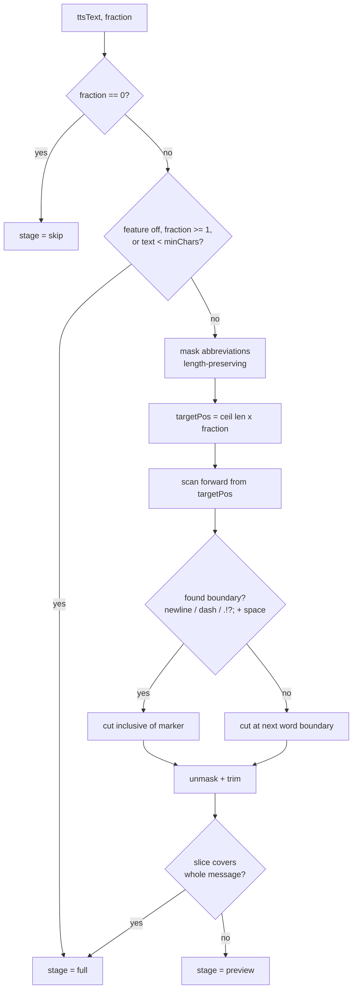

# TTS Limiter — Smarter Sentence-Boundary Truncation

**Date**: 2026-05-22
**Status**: ✅ Implemented & verified — 2026-05-22
**Author**: Rio ⚡ (session 76351966)
**Scope**: `src/fastapi_app/static/js/notifications.js` — client-side TTS preview-fraction logic

---

## TL;DR

The TTS preview-fraction slider (0 / 25 / 50 / 75 / 100%) truncates a spoken
message by **sentence count**. Technical lists have no sentence punctuation,
so the sentence splitter mis-handles them and reads roughly **half a list**
aloud when the slider is at 25%.

This plan replaces the sentence-count algorithm with a **character-position-
anchored forward scan**: jump to the desired fraction of the message length,
then read forward to the next natural boundary. The key twist — **the newline
character `\n` is a boundary** — because that is how a list item ends when it
has no `. ! ?` punctuation.

---

## Problem — current behavior

The slider lives entirely in client-side JS. Two functions own it in
`notifications.js`:

- `_splitIntoSentences( text )` — splits on the regex
  `(?<=[.!?;])\s+(?=[A-Z])` (terminal punctuation + whitespace + capital
  letter). Falls back to a word-count midpoint split when it produces a single
  chunk of >12 words.
- `_computeTTSPreview( item )` — splits the message into sentences, then plays
  `ceil( sentenceCount × fraction )` of those chunks.

### Why lists break it

A newline-separated list of technical terms has **zero `. ! ?` punctuation**:

```
Here are the affected modules:
running_fifo_queue.py
todo_fifo_queue.py
queue_consumer.py
agentic_job_factory.py
... (40 more lines)
```

Walk it through the current algorithm:

1. `_splitIntoSentences()` finds no terminal-punctuation boundary → returns
   **1 chunk**.
2. The >12-word fallback fires → splits at the word midpoint → **2 chunks**.
3. Slider at 25%: `previewCount = ceil( 2 × 0.25 ) = 1` chunk.
4. That one chunk is the **first half of the entire list**.

Result: a 40-item jargon dump still reads ~20 items aloud. The slider does not
meaningfully limit verbosity for exactly the message shape that needs it most.

---

## Solution — character-position forward scan

Replace the sentence-count logic with a character-anchored scan.

### Algorithm

1. **Target position**: `targetPos = ceil( text.length × fraction )` — the
   character index of the desired fraction (e.g. 25% of the message).
2. **Forward scan**: from `targetPos`, walk forward one character at a time
   looking for the first **boundary**:
   - **`\n` newline — always a boundary.** *(the twist)* A list item ends at a
     newline even with no punctuation.
   - **em-dash `—` (U+2014) / en-dash `–` (U+2013) — always a boundary.**
   - **`. ! ? ;` — a boundary only when the next character is whitespace or
     end-of-string.** This rejects the periods inside `3.14`, `v0.1.7`,
     `file.py` — internal periods are followed by a digit/letter, not space.
3. **Cut** inclusive of the marker character.
4. **Abbreviation guard**: `Mr.`, `e.g.`, `a.m.`, etc. are pre-masked with a
   length-preserving placeholder (U+0001) so their periods never become false
   boundaries; the placeholder is restored after slicing. Length-preserving
   masking keeps every character index valid.
5. **No-boundary fallback**: if the scan reaches end-of-string with no marker,
   cut at the **next word boundary** after `targetPos`. The preview is never
   silently expanded back to 100% when the user asked for less.

The preview is therefore *at least* the requested fraction and extends forward
to the next natural stopping point.

### Flow



---

## Decisions baked in — Rick may veto either

### 1. Dash = em-dash / en-dash only — NOT hyphen-minus `-`

Hyphen-minus is ubiquitous inside compound words and file names
(`bug-fix-queue`, `end-to-end`, `running-fifo-queue`). Treating it as a
boundary would shred list items mid-term. Em-dash and en-dash are genuine
sentence-level punctuation and safe to treat as boundaries.

### 2. No-boundary fallback cuts at the next word

When a message has no boundary at all after the fraction mark (a pathological
boundary-free run-on), the scan cuts at the next whitespace. This honors the
"limit verbosity" intent — the limiter never silently plays the full message
when the slider asked for 25%.

---

## Files changed

| File | Change |
|------|--------|
| `src/fastapi_app/static/js/notifications.js` | New `_truncateAtBoundary( text, fraction )` helper; rewrite `_computeTTSPreview()` to call it; replace dead `_splitIntoSentences()`; rewrite inline `_tts_quick_self_test()` for the new algorithm. |
| `src/fastapi_app/static/html/notifications.html` | Cache-bust `notifications.js?v=20260521i` → `?v=20260522a`. |
| `src/conf/lupin-app.ini` + `lupin-app-splainer.ini` | Remove the now-vestigial `tts preview include semicolons` key + splainer entry; refresh the surrounding comment/splainer text to describe the boundary scan. |
| `src/cosa/rest/routers/system.py` *(CoSA submodule)* | Remove the `tts_preview_include_semicolons` config read + client-config dict entry; refresh the comment. Commit separately in the CoSA repo. |

The TTS-limiting **algorithm** is confined to the legacy `notifications.js`
frontend. The multiplexer TypeScript codebase has **no** copy of the preview
logic (verified by grep) — no second site to keep in sync. The `system.py`
edit is config-plumbing cleanup only — it removes a now-unreferenced flag.

---

## Testing

- **Syntax**: `node --check src/fastapi_app/static/js/notifications.js`.
- **Inline self-test**: rewrite `_tts_quick_self_test()` (runs at init when
  `this.debug`) to cover the new helper:
  - newline-separated list, slider 25% → cut at the newline nearest the mark
  - plain prose, slider 50% → cut at a sentence period
  - decimal / version false-positive (`3.14`, `v0.1.7`) not a boundary
  - em-dash boundary
  - `Mr.` abbreviation not a false boundary
  - no-boundary run-on → word-boundary fallback
  - fraction 0 → skip; fraction 1 → full
- No E2E test currently covers the slider; the inline self-test is the
  established contract for this logic in `notifications.js`.

---

## Tradeoff — noted, not a question

The preview extends forward from the fraction mark to the next boundary, so a
pathological run-on with no newlines *and* no punctuation could overshoot the
requested fraction. The newline twist bounds the common case (lists). No hard
ceiling is imposed — this matches the spec ("read forward until you get to a
marker").

---

## Out of scope

- No server-side change to the limiting *logic* — the boundary-scan algorithm
  is purely client-side, applied before the preview text is dispatched to the
  speech endpoint. (The `system.py` edit is config-plumbing cleanup only.)
- No change to the slider UI, the 0/25/50/75/100 stops, or localStorage
  persistence of the runtime override.

---

## Implementation log — 2026-05-22

Implemented and verified the same day the plan was approved.

**Edits landed**:
- `notifications.js` — `_splitIntoSentences()` replaced by `_truncateAtBoundary()`;
  `_computeTTSPreview()` rewritten to the character-position scan with a
  `previewText.length >= text.trim().length` full-message guard;
  `_tts_quick_self_test()` rewritten with 8 boundary-scan cases; init-time
  self-test comment refreshed; two `ttsPreviewIncludeSemicolons` config reads
  removed (with equals-sign re-alignment).
- `notifications.html` — cache-bust bumped to `?v=20260522a`.
- `lupin-app.ini` / `lupin-app-splainer.ini` — `tts preview include semicolons`
  key + splainer entry removed; comment/splainer text refreshed.
- `system.py` (CoSA) — `tts_preview_include_semicolons` config read +
  client-config dict entry removed.

**Verification** (all executed):

| Check | Result |
|-------|--------|
| `node --check notifications.js` | ✅ syntax OK |
| Boundary-scan algorithm — 8 self-test cases run in Node | ✅ 8/8 passed |
| `py_compile` on `system.py` | ✅ OK |
| Import chain `cosa.rest.routers.system` | ✅ OK |
| `ConfigurationManager` load — 3 surviving `tts preview *` keys resolve; removed key returns default | ✅ OK |

The 8 self-test cases: newline-boundary list cut, prose sentence-terminal cut,
decimal (`3.14159`) not a false boundary, em-dash boundary, hyphen-minus NOT a
boundary, abbreviation (`Mr.`) not a false boundary, no-boundary run-on →
word-boundary fallback, and `fraction >= 1` → whole text.

**Not automatable here**: the in-browser run of `_tts_quick_self_test()` (fires
at `init()` when `this.debug`) exercises the identical algorithm already
verified above via the Node harness. To see the fix live, hard-refresh the
notifications page — the `?v=20260522a` cache-bust forces the new JS.
