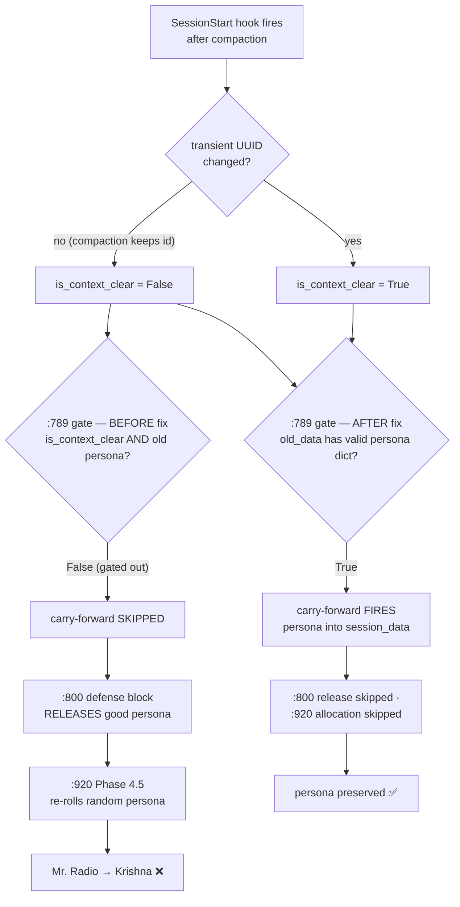

# Voice Persona — `request_persona` MCP Tool + Compaction Carry-Forward Fix

**Author**: Tiberius 🌑 (session `2ce59c03`)
**Date**: 2026-05-22
**Status**: ✅ Plan approved 2026-05-22 (`~/.claude/plans/wise-knitting-turing.md`) — implementation in progress
**Triggered by**: Live observation 2026-05-22 — the **Mr. Radio** session went through a
context compaction and came back allocated as **Krishna**. Rick asked whether the
cosa-voice MCP server has a method to force a session to re-request a named persona.

---

## Context

Two related gaps in the per-session voice-persona system:

1. **No MCP recovery path.** The cosa-voice MCP server exposes 15 `@mcp.tool`
   functions. Persona is *read-only* through MCP — `get_session_info()` reads the
   `voice_persona` block off the session bridge file; nothing writes it. The
   capability to *request or swap* a named persona already exists at the HTTP
   layer — `POST /api/cosa-voice/voice-persona/{sid}/allocate?requested_persona_name=…`
   (`voice_persona.py:230-279`, a genuine request-or-swap path: it swaps an
   existing allocation, returns 422 if the name is not in the pool, 409 if another
   live session holds it, and broadcasts a `voice_persona_assigned` WS event).
   That endpoint is simply never surfaced as an MCP tool, so a session — or Rick
   by voice — has no way to say "become Mr. Radio again."

2. **Carry-forward misses compaction.** The Claude Code SessionStart hook carries
   a voice persona forward only inside a gate keyed on `is_context_clear`
   (`register_session.py:789`). `is_context_clear` is set `True` only when the
   transient session UUID changes (`:749-750`). On a context **compaction** that
   keeps the same transient id, `is_context_clear` stays `False`, and the failure
   cascade is:

   - the explicit carry-forward at `:789` is **skipped** (`session_data` gets no
     `voice_persona`);
   - the defense-in-depth block at `:800` sees `not session_data.get("voice_persona")`
     and the old bridge still has a persona → it **actively releases** the good
     persona via HTTP and stashes `previous_persona_name`;
   - Phase 4.5 at `:920` sees `"voice_persona" not in session_data` → it
     **re-allocates a fresh random persona**.

   Net result: Mr. Radio → Krishna.

---

## Task 1 — `request_persona(name)` MCP tool

A new `@mcp.tool` in `src/lupin_mcp/cosa_voice_mcp.py`, inserted after
`disable_speakerphone` to keep the session-state tools grouped. Modeled on
`_flip_speakerphone` — the nearest sibling: a state-mutating `/api/cosa-voice/*`
call from MCP that resolves the session id, logs in for a JWT, POSTs, and maps
the response.

**Behavior:**

- Resolve the session id exactly as `_flip_speakerphone` does:
  `cc_meta = _get_cc_metadata(); sid = stable_session_id or session_id or SESSION_ID`.
- Light client-side guard: empty/whitespace `name` → `status:"error"` without an
  HTTP round-trip.
- Auth: `get_hook_credentials(project)` → `POST /auth/login` → `tokens.access_token`
  → `Authorization: Bearer …` (verbatim the `_flip_speakerphone` pattern).
- `POST {SERVER_URL}/api/cosa-voice/voice-persona/{sid}/allocate` with query param
  `requested_persona_name=<name>`.
- **Explicit status-code mapping** (unlike `_flip_speakerphone`, which raises on
  any non-200 — here 422/409 are *meaningful structured outcomes*, not failures):

  | HTTP | Tool return |
  |---|---|
  | `200` | `{status:"ok", voice_persona:{…}, swapped:bool, message:"You are now <display_name>."}` |
  | `422` | `{status:"not_in_pool", requested, available:[…]}` |
  | `409` | `{status:"occupied", holding_session_id, holding_persona_name, available:[…]}` |
  | `404` / `500` / other | `{status:"error", reason:…}` |
  | transport error (ConnectionError/Timeout/…) | `{status:"error", reason:…}` |

- **No degraded bridge-write fallback.** Persona allocation must go through the
  server's `_voice_persona_lock`-guarded allocator; a direct bridge write would
  bypass pool-occupancy checks and risk a double allocation. On HTTP failure the
  tool returns `status:"error"` and stops.

**Docstring:** grouped with the session-state tools; states plainly that
`request_persona` is **user-initiated only** — call it solely when the user
explicitly asks to change or reclaim a persona, never autonomously. The toolkit-map
table in the server `instructions` string (the "Session state" row) is updated to
list it.

## Task 2 — Carry-forward fix (compaction + resume)

A one-condition change in `src/lupin_cli/claude_code/hooks/register_session.py`.

**`:789`** changes from:

```python
if is_context_clear and old_data and isinstance( old_data.get( "voice_persona" ), dict ):
```

to:

```python
if old_data and isinstance( old_data.get( "voice_persona" ), dict ):
```

**Rationale.** A session keeps its persona for life. `old_data` is non-`None`
only on a *subsequent* lifecycle event (clear / compact / resume / `--continue`
double-fire) — never on a genuinely fresh start, where the lockfile is created
fresh and `old_data` stays `None`. So whenever a prior bridge carries a valid
`voice_persona` dict, it should be preserved — regardless of whether the
transient UUID rotated. The fix is deliberately **agnostic** to whether
compaction rotates the session id; it closes the bug either way and needs no new
`source`-field plumbing.

With the persona now in `session_data`, the two downstream stages self-correct:
the `:800` defense-in-depth release no longer fires (we are preserving, not
releasing), and the `:920` Phase 4.5 allocation gate correctly skips re-allocation.

`is_context_clear` is left intact for its other consumers — the `:751`
`_cleanup_old_listener` call, the `:825` idle-backoff carry-forward, and the
`:966` TTS message. Only the persona gate is broadened. The comment blocks at
`:782-788` and `:907-919` are updated to read "across any context reset
(/clear, /compact, resume)" rather than "/clear".

### Failure path (before fix) vs fixed path



**Residual — out of scope.** The separate `vp_is_dict=False` case — where the
bridge's `voice_persona` is genuinely missing/None at hook-read time — cannot be
fixed by carry-forward (there is nothing to carry). That is the in-flight `/clear`
re-roll investigation (`src/rnd/v0.1.7/2026.05.02-voice-persona-clear-preservation/`).
`session_end.py:232` already guards releases on `clear`/`compact`, so the known
SessionEnd leak is closed.

---

## Phased Implementation

| Phase | What | Files |
|---|---|---|
| 0 | This R&D doc (documentation-first) | this file |
| 1 | `request_persona` MCP tool + toolkit-map update | `cosa_voice_mcp.py` |
| 2 | Carry-forward gate broadened + comments | `register_session.py` |
| 3 | Unit + smoke tests; 100% branch coverage; live E2E | `test_cosa_voice_mcp_request_persona.py` (new), `test_register_session_preservation.py`, `test_mcp_smoke.py` |

## Verification

| Layer | Command | Venue |
|---|---|---|
| Compile | `py_compile` on each edited `.py` | — |
| Unit | `pytest src/tests/unit/test_cosa_voice_mcp_request_persona.py src/tests/unit/test_register_session_preservation.py -v` | :7999 |
| Coverage | `pytest --cov-branch --cov-fail-under=100` on new/changed modules | :7999 |
| Smoke | `pytest src/tests/smoke/test_mcp_smoke.py -v` | :7999 |
| Live E2E | call `request_persona` from this session (swap out + back to Tiberius) | :7999 |

All venues :7999 AI-discretionary — no persistent-state mutation beyond ephemeral
per-session bridge files, all sub-2-minute, no monopoly required.

---

## Execution Log

### Phase 0 — Documentation
- 2026-05-22 — R&D doc created and serialized from the approved plan.

### Phase 1 — `request_persona` MCP tool
- Added `_persona_error_detail` (error-body extractor), `_request_persona` (HTTP
  request/swap logic), and the `request_persona` `@mcp.tool` thin wrapper to
  `cosa_voice_mcp.py`, after `disable_speakerphone` (`:1753-1930`).
- Updated the toolkit-map "Session state" row in the server `instructions`
  string to list `request_persona`.
- `py_compile` clean.

### Phase 2 — Carry-forward fix
- `register_session.py` — dropped `is_context_clear` from the voice_persona
  carry-forward gate (now `:798`); the gate fires whenever a prior bridge holds
  a valid `voice_persona` dict. Comment blocks above the gate and at Phase 4.5
  updated to "any context reset (/clear, /compact, resume)".
- `py_compile` clean.

### Phase 3 — Tests & verification
- New `test_cosa_voice_mcp_request_persona.py` — 19 tests, every branch of the
  three new units (input guards, metadata-failure fallback, login failure,
  200 / 422 / 409 / other-status / transport-error / malformed-login, tool
  wrapper, registration).
- Extended `test_register_session_preservation.py` — `TestCompactionAndResumeCarryForward`:
  same-transient-id event with persona → preserved (release + alloc skipped);
  without persona → allocation fires.
- Extended `test_mcp_smoke.py` — Test 11 asserts `request_persona` registers as
  a `FunctionTool` on the real module.
- Results: 30/30 new+extended unit tests pass; 38/38 sibling MCP tests pass
  (no regression). Branch-coverage: `cosa_voice_mcp.py` new block `:1753-1930`
  has zero missing lines/partials; `register_session.py:798` fully branch-covered.
- Live E2E (`:7999`) — exercised the real `_request_persona` helper against the
  live server targeting this session: a `409 occupied` (Tiffany held by session
  `1b3f8c46`) and a `200 idempotent ok` (re-request own Tiberius) both parsed
  correctly; session ended as Tiberius. The `200`-with-`swapped:true` path is
  unit-covered. The `@mcp.tool` transport surface itself becomes callable only
  after the MCP server subprocess reloads (next CC session start) — registration
  is confirmed live via smoke Test 11.
- Out-of-blast-radius (not run, with reason): WebSocket smoke / E2E UI /
  integration suites — this change touches only the MCP server module and a
  CC-session hook; it adds no FastAPI router, WS event, or frontend surface.

**Status: ✅ Implementation + verification complete 2026-05-22.**
