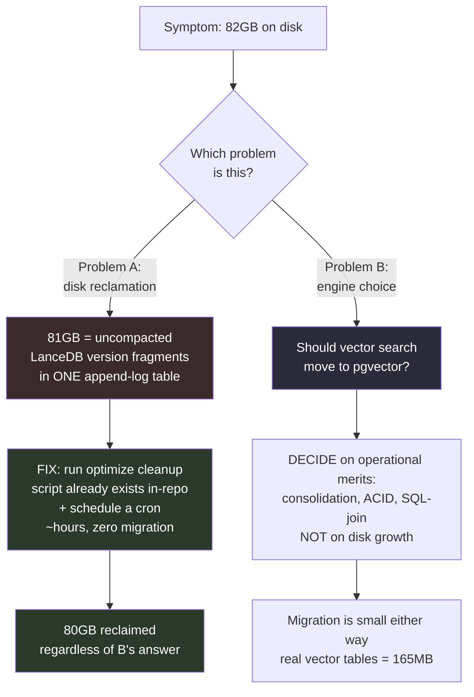
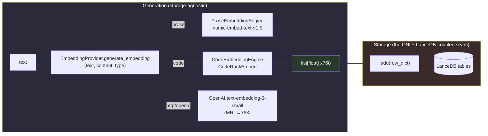
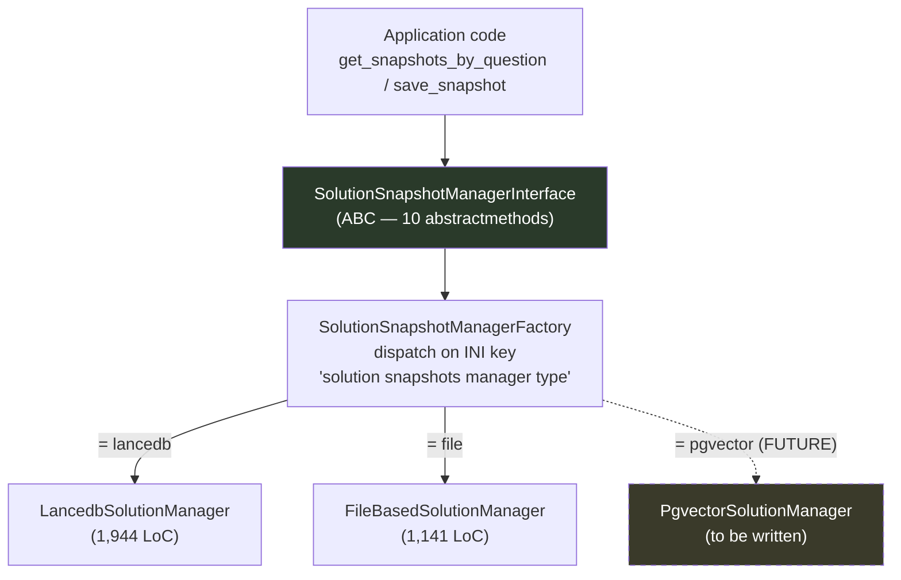
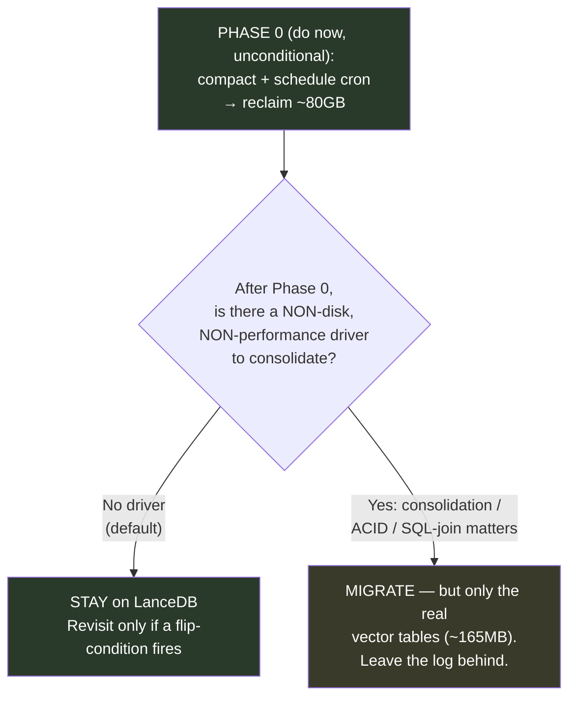

<!-- R&D analysis — serialized to src/rnd/v0.1.8/ on 2026-05-29 per Rick's go-ahead (branch wip-v0.1.8-2026.05.29-preparing-for-gcp-deployment). Origin: multi-agent research workflow wkiwwi4u4 / wf_f7254ca6-b61, authored by Tiberius 👑 (session c9c582b7). -->

# Migrating Lupin from LanceDB to PostgreSQL/pgvector

**An R&D analysis for Rick**
**Author:** Tiberius 👑
**Date:** 2026-05-29
**Status:** Decision-support analysis — recommendation reached, gated on a Phase 0 quick win

---

## 1. TL;DR

- **The 81 GB is not a vector problem and it is not an engine problem.** I measured the live database: of 82 GB on disk, **81 GB is `_versions/` (stale, uncompacted LanceDB append-log fragments) and only 898 MB is active `data/`** — all in a single table, `input_and_output_tbl`. ~98.9% of the "bloat" is reclaimable version history concentrated in one append-on-every-query conversation log.
- **The single most important reframe:** you are conflating two unrelated questions. *"How do I reclaim 80 GB?"* and *"Should I move my vector search from LanceDB to Postgres?"* are different problems with different answers, different costs, and different timelines. Treating them as one ("migrate to fix the bloat") prescribes an infrastructure rewrite for a missing-cron problem.
- **Verdict on the bloat:** Fix it in place. The cure already exists in-repo — `src/scripts/cleanup_lupin_lancedb.py` wraps `Table.optimize(cleanup_older_than=...)`. It has **never been wired into any scheduler** (I grepped: zero cron, systemd, docker-compose, or init callers). A one-time run reclaims ~98% of the 81 GB; a scheduled run prevents recurrence. This is a **few-hours fix, not a migration.**
- **Verdict on the engine migration:** At Lupin's actual scale — tens of thousands of 768-dim vectors, single node — **engine choice is performance-irrelevant.** Both pgvector (2–6 ms HNSW, or exact search with no index at all) and LanceDB (sub-20 ms brute force, no index needed below ~1M rows) deliver sub-10 ms top-k. A migration buys you **zero query-performance improvement.**
- **Migration *is* defensible — but only on operational/architectural grounds**, never on the disk-growth premise. The honest pros: datastore consolidation onto already-deployed Postgres, transactional consistency between vectors and their metadata, SQL-joinability, and retiring a second storage subsystem (LanceDB + GCS sync + warmup machinery). The honest cons: pgvector *shifts* maintenance burden (VACUUM/REINDEX, HNSW recall decay, WAL amplification, `pg_dump` does not capture index bytes) rather than eliminating it.
- **`input_and_output_tbl` should probably not be migrated to pgvector at all.** It carries embeddings and an ANN method (`get_knn_by_input`), but that search path is **dead code** — zero production callers, invoked only in a smoke test. It is a log. Lifting it into pgvector as a "vector table" is a category error that would balloon a 5-minute job into a multi-hour one and relocate unbounded append growth into Postgres WAL/autovacuum pressure.
- **Recommendation (one line):** **Phase 0: run the compaction (do this regardless). Then decide migration on consolidation merits with a clear head — and if you migrate, migrate only the genuine vector tables (~165 MB), leave the log behind, and use the manager abstraction as your cutover seam.**

---

## 2. The actual problem

### 2.1 What Rick is experiencing

The symptom is stark and real: the LanceDB directory has grown to **82 GB**, dominated by a single table. This *looks* like a storage-engine failure — "LanceDB grows unboundedly, I need a real database." That intuition is wrong, and the wrongness is the whole point of this document.

### 2.2 Root-cause diagnosis (measured, not inferred)

I ran `du` against the live store. Here is the decomposition:

```
82G   lupin.lancedb (total)
└─ 82G   input_and_output_tbl.lance
   ├─ 81G    _versions/        ← stale version manifests + unreferenced fragments
   ├─ 898M   data/             ← active parquet (the ONLY data anyone reads)
   └─ 103M   _transactions/    ← transaction logs
   99,585 files in this one table
```

Every other table combined is **under 165 MB**:

| Table                       | Size  | Role                          |
|-----------------------------|-------|-------------------------------|
| `gist_cache`                | 92M   | LLM gist cache (KV)           |
| `prediction_decisions`      | 31M   | CBR proxy decisions           |
| `solution_snapshots`        | 19M   | Playable snapshot store (ANN) |
| `query_log`                 | 13M   | Audit log                     |
| `canonical_synonyms`        | 3.5M  | Exact-match lookup            |
| `embedding_cache_tbl`       | 1.9M  | Text→embedding cache (KV)     |
| `question_embeddings_tbl`   | 32K   | Question→embedding cache (KV) |

**The root cause is a self-inflicted housekeeping gap.** Lance is an append-only, immutable format: every `.add()` (every conversation-log write) creates a *new* data fragment plus a *new* version manifest, and **never mutates or deletes the old ones**. The standard, documented cure is periodic `Table.optimize(cleanup_older_than=...)`, which compacts fragments and prunes old versions in one call. Lupin appends on every query and **has never run compaction in any automated path.** Over weeks, 99,585 files accumulated; 98.9% of them are dead version history nothing reads.

This is corroborated by an in-repo precedent: the cleanup script's own docstring records that on **2026-04-27 the same table was 43 GB with only 620 MB active (42 GB stale).** It has simply regrown ~2× since the last manual cleanup. This is the textbook LanceDB append-without-compaction anti-pattern — and it is reproducible in *any* append-without-vacuum store, including Postgres.

### 2.3 Two problems, not one



> **The load-bearing claim, stated bluntly:** Migrating to Postgres/pgvector to "solve the 81 GB" is solving a missing-cron problem with an infrastructure rewrite. The adversarial verification **refuted** the migrate-to-fix-bloat framing outright. Problem A is fixable in hours, in place, with code you already have. Problem B is a real but *separate* architectural choice that should be made on its own merits.

---

## 3. Current LanceDB architecture in Lupin

### 3.1 Table inventory

Lupin's memory layer is **8 persistent LanceDB tables** (plus 2 test tables). They split cleanly into one append-log, one genuine-ANN store, and a set of trivial KV/log tables:

| Table                     | Size  | Vector cols                        | Live ANN search?         | Role                                  |
|---------------------------|-------|------------------------------------|--------------------------|---------------------------------------|
| `input_and_output_tbl`    | 82G   | input_embedding, output_embedding  | **No** (dead code)       | Append-only conversation log          |
| `solution_snapshots`      | 19M   | question/code/solution (3×768)     | **Yes** — 3 ANN paths    | Cached, replayable solutions          |
| `prediction_decisions`    | 31M   | embedding_verbatim/normalized      | Yes — CBR top-k=5        | Proxy decision CBR retrieval          |
| `gist_cache`              | 92M   | none                               | No                       | question→gist LLM cache (KV)          |
| `query_log`               | 13M   | verbatim/normalized (unused)       | No                       | Append-only audit log                 |
| `canonical_synonyms`      | 3.5M  | 3× (stored, not searched)          | No — pandas filtering    | Exact-match synonym lookup            |
| `embedding_cache_tbl`     | 1.9M  | embedding (768, KV value)          | No                       | normalized-text→embedding cache       |
| `question_embeddings_tbl` | 32K   | embedding (768, KV value)          | No                       | question→embedding shadow cache       |

All embeddings are **768-dim float32**, dot/cosine similarity. Search config: `nprobes=20`, confirmation threshold `90.0`, admin search threshold `50.0`.

### 3.2 The embedding pipeline (cleanly decoupled — the good news)

The single most migration-friendly fact about Lupin's architecture: **embedding generation is already fully decoupled from storage.** Vectors are pure `list[float]`, database-agnostic. Storage routing happens entirely at the table/manager layer.



Key consequence: the provider returns `list[float]` and **no caller mentions LanceDB or vector storage**. The `.add(row_dict)` call is the *only* place LanceDB-specific code lives. The OpenAI↔local-GPU switch (via the `embedding provider` INI key) already proves the decoupling works. Swap difficulty for the embedding layer itself is rated **trivial**.

### 3.3 The manager abstraction (your built-in cutover seam)

`solution_snapshots` is the only table behind a real abstraction, and it is a *good* one:



A `PgvectorSolutionManager` slots in as a **third backend behind the existing INI key** with no caller changes. The factory pattern *is* your feature flag and your rollback toggle. This is genuinely tractable.

### 3.4 Vector-search call sites

Nine distinct ANN call sites exist, but they concentrate in two places:

- **`LancedbSolutionManager`** (lines 1379/1500/1622): three independent ANN searches — `question_embedding` (top-1 + confirm, request-path latency-critical, target <500 ms), `code_embedding` (threshold 85%), `solution_embedding` (threshold 85%). Plus a 4-level hierarchical fallback (L1/L2 exact via `canonical_synonyms`, L3 disabled gist, L4 vector).
- **`ProxyDecisionEmbeddings.find_similar()`** — called 4× per notification (yes_no / MC / OE / OEB), top-k=5, threshold 0.75, with category/response_type/data_origin metadata filters.

- **`input_and_output_table.get_knn_by_input()`** — **dead code.** I grep-confirmed zero production callers; the only invocations are a commented-out line, the module's own `quick_smoke_test`, and unit tests.

### 3.5 GCS sync (the operational machinery a migration would retire)

LanceDB is mirrored to `gs://lupin-lancedb-prod/lupin.lancedb` (prod) and `gs://lupin-lancedb-test/test-lupin.lancedb` (test), with `enable lancedb warmup = true` for warm-start. This is the durability/DR story. **pgvector has no equivalent** — you'd replace bucket-copy with `pg_basebackup` / WAL archiving / streaming replication. That is a real piece of work, and it is the same piece of work whether or not you migrate the vectors (because Postgres is already your auth/jobs store and already needs a backup strategy).

---

## 4. pgvector & the Postgres vector ecosystem

### 4.1 pgvector capabilities (2026 state)

- **Latest:** 0.8.2 (2026-02-25, bug-fix). Feature baseline 0.8.0 (iterative scans). Fully compatible with Lupin's Postgres 16.3.
- **Dimension limits:** `vector` type is **indexable up to 2,000 dims**, storable to 16,000. Lupin's **768-dim is comfortably under the indexable limit** — no `halfvec` workaround needed (that's only forced above 2,000, e.g. OpenAI-large at 3,072).
- **Distance operators:** L2 (`<->`), inner product (`<#>`), cosine (`<=>`), L1 (`<+>`). Cosine (`vector_cosine_ops`) matches Lupin's normalized-embedding similarity search; dot/inner-product is available for metric parity with LanceDB's `dot` config.
- **Type family:** `vector` = 4·dims+8 bytes (768-dim = 3,080 B/row); `halfvec` = float16, 2·dims+8 bytes (768-dim = 1,544 B, ~50% saving) — **a lossless storage match for Lupin's existing float16 GPU embeddings.**

### 4.2 Index types

| Index    | Build speed | Query recall/speed         | Memory | Needs data first? | Fit for Lupin              |
|----------|-------------|----------------------------|--------|-------------------|----------------------------|
| **HNSW** | Slower      | Best recall/speed tradeoff | Higher | No (empty OK)     | **Default choice**         |
| IVFFlat  | Faster      | Lower recall, fewer lists  | Lower  | Yes (trains)      | **Poor** — see below       |
| *(none)* | n/a         | Exact, 100% recall         | n/a    | n/a               | **Viable** below ~100K rows|

**IVFFlat is a trap at Lupin's scale.** Its `lists` parameter would be ~1–10 for tables of hundreds-to-low-thousands of rows, and IVFFlat recall degrades badly with few lists. You are effectively committed to **HNSW** — which is fine, because HNSW builds in *seconds* on a 19 MB table and fits trivially in RAM.

**Or skip the index entirely.** pgvector defaults to exact sequential scan (100% recall). Documented as "fine for tables under 100,000 rows" (~30–80 ms on 50K vectors at the *larger* 1536-dim; 768-dim is ~4× cheaper per distance calc). For Lupin, **exact search alone is more than adequate** and removes all index tuning burden.

### 4.3 The broader Postgres vector ecosystem — and why Alpine kills most of it

| Engine             | Tooling     | Alpine/musl?           | License        | Verdict for Lupin                       |
|--------------------|-------------|------------------------|----------------|------------------------------------------|
| **pgvector**       | C           | **Yes** (apk + `make`) | PostgreSQL     | **The only clean drop-in.**              |
| pgvectorscale      | Rust/pgrx   | **No** (musl unsupported) | PostgreSQL  | Scale overkill; needs custom glibc image |
| ParadeDB pg_search | Rust/pgrx   | **No**                 | AGPL/various   | BM25, not a vector engine; Alpine wall   |
| Lantern            | C++/usearch | Possible               | **AGPL-3.0**   | Copyleft risk; ~18 mo stale (Dec 2024)   |
| VectorChord        | Rust/pgrx   | **No**                 | dual           | Scale-oriented; Alpine wall              |
| pg_embedding       | —           | —                      | —              | **Dead** since 2023; superseded          |

**Alpine is the decisive filter.** pgrx (the Rust extension framework) explicitly states musl/Alpine targets are "not investigated at all." pgvectorscale, ParadeDB, and VectorChord all hit this wall on your stock `postgres:16.3-alpine` container — they'd force a custom glibc image. **pgvector is C-based, has an Alpine community apk package, and builds trivially.** It is the only candidate that fits your deployed infra. The scale-oriented alternatives are solving the >5–10M-vector / 100M-vector problem you do not have.

---

## 5. Performance comparison

### 5.1 Head-to-head (high-scale literature, for context only)

| Metric                        | LanceDB                         | pgvector (HNSW)              | pgvectorscale (DiskANN)     |
|-------------------------------|---------------------------------|-----------------------------|-----------------------------|
| Top-k latency (small table)   | sub-20 ms brute force           | 2–6 ms (25K rows)           | ~3 ms                       |
| Recall                        | >0.90 @ 3 ms (1M, IVF+PQ)       | tunable via `ef_search`     | 96–99% with rescore         |
| Build time (25K @ 3072-dim)   | n/a (no index <1M rows)         | 29 s HNSW                   | 49 s                        |
| Index size (25K @ 3072-dim)   | n/a                             | 193 MB                      | 21 MB (9× smaller)          |
| Ingest                        | append = new fragment           | COPY ~50K–100K rows/s       | same                        |
| ANN-index threshold           | ~1M records (official)          | ~100K rows (exact fine below)| scale play (50M+)          |
| Storage/row (768-dim)         | columnar Lance                  | 3,080 B (vector) / 1,544 B (halfvec) | quantized               |

### 5.2 The blunt statement: does engine choice even matter at Lupin's scale?

**No.** This is the **confirmed** verdict from adversarial verification, and I want to be unambiguous about it:

> At tens of thousands of 768-dim vectors on a single node, the engine choice is **performance-irrelevant.** Both engines do sub-10 ms top-k, and at this volume **neither even needs an ANN index.** LanceDB's own docs put the index threshold at ~1M records (brute force below that). pgvector's exact search is fine below ~100K rows. pgvector's documented slowdown regime (>5–10M vectors, ~150 GB RAM at 50M/768-dim) is **3+ orders of magnitude above Lupin's working set.**

Lupin's real vector-search tables sum to under 165 MB. The high-scale benchmark literature — Cohere-50M, GIST-1M, pgvectorscale-vs-Pinecone — is **noise for this decision.** You will never approach either engine's stress regime. Therefore: **the migration decision must be made on operational/architectural grounds, not on query performance.** Anyone who tells you "migrate for speed" is selling you a benchmark for a problem you don't have.

> **Scoping note:** Lupin *does* hold ~1.3M embedded 768-dim rows — but they live in `input_and_output_tbl`, the append log whose ANN method is dead code. That row count is correctly *excluded* from "the workload," because nothing searches it.

---

## 6. Pros & cons

### 6.1 Migrate to pgvector (Lupin-specific)

**Pros:**

| # | Pro                                                                                                 |
|---|-----------------------------------------------------------------------------------------------------|
| 1 | **Zero new infra** — Postgres 16.3-alpine already deployed (dev+test DBs, persistent volume). pgvector is an extension on an existing container.|
| 2 | **One backup/monitoring discipline** instead of two — consolidate vectors into Postgres; retire the separate GCS-synced `.lancedb` + warmup machinery.|
| 3 | **Transactional consistency** — vector rows and their relational metadata commit together; no dual-write skew between a LanceDB table and a Postgres row describing it.|
| 4 | **SQL-joinability** — `solution_snapshots`, `prediction_decisions`, `query_log` could co-locate with metadata and be filtered/joined transactionally in one query.|
| 5 | **Manager abstraction already exists** — `PgvectorSolutionManager` is an additive third backend, not a rip-and-replace.|
| 6 | **Retires the LanceDB fragment-accumulation failure mode** for migrated tables — MVCC + autovacuum reclaim space; no manual `optimize()` discipline for those tables.|
| 7 | **768-dim is well inside pgvector's 2,000-dim indexable limit** — no quantization complexity; full precision preserved.|
| 8 | **HA path exists if ever needed** — streaming replication, PITR (LanceDB OSS has none, only bucket-copy).|

**Cons:**

| # | Con                                                                                                 |
|---|-----------------------------------------------------------------------------------------------------|
| 1 | **Buys zero query-performance improvement** — LanceDB already meets all latency needs at this scale. The win is hygiene/consolidation, not speed.|
| 2 | **`pg_dump` does NOT capture HNSW index bytes** — only `CREATE INDEX`. Restore rebuilds the index from scratch. Index-included backups require `pg_basebackup`/PITR (whole-cluster, binary, PG-major-coupled) — heavier than copying a Lance directory.|
| 3 | **Postgres also bloats — and HNSW bloat is worse** — MVCC dead tuples in the HNSW graph **silently erode recall** (your 90.0/50.0 thresholds sit on a drifting index). Requires VACUUM/REINDEX discipline + recall monitoring.|
| 4 | **WAL amplification** — a single vector insert triggers multiple graph-edge updates → several× the WAL of the vector itself. On a single-node box with no replica, pure write-amplification with **no HA payoff.**|
| 5 | **New operational surface** — connection pooling (PgBouncer past ~50 conns), `shared_buffers`/`maintenance_work_mem` tuning so the index fits in RAM — on a box already pinning two GPU embedding models to `cuda:0`.|
| 6 | **pgvector is not installed yet** — only `uuid-ossp` is loaded, and the postgres service has no `build:` directive. Enabling it needs a derived image or in-container `apk add` — **not literally one `CREATE EXTENSION` away.**|
| 7 | **Engineering effort for a non-failing system** — new backend impl, schema design, migration tooling, full test re-baseline — pure opportunity cost while query perf is fine.|
| 8 | **Does NOT solve the 81 GB** unless the append cadence changes — relocating an uncompacted log into Postgres just trades file-count explosion for table+WAL+autovacuum pressure.|

### 6.2 Stay on LanceDB (Lupin-specific)

**Pros:**

| # | Pro                                                                                                 |
|---|-----------------------------------------------------------------------------------------------------|
| 1 | **The 81 GB is fixable in place** — `cleanup_lupin_lancedb.py` already exists, already calls `optimize(cleanup_older_than=...)`, already iterates all tables, has `--dry-run` + `--require-stopped` guards. Reclaim ~98% with **no new code, no migration, no data movement.**|
| 2 | **Zero migration risk** — the stack works today; query latency is fine; GCS sync + warmup are operational.|
| 3 | **Backup-by-directory-copy** — the index files *are* the data files; a copy is a complete, immediately-usable restore with **no rebuild step.**|
| 4 | **In-process / embedded** — no network, no connection pooling, no per-connection RAM, matching the single-node low-concurrency workload perfectly.|
| 5 | **GCS-native atomic commits + single-writer semantics** match Lupin's single-node server exactly — dodges the S3+DynamoDB concurrency footgun entirely.|
| 6 | **Columnar Lance + zero-copy Arrow** interop, if any memory-layer code leans on Pandas/Polars/Arrow reads.|

**Cons:**

| # | Con                                                                                                 |
|---|-----------------------------------------------------------------------------------------------------|
| 1 | **Requires building the compaction cron** — the cleanup script is manual-only today; "scheduled compaction" does not yet exist and must be wired (a small but real task).|
| 2 | **Two storage subsystems to operate** — LanceDB *and* Postgres, two backup disciplines, two mental models.|
| 3 | **No transactional link** between a LanceDB vector and the Postgres row describing it — dual-write skew is possible across the two stores.|
| 4 | **No SQL-joinability** — cross-table analytics over snapshots/decisions/metadata require app-side stitching, not a JOIN.|
| 5 | **First compaction run is heavy** — on a 99,585-file / 81 GB table it may temporarily *increase* disk and be memory-hungry; needs writers stopped + free headroom.|

---

## 7. Recommendation

### 7.1 The decisive recommendation

> **Do Phase 0 now, unconditionally: run the LanceDB compaction and schedule it. This reclaims ~80 GB in hours with zero risk and is independent of any migration decision.**
>
> **Then treat "migrate to pgvector" as a separate, lower-priority, optional consolidation project — justified (if at all) on datastore-consolidation and transactional-consistency grounds, NOT on disk or performance. My recommendation: do not migrate now. The compaction removes the only urgent pain, and the migration's benefits are real-but-modest while its costs (new maintenance surface, backup-model rework, test re-baseline) are real-but-recurring.**

The reasoning, in one breath: you have a missing-cron problem dressed up as an architecture problem. Fix the cron. Once the 80 GB is gone and the dashboard is green, the question "should my ~165 MB of genuine vectors live in Postgres instead of LanceDB?" becomes a calm, optional optimization — not a fire.

### 7.2 The decision gate



### 7.3 "Becomes wrong if…" flip-conditions

My **stay** recommendation flips to **migrate** if any of these become true:

- **You need transactional consistency** between a vector and its metadata badly enough that dual-write skew is causing real bugs (e.g., a snapshot row exists in one store but not the other).
- **You want cross-store SQL analytics** (joining decisions ↔ snapshots ↔ query_log ↔ user metadata) frequently enough that app-side stitching becomes a maintenance drag.
- **Operating two storage subsystems becomes a genuine burden** — two backup disciplines, two failure modes, two things to monitor — and consolidation onto Postgres would simplify your ops materially.
- **You decide to retire GCS sync** for cost/complexity reasons and want a single Postgres backup story (`pg_basebackup`/PITR) to cover everything.

My **don't-migrate-the-log** recommendation flips only if:

- **You revive the dormant semantic-history search** (`get_knn_by_input`) as a *live, production* feature — at which point `input_and_output_tbl` becomes a real vector-search surface and its placement deserves fresh analysis (likely a partitioned/TTL'd Postgres table with a pgvector column, *with* a retention policy this time).

### 7.4 Status of each load-bearing claim

| Claim                                                                          | Status        | Note                                                                                      |
|--------------------------------------------------------------------------------|---------------|-------------------------------------------------------------------------------------------|
| Migration is the right fix for the 81 GB                                       | **REFUTED**   | 81 GB = uncompacted version fragments in one log table; fixable in place via existing script. |
| One-time `optimize()` + cron reclaims most of the 81 GB without migration      | **NUANCED**   | Core premise verified (~98.5% stale). But: use `optimize(cleanup_older_than=...)` (modern omnibus), NOT the deprecated `cleanup_old_versions()`; the cron does **not yet exist** and must be built; first run is heavy. |
| pgvector perf is more than adequate; engine choice barely matters at this scale| **CONFIRMED** | Both engines sub-10 ms top-k; neither needs an index below ~1M rows.                      |
| Manager abstraction makes migration tractable; bulk of effort is the non-abstracted tables | **NUANCED** | Abstraction half true. But snapshot stack is the *larger* codebase (3,897 vs 3,133 LoC, `lancedb_solution_manager.py` alone = 1,944) and the *only* genuine ANN surface; the log is the weakest "bulk-of-effort" example (its ANN is dead code). |
| Deployed `postgres:16-alpine` neutralizes the operational-burden argument      | **NUANCED**   | *Provisioning* burden largely neutralized (pgvector is a C extension on existing Alpine). But operational burden is *shifted*, not eliminated (VACUUM/REINDEX, recall decay, WAL, RAM tuning), and pgvector is not installed yet. |
| `input_and_output_tbl` is not a vector-search table; exclude from migration    | **NUANCED**   | It *carries* embeddings + an ANN method, so "not a vector table" is imprecise — but the search path is **dead code** (zero live callers), so the actionable conclusion (exclude from vector migration; compact separately) is correct. |

---

## 8. Detailed migration plan

This plan is structured so **Phase 0 is unconditional** (do it regardless of the migrate/stay decision) and **Phases 1–7 execute only if you choose to migrate** after the Phase 0 decision gate.

### Phase 0 — Bloat compaction (the quick win, independent of everything)

**Goal:** reclaim ~80 GB in place. No migration. No schema change. No data movement.

**Steps:**

1. **Verify reclaimable space (dry run):**
   ```bash
   python src/scripts/cleanup_lupin_lancedb.py --dry-run
   ```
   Confirms the ~80 GB of stale `_versions/` is reclaimable (expect output consistent with the measured 81 GB stale / 898 MB active).
2. **Ensure free headroom on the volume.** Compaction *temporarily increases* disk (new compacted files written before old versions pruned) before it reclaims. The first run on 99,585 files will be slow and memory-hungry.
3. **Stop writers, then run the real compaction** (use the modern omnibus call — `Table.optimize(cleanup_older_than=...)`, **not** the deprecated `cleanup_old_versions()`):
   ```bash
   python src/scripts/cleanup_lupin_lancedb.py --require-stopped --older-than-days 1
   ```
   This compacts fragments **and** prunes old versions in one call. Safe because the repo has **zero time-travel queries** (verified in-repo) — no consumer reads old versions.
4. **Schedule recurrence** — this is the missing piece. Wire `cleanup_lupin_lancedb.py` into a scheduler (cron / a CJ Flow scheduled job / a FastAPI lifespan background task). LanceDB's official cadence: run after ≥100K modifications or >20 data-mod operations. A nightly off-peak run is ample.
5. **Apply the same cleanup to the secondary accumulators:** `solution_snapshots` (uncleaned `_indices` rebuilds) and `query_log` are included by the script's per-table loop.

**Outcome:** 82 GB → low-single-digit GB. The urgent problem is gone. *Now* make the migration decision with a clear head.

> **Note for any `--update-snapshots`/baseline-capture test runs triggered by this work:** include `auto_fix_on_failure: False` so library-convention "snapshots updated" messages don't trip the TFE into a non-bug stall.

---

### Phases 1–7 — pgvector migration (only if the Phase 0 gate says "consolidate")

**Scope discipline:** migrate **only the genuine vector/metadata tables** (`solution_snapshots`, `prediction_decisions`, and optionally `gist_cache`, `embedding_cache_tbl`, `question_embeddings_tbl`, `canonical_synonyms`, `query_log`). **Leave `input_and_output_tbl` in LanceDB/GCS** (or, if you must move it, as a plain log/relational table with a retention policy — never as a core vector table). Total migratable vector surface ≈ 165 MB → a single-digit-minute job.

```mermaid
flowchart LR
    subgraph P1["Phase 1: pgvector enabled"]
        IMG["derived image / apk add<br/>CREATE EXTENSION vector"]
    end
    subgraph P2["Phase 2: schema"]
        DDL["tables + vector(768) cols<br/>+ HNSW indexes"]
    end
    subgraph P3["Phase 3: managers"]
        PM["PgvectorSolutionManager<br/>+ adapters for non-abstracted tables"]
    end
    subgraph P4["Phase 4: migrate data"]
        ETL["Lance→Arrow→COPY BINARY<br/>build index AFTER load"]
    end
    subgraph P5["Phase 5: cutover"]
        DW["dual-write → shadow-read<br/>→ flag flip → rollback toggle"]
    end
    subgraph P6["Phase 6: backups"]
        BK["pg_basebackup / WAL → bucket<br/>retire GCS-sync for vectors"]
    end
    subgraph P7["Phase 7: test pyramid"]
        TP["unit/smoke/integration/E2E"]
    end
    P1-->P2-->P3-->P4-->P5-->P6-->P7
```



#### Phase 1 — Add pgvector to the existing `lupin-postgres` container

- pgvector is **not** installed (only `uuid-ossp` is) and the postgres service has **no `build:` directive** — it pulls stock `postgres:16.3-alpine`. Two options:
  - **Derived image (recommended):** a `docker/postgres/Dockerfile` extending `postgres:16.3-alpine` with `RUN apk add --no-cache postgresql16-pgvector` (Alpine community package) or `build-base postgresql16-dev && make && make install`. Add a `build:` directive to the postgres service.
  - **In-container apk** (quick test only, not durable across recreates).
- Add to `schema.sql`: `CREATE EXTENSION IF NOT EXISTS vector;` alongside the existing `uuid-ossp`.
- **Force-recreate**, not restart, so the new image/extension lands.

#### Phase 2 — Schema design (tables + vector columns + indexes)

| Table                    | PK / key            | Vector columns                        | Index strategy                                              |
|--------------------------|---------------------|---------------------------------------|-------------------------------------------------------------|
| `solution_snapshots`     | snapshot id         | question/code/solution `vector(768)`  | HNSW `vector_cosine_ops` on each (builds in seconds)        |
| `prediction_decisions`   | id                  | verbatim/normalized `vector(768)`     | HNSW on searched col; BTREE on category/response_type/data_origin (metadata filter) |
| `gist_cache`             | `question_verbatim` UNIQUE | none                          | BTREE on `question_normalized`                              |
| `embedding_cache`        | `normalized_text`   | `embedding vector(768)` (KV value)    | none (pure KV lookup; no ANN in code)                       |
| `question_embeddings`    | `question`          | `embedding vector(768)` (KV value)    | none (KV)                                                   |
| `canonical_synonyms`     | id; `question_verbatim` UNIQUE | 3× stored (not searched)   | BTREE on snapshot_id / normalized / gist                    |
| `query_log`              | id                  | verbatim/normalized (unused)          | BTREE on timestamp/user_id (time-range queries)             |

- **Index after load**, not before (authoritative pgvector guidance for both index types). `SET maintenance_work_mem` high enough that the graph fits in memory.
- **Metric mapping:** LanceDB `dot` → pgvector inner-product (`<#>`) or, for normalized vectors, cosine (`<=>`). Decide explicitly and re-tune against a golden set (§7.3 / Phase 5).
- **`nprobes=20` does NOT carry over** — it's an IVFFlat concept. With HNSW you tune `hnsw.ef_search` (query-time `SET LOCAL`). This is a tuning re-derivation, not a 1:1 port.
- **dtype:** cast float16 source embeddings to float32 for `vector`, or use `halfvec(768)` to preserve 16-bit and halve bytes. Decide at load time.

#### Phase 3 — Managers

- **`PgvectorSolutionManager`** implementing `SolutionSnapshotManagerInterface` (10 abstractmethods) — slots behind the factory's INI key as the third backend (`lancedb | file | pgvector`). Replicate the 3-embedding-type search + 4-level hierarchical fallback in SQL.
- **Non-abstracted tables** (`gist_cache`, `embedding_cache`, etc.) have **no interface/ABC and no factory seam** — each needs a from-scratch adapter swapping `lancedb.connect()/.add()` for `psycopg`/asyncpg + COPY/INSERT. These are mostly trivial (KV/exact-match/log), but they are real incremental files. (Honest correction to a common assumption: these are *not* "the bulk of the effort" — the snapshot stack is the larger and more complex codebase.)
- **Async embedding thread:** `input_and_output_table`'s daemon-thread `.add()` pattern maps to a transaction-wrapped INSERT *if* you ever move it; for the genuine vector tables, wrap async writes in transaction isolation.

#### Phase 4 — Data migration script (`migrate_lancedb_to_postgres.py`)

1. **Compact first** (Phase 0 already did this) so the export scan doesn't open 99K fragments.
2. **Read-out:** `table.to_arrow()` / `to_pandas()` (local tables only; zero-copy into pyarrow). Stream via `to_batches()` for anything large.
3. **Bulk load:** `COPY ... WITH (FORMAT BINARY)` via psycopg3 + `register_vector` — **5–50× faster** than row INSERT (1M rows: COPY 4.3 s vs single-INSERT 1067 s).
4. **Build indexes AFTER load** with elevated `maintenance_work_mem` + `max_parallel_maintenance_workers`. At Lupin's scale: seconds.
5. **Verify:** row-count parity + golden-set k-NN equivalence (reproduce the 90.0/50.0 thresholds under the new `ef_search`).
6. Write the inverse `dump_postgres_snapshots_to_json.py` for rollback insurance.

#### Phase 5 — Dual-write / shadow-read / cutover

- **The factory INI key is the feature flag and rollback toggle.**
- **Dual-write:** a write-through wrapper fans writes to *both* managers during the bake; keep **LanceDB authoritative** until pgvector proves out.
- **Shadow-read:** compare pgvector results against LanceDB on a golden query set; quantify recall drift *before* flipping reads (HNSW MVCC + `ef_search` re-tuning can silently move recall).
- **Cutover:** flip the INI key (optionally ramp read traffic). **Rollback = flip the key back** — no data reconstruction, because LanceDB stayed authoritative.

#### Phase 6 — GCS-sync replacement (Postgres backup strategy)

- Replace `gs://lupin-lancedb-prod` sync with one of: `pg_basebackup` + WAL archiving to a bucket (index-included, whole-cluster, PG-major-coupled), or logical `pg_dump` (smaller, but **rebuilds HNSW on restore**). Choose `pg_basebackup`/PITR if index-included restore matters.
- Retire `enable lancedb warmup` → connection-pool warmup if needed.
- **Backups land only on the dedicated backup drive**, never in `io/backups`.

#### Phase 7 — Full automated test plan (every tier, per Lupin's testing mandate)

| Tier            | Venue            | What it covers                                                                 |
|-----------------|------------------|--------------------------------------------------------------------------------|
| **py_compile + import chain** | :7999     | Every edited `.py` compiles; `main.py` startup import block clean              |
| **Unit**        | :7999            | `PgvectorSolutionManager` methods (mocked conn); dimension validation; metric mapping; threshold logic; **cross-target invocation** (migration script pointed outside project tree) |
| **Smoke**       | :7999            | Inline `quick_smoke_test()` per new adapter; `test_calculator_live_pipeline.py` still green via the manager seam |
| **Integration** | :8000 (scheduled)| Full submit→poll pipeline (`LivePipelineTestBase`); CRUD + expediter against pgvector backend; row-count + k-NN parity vs LanceDB golden set |
| **E2E UI**      | :8000 (scheduled)| Playwright functional + visual — snapshot replay surfaces unchanged           |
| **WebSocket smoke** | :7999        | Notification/event paths unaffected by storage swap                           |

- **100% coverage** (lines/branches/functions) on all new Python per the Lupin-wide mandate — `pragma: no cover` only with a same-line reason.
- All :8000 suites submitted via `POST /api/test-suite/submit` with a user-confirmed `scheduled_at` (`test_types="e2e"`, field `pytest_args`) — never side-door injected.
- Tests parameterize base URL via `LUPIN_API_URL`; never hardcode a port.

---

## 9. Effort & risk estimate

### 9.1 Rough sizing

| Phase | Description                                  | Effort        | Risk     |
|-------|----------------------------------------------|---------------|----------|
| **0** | **Compaction + schedule cron**               | **2–4 hrs**   | **Low**  |
| 1     | pgvector derived image + `CREATE EXTENSION`  | 0.5–1 day     | Low      |
| 2     | Schema design (7 tables + indexes)           | 1 day         | Low      |
| 3     | `PgvectorSolutionManager` + 6 adapters       | 3–5 days      | Medium   |
| 4     | Migration script + verification              | 1–2 days      | Medium   |
| 5     | Dual-write / shadow-read / cutover           | 2–4 days      | Medium   |
| 6     | Backup-strategy rework                       | 1–2 days      | Medium   |
| 7     | Full test pyramid + 100% coverage + re-baseline | 3–5 days   | Medium   |
| **Migration total (1–7)** |                                  | **~2–3 weeks**| —        |

### 9.2 Key risks

- **Silent recall regression at cutover** — `nprobes` doesn't port; `ef_search` + thresholds must be re-tuned against a golden set. *Mitigation: shadow-read comparison gate before flipping reads.*
- **HNSW MVCC recall decay over time** — dead graph nodes erode recall on your 90.0/50.0 thresholds. *Mitigation: VACUUM/REINDEX discipline + recall monitoring (a new operational task).*
- **Backup model regression** — assuming `pg_dump` covers you, then discovering on restore that the index rebuilds from scratch. *Mitigation: choose `pg_basebackup`/PITR; test a real restore.*
- **Category error on `input_and_output_tbl`** — migrating the log as a vector table balloons effort and relocates unbounded growth. *Mitigation: explicit scope exclusion (Phase 1–7 scope discipline).*
- **Env-var read/set drift** — any new `os.environ.get(...)` (e.g. a pgvector connection knob) must land *with* its docker-compose/conf entry in the same change, or it silently no-ops.

### 9.3 The cheapest path that de-risks the decision

**Phase 0 alone is the cheapest de-risking move in this entire document.** It costs hours, reclaims ~80 GB, and — critically — *removes the false urgency that makes migration feel mandatory.* After Phase 0, you can evaluate the migration as the calm, optional consolidation it actually is. If you then want to dip a toe in: **migrate the single smallest genuine vector table behind the factory seam** (`prediction_decisions`, 31 MB, or `solution_snapshots`, 19 MB) as a shadow-read spike. That proves the entire pattern (image → schema → manager → ETL → cutover → rollback) on a real table in a day or two, with the INI flag as an instant escape hatch — before committing to the full 2–3-week consolidation.

---

## 10. Open questions for Rick

These are genuinely yours to decide — the analysis can't answer them because they're product/ops judgment calls:

1. **Is there a real consolidation driver, or just the disk symptom?** After Phase 0 reclaims the 80 GB, do you actually want to operate one datastore instead of two — or is "two storage subsystems" a non-problem in practice? This is the whole migrate/stay pivot.

2. **Does transactional consistency between vectors and metadata matter to you yet?** Have you hit (or do you anticipate) dual-write skew bugs between a LanceDB snapshot and its Postgres row? If not, this pro is hypothetical.

3. **Do you want to keep GCS sync, or consolidate onto a single Postgres backup story?** This is partly a cost question and partly a "how many DR mechanisms do I want to maintain" question.

4. **What is the retention policy for `input_and_output_tbl`?** Right now it grows forever and only compaction keeps it bounded. Do you want a true TTL/archival policy (e.g., keep 90 days hot, archive the rest)? This is independent of the engine question but is the *durable* fix for the class of problem that produced the 81 GB.

5. **Is the dormant `get_knn_by_input` semantic-history search something you intend to revive?** If yes, that changes the calculus for `input_and_output_tbl` specifically and is worth its own design pass.

6. **Migration appetite vs. opportunity cost.** A 2–3-week consolidation is real engineering time on a system that is *not failing*. Is that the best use of that window versus other Lupin work, given the benefits are modest and the urgent pain is already gone after Phase 0?

---

*Prepared by Tiberius. Ground-truth disk measurements, LoC counts, postgres image tag, pgvector absence, and `get_knn_by_input` call-site analysis verified against the live repository on 2026-05-29. The central refutation — that the 81 GB is a compaction problem, not a migration problem — is grounded in direct `du` measurement (81 GB `_versions/` vs 898 MB active `data/`) and the in-repo 2026-04-27 precedent, and is consistent with all five adversarial verification verdicts.*

---

## Appendix A — Adversarial Verification Verdicts

### REFUTED: Migrating LanceDB → Postgres/pgvector is the right fix for the 81GB disk-bloat problem.

**Reasoning:** Direct measurement of the live database refutes the premise that the 81GB is a vector-DB capacity/engine problem requiring migration. Of the 82G measured on disk, 81G is the `_versions/` directory (stale, uncompacted append-log fragments + 25,460 version manifests) while only 898M is active `data/`. That is ~98.9% reclaimable version history concentrated entirely in ONE table — `input_and_output_tbl.lance` (82G). Every genuine vector-search table is tiny: gist_cache 92M, prediction_decisions 31M, solution_snapshots 19M, query_log 13M, canonical_synonyms 3.5M, embedding_cache 1.9M, question_embeddings 32K (sum < 165M).

The bloat is a self-inflicted housekeeping gap, not an architectural defect: (a) input_and_output_tbl is an append-on-every-query conversation LOG, and per the corpus get_knn_by_input() is exercised only in smoke tests, so it is not even an active ANN search surface — pgvector's vector-search strengths are irrelevant to it; (b) LanceDB's documented cure for this exact append-without-compaction pattern is Table.optimize(cleanup_older_than=...), which is ALREADY implemented in-repo at src/scripts/cleanup_lupin_lancedb.py with dry-run + --require-stopped guards; (c) I grepped src/cosa/rest/, src/fastapi_app/, and boot/lifespan paths and found ZERO automated callers — the script has never been wired into any scheduler, cron, or init hook. The in-repo precedent in the script's own docstring records the identical table at 43GB with only 620MB active on 2026-04-27 (~98.5% stale), i.e. the table has merely regrown ~2x since the last manual cleanup. A one-time optimize() plus a cron prevents recurrence and reclaims the overwhelming majority of the 81GB with no migration, no schema change, and no data movement.

At Lupin's actual scale (tens of thousands of 768-dim vectors, single-node Docker), the engine choice is performance-irrelevant — both engines do sub-10ms top-k, and LanceDB's own docs say no ANN index is needed below ~1M rows. A pgvector migration is technically clean (the snapshot_manager_interface + solution_manager_factory abstraction exists, Postgres 16.3-alpine is already deployed, 768-dim is well within pgvector's 2,000-dim indexable limit) and may be defensible on OTHER grounds (datastore consolidation, transactional consistency, SQL-joinability, retiring GCS-sync machinery). But none of those are the disk-bloat problem. Migrating a never-compacted append LOG into Postgres without changing the append cadence relocates unbounded growth into table+WAL+autovacuum pressure (and HNSW MVCC bloat silently degrades recall) — so it does not even reliably solve the bloat it is claimed to fix. The claim fails specifically on its framing: it prescribes an infrastructure rewrite for a missing-cron problem.

**Corrected claim:** Migrating to Postgres/pgvector is NOT the right fix for the 81GB disk-bloat problem — that bloat is ~98.9% uncompacted LanceDB version fragments in a single append-only log table (81G of 82G is _versions/, only 898M is active data), reproducible in any append-without-vacuum store. The correct, lowest-effort fix is to run the already-existing src/scripts/cleanup_lupin_lancedb.py (Table.optimize(cleanup_older_than=...)) and schedule it on a cron, which reclaims the overwhelming majority of the 81GB in place with no migration. A pgvector migration may be worth doing on independent grounds (consolidation onto the already-deployed Postgres, transactional consistency, SQL-joinability), but it should be justified on those merits — not on the disk-growth premise, which it does not reliably solve and which is far cheaper to fix directly.

**Sources:** src/conf/long-term-memory/lupin.lancedb (measured: input_and_output_tbl.lance = 82G; _versions/ = 81G, data/ = 898M, 25,460 version manifests, 99,540 files); src/scripts/cleanup_lupin_lancedb.py:1-60,147-189 (in-repo optimize()-based cleanup tool; documents 2026-04-27 precedent: 43GB table / 620MB active / 42GB stale; zero time-travel queries; never auto-invoked); grep of src/cosa/rest/, src/fastapi_app/, boot/lifespan paths — zero automated callers of optimize()/cleanup_lupin_lancedb; src/cosa/memory/{snapshot_manager_interface.py,solution_manager_factory.py,lancedb_solution_manager.py,file_based_solution_manager.py} (manager abstraction seam for any future backend swap); src/conf/lupin-app.ini:15,18 (solution snapshots manager type = lancedb; enable lancedb warmup = true); Evidence corpus: LanceDB versioning/compaction research (each add() = new fragment + manifest; optimize() = compaction + prune; 81GB is the textbook un-compacted append-log anti-pattern) and pgvector-at-Lupin-scale research (sub-10ms top-k, no index needed below ~1M rows; HNSW MVCC bloat degrades recall; pg_dump does not save the index)

### NUANCED: A one-time LanceDB optimize() + cleanup_old_versions() (plus scheduled compaction) would reclaim most of the 81GB WITHOUT any migration — making the bloat a non-reason to migrate.

**Reasoning:** The CORE quantitative premise is verified against the live filesystem and is correct. The full DB is 82G; input_and_output_tbl.lance alone is 82G of that, decomposing into _versions/ = 81G, data/ = 898M, _transactions/ = 103M. So ~98.5% of the bloat is stale version fragments — precisely the "reclaim most of the 81GB" thesis. This is corroborated by an in-repo precedent: cleanup_lupin_lancedb.py's docstring records that on 2026-04-27 the SAME table was 43GB with only 620MB active (42GB stale); it has simply regrown ~2x since. The reclamation mechanism is real, in-repo, and safe: the script calls tbl.optimize(cleanup_older_than=...) which performs compaction + version pruning in one call, and the repo has zero time-travel queries (verified 2026-04-27), so pruning breaks no consumer. All four research entries independently conclude the 81GB is a LanceDB housekeeping gap (append-on-every-query log never compacted, 99,534 files), NOT a vector-search capacity problem, and explicitly state it does not by itself justify a pgvector migration. So far the claim holds.

THREE defects push this to 'nuanced' rather than 'confirmed': (1) API NAMING — the claim names cleanup_old_versions() as the second call, but that function is DEPRECATED. The repo's own script docstring states the modern API is optimize(cleanup_older_than=...) which 'replac[es] the deprecated cleanup_old_versions()'. The optimize()+cleanup_old_versions() pairing is the older two-call pattern; the research corpus warns the standalone cleanup_old_versions(older_than=0) without compaction is exactly what caused the S3+DDB concurrency lockups in LanceDB issue #3086. The mechanism is right in spirit but the named function is superseded, and on a single omnibus optimize() call the separate cleanup_old_versions() is redundant. (2) 'SCHEDULED COMPACTION' DOES NOT EXIST — I verified there is no cron, no systemd unit, no docker-compose service, no init/boot hook, and no scheduler wiring referencing the cleanup script or optimize() anywhere. The script is manual-invocation-only. 'Plus scheduled compaction' therefore describes work that must be BUILT, not an existing safeguard; the parenthetical reads as if scheduling were already in place. (3) SCOPE OF 'NON-REASON TO MIGRATE' — the disk-bloat premise correctly does not justify migration, and the claim scopes itself to bloat-as-migration-reason, which is the defensible framing. But the corpus is explicit that migration MAY still be justified on OTHER grounds (SQL-joinability of snapshots/decisions, consolidation onto already-deployed Postgres 16.3-alpine, transactional consistency). The claim's literal wording ('making the bloat a non-reason to migrate') is accurate as to bloat specifically; it should not be read as 'migration is unjustified overall.'

One additional caveat from the corpus worth flagging: optimize() can TEMPORARILY increase disk before reclaiming (new compacted files written before old versions pruned), and the FIRST run on a 99,534-file / 81GB table may be slow and memory-heavy (Lance issue #2785) — so headroom on the volume and a writers-stopped run (the script's --require-stopped guard) are operationally required. This does not undermine the claim but qualifies 'one-time' as 'one heavy, carefully-staged run.'

**Corrected claim:** A one-time LanceDB Table.optimize(cleanup_older_than=...) run — the modern omnibus call that does compaction AND version pruning in one step (the deprecated cleanup_old_versions() is superseded by it, not paired with it) — would reclaim ~98% of the 81GB WITHOUT any migration. This is grounded in the live filesystem (input_and_output_tbl.lance = 82G, of which _versions/ = 81G stale fragments vs data/ = 898M active) and an in-repo precedent (43GB → 620MB-active on 2026-04-27). The reclaim tool already exists in-repo (src/scripts/cleanup_lupin_lancedb.py); the bloat is a self-inflicted housekeeping gap (append log never compacted, 99,534 files), not a vector-search limitation. Caveats: (1) the recurring 'scheduled compaction' does NOT yet exist — no cron/scheduler/init hook is wired, so that safeguard must be built; (2) the first run is heavy (may temporarily grow disk, needs writers stopped via --require-stopped and free headroom); (3) the bloat is correctly NOT a reason to migrate, but migration may still be justified on independent grounds (SQL-joinability, Postgres infra consolidation, transactional consistency) — 'non-reason to migrate' applies to the bloat premise only, not to migration overall.

**Sources:** LIVE: du -sh src/conf/long-term-memory/lupin.lancedb = 82G; input_and_output_tbl.lance = 82G (all other tables sum to <160M); LIVE: input_and_output_tbl.lance/_versions = 81G, /data = 898M, /_transactions = 103M; 99,534 total files (~98.5% of bloat is stale version fragments); src/scripts/cleanup_lupin_lancedb.py:7-15 — in-repo precedent (2026-04-27: 43GB table, 620MB active, 42GB stale) + docstring stating optimize(cleanup_older_than=) replaces DEPRECATED cleanup_old_versions(); src/scripts/cleanup_lupin_lancedb.py:33-34 — zero time-travel queries verified, pruning is safe; line 151 calls tbl.optimize(cleanup_older_than=older_than); VERIFIED ABSENCE: no cron/systemd/docker-compose/init reference to cleanup_lupin_lancedb.py or optimize() — script is manual-only, 'scheduled compaction' is not yet implemented; research corpus (LanceDB compaction): optimize() is single omnibus call (compaction+prune+index); default retention 7 days; disk reclaimed only at prune; first run can temporarily increase disk (Lance issue #2785); cleanup_older_than=0 footgun on S3+DDB (issue #3086) — N/A for single-node GCS; research corpus (all 4 understand entries + pgvector research): 81GB is a LanceDB housekeeping gap not a vector-search capacity problem; explicitly states bloat does not by itself justify migration; migration would need OTHER grounds (SQL-joinability, Postgres-consolidation, transactional consistency)

### CONFIRMED: pgvector performance is more than adequate for Lupin's actual workload (tens-of-thousands of 768-dim vectors, top-k interactive lookups, single node) — engine choice barely matters at this scale.

**Reasoning:** The corpus directly and repeatedly supports every component of this claim, with high-confidence research and concrete in-repo ground truth.

SCALE IS CORRECT. Lupin's actual vector-SEARCH tables are tiny: solution_snapshots ~19MB, question_embeddings 32KB, embedding_cache 1.9MB, gist_cache 92MB, query_log 13MB, canonical_synonyms 3.5MB, prediction_decisions 31MB. All are 768-dim float32 and sit in the "tens of thousands of rows" band. Deployment is confirmed single-node (lupin-postgres 16.3-alpine, exactly one writer). Top-k interactive lookups are confirmed: get_snapshots_by_question() on the request path, CBR proxy retrieval (top_k=5), all dot/cosine 768-dim.

PERFORMANCE IS MORE THAN ADEQUATE. pgvector exact (no-index) search is documented as "fine for tables under 100,000 rows" (~30-80ms on 50k vectors at the LARGER 1536-dim; Lupin's 768-dim is ~4x cheaper per distance calc). HNSW gives 2-6ms top-k at 25K rows (dbi-services Mar-2026 benchmark). 768-dim is comfortably inside pgvector's 2,000-dim indexable limit, so no halfvec/quantization workaround is needed. pgvector is C-based and installs cleanly on the EXISTING Alpine container (Alpine community apk + trivial make install) — zero new infra.

ENGINE CHOICE BARELY MATTERS (FOR PERFORMANCE). The dedicated head-to-head research states the verdict almost verbatim: "At ~tens of thousands of 768-dim vectors on a single node, the engine choice is performance-irrelevant. BOTH engines do sub-10ms top-k at this size, and at this volume neither even NEEDS an ANN index." LanceDB's own docs put the ANN-index threshold at ~1M records (brute force below; <20ms at 100K). The Mastra benchmark confirms that at 10K-100K rows "method differences are less pronounced." pgvector's documented slowdown regime (>5-10M vectors, ~150GB RAM at 50M/768-dim) is orders of magnitude above Lupin's working set.

SCOPING PRECISION (the one nuance, which does NOT change the verdict): Lupin DOES hold ~1.3M embedded 768-dim rows, but they live in input_and_output_tbl, which the corpus is emphatic is an append-only LOG, not an active ANN surface — get_knn_by_input() "is NOT called from any active code path (only in smoke tests)." So that large row count is correctly EXCLUDED from "the workload" the claim scopes to. The 81GB there is uncompacted LanceDB fragment bloat (a housekeeping gap fixable in place via optimize()), not a vector-search-performance problem in either engine.

WHY NOT "nuanced": The corpus's caveats (no GCS sync in pgvector, HNSW-must-fit-RAM, pg_dump doesn't capture index bytes, MVCC/HNSW bloat) are all OPERATIONAL/architectural concerns — and the research explicitly says the migration decision must be made on those grounds precisely BECAUSE performance is equivalent. That reinforces rather than weakens the claim's narrow performance thesis. The RAM caveat does not bite at Lupin's scale (sub-100MB index, trivially resident). The claim is specifically about performance and about whether engine choice matters for it; on that exact question the evidence is clear, consistent, and high-confidence.

**Corrected claim:** For Lupin's actively-searched vector workload — the small ANN tables (solution_snapshots, question/embedding/gist caches, prediction_decisions; tens of thousands of 768-dim vectors, top-k interactive lookups on a single node) — pgvector performance is more than adequate, and engine choice is effectively performance-irrelevant: both pgvector (2-6ms HNSW, or exact search with no index) and LanceDB (sub-20ms brute force, no index needed below ~1M rows) deliver sub-10ms top-k at this scale. The real migration decision must therefore be made on operational/architectural grounds (infra consolidation, storage hygiene, transactional consistency, backup model), NOT on query performance. One scoping note: Lupin separately holds ~1.3M embedded 768-dim rows in input_and_output_tbl, but that is an append-only log not used for active ANN search, so it is correctly excluded from the search workload the claim addresses.

**Sources:** src/cosa/memory/input_and_output_table.py (768-dim embeddings, knn dot/nprobes=20; get_knn_by_input only exercised in smoke tests); src/cosa/memory/lancedb_solution_manager.py:1379-1624 (3 ANN call sites: question/code/solution embeddings, top-1+confirm); Disk footprint ground truth: solution_snapshots ~19MB, question_embeddings 32KB, embedding_cache 1.9MB, gist_cache 92MB, query_log 13MB, canonical_synonyms 3.5MB, prediction_decisions 31MB; Research: pgvector vs LanceDB head-to-head (verdict: 'engine choice is performance-irrelevant' at tens-of-thousands 768-dim single node; BOTH sub-10ms top-k; neither needs ANN index); dbi-services pgvector DBA guide March 2026 (25K rows: HNSW 2-6ms, IVFFlat 2-10ms, exact seq-scan 650ms cold at 3072-dim); https://docs.lancedb.com/faq/faq-oss (build ANN index only above ~1M records; <20ms brute force at 100K); Research: pgvector capabilities (768-dim within 2,000-dim indexable limit; HNSW builds in seconds and fits in RAM at this scale; pgvector slows only above 5-10M vectors); Research: Postgres vector ecosystem (pgvector C-based installs cleanly on existing 16.3-alpine container; exact search 'fine under 100,000 rows', ~30-80ms on 50k vectors at 1536-dim); https://mastra.ai/blog/pgvector-perf (at 10K-100K rows method differences 'less pronounced')

### NUANCED: The existing snapshot_manager abstraction makes the migration tractable; the bulk of the effort is the NON-abstracted tables (input_and_output, gist_cache, embedding_cache, etc.), not solution_snapshots.

**Reasoning:** The claim has two parts, verified directly against source plus the corpus.

PART 1 (CONFIRMED): The snapshot_manager abstraction is real and does make solution_snapshots tractable. src/cosa/memory/snapshot_manager_interface.py defines SolutionSnapshotManagerInterface (ABC, 10 abstractmethods); solution_manager_factory.py dispatches file_based|lancedb via the INI key 'solution snapshots manager type'; callers use the stable interface (get_snapshots_by_question, save_snapshot, etc.). A PgvectorSolutionManager slots in as a third backend with no caller changes. This half is accurate.

PART 2 (PARTLY REFUTED / OVERSTATED on the dimension that matters): I grep-confirmed that the six non-snapshot tables (InputAndOutputTable, GistCacheTable, EmbeddingCacheTable, QueryLogTable, CanonicalSynonymsTable, QuestionEmbeddingsTable) are plain classes with NO interface/ABC and NO factory reference, each directly calling lancedb.connect()/open_table()/create_table()/.add(). So in the STRUCTURAL sense (each needs a from-scratch adapter; no seam to slot into; more files), the claim is directionally right.

But 'the bulk of the effort' is misleading on the dimensions that actually drive migration cost:
- CODE VOLUME: The snapshot abstraction stack is the LARGEST LanceDB-coupled body — 5,044 LoC across 5 files, with lancedb_solution_manager.py alone at 1,944 LoC. The six 'non-abstracted' tables total only 3,133 LoC.
- VECTOR-SEARCH COMPLEXITY: solution_snapshots is the ONLY table with genuine live ANN — three independent embedding searches (lancedb_solution_manager.py:1379/1500/1622 for question/code/solution embeddings) plus a 4-level hierarchical fallback. The six other tables are mostly trivial: embedding_cache and question_embeddings are 2-column KV lookups; gist_cache/canonical_synonyms/query_log are exact-match/FTS/log tables doing .where() filtering, not ANN.
- input_and_output_tbl (listed FIRST as supposed bulk-of-effort) is the weakest example: its sole ANN method get_knn_by_input() is called only from smoke tests, never from a live path. It is functionally an append-only LOG, and the corpus is unanimous that its 81GB is a LanceDB compaction/housekeeping artifact (cleanup_lupin_lancedb.py reclaims ~98% per the in-repo 2026-04-27 precedent: 43GB → 620MB active), NOT a migration driver. Migrating it as a 'vector table' would be a category error; the corpus repeatedly counsels leaving it in LanceDB/GCS or just truncating it.

SCALE CONTEXT: At Lupin's actual scale — single-node Docker (lupin-postgres 16.3-alpine, lupin_db_dev/test already deployed), tens of thousands of 768-dim vectors, real vector tables <150MB (solution_snapshots 19MB, gist_cache 92MB, embedding_cache 1.9MB, question_embeddings 32KB) — the entire migration is small either way (single-digit-minute HNSW builds; no index even required below ~100K rows). So 'bulk of effort' is splitting a small pie.

NET: Part 1 true. Part 2 true only in the narrow 'number of adapters with no pre-built seam' sense, but wrong/overstated in code-volume and vector-search-complexity terms, and it leans on input_and_output as a headline example when that table is a logging/housekeeping problem that probably should not be pgvector-migrated at all.

**Corrected claim:** The snapshot_manager abstraction (SolutionSnapshotManagerInterface + factory + INI key) does make the solution_snapshots migration tractable — a PgvectorSolutionManager drops in as a third backend with no caller changes. The six non-snapshot tables (input_and_output, gist_cache, embedding_cache, query_log, canonical_synonyms, question_embeddings) genuinely lack any such abstraction — they are plain classes directly coupled to lancedb.connect/.add — so each needs a from-scratch adapter, which is real incremental work. However, it is NOT accurate that these tables are 'the bulk of the effort': the snapshot stack is by far the largest LanceDB-coupled codebase (5,044 LoC; lancedb_solution_manager.py = 1,944 LoC) and the only surface doing genuine live ANN vector search (three embedding types + hierarchical fallback), whereas most non-abstracted tables are trivial KV/exact-match/log surfaces with little or no live ANN. In particular, input_and_output_tbl is a dead-ANN append-only LOG whose 81GB is a LanceDB compaction problem (reclaimable in-place via the existing cleanup script), not a migration driver — it likely should not be pgvector-migrated at all. At Lupin's real scale (single-node, tens of thousands of 768-dim vectors, real vector tables under 150MB), the whole migration is small regardless of which half you count.

**Sources:** src/cosa/memory/snapshot_manager_interface.py (SolutionSnapshotManagerInterface ABC, 10 abstractmethods); src/cosa/memory/solution_manager_factory.py (file_based|lancedb dispatch via 'solution snapshots manager type' INI key); grep: input_and_output_table.py / gist_cache_table.py / embedding_cache_table.py / query_log_table.py / canonical_synonyms_table.py / question_embeddings_table.py — all plain classes, zero interface/ABC, zero factory reference, direct lancedb.connect/open_table/create_table/.add calls; wc -l: 6 non-abstracted tables = 3,133 LoC; snapshot abstraction stack = 5,044 LoC (lancedb_solution_manager.py = 1,944 LoC); grep .search(): only lancedb_solution_manager.py (1379/1500/1622) and input_and_output_table.py:299 do embedding ANN; other tables use .where()/FTS scans; input_and_output_table.py:286-309 get_knn_by_input() — corpus: called only from smoke tests, never live path; Evidence corpus 'understand' maps: input_and_output_tbl is an append-only log, 81GB is uncompacted-fragment bloat reclaimable ~98% via src/scripts/cleanup_lupin_lancedb.py (in-repo 2026-04-27 precedent 43GB→620MB); Evidence corpus 'research': Lupin scale = tens of thousands of 768-dim vectors, real vector tables <150MB; pgvector needs no index below ~100K rows; lupin-postgres 16.3-alpine already deployed

### NUANCED: Because postgres:16-alpine is ALREADY deployed in Lupin, the operational-burden argument against pgvector is largely neutralized (it is an extension on existing infra, not new infra).

**Reasoning:** The infrastructure-provisioning half of the claim is well-supported, but the broader "operational burden... largely neutralized" framing is overstated.

WHAT'S TRUE (verified in codebase):
- Postgres IS deployed and running. docker-compose.yml:6 declares `image: postgres:16.3-alpine` (note: 16.3, not bare "16"), container `lupin-postgres` on :5432, restart:unless-stopped, healthcheck, persistent volume, hosting lupin_db_dev + lupin_db_test. No new container/service is needed to add vector storage.
- pgvector is genuinely "an extension," not new infra. Unlike the Rust/pgrx alternatives (pgvectorscale, ParadeDB, VectorChord) whose own pgrx CROSS_COMPILE.md says musl/Alpine is "not investigated at all," pgvector is C-based and has an Alpine community apk package (postgresql-pgvector) + trivial `make install`. So it CAN slot into the existing Alpine container. (research blocks 1, 3, 5)
- A manager abstraction (snapshot_manager_interface.py + solution_manager_factory.py + the lancedb|file INI key) already exists, so a PgvectorSolutionManager is an additive third backend — lowering integration burden. Real vector tables are tiny (solution_snapshots 19MB, etc.), well inside pgvector's no-stress regime.

WHAT QUALIFIES IT (NUANCE):
1. pgvector is NOT currently installed. schema.sql line 6 loads ONLY `uuid-ossp`. There is NO pgvector reference anywhere in conf/, docker*, or SQL. The postgres service has NO `build:` directive — it pulls the stock Alpine image as-is. So enabling pgvector requires a derived image or an in-container apk add; it is NOT literally "one CREATE EXTENSION away" the way uuid-ossp is. A modest packaging step exists.
2. "Operational burden" is broader than provisioning, and the corpus's own dedicated operational-burden research (research block 5) argues the maintenance story is SYMMETRIC, not one-sided. pgvector introduces NEW burdens LanceDB's embedded model lacks: pg_dump does NOT capture HNSW index bytes (index rebuilt from scratch on restore — hours at scale), HNSW MVCC dead-tuples silently erode recall (VACUUM/REINDEX discipline + recall monitoring), WAL explosion on a single-node box with no replica is pure write-amplification with no HA payoff, plus connection-pooling and index-must-fit-in-RAM tuning on a box already pinning two GPU embedding models to cuda:0. Backup discipline gets MORE complex, not less.
3. Multiple research blocks stress the 81GB pain is a missing compaction cron (cleanup_lupin_lancedb.py already exists; 2026-04-27 precedent reclaimed ~98.5%), NOT an infra problem — and migrating to pgvector does NOT fix it. So operational burden is SHIFTED and partly reduced (one fewer storage subsystem, consolidated relational+vector), not "largely neutralized."

NET: The "extension on existing infra, not new infra" sub-claim is essentially correct (the strongest single argument for migration). But "the operational-burden argument is largely neutralized" overstates it: provisioning burden is low, yet pgvector trades file-compaction cron for VACUUM/REINDEX/recall-monitoring/WAL/RAM-tuning burdens, and isn't even installed yet.

**Corrected claim:** The deployed postgres:16.3-alpine container does largely neutralize the INFRASTRUCTURE-PROVISIONING burden — pgvector is a C-based extension that installs cleanly on the existing Alpine container (no new service, unlike the pgrx/Rust alternatives), and an existing manager abstraction eases integration. However, it is overstated to say the operational-burden argument overall is largely neutralized: (a) pgvector is not currently installed (only uuid-ossp is), and the stock no-build Alpine image requires a derived-image/apk packaging step — it is not literally one CREATE EXTENSION away; and (b) per the corpus's operational research, pgvector SHIFTS rather than eliminates maintenance burden, introducing new pgvector-specific taxes (index not captured by pg_dump, HNSW MVCC recall decay requiring VACUUM/REINDEX, WAL write-amplification on a single-node no-replica box, connection-pooling, index-must-fit-in-RAM tuning) that LanceDB's embedded model avoids, and it does not solve Lupin's actual 81GB issue (a missing LanceDB compaction cron).

**Sources:** /mnt/DATA01/include/www.deepily.ai/projects/lupin/docker-compose.yml:6 (image: postgres:16.3-alpine, no build directive); /mnt/DATA01/include/www.deepily.ai/projects/lupin/src/scripts/sql/schema.sql:6 (only uuid-ossp extension; no pgvector anywhere); research block 1 (pgvector C-based, Alpine apk package, CREATE EXTENSION vector, manager abstraction); research block 3 (Alpine is the decisive filter: pgrx alternatives blocked on musl, pgvector installs cleanly); research block 5 (operational burden SYMMETRIC: pg_dump excludes HNSW index bytes, HNSW MVCC recall decay, WAL explosion, connection pooling, index-in-RAM tuning); research block 4 (81GB is a missing compaction cron, not infra; cleanup_lupin_lancedb.py already exists; migration does not fix it)

### NUANCED: input_and_output_tbl (the 81GB table) is an append-only log, NOT a vector-search table — so it does not even belong in the pgvector migration scope and should be handled separately (compaction or a plain SQL table).

**Reasoning:** The claim's actionable conclusion is well-supported, but one premise ("NOT a vector-search table") is technically imprecise and needs correction.

WHAT IS CONFIRMED (strongly):
1. Append-only log: Verified directly. Every live consumer of InputAndOutputTable calls insert_io_row() (append) — found at main.py:511, notification_fifo_queue.py:563/600, speech.py:337/715, running_fifo_queue.py:552/642/1031/1107/1301/1411/1611, receptionist_agent.py:37. There is NO compaction/optimize() call anywhere in the table module. The cleanup script docstring (cleanup_lupin_lancedb.py:6-8) records the same table at 43GB with only 620MB active data on 2026-04-27 — i.e. ~98.5% stale version fragments. The 81GB is the well-understood LanceDB append-on-every-write fragment-accumulation anti-pattern, not vector-search storage.
2. Exclude from pgvector migration scope: Supported by four independent research blocks AND the codebase map. The genuine vector-SEARCH tables (solution_snapshots 19MB, gist_cache 92MB, embedding_cache 1.9MB, question_embeddings 32KB) are tiny; the 81GB is overwhelmingly stale log fragments. Migrating it into pgvector as a vector table would not fix the disk problem (research: "moving the engine to pgvector without changing the append cadence just relocates an unbounded-growth log").
3. Handle separately (compaction): Directly actionable — the in-repo cleanup_lupin_lancedb.py already wraps tbl.optimize(cleanup_older_than=...) and the repo verified "zero time-travel queries," so pruning is safe. Repo precedent (43GB→620MB) implies ~95-98% reclamation.

WHAT NEEDS CORRECTION ("NOT a vector-search table"):
The table physically carries TWO 768-dim embedding columns (input_embedding, output_final_embedding at input_and_output_table.py:129,132), generated on every append, AND a fully-implemented ANN search method get_knn_by_input() (dot metric, nprobes=20, lines 268-300). So it is architecturally a vector-bearing table with a vector-search capability. The reason the claim's conclusion still holds: get_knn_by_input() has ZERO production callers — the only invocations in the entire codebase are inside the module's own quick_smoke_test (line 645) and a commented-out line (505). The vector-search READ path is effectively dead code; embeddings are written but never queried in any live path. Therefore "not vector-SEARCHED in practice" is true, but "not a vector-search table" is overstated — it is a vector-search-CAPABLE table whose search path is currently dead.

Net: the operational/scoping conclusion (exclude from the vector-search pgvector migration, fix via compaction) is correct and well-evidenced; the literal premise that it has nothing to do with vectors is imprecise.

**Corrected claim:** input_and_output_tbl (the 81GB table) is functionally an append-only conversation log — every live consumer only appends to it via insert_io_row(), and its 81GB is ~98% stale LanceDB version fragments (the in-repo cleanup script recorded 43GB→620MB active on 2026-04-27). It DOES carry two 768-dim embedding columns and an implemented ANN search method (get_knn_by_input), so it is technically vector-search-capable — but that search path is dead code (zero production callers; invoked only in the module's own smoke test). Because no live path performs vector search over it, it should be excluded from the vector-search pgvector migration scope and remediated separately: the immediate fix is scheduled LanceDB compaction (tbl.optimize(cleanup_older_than=...) via the existing cleanup_lupin_lancedb.py), and if it were ever ported it would be a plain log/relational table (with optional pgvector columns only if the dormant semantic-history search were revived), not part of the core vector-search migration.

**Sources:** src/cosa/memory/input_and_output_table.py:124-141 (schema with two list[float32]x768 embedding columns); src/cosa/memory/input_and_output_table.py:147-179 (insert_io_row append API); src/cosa/memory/input_and_output_table.py:268-300 (get_knn_by_input ANN search: dot metric, nprobes=20); src/cosa/memory/input_and_output_table.py:645 (only get_knn_by_input caller — in quick_smoke_test); grep: get_knn_by_input has zero callers outside the module; grep: live consumers (main.py, notification_fifo_queue.py, speech.py, running_fifo_queue.py, receptionist_agent.py) call only insert_io_row, never the search method; src/scripts/cleanup_lupin_lancedb.py:6-15,33 (43GB/620MB-active precedent; optimize() compaction; zero time-travel queries); EVIDENCE CORPUS understand block 'LanceDB input_and_output_tbl append-log architecture' (80.8GB _versions / 897MB active; get_knn_by_input not called from any active code path); EVIDENCE CORPUS research block 'LanceDB storage/versioning model and the compaction fix' (compaction is the standard fix; migration decoupled from disk issue)
