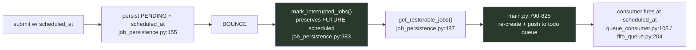

<!-- R&D — IMPLEMENTED + VERIFIED 2026-05-29 by Tiberius 👑 (session c9c582b7) on the post-fold Lupin mono-repo (wip-v0.1.8). Rick ratified the heartbeat + shutdown-marker measured-downtime design; built as-built below. -->

# Scheduled-Job Bounce Survival — close the missed-window gap + prove it E2E

**Author:** Tiberius 👑 · **Date:** 2026-05-29 · **Status:** ✅ IMPLEMENTED + VERIFIED — 40/40 unit tests pass, 100% coverage on changed lines, live `:7999` bounce confirmed clean boot + heartbeat stamping. (cosa code in `job_persistence.py` + `postgres_models.py` committed via the fold `0a01da3`; parent wiring in `main.py` + migration `e9f0a1b2c3d4`.)

## As-built (2026-05-29, Rick-ratified)
- **Recording:** heartbeat + clean-shutdown marker (Rick's measured-downtime design, chosen over an arbitrary grace window). **One simplification:** piggybacked the existing 60s `clock_loop` for the heartbeat (stamps `server_lifecycle.last_available_at` each tick) instead of a dedicated 30s timer + INI key — less machinery; 60s granularity widens the catch-up window safely. No new INI key.
- **Catch-up:** `mark_interrupted_jobs()` 4th branch preserves PENDING jobs whose `scheduled_at` ∈ `[last_available, now]` (`pending_catchup` tally); future preserved; before-window / no-schedule → INTERRUPTED; `last_available=None` (first boot) → no catch-up. `get_restorable_jobs()` re-enqueues; consumer fires immediately (`scheduled_at <= now`).
- **Storage:** `ServerLifecycle` single-row table (`server_lifecycle`), Alembic migration `e9f0a1b2c3d4` (applied to `lupin_db_dev`; auto-created in tests via `create_all`).
- **Open questions — resolved by Rick:** in-flight RUNNING jobs left INTERRUPTED (no auto-resume); 60s cadence accepted; first-boot/None → no catch-up.
- **Verified:** live `:7999` bounce → clean boot, `[CJ-PERSIST]` recovery sweep ran, heartbeat stamped `last_available_at` at startup, `get_last_available()` returns it. 40/40 unit (logic + lifecycle + catch-up branches), 100% coverage on changed lines.
- **Pending:** full real schedule→bounce-straddle→catch-up E2E (gold proof; Rick-assigned, in progress).

## Context

Rick asked to implement "serialization of scheduled jobs on the test server so that multiple bounces restore previously scheduled jobs" — motivated by the belief that bouncing `:8000` loses jobs scheduled mid-day for overnight runs.

**Finding (verified against live source, not agent say-so): the core feature ALREADY EXISTS and is unit-tested.** So this is not a greenfield build — it's closing the one real remaining hole and proving the full cycle end-to-end.

## What already works (baseline — do NOT rebuild)

A future-scheduled job already survives a normal bounce:

- DB `status` stays `pending` until the job runs (no persist call flips it to scheduled/queued) → the PENDING-only restore query is correct.
- Tested: `src/tests/unit/test_job_restoration.py` (unit-level, mocked).

## The real remaining gaps

1. **Missed-window (the likely real failure).** `job_persistence.py:433-438`: a PENDING job whose `scheduled_at` is in the **past** is marked INTERRUPTED → lost. A job due 02:00, scheduled mid-day, with the bounce straddling 02:00 (server down 01:58–02:03) is silently dropped. `get_restorable_jobs()` already returns *all* PENDING-with-`scheduled_at` rows — so the ONLY thing dropping past-due jobs is `mark_interrupted_jobs()` flipping them to INTERRUPTED first.
2. **No true E2E** proving schedule → bounce → restore → fire (only mocked unit coverage).
3. (Out of scope unless Rick says) RUNNING-at-bounce jobs → INTERRUPTED, not resumed — mid-execution auto-resume is risky; leave as-is.

## Recommended approach

### 1. Close the missed-window gap (catch-up policy)
- New helper `_is_within_catchup_grace(scheduled_at_str, now, grace_minutes)` beside `_is_future_scheduled()` in `job_persistence.py`.
- In `mark_interrupted_jobs()` `else` branch (:433): **preserve** a past-due PENDING job (keep `pending` so `get_restorable_jobs` re-enqueues it) when `scheduled_at` is in the past **but within the catch-up grace window**; mark INTERRUPTED only when older than grace ("too stale"). Add a `pending_catchup` count + log line.
- No consumer change: a re-enqueued job with past `scheduled_at` is immediately eligible (`pop_next_eligible`: `scheduled_at <= now`) → fires on next wake (catch-up run).
- New INI key `cj flow scheduled job catchup grace minutes` (+ splainer). **Proposed default 120 (2h).**

### 2. Tests (all tiers)
- **Unit** — extend `test_job_restoration.py`: past-due-within-grace preserved + restorable; past-due-beyond-grace INTERRUPTED; future preserved (regression); grace boundary.
- **Integration (deterministic, preferred)** — drive `persist_job_created → mark_interrupted_jobs → get_restorable_jobs → push` against a test Postgres DB (no real bounce).
- **E2E real-bounce** — schedule near-future job → restart container → assert restore + fire. Venue **:8000** via `/api/test-suite/submit` + user-confirmed slot (monopolize protocol).
- **Empirical dev** — `:7999`: schedule +2min → `docker restart lupin-rest-dev` → confirm `[CJ-PERSIST] Restored scheduled job` log + fire.

### 3. Coverage
100% line+branch on the changed `job_persistence.py` lines (Lupin-wide mandate).

## Critical files
- `src/cosa/rest/job_persistence.py` — `mark_interrupted_jobs()` (:383) + new `_is_within_catchup_grace()`. `get_restorable_jobs()` (:487) needs NO change.
- `src/conf/lupin-app.ini` + `lupin-app-splainer.ini` — grace-window key.
- `src/tests/unit/test_job_restoration.py` — new cases; new deterministic integration test.
- `history.md` / `TODO.md` — progress the durable-scheduled-job task.

## Verification
1. `pytest src/tests/unit/test_job_restoration.py -v` + coverage to 100% on changed lines (:7999).
2. Deterministic integration test of the full chain (:7999).
3. Empirical dev bounce on :7999.
4. Scheduled E2E on :8000 (user-confirmed slot).

## Open questions for Rick (gating implementation)
1. **Grace-window default** (proposed 120 min) + **too-stale policy**: catch-up-within-grace + INTERRUPT-beyond (proposed) vs. always-run-on-restore vs. never-catch-up.
2. RUNNING-at-bounce jobs — also catch-up-restore them? (Proposed: no.)
3. Does "base restore already works" match the loss you observed? If you saw a *different* symptom, that reshapes this.
