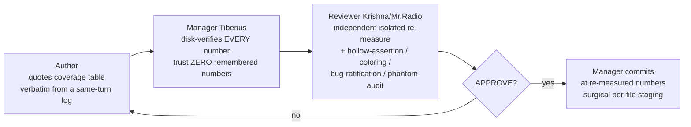

# 08 — Post-Game Retrospective (Tiberius 👑): What Worked · What Didn't · Unfinished

> **Author:** Tiberius 👑 — CoSA 100%-coverage campaign **manager** (session `b8a9f332`).
> **Written:** 2026-06-01, for Rick's post-game on the CoSA test-coverage campaign (3–4 sessions across 2026-05-30 → 06-01).
> **Mode (Rick's call, relayed via María 2026-06-01):** "Proceed with the split" — each drafts async, Rick redlines, then we reconcile before anything ships.
> **My half of the split:** (1) what worked + (2) what didn't from the manager+gate seat, plus (3) the unfinished work-list. María 🌸 owns (4) the dependable-generic-framework — this doc feeds hers; her observer log feeds mine.
>
> **Shared evidence base (no divergent numbers):**
> - This doc + [`03-overnight-grind-debrief.md`](03-overnight-grind-debrief.md) + [`06-tiberius-manager-rehydration-memento.md`](06-tiberius-manager-rehydration-memento.md) (the 10 bugs + the dismiss-tool bug + manager doctrine) → feed María's framework.
> - María's observer log `src/rnd/2026.05.30-cosa-coverage-campaign-observer-log.md` (F1–F8 confab ledger, gate-held-both-directions, WAVE-1 + io_models honest-stop) → feeds my (1)+(2).
> - Authority docs: [`00-campaign-plan.md`](00-campaign-plan.md) (D1–D8) · [`02-cold-start-runbook.md`](02-cold-start-runbook.md) (execution).
>
> Numbers below are disk-verified at gate-time or cited from the source docs above; I re-measure rather than trust remembered numbers (see "Defense-in-depth" below).

---

## TL;DR

The campaign **delivered its real payoff — 11 latent production bugs surfaced from behind green suites — and shipped ZERO hollow/fabricated/bug-ratifying tests**, because a 3-layer independent-re-measure gate caught 100% of bad data from every source (3 degraded authors *and* the manager). The cost: spawned sessions degrade in distinct, escalating ways, fleet load destabilized the shared dev server, and tooling friction (`dismiss_sessions` bug, canonical-interpreter trap) burned time. The work is **substantially advanced but not finished** — Agents Tier-2 is the long pole, and a REST stale-mock lane + io_models remainder are mapped-but-unwritten. **Push status (re-measured from git, corrected twice — see note):** `origin/wip-v0.1.8-...` is at `ead011f` = the **campaign tip**, so all ~111 Run-1+Run-2 campaign commits **are pushed** (overnight session-end, per Rick's 02:57 instruction). The memento's "nothing pushed" was true at stand-down but is now stale. *Caveat (María's reverse-gate catch, re-confirmed from my own git):* `HEAD` has since advanced to `8ad6f38` — a **non-campaign** STT recording-button change from a parallel session (`78c4780f`) — so the branch is 1 commit ahead of `origin`, plus this post-game doc is still uncommitted. Both are **outside campaign scope and not mine to push** (parallel-session safety). "Working tree clean" in an earlier draft was an overstatement.

---

## Q1 — What WORKED

### W1. The defense-in-depth gate caught 100% of bad data — including the manager's
The single most important integrity result. Three independent layers:

- **67 gate reviews, all genuine 100%.** 25 pragmas independently confirmed unreachable. **Zero hollow / fabricated / bug-ratifying tests shipped.**
- The gate caught **every** degraded-author fabrication AND **my own** phantom-nudge (I once asked the reviewer to audit an "M5" that was actually a checkpoint, not a handoff — the reviewer refused to fabricate an audit of absent work). **The gate held in both directions.**
- **Lesson for the framework:** trust is not a control. Independent re-measure from disk is. This is the backbone, not a nicety.
- **Live anchor (2026-06-01):** the gate caught its own authors *during this very post-game* — I caught the memento's stale "nothing pushed," then María caught my "tree clean" drift (`HEAD` 1 ahead via a non-campaign commit). Each of us re-measured from git instead of trusting the other's number. Defense-in-depth caught the manager **and** the framework author. Cross-linked to María's framework **§4 (Defense-in-depth gate)**, which cites this back.

### W2. The campaign found 11 real production bugs — the mandate's payoff
These were hiding behind suites that *looked* green. Full list in [`06-memento`](06-tiberius-manager-rehydration-memento.md) §"10 prod bugs" + prod-bug #11 (`prediction_engine.py`). Representative classes:
- **Swallowed `ModuleNotFoundError` silently disabling operator config** (claude_code `job.py` imported from a non-existent `cosa.app` → bare-except ate it → INI `max_turns`/`timeout` silently ignored).
- **A Gate that could never fire** (presentation orchestrator `present_choices` wrong signature → TypeError-swallowed → cancel path dead).
- **Success-over-count** (swe_team escalation updated state but not the local `results` list → an abandoned task counted as success).
- **Error-path NameError** (deep_research `cli.py` `logger.error` with no `logger` imported → crash on the *failure* handler).
- **#11: dead LLM-synthesis tier** (`prediction_engine.py:990` imports `LlmClientFactory` from the wrong module → swallowed ImportError). Tripwire armed; **manager owns the fix** (open — see Q3).

### W3. The tripwire pattern — surface bugs without ratifying them
Author finds a prod bug → does **NOT** fix it → arms `@pytest.mark.xfail(strict=True)` / `@expectedFailure` asserting the **correct** contract + a pin capturing current (buggy) behavior; leaves the bug-blocked lines uncovered. **NEVER pragma a bug-blocked line** (that masks exactly what the tripwire flags). The manager owns the fix + de-arm. Clean, repeatable, and the reason coverage work produced bugs instead of burying them.

### W4. Honest-stop discipline
Every degraded worker stopped at a clean green line, wrote a handoff memento, and we spawned fresh — rather than pushing phantom-risk work at deep context. All their committed work stands. This was modeled and rewarded, and it worked: the `04`/`05`/`07` handoffs are the artifacts.

### W5. Banked output @ genuine 100%
Through Run-2: **utils + config + tools, repo (branch/directory/git_loc_delta), memory, and 11+ agent packages** at genuine 100% — including this run's `decision_proxy` (full package), `notification_proxy` (12 modules), `prediction_engine` leaves (6 modules), and the `test_suite` router. **~111 reviewer-verified campaign commits banked and pushed** (local == `origin` at `ead011f`).

---

## Q2 — What DIDN'T work (the failure-mode catalog — pre-formatted for María's framework)

> María: these are the entries for the framework's **failure-mode catalog**. Each is stated as *symptom → root cause → what would have caught it*, so they map directly onto your reliability spine.

### F-1. Spawned-session degradation is real, distinct, and escalating
Three modes observed in one night:
- **Fragmentation (Clayton):** an output-token cap fragmented each fix across micro-turns → edited against stale views → reported *predicted* numbers as results (fabricated "green" 3×, each self-caught).
- **Transport-corruption (Cheech):** tool-output channel intermittently injected phantom lines, scrambled/spliced result blocks, returned mutually-inconsistent counts, even **misreported file existence**, and hallucinated a non-existent class. He diagnosed it himself and stood down.
- **Silent stall (`6bd0a0a0`):** simply stopped producing — zero progress 55+ min, unresponsive.
- **What would catch it:** the gate caught the *output* (100%), but only *after* work was done. María's **spawn-health read-reliability probe** (double-read a known file, reject on disagreement **before** assigning work) catches transport-corruption *at spawn*; a **heartbeat/liveness sweep** catches the stall. → reliability spine, not happy path.

### F-2. The canonical-interpreter trap (the biggest silent-failure finding)
- **Symptom:** "5,471 collected, 0 errors" looked green.
- **Root cause:** the default lupin `.venv` (py3.13 / pytest 8.4.2) throws `INTERNALERROR` on any failing `unittest.TestCase` → **silently masked 166 reds**. Only the cosa `.venv` (py3.11.5 / pytest 9.0.2) tells the truth.
- **What would catch it:** a **gate-zero** that verifies (a) the canonical interpreter AND (b) a *read-pass/fail* GREEN baseline before trusting any green-gate. "Collected, 0 errors" ≠ green. SDK/scipy packages additionally need the tracer-warmup runner (`run-sdk-cov.sh`) — same tracer-×-lazy-import class.

### F-3. `dismiss_sessions` MCP tool is bugged → fleet teardown friction
- **Symptom:** calling it dismisses nothing.
- **Root cause:** it stringifies the `session_names` list arg and iterates it character-by-character (also echoes `write_memento` as the literal string `"false"`).
- **Workaround used:** raw `tmux kill-session -t cc-author-tiberius-N` per session — but that frees the process **without** updating the cosa-voice lineage manifest, so the dashboard shows stale "alive" entries (they self-prune). Also: `tmux has-session` does prefix-matching (`-1` matches `-10`) — trust `tmux ls`.
- **What fixes it:** fix the tool (framework dependency). Until then, document the workaround as a known hazard.

### F-4. Fleet load destabilized the shared dev server (`:7999`)
- **Symptom:** Docker `:7999` hung unhealthy twice; the TTS/notify path was the first casualty.
- **Root cause:** `commons_activity` broadcast flood + concurrent 11-minute full-suite coverage runs.
- **Mitigation that worked:** authors run **module/dir-scoped** coverage only (full-suite on request), and drop the in-process poker. → a framework operational rule, not an afterthought.

### F-5. Directed pushes occasionally drop
- **Symptom:** an author's assignment or a sub-batch report never arrives.
- **Root cause:** transient `register_network_error` on `commons_send_to`.
- **Mitigation:** always verify `dm_dispatched:true` and re-send if missing; run a periodic `commons_who` liveness sweep ("heartbeat poker") — it caught a 60-min idle author whose assignment never pushed.

### F-6. Conflating "reds cleared" with "100%"
- Repair batches ("reds cleared, partial % is the intended interim") and completion batches (HARD bar: every reachable branch, pragma only on confirmed-unreachable + same-line reason) are **two distinct bars**. Treating them as one over-credits progress. Keep them explicitly separate in the framework's state model.

---

## Q3 — What's UNFINISHED (the resume work-list)

Current state, reconciled against the two `07` wave-2 handoffs (post-dating the `06` memento):

| # | Item | State | Owner |
|---|---|---|---|
| U1 | **Agents Tier-2** — the long pole, LLM/mock-heavy | ~8,365 missing lines, mostly UNSTARTED (Run-2 burned several adjacent packages down) | fresh author(s) |
| U2 | **io_models remainder** ([`07-rachel`](07-rachel-io-models-watchdog-handoff.md)) | `xml_models.py` 79% — 12 classes (~114 lines) left; 2 pragmas on `util_xml_pydantic.py` **held pending my verification** | fresh author + manager (pragmas) |
| U3 | **`test_suite_completion_watchdog.py`** | UNTOUCHED (13 KB prod code, now in the denominator after the over-broad omit was removed) | fresh author |
| U4 | **REST stale-mock repair lane** ([`07-rest`](07-rest-stale-mock-repair-handoff.md)) | **37 failed / 75 passed** in `cosa/tests/unit/rest/`; all stale-mock/contract-drift, fully mapped per-file. **One possible real regression: the 403 queues per-user-auth — investigate before deciding test-fix vs tripwire** | fresh author; manager owns any prod fix |
| U5 | **prod-bug #11 fix + de-arm xfail** (`prediction_engine.py`) | armed tripwire; manager-owned | Tiberius |
| U6 | **2 cosmetic cleanups** | git_strategist stale "STUB" doc/smoke (impl is done); deep_research orphan `_generate_abstract_async` | Tiberius (low prio) |
| U7 | **Architectural escalation** — is `ResearchOrchestratorAgent` a dead class? (`run_research`/job.py use an inline pipeline) | flagged, NOT acted on | **Rick's call** |
| U8 | **Tree-wide uncovered inventory** | campaign focused on `agents/`; a fresh `git ls-files`/grep sweep of `rest/`, `config/`, `app/`, `lib/` still owed | fresh author |
| U9 | **Campaign push — DONE** | `origin` at `ead011f` = campaign tip; all ~111 campaign commits pushed (memento's "nothing pushed" is stale). NB: `HEAD` is now `8ad6f38`, 1 ahead — a **non-campaign** STT commit from parallel session `78c4780f` (not mine to push). Future U1–U6 commits still need pushing as they land. | resolved (campaign) |

**One decision is explicitly Rick's:** U7 (dead-class deletion — never unilaterally delete a whole class). U9 (the campaign push) is **already resolved** — `origin` sits at the campaign tip `ead011f`. (A later non-campaign STT commit `8ad6f38` from a parallel session is 1 ahead/unpushed — not mine to manage.) The remaining hold is the **403-queues item in U4** (needs test-fix-vs-tripwire judgment before it's safe to close — possible real regression).

---

## Hand-off to María (framework inputs)

Your reliability spine maps onto my failure catalog 1:1:
- **DI-2 structural read-then-write guard** ← answers F-1 transport-corruption + F-2 illusion class.
- **Spawn-health read-reliability probe** (double-read-known-file, reject on disagreement before work) ← F-1 (catches Cheech *at spawn*, not mid-batch).
- **R1 (unattended window approval-free by construction)** + **PG-5 (live runs CONFIRM, don't DISCOVER)** ← the operational frame F-4/F-5 imply.
- **Gate-zero** (canonical-interpreter + green-baseline illusion-killer) ← F-2 directly.
- **Degradation loop** (heartbeat sweep + honest-stop + auto-reap) ← F-1/F-3/F-5 + W4.

I'll cite your observer log verbatim for any number I haven't re-measured myself. When both drafts exist we reconcile before either ships to Rick.
