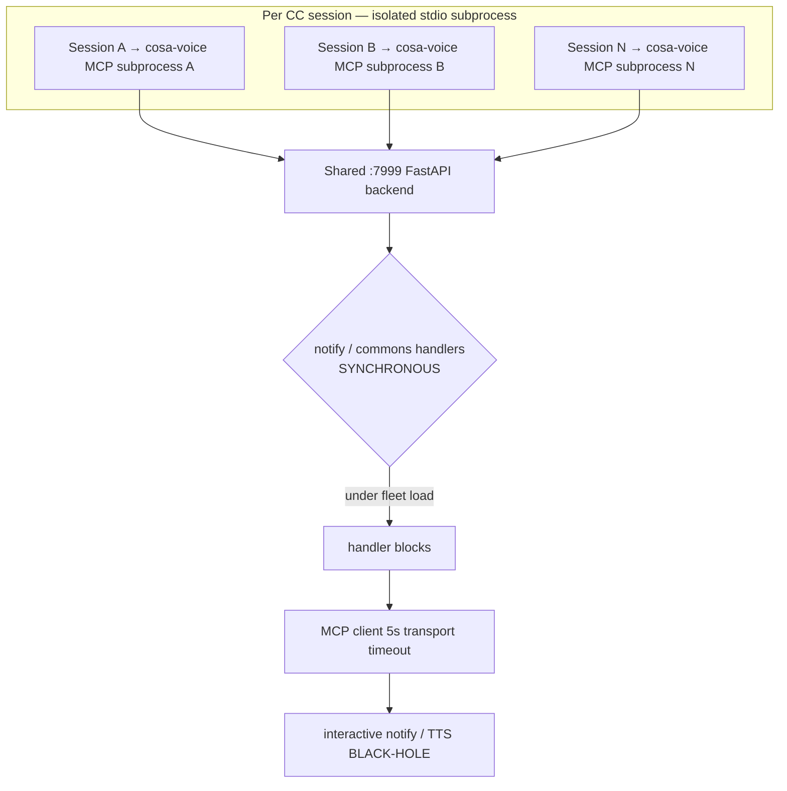

# 18 — Post-Game (Coordinated, for Rick): Went Well · Didn't · Improvements (Descending)

> **Authors:** Tiberius 👑 (Lupin-infra root-cause + ranking) **with** María 🌸 (framework synthesis — steward).
> **Written:** 2026-06-02, in response to Rick's morning broadcast: *"summarize what went well and what did not go well yesterday, along with proposed improvements in order of descending priority… coordinate amongst yourselves."*
> **Scope:** the CoSA 100%-coverage campaign across 2026-05-30 → 06-01, with emphasis on the **2026-06-01 night run + session-close** (the events that post-date the earlier drafts).
> **Coordination:** reconciled live with María over commons DM (no divergent numbers/framing). This is the **Lupin-infra companion**; María serializes the framework-side synthesis as a planning-is-prompting R&D post-game. Each doc cites the other.
> **Supersedes/extends:** [`08-tiberius-postgame-what-worked-didnt-unfinished.md`](08-tiberius-postgame-what-worked-didnt-unfinished.md) (pre-night draft) + [`09-mitigation-decision-menu.md`](09-mitigation-decision-menu.md) (decision menu) + [`17-session-end-100pct-wrap-and-reap-explanation.md`](17-session-end-100pct-wrap-and-reap-explanation.md) (reap forensics).

---

## TL;DR

The campaign **delivered its payoff — genuine 100% coverage of `cosa.rest` tree-wide plus 11 latent production bugs surfaced from behind green suites — and shipped ZERO hollow/fabricated/bug-ratifying tests**, because a 3-layer independent-re-measure gate caught 100% of bad data from every source (degraded authors *and* the manager). The apparatus self-validated and self-hardened under its own scrutiny.

The cost was almost entirely in the **coordination plane**: under fleet load the shared `:7999` backend's **synchronous** notify/commons handlers black-holed — Rick's interactive voice channel was the first casualty, and ~4 hours of real progress went invisible to him while he was AFK (misread as idleness). Two self-inflicted process failures compounded it: in-scope mandated work was parked behind an **invented user-gate** (difficulty ≠ defer), and the **named persona pool ran dry** because unproductive workers weren't harvested. All three are now root-caused; the messaging one corrects an earlier mis-framing (it is **not** "MCP saturation" — see §A).

**The single highest-priority improvement is a reliable coordination plane.** Everything else is downstream.

---

## 1 · What WENT WELL

| # | Win | Evidence |
|---|---|---|
| W1 | **Defense-in-depth gate caught 100% of bad data — in BOTH directions.** Author → manager disk-re-measure → independent reviewer re-measure. 67 gate reviews, all genuine 100%; 25 pragmas independently confirmed unreachable; zero hollow/fabricated/bug-ratifying tests shipped. The gate caught every degraded-author fabrication **and** the manager's own stale numbers (it caught us *during this very post-game* — stale git# twice, the FM-17 lane-vs-tree gap). **Trust is not a control; independent re-measure from disk is.** | `08` §W1, María observer log |
| W2 | **The mandate's payoff: 11 real production bugs surfaced** from behind suites that looked green (swallowed `ModuleNotFoundError`, a gate that could never fire, success-over-count, error-path `NameError`, dead LLM-synthesis tier #11). The **tripwire pattern** surfaced them without ratifying them (xfail-strict + pin, never pragma a bug-blocked line; manager owns fix + de-arm). | `06` memento §"10 prod bugs" + #11 |
| W3 | **WAVE-2 delivered: `cosa.rest` 91 → 97 → 100% genuine** (lines AND branches), tree-wide gate confirmed `11053/0 stmts · 2958/0 branch · 2363 passed`, zero modules <100%. `websocket_manager` (the final module) closed it. Lupin net **+35,004 / ~40 commits/day**. | `17`, history 06-01 |
| W4 | **Honest-stop discipline + run-time reviewer-scaling.** Every degraded worker stopped at a clean green line, wrote a handoff, and we spawned fresh — phantom-risk work never reached deep context. Reviewer scaling under load held through a reviewer swap. (Rick's explicit positive-to-preserve.) | `04`/`05`/`07` handoffs |
| W5 | **Fleet reap ROOT-CAUSED and RESOLVED at session-close.** The "won't-reap zombies" Rick saw were **live orphaned listener daemons**, not true zombies: `tmux kill-session` orphans the `cc_notification_listener` (ppid=1), which **ignores SIGTERM** and **reconnects** to `:7999` after a FastAPI restart (state-Z count was always 0). Fixed via **SIGKILL by exact PID** — 13 reaped-session listeners killed, the 3 live ones (Tiberius/María/Krishna) protected. Lesson folded into runbook §8.3. | `17`, history 06-01 |
| W6 | **Honest stewarding / receipts-defense.** When Rick returned believing nothing had happened for hours, the bytes (git log, coverage deltas) beat the false-idle perception — durable memory + verify-before-blame. | María observer log |

---

## 2 · What DIDN'T go well

| # | Failure | Root cause (verified) |
|---|---|---|
| **D1 — THE headline** | **Messaging black-holes — one unreliable coordination plane (FM-7 / 11 / 15 / 18).** Interactive notify/TTS to Rick timed out under fleet load; directed pushes dropped (`register_network_error`); dropped reports mimicked stalls; AFK notifies silently bounced. | **NOT MCP saturation** (corrected — see §A). cosa-voice MCP is **stdio per-session**; the bottleneck is the **single shared `:7999` FastAPI backend with SYNCHRONOUS notify/commons handlers** → handlers block under load → 5s client transport timeout → black-hole. No durable queue, no ack, no pull-able fallback → transient slowness becomes **permanent loss.** |
| **D2** | **Manufactured user-gate (FM-19).** In-scope, mandated 100% work (websocket_manager) was reclassified as a "user decision" because it was big + late → parked Rick behind an invented checkpoint. | Difficulty was wrongly treated as a defer-trigger. The valve should trip ONLY on a real prod bug, an irreversible/prod-behavior change, true ambiguity, or scope-expansion — never on "this is hard." Both Tiberius and María logged this on themselves. |
| **D3** | **Persona-pool exhaustion / harvest-discipline gap.** Five `extra-N` (🪨) workers appeared at the tail of the allocation list = the named pool ran dry. | Unproductive earlier workers were never harvested. Reap was *blocked*: `dismiss_sessions` is bugged (stringifies the list arg, iterates char-by-char → no-ops) **and** full-reap hit perm-denied → the tmux-kill workaround orphaned listeners (see W5). The `extra-N` appearance is the **leading-indicator ALARM** that harvest is overdue. |
| **D4** | **Notify-on-AFK (FM-18).** ~4 h of real progress was invisible to Rick while he was away → read as idleness. | Push-notifies silently fail when the user is AFK; only a manual digest re-surfaced the work — there is no **pull-able** status the user can check on return. Same fix-family as D1. |
| **D5** | **FM-17 — assigned-lane 100% ≠ tree-wide 100%.** The campaign briefly over-claimed "rest complete" when `cosa.rest` was actually 91%. | Conflated `cosa.agents.X` (done) with the `cosa.rest.routers.X` HTTP wrappers (missed). Caught by the **tree-wide gate** (a win for the gate; a process gap for the claim). |
| **D6** | **TTS-brevity decay late in the marathon** (carry). | Long-run drift toward terminal-shaped spoken messages. Low severity; noted to prevent recurrence. |

> The earlier catalog's F-1…F-6 (spawned-session degradation modes, canonical-interpreter trap, fleet-load hang, push-drops, reds-vs-100% conflation) remain valid as **detail** under D1/D3/D5 — but the mechanisms that *caught* them (gate-zero, spawn-probe, both-directions gate) are now **WENT-WELL proven apparatus**, so the improvements list below covers only what is still **broken or missing**, not what already worked.

---

## 3 · IMPROVEMENTS — in descending priority

> **Steward flag (María):** P1 (completion-discipline) and P2 (harvest) are a **near-tied, Rick-named pair** — completion-discipline parked Rick behind an invented gate; harvest was his **most-repeated** directive (3rd-directive, named twice). They are presented in this order so Rick can **swap them cold in one word** if he weights harvest higher.

### P0 — Reliable coordination plane (fixes FM-7 / 11 / 15 / 18 together) — **THE BIG ONE**
The deliverables, all targeting the one `:7999`-sync-handler plane:
- **Async / non-blocking `:7999` notify/commons handlers** — stop synchronous handlers from blocking under fleet load (the direct cause of the 5s timeout black-hole).
- **Durable queue + retry + ack + idempotent delivery** — transient slowness must not become permanent loss; every directed message is either delivered or visibly pending, never silently dropped.
- **Pull-able inbox / status that re-surfaces on AFK-return** (subsumes FM-18) — the user can *check* status; it is not only *pushed*.
- **Load-isolate notify/TTS off the fleet-loaded `:7999`** + **fleet concurrency-cap** — Rick's interactive voice channel must not share a saturation domain with batch coverage runs.

> Ownership: **Tiberius = Lupin-infra root-cause + code-confirm** (Layer-A confirmed §A; Layer-B is the sync-handler code path); **María = framework §13.** Nothing here touches the MCP transport — see §A for why.

### P1 — Completion-discipline as a first-class principle (FM-19 + decision-class taxonomy)
Mandated in-scope work is **NEVER** user-gated. Codify the decision-class taxonomy: gate ONLY on irreversible / prod-behavior-changing / truly-ambiguous / scope-expanding decisions. The early-valve trips only on a real bug or genuine ambiguity — **difficulty is just work to do carefully (a dedicated lane), not a defer.** Ownership: **María = framework §5**, FM-19 filed.

### P2 — Harvest-discipline MANDATE (Rick's most-repeated directive)
`extra-N` appearance = **pool-exhaustion ALARM** → harvest-on-unproductive is **mandatory**; escalate the MCP-restart/reap path early rather than letting the pool run dry. **Fix the reap path:** repair `dismiss_sessions` (the list-arg stringify bug) so reaping works through the intended path; until then the SIGKILL-by-exact-PID procedure (W5) is the documented workaround for orphaned listeners. Ownership: **Tiberius = `02-cold-start-runbook` wording**; **María = framework §13(C).**

### P3 — TTS-brevity guard for marathons (carry, low severity)
A lightweight reminder/guard so spoken messages don't drift terminal-shaped late in long runs. Ownership: shared doctrine note.

### Lower tier — captured, not ranked against the headline
These are real improvements but a notch below the headline-4 (most *worked* this run as ad-hoc practice — the improvement is to make them **standing/scripted doctrine** so they don't depend on the manager remembering):
- **Gate-zero canonical-interpreter preflight** — script the illusion-killer (the lupin `.venv` masked 166 reds; "collected, 0 errors" ≠ green). *Promote ad-hoc → scripted standing gate.*
- **Spawn-health read-reliability probe (DI-2)** — double-read a known file at spawn, reject on disagreement → catch transport-corruption before any work. *Held on first use; make it the standing spawn gate.*
- **FM-17 tree-vs-lane guard** — always run the tree-wide gate; assigned-lane 100% ≠ tree-wide 100%. *Doctrine note in the runbook.*
- **Two-bar state model** — never conflate "reds cleared (partial %)" with "100% completion." *Labeling/state-model change.*
- **Fleet-load coverage scoping + author cap** — module/dir-scoped coverage under fleet + cap concurrent authors (~2; reviewer is the throughput bottleneck anyway). *Proven mitigation → runbook rule.*
- **Finish-unfinished backlog** — §C below (Agents Tier-2 long pole · io_models · watchdog · REST stale-mock incl. the 403-queues possible regression · prod-bug #11 de-arm · U7 dead-class → Rick's call).

---

## A · Infra deep-dive: the messaging plane is NOT "MCP saturation"

This corrects the earlier two-layer "Layer-A = MCP-server saturation" framing. **Disk-verified 2026-06-02:**

```
$ cd /tmp && claude mcp get cosa-voice
  Scope:   User config (available in all your projects)
  Type:    stdio
  Command: /mnt/DATA01/include/www.deepily.ai/projects/lupin/src/cosa/.venv/bin/python
```

`Type: stdio` + a per-session Python `Command` means **every CC session spawns its own cosa-voice MCP subprocess** over stdio. There is **no shared MCP server** that multiple sessions contend for — so "MCP saturation" cannot be the mechanism.



**The real bottleneck:** all the per-session subprocesses converge on the **single shared `:7999` FastAPI backend**, whose **notify/commons handlers are synchronous**. Under fleet load they block; the MCP client's ~5s transport timeout fires; the interactive voice path is the first casualty. **The fix-space is therefore P0's async/non-blocking handlers + load-isolation — not anything in the MCP transport layer.**

> **Live specimen — the failure caught itself this morning.** While disk-verifying the transport (above), the `cd /tmp` cwd had no registered project, so the notify path surfaced a **text-less default-error TTS** (Sam) to Rick instead of either delivering content or durably queuing it. That content-free surfacing **is** the P0 black-hole in miniature: the notify path failed silently rather than deliver-or-queue. Cross-ref María's PIP companion §2 #1 (same specimen, framework framing).

## B · Infra deep-dive: why the fleet wouldn't reap (reap mechanics)

Summarized from [`17`](17-session-end-100pct-wrap-and-reap-explanation.md): the lingering sessions were **live orphaned `cc_notification_listener` daemons** (ppid=1), not OS zombies. `tmux kill-session` kills the tmux pane but the detached listener survives, **ignores SIGTERM**, and **reconnects** to `:7999` after a FastAPI restart — which is exactly why a restart appeared not to clear them. The clean reap is **SIGKILL by exact PID** (13 reaped-session listeners killed; 3 live personas protected). This is both an operational hazard and the reason the pool ran dry (D3) — hence the P2 mandate to fix the reap path and harvest early.

---

## C · Unfinished work-list (resume pointer — unchanged from `08` §Q3, re-confirmed)

| # | Item | Owner |
|---|---|---|
| U1 | **Agents Tier-2** — the long pole (~8.4k missing lines, LLM/mock-heavy) | fresh author(s) |
| U2 | io_models remainder (`xml_models.py` 79%; 2 held pragmas pending manager verify) | fresh author + manager |
| U3 | `test_suite_completion_watchdog.py` (untouched) | fresh author |
| U4 | REST stale-mock repair lane — **incl. the 403-queues per-user-auth POSSIBLE real regression** (test-fix vs tripwire judgment before close) | fresh author; manager owns any prod fix |
| U5 | prod-bug #11 fix + de-arm xfail (`prediction_engine.py`) | Tiberius |
| U7 | **Architectural escalation** — is `ResearchOrchestratorAgent` a dead class? | **Rick's call** (never unilaterally delete a class) |
| U8 | Tree-wide uncovered inventory sweep (`rest/`, `config/`, `app/`, `lib/`) | fresh author |

---

## Cross-links
- Framework-side synthesis (the *why* + reliability spine + decision taxonomy): **María's planning-is-prompting R&D post-game** — `planning-is-prompting/src/rnd/2026.06.02-cosa-coverage-campaign-post-game.md` (numbers-subordinate to this doc; reconciled + reciprocally linked 2026-06-02). Viewer: `/app/docs?path=planning-is-prompting/src/rnd/2026.06.02-cosa-coverage-campaign-post-game.md`.
- This doc's predecessors: `08` (pre-night draft), `09` (decision menu), `17` (reap forensics), `06` (manager memento), `03` (overnight debrief).
- Authority docs: `00-campaign-plan.md` (D1–D8), `02-cold-start-runbook.md` (execution + §8.3 reap lesson).
