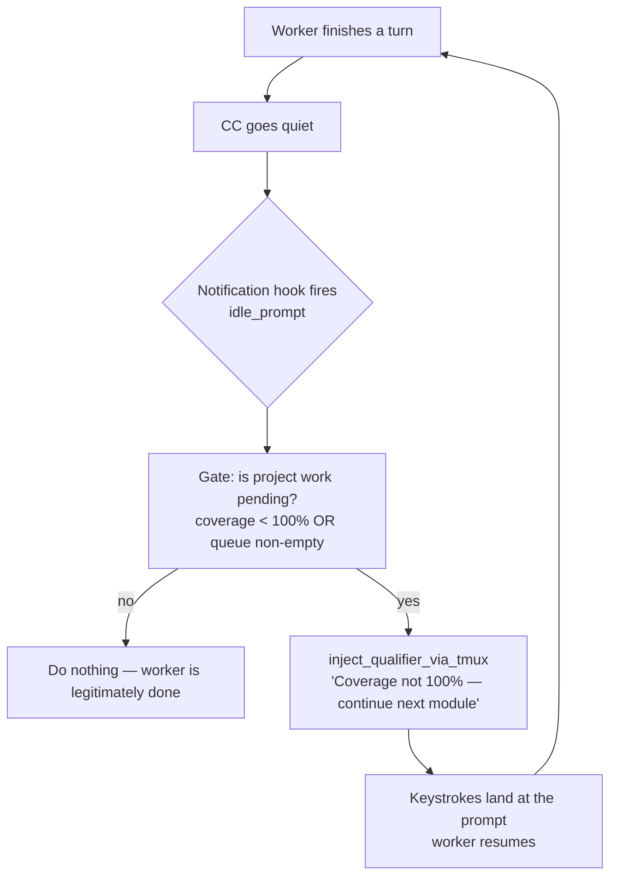

# 20 — tmux Heartbeat: System-Generated Self-Continuation for Grind Workers

**Author**: Rachel 🕊️ (session `624abe39`)
**Date**: 2026-06-02
**Status**: Design / investigation — **follow up tomorrow (2026-06-03)**
**Audience**: Tiberius 👑 (manager), María 🌸 (framework), Rick (architect)
**Context**: CoSA 100%-coverage grind — the persistence-of-iterative-effort problem

---

## TL;DR

Claude Code is trained as a **turn-based** harness: it does work, then stops and waits
for the next human turn. The grind campaign wants the opposite — **persistence of
iterative effort**: a worker that keeps grinding toward 100% coverage without a human
re-prompting it every turn. Rick's current stopgap is an external heartbeat-poker job
that wakes workers every N minutes.

**Finding**: we already own the exact primitive needed, and it's *not* a new mechanism.
The same **`tmux send-keys`** path that delivers Rick's voice messages into a CC session
can inject a "keep going" prompt as first-class user input — from anywhere, on any
schedule, with **no hook event required**. The work is not "build a poker"; it's "point
the poker we already have at the worker instead of at Rick, and gate it correctly."

**The one hard constraint**: `tmux send-keys` is timing-fragile. Injected mid-turn, the
keystrokes scatter. The clean design therefore **gates the poke on the Notification
`idle_prompt` event** — fire only when CC has signalled it is parked at the prompt, never
on a blind timer.

---

## The problem

| Want | Claude Code's default |
|---|---|
| Worker self-continues until coverage = 100% | Worker completes a turn, then **stops and waits** |
| System-generated "get back to work" nudge | Only a **human turn** re-engages the model |
| Unattended overnight grind | Needs a human (or a poker) in the loop every turn |

The turn boundary is the obstacle. Something has to cross it *from the system side* to put
a stopped worker back into motion.

---

## Inventory: what we have today

Three relevant hook surfaces, traced in session `624abe39` (2026-06-02):

### 1. Notification hook — `notification.py` — **observation-only**

Fires with `notification_type == "idle_prompt"` and the message
*"Claude is waiting for your input"* whenever CC goes quiet. **Critical**: this hook's
stdout is **discarded by Claude Code** (the file header and `emit_json({})` confirm it is
observation-only). It is a one-way relay *to the user* — there is **no return channel**
back into Claude. **You cannot re-engage a worker through this hook.** It is the *wrong
end of the rope* for injection — but see § The idle gate: it is the *right* signal for
**timing** the poke.

### 2. Stop hook — `stop.py` — **can block the stop**

When a worker tries to stop, the hook can return `build_stop_block(reason)`, which emits
`{"decision": "block", "reason": "..."}`. Claude Code then **cancels the stop and feeds
`reason` back as the worker's next instruction**. This is a native, supported
self-continuation lever, already loop-guarded by:
- `stop_hook_active` — CC sets this True on re-invocation after a block; the hook
  early-returns to avoid an infinite loop.
- `MAX_STOP_BLOCKS = 3` — a hard ceiling on consecutive blocks.

**Caveat**: in speakerphone / conversation mode, `stop.py` early-exits (auto-narrate
branch) and **skips the block path entirely**. Grind workers must run non-speakerphone,
OR the work-pending check must be placed *before* the speakerphone skip.

### 3. tmux send-keys — **the reusable heartbeat primitive**

Two existing callers, **one mechanism**:

| Caller | File | Role |
|---|---|---|
| `inject_qualifier_via_tmux()` | `hook_common.py:577` | Stop-hook qualifier path — types the user's "Anything else?" qualifier back as input |
| `CcNotificationListener._inject_via_tmux()` | `cc_notification_listener.py:541` | **Voice path — THE inbound voice→CC channel.** This is how Rick's spoken words reach a worker at all |

Both perform the identical sequence:

```
tmux send-keys -t <pane> -l -- "<text>"    # literal, no key interpretation
sleep 0.25
tmux send-keys -t <pane> Enter
```

The target pane is resolved by `find_session_by_id()`, which reads `tmux_session` out of
the session bridge file `~/.claude/sessions/cc-*.json` (written by `register_session.py`
at SessionStart). Both wrap the injected text through `speakerphone_wrap()` so the
per-turn rider rides along with the synthetic prompt.

**Why this is the primitive**: `tmux send-keys` needs **no hook event**. Given only
(a) the bridge's tmux session name and (b) some text, it injects first-class user input
from *anywhere, anytime*. An external scheduled poker — cron, or the existing
`idle_waiter` subprocess — can drive it directly.

---

## The poker already exists: `_arm_idle_waiter`

`stop.py:_arm_idle_waiter` already spawns a **detached `idle_waiter.py` subprocess** that:
1. Sleeps `backoff_minutes[backoff_index]` (a backoff schedule preserved across Stop
   fires until `UserPromptSubmit` resets it on real user activity),
2. Re-checks the bridge for reset signals,
3. If still idle, fires the "Anything else?" prompt.

Structurally **this is Tiberius's heartbeat-poker, already built and shipping.** The only
difference from what the grind wants: it currently fires a `notify()` *at the user* asking
"Anything else?" — instead of `send-keys`-ing *the worker* with "coverage isn't at 100%,
continue."

---

## The idle gate — Rick's instinct, vindicated

Rick's original hunch was to use the dependable *"Claude is waiting for your input"* event
as a shoulder-tap. The injection cannot flow *through* that hook (its output is
discarded), **but the event is the perfect timing signal for *when* it is safe to poke**:
it fires exactly when CC has settled at the prompt.

So the two halves meet:

- **idle_prompt event** = the *safe-to-poke* gate (answers *when*).
- **tmux send-keys** = the poke itself (answers *how*).

You poke only when the worker tells you it is idle — never on a blind timer that could
land mid-turn.



---

## Two re-engagement paths — when to use which

| Dimension | `build_stop_block` (Stop hook) | `tmux send-keys` injection |
|---|---|---|
| Trigger coupling | Fires **only** at the stop event | Fires from **anywhere, anytime** |
| Loop guard | Built-in (`stop_hook_active`, `MAX_STOP_BLOCKS`) | **None** — caller owns cadence |
| Timing safety | Safe (CC is stopping by definition) | **Fragile** — must land at the prompt |
| External scheduling | Not possible (event-bound) | **Yes** — cron / `idle_waiter` can drive it |
| Speakerphone interaction | Skipped in speakerphone mode | Independent of the stop path |

**Reading**: `build_stop_block` is the cleaner, self-guarded path for *immediate*
self-continuation the instant a worker stops. `tmux send-keys` is the path for a
*scheduled / external* poker and for cross-turn nudges — at the cost of owning the timing
gate yourself.

A robust grind harness likely wants **both**: `build_stop_block` as the in-turn "don't you
dare stop while coverage < 100%" reflex, and the idle-gated tmux poke as the
backstop for genuine stalls (a worker that wedged without cleanly hitting the stop hook).

---

## Caveats / open questions (resolve tomorrow)

1. **Loop runaway** — the tmux path has no `MAX_STOP_BLOCKS` equivalent. The poker must
   carry its own consecutive-poke ceiling + backoff so a wedged worker isn't spammed
   forever. (`idle_waiter` already has backoff scaffolding to borrow.)
2. **Work-pending signal** — what exactly does the gate read? Options: a coverage report
   artifact, a non-empty task-queue file, or a manager-owned "still grinding" flag in the
   bridge. Needs a cheap, reliable, race-free check.
3. **Speakerphone skip** — grind workers should run non-speakerphone, OR we add the
   work-pending check ahead of the `stop.py` speakerphone early-exit. Decide which.
4. **Idempotency** — if two idle_prompt events fire close together, dedupe so we don't
   double-inject. (Mirror the `last_autonarrated_turn_id` dedupe pattern in `stop.py`.)
5. **Manager authority** — should the poke text come from Tiberius (per-worker, contextual)
   or be a static "keep going"? Contextual is better but needs a manager→worker channel;
   `commons_send_to` + tmux could compose here.
6. **Stop condition** — the gate's *negative* branch (work NOT pending) is the clean exit:
   when coverage hits 100% the poker simply stops poking and the worker rests. Verify the
   signal flips reliably so we don't strand a finished worker in a poke loop.

---

## Next steps (follow up 2026-06-03)

- [ ] Decide the work-pending signal (Q2) — likely the cheapest reliable artifact.
- [ ] Prototype the idle_prompt → work-check → `inject_qualifier_via_tmux` variant.
- [ ] Add a consecutive-poke ceiling + backoff to the poker (Q1).
- [ ] Decide speakerphone posture for grind workers (Q3).
- [ ] Reconcile with the messaging-coordination plane (design doc
  `src/rnd/v0.1.8/2026.06.02-messaging-coordination-plane-design.md`) — the poke channel
  and the manager→worker messaging plane may share infrastructure.

---

## Source references (verified this session)

- `src/lupin_cli/claude_code/hooks/notification.py` — idle_prompt relay, observation-only
- `src/lupin_cli/claude_code/hooks/stop.py` — `build_stop_block`, `_arm_idle_waiter`,
  speakerphone early-exit (lines 671–685), loop guards
- `src/lupin_cli/claude_code/hooks/lib/hook_common.py:577` — `inject_qualifier_via_tmux`,
  `build_stop_block` (line 522), `MAX_STOP_BLOCKS = 3` (line 44)
- `src/lupin_cli/claude_code/hooks/lib/cc_notification_listener.py:541` —
  `_inject_via_tmux`, `_resolve_tmux_session` (line 506)
- `src/lupin_cli/claude_code/hooks/lib/session_bridge.py:537` — `find_session_by_id`
