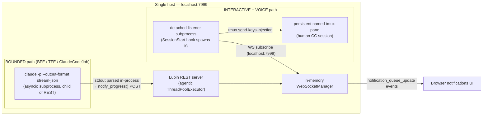

# Cloud Run GPU vs GCE g2-standard-8 + L4 — and Where Claude Code Lives

> **Think-out-loud analysis for Rick.** This is the deep-dive behind the straw-man plan's
> **D2 / §2 / §10**. It weighs hosting Lupin's always-on GPU singleton on **Cloud Run GPU**
> versus a **GCE g2-standard-8 + L4 VM**, and asks whether either platform can host
> **Claude Code surfaced through the notifications UI**. **ANALYSIS ONLY** — nothing here
> proposes committing, deploying, or provisioning anything. It feeds the plan; it does not
> execute it.

| Field | Value |
|---|---|
| **Date** | 2026-05-30 |
| **Author** | Sam 🎙️ (session `657452e9`) |
| **Status** | 🔬 RESEARCH / think-out-loud |
| **Companion — straw-man plan** | [Open: 2026.05.30-gcp-deployment-provisioning-plan.md](/app/docs?path=lupin/src/rnd/v0.1.8/2026.05.30-gcp-deployment/2026.05.30-gcp-deployment-provisioning-plan.md) |
| **Companion — architecture survey** | [Open: 2026.05.30-gcp-deployment-architecture-survey.md](/app/docs?path=lupin/src/rnd/v0.1.8/2026.05.30-gcp-deployment/2026.05.30-gcp-deployment-architecture-survey.md) |
| **Convention** | 🧩 STRAW-MAN = forward-looking assumption · ↩ Flip-if = the condition that reverses the call · ⚠️ = fact-check rated uncertain/low-confidence |

---

## TL;DR — Verdict

**Same L4 silicon, different execution-model wrapper.** A Cloud Run GPU instance and a
g2-standard-8 VM both ride the *identical* NVIDIA L4 (24 GB VRAM, one GPU per host, Ada
Lovelace). The decision is **not** about GPU capability — it is entirely about the
*execution model* wrapped around that silicon: managed / ephemeral / request-scoped /
no-shell (Cloud Run) versus full-control / persistent / SSH-able (the VM).

For Lupin specifically — an **always-on, GPU-coupled, daemon-thread singleton** — that
wrapper choice is decisive on **three** independent axes, all pointing the same way:

1. **Cost.** The VM is cheaper at every tier because Cloud Run's only structural cost win
   (scale-to-zero) is *unrealizable* for Lupin: its three daemon threads force
   `min-instances=1`, so the L4 stays attached and billed 24×7 with nothing in return.
2. **Architectural fit.** Lupin's in-memory FIFO queues, `ThreadPoolExecutor` agentic pool,
   3 daemon threads, in-memory `WebSocketManager`, host-mounted `~/.claude` OAuth, and a
   41 GB-class persistent store all assume a single long-lived process on stable POSIX
   disk. Cloud Run's ephemeral in-memory FS (32 GiB cap) fights every one of these.
3. **Claude Code.** The full bounded + interactive + voice CC loop runs on the VM with
   **zero re-architecture**. Cloud Run can host *only* the bounded path, and even that
   fights the platform. You **cannot SSH into Cloud Run** to watch CC live — log lines via
   Cloud Logging are the only capture surface, and they miss the interactive TTY entirely.

**Recommendation:** put Lupin + its GPU + Claude Code on a **single g2-standard-8 + L4 VM**.
↩ **Flip-if** the workload ever becomes *bursty and stateless* (see §7).

---

## Direct Answers to Rick's Four Questions

### Q1 — Cloud Run GPU vs g2-standard-8 + L4: what's the actual contrast?

**Identical GPU, opposite execution model.** Both surfaces attach the same NVIDIA **L4
(24 GB VRAM)** — the G2 machine family *is* the L4 family on GCP, and Cloud Run's
*recommended* L4 config (8 vCPU / 32 GiB) is *exactly* a g2-standard-8. So per-resource
they are sized the same and the silicon is the same chip. Everything that differs is the
wrapper: Cloud Run is managed/serverless/ephemeral/no-shell with request-scoped CPU and an
in-memory filesystem; the VM is a persistent, SSH-able, full-control host with real POSIX
disk. The cost delta is **100% execution model**, not capacity.

⚠️ Note: "Cloud Run GPU is **L4-only**" is **not** strictly true as a platform statement —
Cloud Run also offers the **NVIDIA RTX PRO 6000 Blackwell (96 GB VRAM)**, which needs a
much larger 20 CPU / 80 GiB footprint and is newer/limited-region. For Lupin's ~2.9 GB
VRAM workload the L4 is the only sensible match, so the practical decision is unaffected —
but the L4 is *one of two* Cloud Run GPU options, not the only one.

### Q2 — Pros/cons of the GCE VM proposal vs Cloud Run, including moving CC onto it?

**Pros of the VM:** cheaper at every tier (and CUD-eligible — Cloud Run GPUs cannot take a
committed-use discount); native fit for daemon threads + in-memory singleton state;
persistent POSIX disk holds the 41 GB-class store and the `~/.claude` OAuth file with zero
re-architecture; full SSH + tmux + journald for live console capture; consolidating CC onto
the *same* box costs ≈ **$0 extra** (8 vCPU / 32 GB has CPU headroom; models use only
~2.9 GB of the 24 GB L4) and makes the hardcoded `localhost:7999` coupling correct again.

**Cons of the VM:** it becomes a single point of failure for *both* the app and CC; CC's
Max-plan rolling-window usage shares CPU/RAM with GPU inference on a modest 8 vCPU / 32 GB
box; Rick loses the isolation his separate CC box gives him today; he owns OS patching,
backups, and the disk. Mitigations: pin batch CC to the post-midnight off-peak window and
cap `cj flow max concurrent agentic jobs`.

**Cons of Cloud Run for this workload:** scale-to-zero is unusable (daemon threads →
`min-instances=1`), so you pay the serverless premium for a benefit you can't realize; the
32 GiB in-memory FS can't hold the store; the 60-min request cap and best-effort session
affinity threaten the WebSocket + queue design; **no SSH**; and the entire interactive/voice
CC loop is impossible.

### Q3 — Can BOTH host Claude Code exposed via the notifications UI?

**Only the VM can host the *full* loop.** The **bounded** CC path (BFE/TFE,
`ClaudeCodeJob`) reaches the UI by streaming `stream-json` stdout **in-process** and
re-emitting it as notification POSTs to `localhost:7999` — the REST server and the CC
subprocess are the *same process tree* (`dispatcher.py:237`, `job.py:225-339`). That path
could *technically* run inside one always-on Cloud Run instance. But the **interactive +
voice** loop depends on three host-OS primitives Cloud Run does not provide: a persistent
**tmux** pane with `send-keys` injection (`cc_notification_listener.py:541-604`), a
**long-lived detached listener subprocess** spawned by the SessionStart hook
(`register_session.py:151-274`), and a **host-mounted `~/.claude` OAuth** file
(`docker-compose.yml:139`). None of those survive Cloud Run's sandbox/recycle model. So:
both *can* host bounded CC; **only the VM** can expose bounded **+ interactive + voice**.

### Q4 — Can you SSH into a Cloud Run instance to capture ALL the CC CLI console output?

**No.** Cloud Run has **no first-party SSH or exec-into-instance** feature. The only
supported capture is **Cloud Logging**, which auto-ingests anything written to the
container's **stdout/stderr** — recoverable later via `gcloud run services logs read/tail`,
never as a live interactive shell. For the **bounded** path that's redundant (its stdout is
already captured in-process), but for "*everything the CLI prints to the terminal*"
(interactive scrollback, progress spinners, carriage-return redraws, raw TTY escapes) Cloud
Logging is **insufficient** — those don't survive a line-oriented log sink. On the VM you
`gcloud compute ssh` in, `tmux attach`, and watch CC live exactly as today.

⚠️ Fact-check caveat: the popular quote that Cloud Logging is "*an alternative to kubectl
exec or SSH access*" is **not** on the current official logging page. "No SSH" is an
**inferred-from-absence** platform fact (corroborated by the troubleshooting docs steering
all debugging to Cloud Logging and by community sources), *not* a single verbatim official
denial. What **is** officially verbatim: stdout/stderr is auto-captured by Cloud Logging.
Community SSH workarounds (ttyd/gotty over HTTP) exist but are *not* Google features and
expose a shell, not a real attached TTY.

---

## Head-to-Head Comparison

| Dimension | **Cloud Run GPU** | **GCE g2-standard-8 + L4 VM** |
|---|---|---|
| **GPU silicon** | NVIDIA L4, 24 GB VRAM (identical chip) ⚠️ *also offers RTX PRO 6000 96 GB — not L4-only* | NVIDIA L4, 24 GB GDDR6 (identical chip) |
| **Execution model** | Managed, serverless, request-scoped, instance-recycled | Persistent, full-control, single long-lived process |
| **SSH / interactive shell** | ❌ None (no exec/SSH; community ttyd hacks only) | ✅ `gcloud compute ssh` + tmux attach, native |
| **Console / stdout capture** | Cloud Logging only (post-hoc log lines; misses TTY/spinner output) | tmux scrollback + per-session logs + journald (verbatim, incl. interactive) |
| **Filesystem & persistence** | In-memory FS; **writes consume the 32 GiB instance RAM** (officially verbatim); GCS-FUSE = no locking, last-write-wins, non-POSIX | Real POSIX persistent disk; survives reboots; 41 GB-class store + `~/.claude` sit natively |
| **Image-size ceiling** | ✅ **No direct limit** — 31.7 GB app + 20.1 GB model images deploy fine (only cold-start pull penalty) | ✅ No issue — images live on local disk (~52 GB) |
| **`~/.claude` OAuth handling** | Secret Manager file-mount (read-only-latest); **token-refresh write-back gap** ⚠️ — refreshed token not durable | Ordinary persistent-disk file CC reads **and rewrites** freely (bind-mount today, `docker-compose.yml:139`) |
| **Singleton / daemon-thread fit** | ❌ Scale-from-zero is request-only → 3 daemon threads + agentic pool force `min-instances=1`; CPU throttled between requests under default billing | ✅ Native — one process, daemons run indefinitely (`running_fifo_queue.py:105`, `queue_consumer.py:171`) |
| **WebSocket + timeout** | WS supported but bound by request timeout (default 300 s, **max 60 min**); session affinity best-effort only → unsafe above `max-instances=1` | WS held open as long as the process lives; in-memory `WebSocketManager` is correct |
| **Scaling & cold-start** | Scale-to-zero exists *with* GPU (~5 s GPU-ready; ~19 s Gemma3:4b TTFT) but **unusable** for Lupin (forced min=1) | No autoscaling; 24×7 always-on by design — exactly what a singleton wants |
| **24×7 cost** (us-central1) | ~**$764/mo** (no zonal redundancy) / ~**$1,038/mo** (ZR default-on) ⚠️ *secondary-source rates* | ~**$623/mo** on-demand · ~**$393/mo** 1yr CUD (+ ~$20/mo disk) |
| **Ops burden** | Low (Google patches/scales) but no shell, no live debug, re-architecture required | Higher (you own OS/patch/backup) but full control + zero re-architecture |

---

## Claude Code Hosting Analysis

Lupin's CC integration is **not** "a CLI you point at an API." It is a tightly host-coupled
loop built on three OS-level primitives — and there are **two distinct output paths** to the
notifications UI.

### How CC output reaches the notifications UI today

- **Bounded path** (`dispatcher.py:237` `_run_bounded` → `claude -p ... --output-format
  stream-json --verbose`; `job.py:225-339` `notify_progress()`): CC stdout is parsed
  **in-process** and re-emitted as notification POSTs to `localhost:7999`. The REST server
  and the CC subprocess share **one process tree**. This path does **not** need Cloud
  Logging or a shell to reach the UI.
- **Interactive + voice path** (`cc_notification_listener.py:541-604` `_inject_via_tmux`
  shelling `tmux send-keys`; `register_session.py:151-274` `_spawn_listener` with
  `start_new_session=True`): a persistent tmux pane + a forever-running detached host
  subprocess holding a WebSocket to `localhost:7999`. Pure host-OS plumbing.

### localhost co-location coupling

Three independent hardcoded `localhost:7999` couplings make co-location of REST + CC
effectively **mandatory**:

1. **MCP server** — `mcp.json:9` `LUPIN_APP_SERVER_URL: http://localhost:7999` (every
   `notify()`/`converse()`/`ask_*()` the CC agent calls POSTs there).
2. **Listener WebSocket** — `base_config.py:20` `DEFAULT_SERVER_PORT = 7999`.
3. **Bounded job notify** — in-process POST to `localhost:7999` (`docker-compose.yml:155`
   `LUPIN_API_URL`).

Split CC onto a different host and all three break **plus** the tmux bridge still requires
listener + CC + tmux on the *same* host regardless. Net: voice replies never reach CC, CC
job cards stop updating, commons DMs to CC silently drop. **Keep REST + CC + tmux +
listener + GPU models on ONE host.**

### Hosting CC — three placements

| Placement | Bounded path | Interactive + voice | Console capture | Verdict |
|---|---|---|---|---|
| **On the GPU VM (consolidated)** | ✅ native | ✅ native | tmux + logs + journald (verbatim) | ✅ **Best** — full loop, ≈$0 incremental, fixes `localhost` coupling |
| **On Cloud Run** | ⚠️ technically yes, fights platform | ❌ impossible (no tmux/TTY/persistent subprocess) | Cloud Logging only (misses TTY) | ❌ bounded-only, and even that is awkward |
| **On its own no-GPU box (today's split)** | ✅ but breaks `localhost` coupling | ✅ but breaks coupling | tmux + logs | ⚠️ works today but adds cross-host plumbing the consolidation removes |

🧩 **STRAW-MAN:** consolidate CC from Rick's current no-GPU box **onto** the GPU VM. The g2
has ample CPU/RAM headroom for the CPU-only bounded jobs, and the OAuth file + tmux +
listener + REST + GPU models become co-resident. ↩ **Flip-if** the Max-plan rolling-window
contention between batch CC and Rick's interactive CC proves un-de-conflictable by off-peak
scheduling — then keep CC isolated and re-point the three couplings.

⚠️ **Open gap, not a config tweak:** on Cloud Run the `~/.claude` OAuth file could be
materialized from a **Secret Manager file-mount** (`--set-secrets=/path=secret:latest`),
surviving deploys — but the Max-plan CLI **refreshes its OAuth token in place**, and a
Secret Manager mount is read-only/versioned, so a refreshed token would **not** persist
across instance recycle without an explicit write-back step. The VM treats `~/.claude` as
ordinary persistent disk CC reads *and* rewrites freely. (Fact-check confidence: **medium**
on the refresh interaction — the Max-plan CLI's token-refresh behavior is undocumented by
Google.)

---

## Cost Comparison (us-central1)

> ⚠️ **Read this caveat first.** The fact-check rated the **Cloud Run dollar totals
> UNCERTAIN**: the official `cloud.google.com/run/pricing` page is JS-rendered and was not
> machine-readable on two fetch attempts, so the L4 per-second rates and the $764/$1,038
> totals come from a **secondary source (cloudchipr)**. The **g2-standard-8** figures are
> from a **high-quality reseller mirror (gcloud-compute.com)**, *not* the official GCP
> calculator. **Re-price on the official GCP calculator before anchoring Rick to a budget.**
> What is **confirmed from primary docs** is the *directional* conclusion and its structural
> basis (below).

### The VM (compute, GPU-inclusive — L4 is bundled into the machine-type price)

| Tier | Hourly | Monthly | Notes |
|---|---|---|---|
| On-demand | $0.8536/hr | **$623.15/mo** | flexible, no commitment |
| 1-yr CUD | $0.5378/hr | **$392.58/mo** | ~37% off — textbook always-on candidate |
| 3-yr CUD | $0.3841/hr | **$280.42/mo** | ~55% off |
| Spot | $0.3577/hr | $261.09/mo | ❌ **ruled out** — preemption destroys in-memory queues |

Plus a **200 GB pd-balanced disk ≈ $20/mo** (holds 31.7 GB + 20.1 GB images + data + OS +
Docker overhead). All-in: **~$643/mo on-demand**, **~$413/mo with 1yr CUD**.

### Cloud Run GPU always-on (`min-instances=1`, the only viable config for Lupin)

⚠️ Secondary-source math (re-verify): GPU $0.0001867/s × 2,628,000 s = $490.65 + CPU
$0.000018/vCPU-s × 4 × 2,628,000 = $189.22 + Memory $0.000002/GiB-s × 16 × 2,628,000 =
$84.10 ≈ **$763.96/mo** (no zonal redundancy). With ZR default-on (GPU $0.0002909/s) ≈
**$1,037.80/mo** — **plus** external GCS/Filestore for the persistent store the VM holds for
free.

### The small no-GPU CC box Rick runs today

| Machine | Hourly | Monthly | 1-yr CUD |
|---|---|---|---|
| e2-standard-2 (2 vCPU / 8 GB) | $0.067/hr | ~$48.92/mo | — |
| e2-standard-4 (4 vCPU / 16 GB) | $0.134/hr | ~$97.84/mo | ~$61.64/mo |

Consolidating CC onto the g2 VM **retires this box** (saves ~$49–98/mo) at ≈$0 incremental
cost on the GPU VM, *and* collapses the cross-host `~/.claude` mount + notification plumbing.

### Bottom line

| | On-demand | 1-yr CUD |
|---|---|---|
| **g2 VM all-in** (compute + 200 GB disk) | ~$643/mo | ~$413/mo |
| **Cloud Run GPU** (no ZR) | ~$764/mo | n/a — **CUD doesn't apply to Cloud Run GPUs** |
| **Cloud Run GPU** (ZR default-on) | ~$1,038/mo | n/a |

The VM is cheaper by **~$120/mo on-demand** and **~$350/mo+ under CUD** — *while also*
retiring the ~$49–98/mo CC box. **Confirmed structural facts** (primary docs) make the
directional verdict reliable even though the exact dollars are pending re-verification:
instance-based billing charges GPU + CPU + memory for the full instance lifetime;
`min-instances` are charged at full rate even when idle; GPU is billed per-second with no
free tier; and **flexible CUDs do not apply to Cloud Run GPUs** — so the VM has a
cost-reduction lever Cloud Run structurally lacks.

⚠️ Disk-sizing note: the research flagged that the **"41 GB LanceDB"** figure likely
*conflates data + images* — the live LanceDB measured ~892 MB on disk, the full project ~25
GB, and the two Docker images ~52 GB. Either way, the *number* doesn't change the verdict
(it just sets the disk size), but the **32 GiB in-memory Cloud Run ceiling** is a hard
blocker for *any* multi-GB store on the writable FS, so confirm the true on-disk footprint
before finalizing disk size.

---

## Recommendation

**For Lupin's always-on, GPU-coupled, daemon-thread singleton: deploy on a single
g2-standard-8 + L4 VM, and consolidate Claude Code onto it.** The VM is **cheaper at every
tier** (and the only one that can take a CUD), is a **native architectural fit** (daemons,
in-memory singleton state, POSIX persistent store, host-mounted OAuth all work unchanged),
and is the **only** platform that exposes the **full** CC notifications-UI loop (bounded +
interactive + voice) with **zero re-architecture**. Cloud Run would pay the serverless
premium for a scale-to-zero benefit a 24×7 singleton **structurally cannot use**, while
breaking the filesystem, WebSocket-lifetime, and shell-access assumptions the design rests
on.

### When Cloud Run WOULD win (↩ Flip-if)

Cloud Run flips from "wrong fit" to "right fit" if **all** of these become true:

1. **The workload becomes bursty/stateless** — the GPU service is invoked by discrete
   requests with idle gaps, so scale-to-zero actually fires and you pay only for what you
   use. (Today: 3 daemon threads force `min-instances=1`, killing this.)
2. **The daemon threads + in-memory singleton state are externalized** — queues to a managed
   broker, `WebSocketManager` state to Redis/Pub-Sub, ghost-sweeper/consumer/clock to Cloud
   Scheduler/Tasks. (A real re-architecture, not a config flag.)
3. **The persistent store moves off-instance** — to an external managed store, since the
   32 GiB in-memory FS can't hold it and GCS-FUSE is DB-unsuitable.
4. **Claude Code's interactive/voice loop is dropped or relocated** — Cloud Run can only ever
   host the bounded path; the tmux/listener/persistent-subprocess loop has no surface there.
5. **Operator live-debugging via SSH is no longer required** — you accept Cloud Logging-only
   post-hoc capture.

In short: Cloud Run wins for a *stateless, request-driven, horizontally-scaling inference
service*. Lupin is the opposite of that — a *stateful, always-on, single-process monolith*.

---

## Open Questions — What Rick's GCP Credentials Would Let Us Verify

1. **Official Cloud Run GPU pricing.** Re-price the L4 per-second rate (with/without zonal
   redundancy) and the per-vCPU / per-GiB-second rates directly on `cloud.google.com/run/pricing`
   or the GCP calculator. The $764/$1,038 totals are ⚠️ secondary-source-only today.
2. **Official g2-standard-8 pricing + CUD.** Confirm $623/$393/$280 per-mo on the official
   calculator (current figures are reseller-mirror) and whether Rick will commit to the 1-yr
   CUD — the single biggest cost lever (~halves the compute bill).
3. **g2 + L4 quota in the target zone.** Verify `g2-standard-8 + L4` quota is grantable in
   Rick's chosen region/zone (us-central1 vs us-east4 both list L4).
4. **True production store footprint.** Measure the actual on-disk size of the live
   LanceDB/memory store (the "41 GB" figure ⚠️ likely conflates data + images) to size the
   persistent disk and confirm the 32 GiB Cloud Run ceiling is genuinely a blocker.
5. **Max-plan OAuth token-refresh behavior.** Empirically confirm whether/how often the CLI
   rewrites `~/.claude/.credentials.json` — this decides whether a Cloud Run Secret-Manager
   file-mount is even viable for bounded CC (⚠️ medium-confidence today).
6. **Cloud Run singleton edge cases.** Verify `min=max=1` truly pins one instance with no
   2-instance overlap during revision rollout (a momentary overlap would split the in-memory
   `WebSocketManager` + FIFO queue state).
7. **What runs on the current CC box.** Confirm whether the existing no-GPU CC box hosts only
   interactive sessions or also scheduled BFE/TFE batch — so nothing is orphaned on retirement.

---

## Sources (verified 2026-05-30)

**Cloud Run GPU — capabilities & constraints**
- GPU config (L4 + RTX PRO 6000; one GPU/instance; L4 min 4 CPU/16 GiB, 8/32 recommended; instance-based billing mandatory; ~5 s GPU-ready): `docs.cloud.google.com/run/docs/configuring/services/gpu`
- GA announcement (June 2, 2025; scale-to-zero with GPU; ~19 s Gemma3:4b TTFT): `cloud.google.com/blog/products/serverless/cloud-run-gpus-are-now-generally-available`
- Quotas (32 GiB max memory; 60-min max request timeout; **no direct image-size limit**): `docs.cloud.google.com/run/quotas`
- Request timeout (default 300 s, max 3600 s): `docs.cloud.google.com/run/docs/configuring/request-timeout`
- Autoscaling (scale-from-zero is request-only → background threads need `min-instances ≥ 1`): `docs.cloud.google.com/run/docs/about-instance-autoscaling`
- Container contract (**in-memory FS consumes instance memory** — verbatim; SIGTERM + 10 s): `docs.cloud.google.com/run/docs/container-contract`
- Billing settings (instance-based = CPU for entire lifecycle): `docs.cloud.google.com/run/docs/configuring/billing-settings`
- Logging (stdout/stderr auto-captured by Cloud Logging — verbatim; ⚠️ "alternative to kubectl exec/SSH" quote **not** on current page): `docs.cloud.google.com/run/docs/logging`
- Troubleshooting (debug via logs + Error Reporting; no SSH/exec documented): `docs.cloud.google.com/run/docs/troubleshooting`
- WebSockets (default 5 min / max 60 min; best-effort affinity): `docs.cloud.google.com/run/docs/triggering/websockets`
- GCS-FUSE volume (no locking, last-write-wins, non-POSIX): `docs.cloud.google.com/run/docs/configuring/services/cloud-storage-volume-mounts`
- In-memory volume mounts (default half container memory; OOM on overflow): `docs.cloud.google.com/run/docs/configuring/services/in-memory-volume-mounts`
- Secret Manager mounts (env var or read-only-latest file mount): `docs.cloud.google.com/run/docs/configuring/services/secrets`
- Cloud Run CUDs (flexible CUDs **do not** apply to GPUs): `docs.cloud.google.com/run/cud`
- ⚠️ Cloud Run GPU per-second rates (secondary): `cloudchipr.com/blog/cloud-run-pricing`

**GCE g2 + L4**
- GPU machine types (G2 = L4 family; g2-standard-8 = 8 vCPU/32 GB/1× L4 24 GB GDDR6): `docs.cloud.google.com/compute/docs/gpus`
- Accelerator-optimized machines: `docs.cloud.google.com/compute/docs/accelerator-optimized-machines`
- Persistent disks survive reboots: `cloud.google.com/compute/docs/disks/persistent-disks`
- ⚠️ g2 pricing (reseller mirrors — re-verify on official calculator): `gcloud-compute.com/g2-standard-8.html`, `economize.cloud/.../g2-standard-8`, `economize.cloud/.../e2-standard-4`
- L4 datasheet (24 GB GDDR6, 300 GB/s, 72 W): `nvidia.com/en-us/data-center/l4/`

**Lupin codebase (this repo)**
- `src/cosa/rest/running_fifo_queue.py:105` (GhostJobSweeper daemon thread), `:113` (heartbeat)
- `src/cosa/rest/queue_consumer.py:171` (TodoConsumerThread, `daemon=True`)
- `src/cosa/orchestration/claude_code/dispatcher.py:237-291` (`_run_bounded` stream-json subprocess)
- `src/cosa/agents/claude_code/job.py:225-339` (`_execute` + `notify_progress`)
- `src/lupin_cli/claude_code/hooks/lib/cc_notification_listener.py:506-604` (tmux resolve + `_inject_via_tmux`)
- `src/lupin_cli/claude_code/hooks/register_session.py:151-274` (`_spawn_listener`, detached)
- `src/cosa/agents/utils/proxy_agents/base_config.py:19-20` (`localhost:7999`)
- `docker/lupin/claude-config/mcp.json:9` (`LUPIN_APP_SERVER_URL`)
- `docker-compose.yml:139` (`~/.claude/.credentials.json:ro`), `:155` (`LUPIN_API_URL`)
