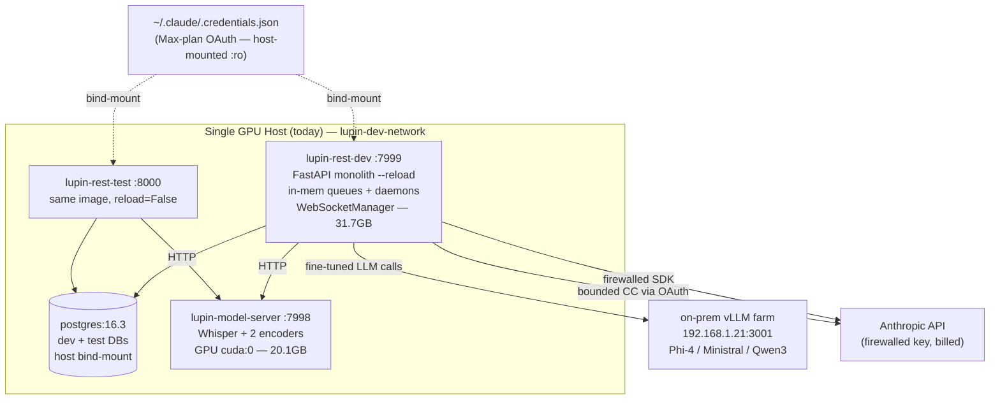

# GCP Deployment Architecture Survey & Readiness Assessment

**Date**: 2026-05-30
**Branch**: `wip-v0.1.8-2026.05.29-preparing-for-gcp-deployment`
**Author**: Sam 🎙️ (session `657452e9`)
**Method**: 11-agent read-only survey workflow (`wf_d963e999-af1`, ~1.19M tokens) — 9 parallel dimension surveyors → cross-dimension synthesis → completeness critic
**Status**: 📋 Phase 1 (Understand) complete. This is the **survey/readiness foundation**, NOT yet the provisioning/deployment plan. The plan is gated on the decisions in §11.

---

## 1. TL;DR

Lupin is a **GPU-coupled, single-process, stateful FastAPI monolith** with **substantial prior GCP investment** already in-tree. This is a *finish-and-automate* job, not greenfield.

- **Good news** — the storage + config layers are already cloud-shaped. Flipping `storage_backend=gcs` points LanceDB and Deep-Research at `gs://` buckets with **zero code change**; `[Lupin: Production]`/`[Lupin: Testing-GCS]` config blocks, `util_gcs.py`, Cloud SQL unix-socket support, Alembic migrations, Secret Manager wiring, and four working `cloud-run-*.sh` scripts all exist.
- **Hard news** — three structural properties make a naive single-platform Cloud Run deployment **impossible today**:
  1. **Singleton architecture** (in-memory queues + daemon threads + in-memory WebSocketManager) → forbids scale-out and scale-to-zero.
  2. **GPU + image size** (in-process Whisper + 2 encoders; 31.7 GB app image, 20.1 GB model-server image) → excludes the default Cloud Run path.
  3. **The Claude Code OAuth blocker** (the headline risk) — bounded `ClaudeCodeJob` (BFE/TFE, the zero-per-token Max-plan backbone) authenticates via a **host-mounted, human-session-bound OAuth token** that *cannot* exist in a headless GCP container.

- **Net recommendation**: this is a **GKE-anchored or GCE-VM-anchored** workload, **not** Cloud-Run-anchored, until the singleton/GPU/OAuth constraints are addressed. The pragmatic first milestone is a **single always-on GCE GPU VM** running today's `docker-compose` almost verbatim, with Cloud SQL + GCS swapped in (Approach A, §10).

- **Credentials**: NOT needed for this survey (it is 100% codebase-derived). They unlock the **next** phase — validating enabled APIs, GPU quota, existing buckets/SQL instances, IAM, and the canonical project/region (§9).

---

## 2. Current Architecture Snapshot

Lupin runs today as a `docker-compose` stack on a **single GPU host** (external bridge `lupin-dev-network`), four services:

| Service | Image / size | Port | Role | GPU |
|---|---|---|---|---|
| `postgres` | `postgres:16.3-alpine` | 5432 | `lupin_db_dev` + `lupin_db_test`; data bind-mounted to host path `…/lupin-data/postgresql-dev-data` | — |
| `lupin-model-server` | `lupin-model-server:0.1.0` (~20.1 GB) | 7998 | Frozen-code FastAPI hosting Whisper `distil-large-v3` + nomic `CodeRankEmbed` + `nomic-embed-text-v1.5`; bcrypt API-key auth | ✅ `CUDA_VISIBLE_DEVICES=0` |
| `lupin-rest-dev` | `lupin:1.0.0` (~31.7 GB) | 7999 | Primary FastAPI server, `uvicorn --reload`, single worker | ✅ (reserved) |
| `lupin-rest-test` | `lupin:1.0.0` (same) | 8000 | `LUPIN_ENV=testing`, `reload=False`, scheduled monopolize-mode test runs | ✅ (reserved) |

**Singleton job engine** — one always-on in-memory process: 5 in-memory FIFO queues (todo/running/done/dead + audio), a `ThreadPoolExecutor` agentic pool, and three daemon threads (ghost-job sweeper @30 s, consumer worker, clock heartbeat @60 s). `WebSocketManager` keeps connection/session/subscription state **in-memory** and does user-centric routing across `/ws/queue` and `/ws/audio`.

**Two LLM cost paths** coexist: bounded `ClaudeCodeJob` via Max-plan **OAuth** (zero per-token; used by BFE/TFE) and direct Anthropic SDK via `ANTHROPIC_API_KEY_FIREWALLED` (billed). An **external on-prem vLLM farm** (`192.168.1.21:3001`) serves fine-tuned models (Phi-4-14B, Ministral-8B, Qwen3-4B).

**Host coupling that will NOT survive a managed container** (verified): bind-mounts of `./src` (live reload), `./io`, `./.git`, `./.claude/worktrees`, `~/.claude/.credentials.json:ro` (compose lines **139/217** — the Max-plan OAuth token), `~/.claude/sessions`, `~/.claude/plans`, and **8 external repos** for the multi-repo doc viewer.

---

## 3. Deployment Units

| Unit | Statefulness | GPU | Contents |
|---|---|:--:|---|
| **lupin-rest** | singleton-required | ✅→CPU* | FastAPI app (137+ endpoints / ~34 routers), 3 WebSocket channels, in-memory FIFO queues, ThreadPoolExecutor pool, sweeper/consumer/clock daemons, in-memory WebSocketManager, cosa-voice MCP server, Claude Code CLI + bounded-CC jobs (BFE/TFE), SPA assets |
| **lupin-model-server** | stateless | ✅ | Frozen-code FastAPI :7998 → Whisper distil-large-v3 (2.3 GB VRAM) + nomic CodeRankEmbed (0.3 GB) + nomic-embed-text-v1.5 (0.3 GB); ~2.9 GB VRAM total; bcrypt API-key auth; CUDA 12.4 / torch 2.6 cu124 |
| **PostgreSQL** | stateful | — | Users, RefreshTokens, ApiKeys, Notifications, PredictionLog, ProxyDecision, `job_history` + `server_lifecycle` (scheduled-job recovery); Alembic-managed (7 migrations) |
| **LanceDB** | stateful | — | ~855 MB–41 GB of Lance tables (solution_snapshots, embedding_cache, etc.); append-only; **native `gs://` driver — no GCS-FUSE needed** |
| **GCS object storage** | stateful | — | Deep-research markdown reports; candidate future home for HF model cache (Tier-3) + SPA static assets |
| **External vLLM** | stateful | ✅ | On-prem fine-tuned models; hardcoded private IP — must be re-homed or repointed |

\* `lupin-rest` reserves GPU **today** only because Whisper/embeddings run in-process; the **model-server carve-out** (designed, container built, NOT finished) makes it CPU-only.

---

## 4. The Three Critical Blockers

### 4.1 🔴 Claude Code Max-plan OAuth cannot authenticate headless (the headline)
Verified: `docker-compose.yml:139/217` bind-mount `~/.claude/.credentials.json:ro` from the host. Bounded `ClaudeCodeJob` (BFE, TFE, the **zero-per-token LLM backbone**) depends on these **human-session-bound, interactively-refreshed** OAuth tokens. They cannot be baked into an image nor minted by a GCP service account. **Without resolution, the entire cost-optimal bounded-CC path does not run in headless GCP.** → **Decision #1 for Rick (§11).**

### 4.2 🔴 Singleton in-memory job + WebSocket architecture forbids scale-out / scale-to-zero
In-memory FIFO queues, the ThreadPool pool, three daemon threads, and the in-memory WebSocketManager are all single-process. Multiple replicas race on queue mutations and duplicate jobs; scale-to-zero kills the daemons and breaks the 60 s-heartbeat scheduled-job recovery. → Pin to exactly **one always-on instance** (`replicas=1` / `min=max=1`, already in the deploy script). Distributed state (Memorystore/Redis pub-sub, Cloud Tasks/Pub-Sub queue backing) is a **separate future epic**, not a prerequisite.

### 4.3 🔴 GPU requirement + 31.7 GB / 20.1 GB images exclude the default Cloud Run path
Three in-process models need a GPU (`cuda:0`); both images far exceed the practical Cloud Run image budget. Cloud Run GPU support is narrow (A100/L4, limited regions). Tier-3 GCS-FUSE model externalization (which would slim the image) is **designed but NOT implemented**. → Anchor GPU on a **GKE GPU node pool (L4/A100)** or Vertex AI; finish the model-server carve-out; multi-stage build to drop the 6 GB CUDA dev toolkit + Tier-3 to drop ~13 GB of baked models (target < 15 GB before frequent CI).

---

## 5. GCP Target-Service Mapping

| Component | Recommended | Alternatives | Why |
|---|---|---|---|
| **lupin-rest monolith** | **GKE Standard Deployment, replicas=1, CPU node pool** (after carve-out) | Single always-on GCE VM (closest-to-today, keeps OAuth+GPU); Cloud Run min=max=1 (only if GPU fully carved out + image slimmed + OAuth solved) | Singleton-required; GKE replicas=1 gives a stable always-on pod with native Workload Identity and no scale-to-zero surprises |
| **lupin-model-server** | **GKE GPU node pool** (L4 24 GB cost-efficient; A100 40 GB for concurrency) | Vertex AI custom prediction endpoint; Cloud Run GPU (narrow) | Decouples GPU from uvicorn reload thrashing (the CUDA Error 804 root cause); explicit driver control (≥525 for cu124) |
| **PostgreSQL** | **Cloud SQL PostgreSQL 16** (`db-custom-2-7680` prod; `db-f1-micro` test only) | AlloyDB (adds pgvector — could absorb LanceDB later); GKE StatefulSet (not recommended) | Code already supports unix-socket via `CLOUD_SQL_CONNECTION_NAME` + Alembic auto-migrate; managed backups + PITR replace the fragile bind-mount |
| **LanceDB** | **GCS bucket via native `gs://` driver**, `storage_backend=gcs` | AlloyDB pgvector (consolidate); Vertex AI Vector Search; GCS-FUSE on GKE | Already wired + unit-tested (11/11); **no code change, no GCS-FUSE**. Caveat: resolve the 4/8 integration query failures first |
| **Secrets** | **Secret Manager + Workload Identity** | Mounted secret volumes; env injection | INI already uses `${VAR}` interpolation; `cloud-run-setup-secrets.sh` proves wiring exists. ⚠️ `src/conf/keys/` is COPYed into the image — must be scrubbed |
| **Images + build** | **Artifact Registry + Cloud Build** (custom CUDA-12.4 builder, `n2-highmem-8`) | Manual local build + GCR push (deprecated); Kaniko | 31.7 GB + 20.1 GB images need fast registry + caching; flash-attn compile needs nvcc + RAM (standard Cloud Build will OOM). **No `cloudbuild.yaml` exists** |
| **Bounded ClaudeCodeJob** | **DEFERRED — Rick decision** (§11.1) | Fall back to billed Anthropic SDK; exclude from first cut | OAuth tokens are human-session-bound and cannot be service-account-minted headless |
| **External vLLM** | **GKE GPU pods via internal LB**, inject URL via env | Vertex AI Model Garden; repoint to Anthropic/Gemini | `192.168.1.21:3001` is unreachable from GCP; refactor the hardcoded IP to an injected endpoint |
| **cosa-voice MCP** | Inject `LUPIN_API_BASE_URL`; restrict deployed agents to `notify()` | Disable commons (`commons enabled=false`) in the GCP profile | Agents currently call `127.0.0.1:7999` — broken across pods; interactive `converse()`/`ask_*` need a human terminal |
| **SPA + doc-viewer mounts** | **Cloud Storage + Cloud CDN** (SPA); GCS buckets (doc-viewer scopes) | Keep assets in-image; GCS-FUSE | Bind-mounts don't exist in managed containers; CDN cuts image size + latency |
| **Ingress / TLS / WS** | **GKE Ingress / HTTPS LB** with session affinity + WebSocket support | Cloud Run auto-LB (managed `*.run.app` cert) | In-memory WebSocketManager + single worker demand sticky routing; LB must pass WSS and tolerate the 60 s idle timeout vs 30 s heartbeat |

---

## 6. Ranked Risks

| Sev | Risk | Mitigation (short) |
|---|---|---|
| 🔴 CRITICAL | Claude Code Max-plan OAuth can't go headless (§4.1) | Rick decision #1: user-context VM / SDK fallback / exclude |
| 🔴 CRITICAL | Singleton in-memory job+WS architecture (§4.2) | `replicas=1` / `min=max=1`, never scale-to-zero; distributed state is a future epic |
| 🔴 CRITICAL | GPU + 31.7/20.1 GB images exclude Cloud Run (§4.3) | GKE GPU pool / Vertex; finish carve-out; multi-stage + Tier-3 slim |
| 🟠 HIGH | **`LUPIN_ROOT` path drift** — deploy script injects `/app`, image bakes `/var/lupin` | Fix script to `/var/lupin`; add a startup assertion that `LUPIN_ROOT/src/conf/lupin-app.ini` exists. *Quick high-value pre-deploy fix.* |
| 🟠 HIGH | **`src/conf/keys/` baked into image** (Dockerfile:267), dev keys possibly in git history | Exclude from prod image; migrate keys to Secret Manager; **scrub git history + rotate**; add a secret-scan build gate |
| 🟠 HIGH | No `cloudbuild.yaml`; manual builds, no audit trail | Author `cloudbuild.yaml` (custom CUDA builder), push to Artifact Registry, pin base by digest |
| 🟠 HIGH | vLLM + commons hardcoded to private/localhost addresses | Externalize to `VLLM_URL` / `LUPIN_API_BASE_URL`; re-home vLLM; restrict agents to `notify()` |
| 🟡 MED | Cloud SQL pool exhaustion (`pool_size=5`+`max_overflow=10` per process vs 25-conn micro) | `db-custom-2-7680`+ for prod; keep `replicas=1` |
| 🟡 MED | LanceDB GCS integration 4/8 query/retrieval failures (normalization mismatch) | Root-cause + green the GCS integration suite before GA |
| 🟡 MED | Cold-start: Whisper 30–35 s load + LanceDB GCS warmup vs probe timeouts | Startup probes ≥ 300 s; keep `min-instances=1`; pre-warm |

---

## 7. Day-2 Operations Gaps (Completeness Critic)

> Critic verdict: **"Strong on architecture; incomplete on Day-2 operations."**

These were **not** covered by the architecture survey and must be added before the plan is complete:

1. **Observability / monitoring / alerting** — logs are `print()` only; no Cloud Logging or metrics. On one replica with no failover, a crash is a **silent total outage** and dead daemon threads stay invisible. → Uptime check + a **deep readiness probe asserting the sweeper/consumer/clock daemon threads are alive** (a shallow `/health` returns 200 while daemons are dead).
2. **Cost estimation** — no dollar figure for any approach; a continuous GPU with no scale-to-zero is the cost floor. → Per-approach monthly cost table (GPU, Cloud SQL, egress, build, LB).
3. **IAM least-privilege** — recommending `objectAdmin` lets the app **delete its own LanceDB store**; no build-vs-runtime SA split. → Split build/runtime service accounts; per-bucket `objectUser` not `objectAdmin`.
4. **CI/CD promotion** — no `cloudbuild.yaml`; the four-tier merge gate is not wired to a GCP build. → Candidate-tag parking + digest-pinned promotion of the image that passed the gates (honors the no-auto-promote practice).
5. **DR / backup-restore** — the only backup tool is `docker exec pg_dump`, which **cannot run against managed Cloud SQL** → there is no working RPO/RTO/restore runbook. → Cloud SQL automated backups + PITR (stated RPO/RTO) + GCS Object Versioning + a **tested** restore runbook.
6. **Rollback mechanics** — secret mounted as `latest` defeats revision-pinned rollback; **Alembic-migrate-on-startup means an image rollback can't roll the schema back**, and a failed migration leaves the singleton unable to serve. → Pin secret versions; adopt expand/contract migrations decoupled from deploy.
7. **cosa-voice MCP server deployment** — a separate stateful MCP process treated as mere config injection; headless interactive asks die with no resolved decision surface. → Treat cosa-voice as **its own deployment unit**; wire the decision-proxy auto-answer for headless.
8. **Mobile + Firefox API consumers** — two separate client repos consume the API/WebSocket, unmentioned. The move forces base-URL / WSS / JWT / **CORS** rework (a cross-origin domain blocks the plugin). → Client-contract section + CORS allowlist for the extension origin + seed TODO entries in each client repo (per the cross-project-handoff rule).
9. **Egress / residency / cold-start chain** — cross-cloud egress for the on-prem vLLM hot path, `us-central1` PII residency, and the serial cold-start chain (possibly > 300 s probe) are unanalyzed. → Map every egress path with cost + residency; budget the full serial cold-start against the probe.

---

## 8. Prior Work to Reuse (don't reinvent)

| Artifact | Completeness | Gives us |
|---|---|---|
| `cloud-run-{deploy,build,setup-secrets,validate}.sh` | Functional; needs `LUPIN_ROOT` fix, project-ID parameterization, GCR→Artifact Registry, + a `cloudbuild.yaml` | A working manual Cloud Run deploy/build/secrets/validate flow; `min=max=1` already set; validate script smoke-tests `/health`, `/auth/login`, `/api/notify` |
| GCS storage-backend factory (`solution_manager_factory.py`, `lancedb_solution_manager.py._resolve_db_path`, `util_gcs.py`) | Unit 11/11; integration 4/8 (query-path bug) | Runtime `local\|gcs` switching, **no code change**; LanceDB connects to `gs://` natively |
| `[Lupin: Production]` + `[Lupin: Testing-GCS]` config blocks + `ConfigurationManager` + `LUPIN_CONFIG_MGR_CLI_ARGS` | Complete; add a guard against mis-selecting Development in prod | Env selection via one var; `gs://` URIs; `${VAR}` secret interpolation; build-once/deploy-many |
| Cloud SQL support in `database.py` + 7 Alembic migrations + `migrate-sqlite-to-postgres.py` | Code-complete; needs a real instance + `DB_PASSWORD` secret + pool sizing | Unix-socket Cloud SQL connection, pool tuning, idempotent startup migration |
| `lupin-model-server` container + carve-out design (`src/rnd/v0.1.7/2026.05.16-model-server-carveout/`) | Container runs; carve-out NOT finished (compose still reserves GPU on compute containers) | A built frozen-code GPU model service that fixes CUDA Error 804; the key to a CPU-pod + GPU-pod GKE split |
| Image-bloat audit + uv/py3.13 build modernization (2026.04.26/27) | Tier 0+1 done (31.7 GB); Tier 2/3 designed, not built | Documented 130 GB→31.7 GB path; identifies the remaining 6 GB CUDA toolkit + 13 GB model bakes |
| `job_history` + `server_lifecycle` + downtime-aware scheduled-job catch-up | Agentic jobs only (fast-lane not persisted) | PostgreSQL-backed recovery so agentic + scheduled jobs survive restarts |

---

## 9. What Rick's GCP Credentials Unlock (the next phase)

The survey needed no credentials. The **validation** phase needs them to verify, against the real environment:

1. `gcloud config get-value project / region` — confirm `hello-world-foo-423219` / `us-central1` is the real target, or whether separate dev/test/prod projects exist.
2. `gcloud services list --enabled` — Cloud Run, Compute Engine, GKE, Artifact Registry, Cloud Build, Secret Manager, Cloud SQL Admin, Vertex AI.
3. GPU quota / availability — `NVIDIA_L4_GPUS`, A100, plus Cloud Run GPU availability per region.
4. `gcloud storage ls` — do `gs://lupin-lancedb-{prod,test}` and `gs://lupin-deep-research-{prod,test}` exist? Region? Lifecycle?
5. `gcloud sql instances list/describe` — existing Cloud SQL PG16 instance? Tier? `CLOUD_SQL_CONNECTION_NAME`?
6. `gcloud secrets list` — which of JWT/DB/firewalled-Anthropic/ElevenLabs/OpenAI/Groq/Google/Mistral/Kagi/HF keys already exist.
7. `gcloud projects get-iam-policy` — runtime SA roles (`cloudsql.client`, `storage.objectAdmin`→`objectUser`, `secretmanager.secretAccessor`, `artifactregistry.reader`); Workload Identity configured?
8. `gcloud artifacts repositories list` — does a repo exist for `lupin`/`lupin-model-server`; have images been pushed?
9. Confirm whether the Anthropic billing account behind `ANTHROPIC_API_KEY_FIREWALLED` can absorb bounded-CC traffic if OAuth can't go headless — the decisive input for §4.1.

---

## 10. Three Topology Options

### Approach A — Single always-on GCE GPU VM running `docker-compose` (lift-and-shift)
Provision one GCE VM + GPU (L4/A100), install NVIDIA Container Toolkit, run the existing compose stack almost verbatim. Swap postgres-in-docker → Cloud SQL and local LanceDB → `gs://` via the config flip. The host filesystem preserves the `~/.claude/.credentials.json` OAuth mount and GPU access exactly as today.
- **Pros**: closest to the working dev env (lowest risk/effort); **uniquely preserves the Max-plan OAuth path** (log in once on the VM, credentials persist/refresh); GPU + singleton "just work"; no re-architecture, no `cloudbuild.yaml` prerequisite; **fastest path to a running GCP instance**.
- **Cons**: not managed/elastic — you own OS patching, GPU driver upkeep, restarts, HA (none); single point of failure; bind-mounts/dev ergonomics persist as tech debt; least cloud-native.
- **Best when**: you want a working GCP deployment in days, the OAuth/bounded-CC path must keep working, and a single always-on box with manual ops is acceptable for the first milestone.

### Approach B — GKE hybrid: CPU compute pod (replicas=1) + GPU model-server pod + Cloud SQL + GCS
Finish the carve-out so lupin-rest is CPU-only; deploy as a GKE Deployment `replicas=1` on a CPU node pool; run the model-server on a GKE GPU node pool; Cloud SQL + GCS via Workload Identity; Secret Manager for all keys; HTTPS LB with WS session affinity. Author `cloudbuild.yaml` + Artifact Registry.
- **Pros**: proper managed Kubernetes with native Cloud SQL/GCS/Secret identity, health probes, rolling restarts; clean CPU-vs-GPU cost separation; honors the singleton via `replicas=1` while leaving a door to distributed state; cleans up bind-mounts + secrets properly.
- **Cons**: highest engineering lift (finish carve-out, write `cloudbuild.yaml`, multi-stage/Tier-3 slim, resolve OAuth); more moving parts; **does NOT by itself solve OAuth**.
- **Best when**: this is the intended production end-state and there's time to finish the carve-out, build pipeline, and image slimming — and OAuth is separately resolved.

### Approach C — Cloud Run (CPU-only, min=max=1) + Vertex/GKE GPU model-server + Cloud SQL + GCS
After the carve-out + image slim, deploy lupin-rest to Cloud Run `min=max=1`/no-scale-to-zero (the deploy script already encodes this), host models on Vertex AI or a small GKE GPU pod, reuse the existing GCS/Cloud SQL/Secret wiring.
- **Pros**: most managed/serverless surface for the API tier; Google-managed TLS + ingress; least infra to babysit; reuses the four `cloud-run-*.sh` scripts + config blocks.
- **Cons**: hardest constraints — image must drop from 31.7 GB under the Cloud Run limit (but **Cloud Run can't mount GCS-FUSE**, forcing startup model download or full carve-out reliance); no sidecar in a single revision (model-server fully external); commons/localhost coupling + interactive asks break; **OAuth blocker is most acute here** (a request-driven sandbox is the worst home for a persistent OAuth token). Multiple criticals stacked.
- **Best when**: long-term, after carve-out + slimming are done AND bounded-CC OAuth is solved out-of-band or that path is deliberately excluded.

**Sam's recommendation**: **Approach A as Milestone 1** (de-risks fast, preserves OAuth + GPU, exercises the GCS/Cloud SQL flips on real infra), with **Approach B as the documented end-state** to migrate into once the carve-out + image slimming + a chosen OAuth resolution are done. Approach C only if/when bounded-CC is excluded from the Cloud Run tier or OAuth is solved elsewhere.

---

## 11. Open Questions for Rick (gate the plan)

1. **🔴 The OAuth blocker (decide first)** — bounded `ClaudeCodeJob` (BFE/TFE, the zero-per-token path) relies on a host-mounted `~/.claude/.credentials.json`. Headless GCP can't obtain Max-plan OAuth. Which: **(a)** persistent user-context GCE VM (log in once, credentials persist), **(b)** fall back bounded-CC to the billed Anthropic SDK (cost shift), or **(c)** exclude bounded-CC from the first cut?
2. **Target topology** — fastest working result (Approach A: GCE GPU VM), or build the managed end-state now (Approach B: GKE)?
3. **Project / region** — is `hello-world-foo-423219` the real prod project or a sandbox? Separate dev/test/prod projects? Region (scripts assume `us-central1`)?
4. **Existing resources** — do the GCS buckets + a Cloud SQL PG16 instance already exist, or do we provision them? Region/tier?
5. **External vLLM** — in scope for GCP (re-home to GKE/Vertex + repoint) or out (repoint which routes to Anthropic/Gemini)?
6. **Defer horizontal scaling?** — confirm `replicas=1` / `min=max=1` is acceptable for the first deployment (distributed state is a separate epic).
7. **Image-slimming appetite** — ship the 31.7 GB image on GCE/GKE short-term (A/B tolerate it), or is Tier-2/Tier-3 a prerequisite (mandatory for Cloud Run / C)?
8. **Secret hygiene** — authorize a git-history scrub + key rotation for `src/conf/keys/` before any image push to a remote registry?
9. **Whisper/embeddings** — keep self-hosted on a GPU model-server (current behavior/cost), or evaluate managed Speech-to-Text + Vertex embeddings as a GPU-elimination option?

---

## 12. Recommended Phasing (proposed — pending §11 answers)

- **Phase 0 — Decisions** (§11.1 OAuth + §11.2 topology) + credential-gated validation (§9). *Blocks everything.*
- **Phase 1 — Pre-deploy hygiene** (no GCP needed): fix `LUPIN_ROOT` drift; exclude `src/conf/keys/` + scrub history + rotate; parameterize the project ID in the deploy scripts; add the startup `LUPIN_ROOT` assertion.
- **Phase 2 — Provision** (chosen topology): Cloud SQL, GCS buckets, Secret Manager, Artifact Registry, IAM (split build/runtime SAs, least-privilege), GPU node pool / VM.
- **Phase 3 — Storage + config cutover**: flip `storage_backend=gcs`; green the LanceDB GCS integration suite (4/8 → 8/8); Cloud SQL connection + Alembic migrate; migrate data.
- **Phase 4 — Deploy** + Day-2 wiring (§7): observability (deep readiness probe for daemon liveness), cost table, DR/restore runbook, rollback (version-pinned secrets, expand/contract migrations), `cloudbuild.yaml` + the four-tier merge gate wired to GCP build, CORS/client-contract for mobile/Firefox.
- **Phase 5 — (end-state) migrate A→B**: finish the model-server carve-out; multi-stage + Tier-3 image slim; move to GKE.

---

*Survey artifacts: workflow `wf_d963e999-af1` (11 agents / ~1.19M tokens / 337 tool uses). Full raw surveys + synthesis + critique JSON retained in the session task output. This document is the survey foundation; the provisioning/deployment plan follows once §11 is answered.*
