# GCP Provisioning & Deployment Plan — STRAW MAN (Milestone 1: GCE VM → End-state: GKE)

**Date:** 2026-05-30
**Branch:** wip-v0.1.8-2026.05.29-preparing-for-gcp-deployment
**Author:** Sam 🎙️ (session 657452e9)
**Status:** 📋 STRAW MAN — for section-by-section review
**Companion survey:** [`src/rnd/v0.1.8/2026.05.30-gcp-deployment/2026.05.30-gcp-deployment-architecture-survey.md`](2026.05.30-gcp-deployment-architecture-survey.md)

> **How to use this doc:** Start at the **Decision Ledger (Section 1)** — it is the master index of every flippable choice (D1–D9 + IaC tooling). Every downstream section adopts those defaults and tags its own assumptions inline with the literal marker **🧩 STRAW-MAN** followed by a **↩ Flip if:** line. Read the rest as a ledger of bets you can override one at a time.

---

## Table of Contents

1. [Executive Summary & Decision Ledger](#1-executive-summary--decision-ledger)
2. [Target Architecture — Milestone 1 (GCE GPU VM)](#2-target-architecture--milestone-1-gce-gpu-vm)
3. [OAuth Resolution Deep-Dive (the headline blocker)](#3-oauth-resolution-deep-dive-the-headline-blocker)
4. [Phase 0 — Decisions & Credential-Gated Validation](#4-phase-0--decisions--credential-gated-validation)
5. [Phase 1 — Pre-Deploy Hygiene (no GCP access needed)](#5-phase-1--pre-deploy-hygiene-no-gcp-access-needed)
6. [Phase 2 — Provisioning Automation (IaC)](#6-phase-2--provisioning-automation-iac)
7. [Phase 3 — Storage & Config Cutover](#7-phase-3--storage--config-cutover)
8. [Phase 4 — Deploy Automation & Day-2 Operations](#8-phase-4--deploy-automation--day-2-operations)
9. [Phase 5 — End-State Migration (GCE VM → GKE)](#9-phase-5--end-state-migration-gce-vm--gke)
10. [Cost Model](#10-cost-model)
11. [Testing & Acceptance Strategy](#11-testing--acceptance-strategy)
12. [Risk Register & Remaining Open Questions](#12-risk-register--remaining-open-questions)

---

> **⚠️ Two plan-wide facts the review surfaced — resolved here once, applied in every section below:**
>
> 1. **Alembic does NOT migrate on startup (verified by code).** Section 7 (§3.3) proves via direct code inspection that no `alembic upgrade head` runs at boot — `run-fastapi-lupin.sh` is just `python3 -m fastapi_app.main`, `alembic.ini` is not even copied into the image, and there is no `command.upgrade`/`create_all` anywhere in `main.py`. Every section that previously said "Alembic auto-migrate on first boot" has been corrected to **"manual/pre-deploy migration step"** (the straw-man keeps migrations decoupled from deploy — see §7 and R12). The phrase "auto-migrate on startup" is wrong as currently coded and has been struck everywhere.
> 2. **The 2026-06-15 Agent-SDK credit ceiling is load-bearing.** From 2026-06-15, Agent-SDK / `claude -p` usage on subscription plans draws from a separate **$200/month (Max-20x)** Agent-SDK credit that drains first and, when exhausted, **stops** Agent-SDK requests. This materially erodes the "zero per-token" premise of the entire bounded-CC cost model — for BOTH the straw-man VM and the fallback, on GCP **and** on the on-prem dev host. With today's date 2026-05-30 the change lands inside the deployment window (~2 weeks out). Every "zero per-token" claim in this doc now carries this qualifier (D1, R1, the cost model §10, and §3 U1).

---

> **✅ DECISIONS RESOLVED & MILESTONE RE-SCOPED — 2026-05-30 (Rick, via voice walkthrough). This block is AUTHORITATIVE and SUPERSEDES the straw-man defaults in the §1.2 Decision Ledger below.**
>
> **🎯 Milestone 1 is RE-SCOPED: local-dev → GCP-_TEST_ migration — NOT production.** The goal is to build and prove the *process* of moving from Rick's local dev server to a GCP **test** environment. Production "is still a long way off"; the later test→prod step is an easy GCP→GCP horizontal clone. **This document has now been SCRUBBED for that re-scoping:** Milestone-1 references that used to say "prod"/"Production" now read as "the GCP test environment" / "test instance" / "test image"; any remaining "production" reference denotes either the FUTURE production phase (Phase 5 / the eventual test→prod leap) or a load-bearing code/config literal (`LUPIN_ENV == "production"`, the `[Lupin: Production]` INI block name, default values like `lupin_db_prod`), each called out inline — see the §7 LUPIN_ENV clarifying note (§7.1.3) for how the code literal stays accurate while the prose says "test environment." Config selection targets a `[Lupin: Testing-GCS]`-style block + the `-test` buckets (`gs://lupin-lancedb-test`, `gs://lupin-deep-research-test`), NOT `[Lupin: Production]`.
>
> | Decision | ✅ Resolved value |
> |---|---|
> | **D2 Topology** | Single GCE **g2-standard-8 + L4** VM (params tweakable; approach solid). GKE = future end-state. |
> | **D1 CC OAuth** | **Setup-token** (1-yr `CLAUDE_CODE_OAUTH_TOKEN`) in **Secret Manager** (Variant α). **➕ NEW REQUIREMENT:** a token **refresh/update mechanism** — CC occasionally forces arbitrary credential re-auth, so we need an easy "re-mint → update the Secret Manager version → VM reloads it" path, with an SSH interactive `claude login` on the VM as the manual fallback. (Tracked as a Phase-1/Phase-4 deliverable + a new risk row.) |
> | **CC host** | **Consolidate** Claude Code onto the GPU VM (retire the current no-GPU CC box). |
> | **D8 Secrets** | **Exclude `src/conf/keys/` from the image + rotate keys + verify git history**; destructive history rewrite ONLY if exposure is actually found. |
> | **D3 Project** | **Reuse the existing sandbox project** (`hello-world-foo-423219`) for now — sufficient to prove the dev→test process. A dedicated test project (and later prod project) comes later. |
> | **IaC** | **Terraform** for durable resources **+ thin bash wrappers** evolving the existing `cloud-run-*.sh`. |
> | **Staging** | **None.** The GCP environment we stand up *is* the test environment — Milestone 1 is test-only. (The eventual test→prod leap is the GCP→GCP horizontal clone, out of scope here.) |
> | **Cost / CUD** | **On-demand, no CUD commitment.** Hosting is covered by **GCP credits** (Rick works in Google Cloud), but **all costs are still tracked/reported as real spend** so credit burn stays visible. |
> | **D6 / D7 / D9** | Auto-settled by the VM choice: D6 single-instance (`replicas=1`); D7 image-slimming deferred (Tier-2/3 only for the future GKE move); D9 Whisper/embeddings stay self-hosted on the VM's L4. |
> | **D5 vLLM** | Unchanged straw-man (reach on-prem vLLM via Cloud VPN tunnel) — low priority for a test milestone; revisit if the fine-tuned-model routes matter in test. |
>
> **Still credential-gated (resolved at Phase-0 validation, in the sandbox project):** whether the `-test` GCS buckets + a Cloud SQL instance already exist; region/zone + L4 quota; which secrets already exist. **Cost-tracking is now a standing requirement** — every provisioned resource carries its est. monthly $ even though credits cover it.

---

## 1. Executive Summary & Decision Ledger

### 1.1 Executive Summary

We are taking Lupin — a **GPU-coupled, singleton, stateful FastAPI monolith** with substantial prior GCP investment already in-tree (`storage_backend=gcs` flip, `util_gcs.py`, Cloud SQL unix-socket support, 7 Alembic migrations, Secret Manager wiring, four working `cloud-run-*.sh` scripts) — and standing it up on Google Cloud. This is a *finish-and-automate* job, not greenfield. The plan walks a deliberate two-step path: **Milestone 1 (Approach A)** lifts today's `docker-compose` stack almost verbatim onto a **single always-on GCE GPU VM**, swapping in Cloud SQL + GCS via the existing config flip, because that topology is the *only* one that preserves both the Max-plan OAuth path and GPU/singleton semantics with days-not-weeks of effort. The **documented end-state (Approach B)** is a GKE split — a CPU compute pod (`replicas=1`) plus a GPU model-server pod — reached in Phase 5 once the model-server carve-out, image slimming, and an OAuth resolution land. **The headline blocker is Claude Code Max-plan OAuth (D1):** bounded `ClaudeCodeJob` (BFE/TFE, the zero-per-token LLM backbone) authenticates via a host-mounted, human-session-bound `~/.claude/.credentials.json` (`docker-compose.yml:139`) that *cannot* be minted by a GCP service account headlessly — every topology choice downstream bends around how we resolve it.

### 1.2 Decision Ledger

This is the master index of open choices. Every row is a **straw-man default** that Rick owns and can override. `Status` legend: **NEEDS-RICK** = no default is safe without confirmation; **AUTHORIZED-PENDING** = default chosen, but requires an explicit go-ahead before execution; **ASSUMED** = default adopted, flip freely if wrong.

| ID | Decision | 🧩 Straw-man answer | Rationale (1 line) | Status | ↩ Flip-if |
|---|---|---|---|---|---|
| **D1** | Claude Code OAuth | **Variant α (recommended):** `CLAUDE_CODE_OAUTH_TOKEN` (1-yr `setup-token`) in Secret Manager, exported into the container on a persistent user-context GCE VM. **Variant β (equal-Max alternative):** an interactive `claude` login on the VM writing a refreshable `~/.claude/.credentials.json` (mirrors `docker-compose.yml:139`). The naive *copy-the-credentials-file* approach is **broken** by the #21765 headless-refresh bug — not an option. Fallback: migrate BFE/TFE to billed Anthropic SDK via `ANTHROPIC_API_KEY_FIREWALLED`. | Only path that preserves the Max-plan zero-per-token benefit headlessly (subject to the 2026-06-15 credit ceiling, §3 U1). | **NEEDS-RICK** | …Rick accepts the per-token cost shift, OR bounded-CC is excluded from the first cut → then fallback/exclude and Approach A's OAuth advantage evaporates. |
| **D2** | Topology / milestone path | Milestone 1 = single always-on GCE GPU VM running compose ~verbatim (Approach A). End-state = GKE CPU pod + GPU model-server pod (Approach B), Phase 5. | Approach A de-risks fastest and uniquely preserves OAuth + GPU + singleton; B is the managed production target. | **NEEDS-RICK** | …Rick wants the managed end-state built first (skip straight to B) — accepts higher lift + that B does not itself solve D1. |
| **D3** | Project / region | A **dedicated GCP project** (NOT the `hello-world-foo-423219` sandbox hardcoded in `cloud-run-deploy.sh:48`, `build.sh:26`, `setup-secrets.sh:15`, `validate.sh:19`) in `us-central1` (matches `cloud-run-deploy.sh:49`). | Hardcoded sandbox ID must not become prod; region matches scripts + PII-residency note. | **NEEDS-RICK** | …an existing prod project already holds Lupin resources, OR a separate dev/test/prod project split is required, OR region must change (data-residency / GPU-quota / vLLM-proximity). |
| **D4** | Existing GCS + Cloud SQL | **Provision-new**: GCS buckets (`gs://lupin-lancedb-*`, `gs://lupin-deep-research-*`) + a Cloud SQL **PostgreSQL 16** instance — unless Phase-0 credential validation (§4) finds them already present. | No credentials yet to confirm; provision-new is the safe assumption pending validation. | **ASSUMED** | …`gcloud storage ls` / `gcloud sql instances list` finds existing buckets/instance → adopt them, repoint config, skip provisioning. |
| **D5** | External vLLM (fine-tuned models) | Milestone 1 reaches the on-prem vLLM farm (`192.168.1.21:3001`, see `lupin-app.ini:163`) via a **Cloud VPN tunnel**. Vertex AI / GKE re-home is a Phase-5 epic. | VPN preserves fine-tuned-model features (Phi-4/Ministral/Qwen3) with the least change; private IP is unreachable from GCP otherwise. | **ASSUMED** | …cross-cloud egress cost/latency on the hot path is unacceptable (latency budget unmeasured — see R15 / §12 gap), OR the fine-tuned models can repoint to Anthropic/Gemini, OR on-prem is decommissioned → re-home moves earlier. |
| **D6** | Horizontal scaling | **DEFERRED**: `replicas=1` / `min=max=1`, always-on (already encoded in the deploy script). Distributed state (Memorystore/Redis, Pub-Sub, Cloud Tasks) is a separate future epic, out of the first cut. | Singleton in-memory queues + daemons + WebSocketManager forbid scale-out / scale-to-zero today. | **ASSUMED** | …an HA / no-single-point-of-failure requirement surfaces for Milestone 1 → distributed-state epic becomes a prerequisite, not future. |
| **D7** | Image slimming | **DEFERRED** for Milestone 1 (a GCE VM tolerates the 31.7 GB app / 20.1 GB model-server images). Tier-2 multi-stage + Tier-3 GCS-FUSE model externalization are prerequisites only for the Phase-5 GKE/Cloud-Run move. | A VM disk tolerates large images; slimming is mandatory only for managed/serverless targets. | **ASSUMED** | …frequent CI image pushes make the 31.7 GB build/push too slow even on a VM, OR Rick wants B sooner → Tier-2/3 pull forward. |
| **D8** | Secret hygiene | **AUTHORIZED-PENDING**: exclude `src/conf/keys/` from the test image (currently COPYed at `Dockerfile:267`), scrub it from git history, and rotate exposed keys — a **Phase-1 HARD GATE** before any image push to a remote registry. The directory holds **11 live secret files** (count reconciled in §1.4). | Baked keys + possible git-history exposure is a CRITICAL leak ahead of any registry push. | **AUTHORIZED-PENDING** | …(go-ahead trigger) Rick explicitly authorizes the destructive git-history rewrite + rotation; absent that, the image push is blocked, not the rewrite forced. |
| **D9** | Whisper / embeddings | Keep **self-hosted** on the GPU model-server (preserves current behavior + cost). Managed Google Cloud Speech-to-Text + Vertex embeddings noted only as a GPU-elimination ALTERNATIVE. | Self-hosting preserves today's behavior/cost; managed swap is a larger behavior change. | **ASSUMED** | …eliminating the GPU node entirely (cost/ops) outweighs behavior parity → evaluate managed STT + Vertex embeddings. |
| **IaC** | Provisioning tooling | **Terraform** for declarative provisioning + thin bash wrappers evolving the four existing `cloud-run-*.sh` scripts for build/deploy. | Declarative IaC is reviewable + idempotent; reuse the working scripts rather than rewrite. | **ASSUMED** | (re-stated inline below as the mandated marker) |

🧩 **STRAW-MAN (IaC tooling)**: Terraform for declarative, idempotent, reviewable provisioning of the VM / VPC / firewall / Cloud SQL / GCS / Secret Manager / VPN + thin bash wrappers evolving the four `cloud-run-*.sh` scripts for build/deploy.
↩ **Flip if:** Rick prefers an all-bash (`gcloud`-only) or Pulumi/Deployment-Manager path, OR org policy mandates a specific IaC tool — then every §6 provisioning AC is restated against that tool; the resource set is unchanged.

### 1.3 How to Review This Straw-Man

This is a **first draft built to be argued with**, section by section. Read it like a ledger of bets, not a finished plan:

- **Each section is independently flippable.** Every downstream section adopts the Decision Ledger defaults above and tags its assumptions inline with the literal marker **🧩 STRAW-MAN**, immediately followed by a **↩ Flip if:** line stating exactly what would change the choice. Override any one without unravelling the rest — where a flip cascades (e.g., flipping **D1** changes the OAuth advantage of **D2**'s Approach A), the affected section calls that dependency out.
- **This Ledger is the master index of open choices.** Nothing structural is decided silently. If a row is **NEEDS-RICK** (D1, D2, D3), the plan does *not* proceed past Phase 0 on that axis without your confirmation. **AUTHORIZED-PENDING** (D8) means the work is planned and ready but gated on your explicit go-ahead — specifically the destructive git-history rewrite. **ASSUMED** rows (D4–D7, D9, IaC) are adopted defaults you can flip freely; they carry the most reversible bets.
- **Three rows are credential-gated, not opinion-gated.** D3 and D4 (and confirming the D5 egress reality) resolve the moment Rick's `gcloud` credentials let us run the §4 validation queries. Until then they ride the straw-man defaults.

#### Acceptance criteria — Decision-Ledger resolution (the master gate)

- [ ] [LUPIN] Every NEEDS-RICK row (D1, D2, D3) is answered and **recorded** in the single Phase-0 findings record before Phase 1 starts; an unrecorded NEEDS-RICK row blocks the gate.
- [ ] [LUPIN] D8 status transitions from AUTHORIZED-PENDING to either *authorized* (history rewrite + rotation) or *scoped-down* (exclude-from-image + rotate only) with the decision written down.
- [ ] [LUPIN] Every ASSUMED row (D4–D7, D9, IaC) is either confirmed or flipped during §4 validation, and the chosen value is recorded — no ASSUMED default is silently carried into Phase 2.
- [ ] [LUPIN] The credential-gated rows (D3, D4, D5 egress reality) are reconciled against live `gcloud` output; the §12 open questions (Q1 SLO, Q2 PII residency, Q3 staging, Q4 budget) each have a recorded answer or an explicit "deferred, gating risk noted" decision.

### 1.4 Reconciled counts & version floors (resolving cross-section drift)

Two numbers drifted across the source sections; both are pinned here so every downstream reference is consistent:

- **`src/conf/keys/` holds 11 live secret files.** The canonical list: `anthropic-api-key-firewalled`, `eleven11`, `gemini`, `google`, `groq`, `huggingface`, `kagi`, `mistral`, `notification-api-claude-code-dev`, `openai` (= 10 distinct providers) **plus the dev notification key** that `cloud-run-setup-secrets.sh:17` reads directly — totalling **11**. Sections that earlier said "10" were counting the 10 provider keys and omitting the separately-wired dev notification key; the authoritative count is **11**, and §5 Fix 2 / §6 §3.4 / §4 D8 now agree on 11.
- **GPU driver floor = NVIDIA ≥ 535.** Two source sections cited different floors (525 in §2; 535 in §6). The cu124 wheels require **≥ 525** in principle, but the Dockerfile comment block was validated on **driver 535.104.05**, so the operational floor this plan provisions to is **≥ 535** (the higher, validated number). Treat 535 as the install target everywhere. 🧩 **STRAW-MAN (driver floor):** install ≥ 535. ↩ **Flip if:** a Phase-0 spike confirms the cu124 model-server runs clean on a 525-series driver and a lower floor is preferred for image-availability reasons.

### 1.5 Milestone Overview

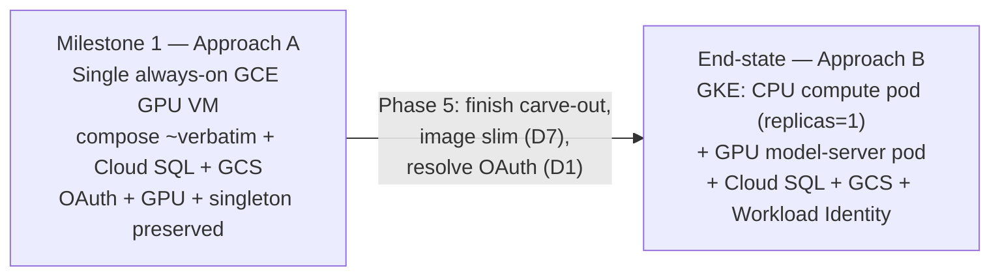

- **Milestone 1 — GCE VM (Approach A):** stand up one always-on GCE GPU VM running today's `docker-compose` stack almost verbatim, with PostgreSQL → Cloud SQL and local LanceDB → `gs://` via the existing config flip, on a dedicated project (D3) in `us-central1`, reaching the on-prem vLLM farm over Cloud VPN (D5) — the fastest working GCP deployment that preserves the Max-plan OAuth path and GPU/singleton behavior intact.
- **End-state — GKE (Approach B):** migrate into a managed GKE split — a CPU-only `lupin-rest` compute pod (`replicas=1`) plus a GPU model-server pod, with Cloud SQL + GCS via Workload Identity, Secret Manager, an HTTPS LB with WebSocket session affinity, and a `cloudbuild.yaml` + Artifact Registry pipeline — reached in Phase 5 only after the model-server carve-out is finished, the image is slimmed (D7), and an OAuth resolution (D1) is chosen.

---

## 2. Target Architecture — Milestone 1 (GCE GPU VM)

Milestone 1 is the lowest-risk path to a *running* Lupin on GCP: **one always-on GCE GPU VM running today's `docker-compose` stack almost verbatim**, with three surgical swaps — postgres-in-docker → **Cloud SQL PostgreSQL 16**, local LanceDB → **GCS** (`storage_backend=gcs`), and dev-key files → **Secret Manager**. The VM's persistent filesystem is what makes this approach uniquely viable: it is the only topology that preserves the host-mounted `~/.claude/.credentials.json` Max-plan OAuth token (survey §4.1, §10 Approach A) while keeping the GPU and singleton job engine "just working."

🧩 **STRAW-MAN (D2)**: Milestone 1 = single GCE GPU VM (Approach A). The documented end-state is the GKE CPU-pod + GPU-pod split (Approach B), reached in Phase 5.
↩ **Flip if:** Rick wants the managed Kubernetes end-state built first — then this whole section is replaced by the Approach B topology and the model-server carve-out (survey §8) becomes a Milestone-1 prerequisite rather than a Phase-5 epic.

### 2.1 The VM — role and sizing

A single GCE instance is the entire compute and GPU surface for Milestone 1. It runs the Docker Engine + NVIDIA Container Toolkit and hosts the existing compose stack as long-lived containers under `restart: unless-stopped` (already set on every service, `docker-compose.yml:8/55/124/202`).

| Property | Milestone-1 value | Source / rationale |
|---|---|---|
| Machine type | 🧩 **STRAW-MAN** `g2-standard-8` (8 vCPU / 32 GB) + 1× NVIDIA **L4** (24 GB) | g2 family ships the L4 the survey names for the ~2.9 GB model footprint (survey §5 model-server row, §3); ample headroom |
| Boot disk | 🧩 **STRAW-MAN** 250 GB pd-ssd | Must hold the 31.7 GB app image + 20.1 GB model-server image + Docker layer cache + room for LanceDB local warm copies (survey §3) |
| GPU driver | 🧩 **STRAW-MAN** NVIDIA ≥ 535 (validated floor — see §1.4; cu124 requires ≥ 525, Dockerfile validated on 535.104.05) | Model-server is CUDA 12.4 / torch 2.6 cu124 (survey §3 model-server row); driver must satisfy it. ↩ **Flip if:** a Phase-0 spike confirms a 525-series driver runs the cu124 model-server clean |
| Zone | 🧩 **STRAW-MAN** `us-central1-a` (D3) | Matches the region the scripts assume (`cloud-run-deploy.sh:49` `REGION="us-central1"`); L4 zonal availability needs confirmation in the credential-gated validation phase (survey §9.3) |
| Availability | Single VM, **no HA** | Singleton architecture forbids a second replica (survey §4.2); this is a deliberate single-point-of-failure for Milestone 1 |

↩ **Flip GPU if:** Whisper/embeddings are moved to managed Google services (see D9 / survey §5) — then the VM becomes CPU-only (`n2-highmem-8` class) and the model-server container is dropped entirely.

### 2.2 What runs on the VM (containers)

The compose stack lands on the VM with the **postgres service removed** (Cloud SQL replaces it) and the test container's necessity reconsidered:

| Container | Milestone-1 disposition | Delta vs today |
|---|---|---|
| `lupin-rest-dev` → **`lupin-rest` (single instance)** | **KEEP** — the one always-on test instance; `reload=False` (it is no longer a dev box) | Today runs `uvicorn --reload`; the test instance drops reload. Still reserves GPU in-process (Whisper + 2 encoders) until the Phase-5 carve-out |
| `lupin-model-server` | **KEEP** — frozen GPU model host on :7998 | Unchanged; `CUDA_VISIBLE_DEVICES=0` pin preserved (`docker-compose.yml:77/95`) |
| `postgres` | **REMOVE** — replaced by Cloud SQL PG16 | The entire `postgres` service (`docker-compose.yml:5-31`) is deleted; `DB_HOST` repoints from `lupin-postgres` to the Cloud SQL unix-socket / proxy (survey §5 PostgreSQL row) |
| `lupin-rest-test` (:8000) | 🧩 **STRAW-MAN: OMIT** from the GCP test-environment VM | The :8000 monopolize-mode test server is a dev-host construct; Milestone-1 (the GCP test environment) carries one instance only |

↩ **Flip test container if:** Rick wants the scheduled `:8000` test harness to run against the GCP instance — then `lupin-rest-test` is re-added as a second container sharing the VM (still no horizontal scaling of the *test* instance, per D6).

**NO postgres container** is the headline container-level delta. Cloud SQL is the managed, backed-up, PITR-capable replacement for the fragile host bind-mount at `docker-compose.yml:20` (`…/lupin-data/postgresql-dev-data`). The app already supports Cloud SQL via unix-socket through `CLOUD_SQL_CONNECTION_NAME`; schema creation is a **manual / pre-deploy migration step** — Alembic does **not** run on startup as currently coded (verified in §7 §3.3; this corrects the survey's "auto-migrate on startup" wording).

🧩 **STRAW-MAN (D4)**: provision a **new** Cloud SQL PostgreSQL 16 instance (`db-custom-2-7680` class for the GCP test environment) and **new** GCS buckets unless Phase-0 credential validation (survey §9.4, §9.5) finds them already present.
↩ **Flip if:** `gcloud sql instances list` / `gcloud storage ls` reveal existing `lupin-*` resources — then reuse-in-place and skip the provisioning step.

🧩 **STRAW-MAN (tier downsizing for test)**: `db-custom-2-7680` was sized against the *production* connection pool (10+20 = 30 conns); the GCP test environment runs the **test pool** (5+10 = 15 conns), which fits a smaller tier — the test instance can likely downsize.
↩ **Flip if:** Phase-0 load profiling on the test instance shows the 15-conn pool plus the Auth Proxy / migration-job / admin headroom needs the larger tier after all → keep `db-custom-2-7680`.

### 2.3 Topology diagram

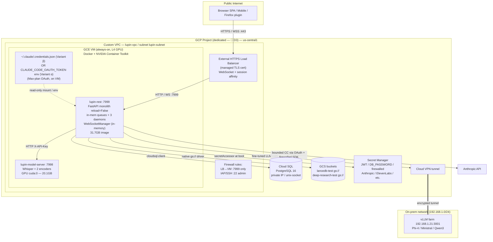

### 2.4 Networking

- **VPC**: 🧩 **STRAW-MAN** a custom-mode VPC `lupin-vpc` with one subnet `lupin-subnet` in `us-central1` (not the default network — least-privilege and clean VPN/firewall scoping). ↩ **Flip if:** the dedicated project (D3) already has an established network convention.
- **Firewall**: deny-by-default; allow (a) LB → VM on the app port only, (b) admin SSH on :22 via **IAP tunneling** (no public SSH), (c) the VPN tunnel range for on-prem reachability. The model-server (:7998) and Cloud SQL are **never** exposed publicly — model-server is reached container-to-container on the Docker bridge `lupin-dev-network` (`docker-compose.yml:303-304`), exactly as today; Cloud SQL is reached via private IP / the Cloud SQL Auth Proxy.
- **Ingress**: 🧩 **STRAW-MAN** an **external HTTPS Load Balancer** with a Google-managed TLS certificate, fronting the VM via an instance-group backend. Rationale: the survey calls for an ingress that "must pass WSS and tolerate the 60 s idle timeout vs 30 s heartbeat" with session affinity (survey §5 Ingress row, §6 cold-start risk). **The Milestone-1 cost model (§10) carries this LB as a line item** — the earlier "reach the VM directly, no LB" note is retired; topology, deploy (§8), and verification (§11) all require a managed HTTPS LB at Milestone 1, so the cost table includes it.
  ↩ **Flip to direct-VM + caddy/managed-TLS if:** Rick wants to minimize GCP managed surface for Milestone 1 — a single VM with a reverse-proxy container terminating TLS (Let's Encrypt / Caddy) reaches the same end-state with no LB cost, at the price of self-managed cert rotation. *(If this flip is taken, drop the LB line from the §10 Milestone-1 table.)*
- **Egress**: the on-prem vLLM hot path and Anthropic API are the two external egress flows; both are billed cross-cloud/internet egress and must be costed in the Day-2 cost table (survey §7.9). The vLLM hot-path **latency budget is unmeasured** and is assigned as a measurement task (R15 / §12 coverage gap) before the VPN is committed as permanent.

### 2.5 WebSocket handling

Lupin's `WebSocketManager` keeps connection / session / subscription state **in-memory** and does user-centric routing across `/ws/queue/{session_id}` and `/ws/audio/{session_id}` (survey §2, §3; project `CLAUDE.md` WebSocket section). With exactly one always-on instance (D6), this is straightforward but has hard ingress requirements:

- **Session affinity is mandatory** — even at replicas=1 the LB must be configured for WebSocket upgrade pass-through and sticky routing so a reconnect lands on the same (only) backend. The single-worker, single-instance pin makes affinity trivially satisfiable but the LB config must still explicitly enable WS upgrade.
- **Idle-timeout vs heartbeat**: the LB backend timeout must exceed the clock-heartbeat cadence. The survey flags the 60 s idle timeout vs 30 s heartbeat tension (survey §5 Ingress row, §6); set the LB backend timeout to **≥ 3600 s** for long-lived WS connections so the heartbeat keeps them warm rather than the LB reaping them.
- **CORS**: the move to a GCP origin forces a CORS allowlist for the Firefox extension origin and base-URL/WSS rework for the mobile + Firefox clients (survey §7.8). This is a client-contract concern, flagged here as a topology dependency: the WSS endpoint URL changes from the on-prem host to the LB's managed domain. The full client-contract ACs live in §8 §5; the **stand-up-time capture AC** is added to §2.7 below so the URL-change contract is not raised then dropped.

### 2.6 DNS

🧩 **STRAW-MAN**: a **Cloud DNS** managed zone with an `A`/`AAAA` record (e.g. `lupin.<rick-domain>`) pointing at the LB's static external IP; the managed TLS cert is provisioned against that hostname.
↩ **Flip if:** Rick prefers to keep DNS at his existing registrar — then we reserve a static IP on the LB and Rick adds the record manually; no Cloud DNS zone is provisioned.

A stable DNS name (not a raw IP) is required because (a) the managed TLS cert binds to a hostname and (b) the mobile/Firefox clients need a durable WSS endpoint that survives VM/LB recreation.

### 2.7 Where the Max-plan credential lives

This is the crux of Approach A and the resolution to the headline OAuth blocker (D1 / survey §4.1). **The straw-man primary is Variant α** (`CLAUDE_CODE_OAUTH_TOKEN` from Secret Manager); Variant β (interactive login → refreshable `~/.claude/.credentials.json` on the VM) is the equal-Max alternative. The full mechanism, the broken-copy bug, and the variant trade-offs are in §3.3.

- **Today**: bind-mounted read-only from the host at `docker-compose.yml:139` (dev) and `:217` (test): `~/.claude/.credentials.json:/home/rruiz/.claude/.credentials.json:ro`. The bounded `ClaudeCodeJob` path (BFE/TFE) — the **zero-per-token Max-plan backbone** (subject to the 2026-06-15 credit ceiling, §3 U1) — authenticates with it.
- **Milestone 1 (Variant α — recommended)**: no `.credentials.json` on the VM at all; the VM startup script fetches `CLAUDE_CODE_OAUTH_TOKEN` from Secret Manager and exports it into the `lupin-rest` container env (the `:ro` bind-mount is dropped). Refresh cadence is annual (re-run `setup-token`).
- **Milestone 1 (Variant β — alternative)**: the file lives on the VM's **persistent filesystem** and the same read-only bind-mount is preserved verbatim; the operator (Rick) logs into Claude Code once interactively on the VM (via the IAP SSH tunnel) and the CLI refreshes the token in place — which avoids the #21765 copied-file refresh bug because the same CLI that minted it owns the refresh loop.

🧩 **STRAW-MAN (D1)**: Variant α (`CLAUDE_CODE_OAUTH_TOKEN` in Secret Manager) on a persistent user-context GCE VM; Variant β as the equal-Max fallback. This is the **only** family of paths that preserves the Max-plan zero-per-token benefit (survey §4.1, §10 Approach A pros), modulo the 2026-06-15 credit ceiling (§3 U1).
↩ **Flip if:** Rick rejects holding a personal-subscription credential on cloud infra — documented fallback (survey §11.1b): migrate the bounded-CC agents (BFE/TFE) to the **billed** Anthropic SDK via `ANTHROPIC_API_KEY_FIREWALLED`. This is a **cost-shift, not a free migration** (project `CLAUDE.md` cost-model section) and changes the secret set the VM pulls from Secret Manager.

> **Security note**: the credential (token or file) is the one secret bound to a human session and cannot be a static service-account-minted secret (survey §4.1). For Variant α it lives in Secret Manager (annual rotation); for Variant β it stays on the VM FS at mode 0600 by design.

### 2.8 External vLLM reachability

🧩 **STRAW-MAN (D5)**: Milestone 1 reaches the on-prem vLLM farm (`192.168.1.21:3001`) via a **Cloud VPN tunnel** from `lupin-vpc` to the on-prem network. This preserves the fine-tuned-model features (Phi-4-14B / Ministral-8B / Qwen3-4B per survey §2) with the least change. The hardcoded private IP must still be refactored to an **injected `VLLM_URL` env var** (survey §5 vLLM row, §6 HIGH risk) so the endpoint is config-driven rather than baked.
↩ **Flip if:** the on-prem farm is being re-homed, OR the measured cross-cloud hot-path latency (R15) is unacceptable — a Vertex AI / GKE GPU-pod re-home is the explicit **Phase-5 epic** (survey §5 vLLM row), out of scope for Milestone 1.

### 2.9 "What changed vs today" — delta list

> Rows 1–11 below are **deltas that embed real choices**, not settled facts. Each carries the 🧩 / ↩ contract inline; the ones that are genuine decisions (omitting `lupin-rest-test`, keeping `/var/lupin` as canonical root, dropping dev bind-mounts) are flagged as such rather than presented as inevitabilities.

| # | Change | From (today) | To (Milestone 1) | Evidence | 🧩 / ↩ |
|---|---|---|---|---|---|
| 1 | **Postgres → Cloud SQL** | `postgres:16.3-alpine` container, host bind-mount | Managed Cloud SQL PG16, unix-socket / proxy | `docker-compose.yml:5-31` removed; `DB_HOST` repointed | 🧩 D4 (provision-new). ↩ reuse if found |
| 2 | **LanceDB → GCS** | local Lance tables via `./src` bind-mount | `storage_backend=gcs`, native `gs://` driver, zero code change | survey §5 LanceDB row, §8 | 🧩 D4. ↩ keep local if buckets absent + Rick prefers VM disk |
| 3 | **Dev keys → Secret Manager** | `src/conf/keys/` (11 files) COPYed into the image | secrets pulled at boot via `secretAccessor`; keys excluded from the test image | `Dockerfile:267` (the D8 gate) | 🧩 D8 HARD GATE. ↩ scope-down if history clean |
| 4 | **`reload=False`** | dev runs `uvicorn --reload` (`docker-compose.yml:120`) | the test instance disables reload | model-server carve-out keeps reload-safety irrelevant here | settled (test instance ≠ dev) |
| 5 | **Singleton pin** | dev/test split, ad-hoc | exactly one always-on `lupin-rest` instance | survey §4.2; mirrors `--min-instances=1 --max-instances=1` (`cloud-run-deploy.sh:138-139`) | 🧩 D6. ↩ if HA required |
| 6 | **vLLM via VPN** | direct LAN to `192.168.1.21:3001` | Cloud VPN tunnel + injected `VLLM_URL` | survey §5 vLLM row | 🧩 D5. ↩ re-home if latency bad |
| 7 | **Ingress + managed TLS** | local port, no TLS | external HTTPS LB (or VM + Caddy) with managed cert + WS affinity | survey §5 Ingress row | 🧩 LB straw-man (§2.4). ↩ Caddy on VM |
| 8 | **OAuth on VM** | host `~/.claude/.credentials.json:ro` | Variant α token in Secret Manager (recommended) OR Variant β file on VM FS | `docker-compose.yml:139/217` | 🧩 D1 Variant α. ↩ Variant β / billed SDK |
| 9 | **Drop dev-only bind-mounts** | `./.git`, `./.claude/worktrees`, `~/.claude/plans`, `/var/external-projects`, multi-repo doc-viewer mounts | omitted in the GCP test environment (dev ergonomics, not needed there) | `docker-compose.yml:132-149/211-231` | 🧩 **STRAW-MAN (a choice)**. ↩ re-add a mount if a test-env feature needs it (e.g. doc-viewer scopes) |
| 10 | **`LUPIN_ROOT` correctness** | image bakes `/var/lupin` (`Dockerfile:243`); the Cloud Run deploy script injects `/app` (`cloud-run-deploy.sh:123,141`) — **a latent path-drift bug** | VM compose keeps `LUPIN_ROOT=/var/lupin`; the bash wrapper that evolves from the cloud-run scripts must be fixed to stop injecting `/app` | survey §6 HIGH risk | 🧩 **STRAW-MAN (a choice)**: keep `/var/lupin` canonical (lower blast radius). ↩ flip canonical to `/app` (§5 Fix 1) |
| 11 | **Project/region de-hardcode** | `cloud-run-deploy.sh:48-49` hardcodes `hello-world-foo-423219` / `us-central1` | parameterized to the dedicated project (D3) | `cloud-run-deploy.sh:48-49` | 🧩 D3. ↩ if sandbox is canonical |

> **What stays the same on purpose**: the Docker bridge network and container-to-container model-server call (`docker-compose.yml:303-304`, REST→:7998 over `X-API-Key`), the GPU pin `CUDA_VISIBLE_DEVICES=0` (`docker-compose.yml:77/95`), the in-process Whisper + embeddings on `lupin-rest` (D9 — kept self-hosted), the 31.7 GB image unslimmed (D7 — a VM tolerates it), and `replicas=1` always-on with no distributed state (D6).

🧩 **STRAW-MAN (D7)**: image slimming **deferred** for Milestone 1 — the GCE VM tolerates the 31.7 GB image. Tier-2 multi-stage + Tier-3 GCS-FUSE model externalization are prerequisites only for the Phase-5 GKE/Cloud-Run move.
↩ **Flip if:** registry push time / Cloud Build OOM (survey §5 build row) makes the unslimmed image impractical even for the VM — then Tier-2 multi-stage is pulled forward into Milestone 1.

🧩 **STRAW-MAN (D9)**: Whisper + embeddings stay self-hosted on the GPU model-server (preserves current behavior + cost). Managed Google Cloud Speech-to-Text + Vertex embeddings are a **GPU-elimination ALTERNATIVE** only, not the Milestone-1 path.
↩ **Flip if:** the L4 GPU monthly cost (survey §7.2 cost gap) outweighs the per-call managed-service cost at Lupin's actual STT/embedding volume.

### 2.10 Acceptance criteria (Milestone-1 topology stand-up)

Any **new** code this topology introduces — the VM provisioning Terraform, the evolved bash deploy wrapper, and the deep readiness probe — is subject to Lupin's 100% line+branch+function coverage hard gate (project `CLAUDE.md` §100% COVERAGE MANDATE).

- [ ] [LUPIN] GCE VM provisioned via **Terraform** (IaC straw-man) with L4 GPU, NVIDIA Container Toolkit (driver ≥ 535), Docker Engine; `terraform plan` is idempotent (re-apply yields no diff).
- [ ] [LUPIN] Custom VPC + subnet + deny-by-default firewall; only LB→:7999 and IAP→:22 ingress paths open; model-server :7998 and Cloud SQL unreachable from the public internet (verified by a connectivity probe).
- [ ] [LUPIN] Cloud VPN tunnel established; the VM can reach `192.168.1.21:3001` (vLLM health check passes from inside the `lupin-rest` container) **and** `VLLM_URL` is injected, not hardcoded.
- [ ] [LUPIN] `lupin-rest` + `lupin-model-server` containers run under `restart: unless-stopped`; REST→model-server `X-API-Key` inference call succeeds on the Docker bridge.
- [ ] [LUPIN] **NO postgres container** runs on the VM; `lupin-rest` connects to Cloud SQL PG16 via unix-socket/proxy. Schema is created by the **pre-deploy migration step** (§7 §3.3), NOT auto-on-startup; `alembic current` == head is verified before traffic.
- [ ] [LUPIN] `storage_backend=gcs` flipped; LanceDB connects to `gs://lupin-lancedb-test` with zero code change (and the LanceDB GCS integration query failures from survey §6 are greened **before** GA — tracked as a Phase-3 dependency, not this AC).
- [ ] [LUPIN] Max-plan credential present on the VM (Variant α env or Variant β file); a bounded `ClaudeCodeJob` (e.g. a trivial BFE no-op) authenticates via OAuth and the Anthropic console credit balance does **not** move (re-confirming the zero-per-token property pre-2026-06-15, survey §4.1 / cost-model empirical confirmation; note the 2026-06-15 credit ceiling, §3 U1).
- [ ] [LUPIN] `LUPIN_ROOT=/var/lupin` everywhere; a **startup assertion** that `LUPIN_ROOT/src/conf/lupin-app.ini` exists fires before serving (closes the path-drift bug, survey §6) — assertion is unit-tested for both the present-file (pass) and missing-file (raise) branches.
- [ ] [LUPIN] External HTTPS LB (or VM+Caddy, per the flipped ingress decision) serves the SPA over HTTPS with a valid managed cert; a WSS connection to `/ws/queue/{session_id}` upgrades, authenticates, and survives ≥ 2 heartbeat cycles without LB reaping.
- [ ] [LUPIN] DNS `A` record resolves the chosen hostname to the LB/VM static IP; the managed cert validates against that hostname.
- [ ] [LUPIN] **Client-contract capture (stand-up time, not deferred):** the new WSS endpoint URL and the client base-URL contract are recorded at stand-up so the §8 §5 client-handoff work has a concrete origin to target; the Firefox/mobile CORS+WSS rework ACs are owned by §8 §5 but the *URL value* is captured here.
- [ ] [LUPIN] **D8 HARD GATE satisfied** (cross-reference the secret-hygiene section): `src/conf/keys/` (11 files) is excluded from the test image (`Dockerfile:267` reversed for the GCP test environment), and no image is pushed to a remote registry until the git-history scrub + key rotation is complete and Rick has explicitly authorized the history rewrite.
- [ ] [LUPIN] Deep readiness probe asserts the sweeper/consumer/clock daemon threads are alive (survey §7.1) — a shallow `/health` 200 with dead daemons must fail the probe; both alive (pass) and dead-daemon (fail) branches covered.

🧩 **STRAW-MAN (IaC tooling)**: Terraform for declarative, idempotent, reviewable provisioning of the VM / VPC / firewall / Cloud SQL / GCS / Secret Manager / VPN; thin bash wrappers evolving the four existing `cloud-run-*.sh` scripts for build/deploy.
↩ **Flip if:** Rick prefers `gcloud`-scripted imperative provisioning or Deployment Manager — then the provisioning ACs above are restated against that tool, but the resource set is unchanged.

---

## 3. OAuth Resolution Deep-Dive (the headline blocker)

This is the deepest blocker in the survey (§4.1, "the headline"). Bounded `ClaudeCodeJob` — BFE and TFE — is the **zero-per-token Max-plan backbone**, and it authenticates today through a mechanism that *structurally cannot exist* in a headless GCP container without deliberate work. This section traces exactly how the auth flows today, then lays out a straw-man resolution, a documented fallback, a decision matrix, and the residual unknowns Rick must confirm.

> **⏰ Time-bomb discovered during research — read this first.** Anthropic's authentication docs now carry a dated note: *"Starting June 15, 2026, Agent SDK and `claude -p` usage on subscription plans will draw from a new monthly Agent SDK credit, separate from your interactive usage limits."* Per the linked support article, the Max 20x credit is **$200/month**, it **drains first**, and once exhausted *"Agent SDK requests stop until your credit refreshes"* (unless usage credits are explicitly enabled, in which case overflow bills at standard API rates). **This materially erodes the "zero per-token" premise of the entire bounded-CC cost model after 2026-06-15** — for *both* the straw-man VM and the fallback. It is not a GCP problem; it lands on the on-prem dev host too. Flagged as residual unknown U1 below, propagated into D1 (§1), R1 (§12), and the cost model (§10). (Source: [code.claude.com/docs/en/authentication](https://code.claude.com/docs/en/authentication) → "Generate a long-lived token" note; [support.claude.com article 15036540](https://support.claude.com/en/articles/15036540-use-the-claude-agent-sdk-with-your-claude-plan).)

---

### 3.1 How authentication works **today** (verified against the codebase)

**Two distinct LLM-cost paths coexist** (confirmed by grep across `src/cosa/agents/`):

| Path | Who uses it | Auth mechanism | Billing |
|---|---|---|---|
| **Bounded `ClaudeCodeJob`** | BFE (`src/cosa/agents/bug_fix_expediter/orchestrator.py`), TFE (`src/cosa/agents/test_fix_expediter/orchestrator.py`), `swe_team/` | claude-agent-sdk → spawns the `claude` CLI → reads Max-plan **OAuth** from `~/.claude/.credentials.json` | **Max-plan covered — zero per-token** (empirically confirmed: CLAUDE.md COST MODEL, `src/scripts/probe_cc_bounded_billing.py:209`) — *subject to the 2026-06-15 credit ceiling (U1)* |
| **Direct Anthropic SDK** | deep_research, podcast_generator, presentation_generator, notification_proxy LLM fallback | `AsyncAnthropic( api_key=… )` keyed on **`ANTHROPIC_API_KEY_FIREWALLED`** | **Billed per token** against the firewalled Anthropic account |

**The bounded-CC SDK call chain.** All three orchestrators import the SDK identically — `from claude_agent_sdk import ClaudeAgentOptions, ClaudeSDKClient, query as sdk_query` (`bug_fix_expediter/orchestrator.py:55-62`, `test_fix_expediter/orchestrator.py:68-74`, `swe_team/orchestrator.py:50-57`). The `ClaudeAgentOptions` built for each agent role (e.g. `bug_fix_expediter/orchestrator.py:465-474`, `test_fix_expediter/orchestrator.py:525-534`) set `model`, `system_prompt`, `tools`, `cwd=cu.get_project_root()`, `permission_mode`, `max_turns`, `max_budget_usd`, `effort` — but **notably set no `pathToClaudeCodeExecutable` and no auth/env override**. The SDK therefore spawns the `claude` CLI installed at `/home/rruiz/.local/bin` (Dockerfile:238, `curl -fsSL https://claude.ai/install.sh | bash`), and that CLI resolves credentials through its own precedence chain (§3.2).

**The firewalled-key boundary is intentional defense-in-depth.** `get_anthropic_api_key()` at `src/cosa/agents/utils/proxy_agents/base_config.py:88-117` reads **`ANTHROPIC_API_KEY_FIREWALLED`** (env first, then file `src/conf/keys/anthropic-api-key-firewalled`) — deliberately *not* the bare `ANTHROPIC_API_KEY`. Verbatim warning at `src/cosa/agents/deep_research/__init__.py:27`: *"NEVER use ANTHROPIC_API_KEY - that is reserved for Claude Code CLI."* This naming choice is load-bearing: it guarantees the billed SDK path and the OAuth CLI path never collide on the same env var. **This matters acutely for GCP** because, per the precedence chain (§3.2), if a bare `ANTHROPIC_API_KEY` ever leaks into the container env, it would *silently override* the Max-plan subscription and start billing the console.

**Where the OAuth token enters the container — the bind-mount.** Verified at `docker-compose.yml:139` (dev) and `:217` (test):

```yaml
- ~/.claude/.credentials.json:/home/rruiz/.claude/.credentials.json:ro
```

The host's interactively-authenticated Max-plan OAuth file is mounted **read-only** into both compute containers. The preflight check at `src/scripts/preflight-test-container.sh:108` asserts its presence (`test -f /home/rruiz/.claude/.credentials.json`) and, on failure, prints the remedy *"docker rm -f … && docker compose up -d"* — i.e. only a full recreate re-reads the mount.

**The supporting config is already image-baked** (so it does *not* need solving): `settings.json` (`hasCompletedOnboarding:true`, `autoUpdaterStatus:disabled`) → Dockerfile:279; `mcp.json` → Dockerfile:280 (as `.mcp.json`); `ENV HOME=/home/rruiz` → Dockerfile:39. The container runs as `USER rruiz` (uid 1001, Dockerfile:75/169) so file ownership round-trips. **The ONLY host-session-bound, non-bakeable artifact is `.credentials.json` itself.**

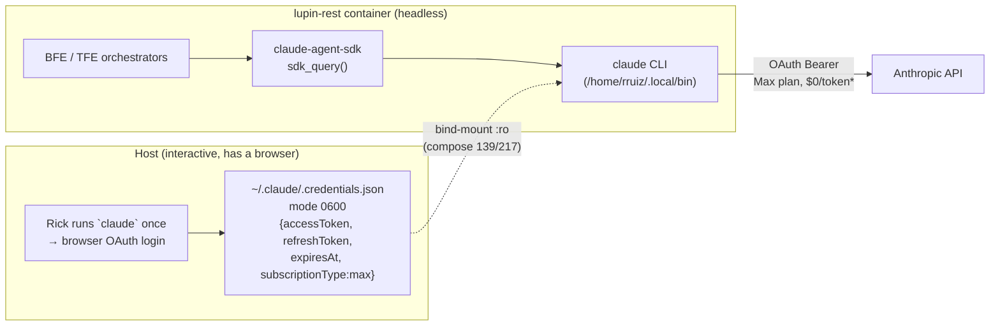

\* *pre-2026-06-15; thereafter draws from the $200/mo Agent-SDK credit (U1).*

**Why this breaks headless on GCP** (the survey's §4.1): a GCP container has no host with a browser to run the one-time `claude` login, no host filesystem to bind-mount from, and a GCP service account *cannot mint* a claude.ai subscription OAuth token. The token is **human-session-bound**. Worse — and this is the subtle part the survey didn't have — even if you *copy* the file into the image/instance, the refresh path is broken on headless machines (§3.2.3).

---

### 3.2 What the authentication research established (citable — but verify on the VM, NOT assume)

> 🧩 **STRAW-MAN (the five facts below are research-derived premises, not VM-verified truth).** They drive the whole resolution, but U4 explicitly requires that the SDK-transport behavior *"must be empirically verified on the VM, not assumed."* Treat §3.2.1–3.2.5 as the best-available premises pending the Phase-0 spike.
> ↩ **Flip if:** the Phase-0 spike (U4 in §3.6) contradicts any of them — e.g. the in-use claude-agent-sdk version spawns the CLI in a mode that ignores `CLAUDE_CODE_OAUTH_TOKEN`, or the precedence order differs in practice — then the resolution is re-derived from the spike's observed behavior.

Five facts from Anthropic's own docs reshape the resolution space versus the survey's three-way framing:

**3.2.1 — `claude -p` (non-interactive / headless) DOES honor `ANTHROPIC_API_KEY`.** The docs are explicit: *"In non-interactive mode (`-p`), the key is always used when present."* Interactive mode ignores it and forces browser login — but the SDK and bounded jobs are non-interactive, so an API key WOULD authenticate them headless. (This is the fallback's foundation — but it bills the console.)

**3.2.2 — There is a FOURTH option the survey didn't list: `CLAUDE_CODE_OAUTH_TOKEN`.** Generated by `claude setup-token`, it is a **1-year long-lived OAuth token** (format `sk-ant-oat01-…`), *"used for CI pipelines and scripts where browser login isn't available,"* and it *"authenticates with your Claude subscription and requires a Pro, Max, Team, or Enterprise plan."* **This preserves Max-plan billing AND is purpose-built for headless** — strictly better than copying `.credentials.json`. Caveats: it is *"scoped to inference only"* (fine for BFE/TFE), it *"does not save the token anywhere"* (you `export` it yourself, ideally via Secret Manager), and **`--bare` mode does NOT read it** (the orchestrators don't use `--bare`, so this is OK — verify in Phase 0).

**3.2.3 — Copying `.credentials.json` to a headless machine has a known broken-refresh bug.** GitHub issue [#21765](https://github.com/anthropics/claude-code/issues/21765), *closed as "not planned":* when the file is copied to a remote/headless box, Claude Code *does not* use the embedded `refreshToken` to mint a new `accessToken` — it just 401s on expiry (`"OAuth token has expired"`). The `accessToken` is short-lived (hours); the `refreshToken` is long-lived but the headless refresh logic isn't implemented for copied files. **Implication: the naive "copy the file into the GCE image" approach will work for hours, then die.** The straw-man (§3.3) must rely on either (a) an *interactive login performed on the VM itself* so the CLI owns the refresh loop, or (b) preferably `CLAUDE_CODE_OAUTH_TOKEN`.

**3.2.4 — Credential storage + precedence (verbatim).** On Linux, credentials live in `~/.claude/.credentials.json` at **file mode `0600`**; `CLAUDE_CONFIG_DIR` relocates it. Precedence order when multiple creds are present: (1) cloud-provider Bedrock/Vertex/Foundry → (2) `ANTHROPIC_AUTH_TOKEN` → (3) `ANTHROPIC_API_KEY` → (4) `apiKeyHelper` script → (5) **`CLAUDE_CODE_OAUTH_TOKEN`** → (6) subscription OAuth from `/login`. **Critical interaction with Lupin:** a bare `ANTHROPIC_API_KEY` (rank 3) beats `CLAUDE_CODE_OAUTH_TOKEN` (rank 5) and subscription OAuth (rank 6). If the firewalled SDK path's key is ever exported under the *bare* name in the container, it will silently hijack the bounded-CC path onto billed API access. Lupin's existing `_FIREWALLED` suffix discipline already prevents this — the GCP deployment must preserve it religiously.

**3.2.5 — `apiKeyHelper` (rank 4) is a real escape hatch.** The `apiKeyHelper` setting runs a shell script returning a credential, refreshed after 5 min or on HTTP 401 (`CLAUDE_CODE_API_KEY_HELPER_TTL_MS` to tune). On a VM this could fetch a rotating token from Secret Manager — a clean GCP-native pattern if a token-vending refresh is ever automated.

Sources: [Authentication — Claude Code Docs](https://code.claude.com/docs/en/authentication) · [Use the Agent SDK with your Claude plan (support 15036540)](https://support.claude.com/en/articles/15036540-use-the-claude-agent-sdk-with-your-claude-plan) · [Issue #21765 — headless refresh bug](https://github.com/anthropics/claude-code/issues/21765) · [daveswift.com — OAuth token expiry](https://daveswift.com/claude-oauth-update/).

---

### 3.3 (a) The straw-man — persistent user-context GCE VM 🧩 STRAW-MAN

**Decision D1 adopted:** a persistent **user-context GCE VM** holding a refreshable Max-plan credential. This is the only path that preserves the **zero-per-token** benefit (modulo the 2026-06-15 credit caveat, U1). It pairs naturally with the D2 Milestone-1 topology (Approach A: one always-on GCE GPU VM running docker-compose almost verbatim) — the VM filesystem replaces the dev host's, so the existing `:ro` bind-mount works *unchanged*.

**Refinement over the raw survey option:** prefer **`CLAUDE_CODE_OAUTH_TOKEN`** (§3.2.2, Variant α) as the primary mechanism, with a VM-local interactive `claude` login (Variant β) as the equally-valid alternative. Both preserve Max billing; the token avoids the copied-file refresh bug (§3.2.3) and is Secret-Manager-friendly.

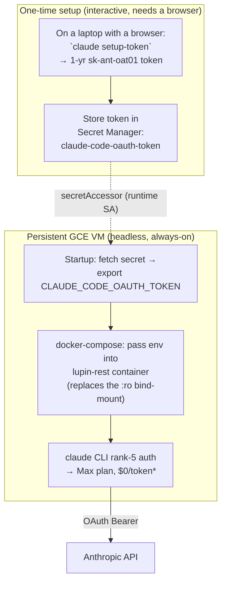

\* *pre-2026-06-15; thereafter draws from the $200/mo Agent-SDK credit (U1).*

**Two viable credential-supply variants on the VM** (Rick picks in Phase 0):

- **Variant α — `CLAUDE_CODE_OAUTH_TOKEN` from Secret Manager (recommended).** Token generated once on Rick's laptop via `claude setup-token`, stored as a Secret Manager secret, fetched at VM/container startup, exported into the container env. Refresh cadence: **annual** (re-run `setup-token`, update the secret). No broken-refresh bug. No `.credentials.json` on the VM at all. **Drop the `:ro` bind-mount entirely** for this variant.
- **Variant β — interactive login on the VM.** Rick SSHes to the VM, runs `claude` once (login URL copy-paste flow, which the docs explicitly support for SSH/containers), the CLI writes `~/.claude/.credentials.json` mode 0600, and the CLI **owns the refresh loop locally** (so the #21765 copied-file bug does not apply — the refresh is performed by the same CLI that minted it). Refresh cadence: automatic background refresh of the short-lived access token; the long-lived refresh token persists across reboots as long as the file persists. Keep today's `:ro` bind-mount semantics, pointing at the VM's own `~/.claude/`.

**Token persistence across reboots:**
- Variant α: trivially durable — the token lives in Secret Manager, re-fetched by the VM startup script on every boot. Survives VM recreate, disk reattach, image rebuild.
- Variant β: the `.credentials.json` must live on the VM's **persistent boot/data disk** (not ephemeral/tmpfs), owned by the VM's `rruiz`-equivalent user at mode 0600. Survives reboot; does **not** survive a from-scratch VM recreate (re-login needed) — a Variant-α advantage.

**File permissions / who-can-read (blast radius):**
- The credential (token or file) grants **full Max-plan inference as Rick's personal subscription**. Anyone who can read it can spend Rick's plan and, post-2026-06-15, drain his $200 Agent-SDK credit.
- Mandated controls: Secret Manager secret with `secretAccessor` granted ONLY to the VM's dedicated runtime service account (least-privilege, per survey §7.3); file mode `0600` for Variant β; **never** bake the token into the image; **never** export it under the bare `ANTHROPIC_API_KEY` name (precedence hijack, §3.2.4); VM access restricted by IAM + OS Login + firewall (no public SSH).
- Residual blast radius **is inherently larger than a service-account key** because it is a *personal-subscription* credential, not a scoped GCP SA. A VM compromise = Rick's Claude subscription compromised until he runs `/logout` or rotates the `setup-token`. This is the security cost of preserving zero-per-token, and Rick must accept it explicitly (U3).

**Acceptance criteria (straw-man):**
- [ ] [LUPIN] Phase 0 spike: on a throwaway GCE VM, `claude setup-token` → export `CLAUDE_CODE_OAUTH_TOKEN` → confirm a bounded BFE/TFE job authenticates as **Max** (not "Claude API") via `claude /status` parity check, and runs to completion headless.
- [ ] [LUPIN] Confirm the claude-agent-sdk transport (no `pathToClaudeCodeExecutable` pin) honors `CLAUDE_CODE_OAUTH_TOKEN` when the orchestrators spawn the CLI; confirm none of the BFE/TFE/swe_team paths pass `--bare` (which ignores the token — §3.2.2).
- [ ] [LUPIN] Verify NO bare `ANTHROPIC_API_KEY` exists in the container env (only `ANTHROPIC_API_KEY_FIREWALLED`) — assert at startup, fail loud (precedence-hijack guard, §3.2.4).
- [ ] [LUPIN] Variant α: secret `claude-code-oauth-token` created; runtime SA has `secretmanager.secretAccessor` and nothing broader; VM startup script fetches + exports it; **bind-mount removed** from the GCP compose profile.
- [ ] [LUPIN] Variant β (if chosen): `.credentials.json` on persistent disk, mode 0600, owned by the runtime user; survives a reboot test; bind-mount path repointed to VM-local `~/.claude/`.
- [ ] [LUPIN] Reboot-durability test: power-cycle the VM, confirm a bounded job still authenticates with no human intervention.
- [ ] [LUPIN] Calendar a token-expiry reminder (annual for α; monitor 401s for β) and document the re-auth runbook (the §8 §2 alert framework carries the 401-monitoring alert — U5).
- [ ] [LUPIN] New code (VM startup script, startup-assertion probe, any token-fetch helper) ships with **100% line+branch+function coverage** (Lupin hard gate) — unit-test the assertion logic and the "missing-token → fail-loud" branch.

**↩ Flip if:** Rick rejects holding a personal-subscription credential on cloud infra (security policy), OR the 2026-06-15 Agent-SDK credit (U1) makes bounded-CC volume bill anyway (then the zero-cost rationale collapses and the fallback becomes equal-cost but more managed), OR BFE/TFE are deemed out-of-scope for the first cut (survey §11.1 option c — exclude bounded-CC, defer the whole problem; see the §12 coverage note on what Lupin looks like with bounded-CC disabled).

---

### 3.4 (b) The documented fallback — migrate BFE/TFE to the billed Anthropic SDK

If Rick declines to hold a Max credential on GCP, the fallback is to **cost-shift** BFE/TFE off bounded-CC and onto the already-existing billed path: `AsyncAnthropic( api_key=get_anthropic_api_key() )` keyed on `ANTHROPIC_API_KEY_FIREWALLED` (`base_config.py:88-117`). The plumbing already exists for deep_research/podcast/presentation, so the pattern is proven in-tree.

**What the migration actually entails** (non-trivial — the survey under-states this): BFE/TFE are *not* single-prompt agents. They are multi-agent, multi-turn orchestrators (Lead/Coder/Tester roles, `permission_mode`, `max_turns`, tool grants like `Read/Glob/Grep/Bash`, `cwd`-scoped filesystem edits) built directly on the claude-agent-sdk's CLI-spawning model. The raw Anthropic SDK gives you message completion, **not** the agentic tool-loop (file edits, bash, git, the `can_use_tool` permission callback in `swe_team/hooks.py`). A faithful migration either (i) reimplements the tool-execution loop on top of `AsyncAnthropic` (large effort), or (ii) keeps the claude-agent-sdk transport but points it at API-key auth — which the SDK supports because `claude -p` honors `ANTHROPIC_API_KEY` (§3.2.1). **Option (ii) is far cheaper and is the realistic fallback**: same orchestrators, same `ClaudeAgentOptions`, just a different credential source (the firewalled key, exported as the SDK-honored key) — at the cost of every bounded turn now billing the console.

**Cost-shift, quantified qualitatively** (no live token counts measured — U2):
- BFE/TFE are **bursty, deep, multi-turn** agents (forensic diagnosis + multi-file coding + test loops). Each invocation is many turns of large-context reasoning — i.e. *exactly* the high-token-per-run profile that bounded-CC was adopted to make free.
- Moving them to the firewalled SDK converts **$0/run** into **metered Opus/Sonnet spend per run**, billed to the firewalled Anthropic account. The empirical probe (CLAUDE.md COST MODEL) measured a 10-job bounded-CC sample reporting **$2.05 of telemetry cost** that moved the console balance **$0.00** — under the fallback that same workload would bill ~$2 of real money. Annualized across BFE/TFE's regular bug-fix + test-fix cadence, this is a **recurring operational line item**, not a rounding error.
- **Framing discipline (per CLAUDE.md):** describe this as a *cost-shift from already-paid fixed cost to metered spend*, never as "free." And note the inversion post-2026-06-15: if the Agent-SDK credit (U1) is exhausted anyway, the "free" advantage of the straw-man partially evaporates, narrowing the gap to the fallback.

**Acceptance criteria (fallback):**
- [ ] [LUPIN] Decide migration option (i) full reimplement vs (ii) repoint SDK transport to `ANTHROPIC_API_KEY` — straw-man recommends (ii).
- [ ] [LUPIN] If (ii): export the firewalled key value as the SDK-honored credential **for the bounded jobs' subprocess env only** (scoped, not container-global) so it does NOT pollute the precedence chain for any other path; confirm BFE/TFE authenticate and run headless on GCP with no OAuth at all.
- [ ] [LUPIN] Wire firewalled key into Secret Manager (survey §5 Secrets row); runtime SA `secretAccessor`; never the bare `ANTHROPIC_API_KEY` name at container scope.
- [ ] [LUPIN] Add per-run cost telemetry/logging for BFE/TFE so the new metered spend is observable (ties to survey §7.2 cost-estimation gap).
- [ ] [LUPIN] Update CLAUDE.md COST-MODEL candidate list + auto-memory `feedback_prefer_bounded_cc_over_anthropic_sdk.md` to record BFE/TFE moved OFF bounded-CC.
- [ ] [LUPIN] New code (auth-source switch, scoped-env injection, cost logger) at **100% line+branch+function coverage**.

**↩ Flip if:** the straw-man VM is approved (then the fallback is unnecessary and BFE/TFE stay zero-cost pre-2026-06-15), OR a faithful tool-loop migration to raw `AsyncAnthropic` proves too costly to maintain (then keep the claude-agent-sdk transport and only swap the credential — option ii).

---

### 3.5 (c) Decision matrix

Scored across the four axes the task names — *preserves-Max-plan*, *managed-ness*, *security*, *effort* — plus the headless-viability gate.

| Option | Preserves Max ($0/token)* | Managed-ness | Security (blast radius) | Effort | Headless-viable? |
|---|:--:|:--:|:--:|:--:|:--:|
| **α — `CLAUDE_CODE_OAUTH_TOKEN` on GCE VM (Secret Mgr)** 🧩 STRAW-MAN primary | ✅ Yes | 🟡 Self-managed VM | 🟠 Personal-sub credential in Secret Mgr; annual rotation; no copied-file bug | 🟢 Low (no orchestrator change) | ✅ Yes (purpose-built) |
| **β — interactive `claude` login on GCE VM** (survey's raw D1) | ✅ Yes | 🟡 Self-managed VM | 🟠 `.credentials.json` 0600 on persistent disk; CLI owns refresh | 🟢 Low (bind-mount unchanged) | ✅ Yes (CLI refreshes locally) |
| **Copy `.credentials.json` into image/VM** (naive) | ✅ briefly | 🟡 | 🔴 token baked = worst | 🟢 trivial | ❌ **No — #21765 refresh bug, dies in hours** |
| **(b) Fallback — firewalled Anthropic SDK** | ❌ No — metered spend | 🟢 No OAuth to babysit | 🟢 Scoped API key, easy rotation, no personal sub exposed | 🟠 Med (transport repoint) to 🔴 High (full reimplement) | ✅ Yes (`-p` honors API key) |
| **(c) Exclude bounded-CC from first cut** (survey option c) | n/a — feature off | 🟢 | 🟢 nothing to hold | 🟢 zero | ✅ trivially (BFE/TFE just don't run) |
| **`apiKeyHelper` → Secret Mgr token vendor** (advanced) | ✅ if vending an OAuth token | 🟢 GCP-native rotation | 🟡 depends on vended cred | 🔴 High (build vendor + refresh) | ✅ Yes (rank-4) |

\* *All "Preserves Max" ✅ rows are subject to the 2026-06-15 Agent-SDK credit ceiling (U1) — "zero per-token" becomes "zero until the monthly $200 Max-20x credit drains."*

**Straw-man recommendation:** **Variant α** (`CLAUDE_CODE_OAUTH_TOKEN` from Secret Manager) as primary, **Variant β** as the equally-Max-preserving fallback if `setup-token` proves fussy, the **firewalled-SDK fallback (b-option-ii)** as the managed-but-billed escape hatch, and **(c) exclude** as the de-risking option if the first cut should ship before this is solved. Rationale: α preserves zero-cost, needs zero orchestrator code change, sidesteps the copied-file refresh bug, and is the only Max-preserving option that's also Secret-Manager-native and reboot-durable.

---

### 3.6 Residual unknowns Rick must confirm (gating Phase 0)

These define decision work that **gates Phase 0**. Each carries an acceptance-criteria checkbox binding it to a Phase-0 task — U1 and U2 are decisive and must be answered before committing to D1.

- [ ] [LUPIN] **U1 — 🔴 The 2026-06-15 Agent-SDK credit change (DECISIVE — answer before committing D1).** Determine whether Rick's Max-20x $200/month Agent-SDK credit comfortably covers BFE/TFE volume, or whether bounded jobs will start hitting "requests stop until credit refreshes" (or overflow-bill if usage-credits enabled). **AC:** answer recorded in the Phase-0 findings record with the measured monthly headroom (depends on U2); the answer is consumed by the D1 gate and the §10 cost model. This affects on-prem dev too, not just GCP.
- [ ] [LUPIN] **U2 — Measure actual BFE/TFE token volume.** **AC:** a representative bug-fix + test-fix cycle is run, SDK `cost_usd` telemetry is read, and a monthly-volume estimate is recorded — feeding both the U1 credit-headroom answer and the fallback's real dollar cost (§10 budget-alert AC).
- [ ] [LUPIN] **U3 — Security acceptance.** **AC:** Rick records whether he is comfortable holding a *personal Claude subscription* credential (token or refresh-token file) on a cloud VM, with the blast radius being his own subscription (vs. the firewalled SDK's scoped, rotatable API key). A "no" here flips D1 to the fallback.
- [ ] [LUPIN] **U4 — `--bare` and SDK transport confirmation.** **AC:** the Phase-0 spike confirms the in-use claude-agent-sdk version spawns the CLI in a mode that reads `CLAUDE_CODE_OAUTH_TOKEN` (i.e. not `--bare`) — empirically on the VM, not assumed (this is what makes the §3.2 facts load-bearing-but-unverified).
- [ ] [LUPIN] **U5 — Rotation operations.** **AC:** the runbook names who runs the annual `setup-token` (α) / re-login (β), where it lives, the calendar reminder, and the **401-monitoring alert** that catches a silently-expired token before it stalls the queue. The 401 alert is provisioned as Day-2 observability via the §8 §2 alert-policy framework (closes the U5 coverage gap).
- [ ] [LUPIN] **U6 — `apiKeyHelper` future.** **AC:** a decision is recorded on whether the GCP-native `apiKeyHelper`-vends-from-Secret-Manager pattern (rank 4, auto-refresh on 401) is worth building as the long-term end-state when the workload moves A→B (GKE). Deferred by default, but flagged so it isn't re-discovered later.

---

## 4. Phase 0 — Decisions & Credential-Gated Validation

Phase 0 is a **hard gate**: nothing downstream (no provisioning, no `cloudbuild.yaml`, no image push) starts until (1) the three blocking Ledger items are answered and (2) the credential-gated validation sequence below runs clean against the *real* GCP environment. The survey is 100% codebase-derived and needed no credentials (`§1`, `§9`); Phase 0 is where Rick's credentials first touch live infrastructure to confirm or refute every straw-man default.

The gate has three parts: a **decision gate** (Ledger items that must be answered before Phase 1 can start), a **runnable validation checklist** (each `gcloud`/`gsutil` command paired with what it confirms and the go/no-go it gates), and the **Phase 0 acceptance criteria**.

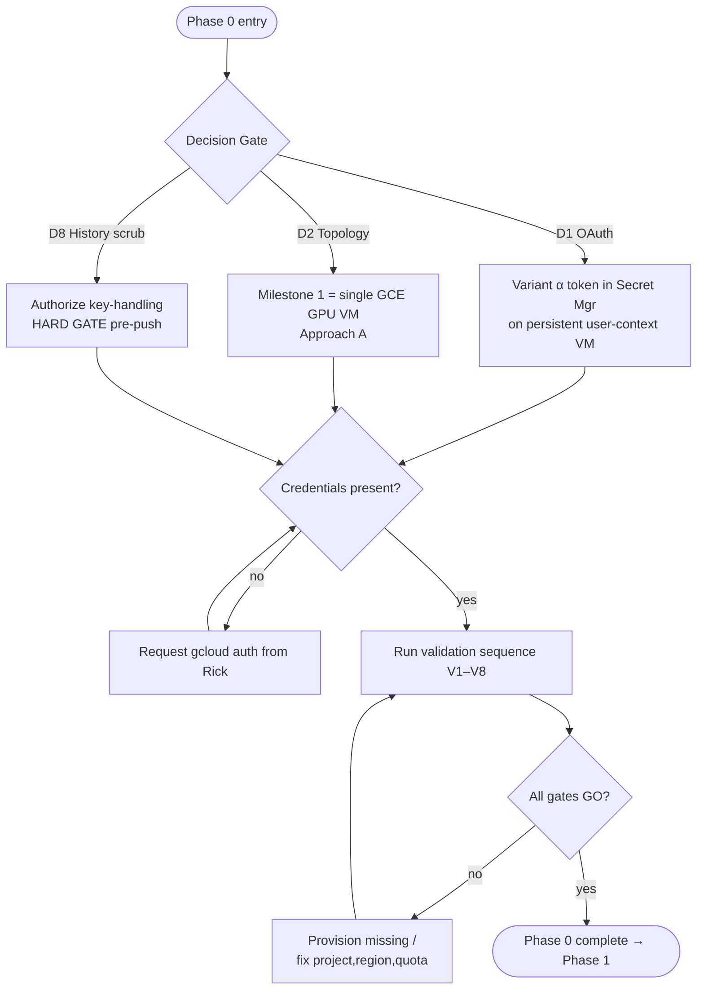

---

### 4.1 The Decision Gate — Ledger items that must be answered first

These three Ledger items (a subset of survey `§11`) **block Phase 1 from starting**. Each is shown with its straw-man default, the consequence of the default, and the explicit flip condition. The remaining `§11` questions (D3–D7, D9) are *informed by* the validation sequence in Part 2 and are resolved during it — they do not block Phase 1 entry the way these three do.

#### D1 — The OAuth blocker (decide first) 🔴

> **🧩 STRAW-MAN default**: A **persistent user-context GCE VM** holding a refreshable Max-plan credential — **Variant α** (`CLAUDE_CODE_OAUTH_TOKEN` in Secret Manager) as the recommended primary, **Variant β** (interactive on-VM login → refreshable `~/.claude/.credentials.json`) as the equal-Max alternative (full mechanism in §3.3). This is the *only* family of paths that preserves the Max-plan zero-per-token benefit for bounded `ClaudeCodeJob` (BFE/TFE) — modulo the 2026-06-15 credit ceiling (§3 U1).

- **Evidence**: `docker-compose.yml:139` and `:217` bind-mount `~/.claude/.credentials.json:/home/rruiz/.claude/.credentials.json:ro` into both `lupin-rest-dev` and `lupin-rest-test`. These tokens are human-session-bound and interactively refreshed — they cannot be baked into an image nor minted by a GCP service account (survey `§4.1`). The naive copy-the-file path is broken by #21765 (§3.2.3) — hence Variant α is the recommended mechanism, not the file copy.
- **Why it must be decided first**: D1 *determines D2*. A persistent OAuth credential requires a persistent host context → that forces Approach A (GCE VM) for Milestone 1. A managed Cloud Run sandbox is the worst possible home for a persistent OAuth token (survey `§10` Approach C cons).
- **↩ Flip if**: Rick decides the bounded-CC cost saving is not worth a hand-managed VM → fall back to the **billed Anthropic SDK** via `ANTHROPIC_API_KEY_FIREWALLED` (key file present at `src/conf/keys/anthropic-api-key-firewalled`, 108 bytes). This is a **cost shift, not zero-cost** — it converts the Max-plan-covered BFE/TFE path into per-token metered spend. A second flip target: **exclude bounded-CC entirely** from the first cut. Either flip removes the VM-persistence requirement and re-opens GKE/Cloud-Run for Milestone 1.
- **Gates**: D2 topology, the entire IaC tooling choice, and whether Phase 0 validation must confirm GCE GPU quota (D1=VM) versus GKE GPU node-pool quota (D1=flip).

#### D2 — Target topology 🔴

> **🧩 STRAW-MAN default**: Milestone 1 = a **single always-on GCE GPU VM** running the existing `docker-compose` almost verbatim (Approach A, survey `§10`). The documented end-state = GKE CPU compute pod + GPU model-server pod (Approach B), reached in Phase 5.

- **Evidence**: Approach A "uniquely preserves the Max-plan OAuth path" and is the "fastest path to a running GCP instance" (survey `§10` Approach A pros); the singleton in-memory architecture forbids scale-out regardless of platform (`§4.2`).
- **Why it must be decided first**: it dictates *which* GPU quota Phase 0 validates (GCE accelerator quota vs GKE node-pool quota — see V3 below) and whether `cloudbuild.yaml` is a Phase 0/1 prerequisite (it is NOT for Approach A; it IS for Approach B).
- **↩ Flip if**: Rick wants the managed end-state immediately and accepts the higher engineering lift (finish the model-server carve-out, author `cloudbuild.yaml`, Tier-2/Tier-3 image slim, resolve OAuth separately) → jump straight to Approach B. **Coupling**: a D2→Approach-B flip is incoherent unless D1 is *also* flipped away from the persistent-VM default, because Approach B "does NOT by itself solve OAuth" (`§10` Approach B cons).

#### D8 — Secret-hygiene / history-scrub go-ahead 🟠

> **🧩 STRAW-MAN default (AUTHORIZED-PENDING)**: As a **Phase-1 HARD GATE before any image push to a remote registry** — (a) exclude `src/conf/keys/` from the test image, (b) scrub it from git history, and (c) rotate exposed keys. Requires Rick's explicit go-ahead for the history rewrite.

- **Evidence + a material correction to the survey**: `docker/lupin/Dockerfile:267` does `COPY --chown=rruiz:rruiz src/conf/keys /var/lupin/src/conf/keys` — live keys are baked into image layers. The `src/conf/keys/` directory currently holds **11 live secret files** (`anthropic-api-key-firewalled`, `eleven11`, `gemini`, `google`, `groq`, `huggingface`, `kagi`, `mistral`, `notification-api-claude-code-dev`, `openai` — 10 provider keys — **plus the dev notification key** the setup-secrets script reads; count reconciled in §1.4). **However**: `.gitignore:66-67` excludes `src/conf/keys/**`, and `git log --all --name-only -- src/conf/keys/` returns **zero results** — these files were *never committed to git history*. The survey's "dev keys possibly in git history" (`§6` 🟠 HIGH row) is, for these specific files, a confirmed **no-op**: there is nothing to scrub from history.
  - **What this sharpens**: the *real* residual exposure is the **image layers**, not git. `cloud-run-setup-secrets.sh:17` reads `src/conf/keys/notification-api-claude-code-dev` directly from disk into Secret Manager — that path is fine for the *secret upload*, but the `Dockerfile:267` COPY is the leak vector once an image is pushed to a remote Artifact Registry.
- **Why it must be decided first**: it is a *pre-push* gate. The decision to authorize/skip history rewrite and key rotation must be settled before any Phase-1 work approaches `docker build` + registry push, otherwise the gate can be silently bypassed.
- **↩ Flip if**: a Phase-0 forensic re-scan (V6 below + a `git log -p --all -S` content search, not just path search) finds that key *material* leaked into history via a different path (e.g. an accidental commit of a config snippet) → the history rewrite becomes mandatory, not optional, and the AUTHORIZED-PENDING status escalates to a blocking requirement. Conversely, if the forensic scan confirms zero historical leakage (as the path-scan already suggests), the D8 scope shrinks to **(a) remove the Dockerfile COPY + (c) rotate keys defensively**, dropping the history-rewrite ceremony entirely — consistent with the "prefer the simplest reversible mechanism" practice.

---

### 4.2 Credential-Gated Validation Checklist (runnable sequence)

This sequence operationalizes survey `§9`. It is **read-only** except where a step is explicitly a `--dry-run` or describe. Run it **in order** — later steps assume the project/region from V1 is correct. Set these once at the top:

```bash
# 🧩 STRAW-MAN (D3): a DEDICATED project, NOT the hardcoded sandbox, in us-central1.
# The project NAME below is an ASSUMED placeholder (D3 is NEEDS-RICK) — it MUST be
# replaced with the V1-confirmed value before any step runs. Do not treat "lupin-test"
# as decided; it is a stand-in until Rick confirms the real project ID.
# ↩ Flip if: V1 confirms hello-world-foo-423219 IS the canonical prod project,
#            OR Rick names separate dev/test/prod projects, OR a non-us-central1 region.
export GCP_PROJECT="<REPLACE-WITH-V1-CONFIRMED-PROJECT>"   # 🧩 ASSUMED placeholder (e.g. lupin-test) — D3 NEEDS-RICK
export GCP_REGION="us-central1"                            # 🧩 STRAW-MAN (D3) — region carries its own flip
export GCP_ZONE="us-central1-a"                            # for GCE VM accelerator quota (D2=Approach A)
```

> **Hardcode hazard to fix in Phase 1, surfaced here**: all four `cloud-run-*.sh` scripts hardcode `PROJECT_ID="hello-world-foo-423219"` (`cloud-run-deploy.sh:48`, `cloud-run-setup-secrets.sh:15`, `cloud-run-validate.sh:19`, and `cloud-run-build.sh`) and `REGION="us-central1"` (`cloud-run-deploy.sh:49`). If V1 confirms a different project, these scripts MUST be parameterized before any of them runs against real infra — this is the D3 flip propagating into Phase 1 work.

#### V1 — Project & region confirmation (gates D3)

```bash
gcloud config get-value project
gcloud config get-value compute/region
gcloud projects describe "$GCP_PROJECT" --format='value(projectId,projectNumber,lifecycleState)'
```
- **Confirms**: the active project/region, that `$GCP_PROJECT` exists and is `ACTIVE`, and yields the `projectNumber` needed for the default compute service-account name (`<PROJECT_NUMBER>-compute@developer.gserviceaccount.com`, used at `cloud-run-deploy.sh:26` and `cloud-run-setup-secrets.sh:69`).
- **Go/No-Go**: **GO** if the project is the intended dedicated project (D3 default) or Rick explicitly confirms the sandbox. **NO-GO** if the active project is still `hello-world-foo-423219` and Rick has *not* confirmed it as canonical → resolve D3 before proceeding. A wrong project here poisons every subsequent step.

#### V2 — Enabled-API inventory (gates "can we provision at all")

```bash
gcloud services list --enabled --project="$GCP_PROJECT" \
  --filter="config.name:( compute.googleapis.com OR container.googleapis.com OR \
    artifactregistry.googleapis.com OR cloudbuild.googleapis.com OR \
    secretmanager.googleapis.com OR sqladmin.googleapis.com OR \
    aiplatform.googleapis.com OR run.googleapis.com )" \
  --format='value(config.name)'
```
- **Confirms**: which of the eight required APIs are already on. For **D2=Approach A** the minimum set is `compute`, `artifactregistry`, `secretmanager`, `sqladmin`. `container` (GKE) and `run` are Phase-5/flip-only; `aiplatform` (Vertex) is a D9-alternative-only.
- **Go/No-Go**: **GO** if the minimum set for the chosen topology is enabled, OR if Rick authorizes `gcloud services enable <missing>` (enabling is cheap + reversible; record which were off). **NO-GO** never blocks here — missing APIs become a Phase-2 provisioning checklist item, *unless* the account lacks `serviceusage.services.enable` permission, which is a hard IAM stop.

#### V3 — GPU quota & availability (gates D1 VM feasibility + D2 topology)

```bash
# D2=Approach A (GCE VM) — accelerator quota in the target zone:
gcloud compute accelerator-types list --filter="zone:( $GCP_ZONE )" \
  --format='table(name,zone)' --project="$GCP_PROJECT"
gcloud compute regions describe "$GCP_REGION" --project="$GCP_PROJECT" \
  --format='value(quotas)' | tr ',' '\n' | grep -iE "NVIDIA_L4_GPUS|NVIDIA_A100|PREEMPTIBLE_NVIDIA"
# ↩ Flip if D2=Approach B (GKE): instead validate GKE GPU node-pool quota:
#   gcloud compute regions describe "$GCP_REGION" --format='value(quotas)' | grep -i GPUS
```
- **Confirms**: an L4 (24 GB, cost-efficient) or A100 (40 GB, concurrency) accelerator is *available in the zone* and the project's `NVIDIA_L4_GPUS`/`NVIDIA_A100_GPUS` quota is `≥ 1`. The model-server needs ~2.9 GB VRAM total (survey `§3`), so L4 is ample for Milestone 1.
- **Go/No-Go**: **NO-GO (hard)** if quota is `0` and a quota-increase request is pending — a GPU is mandatory for the in-process Whisper + 2 encoders (`§4.3`); Milestone 1 cannot run CPU-only until the model-server carve-out is finished (Phase 5). **GO** if quota `≥ 1` for the chosen accelerator in `$GCP_ZONE`. If quota is `0`, file the increase request now (it has lead time) and mark Phase 0 *blocked-on-quota*.

#### V4 — Existing GCS buckets (gates D4 provision-new vs reuse)

```bash
gcloud storage ls --project="$GCP_PROJECT" 2>/dev/null | grep -E "lupin-lancedb|lupin-deep-research" || echo "NONE FOUND"
# For each that exists, confirm region + lifecycle:
for B in lupin-lancedb-prod lupin-lancedb-test lupin-deep-research-prod lupin-deep-research-test; do
  gcloud storage buckets describe "gs://$B" --project="$GCP_PROJECT" \
    --format='value(name,location,lifecycle)' 2>/dev/null || echo "$B: absent"
done
```
- **Confirms**: whether the four buckets the config already references exist. The config bakes in exact URIs — `lupin-app.ini:16` `gs://lupin-lancedb-prod/lupin.lancedb`, `:22` `gs://lupin-deep-research-prod/`, `:500` `gs://lupin-lancedb-test/test-lupin.lancedb`, `:505` `gs://lupin-deep-research-test/`. Bucket *region* must match `$GCP_REGION` to avoid cross-region egress on the LanceDB hot path.
- **Go/No-Go**: **GO** regardless — this is a discovery step. **🧩 STRAW-MAN (D4)**: assume **provision-new** in Phase 2 for any bucket reported `absent`. **↩ Flip if**: buckets already exist in the correct region with acceptable lifecycle → reuse them and skip their creation in Phase 2. A bucket existing in the *wrong* region is a flip-to-recreate (or accept egress cost — Rick's call).

#### V5 — Existing Cloud SQL instance (gates D4)

```bash
gcloud sql instances list --project="$GCP_PROJECT" --format='table(name,databaseVersion,region,settings.tier,state)'
# If one exists, capture the connection name the code needs:
gcloud sql instances describe <INSTANCE> --project="$GCP_PROJECT" \
  --format='value(connectionName,databaseVersion,settings.tier)'
```
- **Confirms**: whether a **PostgreSQL 16** instance exists and its `connectionName`. The code path is already wired: `src/cosa/rest/db/database.py:52` reads `CLOUD_SQL_CONNECTION_NAME`, `:54` reads `DB_PASSWORD`, and `:63` builds `postgresql+psycopg2://{user}:{password}@/{database}?host=/cloudsql/{instance}` (the unix-socket form). `:59` raises if either env var is missing in production — so the `connectionName` captured here becomes a required Phase-2 input.
- **Go/No-Go**: **GO** regardless (discovery). **🧩 STRAW-MAN (D4)**: assume **provision-new** a PostgreSQL 16 instance in Phase 2 (`db-custom-2-7680` for the GCP test environment per `§5` — note it can likely downsize for the test pool, §7.3.4, to avoid the `pool_size=5`+`max_overflow=10`-per-process exhaustion risk in `§6`). **↩ Flip if**: a PG16 instance already exists at an adequate tier in `$GCP_REGION` → reuse it, capture its `connectionName`, skip creation. **NO-GO** the straw-man-default if the only existing instance is PG ≠ 16 or wrong region — that is a recreate, not a reuse.

#### V6 — Existing secrets inventory (informs D8 + Phase 2 secret wiring)

```bash
gcloud secrets list --project="$GCP_PROJECT" --format='table(name,createTime,replication.automatic)'
# Forensic re-scan for D8 (content search, not just path) — confirm no key MATERIAL leaked to git history:
git -C /mnt/DATA01/include/www.deepily.ai/projects/lupin log -p --all -S 'sk-' -- '*.ini' '*.py' '*.sh' | head -40 || true
```
- **Confirms**: which of the JWT/DB/firewalled-Anthropic/ElevenLabs/OpenAI/Groq/Google/Mistral/Kagi/HF/notification keys already live in Secret Manager. Only `lupin-notification-api-key` is referenced by the existing scripts (`cloud-run-setup-secrets.sh:16`, mounted at `cloud-run-deploy.sh:140`); the other **10 local key files** in `src/conf/keys/` (of the **11** total — the eleventh being the already-wired notification key) have **no Secret Manager equivalent yet**. The forensic `git log -S` is the D8 escalation check.
- **Go/No-Go**: **GO** regardless (discovery). The output drives the Phase-2 "secrets to create" list (10 of the 11 keys are missing from Secret Manager). For **D8**: the path-scan already confirmed `src/conf/keys/` was never path-committed; the content `git log -S` above is the belt-and-suspenders confirmation. **↩ Flip D8 to mandatory-history-rewrite if** this content search returns any real key material.

#### V7 — IAM & Workload Identity (gates least-privilege design)

```bash
PROJECT_NUMBER=$(gcloud projects describe "$GCP_PROJECT" --format='value(projectNumber)')
gcloud projects get-iam-policy "$GCP_PROJECT" \
  --flatten="bindings[].members" \
  --filter="bindings.members:${PROJECT_NUMBER}-compute@developer.gserviceaccount.com" \
  --format='table(bindings.role)'
# D2=Approach B only — is Workload Identity enabled on any GKE cluster?
gcloud container clusters list --project="$GCP_PROJECT" \
  --format='value(name,workloadIdentityConfig.workloadPool)' 2>/dev/null || echo "no GKE clusters (expected for Approach A)"
```
- **Confirms**: the roles currently on the default compute SA. The deployment needs (survey `§5`, `§7.3`): `roles/cloudsql.client`, `roles/storage.objectUser` (**not** `objectAdmin` — `objectAdmin` lets the app delete its own LanceDB store, `§7.3`), `roles/secretmanager.secretAccessor`, `roles/artifactregistry.reader`. For Approach B, Workload Identity must be configured; for Approach A (D2 default) the VM uses its attached SA directly.
- **Go/No-Go**: **GO** if the SA can be granted the four runtime roles (or already has them) and a build-vs-runtime SA split is achievable (`§7.3`). **NO-GO (advisory)** if the existing SA carries `objectAdmin` — flag for downgrade to `objectUser` in Phase 2, do not block Phase 0 on it.

#### V8 — Artifact Registry (gates image-push target; supersedes deprecated GCR)

```bash
gcloud artifacts repositories list --project="$GCP_PROJECT" --location="$GCP_REGION" \
  --format='table(name,format,createTime)'
# If a 'lupin' repo exists, list pushed images:
gcloud artifacts docker images list "$GCP_REGION-docker.pkg.dev/$GCP_PROJECT/lupin" 2>/dev/null || echo "no lupin repo / no images"
```
- **Confirms**: whether an Artifact Registry repo for `lupin`/`lupin-model-server` exists and whether any images were pushed. **Note**: the existing scripts target the deprecated **GCR** path — `cloud-run-deploy.sh:97` does `gcloud container images describe gcr.io/$PROJECT_ID/lupin:...` and `:131` deploys `gcr.io/...`. Migrating GCR→Artifact Registry is a Phase-1 script-modernization item flagged in `§8`.
- **Go/No-Go**: **GO** regardless (discovery). **🧩 STRAW-MAN (D4)**: assume **provision-new** an Artifact Registry Docker repo named `lupin` in `$GCP_REGION` in Phase 2. **↩ Flip if** a repo already exists → reuse it. Note the **D7 coupling**: image slimming is DEFERRED for Milestone 1, so the registry must tolerate the 31.7 GB app + 20.1 GB model-server images — confirm no repo-size policy blocks that.

---

### 4.3 Coverage obligation for new Phase-0 artifacts

The validation sequence above is currently a runnable manual checklist. The moment any of it is wrapped into a committed script (a `phase0-validate.sh` evolving the existing `cloud-run-validate.sh`, or a pytest preflight), the **100% line+branch+function coverage mandate** applies to that new code — every go/no-go branch (project mismatch, quota=0, bucket-absent, PG≠16, missing API) must have a test exercising it, with `# pragma: no cover` permitted only on genuinely-unreachable defensive branches with a same-line reason. The manual checklist form is exempt only while it remains manual.

---

### 4.4 Acceptance Criteria — "Phase 0 complete"

- [ ] [LUPIN] **D1 (OAuth)** answered by Rick: persistent user-context GCE VM with Variant α token in Secret Manager (straw-man) **or** a recorded flip (Variant β / billed Anthropic SDK fallback / exclude bounded-CC). The choice is written down with its cost implication.
- [ ] [LUPIN] **D2 (Topology)** answered: Milestone 1 = single GCE GPU VM / Approach A (straw-man) **or** a recorded flip — and D2 is *coherent with* D1 (Approach-B flip requires a D1 OAuth flip).
- [ ] [LUPIN] **D8 (Secret hygiene)** go-ahead recorded: history-rewrite authorized/declined, key-rotation authorized, and the `Dockerfile:267` `COPY src/conf/keys` removal (11 files) scheduled as a Phase-1 hard gate before any registry push. Forensic `git log -S` content scan run and result recorded.
- [ ] [LUPIN] **U1 + U2 (auth unknowns)** answered: the 2026-06-15 Agent-SDK credit headroom is recorded against measured BFE/TFE token volume (§3.6) — these are decisive inputs to the D1 gate and the §10 cost model and must be resolved here.
- [ ] [LUPIN] **V1** run: canonical project + region confirmed (D3 resolved — sandbox vs dedicated project settled; the four `cloud-run-*.sh` hardcoded `PROJECT_ID` flagged for Phase-1 parameterization; the assumed `GCP_PROJECT` placeholder replaced with the confirmed value).
- [ ] [LUPIN] **V2** run: enabled-API inventory captured; minimum set for the chosen topology is on or scheduled-to-enable; no `serviceusage` permission gap.
- [ ] [LUPIN] **V3** run: GPU accelerator (L4 or A100) confirmed available in `$GCP_ZONE` with quota `≥ 1` — **or** a quota-increase request filed and Phase 0 marked blocked-on-quota.
- [ ] [LUPIN] **V4** run: GCS bucket existence + region recorded for all four URIs; D4 bucket decision (provision-new vs reuse) made per bucket.
- [ ] [LUPIN] **V5** run: Cloud SQL PG16 existence + `connectionName` + tier recorded; D4 SQL decision (provision-new `db-custom-2-7680` vs reuse) made.
- [ ] [LUPIN] **V6** run: Secret Manager inventory captured; the 10 missing keys (vs the 1 existing `lupin-notification-api-key`, of 11 total) listed for Phase-2 creation.
- [ ] [LUPIN] **V7** run: runtime-SA role gaps identified; `objectAdmin`→`objectUser` downgrade and build/runtime SA split scheduled for Phase 2; Workload Identity status recorded (Approach B only).
- [ ] [LUPIN] **V8** run: Artifact Registry repo existence recorded; GCR→Artifact-Registry script migration scheduled for Phase 1; registry confirmed able to hold the deferred-slim 31.7/20.1 GB images (D7 coupling).
- [ ] [LUPIN] **Single Phase-0 findings record** produced (one short artifact, not a per-step dump) summarizing every go/no-go verdict and every straw-man flip Rick made, so Phase 1 starts from a settled Ledger — no silent assumptions carried forward. This record is the artifact the §1.3 Decision-Ledger ACs and the §12 open-question gates consume.

---

## 5. Phase 1 — Pre-Deploy Hygiene (no GCP access needed)

These three fixes are **Phase-1 pre-deploy hygiene** (per survey §12) — they require **zero GCP access**, touch only in-tree files, and each is independently shippable. They are the cheapest, highest-leverage work in the entire plan: every one is a latent deploy-time failure baked into the existing `cloud-run-*.sh` scripts or Dockerfile today. For each I give the exact file + line, the change, acceptance criteria (`- [ ]`), and the automated test that proves it.

A note on testing venue: all probe/assertion code introduced here is pure-Python, non-mutating, and sub-second — it is **:7999-eligible / AI-discretionary** per CLAUDE.md §TESTING VENUES, runs as unit tests, and is subject to the **100% line+branch+function coverage gate** (CLAUDE.md §100% COVERAGE MANDATE). All bash-script tests use `bash -n` syntax checks plus substring assertions on script contents — no live `gcloud` calls.

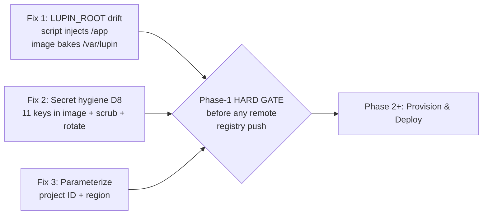

---

### 5.1 Fix 1 — `LUPIN_ROOT` path drift (🟠 HIGH, survey §6)

**The bug.** The deploy scripts inject `LUPIN_ROOT=/app`, but the Dockerfile bakes the application at `/var/lupin`. Everything resolves paths from `LUPIN_ROOT` via `cu.get_project_root()`, which returns `os.environ["LUPIN_ROOT"]` verbatim (`src/cosa/utils/util.py:649-650`). So with `LUPIN_ROOT=/app` the app looks for config at `/app/src/conf/lupin-app.ini` — a path the image never populated.

Ground truth (real file:line):

| Location | Current value | Why it's wrong |
|---|---|---|
| `docker/lupin/Dockerfile:243` | `ENV LUPIN_ROOT=/var/lupin` | The image's **authoritative** root — all `COPY` targets land here (`:251-274`) |
| `docker/lupin/Dockerfile:284` | `CMD [..., "/var/lupin/src/scripts/run-fastapi-lupin.sh" ]` | Entrypoint hardcodes `/var/lupin` |
| `src/scripts/run-fastapi-lupin.sh:3` | `cd /var/lupin/src` | Startup `cd` hardcodes `/var/lupin` |
| `src/scripts/cloud-run-deploy.sh:123,141` | `LUPIN_ROOT=/app` | **DRIFT** — overrides the image bake with a non-existent path |
| `src/scripts/cloud-run-build.sh:77` | `-e LUPIN_ROOT=/app` (local test run) | **DRIFT** — same defect in the local smoke-test path |

A second, related drift hides in the same deploy script: `cloud-run-deploy.sh:77` sets `LUPIN_CONFIG_MGR_CLI_ARGS` with `config_path=/src/conf/lupin-app.ini` (absolute `/src/...`, missing the `/var/lupin` prefix). The image places the INI at `/var/lupin/src/conf/lupin-app.ini` (`Dockerfile:262`). The Dockerfile's own default `ENV` at `:244` has the **identical** `/src/conf/...` defect, so this is a pre-existing latent bug the deploy script merely inherits. Both must move to `/var/lupin/src/conf/...`.

**Why it's silent today.** The `main.py` bootstrap (`src/fastapi_app/main.py:24-31`) asserts only that `LUPIN_ROOT` **is set** — it raises `RuntimeError` on `None` but does **no existence check** on the resolved path. `/app` is a non-None string, so the guard passes; the failure surfaces much later (and more cryptically) when `ConfigurationManager` cannot find the INI.

**The change.**
1. `cloud-run-deploy.sh:123` & `:141` — change `LUPIN_ROOT=/app` → `LUPIN_ROOT=/var/lupin`.
2. `cloud-run-deploy.sh:77` — change `config_path=/src/conf/...` & `splainer_path=/src/conf/...` → `/var/lupin/src/conf/...`.
3. `cloud-run-build.sh:77` — change `-e LUPIN_ROOT=/app` → `-e LUPIN_ROOT=/var/lupin`.
4. `docker/lupin/Dockerfile:244` — fix the baked default `LUPIN_CONFIG_MGR_CLI_ARGS` path prefix to `/var/lupin/src/conf/...` (so the image is correct even with no runtime override). 🧩 **STRAW-MAN**: keep `/var/lupin` as the canonical root (matches the image; least change). ↩ **Flip if:** Rick prefers the cloud convention `/app` as canonical — then the fix inverts: change the **Dockerfile** (`:243` + all `COPY` targets `:251-274` + `:282` + `:284` + `run-fastapi-lupin.sh:3`) to `/app`, and leave the scripts. The straw-man picks the lower-blast-radius side (4 single-token script edits vs. ~25 Dockerfile edits).
5. **Add a startup assertion** in `main.py` immediately after the existing `LUPIN_ROOT is None` guard (insert after `:31`), promoting the weak "is-set" check to a strong "is-valid" check:

```python
# Assert LUPIN_ROOT actually points at a populated Lupin tree — catches the
# /app-vs-/var/lupin path drift at boot instead of cryptically later at config load.
_canary = os.path.join( lupin_root, "src", "conf", "lupin-app.ini" )
if not os.path.isfile( _canary ):
    raise RuntimeError(
        f"LUPIN_ROOT='{lupin_root}' is set but invalid: "
        f"expected config canary not found at '{_canary}'. "
        f"Verify LUPIN_ROOT matches the Dockerfile bake path (/var/lupin)."
    )
```

This fails **loud and immediate** with the actionable path, honoring CLAUDE.md's "fail at the source, not the consumer" and "no defensive fallback" doctrine — it does not silently fall back to a default.

**Acceptance criteria.**
- [ ] [LUPIN] `cloud-run-deploy.sh` and `cloud-run-build.sh` contain `LUPIN_ROOT=/var/lupin` and zero occurrences of `LUPIN_ROOT=/app`.
- [ ] [LUPIN] `LUPIN_CONFIG_MGR_CLI_ARGS` in both `cloud-run-deploy.sh:77` and `Dockerfile:244` references `/var/lupin/src/conf/` (no bare `/src/conf/`).
- [ ] [LUPIN] `main.py` raises `RuntimeError` naming the missing canary when `LUPIN_ROOT` points at a directory lacking `src/conf/lupin-app.ini`, and proceeds normally when the canary exists.
- [ ] [LUPIN] The assertion block reaches 100% line + branch coverage (both the raise branch and the pass-through branch exercised).

**The tests that prove it.**

*Unit (`src/tests/unit/test_startup_lupin_root_assertion.py`, :7999-eligible):* Refactor the canary check into a tiny importable pure function `assert_lupin_root_valid( lupin_root )` in a bootstrap helper module (so it's unit-testable without importing the heavyweight `main.py`), then call it from `main.py`. Three cases give full branch coverage:
- Valid root → `tmp_path` with `src/conf/lupin-app.ini` written → returns without raising (pass branch).
- Invalid root → `tmp_path` empty → `pytest.raises( RuntimeError, match="invalid" )`, and assert the message contains the canary path (raise branch).
- Message-content assertion → confirms the raised text names both the bad `lupin_root` and the expected canary, satisfying the "actionable error" AC.

*Script-drift unit (`src/tests/unit/test_cloud_run_script_paths.py`):* Read each script's text and assert (a) `"LUPIN_ROOT=/app"` is absent, (b) `"LUPIN_ROOT=/var/lupin"` is present, (c) `"/var/lupin/src/conf/"` appears in the config-args line. Pure string assertions — no `gcloud`, no Docker.

> 💡 **Regression catch this would have prevented:** the survey ranks this 🟠 HIGH precisely because it is invisible until deploy time. A 3-line unit test makes the drift fail in CI in milliseconds instead of as a cryptic Cloud Run boot crash.

---

### 5.2 Fix 2 — Secret hygiene (D8 AUTHORIZED-PENDING, 🟠 HIGH, survey §6/§11.8)

🧩 **STRAW-MAN (D8):** exclude `src/conf/keys/` from the test image, scrub it from git history, rotate exposed keys, and gate every build with a secret scan — as a **Phase-1 HARD GATE before any image push to a remote registry**. ↩ **Flip if:** Phase-0 credential validation proves the keys were never pushed anywhere remote AND the local registry is the only target — then the git-history scrub (and its required force-push) can be deferred, but the image-exclusion + secret-scan gate still ship now.

**Critical correction to the survey (verified by direct inspection).** Survey §6 says "`src/conf/keys/` baked into image (Dockerfile:267), dev keys *possibly* in git history." I verified both halves:

| Claim | Verification | Result |
|---|---|---|
| Keys COPYed into image | `docker/lupin/Dockerfile:267` → `COPY ... src/conf/keys /var/lupin/src/conf/keys` | ✅ **CONFIRMED** — true positive, must fix |
| Keys in **this repo's** git history | `git log --all --diff-filter=A -- 'src/conf/keys/**'` + full `--name-only` history sweep for `conf/keys/(anthropic\|openai\|...)` | ❌ **NOT FOUND** — no key file was ever committed to the Lupin repo |
| Keys currently git-tracked | `git ls-files src/conf/keys/` | ❌ empty (already ignored: `.gitignore:66-67` `src/conf/keys/**`) |

So the **image-bake is a real, present vulnerability**; the **git-history scrub is conditional** — the Lupin repo shows no history of these key blobs. **Caveat Rick must close in Phase 0:** CoSA was folded into the mono-repo on 2026-05-29 (CLAUDE.md), and the former CoSA repo's full history lives off-tree at `/mnt/DATA02/cosa-git-archive-2026.05.29/`. The history scrub of D8 is therefore directed at that archive (if keys ever lived under CoSA) — **not** the current Lupin history, which is already clean. This is exactly the kind of destructive-ceremony-vs-simplest-mechanism call the memory flags: do not rewrite Lupin history that has no offending blobs.

**The 11 secret files at risk in the image** (`src/conf/keys/`, confirmed present on disk; count reconciled with §1.4 — 10 provider keys + the dev notification key):
`anthropic-api-key-firewalled`, `eleven11`, `gemini`, `google`, `groq`, `huggingface`, `kagi`, `mistral`, `notification-api-claude-code-dev`, `openai`, **plus the dev notification key** (the eleventh file, separately wired by `cloud-run-setup-secrets.sh:17`).

**The change (three sub-fixes).**

**2a. Exclude keys from the image.** Two independent layers (defense-in-depth):
- `.dockerignore` — add `src/conf/keys/` + `src/conf/keys/**` (currently absent; the file ends at line 89 with no keys entry). This stops the directory from even entering the build context.
- `docker/lupin/Dockerfile:267` — **delete** the `COPY ... src/conf/keys ...` line. In the GCP test environment, keys arrive via **Secret Manager** (the `cloud-run-setup-secrets.sh` pattern already proves this wiring exists for `notification-api-claude-code-dev`).

> ⚠️ This breaks any in-image code that reads keys from the filesystem path. The survey's recommended runtime model (§5 Secrets row) is Secret Manager + `${VAR}` INI interpolation. **Out-of-section dependency:** the key-file → env-var/Secret-Manager read-path migration is Phase-2 provisioning work; this fix only removes the bake. Tag the seam in the deploy plan so the two land together (per the "env var read site and set site land together" memory).

**2b. Git-history scrub runbook (conditional — only if Phase-0 finds offending blobs in the CoSA archive).** Requires explicit Rick go-ahead for the history rewrite + force-push.

```bash
# PRECONDITION: confirm offending blobs exist before any rewrite —
#   git log --all --diff-filter=A -- 'src/conf/keys/**'
# (On current Lupin: returns empty → SKIP this runbook entirely.)

# 1. Full backup mirror to the dedicated backup drive (NOT /mnt/DATA01, per memory).
git clone --mirror <repo> /mnt/DATA02/lupin-prescrub-backup-$(date +%F).git

# 2. Scrub with git-filter-repo (preferred over BFG — actively maintained, exact-path).
pip install git-filter-repo
git filter-repo --path src/conf/keys --invert-paths --force
#   BFG alternative:  java -jar bfg.jar --delete-folders keys --no-blob-protection

# 3. Re-add origin (filter-repo strips it), verify, then coordinate the force-push window.
git remote add origin <url>
git log --all --diff-filter=A -- 'src/conf/keys/**'   # MUST be empty post-scrub
# 4. Force-push (Rick-gated; breaks every existing clone — announce + re-clone all).
git push origin --force --all && git push origin --force --tags
```

**2c. Key rotation list** (rotate every key whose plaintext was ever reachable — image layer, history, or shared backup). Provider → rotation surface:

| Key file | Provider console / rotation action |
|---|---|
| `anthropic-api-key-firewalled` | Anthropic console → API Keys → revoke + reissue (the billed firewalled key) |
| `openai` | OpenAI dashboard → API keys → revoke + create |
| `groq` | GroqCloud → API Keys → regenerate |
| `gemini` / `google` | Google AI Studio / Cloud Console → regenerate |
| `mistral` | Mistral console → API keys → rotate |
| `huggingface` | HF → Settings → Access Tokens → revoke + new |
| `kagi` | Kagi → API → regenerate token |
| `eleven11` (ElevenLabs) | ElevenLabs → Profile → API key → regenerate |
| `notification-api-claude-code-dev` + dev notification key | Lupin-internal notification keys → regenerate + re-seed Secret Manager via `cloud-run-setup-secrets.sh` |

**2d. Secret-scan build gate.** Add a pre-build scan that **fails the build** if any high-entropy/known-key-pattern string is present in the build context or staged tree. Straw-man tool = `gitleaks` (fast, CI-friendly, pattern + entropy). Wire it as the first step of `cloud-run-build.sh` (before `docker build` at `:55`) and as a pre-commit-able standalone script.

```bash
# new: src/scripts/secret-scan-gate.sh  (called from cloud-run-build.sh before docker build)
set -e
gitleaks detect --source . --no-banner --redact \
  || { echo "❌ SECRET-SCAN GATE FAILED — secrets detected; build aborted"; exit 1; }
echo "✓ secret-scan gate passed"
```

**Acceptance criteria.**
- [ ] [LUPIN] `.dockerignore` excludes `src/conf/keys/` and `src/conf/keys/**`.
- [ ] [LUPIN] `docker/lupin/Dockerfile` has **zero** `COPY` lines referencing `src/conf/keys`.
- [ ] [LUPIN] A built image (`docker run ... ls /var/lupin/src/conf/keys`) shows the directory **absent or empty**.
- [ ] [LUPIN] `cloud-run-build.sh` invokes the secret-scan gate **before** `docker build`, and the gate's non-zero exit aborts the build (`set -e`).
- [ ] [LUPIN] Rotation checklist enumerates all 11 keys with a per-provider rotation surface; each marked done after rotation.
- [ ] [LUPIN] Phase-0 verdict on the CoSA archive recorded: history scrub **executed** (with backup + Rick go-ahead) **or** documented as **not-required** (no offending blobs).

**The tests that prove it.**

*Unit (`src/tests/unit/test_secret_hygiene.py`, :7999-eligible):*
- `.dockerignore` text contains `src/conf/keys/` (assertion on file content).
- `docker/lupin/Dockerfile` text contains **no** line matching `COPY.*src/conf/keys` (regex-negative assertion) — this is the regression lock that fails CI the instant someone re-adds the bake.
- `cloud-run-build.sh` text places the secret-scan gate invocation at a line number **less than** the `docker build` line (ordering assertion).
- Both `raise`/clean branches of any new Python scan-wrapper covered (100% gate).

*Build-time gate (runs in CI, not a pytest tier):* `gitleaks detect` over the repo + over a synthetic build context containing a fake `sk-`-pattern token → asserts non-zero exit (proves the gate actually blocks). The negative-control test (planted fake secret) is mandatory — a scanner that never fails is untested.

> This is the **HARD GATE**: no image may be pushed to a remote Artifact Registry / GCR until 2a + 2d pass and the 2b/2c verdict is recorded. The gate is enforced in `cloud-run-build.sh` itself, so it cannot be skipped by habit.

---

### 5.3 Fix 3 — Parameterize hardcoded project ID + region (🟠 HIGH input to D3)

**The bug.** All four `cloud-run-*.sh` scripts hardcode the **sandbox** project `hello-world-foo-423219` and `us-central1`, with `gcr.io` (legacy Container Registry) baked into image paths:

| Script | Hardcoded `PROJECT_ID` | Hardcoded `REGION` | `gcr.io` refs |
|---|---|---|---|
| `cloud-run-build.sh` | `:26` | — | `:52,57,78,90,102,103,114,118` |
| `cloud-run-deploy.sh` | `:48` (+ comment `:25`) | `:49` | `:97,119,131` |
| `cloud-run-setup-secrets.sh` | `:15` | `:18` | — |
| `cloud-run-validate.sh` | `:19` | `:20` | `:159` |

🧩 **STRAW-MAN (D3):** these scripts target a **DEDICATED GCP project** (not the `hello-world-foo-423219` sandbox) in `us-central1`. The drop-in mechanism: replace each hardcode with an env-var-with-default, sourcing a single git-ignored `src/scripts/cloud-run.env` config file so all four scripts read **one** source of truth. ↩ **Flip if:** Rick confirms `hello-world-foo-423219` IS the real target (then defaults stay but parameterization still ships for dev/test/prod separation), or wants separate per-env project files (`cloud-run.dev.env` / `.prod.env`) instead of one — flagged **needs-confirmation** per D3.

**The change.**
1. New file `src/scripts/cloud-run.env.example` (committed) + `src/scripts/cloud-run.env` (git-ignored, copied from example):

```bash
# src/scripts/cloud-run.env.example — copy to cloud-run.env and fill in.
LUPIN_GCP_PROJECT_ID="${LUPIN_GCP_PROJECT_ID:-}"          # REQUIRED — no sandbox default
LUPIN_GCP_REGION="${LUPIN_GCP_REGION:-us-central1}"       # straw-man default (D3)
LUPIN_GCP_REGISTRY="${LUPIN_GCP_REGISTRY:-us-central1-docker.pkg.dev}"  # Artifact Registry (gcr.io retired)
LUPIN_GCP_AR_REPO="${LUPIN_GCP_AR_REPO:-lupin}"           # Artifact Registry repo name
```

2. Top of each of the four scripts — replace the hardcoded literals with a sourced + validated block:

```bash
# Source shared GCP config; allow env override; FAIL LOUD if project unset (no sandbox fallback).
_ENV_FILE="$( dirname "$0" )/cloud-run.env"
[ -f "$_ENV_FILE" ] && source "$_ENV_FILE"
PROJECT_ID="${LUPIN_GCP_PROJECT_ID:?Set LUPIN_GCP_PROJECT_ID (no sandbox default — see cloud-run.env.example)}"
REGION="${LUPIN_GCP_REGION:-us-central1}"
REGISTRY="${LUPIN_GCP_REGISTRY:-us-central1-docker.pkg.dev}"
AR_REPO="${LUPIN_GCP_AR_REPO:-lupin}"
```

3. Replace `gcr.io/$PROJECT_ID/...` image refs with `$REGISTRY/$PROJECT_ID/$AR_REPO/...` (Artifact Registry path shape; survey §5 retires `gcr.io`). 🧩 **STRAW-MAN:** Artifact Registry now (gcr.io is deprecated and survey §8 lists "GCR→Artifact Registry" as a needed fix). ↩ **Flip if:** Rick wants the minimum-change first cut on the still-functioning `gcr.io` and defers the AR migration to Phase 2 — then keep `gcr.io/$PROJECT_ID` and parameterize only project/region.

The `${VAR:?message}` form means an **unset project ID aborts immediately with a readable message** — the sandbox ID can never silently leak into a real deploy. This is the bash analogue of the fail-loud doctrine.

**Acceptance criteria.**
- [ ] [LUPIN] No `cloud-run-*.sh` script contains the literal `hello-world-foo-423219` (except an optional commented example).
- [ ] [LUPIN] All four scripts source `cloud-run.env` and resolve `PROJECT_ID` via `${LUPIN_GCP_PROJECT_ID:?...}` (unset → non-zero exit with message).
- [ ] [LUPIN] `REGION` defaults to `us-central1` but is overridable via `LUPIN_GCP_REGION`.
- [ ] [LUPIN] `cloud-run.env` is in `.gitignore`; `cloud-run.env.example` is committed.
- [ ] [LUPIN] Image refs use the Artifact Registry path shape (or `gcr.io` parameterized, per the flip).
- [ ] [LUPIN] All four scripts still pass `bash -n` (no syntax regressions from the edits).

**The tests that prove it.**

*Script-config unit (`src/tests/unit/test_cloud_run_parameterization.py`, :7999-eligible):*
- For each of the four scripts: assert the file text does **not** contain `hello-world-foo-423219` and **does** contain `LUPIN_GCP_PROJECT_ID`. (Regression lock against re-hardcoding.)
- Assert each script contains `${LUPIN_GCP_PROJECT_ID:?` (fail-loud form present).
- `subprocess.run( ["bash", "-n", script] )` returns 0 for all four (syntax-valid). Non-mutating, sub-second — :7999-eligible.

*Behavioral env-resolution test:* Invoke a tiny extracted `cloud-run-config.sh` (the sourced block factored into its own file the four scripts `source`) under `bash` with `LUPIN_GCP_PROJECT_ID` **unset** → assert non-zero exit + the message on stderr (the `:?` branch). Then with it **set** → assert exit 0 and the resolved values echoed (the success branch). Two cases = full branch coverage of the new config resolver; no `gcloud` ever called.

---

### 5.4 Cross-cutting: coverage & venue summary

| Fix | New code introduced | Coverage obligation | Test tier / venue |
|---|---|---|---|
| 1 LUPIN_ROOT | `assert_lupin_root_valid()` (Python) + script edits | 100% line+branch (raise + pass) | unit / :7999 |
| 2 Secret hygiene | secret-scan wrapper + script-ordering | 100% on any Python wrapper; gate negative-control | unit / :7999 + CI gate |
| 3 Parameterize | `cloud-run-config.sh` resolver + edits | 100% branch (set/unset) | unit / :7999 |

All three are **AI-discretionary on :7999** — fast, non-mutating, no persistent state, no LLM spend — so they run without a :8000 slot ask. None mutates the DB, enqueues work, or spends tokens. The secret-scan negative-control (planted fake key) and the `${VAR:?}` unset-path test are the two cases most likely to be skipped and are therefore called out explicitly as mandatory for the 100% gate.

**Sequencing note (HARD GATE):** Fix 2's image-exclusion + secret-scan gate and the Phase-0 history verdict MUST complete before any `cloud-run-build.sh` push to a remote registry. Fix 1 and Fix 3 are independent and can land in either order; both are prerequisites for a *correct* first deploy but neither is a security gate.

---

## 6. Phase 2 — Provisioning Automation (IaC)

This section defines **how Milestone-1 GCP infrastructure is declared, parameterized, and applied**. It consumes the readiness findings in the companion survey (§5, §8, §9) and the verified state of the four `cloud-run-*.sh` scripts. Everything here targets **Approach A** (single always-on GCE GPU VM running `docker-compose` almost verbatim — D2 🧩 STRAW-MAN), provisioned declaratively so the migration to Approach B (GKE) in Phase 5 reuses the same modules.

> **Scope boundary**: this section provisions *resources*. It does **not** resolve the OAuth blocker (Decision D1, §3), the storage/config cutover (§7), or Day-2 observability (§8). It produces the substrate those phases land on.

---

### 6.1 IaC Tooling Decision

**🧩 STRAW-MAN (IaC tooling): Terraform for declarative provisioning + thin bash wrappers (evolved from the four `cloud-run-*.sh` scripts) for build/deploy.**

The build/deploy scripts already exist and work (`cloud-run-build.sh`, `cloud-run-deploy.sh`, `cloud-run-setup-secrets.sh`, `cloud-run-validate.sh` — survey §8 marks them "Functional"). What does **not** exist is any declarative description of the *resources* those scripts assume are already present: the deploy script's header (`cloud-run-deploy.sh:17-32`) merely *documents* that a bucket "must exist" and that IAM bindings must be granted by hand. That imperative, undocumented-prerequisite gap is exactly what Terraform closes.

#### Option comparison

| Dimension | **Terraform + bash (straw-man)** | All-bash `gcloud` | Cloud Deployment Manager |
|---|---|---|---|
| Idempotency | ✅ State-tracked; `plan` shows drift | ❌ Scripts must hand-roll "does it exist?" guards (already seen at `cloud-run-setup-secrets.sh:46`, `cloud-run-deploy.sh:97`) | ✅ Declarative |
| Reviewability (PR diff = infra diff) | ✅ `terraform plan` in CI | ⚠️ Diffing imperative scripts ≠ diffing end-state | ✅ |
| Destroy / teardown | ✅ `terraform destroy` | ❌ Manual reverse-order deletion | ✅ |
| Drift detection | ✅ First-class | ❌ None | ⚠️ Limited |
| Project parameterization | ✅ Variables (kills the hardcoded `hello-world-foo-423219`) | ⚠️ Possible but currently hardcoded 4× | ✅ |
| GCP futureproofing | ✅ Active, GKE/Cloud-Run providers | ✅ Native | ❌ **Deprecated by Google** (no new features; sunset trajectory) |
| Team familiarity / existing assets | ⚠️ New tool; modules to author | ✅ Scripts already exist | ❌ |
| 100% coverage gate (Lupin mandate) | ✅ `terraform validate` + `terratest`/`tflint` + plan-assertion tests | ⚠️ bats/shellcheck only | ⚠️ |

**Why the split (Terraform for *provision*, bash for *deploy*)**: provisioning is **declarative end-state** (a VM, a SQL instance, a bucket either exists with the right config or it doesn't) — Terraform's sweet spot. Deployment is **imperative procedure** (build image → push → SSH to VM → `docker compose pull && up -d` → smoke) that is awkward to model as Terraform resources and is already 80% built in the four scripts. Forcing deploy into Terraform (e.g. `null_resource` + `local-exec`) would be an anti-pattern. **Deployment Manager is rejected outright** because Google has deprecated it — adopting a sunset tool for a brand-new deployment is indefensible.

**↩ Flip if:** (a) Rick standardizes the org on **Pulumi** (TypeScript/Python IaC — would let infra reuse Lupin's Python idioms) → swap the Terraform modules for Pulumi components, keep the bash deploy wrappers; (b) the team wants **zero new tooling for Milestone 1** and accepts imperative drift risk → stay all-bash and defer Terraform to the Phase-5 GKE move; (c) GKE-first (Approach B chosen now, D2 flipped) → Terraform's value rises further (node pools, Workload Identity, Ingress all declarative) and bash shrinks to a `skaffold`/`kubectl apply` thin layer.

#### Repo layout (straw-man)

```
src/terraform/
├── modules/
│   ├── gce-gpu-vm/         # Compute Engine VM + L4 GPU + disks + startup-script
│   ├── cloud-sql-pg16/     # Cloud SQL PostgreSQL 16 instance + DB + user
│   ├── gcs-buckets/        # 4 buckets (lancedb/deep-research × prod/test)
│   ├── secret-manager/     # secret inventory + versions + accessor bindings
│   ├── artifact-registry/  # docker repo
│   ├── iam/                # split build-SA / runtime-SA + least-priv bindings
│   └── vpc-vpn/            # VPC, subnet, Cloud VPN tunnel to on-prem vLLM
├── envs/
│   ├── prod/  (main.tf, terraform.tfvars, backend.tf)
│   └── test/
└── README.md  (linked from project README per the rnd-doc convention)
```

- **No hardcoded project ID** — `var.project_id`, `var.region` (default `us-central1`, D3 🧩 STRAW-MAN), `var.environment` (`prod`/`test`) threaded into every module. This directly remediates the four scripts that bake `PROJECT_ID="hello-world-foo-423219"` (`cloud-run-build.sh:26`, `cloud-run-deploy.sh:48`, `cloud-run-setup-secrets.sh:15`, `cloud-run-validate.sh:19`).
- **Remote state** in a dedicated GCS state bucket with versioning + state locking, created by a one-time bootstrap (`terraform init -backend-config`).

#### Acceptance criteria — IaC foundation

- [ ] [LUPIN] `src/terraform/` module skeleton created; `terraform validate` passes for both `envs/prod` and `envs/test`.
- [ ] [LUPIN] **Zero hardcoded project IDs or regions** in any `.tf` file — `grep -r "hello-world-foo-423219" src/terraform/` returns nothing; all references are `var.project_id`.
- [ ] [LUPIN] `terraform plan` against an empty project produces a complete create-plan with **no** "must already exist" manual prerequisites.
- [ ] [LUPIN] Remote-state GCS bucket exists with Object Versioning + state locking; `backend.tf` references it.
- [ ] [LUPIN] `tflint` + `terraform fmt -check` wired into CI; **100% of authored bash wrapper logic** covered by `bats` tests (per the Lupin 100% line+branch+function gate — applies to new code this section introduces).
- [ ] [LUPIN] The four `cloud-run-*.sh` scripts are forked to `gce-vm-{build,deploy,setup-secrets,validate}.sh` evolutions OR refactored in place to source `var`-equivalent shell variables (no hardcoded project). 🧩 STRAW-MAN: evolve-in-place. **↩ Flip if:** Rick wants the Cloud-Run scripts preserved verbatim for the Phase-5 Approach-C path → fork instead of mutate.

---

### 6.2 Topology Being Provisioned (Milestone 1)

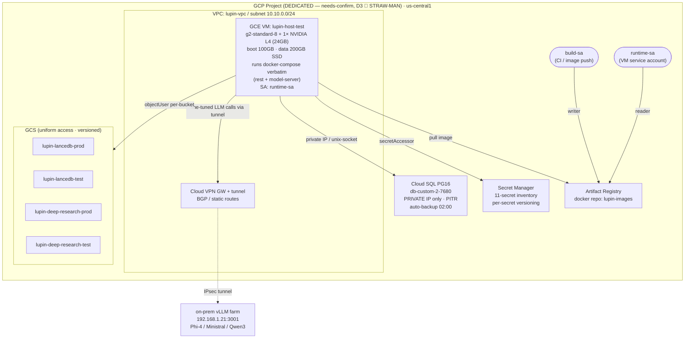

---

### 6.3 Resource Specs (one Terraform module per resource)

Every module is parameterized on `project_id`, `region`, `environment`. No literal project/region/bucket names hardcoded — names are composed (`"lupin-lancedb-${var.environment}"`).

#### 6.3.1 `gce-gpu-vm` — the Milestone-1 compute host

The VM runs the **existing `docker-compose.yml` almost verbatim** (D2), so it must reproduce the host's GPU + bind-mount contract. Verified compose facts driving the spec: GPU reservation `driver: nvidia, count: all` on all three compute services (`docker-compose.yml:97-103, 175-181, 257-263`); the Max-plan OAuth bind-mount `~/.claude/.credentials.json:ro` (`docker-compose.yml:139, 217` — the D1 OAuth dependency that *only Approach A preserves*); base image `nvidia/cuda:12.4.1-base-ubuntu22.04` (`docker/lupin/Dockerfile:32`) which needs **driver ≥ 535** for the cu124 wheels (the validated floor per §1.4).

| Attribute | Value | Source / rationale |
|---|---|---|
| Machine type | `g2-standard-8` (8 vCPU / 32 GB) 🧩 STRAW-MAN | g2 family ships the L4. ↩ **Flip if:** concurrency demands A100 → `a2-highgpu-1g`; or carve-out lands early (CPU-only rest) → split into `n2-highmem-8` CPU VM + separate GPU VM (an early Approach-B lean) |
| RAM sizing | 32 GB 🧩 STRAW-MAN | Covers in-process Whisper + 2 encoders (~2.9 GB VRAM, but heavy *host* RAM for flash-attn + uvicorn worker). ↩ **Flip if:** profiling shows the resident set exceeds ~24 GB under test-environment load → step to `g2-standard-16` (64 GB) |
| GPU | 1× `nvidia-l4` | Survey §5 "L4 24 GB cost-efficient". `count: all` in compose maps to this single attached accelerator |
| GPU driver | NVIDIA driver ≥ 535 + Container Toolkit 🧩 STRAW-MAN | cu124 needs ≥ 525; Dockerfile comment validated on 535.104.05 → install ≥ 535 (§1.4). ↩ **Flip if:** a 525-series driver is confirmed clean and preferred for availability |
| Boot disk | 100 GB pd-ssd | OS + NVIDIA driver + docker |
| Data disk | **200 GB pd-ssd**, separate persistent disk, survives VM recreate 🧩 STRAW-MAN | Holds the two 31.7 GB + 20.1 GB images (~52 GB), Postgres-fallback data, `io/` (~2.5 GB), and headroom for the **41 GB LanceDB** if not yet GCS-flipped on day 1. ↩ **Flip if:** LanceDB is GCS-resident from day 1 (§7 cutover precedes VM provisioning) → 100 GB suffices |
| NVIDIA install | **startup-script** installs driver + Container Toolkit + docker, then `docker compose up -d` 🧩 STRAW-MAN | Lowest-effort, reproducible-in-Terraform. ↩ **Flip if:** boot time matters or driver installs prove flaky → bake a custom GCE image (Packer) with driver + toolkit pre-installed |
| Service account | `runtime-sa` (§6.3.6, least-priv) — **not** the default Compute SA | Default `PROJECT_NUMBER-compute@…` (grabbed at `cloud-run-setup-secrets.sh:69`, `cloud-run-deploy.sh:25`) is over-privileged; replaced by a dedicated SA |
| Network | attached to `lupin-vpc` subnet; **no external IP** if VPN-only egress acceptable 🧩 STRAW-MAN | Keep an external IP for SSH/ingress on Milestone 1 (operator access). ↩ **Flip if:** IAP-tunnel SSH adopted → drop external IP |
| Scaling | single instance, **no MIG / no autoscaler** (D6) | Survey §4.2: singleton in-memory queues + daemons forbid scale-out |

> **Bind-mount caveat**: the compose file mounts 8 external-project repos and several `~/.claude/*` host paths (`docker-compose.yml:137-149, 216-231`). On a fresh GCE VM these host paths do not exist. The startup-script must either (a) `git clone` the doc-viewer repos to the expected host paths or (b) the GCP config profile (`[Lupin: Testing-GCS]`) must disable the multi-repo doc-viewer scopes that aren't present. This is a **deploy-time** concern flagged here as a provisioning dependency — the VM module exposes a `var.docview_repos` list so the startup-script knows what to clone.

**Acceptance criteria — GCE VM:**
- [ ] [LUPIN] `terraform apply` creates `lupin-host-${var.environment}` with 1× L4, 100 GB boot + 200 GB data disk, attached to `lupin-vpc`, running as `runtime-sa`.
- [ ] [LUPIN] Startup-script installs driver ≥ 535 + Container Toolkit; `nvidia-smi` inside a test container returns 0 (no CUDA Error 804 — the cuda-compat purge in Dockerfile:65-69 must be intact in the image).
- [ ] [LUPIN] Data disk is a **separate persistent disk** with `deletion_protection`/`prevent_destroy` so a VM recreate does not wipe LanceDB/io.
- [ ] [LUPIN] VM boots, `docker compose up -d` brings all services healthy (all `/health` → 200 within the 60 s `start_period` from compose healthchecks).
- [ ] [LUPIN] The chosen Max-plan credential path exists on the VM (D1 §3 precondition — Variant α env or Variant β file; login performed out-of-band per §3.3).
- [ ] [LUPIN] Terraform module has **100% covered** validation tests (terratest plan-assertions on machine type, GPU count, disk sizes, SA email).

#### 6.3.2 `cloud-sql-pg16` — managed PostgreSQL 16

The code already speaks Cloud SQL unix-socket: `database.py:52-63` reads `CLOUD_SQL_CONNECTION_NAME`, `DB_USER` (default `lupin_app`), `DB_PASSWORD`, `DB_NAME` (default `lupin_db_prod`) and builds `postgresql+psycopg2://{user}:{pw}@/{db}?host=/cloudsql/{instance}`. Pool config is env-driven: prod `pool_size=10, max_overflow=20` (`database.py:129-130`), dev/test `5/10` (`database.py:104-105`). **D4 🧩 STRAW-MAN: provision-new** unless Phase-0 credential validation (survey §9.5) finds an existing instance.

| Attribute | Value | Source / rationale |
|---|---|---|
| Version | `POSTGRES_16` | Matches `postgres:16.3-alpine` (compose:6) + the 7 Alembic migrations |
| Tier | **`db-custom-2-7680`** (2 vCPU / 7.5 GB) GCP test env; `db-f1-micro` for the local/`Testing` profile 🧩 STRAW-MAN | Survey §5/§6: micro's 25-conn ceiling is exhausted by the *production* pool (10+20=30); custom-2 was sized for it. The GCP test env runs the test pool (5+10=15) and can likely downsize (§7.3.4). ↩ **Flip if:** load profiling shows the 15-conn pool needs the larger tier → keep `db-custom-2-7680`; or AlloyDB chosen later → different module |
| Availability | Zonal for the GCP test environment 🧩 STRAW-MAN (the future prod clone would use Regional/HA) | ↩ **Flip if:** Milestone 1 wants Regional (HA) SQL even for the test env — but the singleton app already has no failover per survey §7.1, so HA SQL behind a non-HA app buys limited resilience; zonal is the straw-man for the cost-sensitive test milestone |
| Backups | **Automated daily @ 02:00, 7-day retention** 🧩 STRAW-MAN + **PITR** (binary logging) | Survey §7.5: today's only backup is `docker exec pg_dump` which *cannot run against managed Cloud SQL*. ↩ **Flip if:** compliance needs longer retention, or a different backup window avoids the deploy/migration window → adjust schedule/retention (the §7/§8 RPO/RTO numbers restate these — they all derive from THIS row) |
| Database flags | `max_connections=100` 🧩, `log_min_duration_statement=500ms` 🧩 | Headroom over the 30-conn pool + slow-query visibility. ↩ **Flip if:** the pool is re-sized (R17) → re-budget `max_connections`; lower the slow-query threshold if 500 ms proves too noisy/quiet |
| Networking | **PRIVATE IP only**, on `lupin-vpc` via Service Networking peering; no public IP | Defense-in-depth; VM reaches it over the unix-socket via the Cloud SQL Auth Proxy or `?host=/cloudsql/...` connector |
| Users / DBs | `lupin_app` user (password from Secret Manager `lupin-db-password`); DBs `lupin_db_prod` (code default) / `lupin_db_test` — **Milestone 1 uses `lupin_db_test`** | `lupin_db_prod` is `database.py`'s default value; password **never** in tfvars — sourced from the secret |

**Acceptance criteria — Cloud SQL:**
- [ ] [LUPIN] Instance created at tier `db-custom-2-7680` (GCP test environment — may downsize for the test pool, §7.3.4) with **private IP only** (no public IP); `gcloud sql instances describe` shows `ipConfiguration.ipv4Enabled=false`.
- [ ] [LUPIN] Automated backups enabled (02:00, 7-day) AND PITR enabled (`pointInTimeRecoveryEnabled=true`).
- [ ] [LUPIN] `lupin_app` DB user created; password is a Secret Manager reference, **absent from all `.tf`/`.tfvars`** (`grep` for plaintext password returns nothing).
- [ ] [LUPIN] Database `lupin_db_test` (Milestone-1 target) exists — `lupin_db_prod` may also be created for the future prod clone; `CLOUD_SQL_CONNECTION_NAME` output exposed by the module for injection into the VM/app env.
- [ ] [LUPIN] A connectivity smoke from the VM constructs the exact `database.py:63` URL and `SELECT 1` succeeds. **Schema is created by the §7 §3.3 pre-deploy migration step (NOT auto-on-startup).**
- [ ] [LUPIN] **Skip-create guard**: if Phase-0 found an existing instance, module supports `data` import / `count=0` create — `terraform plan` shows no destructive replace.

#### 6.3.3 `gcs-buckets` — LanceDB + Deep-Research storage

Bucket **names verified in the INI**: `gs://lupin-lancedb-prod/lupin.lancedb` (`lupin-app.ini:16`), `gs://lupin-lancedb-test/test-lupin.lancedb` (`:500`), `gs://lupin-deep-research-prod/` (`:22`), `gs://lupin-deep-research-test/` (`:505`). The module creates **4 buckets** so the config's `gs://` URIs resolve unchanged (zero code change — survey §1).

| Attribute | Value | Rationale |
|---|---|---|
| Names | `lupin-lancedb-prod`, `lupin-lancedb-test`, `lupin-deep-research-prod`, `lupin-deep-research-test` | Exact match to INI URIs — flipping `storage_backend=gcs` (`lupin-app.ini:14`) then "just works" |
| Location | `us-central1` (regional, single-region) 🧩 STRAW-MAN | Co-located with VM → no cross-region egress on the LanceDB hot path. ↩ **Flip if:** DR requires dual-region → `nam4`/dual-region |
| Uniform bucket-level access | **ON** | Disables legacy per-object ACLs; IAM is the single auth surface |
| Object Versioning | **ON** | Survey §7.5 DR requirement; LanceDB is append-only so versioning gives point-in-time recovery |
| Lifecycle | LanceDB: keep N=3 noncurrent versions 🧩; Deep-Research: Nearline @ 90d 🧩 | Caps versioning cost. ↩ **Flip if:** compliance requires longer retention |
| Public access prevention | enforced | No accidental public exposure |

> **D4 provision-new** applies here too: module supports a skip-create path if Phase-0 (survey §9.4) finds the buckets already exist with the right region/lifecycle.

**Acceptance criteria — GCS buckets:**
- [ ] [LUPIN] All 4 buckets created with exact names matching `lupin-app.ini:16/22/500/505`.
- [ ] [LUPIN] Uniform bucket-level access = ON; Object Versioning = ON; public access prevention = enforced; on all 4.
- [ ] [LUPIN] Lifecycle rules applied and visible via `gcloud storage buckets describe`.
- [ ] [LUPIN] A round-trip smoke (write+read a Lance test object via the `runtime-sa` identity) succeeds **and** a delete attempt by `runtime-sa` is **denied** (proves `objectUser` not `objectAdmin` — see §6.3.6).
- [ ] [LUPIN] Skip-create guard verified (`count`/import) — no destructive replace if buckets pre-exist.

#### 6.3.4 `secret-manager` — full secret inventory

**Verified inventory** — union of `${VAR}` interpolations in `lupin-app.ini` (`JWT_SECRET_KEY:665`, `SMTP_USERNAME:685`, `SMTP_PASSWORD:686`, `LUPIN_DEV_EMAIL:39`, plus the vLLM LoRA path vars `:148/:153`), the env-var reads grepped from `src/cosa`/`src/fastapi_app`/`src/lib`, the **11 plaintext files in `src/conf/keys/`** (reconciled count, §1.4), and `database.py`'s `DB_PASSWORD`. Each becomes a Secret Manager secret with **automatic replication** and **per-secret versioning** (no `latest`-pinning at consume time — survey §7.6 rollback requirement).

| Secret (GCP name 🧩 STRAW-MAN) | Backs | Source of truth |
|---|---|---|
| `lupin-jwt-secret-key` | `JWT_SECRET_KEY` | `lupin-app.ini:665` |
| `lupin-db-password` | `DB_PASSWORD` | `database.py:54` |
| `lupin-anthropic-api-key-firewalled` | `ANTHROPIC_API_KEY_FIREWALLED` | `src/conf/keys/anthropic-api-key-firewalled`; code grep |
| `lupin-openai-api-key` | `OPENAI_API_KEY` | `src/conf/keys/openai` |
| `lupin-groq-api-key` | `GROQ_API_KEY` | `src/conf/keys/groq` |
| `lupin-google-api-key` / `lupin-gemini-api-key` | `GOOGLE_API_KEY` | `src/conf/keys/google`, `…/gemini` |
| `lupin-mistral-api-key` | `MISTRAL_API_KEY` | `src/conf/keys/mistral` |
| `lupin-elevenlabs-api-key` | `ELEVENLABS_API_KEY` | `src/conf/keys/eleven11` |
| `lupin-kagi-api-key` | (Kagi search) | `src/conf/keys/kagi` |
| `lupin-hf-token` | `HF_TOKEN` / `HUGGINGFACE` | `src/conf/keys/huggingface`; code grep |
| `lupin-notification-api-key` | model-server / notify X-API-Key | `src/conf/keys/notification-api-claude-code-dev` (+ dev notification key); **already wired** by `cloud-run-setup-secrets.sh` |
| `lupin-smtp-username` / `lupin-smtp-password` | `SMTP_USERNAME` / `SMTP_PASSWORD` | `lupin-app.ini:685-686` |

> **D8 secret-hygiene HARD GATE (AUTHORIZED-PENDING)**: `.dockerignore` does **NOT** exclude `src/conf/keys/`, and `docker/lupin/Dockerfile:267` (`COPY … src/conf/keys → /var/lupin/src/conf/keys`) bakes **all 11 plaintext key files into the 31.7 GB image** (count reconciled, §1.4). Keys are currently `.gitignore`d (verified: `git ls-files src/conf/keys/` returns nothing) — so a git-history scrub may be a *no-op for keys specifically*, but the **image-bake exposure is real and confirmed**. Before any push to a remote Artifact Registry: (1) add `src/conf/keys/` to `.dockerignore`; (2) migrate consumption to Secret Manager mounts; (3) **rotate** the exposed keys; (4) run the git-history scrub **only with explicit Rick go-ahead** (D8). **↩ Flip if:** Rick declines the history rewrite → keep the `.dockerignore` exclusion + Secret Manager + rotation (3 of 4 steps), document the residual git-history risk, and skip the rewrite.

**Acceptance criteria — Secret Manager:**
- [ ] [LUPIN] All inventory secrets created (one Terraform resource each); initial versions populated from `src/conf/keys/*` / env **out-of-band** (never committed to tfvars).
- [ ] [LUPIN] Each secret has explicit version management; the VM/app consumes a **pinned version**, not `:latest` (survey §7.6).
- [ ] [LUPIN] **HARD GATE**: `src/conf/keys/` (11 files) added to `.dockerignore`; a rebuilt image proves `/var/lupin/src/conf/keys/` is absent (`docker run … ls` → empty/missing). This gate **blocks** any remote registry push.
- [ ] [LUPIN] Exposed keys rotated (tracked checklist, one per key, 11 total); rotation date recorded.
- [ ] [LUPIN] Git-history scrub executed **iff Rick authorizes** — gated, not automatic.
- [ ] [LUPIN] `secretAccessor` bindings are **per-secret to `runtime-sa`** (not project-wide) — see §6.3.6.

#### 6.3.5 `artifact-registry` — docker repo

The existing build script pushes to **deprecated GCR** (`gcr.io/$PROJECT_ID/lupin` — `cloud-run-build.sh:52,57,90`). Migrate to Artifact Registry (survey §5/§8).

| Attribute | Value |
|---|---|
| Repo | `lupin-images` (Docker format), `us-central1` 🧩 STRAW-MAN |
| Images | `lupin` (31.7 GB) + `lupin-model-server` (20.1 GB) |
| Immutable tags | **ON** 🧩 STRAW-MAN — honors the no-auto-promote-tags practice; promotion is a deliberate digest re-tag, never an overwrite. ↩ **Flip if:** workflow needs mutable `latest` → off (not recommended) |
| Cleanup policy | keep last N=10 versions per image | Caps registry storage for the large images |

**Acceptance criteria — Artifact Registry:**
- [ ] [LUPIN] `lupin-images` Docker repo created in `us-central1`; build wrapper pushes `${region}-docker.pkg.dev/${project}/lupin-images/lupin:${version}` (no `gcr.io`).
- [ ] [LUPIN] Immutable tags ON; a re-push of an existing tag **fails** (proves no silent overwrite).
- [ ] [LUPIN] `build-sa` can push; `runtime-sa` can only pull (verified by attempted push as runtime → denied).

#### 6.3.6 `iam` — split build SA vs runtime SA, least-privilege

Survey §7.3 is explicit: the current scripts grant the **default Compute SA** broad roles; recommending `objectAdmin` would let the app **delete its own LanceDB store**. We split into two SAs with minimal, **per-resource** bindings.

| SA | Roles (least-priv) | Why |
|---|---|---|
| **`build-sa`** (CI/image build) | `roles/artifactregistry.writer` (repo-scoped), `roles/cloudbuild.builds.editor` (if Cloud Build used) | Builds + pushes images; **no** runtime data access |
| **`runtime-sa`** (VM service account) | `roles/cloudsql.client`; **`roles/storage.objectUser` bound per-bucket** (NOT project-wide, NOT `objectAdmin`); `roles/secretmanager.secretAccessor` bound **per-secret**; `roles/artifactregistry.reader` (repo-scoped); `roles/logging.logWriter` + `roles/monitoring.metricWriter` (Day-2 readiness) | App runtime: read/write objects but **cannot delete buckets or admin IAM**; read its own secrets only |

- `storage.objectUser` (create/read/update/**delete-objects** but not delete-bucket/admin) is bound at **bucket** scope per the 4 buckets — *not* `objectAdmin`. If even object-delete must be denied for the append-only LanceDB store, use `objectViewer`+`objectCreator` on the LanceDB buckets. 🧩 STRAW-MAN: `objectUser` everywhere for simplicity. **↩ Flip if:** Rick wants the LanceDB store delete-proofed → split the two bucket classes.
- **Workload Identity**: Approach A (GCE VM) uses the **VM's attached service account** (no WIF federation needed). 🧩 STRAW-MAN. **↩ Flip if:** Approach B (GKE) → **GKE Workload Identity** binds the K8s SA to `runtime-sa` (survey §5); the IAM module already isolates `runtime-sa` so the binding swap is local.

**Acceptance criteria — IAM:**
- [ ] [LUPIN] Two distinct SAs (`build-sa`, `runtime-sa`) created; **default Compute SA is NOT used** by the VM (`gcloud compute instances describe` shows `runtime-sa`).
- [ ] [LUPIN] `secretAccessor` and `storage.objectUser` are bound **per-resource**, never at project level (`gcloud projects get-iam-policy` shows no broad storage/secret grants to `runtime-sa`).
- [ ] [LUPIN] **Negative test**: `runtime-sa` attempting `gsutil rb` (bucket delete) or a secret it doesn't need → **denied**. `build-sa` attempting to read `lupin-db-password` → **denied**.
- [ ] [LUPIN] No SA holds `roles/owner`, `roles/editor`, or `storage.objectAdmin`.

#### 6.3.7 `vpc-vpn` — VPC + Cloud VPN tunnel to on-prem vLLM

**D5 🧩 STRAW-MAN: reach the on-prem vLLM farm via Cloud VPN tunnel.** The INI hardcodes the private endpoint **`192.168.1.21:3001`** (Phi-4 at `lupin-app.ini:163`; Ministral/Qwen3 LoRAs on `:3000` at `:148/:153`) — unreachable from GCP without a tunnel. The Cloud VPN tunnel makes `192.168.1.21` routable from the VM **with no INI change** (lowest-change path that preserves the fine-tuned-model features — survey §5/§6).

| Attribute | Value |
|---|---|
| VPC | `lupin-vpc`, custom subnet `10.10.0.0/24` in `us-central1` 🧩 STRAW-MAN (must not overlap the on-prem `192.168.1.0/24`) |
| Cloud VPN | HA VPN gateway + 1 tunnel to on-prem peer GW; IKEv2; PSK from `lupin-vpn-psk` secret |
| Routing | static route to `192.168.1.0/24` via the tunnel 🧩 STRAW-MAN. ↩ **Flip if:** on-prem supports BGP → Cloud Router + dynamic routing (preferred for resilience) |
| Firewall | egress allow VM → `192.168.1.21:3000-3001`; ingress from on-prem restricted | Tight allowlist to the vLLM ports only |
| Service Networking | private-services-access range for Cloud SQL private IP peering | Lets §6.3.2's private-IP SQL attach to this VPC |

> **Dependency note**: on-prem side (peer VPN gateway, PSK exchange, firewall) is **out of GCP's control** — the module provisions the GCP half and **outputs** the GCP gateway IP + selectors Rick needs to configure the on-prem router. A Phase-5 epic re-homes vLLM to GKE/Vertex (D5), retiring this tunnel. **The cross-cloud hot-path latency budget that gates whether the VPN is permanent is unmeasured — see R15 / §12 coverage gap.**

**Acceptance criteria — VPC/VPN:**
- [ ] [LUPIN] `lupin-vpc` + subnet created; CIDR does **not** overlap `192.168.1.0/24`.
- [ ] [LUPIN] HA VPN gateway + tunnel created; module **outputs** GCP gateway IP + IKE selectors for the on-prem side.
- [ ] [LUPIN] Static (or BGP) route to `192.168.1.0/24` installed; firewall allows VM → `192.168.1.21:3000-3001` only.
- [ ] [LUPIN] Service Networking peering range reserved so Cloud SQL private IP (§6.3.2) attaches.
- [ ] [LUPIN] **Connectivity smoke** (post on-prem config): from the VM, `192.168.1.21:3001/health` (or a `vllm` model-list probe) reachable — proving the INI's hardcoded endpoint resolves with zero config change. Tunnel-down path documented (app degrades, fine-tuned routes fail loudly).
- [ ] [LUPIN] **Latency measurement task (R15 / §12 gap):** the round-trip latency of one representative fine-tuned-model call over the tunnel is measured and recorded, producing the number D5's "VPN latency unacceptable" flip condition depends on — before the VPN is treated as the permanent answer.

---

### 6.4 D9 Note — Whisper/Embeddings (provisioning impact only)

**D9 🧩 STRAW-MAN: keep self-hosted on the GPU model-server.** This is *why* §6.3.1 specs an L4 GPU at all. The INI already has `speech to text provider = model-server` (`lupin-app.ini:433`) pointing at `http://lupin-model-server:7998`. Provisioning-wise: the GPU VM hosts both the model-server and rest containers (Milestone 1 = compose verbatim). **↩ Flip if:** Rick elects the managed alternative (Google Cloud Speech-to-Text + Vertex embeddings) → the L4 GPU drops from §6.3.1, the VM becomes `n2-highmem-8` CPU-only, the `vpc-vpn` module is unaffected, and two new secrets/API enablements (Speech-to-Text, Vertex) join §6.3.4. This is a GPU-elimination lever, not a Milestone-1 default.

---

### 6.5 Provisioning Sequence & Cross-Section Dependencies

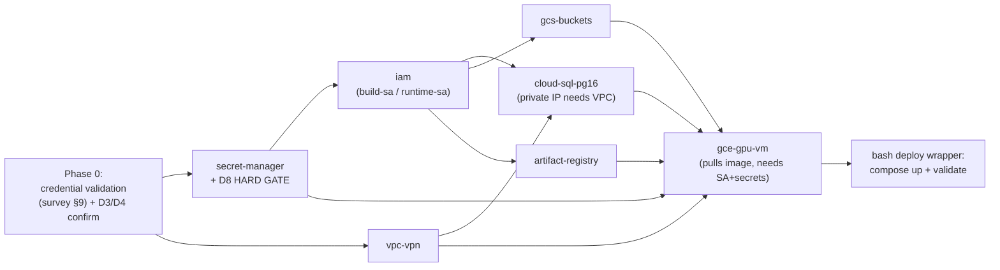

**Hard ordering**: `secret-manager` + D8 gate **before** any image push; `vpc-vpn` before private-IP Cloud SQL; `iam` before the VM (the VM needs `runtime-sa`); everything before the bash deploy wrapper. The D8 secret-hygiene gate is a **blocking precondition** on the `artifact-registry` push step.

#### Acceptance criteria — full provisioning run
- [ ] [LUPIN] `terraform apply` on a clean dedicated project (D3) creates all 7 resource groups with **zero manual prerequisites**.
- [ ] [LUPIN] `terraform destroy` cleanly tears down (validating no orphaned resources / no `prevent_destroy` on anything except the data disk + state bucket).
- [ ] [LUPIN] D8 HARD GATE verified green **before** the first Artifact Registry push (keys excluded from image, rotated, scrub-if-authorized).
- [ ] [LUPIN] End-to-end: provisioned VM runs `docker compose up -d`, all services healthy, Cloud SQL `SELECT 1` over private IP succeeds, GCS round-trip succeeds, vLLM endpoint reachable over the tunnel.
- [ ] [LUPIN] All new Terraform modules + bash wrappers + smoke probes meet the **100% line+branch+function** coverage gate (terratest plan-assertions + bats; `# nosec`/skip only with same-line justification).

---

## 7. Phase 3 — Storage & Config Cutover

This section is the concrete, file-by-file procedure for moving Lupin's two stateful stores — **LanceDB** (vector/snapshot data) and **PostgreSQL** (auth/jobs/notifications) — from the local dev host onto GCP managed services, and for flipping the configuration block that selects them. It maps to **Phase 3 — Storage + config cutover** of the survey's phasing. Every claim below is grounded in the live code; where a decision is unresolved, the straw-man default is tagged inline.

The good news from the survey holds: the storage/config layers are already cloud-shaped. The work here is *flip a config block, close one real bug, wire two secrets, and move two datasets* — not re-architecture. But two survey claims do **not** survive code inspection and are corrected below (**auto-migrate-on-startup is a myth — §7.3**; the nature of the LanceDB GCS gap).

---

### 7.1 Flip `storage backend = local → gcs`

#### 7.1.1 The keys and which block owns them

The backend toggle is the INI key `storage backend` (note: space-delimited, not underscore — Lupin INI convention). It is read in exactly one place that matters for cutover — `SolutionSnapshotManagerFactory.create_from_config_manager()` at `src/cosa/memory/solution_manager_factory.py:241` — which then branches on the literal string `"gcs"` (line 253) vs. `"local"` (line 258) to choose which secondary key to require:

| Block | `src/conf/lupin-app.ini` | `storage backend` | LanceDB key required | Value |
|---|---|---|---|---|
| `[Lupin: Production]` | line 6–18 | `gcs` (line 14) | `solution snapshots lancedb gcs uri` (line 16) | `gs://lupin-lancedb-prod/lupin.lancedb` |
| `[Lupin: Development]` | line 32 | `local` (line 345) | `solution snapshots lancedb path` (line 347) | `/src/conf/long-term-memory/lupin.lancedb` |
| `[Lupin: Testing]` | line 453 (inherits Development) | `local` (inherited) | `solution snapshots lancedb path` (inherited) | local |
| `[Lupin: Testing-GCS]` | line 486 (inherits Development) | `gcs` (line 499) | `solution snapshots lancedb gcs uri` (line 500) | `gs://lupin-lancedb-test/test-lupin.lancedb` |

Deep Research has its own parallel toggle: `deep research storage backend` + `deep research gcs bucket` (Production lines 21–22; Testing-GCS lines 504–505). The cutover flips both families together — they share GCS auth but resolve independently.

**Crucially, no Python edit is required to flip the backend.** `LanceDBSolutionManager._resolve_db_path()` (`src/cosa/memory/lancedb_solution_manager.py:142`) already accepts a `gs://` URI verbatim and hands it to `lancedb.connect()` (line 554) — the native object-store driver, no GCS-FUSE. `util_gcs.py` covers Deep Research blob I/O. This matches the survey's "zero code change" claim for the *write/connect* path (caveat: the *query* path has a real bug — §7.2).

#### 7.1.2 How ConfigurationManager selects the block (the config-block-selection mechanism)

Block selection is driven entirely by the `LUPIN_CONFIG_MGR_CLI_ARGS` env var, parsed in `ConfigurationManager.__init__` at `src/cosa/config/configuration_manager.py:143–151`. The var is a space-delimited string; the `config_block_id` token uses `+` as a space-escape that is un-escaped at line 151 (`.replace( "+", " " )`). So `config_block_id=Lupin:+Production` selects `[Lupin: Production]`.

The surfaces that set it today:

| Surface | File:line | Value baked / set |
|---|---|---|
| Docker image default | `docker/lupin/Dockerfile:244` | `config_block_id=Lupin:+Development` ⚠️ |
| docker-compose dev | `docker-compose.yml:153` | `Lupin:+Development` |
| docker-compose test | `docker-compose.yml:235` | `Lupin:+Testing` |
| Cloud Run deploy | `src/scripts/cloud-run-deploy.sh:77,141` | `config_block_id=$CONFIG_BLOCK` (→ `Lupin: Production` or `Lupin: Testing-GCS`) |
| Dev run script | `src/scripts/run-fastapi-lupin.sh:8` | commented-out example only |

#### 7.1.3 The mis-selection hazard and the guard 🧩 STRAW-MAN

There is a real footgun: **the image bakes `Lupin: Development` as the default** (`Dockerfile:244`), and a cloud-backed container (the GCP test environment) that fails to override `LUPIN_CONFIG_MGR_CLI_ARGS` (or sets it wrong) will **silently boot with `storage backend = local`** — writing snapshots to an ephemeral container path that vanishes on restart, while `LUPIN_ENV` may simultaneously point the DB at Cloud SQL. The two env vars (`LUPIN_ENV` for the DB, `LUPIN_CONFIG_MGR_CLI_ARGS` for the storage block) are independent and can disagree. `cloud-run-deploy.sh:141` sets both in one `--set-env-vars`, but a GCE-VM compose run (Approach A) inherits the image default unless explicitly overridden.

**🧩 STRAW-MAN guard**: add a **fail-loud startup assertion** in the FastAPI lifespan (`src/fastapi_app/main.py`, near the DB-init block at line 520) that runs only when the cloud-backed profile is active (the code's trigger is the literal `LUPIN_ENV == "production"` — see the OPEN-ITEM note below):
- assert the resolved `config_block_id` selects a **GCS-backed** block (the GCP test environment selects `[Lupin: Testing-GCS]`; the future prod clone selects `[Lupin: Production]`) and is **not** `Lupin: Development` / a local-storage `Lupin: Testing` block;
- assert `config_mgr.get( "storage backend" ) == "gcs"`;
- assert the resolved `solution snapshots lancedb gcs uri` starts with `gs://`;
- on any failure, raise and **refuse to start** (a crash-loop is strictly safer than silent local-disk writes that look healthy).

This pairs with the separate `LUPIN_ROOT` startup assertion (§5 Fix 1; Risk 🟠 HIGH, survey §6) — implement both in the same guard function.

> 🧩 **STRAW-MAN (OPEN ITEM — the `LUPIN_ENV` tension the re-scope surfaces).** The re-scope to a GCP **test** environment exposes a genuine design question: the code's "cloud-backed" path — both the Cloud SQL DSN (§7.3.1) and this storage-config guard — is gated on the **literal** `LUPIN_ENV == "production"`, yet Milestone 1 is conceptually a *test* environment that selects `[Lupin: Testing-GCS]`. The GCP test environment must do **one** of: **(a)** reuse the literal `LUPIN_ENV=production` value as the "cloud-backed profile" trigger (the value-name is decoupled from the test-vs-prod distinction — it merely flips the cloud-backed code path on, and the actual config block is chosen independently via `LUPIN_CONFIG_MGR_CLI_ARGS=…Lupin:+Testing-GCS`), OR **(b)** a small code change makes the cloud path also activate for the test env (e.g. `LUPIN_ENV in ("production", "test")` at `database.py:48–63` and in this guard). This is an **OPEN ITEM the Phase-0 / Phase-3 work must resolve** before cutover. ↩ **Flip if:** Rick prefers option (b)'s explicit `test` value over option (a)'s value-name reuse — then `database.py` and this guard's `LUPIN_ENV` check both widen, and every `LUPIN_ENV=production` injection below becomes `LUPIN_ENV=test`.

**↩ Flip if:** Rick prefers the inverse default — rebaking the image default to a GCS-backed block (`[Lupin: Testing-GCS]` for the test env, or `[Lupin: Production]` for the future prod clone) and treating dev/local as the explicit override. That removes the cloud-backed footgun but adds a dev one (a bare `docker run` would hit cloud GCS). The straw-man keeps the dev-friendly default + a hard cloud-backed gate because dev/local runs vastly outnumber cloud boots and the cloud-backed path already sets the var explicitly.

- [ ] [LUPIN] Add `assert_production_config_sane()` to the lifespan startup; covers block-id, `storage backend`, and `gs://` URI prefix; raises on violation. Unit-tested for both pass and every fail branch (100% branch coverage of the new guard).
- [ ] [LUPIN] Add a unit test that loads `[Lupin: Testing-GCS]` (the Milestone-1 block — and `[Lupin: Production]` for the future prod clone) via `_reset_singleton=True` and asserts `storage backend == "gcs"` and the URI starts with `gs://` (mirror the existing `test_configuration_block_loading` pattern at `test_lancedb_gcs_integration.py:235`).
- [ ] [LUPIN] Confirm the GCE-VM deploy wrapper sets `LUPIN_CONFIG_MGR_CLI_ARGS` with `config_block_id=Lupin:+Testing-GCS` (the Milestone-1 block) AND the cloud-backed trigger `LUPIN_ENV=production` (the literal value that activates the Cloud SQL + storage-guard path — per the §7.1.3 OPEN-ITEM note option (a); option (b) would set `LUPIN_ENV=test` instead) in the same env injection; add a `validate.sh` check that both are present and agree (block-id GCS-backed, cloud trigger active).

---

### 7.2 The LanceDB GCS integration 4/8 → 8/8 fix

#### 7.2.1 What the suite actually shows (correcting the survey)

The survey calls this a "GCS integration query failure / normalization mismatch." The code is more specific. Of the 9 test methods in `src/tests/integration/test_lancedb_gcs_integration.py`, exactly **one** is marked `@pytest.mark.xfail` — `test_data_persistence_across_manager_instances` (line 178) — with the reason: *"Known normalization mismatch between insert and query paths — not GCS-specific."* The "4/8" figure in the survey conflates this xfail with GCS-auth skips (the whole class skips if `gcs_credentials_available` fails — conftest line 463). **The defect is one query-path bug, and it is backend-agnostic** (the xfail reason says so explicitly): it reproduces on local LanceDB too. GCS merely surfaces it because the test forces a *fresh manager instance*.

#### 7.2.2 Root cause: dual embedding sources with divergent normalization

The insert and query paths embed the **same question text through two different code paths with different prefixes**, so the stored vector and the query vector are not in the same space:

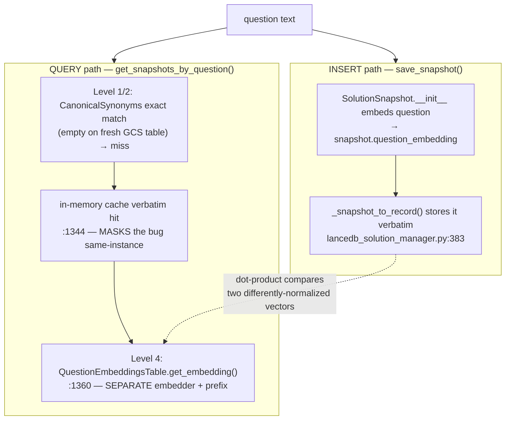

Three reinforcing facts in the code:

1. **The cache masks the bug for same-instance tests.** `test_query_by_question_from_gcs` (line 157) and `test_multiple_snapshots_and_retrieval` (line 209) reuse the class-scoped `gcs_manager`, so the verbatim question is in `self._question_lookup` and the exact-match short-circuit at `lancedb_solution_manager.py:1344` returns `[(100.0, snapshot)]` *without ever computing a query embedding*. They pass. The xfail test deliberately destroys `manager1` and builds `manager2` (lines 195–200), whose cache is rebuilt from GCS — forcing the **Level 4 vector path** (line 1355) where the bug lives.

2. **Two embedders, two prefixes.** The insert path uses the embedding the `SolutionSnapshot` carries; the query path calls `self._question_embeddings_tbl.get_embedding( question )` (`:1360`) — a separate `QuestionEmbeddingsTable`. The local prose embedder applies *different* prefixes for query vs. document (`lupin-app.ini:448` `local embedding prose query prefix = search_query:` vs. `:449` `search_document:`). If the two paths disagree on which prefix (or whether to normalize) was applied, the `dot` metric at `:1382` yields degraded similarity — the retrieval "misses."

3. **The CanonicalSynonyms table doesn't co-locate cleanly on GCS.** `get_snapshots_by_question` constructs `CanonicalSynonymsTable( db_path=self.db_path, ... )` at `:1277`, passing the `gs://…lancedb` URI straight to `lancedb.connect()` (`canonical_synonyms_table.py:67,76`). On a timestamped fresh test DB the `canonical_synonyms` table is empty, so Levels 1–2 always miss and every fresh-instance lookup is forced down to the embedding path — exactly where defect (2) bites.

#### 7.2.3 Proposed fix + re-green plan 🧩 STRAW-MAN

**Single-source the query embedding so insert and query share one normalization contract.** The straw-man fix is the minimum-blast-radius one:

- Make the **query path reuse the identical embedding routine the insert path used** for `question_embedding`, with the identical content-type/prefix. Concretely: route both through one helper (e.g. `_embed_question_for_search()`) that pins `content_type` and prefix, rather than `QuestionEmbeddingsTable.get_embedding()` independently deciding. This guarantees the query vector lands in the same space as the stored vector.
- Verify the `dot`-metric assumption: the stored `question_embedding` must be L2-normalized iff the query embedding is, or the `(1.0 - distance) * 100` similarity at `:1398` is meaningless across the two sources.
- Do **not** rewrite the hierarchical search or the CanonicalSynonyms layer — the exact-match levels are correct; only Level 4's embedding source is wrong.

**↩ Flip if:** root-cause instrumentation (below) shows the divergence is in the *stored* vector (insert side) rather than the query side — then the fix moves to `_snapshot_to_record`/`SolutionSnapshot.__init__` and the query side stays. Decide *after* the instrumentation pass, not before.

Re-green sequence (venue: the suite is `:8000`-bucket — it mutates a real GCS bucket and needs server-side embeddings; submit via `POST /api/test-suite/submit` with a user-confirmed `scheduled_at`, never ad-hoc):

- [ ] [LUPIN] **Instrument first (ground truth before fix).** Add a temporary diagnostic that, for one fixed question, logs (a) the stored `question_embedding[:5]` + its norm and (b) the Level-4 query embedding `[:5]` + its norm, and the resulting `_distance`. Confirm the vectors differ and identify which side is "wrong." (Honors the "establish absolute reference before perception-driven debugging" practice.)
- [ ] [LUPIN] Implement the single-source embedding helper; both insert and Level-4 query call it with pinned content-type/prefix.
- [ ] [LUPIN] Remove the `@pytest.mark.xfail` decorator at `test_lancedb_gcs_integration.py:178`; the persistence test must now pass green.
- [ ] [LUPIN] Add a **local-backend** regression mirroring the xfail scenario (fresh manager instance, forced Level-4) so the bug can never silently return and so it runs on `:7999` without GCS auth.
- [ ] [LUPIN] Add a unit test asserting insert-vector and query-vector for identical text are within float tolerance (the normalization contract), with no server/GPU dependency (mock the embedder).
- [ ] [LUPIN] Re-run the full GCS integration suite: target **8/8 green** (9 methods − 0 xfail, minus any that legitimately skip only on missing creds). Report pass/fail per method in a table.
- [ ] [LUPIN] 100% line+branch+function coverage on the new `_embed_question_for_search()` helper and the guard around it.

---

### 7.3 Cloud SQL connection cutover

#### 7.3.1 Connection string — already coded, gated on `LUPIN_ENV=production`

`get_database_url()` at `src/cosa/rest/db/database.py:48–63` builds the Cloud SQL **unix-socket** DSN only when `LUPIN_ENV == "production"`:

```
postgresql+psycopg2://{DB_USER}:{DB_PASSWORD}@/{DB_NAME}?host=/cloudsql/{CLOUD_SQL_CONNECTION_NAME}
```

It reads four env vars: `CLOUD_SQL_CONNECTION_NAME` (no default — required), `DB_USER` (default `lupin_app`), `DB_PASSWORD` (no default — required), `DB_NAME` (default `lupin_db_prod`). It raises `ValueError` if `CLOUD_SQL_CONNECTION_NAME` or `DB_PASSWORD` is missing (line 57–60) — fail-loud, good. The unix-socket form (`host=/cloudsql/<conn-name>`) is the Cloud SQL Auth Proxy / sidecar convention; on a GCE VM (Approach A) this requires the Cloud SQL Auth Proxy running locally and mounting that socket path.

#### 7.3.2 `DB_PASSWORD` via Secret Manager 🧩 STRAW-MAN

Today `cloud-run-deploy.sh:140` mounts only `--set-secrets="/secrets/notification-api-key=$SECRET_NAME:latest"` — **there is no `DB_PASSWORD` secret wiring and no `--add-cloudsql-instances` flag in the deploy script.** That gap must close before any DB cutover.

**🧩 STRAW-MAN**: store `DB_PASSWORD` in Secret Manager and inject it as an **env var** via `--set-secrets=DB_PASSWORD=lupin-db-password:<pinned-version>` (Cloud Run / GCE startup), because `database.py` reads `DB_PASSWORD` from `os.environ` (line 54), not from a file mount. Pin the **secret version** (not `:latest`) — the survey flags `:latest` as defeating revision-pinned rollback (Day-2 gap §7.6); the same rule applies to `DB_PASSWORD`.

**↩ Flip if:** Rick wants Workload Identity + IAM database authentication (passwordless, the cloud-native end-state). That eliminates `DB_PASSWORD` entirely but requires a `database.py` change (IAM token auth instead of password DSN) and is a larger lift — defer to the Approach-B/GKE end-state, keep password-via-Secret-Manager for Milestone 1.

#### 7.3.3 Alembic migration behavior — **survey correction: NOT auto-on-startup**

The survey (TL;DR and §8) and `main.py:522,524` comments both claim "automatic schema creation via Alembic migrations" on startup. **This is not in the code.** Verified:
- The entrypoint `Dockerfile:284` runs `run-fastapi-lupin.sh`, which only does `python3 -m fastapi_app.main` (`run-fastapi-lupin.sh:10`). No `alembic upgrade head`.
- No `command.upgrade`, `alembic upgrade`, or `Base.metadata.create_all` call exists anywhere in `main.py` or `src/cosa/rest/db/`.
- Migrations are applied **manually**: `src/docs/database-migrations.md:18–22` documents the operator running `export DATABASE_URL=… && alembic upgrade head`. `migrations/env.py:15` reads `DATABASE_URL` to override `sqlalchemy.url`.
- **`alembic.ini` lives at the *repo root*** (`/alembic.ini`), with `script_location = %(here)s/src/migrations` (`alembic.ini:8`). The Dockerfile copies `src/migrations` to `/var/lupin/src/migrations` (`Dockerfile:257`) **but does not copy `alembic.ini`** — so `alembic` is not even runnable inside the image as built.

This is consequential and **is the authoritative resolution of the plan-wide Alembic contradiction** (see the doc-header callout): the survey's "idempotent startup migration" reuse claim and its rollback-coupling risk are both **moot as currently coded** — there is no startup migration to couple to. That is arguably *safer* (decouples deploy from schema change, which the survey's §7.6 mitigation recommends anyway), but it means **schema creation is a manual pre-deploy step that must be added to the runbook**. Every other section (§2, §6, §9, §11, R12) has been corrected to say "pre-deploy migration step," not "auto-on-startup."

**🧩 STRAW-MAN**: keep migrations **decoupled from app startup** (expand/contract discipline, per survey §7.6). Add an explicit, idempotent **pre-deploy migration step** — a thin `src/scripts/run-db-migrate.sh` that sets `DATABASE_URL` (built from the same Cloud SQL socket + Secret-Manager `DB_PASSWORD`) and runs `alembic upgrade head` against Cloud SQL, executed as a **one-shot job before** the new revision serves traffic. Also fix the Dockerfile to **copy `alembic.ini`** into the image so the migration job can run from the same artifact.

**↩ Flip if:** Rick wants migrate-on-startup after all (simpler ops, one fewer step). Then add `alembic upgrade head` to the entrypoint *before* `python3 -m fastapi_app.main`, copy `alembic.ini` into the image, and accept the survey's §7.6 rollback coupling (a failed migration crash-loops the singleton). The straw-man avoids this because Lupin runs `replicas=1` always-on with no failover — a migration crash-loop is a total outage.

#### 7.3.4 Pool sizing — already environment-aware

`get_pool_config()` at `database.py:87–139` is already correct for the singleton topology:
- production: `pool_size=5`, `max_overflow=10` (→ 15 max), `pool_pre_ping=True`, `pool_recycle=3600`, `connect_timeout=10`, forces `timezone=utc` (lines 101–114).
- testing: `NullPool` (no pooling, test isolation, line 116–124).
- development: `pool_size=10`, `max_overflow=20` (line 126–139).

The survey's pool-exhaustion risk (🟡 MED, §6) is real but bounded: with `replicas=1` (D6), exactly one process holds at most 15 connections. The comment at `database.py:102` references `db-f1-micro` (25-conn limit) — 15 < 25 fits, but leaves only 10 headroom for the Cloud SQL Auth Proxy, migration job, and `gcloud` admin sessions.

**🧩 STRAW-MAN** (consistent with survey §5): provision **`db-custom-2-7680` for the GCP test environment**, **`db-f1-micro` for the local/`Testing` profile only**. At `db-custom-2-7680` the 15-connection ceiling is comfortable — and because the GCP test env runs the **test pool** (5+10 = 15), not the *production* pool (10+20 = 30) the larger tier was originally justified by, the test instance can likely **downsize** to a smaller tier (the 30-conn justification was prod-pool-based). Keep the existing pool numbers unchanged — they are already conservative and correct for `replicas=1`. 🧩 **STRAW-MAN (tier downsizing):** the test pool of 15 fits a smaller Cloud SQL tier. ↩ **Flip if:** Phase-0 load profiling shows the 15-conn pool plus Auth Proxy / migration-job / admin headroom needs `db-custom-2-7680` after all → keep it.

**↩ Flip if:** horizontal scaling is ever un-deferred (D6 reversed). Then `pool_size × replicas` must be re-budgeted against the instance's `max_connections` and a connection pooler (PgBouncer / Cloud SQL connection limits) becomes mandatory. Out of scope for Milestone 1.

- [ ] [LUPIN] Add `DB_PASSWORD` to Secret Manager; inject via `--set-secrets=DB_PASSWORD=<secret>:<pinned-version>` (env-var form, since `database.py:54` reads `os.environ`).
- [ ] [LUPIN] Add `--add-cloudsql-instances=<CLOUD_SQL_CONNECTION_NAME>` to the deploy/VM provisioning so the `/cloudsql/<conn-name>` socket exists; set `CLOUD_SQL_CONNECTION_NAME`, `DB_USER`, `DB_NAME` env vars.
- [ ] [LUPIN] Fix `Dockerfile` to also COPY `alembic.ini` into the image (currently absent — migrations can't run from the built artifact).
- [ ] [LUPIN] Author `src/scripts/run-db-migrate.sh` (one-shot, idempotent `alembic upgrade head` against Cloud SQL via `DATABASE_URL`); 100% branch coverage of its arg-validation + DSN-construction (it must refuse to run if `DB_PASSWORD`/`CLOUD_SQL_CONNECTION_NAME` are unset).
- [ ] [LUPIN] Smoke-verify the connection via the existing `database.py` `quick_smoke_test()` (line 231) pointed at Cloud SQL (runs `SELECT 1` through `get_db()`), executed from the VM/pod — never via curl.
- [ ] [LUPIN] Decouple migration from deploy: run the migration job to completion and verify `alembic current` == head **before** the new app revision serves traffic.

---

### 7.4 Data migration

Two independent datasets move; they have **different mechanisms and different risk profiles.**

#### 7.4.1 LanceDB tables → `gs://`

LanceDB is append-only Lance files; moving = copying the on-disk `.lancedb` directory tree into the GCS bucket at the test-environment URI, then letting the native `gs://` driver open it.

- **Source**: local `…/src/conf/long-term-memory/lupin.lancedb` (Development path, `lupin-app.ini:347`).
- **Destination**: `gs://lupin-lancedb-test/test-lupin.lancedb` (Testing-GCS URI, `lupin-app.ini:500` — the Milestone-1 target; the `gs://lupin-lancedb-prod/lupin.lancedb` URI at `:16` is the future prod clone's destination).
- **Mechanism 🧩 STRAW-MAN**: `gcloud storage cp --recursive <local>.lancedb gs://lupin-lancedb-test/test-lupin.lancedb`. No format conversion — Lance files are portable. After copy, a fresh `LanceDBSolutionManager` initialized from `[Lupin: Testing-GCS]` connects via `_resolve_db_path` → `gs://` (no code change).

**The compaction/rebuild lesson** (the load-bearing operational caveat): LanceDB's `merge_insert` upsert path (`lancedb_solution_manager.py:937–943`) and repeated `table.add()` inserts (`:834`) accumulate **fragment files and tombstones**. A directly-copied local store may carry a large uncompacted fragment count, which on GCS turns into many small-object reads and slow cold-start scans (the survey's cold-start risk, §6 🟡). Two consequences:
1. **Compact before copy.** Run LanceDB `compact_files()` + cleanup of old versions on the local store *before* the `gcloud storage cp`, so the GCS copy is dense.
2. **The scalar index on `id_hash` must be rebuilt after the move.** `initialize()` re-creates it (`:569`, `:587`, `create_scalar_index("id_hash", replace=True)`) on open — but verify it succeeds against the GCS-backed table (the `try/except` at `:568–574` swallows index failures in debug). A missing `id_hash` index silently degrades `merge_insert` correctness/perf (the comment at `:566–567` calls this "critical for merge_insert performance and correctness").

**↩ Flip if:** the local store is small enough (survey says ~855 MB floor) that compaction is negligible — then skip compaction and just copy. But the move is one-time, so paying the compaction cost once is cheap insurance; the straw-man keeps it.

#### 7.4.2 PostgreSQL data → Cloud SQL

Two distinct populations, two tools:

**(a) Auth data currently in SQLite** — the existing `migrate-sqlite-to-postgres.py` (`src/scripts/migrate-sqlite-to-postgres.py`) migrates `users`, `refresh_tokens`, `api_keys`, recent `auth_audit_log` (30-day window, `:39`), and the verification/reset/failed-login tables (`:64–67`) from `src/conf/long-term-memory/lupin-auth.db` (`:38`) into Postgres via the SQLAlchemy models. It is **all-or-nothing transactional** and has a `--dry-run` mode (`:17`). It writes through `get_db()` (`:31`), so it targets whatever `LUPIN_ENV` selects — meaning it can write directly to Cloud SQL if run with `LUPIN_ENV=production` + the secrets set. *Note:* this tool is only relevant if the source of truth is still SQLite; if the dev environment already runs PostgreSQL-in-Docker (compose `postgres:16.3-alpine`, survey §2), this step is a no-op and (b) applies instead.

**(b) Live job/notification/proxy data in PostgreSQL-in-Docker** — `Notifications`, `PredictionLog`, `ProxyDecision`, `job_history`, `server_lifecycle` (survey §3). **🧩 STRAW-MAN**: standard `pg_dump` → `gcloud sql import` (or `psql` restore). Concretely: `pg_dump` the dev `lupin_db_dev` to a SQL file, upload to a GCS staging bucket, `gcloud sql import sql <instance> gs://…/dump.sql --database=lupin_db_test` (the Milestone-1 target DB).

**The critical ordering constraint**: run the **pre-deploy Alembic migration (§7.3.3) to create the empty schema on Cloud SQL FIRST**, then import data. A `pg_dump --data-only` against a schema-migrated target avoids schema-drift conflicts; a full `pg_dump` (schema + data) would collide with Alembic-created tables. Straw-man: `pg_dump --data-only --column-inserts` after the migration job reports `alembic current` == head.

**↩ Flip if:** the dataset is large enough that `--column-inserts` is too slow — switch to `COPY`-format dump + `gcloud sql import`. For first-cut volumes (survey gives no row counts), `--data-only` insert form is simplest and safest.

The survey's DR gap (§7.5) is acknowledged here: `docker exec pg_dump` cannot run against managed Cloud SQL. Post-cutover, backups switch to **Cloud SQL automated backups + PITR** — that is a §8 Day-2 item, but the *migration dump* itself is a one-time `pg_dump` from the still-local source, so it is in scope for this section.

#### 7.4.3 Verification steps + acceptance criteria

Verification (all read-only or against a throwaway target; runnable on `:7999` except the live GCS suite):

- [ ] [LUPIN] **LanceDB row-count parity**: after copy, open the GCS-backed table and assert `to_arrow().to_pandas()` row count equals the local source count (the same load that `initialize()` does at `:598`).
- [ ] [LUPIN] **LanceDB retrieval parity**: pick 5 known questions, assert `get_snapshots_by_question()` returns the same top-1 `id_hash` from GCS as from local (this also exercises the §7.2 fix — if §7.2 is unfixed, this will fail on the Level-4 path).
- [ ] [LUPIN] **`id_hash` scalar index present** on the GCS table post-move (no swallowed index error in debug logs).
- [ ] [LUPIN] **Postgres row-count parity** per table (`users`, `api_keys`, `notifications`, `job_history`, `server_lifecycle`, `prediction_log`, `proxy_decision`): source count == Cloud SQL count.
- [ ] [LUPIN] **Auth round-trip**: log in as the test companion user against the app pointed at Cloud SQL (via `/auth/login`, never curl — use `requests`/`TestClient`), confirm a migrated user authenticates and a refresh token validates.
- [ ] [LUPIN] **Alembic head check**: `alembic current` against Cloud SQL == latest revision in `src/migrations/versions/` (8 migrations present as of cutover) — run as the pre-deploy step, not at boot.
- [ ] [LUPIN] **Backend-flip smoke**: boot the app with `[Lupin: Testing-GCS]` (the Milestone-1 block) + the cloud-backed trigger `LUPIN_ENV=production` (literal, per §7.1.3 OPEN-ITEM option (a); option (b) → `LUPIN_ENV=test`) against the migrated stores; confirm the §7.1.3 cloud-backed-config guard passes (not crash-loops) and `/health` plus a snapshot lookup succeed.
- [ ] [LUPIN] **No data written to local disk in the GCP test environment**: assert (via the §7.1.3 guard + a post-boot check) that no `.lancedb` directory was created under the container filesystem — i.e., the GCS backend is genuinely active, not silently falling back to local.
- [ ] [LUPIN] **Dry-run first**: every destructive migration step (`migrate-sqlite-to-postgres.py --dry-run`, a `pg_dump` to a throwaway Cloud SQL DB, a LanceDB copy to a temp `gs://…-staging` prefix) is exercised against a throwaway target before the real cutover into the GCP test environment.

**Tests/coverage gate for new code this section introduces** (per the 100% mandate): the cloud-backed-config guard (§7.1.3), the §7.2 embedding-single-source helper, `run-db-migrate.sh`, and any migration-verification harness all carry 100% line/branch/function coverage. The live GCS integration suite and any Cloud SQL data-parity test are `:8000`-bucket (mutate real state) and submit via `POST /api/test-suite/submit` with a confirmed `scheduled_at`; the local-backend regression and the mocked-embedder normalization test are `:7999`-eligible (fast, no persistent mutation).

> **Staging caveat (§12 Q3 / coverage gap):** without a staging tier between on-prem dev and the GCP test environment, these destructive cutover steps (LanceDB copy, `pg_dump` import, the §7.1.3 guard, the §8 CORS change) are validated only against a *throwaway target*, not a persistent pre-cutover environment. The dry-run-against-throwaway discipline above is the mitigation the plan carries in lieu of staging; if Q3 resolves to "yes, build staging," these steps re-target the staging environment first.

---

## 8. Phase 4 — Deploy Automation & Day-2 Operations

This section turns the survey's *finish-and-automate* mandate into concrete deploy machinery plus the Day-2 gaps the completeness review flagged (§7 of the survey). It is scoped to **Milestone 1 = a single always-on GCE GPU VM** (Approach A) with the documented **Phase-5 GKE end-state** (Approach B) carried forward where it changes the design. Every unresolved fork is tagged 🧩 STRAW-MAN with a `↩ Flip if:` line.

The four existing `cloud-run-*.sh` scripts are **functional but Cloud-Run-shaped and project-hardcoded** — they push to deprecated `gcr.io`, hardcode `PROJECT_ID="hello-world-foo-423219"`, inject the wrong `LUPIN_ROOT=/app` against an image that bakes `/var/lupin`, and use `curl` for validation (prohibited per CLAUDE.md). We **evolve, not discard**, them.

---

### 8.1 Deploy Automation

#### 8.1.1 Target topology for Milestone 1 (VM bring-up, not Cloud Run deploy)

🧩 **STRAW-MAN**: Milestone 1 runs the *existing `docker-compose.yml` almost verbatim* on one GCE GPU VM, brought up by a **systemd unit wrapping `docker compose up -d`** — NOT `gcloud run deploy`. This uniquely preserves the host-mounted Max-plan OAuth path (§3) and GPU access exactly as today.
`↩ Flip if:` Rick chooses Approach B now (GKE) → then `cloud-run-deploy.sh` is retired in favor of `kubectl apply` against a `replicas=1` Deployment manifest, and the systemd unit is dropped.

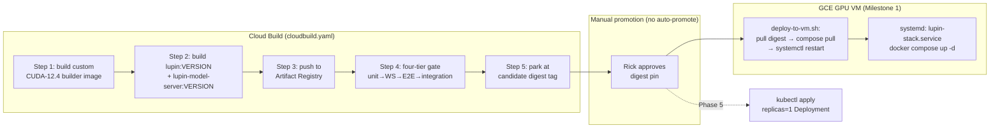

#### 8.1.2 `cloudbuild.yaml` with a custom CUDA-12.4 builder

No `cloudbuild.yaml` exists today (survey §5, §7.4). Standard Cloud Build OOMs on the flash-attn `nvcc` compile, and both images need the matching toolchain (`docker/lupin/Dockerfile:32` and `docker/lupin-model-server/Dockerfile:26` both `FROM nvidia/cuda:12.4.1-base-ubuntu22.04`). The build pipeline:

- **Step 0 — custom builder**: build-and-cache a `cuda-12.4-builder` image (FROM `nvidia/cuda:12.4.1-devel-ubuntu22.04`, includes `nvcc`) pushed to Artifact Registry; subsequent steps run inside it on a `n2-highmem-8` machine type (survey §5 sizing). 🧩 **STRAW-MAN**: `n2-highmem-8` (64 GB RAM) for the flash-attn compile. `↩ Flip if:` build OOMs → bump to `n2-highmem-16`.
- **Step 1–2** — build `lupin:$TAG` and `lupin-model-server:$TAG` with BuildKit layer caching keyed off Artifact Registry.
- **Step 3** — push to **Artifact Registry** (replacing `gcr.io`); pin the base image by digest.
- **Step 4 — four-tier merge gate** wired exactly per CLAUDE.md §PR MERGE REQUIREMENTS order: **unit (:7999) → WS smoke (:7999) → E2E UI (:8000 scheduled) → integration (:8000 scheduled, FINAL GATE)**. The :8000 tiers are submitted via `POST /api/test-suite/submit` with a `scheduled_at` — Cloud Build cannot side-door them (monopolize-mode collision). 🧩 **STRAW-MAN**: the gate runs as a *separate* Cloud Build trigger gated on the candidate image. `↩ Flip if:` Rick wants a single linear pipeline → inline a Cloud Build step that calls the test-suite submit API and polls completion.
- **Step 5 — candidate parking** (no-auto-promote-tags): the passing image is tagged `lupin:$VERSION-candidate` at a **content digest**, never `:latest`. Promotion to the working tag is a separate manual `deploy-to-vm.sh --promote <digest>` step requiring explicit Rick go-ahead.

**Acceptance criteria:**
- [ ] [LUPIN] `cloudbuild.yaml` exists at repo root; `gcloud builds submit --config cloudbuild.yaml` builds both images on the custom CUDA-12.4 builder without OOM. *(Closes R6.)*
- [ ] [LUPIN] Images push to Artifact Registry (`us-central1-docker.pkg.dev/<project>/lupin/...`), NOT `gcr.io`.
- [ ] [LUPIN] Base image pinned by `sha256:` digest in both Dockerfiles.
- [ ] [LUPIN] Four-tier gate is wired in the documented order; :8000 tiers go through `/api/test-suite/submit` (verified: no `curl`, no direct `/api/push`). *(Closes R14 — the merge-gate→build wiring.)*
- [ ] [LUPIN] Passing image is parked at `:$VERSION-candidate@sha256:...`; **no** automatic `:latest` retag.
- [ ] [LUPIN] All new bash (`deploy-to-vm.sh`, the systemd unit installer) and any new Python probe helpers hit **100% line+branch+function coverage** (`pytest --cov-fail-under=100`); shell logic factored into a testable Python module where branchy.

#### 8.1.3 Evolving the four scripts

- **`cloud-run-build.sh` → `build-images.sh`**: parameterize `PROJECT_ID`/`REGION`/`REGISTRY` (env/flags, no hardcoded sandbox project per D3); swap `gcr.io` → Artifact Registry; delete the interactive `read -p` local-test prompt (`cloud-run-build.sh:65,98`) — CI-hostile.
- **`cloud-run-deploy.sh` → `deploy-to-vm.sh`**: replace the `gcloud run deploy` block (`:128–141`) with `gcloud compute ssh <vm> -- 'cd /opt/lupin && docker compose pull && sudo systemctl restart lupin-stack'`; **fix `LUPIN_ROOT=/app` → `/var/lupin`** (survey HIGH risk; `:123,141`) and add a startup assertion that `${LUPIN_ROOT}/src/conf/lupin-app.ini` exists.
- **`cloud-run-validate.sh` → `validate-deployment.py`**: rewrite the six `curl` checks (`:55–132`) as a Python `requests`/`urllib.request` module (CLAUDE.md prohibits `curl` for verification); reuse it for the deep readiness probe below. Parameterize base URL via `LUPIN_API_URL`.
- **`cloud-run-setup-secrets.sh`**: generalize beyond the single `lupin-notification-api-key`; see §8.4 (version-pinned secrets) and the D8 gate which gates its key file `src/conf/keys/notification-api-claude-code-dev` (`:17`).

**Acceptance criteria:**
- [ ] [LUPIN] No script hardcodes `hello-world-foo-423219`; all read project/region from flags or env (D3).
- [ ] [LUPIN] `LUPIN_ROOT` is `/var/lupin` everywhere; a startup assertion fails loudly if `${LUPIN_ROOT}/src/conf/lupin-app.ini` is absent.
- [ ] [LUPIN] Zero `curl` invocations remain in any deploy/validate script (grep gate in CI).
- [ ] [LUPIN] `validate-deployment.py` reads `LUPIN_API_URL` (default `http://localhost:7999`); runs against dev/test/VM unchanged.

---

### 8.2 Observability — Cloud Logging/Monitoring + a DEEP readiness probe

**The core gap (survey §7.1)**: logs are `print()` only; on one always-on replica a crash is a **silent total outage**, and — critically — **dead daemon threads stay invisible because the existing `/health` returns 200 unconditionally** (`src/cosa/rest/routers/system.py:95–116` returns `{"status":"ok"}` with zero liveness inspection). A shallow health check is actively dangerous here: the FastAPI event loop can be serving HTTP while the ghost-job sweeper, the consumer worker, or the clock heartbeat have died — silently breaking job execution and the 60 s-heartbeat scheduled-job recovery.

#### 8.2.1 The three daemons to assert

| Daemon | Where started | Liveness signal available today | Exposed in an endpoint today? |
|---|---|---|---|
| Ghost-job sweeper (@30 s) | `running_fifo_queue.py:102–107` (`threading.Thread name="GhostJobSweeper"`) | `self._ghost_job_sweeper_thread.is_alive()` | ❌ **NO** — gap |
| Consumer worker | `main.py:784` → `queue_consumer.py` (`daemon` thread, ticks heartbeat each loop) | `last_consumer_heartbeat_at`; already surfaced as `seconds_since_heartbeat` / `consumer_stalled` in `get_pool_status()` (`running_fifo_queue.py:809–819`) | ✅ via `GET /api/queue/pool-status` (`routers/queues.py:364`) |
| Clock heartbeat (@60 s) | `main.py:768` (`clock_task = asyncio.create_task( clock_loop() )`, `clock_loop` at `main.py:224`) | `clock_task.done()` / a last-tick timestamp (must be added) | ❌ **NO** — gap |

So two of three daemons have **no liveness surface**, and the consumer's exists only inside an authed pool-status endpoint. The deep probe must (a) add a sweeper-alive flag and a clock last-tick timestamp, and (b) aggregate all three into one unauthenticated `/health/deep`.

#### 8.2.2 Design: `GET /health/deep`

🧩 **STRAW-MAN**: add a **new** `/health/deep` endpoint, leaving the existing shallow `/health` (`system.py:95`) untouched for high-frequency LB liveness pings (cheap, always-200). `↩ Flip if:` Rick prefers the LB to hard-fail on dead daemons → repoint the LB readiness check at `/health/deep` and have it return 503.

> 🧩 **STRAW-MAN (staleness definition + leaving shallow /health untouched).** Two coupled design choices carry their own flip conditions, not just the endpoint-existence one:
> - The clock is "stalled" if its last tick is older than `clock stall threshold seconds` (default `= 180` = three missed 60 s ticks). `↩ Flip if:` false-positives during GPU-bound startup → raise to 300, OR if a single missed tick should already page → lower to 120.
> - The shallow `/health` is deliberately left always-200 so the LB liveness ping stays cheap. `↩ Flip if:` Rick wants a single endpoint to serve both liveness and readiness → fold the daemon checks into `/health` and accept the per-ping cost.

Contract:
- Returns **200** iff ALL of: `sweeper_thread.is_alive()` is True AND `consumer_stalled` is False (reusing `get_pool_status()` logic) AND the clock last-tick age `< clock_stall_threshold_seconds`.
- Returns **503** with a JSON body naming exactly which daemon is dead/stalled, e.g. `{"status":"degraded","dead":["sweeper"],"stalled":["clock"]}`.
- New INI keys in `[Lupin: Baseline]` with matching `lupin-app-splainer.ini` entries (splainer pairing mandate): `clock stall threshold seconds`, `deep health readiness require sweeper` (default True).
- New plumbing required: a `last_clock_tick_at` timestamp set at the top of `clock_loop()` (mirrors the consumer heartbeat pattern), and a `sweeper_alive()` accessor on `RunningFifoQueue` exposing `self._ghost_job_sweeper_thread.is_alive()`.

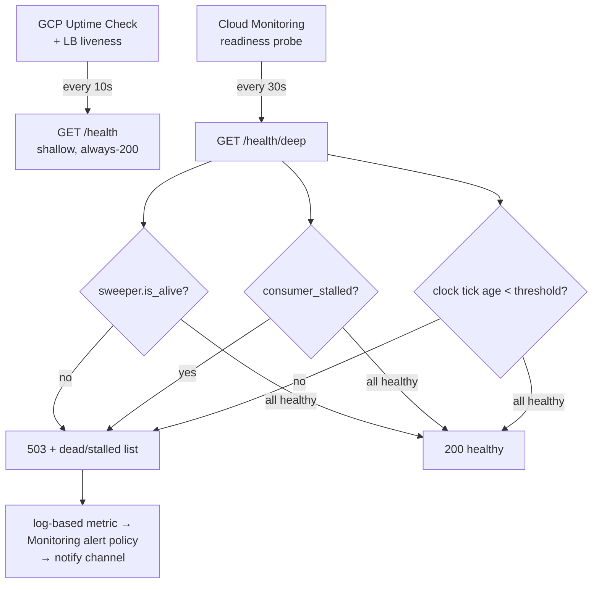

#### 8.2.3 Cloud Logging + metric + alert

- **Structured logging**: 🧩 **STRAW-MAN** wrap the existing `print()` calls behind a thin `cu`-level logger that emits JSON to stdout (Cloud Logging auto-ingests container stdout). Do **not** rip-and-replace all `print()` in Milestone 1 — add a JSON formatter shim so daemon-death and CJ-Flow transition lines (`[CJ-PERSIST]`, `[COMMONS]`, sweeper failures at `running_fifo_queue.py:873`) become queryable. `↩ Flip if:` Rick wants full `logging`-framework migration now → that becomes its own pre-Milestone-1 epic (large blast radius across `src/cosa/`).
- **Log-based metric**: a Cloud Logging metric counting `/health/deep` 503s and the existing `Ghost-job sweeper failed to dead-letter` log line (`running_fifo_queue.py:873`).
- **Alert policy**: fire on (a) any `/health/deep` 503 sustained > 2 evaluation periods, (b) uptime-check failure on shallow `/health`, (c) `consumer_stalled=true` in pool-status, **(d) any HTTP-401 from the Anthropic API in the bounded-CC path** — this is the **OAuth-token-expiry / Max-credit-exhaustion alert (U5 / R1)** that catches a silently-expired `CLAUDE_CODE_OAUTH_TOKEN` (Variant α annual expiry) or a drained 2026-06-15 Agent-SDK credit before the queue stalls. 🧩 **STRAW-MAN** notify channel = email to `ricardo.felipe.ruiz@gmail.com`. `↩ Flip if:` Rick wants voice → route via a cosa-voice `notify()` webhook bridge (a Phase-5 nicety, not Milestone 1).

**Acceptance criteria:**
- [ ] [LUPIN] `GET /health/deep` returns 200 only when sweeper alive AND consumer not stalled AND clock tick fresh; returns 503 + the offending-daemon list otherwise. *(Closes R10.)*
- [ ] [LUPIN] `clock_loop()` records `last_clock_tick_at` each iteration; `RunningFifoQueue.sweeper_alive()` exposes thread liveness.
- [ ] [LUPIN] New INI keys have paired `lupin-app-splainer.ini` explanations.
- [ ] [LUPIN] A unit test kills/mocks each daemon independently and asserts the probe returns 503 naming exactly that daemon (3 cases) + the all-healthy 200 case — **100% line+branch+function coverage** on the probe and the two new accessors.
- [ ] [LUPIN] Cloud Logging ingests JSON daemon-death lines; the log-based metric + alert policy are declared in Terraform (`google_logging_metric`, `google_monitoring_alert_policy`).
- [ ] [LUPIN] An integration test (:8000 scheduled) verifies the probe against a live server with all daemons healthy returns 200.
- [ ] [LUPIN] **OAuth-rotation alert (U5 / R1):** the alert policy includes a rule firing on Anthropic-401 in the bounded-CC path; a secret-rotation runbook (`docs/runbooks/oauth-rotation.md`) documents the annual `setup-token` / re-login procedure and is referenced by the alert. *(Closes the §3 U5 + §12 Day-2-IAM coverage gap.)*

---

### 8.3 DR / Restore — Cloud SQL backups + PITR, GCS Object Versioning, tested runbook

**The gap (survey §7.5)**: the only backup tool today is `docker exec ... pg_dump`, which **cannot reach managed Cloud SQL** (no container to `exec` into). There is currently **no working RPO/RTO/restore runbook**. Compounding this: **migrations are NOT run automatically at startup** — `run-fastapi-lupin.sh` is literally `cd /var/lupin/src && python3 -m fastapi_app.main` (no `alembic upgrade`), and `docker/lupin/Dockerfile:284` `CMD`s that script (verified in §7.3.3). This matters for restore: a PITR restore lands at a schema revision, so the restore runbook must record/restore the Alembic head alongside the data — and because migration is a deliberate pre-deploy step (not a boot-time action), the restore runbook re-runs that same step explicitly rather than relying on a restart to re-migrate.

#### 8.3.1 Cloud SQL automated backups + PITR

🧩 **STRAW-MAN** (provision-new per D4, PostgreSQL 16, `us-central1` per D3 — these numbers DERIVE from the §6 §3.2 backup row; that row is the single source):
- Automated daily backups + **point-in-time recovery** (binary logging / WAL archiving enabled) on the provisioned Cloud SQL PG16 instance.
- **RPO = 5 minutes** (PITR transaction-log granularity), **RTO = 30 minutes** (clone-from-PITR + repoint connection name). `↩ Flip if:` Rick states a tighter RPO/RTO → enable HA (regional) + read replica, raising cost.
- Backups retained 7 days (🧩 **STRAW-MAN**; `↩ Flip if:` compliance needs more → extend, noting cost).
- Backup destination follows the dedicated-drive principle only for *off-cloud* dumps; managed backups live in GCP-managed storage (the backups-only-to-dedicated-drive rule applies to *local* backup scripts, not managed Cloud SQL).

#### 8.3.2 GCS Object Versioning

- Enable **Object Versioning** on the LanceDB bucket(s) and deep-research bucket(s) — LanceDB is append-only (survey §3) so versioning gives point-in-time table recovery without a separate snapshot job.
- 🧩 **STRAW-MAN** lifecycle: keep noncurrent versions 14 days. `↩ Flip if:` LanceDB store grows toward the 41 GB ceiling (survey §3) and versioning cost bites → shorten to 7 days.
- ⚠️ IAM note (survey §7.3): grant the runtime SA `roles/storage.objectUser` per-bucket, **NOT** `objectAdmin` — `objectAdmin` lets the app delete its own LanceDB store, defeating versioning's intent.

#### 8.3.3 The tested restore runbook (`docs/runbooks/restore.md`)

The runbook must be **executed and verified**, not just written (CLAUDE.md test-ownership mandate; CLAUDE.local.md "user is never a tester"):
1. **Cloud SQL PITR restore** to a recovery clone via `gcloud sql instances clone <src> <clone> --point-in-time <ts>` (NOT `pg_dump` — explicitly noted as unavailable).
2. Record the **Alembic head** present at the restore point; if an image rollback changes the expected head, run the contraction/expansion reconciliation (see §8.4) via the explicit pre-deploy migration step.
3. **GCS restore**: `gcloud storage cp gs://bucket/obj#<generation> ...` to roll a LanceDB object back to a prior version.
4. **Verification step**: a Python harness (reusing `validate-deployment.py` from §8.1.3) asserts `/health/deep` 200, `/auth/login` works against the restored DB, and a known solution-snapshot row is queryable from the restored LanceDB.

**Acceptance criteria:**
- [ ] [LUPIN] Cloud SQL instance has automated backups + PITR enabled (declared in Terraform `google_sql_database_instance.settings.backup_configuration`); RPO=5 min / RTO=30 min documented. *(Closes R13.)*
- [ ] [LUPIN] Object Versioning enabled on all four GCS buckets via Terraform `versioning { enabled = true }` + lifecycle rules.
- [ ] [LUPIN] Runtime SA bound to per-bucket `roles/storage.objectUser` (not `objectAdmin`).
- [ ] [LUPIN] `docs/runbooks/restore.md` exists AND has been executed against a throwaway recovery clone, with the verification harness passing (results recorded in the runbook).
- [ ] [LUPIN] The verification harness is a committed Python module at **100% coverage**; it reads `LUPIN_API_URL`.
- [ ] [LUPIN] **DR-drill cadence (Day-2 recurrence, §12 coverage gap):** a recurring DR drill is scheduled (🧩 **STRAW-MAN**: quarterly) that re-executes the restore runbook against a fresh clone and re-confirms RPO/RTO as the schema/data evolve — a one-time restore test does not keep RPO/RTO honest. `↩ Flip if:` Rick sets a different cadence or ties the drill to each schema-changing release instead of the calendar.

---

### 8.4 Rollback — version-pinned secrets, expand/contract migrations, image rollback

**The gap (survey §7.6)**: the deploy script mounts the secret as `:latest` (`cloud-run-deploy.sh:140`), which **defeats revision-pinned rollback** (rolling back the image silently keeps the new secret). And because schema changes are applied by a deliberate pre-deploy migration step (§7.3.3 — *not* auto-on-startup), **an image rollback does not itself roll the schema back** — a forward migration applied before the new image served leaves the old image facing a schema it does not expect. (Note: this is the *expand/contract* concern, not the survey's mistaken "migrate-on-startup crash-loop" framing — there is no startup migrate, so the failure mode is schema-ahead-of-code, addressed by expand/contract below.)

#### 8.4.1 Version-pinned secrets

- Replace every `:latest` secret reference with an explicit **version number**, recorded per release alongside the image digest.
- 🧩 **STRAW-MAN**: a release-manifest file (`deploy/releases/<version>.yaml`) records `{image_digest, secret_versions{}, alembic_head}` as one atomic, rollback-able unit. `↩ Flip if:` Rick prefers Terraform-tracked release state → fold this into a Terraform workspace per release.

#### 8.4.2 Expand/contract migrations decoupled from deploy

Adopt the **expand/contract** discipline so schema changes are forward- and backward-compatible across one release boundary, making image rollback safe:
- **Expand** (release N): add columns/tables nullable/defaulted; new code writes both old+new, reads old. Applied as a *separate, gated pre-deploy step* (§7.3.3) — confirmed NOT auto-run on container start.
- **Contract** (release N+1, after N is proven): drop the old columns. This guarantees release N+1's image can always roll back to N's schema.
- The release manifest's `alembic_head` field lets `deploy-to-vm.sh --rollback` detect a head mismatch and refuse-or-reconcile rather than serve a code/schema mismatch.

#### 8.4.3 Image rollback procedure

- Images are **digest-pinned** (§8.1.2 Step 5), never `:latest`, so rollback = `deploy-to-vm.sh --promote <previous-digest>` → `compose pull` → `systemctl restart lupin-stack`.
- Procedure documented in `docs/runbooks/rollback.md`: (1) pick prior release manifest, (2) verify its `alembic_head` is ≤ current (expand/contract guarantees compat), (3) repoint secret versions to the manifest's pins, (4) promote the prior image digest, (5) restart, (6) verify via `validate-deployment.py` + `/health/deep`.

**Acceptance criteria:**
- [ ] [LUPIN] No secret is mounted as `:latest` anywhere; every reference is a pinned version recorded in the release manifest. *(Closes R11.)*
- [ ] [LUPIN] A release manifest (`{image_digest, secret_versions, alembic_head}`) is produced per release and is the atomic rollback unit.
- [ ] [LUPIN] Schema changes run via a gated one-shot pre-deploy migration (§7.3.3), NOT in the app container `CMD`; the app `CMD` remains `run-fastapi-lupin.sh` (no implicit `alembic upgrade`). *(Closes R12 — the rollback design now matches the verified no-startup-migrate reality.)*
- [ ] [LUPIN] At least one schema change is shipped through a full expand → contract cycle and an image rollback across that boundary is exercised on :8000 (scheduled) without data loss.
- [ ] [LUPIN] `docs/runbooks/rollback.md` exists and its procedure has been executed once end-to-end (results recorded).
- [ ] [LUPIN] `deploy-to-vm.sh --rollback` and the manifest parser are at **100% coverage**.

---

### 8.5 Client Contract — CORS allowlist, base-URL/WSS/JWT rework, in-container API base URL, cosa-voice MCP

**The gap (survey §7.8)**: two separate client repos consume the API/WebSocket and the move breaks all of them. Concrete evidence from the code:
- **CORS is wide open AND credentialed**: `main.py:951–956` sets `allow_origins=["*"]` *with* `allow_credentials=True` — a combination browsers reject for credentialed requests and a security smell. The inline comment even says "In production, replace with specific origins" (`main.py:953`).
- **Firefox extension** hardcodes `GIB_SERVER_ADDRESS = "http://127.0.0.1:7999"` (`src/lupin-plugin-firefox/js/constants.js:97`) and ships `<all_urls>` host permission — its origin will be `moz-extension://<uuid>`.
- **Mobile app** hardcodes `apiBaseUrl = 'http://10.0.2.2:7999'` and `wsBaseUrl = 'ws://10.0.2.2:7999'` (`src/lupin-mobile/lib/core/constants/app_constants.dart:14–15`); WS default `ws://localhost:7999` (`enhanced_websocket_service.dart:89`). Both are cleartext `http`/`ws`, not `https`/`wss`.

These are **separately-managed repos** (CLAUDE.md §GIT REPOSITORY MANAGEMENT, nested-repo-management skill) — this plan **cannot** edit them. It produces (a) the server-side CORS fix and (b) seed-TODO handoff docs into each repo (cross-project-handoff-doc rule).

#### 8.5.1 Server-side CORS allowlist

🧩 **STRAW-MAN**: replace `allow_origins=["*"]` (`main.py:953`) with an **INI-driven explicit allowlist** read from a new `[Lupin: Baseline]` key `cors allowed origins` (comma-separated, with paired splainer entry). Milestone-1 allowlist:
- `moz-extension://<firefox-extension-uuid>` — the published extension origin (Rick supplies the UUID; 🧩 needs-confirmation).
- The deployed SPA origin (the VM's HTTPS LB hostname / custom domain).
- 🧩 **STRAW-MAN**: localhost dev origins kept only in the `[Lupin: Development]` block, never in a cloud-backed block (`[Lupin: Testing-GCS]` for Milestone 1, nor the future `[Lupin: Production]`).

`↩ Flip if:` Rick wants a regex-matched origin family (e.g. all `*.deepily.ai`) → switch to `allow_origin_regex`. Note: native mobile (Dart/Dio) is **not** browser-CORS-gated — CORS is a browser concern, so the mobile fix is purely base-URL/WSS, not CORS.

#### 8.5.2 In-container API base URL — the commons / cosa-voice agent callback (R7 commons half)

**R7's commons half (survey Phase 4)**: cosa-voice agents and commons-using code call back to the API at a hardcoded `127.0.0.1:7999`. Inside a GCP container that loopback may not resolve to the right surface, and across the GKE split it definitely won't. **🧩 STRAW-MAN**: introduce an injected `LUPIN_API_BASE_URL` env var (default `http://127.0.0.1:7999` to preserve today's behavior) that every in-container agent/commons caller reads instead of a literal, and inject it in the GCP compose profile / GKE manifest. `↩ Flip if:` Rick wants the agents to reach the API through the public LB instead of loopback (e.g. to exercise the real auth path) → set `LUPIN_API_BASE_URL` to the LB hostname.

> **Env-var read-and-set-together discipline:** `LUPIN_API_BASE_URL` MUST land with both its read site (replacing the `127.0.0.1:7999` literals) AND its set site (compose/manifest injection) in the same change — a read with no set is the silent-failure footgun.

#### 8.5.3 cosa-voice MCP as its own deployment unit (R20)

**R20 (survey §7)**: cosa-voice is **a separate stateful MCP process** the whole notification/voice doctrine depends on, and headless interactive asks (`converse()`, `ask_*()`) die with no human decision surface in a GCP deployment. The plan must give it a home — it was previously absent from the topology, the Terraform module list, and the deploy automation. **🧩 STRAW-MAN**:
- Treat cosa-voice as **its own deployment unit** — a sidecar container in the Milestone-1 compose stack (and a separate `Deployment` in the Phase-5 GKE split), provisioned alongside `lupin-rest`, reachable on the Docker bridge / ClusterIP, with its own health check.
- **Wire the decision-proxy auto-answer** for every headless blocking ask: in the deployed (non-interactive) environment, `converse()`/`ask_yes_no()`/`ask_multiple_choice()` route through the decision-proxy so a missing human does not stall a job; `notify()` (non-blocking) is the only voice surface that fires freely.
- The cosa-voice container reads `LUPIN_API_BASE_URL` (§8.5.2) for its own callbacks.

`↩ Flip if:` Rick decides cosa-voice should NOT run in the GCP deployment at all (voice/notification is an on-prem-dev-only concern) → drop the sidecar and disable the MCP-dependent agents in the cloud-backed config block (`[Lupin: Testing-GCS]` for Milestone 1); the decision-proxy auto-answer then becomes the sole path and the notify surface is no-op'd.

#### 8.5.4 Base-URL / WSS / JWT rework (server-side enablers + client handoffs)

- **TLS/WSS**: Milestone-1 VM needs an HTTPS LB (or a Caddy/nginx TLS terminator on the VM) so clients can use `https://`/`wss://` instead of today's `http://`/`ws://`. The in-memory WebSocketManager + single worker demand **session affinity** (survey §5 Ingress row).
- **JWT**: clients already authenticate via JWT (`POST /auth/login` → `tokens.access_token`); `mock_token_email_*` is legacy. The handoff must confirm both clients use real JWT against the new HTTPS origin.

#### 8.5.5 Seed-TODO handoffs (active push, not passive hope)

Per the cross-project-handoff rule, write **one concise handoff doc** (`docs/handoffs/2026.05.30-gcp-client-contract-handoff.md`, ~150 lines) and seed a TODO entry in each client repo pointing to it:
- **Firefox** (`src/lupin-plugin-firefox/`): TODO — replace `constants.js:97` `127.0.0.1:7999` with the deployed `https://` origin; add the extension origin to the server CORS allowlist (coordinate UUID); migrate `http://`→`https://`, `ws`→`wss`.
- **Mobile** (`src/lupin-mobile/`): TODO — replace `app_constants.dart:14–15` and `enhanced_websocket_service.dart:89` hardcoded `10.0.2.2`/`localhost` with the deployed `https://`/`wss://` origin via the existing `ServerContextService` (`server_context_service.dart:73` already supports runtime base-URL swap — use it, don't hardcode).

**Acceptance criteria:**
- [ ] [LUPIN] `main.py` CORS reads an explicit INI allowlist (new `cors allowed origins` key + splainer entry); `allow_origins=["*"]` is gone; `allow_credentials=True` is paired only with concrete origins. *(Closes R16.)*
- [ ] [LUPIN] The cloud-backed config block (`[Lupin: Testing-GCS]` for Milestone 1; the future `[Lupin: Production]`) contains NO localhost origins; the dev block may.
- [ ] [LUPIN] A unit test asserts: allowed origin → CORS headers present; disallowed origin → no `Access-Control-Allow-Origin`; credentialed `*` combination is impossible — **100% line+branch+function coverage** on the CORS-config loader.
- [ ] [LUPIN] **`LUPIN_API_BASE_URL` injected (R7 commons half):** the `127.0.0.1:7999` literals in cosa-voice/commons callers are replaced by reads of `LUPIN_API_BASE_URL`, AND the var is set in the GCP compose profile / GKE manifest in the same change; a unit test covers default-and-override resolution.
- [ ] [LUPIN] **cosa-voice MCP deployed (R20):** the cosa-voice sidecar/Deployment is provisioned (Terraform module + compose/manifest entry), has a health check wired into `/health/deep` or its own probe, and the decision-proxy auto-answer is configured so headless `converse()`/`ask_*()` do not stall jobs; an integration test confirms a headless blocking ask resolves via the proxy rather than hanging.
- [ ] [LUPIN] HTTPS LB (or VM TLS terminator) serves `https://` + `wss://` with WebSocket session affinity; an integration test (:8000 scheduled) opens a `wss://` connection, authenticates with a real JWT, and receives an event.
- [ ] [LUPIN] `docs/handoffs/2026.05.30-gcp-client-contract-handoff.md` exists.
- [ ] [LUPIN] A seed TODO entry exists in BOTH `src/lupin-plugin-firefox/` and `src/lupin-mobile/` referencing the handoff doc (added in those repos' own sessions — this plan only authors the doc + lists the exact edits; it does NOT commit to the nested repos).

---

### 8.6 Cross-cutting notes

- **IaC**: all GCP-side resources in this section (log metric, alert policy, Cloud SQL backup config, GCS versioning + lifecycle, IAM `objectUser` bindings, Artifact Registry repo, the cosa-voice deployment unit) are declared in **Terraform** (straw-man IaC tooling); the build/deploy/validate/migrate scripts are the **thin bash/Python wrappers** evolving the four `cloud-run-*.sh` scripts.
- **Coverage gate**: every new artifact this section introduces — `cloudbuild.yaml` test-gate glue, `deploy-to-vm.sh`, `build-images.sh`, `validate-deployment.py`, `run-db-migrate.sh`, the `/health/deep` probe + `sweeper_alive()`/`last_clock_tick_at` accessors, the CORS-config loader, the `LUPIN_API_BASE_URL` resolver, the release-manifest parser — is held to **100% line+branch+function** (CLAUDE.md §100% COVERAGE MANDATE). `# pragma: no cover` only on genuinely-unreachable defensive branches with a same-line reason.
- **Venue discipline**: probe unit tests and CORS-loader tests run on :7999 (AI-discretionary); the live `/health/deep`, `wss://` JWT, cosa-voice-proxy, and expand/contract rollback tests run on :8000 via `POST /api/test-suite/submit` with a Rick-confirmed `scheduled_at` (monopolize-mode; ask is slot-availability, not budget).

---

## 9. Phase 5 — End-State Migration (GCE VM → GKE)

> **🧩 STRAW-MAN — WHOLE-PHASE TAG:** This entire section is **FUTURE / OPTIONAL** (Phase 5 epic per the survey §12). Milestone 1 (the always-on GCE GPU VM, Approach A, D2) is a **complete, shippable deployment on its own** — nothing here is a prerequisite for going live. This section describes the *migration into the managed end-state* and exists so Rick can see the destination before committing to the first step. **↩ Flip if:** Rick decides the GCE VM is the permanent home (manual ops acceptable indefinitely) — then this entire section becomes "won't do" and the survey's Approach A is the terminal state, not a milestone.

This is the bridge from the survey's **Approach A** (D2: single GCE VM running `docker-compose` near-verbatim) to **Approach B** (D2: GKE CPU compute pod + GPU model-server pod). Four workstreams gate the migration, in dependency order:

1. **Finish the model-server carve-out** (Phase 4 of the carve-out R&D — the only *not-yet-done* part) so the compute container is genuinely CPU-only.
2. **Image slimming** (Tier-2 multi-stage + Tier-3 GCS-FUSE) to bring `lupin:1.0.0` from 31.7 GB under the ~15 GB target that GKE rolling-restarts/CI tolerate.
3. **GKE manifests** — CPU `Deployment` (replicas=1), GPU node-pool `Deployment`, HPA explicitly OFF, Workload Identity, Ingress/Gateway with WebSocket session affinity.
4. **Distributed-state epic** (Memorystore/Pub-Sub/Cloud Tasks) — the *only* thing that would ever unlock replicas>1, and explicitly **out of scope** per D6.

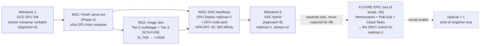

---

### 9.1 WS1 — Finish the model-server carve-out (strip GPU reservations from the compute containers)

**Ground truth — what's DONE and what's NOT.** The carve-out (`src/rnd/v0.1.7/2026.05.16-model-server-carveout/`) is **mostly complete**:

- The `lupin-model-server` container exists, runs, and bakes all three models at build time (`docker-compose.yml:52-116`; image `lupin-model-server:0.1.0`, ~20.1 GB).
- The runtime config switch (`model server local mode` / `model server url`) and the dependency-flip in `routers/speech.py` + `routers/embeddings.py` + `embedding_provider.py` are designed and built (`01-design.md:73-91`).
- **Phase 5 is closed at 110/110 tests, 100% coverage on both new files** (`92-phase5-closure.md:14-52`).

What is **NOT done** is **Phase 4 — compute-side cleanup** (`92-phase5-closure.md:179`; `01-design.md:89`). The live `docker-compose.yml` still reserves the GPU on *both* compute containers:

- `lupin-rest-dev`: `deploy.resources.reservations.devices` at **`docker-compose.yml:175-181`**.
- `lupin-rest-test`: same block at **`docker-compose.yml:257-263`**.

And the compute image still bakes the three models it no longer needs in carved mode (`docker/lupin/Dockerfile:208-210`):

```
208  RUN python -c "...snapshot_download( repo_id='distil-whisper/distil-large-v3' )"
209  RUN python -c "...SentenceTransformer( 'nomic-ai/CodeRankEmbed', ... )"
210  RUN python -c "...AutoModel.from_pretrained( 'nomic-ai/nomic-embed-text-v1.5', ... ); AutoTokenizer.from_pretrained( 'bert-base-uncased' )"
```

Until Phase 4 lands, the compose comment (`docker-compose.yml:44-49`) is explicit: *"compute containers keep loading their own models in-process."* This is exactly why **Milestone 1 (GCE VM) needs the GPU** — the compute container is still GPU-coupled on the VM, and that is fine for Approach A. The carve-out's payoff is realized only at the **GKE split**, where the CPU pod must NOT request a GPU.

**Why WS1 must precede the GKE move.** A GKE CPU `Deployment` schedules onto a CPU node pool with no `nvidia.com/gpu` resource available. If the compute container still calls `cuInit()` at lifespan (the eager GPU pre-warm at `main.py:619-657`, per `01-design.md:35,99`), the pod crash-loops on a CPU node. WS1 flips `model server local mode = False` in the production config block and proves the compute process **never touches CUDA** — the same structural fix that killed the dev doom-loop (`01-design.md:93-101`).

**🧩 STRAW-MAN:** Phase 4 deliverables are executed **on the GCE VM first** (Approach A keeps the model-server as a sibling compose service), so the carve-out is exercised on real GCP infra before the GKE topology change. **↩ Flip if:** Rick wants Phase 4 finished *before* any GCP move (purely local validation) — then WS1 lands on the dev host and the VM inherits an already-carved compose.

**Acceptance criteria — WS1 ("compute is CPU-only"):**

- [ ] [LUPIN] `deploy.resources.reservations.devices` removed from BOTH `lupin-rest-dev` (`docker-compose.yml:175-181`) and `lupin-rest-test` (`docker-compose.yml:257-263`).
- [ ] [LUPIN] `depends_on: lupin-model-server: condition: service_healthy` added to both compute services (per `01-design.md:89`; currently they only `depends_on: postgres`).
- [ ] [LUPIN] Model pre-downloads at `docker/lupin/Dockerfile:208-210` removed from the **compute** image (they remain baked in the model-server image only).
- [ ] [LUPIN] Production config block sets `model server local mode = False`; a startup assertion fails loudly if the compute process attempts in-process model load while `local mode = False`.
- [ ] [LUPIN] `nvidia-smi` inside the compute container shows **no** allocated context; `CUDA_VISIBLE_DEVICES` is unset/empty for compute.
- [ ] [LUPIN] Existing carve-out unit suite (110 tests, `92-phase5-closure.md:33`) still green; **new** Phase-4 cleanup logic (the `local mode=False` startup guard) reaches **100% line+branch+function coverage** (Lupin hard gate for new code).
- [ ] [LUPIN] Container preflight extended (the deferred carve-out Phase 6, `92-phase5-closure.md:180`): `test_container_preflight.py` asserts `lupin-model-server` is in `docker ps`, healthy, and `:7998/health` returns 200; compute containers assert **no** GPU device present.

---

### 9.2 WS2 — Image slimming (31.7 GB → < 15 GB target)

**Ground truth.** The image-bloat path is documented at `src/rnd/v0.1.7/2026.04.27-drop-recursive-chown-image-bloat-audit.md`; the survey records Tier 0+1 done (130 GB → 31.7 GB) with **Tier 2/3 designed but not built** (survey §8). Two fat layers remain:

| Tier | Target | Removes | Mechanism | Est. drop |
|---|---|---|---|---|
| **Tier-2** | CUDA dev toolkit | `cuda-toolkit-12-4` + `build-essential`/`ninja-build` used only to compile flash-attn/autoawq (`docker/lupin/Dockerfile:89`) | **Multi-stage build**: compile flash-attn in a `devel` builder stage, copy only the built wheel into a slim runtime stage on `nvidia/cuda:12.4.1-base-ubuntu22.04` (already the base, `Dockerfile:32`) | **~6 GB** |
| **Tier-3** | Baked HF models | `distil-large-v3` + 2 nomic encoders + `bert-base-uncased` baked at `Dockerfile:208-210` | **GCS-FUSE** mount of the HF cache (model-server pod only) — compute image stops baking them entirely (folds into WS1) | **~13 GB** |

The LanceDB precedent is already in the Dockerfile: `Dockerfile` comment "Lance DB intentionally NOT copied — sourced at runtime via host bind-mount … or GCS-FUSE in production (Tier 3). Was 41 GB of dead weight." Tier-3 applies the same externalization to the HF model cache.

**Why < 15 GB matters for GKE specifically (and NOT for the VM).** A GCE VM (D7) pulls the 31.7 GB image **once** at boot and never again — image size is irrelevant to steady-state. GKE is different: rolling restarts, node autoscaler replacements, and CI promotion all re-pull. A 31.7 GB image makes pod cold-start and node-replacement latency punishing (and stacks against the survey's already-serial cold-start chain, §6 MED row, Whisper 30-35 s + LanceDB GCS warmup). The < 15 GB target is the gate that makes GKE rolling deploys tolerable.

**🧩 STRAW-MAN:** Tier-2 multi-stage is built **before** the GKE move but the **target floor is < 15 GB**, not the absolute minimum — Tier-3 GCS-FUSE is applied **only to the model-server pod** (the compute pod sheds models entirely via WS1, so it doesn't need GCS-FUSE for models). **↩ Flip if:** profiling shows the carved compute image is already < 15 GB after WS1 + Tier-2 alone (models gone, toolkit gone) — then Tier-3 GCS-FUSE is **not required at all** for the compute pod and applies solely to the GPU model-server pod's warm-swap story. **↩ Flip if:** Rick later targets Cloud Run (Approach C) — Cloud Run **cannot mount GCS-FUSE**, forcing a startup model-download instead; that constraint (survey §10 Approach C cons) does not apply to GKE.

**Acceptance criteria — WS2 ("image fits GKE"):**

- [ ] [LUPIN] `docker/lupin/Dockerfile` refactored to a multi-stage build: a `cuda:12.4.1-devel` builder stage compiles flash-attn (`Dockerfile:89,198`), runtime stage on `cuda:12.4.1-base` copies only built artifacts.
- [ ] [LUPIN] CUDA dev toolkit (`cuda-toolkit-12-4`, `build-essential`, `ninja-build`) absent from the final runtime layer; verified via `docker history` size delta (~6 GB drop).
- [ ] [LUPIN] Compute image no longer bakes any HF model (folds WS1 `Dockerfile:208-210` removal); model-server image either keeps baked models OR mounts them via GCS-FUSE (decision per the flip above).
- [ ] [LUPIN] Final **compute** image **< 15 GB** (`docker image ls` evidence committed to the migration log).
- [ ] [LUPIN] flash-attn import smoke test passes in the slimmed runtime image (proves the copied wheel + runtime CUDA libs are sufficient — no dev toolkit needed at runtime).
- [ ] [LUPIN] Image build is reproducible via `cloudbuild.yaml` on a custom CUDA builder (survey §5 "no `cloudbuild.yaml` exists" — authored as part of the GKE move, §8.1.2); any **new** build-gate script (secret-scan, size-assertion) ships at 100% coverage.
- [ ] [LUPIN] GCS-FUSE mount (if used) is read-only for the model cache; IAM uses `storage.objectViewer` on the model bucket (NOT `objectAdmin` — survey §7.3 least-privilege).

---

### 9.3 WS3 — GKE manifests (the topology change)

**Target topology (Approach B, survey §10):** finish-carve-out → CPU compute pod (replicas=1) + GPU model-server pod, Cloud SQL + GCS via Workload Identity, Secret Manager, HTTPS LB with WS session affinity.

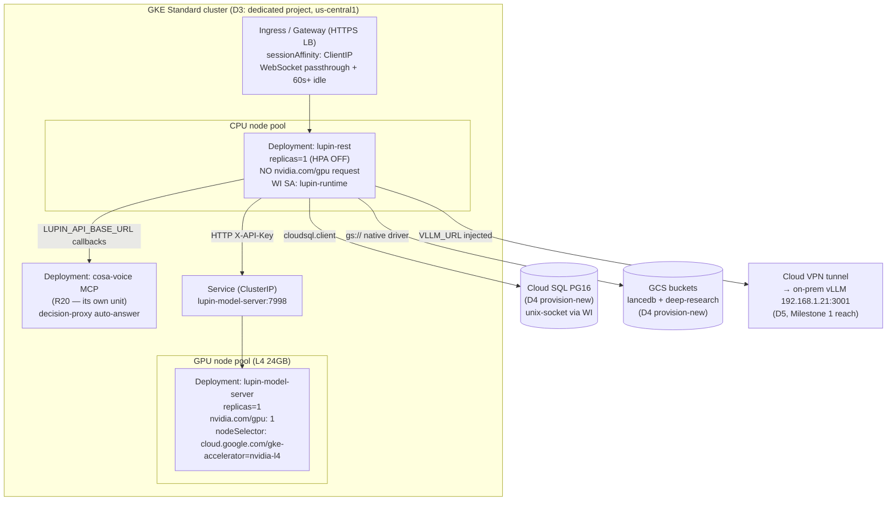

**Manifest-by-manifest straw-man:**

- **CPU compute `Deployment` — `replicas: 1`, HPA explicitly DISABLED (D6).** The singleton architecture (survey §4.2: in-memory FIFO queues, ThreadPoolExecutor pool, ghost-sweeper/consumer/clock daemons, in-memory `WebSocketManager`) forbids >1 replica. **No `HorizontalPodAutoscaler` object is created at all** — and a `PodDisruptionBudget` with `maxUnavailable: 0` plus `strategy: Recreate` (NOT `RollingUpdate`) guarantees the singleton is never briefly doubled during a deploy. **🧩 STRAW-MAN:** `strategy: Recreate` (accept a few seconds of downtime per deploy) over `RollingUpdate maxSurge:0`. **↩ Flip if:** Rick requires zero-downtime deploys before the distributed-state epic — then `RollingUpdate` with `maxSurge: 0, maxUnavailable: 1` and a hard readiness gate, accepting a brief no-pod window instead of a double-pod window.

- **GPU model-server `Deployment` — `replicas: 1`, `nvidia.com/gpu: 1`, `nodeSelector: cloud.google.com/gke-accelerator: nvidia-l4`.** Decouples GPU from the compute pod's restarts (survey §5: "decouples GPU from uvicorn reload thrashing — the CUDA Error 804 root cause"). **🧩 STRAW-MAN:** **L4 24 GB**. **↩ Flip if:** concurrency/throughput on Whisper transcription demands more parallel inference — step to A100 40 GB (survey §5 alternative).

- **cosa-voice MCP `Deployment` (R20).** Carried forward from §8.5.3 — cosa-voice is its own deployment unit in the GKE split, with the decision-proxy auto-answer wired so headless blocking asks resolve rather than hang.

- **Workload Identity** binds the `lupin-runtime` KSA to a GCP SA with **least-privilege** (survey §7.3): `cloudsql.client`, `storage.objectUser` (NOT `objectAdmin`), `secretmanager.secretAccessor`, `artifactregistry.reader`. Build SA is **separate** from runtime SA.

- **Ingress / Gateway with WebSocket session affinity.** The in-memory `WebSocketManager` + single worker (survey §5 Ingress row) demands **sticky routing**. With replicas=1 affinity is trivially satisfied today, but the manifest declares `sessionAffinity: ClientIP` (or a `BackendConfig` with `affinityType: GENERATED_COOKIE`) so the contract is correct *before* replicas>1 is ever attempted. The LB MUST pass WSS and tolerate the **60 s idle timeout vs 30 s heartbeat** mismatch — set backend timeout ≥ 3600 s for the `/ws/queue` and `/ws/audio` paths.

- **Deep readiness probe (survey §7.1, Day-2 gap).** The GKE `readinessProbe` MUST hit `/health/deep` (§8.2) asserting all three daemon threads are alive — otherwise a one-replica deployment turns a dead daemon into a silent total outage.

- **Startup probe ≥ 300 s** (survey §6 MED): Whisper 30-35 s load + LanceDB GCS warmup can exceed default probe timeouts; budget the full serial cold-start chain.

- **`LUPIN_ROOT` path drift fix** (survey §6 HIGH): the manifests inject `LUPIN_ROOT=/var/lupin` (matching the image bake), **not** `/app`; a startup assertion confirms `${LUPIN_ROOT}/src/conf/lupin-app.ini` exists.

- **D5 vLLM reach via Cloud VPN** is inherited from Milestone 1 — GKE pods reach `192.168.1.21:3001` through the same Cloud VPN tunnel, with the hardcoded IP refactored to an injected `VLLM_URL` env var (survey §5). A Vertex/GKE re-home of the vLLM farm is a separate Phase-5 epic (D5), not part of this migration.

**Acceptance criteria — WS3 ("GKE manifests ready"):**

- [ ] [LUPIN] CPU `Deployment` manifest: `replicas: 1`, **no `nvidia.com/gpu` request**, `strategy: Recreate` (or flipped per straw-man), Workload Identity KSA annotation, `LUPIN_ROOT=/var/lupin`, `LUPIN_CONFIG_MGR_CLI_ARGS` selects `[Lupin: Production]`.
- [ ] [LUPIN] **No `HorizontalPodAutoscaler` object exists** in any manifest (HPA explicitly disabled, D6); a CI lint asserts its absence so a future commit can't silently add one.
- [ ] [LUPIN] `PodDisruptionBudget maxUnavailable: 0` guards the singleton; no deploy path can produce 2 simultaneous compute pods.
- [ ] [LUPIN] GPU `Deployment` manifest: `replicas: 1`, `nvidia.com/gpu: 1`, L4 `nodeSelector`, `ClusterIP` Service on 7998, model-server API-key auth wired via Secret Manager.
- [ ] [LUPIN] cosa-voice MCP `Deployment` provisioned (R20) with decision-proxy auto-answer; headless blocking-ask integration test resolves via proxy.
- [ ] [LUPIN] Ingress/Gateway: HTTPS LB, `sessionAffinity: ClientIP` (or cookie), WSS passthrough verified on `/ws/queue` + `/ws/audio`, backend idle timeout ≥ 3600 s.
- [ ] [LUPIN] Runtime SA has `storage.objectUser` (NOT `objectAdmin`), `cloudsql.client`, `secretmanager.secretAccessor`, `artifactregistry.reader`; build SA is distinct.
- [ ] [LUPIN] Deep readiness probe asserts sweeper + consumer + clock daemon liveness; startup probe `initialDelaySeconds`/`failureThreshold` budget ≥ 300 s.
- [ ] [LUPIN] WebSocket smoke suite (50 tests, `src/scripts/run-websocket-smoke-tests.sh`) passes against the GKE Ingress (sticky routing + WSS confirmed end-to-end).
- [ ] [LUPIN] All new manifests are **Terraform-managed** (IaC straw-man: `google_container_cluster`, `google_container_node_pool` ×2, k8s provider manifests); any new Terraform module reaches 100% on its validation/probe scripts; thin bash wrappers evolve the four `cloud-run-*.sh` scripts (survey §8) for build/deploy.

---

### 9.4 The separate distributed-state epic (the ONLY unlock for replicas>1)

**Explicitly OUT OF SCOPE (D6).** Everything above keeps `replicas=1` / `min=max=1`, always-on. The GKE move does **not** make Lupin horizontally scalable — it makes the singleton *managed*. Crossing into replicas>1 requires dismantling every in-memory singleton from survey §4.2, which is a distinct future epic:

| In-memory singleton (survey §3, §4.2) | Distributed replacement | GCP service |
|---|---|---|
| 5 in-memory FIFO queues (todo/running/done/dead + audio) | Durable shared queue backing | **Cloud Tasks** or **Pub/Sub** |
| ThreadPoolExecutor agentic pool | Distributed worker leasing / dedup | Pub/Sub + lease semantics |
| Ghost-sweeper / consumer / clock daemons (per-process) | Single-leader election so daemons don't N-fire | Memorystore-backed lock / leader lease |
| In-memory `WebSocketManager` (connection/session/subscription state) | Shared connection registry + cross-pod fan-out | **Memorystore (Redis)** pub-sub |
| 60 s clock heartbeat + scheduled-job recovery | Distributed scheduler that survives any single pod | Cloud Tasks / Cloud Scheduler |

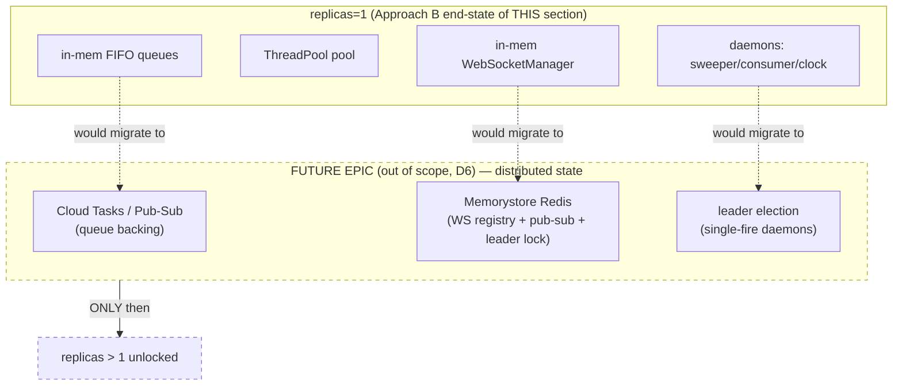

**🧩 STRAW-MAN:** This epic is **deferred indefinitely** — it is named here only so the architecture's scaling ceiling is explicit, not because any work is planned. **↩ Flip if:** load on the single always-on pod exceeds one-process capacity (CPU saturation, queue backlog, WS connection limits) — *then* the distributed-state epic gets scheduled, and only then does replicas>1 become reachable. Until that pressure exists, replicas=1 is the correct, cheapest, lowest-risk posture.

---

### 9.5 Acceptance criteria for "READY TO MIGRATE" (Milestone 1 → Approach B)

The gate that says the GKE migration may begin. All must hold:

- [ ] [LUPIN] **WS1 complete** — carve-out Phase 4 landed and validated *on the GCE VM*: compute container proven CPU-only (no `cuInit()`, no `nvidia.com/gpu`), model-server reachable over HTTP, 110-test carve-out suite + new Phase-4 guard at 100% coverage.
- [ ] [LUPIN] **WS2 complete** — compute image **< 15 GB**; `cloudbuild.yaml` builds it reproducibly on a custom CUDA builder.
- [ ] [LUPIN] **WS3 manifests authored + Terraform-managed** — CPU Deployment (replicas=1, HPA-absent, Recreate, WI), GPU Deployment (L4, replicas=1), cosa-voice MCP Deployment (R20), Ingress (WSS + sticky + ≥3600 s), deep readiness probe, ≥300 s startup probe, least-privilege split SAs.
- [ ] [LUPIN] **D8 secret hygiene HARD GATE cleared** (Phase-1 prerequisite): `src/conf/keys/` (11 files) excluded from the production image, scrubbed from git history (requires Rick's explicit go-ahead for the rewrite), exposed keys rotated, secret-scan build gate live. **No image reaches a remote registry until this is green.**
- [ ] [LUPIN] **Storage/SQL cutover proven on the VM first** (§7) — `storage_backend=gcs` flipped, LanceDB GCS integration suite green (xfail removed, §7.2), Cloud SQL PG16 connected via unix-socket + the **pre-deploy Alembic migration step run to head** (NOT auto-on-startup — §7.3.3). The VM de-risks this before GKE inherits it.
- [ ] [LUPIN] **D5 vLLM reachability confirmed from GKE** — Cloud VPN tunnel to `192.168.1.21:3001` verified from a pod; hardcoded IP refactored to injected `VLLM_URL`; cross-cloud latency budget measured (R15).
- [ ] [LUPIN] **Day-2 readiness wired** (§8) — Cloud Logging shipping, uptime check + deep-daemon probe, DR/restore runbook tested against Cloud SQL (with DR-drill cadence scheduled), version-pinned secrets + expand/contract migrations for rollback, CORS allowlist + `LUPIN_API_BASE_URL` for mobile/Firefox/commons clients, cosa-voice MCP deployed.
- [ ] [LUPIN] **Four-tier merge gate green** (CLAUDE.md PR requirements) against a GKE staging deploy: unit → WebSocket smoke → E2E UI + visual → integration (FINAL gate), each 100% pass, before promoting the GKE topology to production.
- [ ] [LUPIN] **Distributed-state epic confirmed NOT triggered** — replicas=1 explicitly re-affirmed by Rick at migration time (D6); migrating to GKE does not silently invite scale-out.

**↩ Flip the whole gate if:** Rick decides the GCE VM is permanent (this section becomes "won't do"), OR decides to skip Milestone 1 and go straight to GKE (then WS1+WS2+WS3 become the *first* milestone and the "validate on VM first" criteria are dropped — accepting more risk for fewer steps).

---

## 10. Cost Model

> Addresses the survey §7.2 gap ("no dollar figure for any approach; a continuous GPU with no scale-to-zero is the cost floor"). All figures are GCP **on-demand list price**, **`us-central1` (Iowa)**, **24×7 (730 hrs/mo)** — because D6 defers scale-to-zero (`min=max=1`, always-on). On-demand only — no committed-use discount (CUD) is assumed for the straw man.
>
> **🧩 STRAW-MAN — the per-milestone TOTALS (≈$896, ≈$1,059) are themselves straw-man, not settled anchors.** Every dollar line below depends on un-measured load assumptions; the derived totals are only as real as those inputs. Where the totals are cited in this section's own ACs or in §9/§11 budget-alert ACs, they are explicitly flagged as straw-man figures to be replaced by measured numbers. ↩ **Flip if:** any Shared-Assumption value below is measured and differs — the total recomputes.

### 10.1 Shared Assumptions (Rick: adjust these and the totals recompute)

🧩 **STRAW-MAN** — every number below is an explicit lever, not a fact about Lupin's real load. The survey never measured production traffic; these are first-cut estimates.

| Assumption | Straw-man value | Source / rationale | ↩ Flip if |
|---|---|---|---|
| Uptime | 730 hr/mo (24×7) | D6 always-on, no scale-to-zero | Flip to scheduled on/off → multiply GPU line by duty cycle |
| Region | `us-central1` | D3; deploy script `cloud-run-deploy.sh:49` | Flip on D3 confirmation (other regions ±10-20%) |
| GPU SKU | **L4** (`g2-standard-8`) Milestone-1 default | Survey §5: "L4 24 GB cost-efficient"; model VRAM only ~2.9 GB (survey §3) so L4's 24 GB is ample | Flip to A100 if concurrency demands it (~4.3× the GPU line) |
| Boot/OS disk | 200 GB `pd-balanced` | Must hold the 31.7 GB app + 20.1 GB model-server images (D7 defers slimming) + headroom | Flip to 100 GB pd-ssd if image-slim (D7) lands earlier |
| Cloud SQL tier | `db-custom-2-7680` (2 vCPU / 7.5 GB), Enterprise ed., Zonal (no HA) | D4 + survey §5 recommendation (sized for the prod pool; the GCP test env runs the smaller test pool and can likely downsize — §7.3.4) | Flip down to a smaller tier for the test pool (§7.3.4); or up to Enterprise-Plus/Regional-HA → roughly +60-100% on the SQL compute line |
| Cloud SQL data disk | 50 GB SSD + automated backups | Lupin Postgres is small; survey §3 | Flip up if `PredictionLog`/`job_history` grow large |
| GCS stored data | 50 GB Standard | LanceDB lower band ~855 MB but upper band 41 GB (survey §3/§7); deep-research markdown is tiny | Flip to 41-100 GB if LanceDB grows to its upper band |
| Internet egress | 50 GB/mo | SPA assets + API/WS responses to mobile/Firefox/browser clients (survey §7.8) | Flip up sharply if media/TTS audio streams dominate |
| **vLLM egress (the hot one)** | 100 GB/mo cross-cloud → on-prem `192.168.1.21:3001` over Cloud VPN | D5; survey §7.9 — fine-tuned-model calls are a hot path | Flip up a lot if fine-tuned models carry the bulk of inference traffic |
| Artifact Registry | 120 GB stored (≈2 versions each of 31.7 GB + 20.1 GB images + layers) | D7 defers slimming → images stay large; survey §3 | Flip down hard once Tier-2/Tier-3 slimming (D7) lands |
| Cloud Build | 1,000 build-min/mo on a 32-vCPU private pool (flash-attn nvcc compile needs RAM, survey §5) | New `cloudbuild.yaml` (none exists today, survey §5) | Flip down if builds are infrequent; default pool is cheaper but OOMs per survey §5 |

---

### 10.2 Milestone 1 — Single always-on GCE GPU VM (Approach A)

One VM runs `docker-compose` almost verbatim; Cloud SQL + GCS swapped in. Uniquely preserves the D1 Max-plan OAuth path (survey §10 Approach A). **This table now includes the managed HTTPS LB line** — §2.4 / §8.5 / §11 all require a managed HTTPS LB at Milestone 1 (for WSS + session affinity + managed TLS), so the cost model carries it. (The earlier "reach the VM directly, no LB" note is retired.)

| Line item | Config | Unit rate (us-central1) | Qty | Monthly |
|---|---|---|---|---|
| **GCE GPU VM** | `g2-standard-8` (1× L4, 8 vCPU, 32 GB) | **$0.8536/hr** ([Economize][1], [CloudPrice][2]) | 730 hr | **$623.13** |
| Boot/OS disk | `pd-balanced` | **$0.10/GB-mo** ([gcloud-compute][3], [GCP disks][4]) | 200 GB | **$20.00** |
| **Cloud SQL compute** | `db-custom-2-7680`, Enterprise, zonal | 2 vCPU × $0.0413/hr + 7.5 GB × $0.007/hr = **$0.1351/hr** ([Usage.ai][5], [GCP SQL][6]) | 730 hr | **$98.62** |
| Cloud SQL storage | SSD | **$0.17/GB-mo** ([GCP SQL][6]) | 50 GB | **$8.50** |
| Cloud SQL backups | automated backup storage | **$0.08/GB-mo** ([GCP SQL][6]) | ~50 GB | **$4.00** |
| GCS storage | Standard | **$0.020/GB-mo** ([GCP Storage][7], [LeanOps][8]) | 50 GB | **$1.00** |
| GCS internet egress | first 1 TB tier | **$0.12/GB** ([GCP Storage][7], [LeanOps][8]) | 50 GB | **$6.00** |
| Artifact Registry | image storage | **$0.10/GB-mo** ([GCP AR][9]) | 120 GB | **$12.00** |
| Cloud Build | private pool (e2-highcpu-32-class) | ~**$0.016/build-min** ([GCP Build][10]) (default pool $0.003/min but OOMs) | 1,000 min | **$16.00** |
| **HTTPS Load Balancer** | 1 global forwarding rule + WSS/affinity + managed cert | ≈**$0.025/hr** + data ([GCP Network][12]) | 730 hr | **$18.25** |
| **Cloud VPN** (D5) | 1 HA-VPN tunnel | **$0.10/tunnel-hr** ([GCP VPN][11], [Network Conn][12]) | 730 hr | **$73.00** |
| VPN egress → on-prem | internet egress to private endpoint | **$0.12/GB** (first 1 TB) ([GCP Storage][7]) | 100 GB | **$12.00** |
| External static IP | 1 reserved IP on the VM | ~**$0.005/hr** ([GCP VM pricing][13]) | 730 hr | **$3.65** |
| **MILESTONE-1 TOTAL** 🧩 straw-man figure | | | | **≈ $896.15 / mo** |

🧩 **STRAW-MAN** GPU = L4. Same table with **A100** (`a2-highgpu-1g` @ **$3.6734/hr** ([Economize][14], [Vantage][15]) → $2,681.58/mo) swaps the top line and lands the milestone at **≈ $2,954 / mo**.
↩ **Flip if**: model-server concurrency saturates a single L4 (survey §3 shows only ~2.9 GB VRAM in use today, so L4 is the straw-man default; A100 is the over-provision option). ↩ **Flip the LB line away if**: Rick takes the §2.4 flip to a Caddy/nginx TLS terminator on the VM — then drop the $18.25 HTTPS-LB line and the total falls to ≈$878/mo.

---

### 10.3 End-State — GKE hybrid: CPU compute pod + GPU model-server pod (Approach B)

Carve-out finished (lupin-rest CPU-only), `replicas=1` on a CPU node pool, model-server on a GPU node pool, HTTPS LB with WS session affinity (survey §5 Ingress row). This is the documented Phase-5 end-state (D2).

| Line item | Config | Unit rate (us-central1) | Qty | Monthly |
|---|---|---|---|---|
| **GKE GPU node** (model-server) | 1× `g2-standard-8` (L4) node, always-on | **$0.8536/hr** ([Economize][1], [CloudPrice][2]) | 730 hr | **$623.13** |
| GPU node disk | `pd-balanced` (model-server image 20.1 GB) | **$0.10/GB-mo** ([gcloud-compute][3]) | 100 GB | **$10.00** |
| **GKE CPU node** (lupin-rest) | 1× `e2-standard-4` (4 vCPU / 16 GB) | ≈**$0.134/hr** ([GCP VM pricing][13]) | 730 hr | **$97.82** |
| CPU node disk | `pd-balanced` | **$0.10/GB-mo** ([gcloud-compute][3]) | 100 GB | **$10.00** |
| **GKE cluster mgmt fee** | 1 Standard cluster (first zonal cluster free; otherwise) | **$0.10/cluster-hr** ([GKE pricing][16]) | 730 hr | **$73.00** |
| Cloud SQL compute | `db-custom-2-7680`, Enterprise, zonal | **$0.1351/hr** ([Usage.ai][5], [GCP SQL][6]) | 730 hr | **$98.62** |
| Cloud SQL storage + backups | 50 GB SSD + 50 GB backup | $0.17 + $0.08 /GB-mo ([GCP SQL][6]) | 50+50 GB | **$12.50** |
| GCS storage + egress | Standard + internet egress | $0.020 + $0.12 /GB ([GCP Storage][7]) | 50 + 50 GB | **$7.00** |
| Artifact Registry | image storage (slimmed under D7 → smaller, but keep buffer) | **$0.10/GB-mo** ([GCP AR][9]) | 80 GB | **$8.00** |
| Cloud Build | private pool | ~**$0.016/build-min** ([GCP Build][10]) | 1,000 min | **$16.00** |
| **HTTPS Load Balancer** | 1 global forwarding rule + WSS/affinity | ≈**$0.025/hr** + data ([GCP Network][12]) | 730 hr | **$18.25** |
| **Cloud VPN** (D5, until Phase-5 vLLM re-home) | 1 HA-VPN tunnel | **$0.10/tunnel-hr** ([GCP VPN][11]) | 730 hr | **$73.00** |
| VPN egress → on-prem | internet egress | **$0.12/GB** ([GCP Storage][7]) | 100 GB | **$12.00** |
| **END-STATE TOTAL** 🧩 straw-man figure | | | | **≈ $1,059.32 / mo** |

🧩 **STRAW-MAN** end-state keeps L4 + zonal (non-HA) SQL + keeps Cloud VPN. The GKE split costs **more** than Milestone 1 (cluster fee + second node), trading dollars for managed health probes, rolling restarts, and CPU/GPU cost separation (survey §10 Approach B pros).
↩ **Flip if**: (a) A100 needed → +~$2,058/mo; (b) HA/regional SQL → +~$99/mo; (c) Phase-5 vLLM re-home to GKE/Vertex retires the VPN → −$85/mo but adds a second GPU pool's cost; (d) D9 managed Speech-to-Text + Vertex embeddings eliminates the GPU node entirely → −$633/mo GPU but adds per-call managed-API spend.

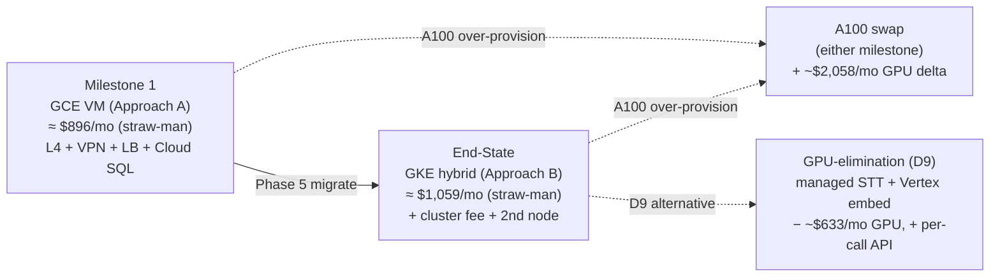

---

### 10.4 Cost driver: the GPU line dominates

In **both** milestones the L4 GPU VM/node (**$623/mo, ~70% of Milestone-1, ~59% of end-state**) is the single largest item, exactly as the survey §7.2 critic predicted. The straw-man levers with the biggest swing, in order:

1. **GPU SKU & duty cycle** — L4→A100 is +$2,058/mo; or scheduling the VM off during idle hours (would require relaxing D6 always-on) saves proportionally. The survey's own §3 VRAM figure (~2.9 GB in use) is the strongest argument the L4 straw-man is right-sized.
2. **D9 GPU elimination** — managed STT + Vertex embeddings deletes the entire GPU node (−$633/mo) but converts it to per-call metered spend; net depends on transcription/embedding volume (un-measured — flag for Rick).
3. **Cloud VPN (D5)** — $85/mo (tunnel + egress) buys the least-change path to the on-prem vLLM farm; a Phase-5 Vertex/GKE vLLM re-home retires it but is a separate epic.

### 10.5 Qualitative note — bounded-CC OAuth (D1) vs billed Anthropic SDK is NOT a line item above

The bounded `ClaudeCodeJob` LLM path (BFE/TFE) does **not** appear in either table because, under **D1 (OAuth on the persistent user-context VM)**, it is **covered by the Max 200 plan as already-paid fixed cost — zero incremental per-token charge**, *as confirmed pre-2026-06-15*: a 10-job probe reported **$2.05 in SDK `cost_usd` telemetry while the Anthropic console credit balance moved $0.00** (CLAUDE.md § "COST MODEL", forensic record `src/rnd/v0.1.7/2026.05.12-bounded-cc-billing-empirical-confirmation.md`).

> **⏰ The 2026-06-15 caveat applies to THIS cost claim (U1, §3).** From 2026-06-15 the Agent-SDK / `claude -p` usage draws from a separate **$200/month Max-20x Agent-SDK credit** that drains first and then **stops** Agent-SDK requests. So "zero incremental per-token charge" is true only **until that monthly credit drains** — and whether BFE/TFE volume stays under the $200 ceiling is U1/U2, **unmeasured**. After 2026-06-15 the honest framing is "zero until the Max-20x Agent-SDK credit is exhausted; thereafter requests stop (or overflow-bill if usage-credits enabled)." This is NOT an unqualified zero, and the §10.6 budget-alert AC must account for the possibility that bounded-CC starts costing money inside the deployment window.

The **D1 documented fallback** — migrating BFE/TFE to the billed Anthropic SDK via `ANTHROPIC_API_KEY_FIREWALLED` — converts that into **real metered per-token spend** against the firewalled account. The dollar amount is **un-estimable here** because it scales with bug-fix/test-fix invocation volume, which the survey never measured (U2). The framing per CLAUDE.md is a **cost-shift, not zero-cost**.

🧩 **STRAW-MAN** — direct-SDK Anthropic spend (firewalled key for deep_research/podcast/presentation) is excluded entirely; it is application-LLM spend, not infrastructure, and is un-measured.
↩ **Flip if**: Rick chooses D1 fallback (b) → add a per-token Anthropic line whose magnitude must first be measured from BFE/TFE invocation logs (U2); or the 2026-06-15 credit drains under real BFE/TFE volume → bounded-CC itself becomes a metered line item even on the straw-man VM.

---

### 10.6 Work this section introduces (acceptance criteria)

Building a *real* (not straw-man) cost model requires measured inputs and an automated guard. Per the Lupin 100% line+branch+function coverage gate, any new probe/script below ships with full-coverage tests.

- [ ] [LUPIN] **Measure, don't assume**: instrument egress (VM/LB → internet, VM → VPN→on-prem vLLM) for one representative week before committing to the 50 GB / 100 GB straw-man egress figures.
- [ ] [LUPIN] **Measure GPU headroom**: confirm `nvidia-smi` peak VRAM on the model-server under load validates the L4 (24 GB) straw-man vs the A100 (40 GB) option — survey §3 says ~2.9 GB today, but that is dev-load, not the GCP test environment under realistic load.
- [ ] [LUPIN] **Confirm D3 project/region** before any rate is treated as final (`us-central1` rates above are void if a different region is chosen).
- [ ] [LUPIN] **Confirm D4 existing resources** via the §4 credential-gated validation — a pre-existing Cloud SQL instance or buckets change the provision-new assumption and may already carry committed-use discounts.
- [ ] [LUPIN] **Author a `gcp-cost-estimate.py` probe** (new code → 100% line/branch/function coverage) that reads the assumption levers from a config block and emits both milestone totals, so Rick can flip a value and re-derive without hand-math.
- [ ] [LUPIN] **Budget alert**: provision a GCP Budget + alert at the Milestone-1 total (≈$896, straw-man) and end-state total (≈$1,059, straw-man) thresholds so the always-on GPU floor cannot silently overrun. **The alert threshold must include a margin for the post-2026-06-15 bounded-CC Agent-SDK spend (U1)** if BFE/TFE volume exceeds the $200 credit — i.e. the budget cannot assume bounded-CC stays at $0 forever.
- [ ] [LUPIN] **Measure U1/U2 bounded-CC volume** (cross-ref §3.6): read BFE/TFE SDK `cost_usd` telemetry over a representative period so the post-2026-06-15 credit-ceiling exposure is a measured number, not an assumption — this feeds both the budget alert and the D1 decision.
- [ ] [LUPIN] **CUD decision gate**: evaluate a 1-year committed-use discount on the always-on GPU VM/node and Cloud SQL once load is confirmed stable — CUD on a 24×7 GPU is the single highest-ROI cost lever (not modeled here; on-demand only per straw-man).

---

**Sources** (GCP us-central1 list prices, May 2026):

[1]: https://www.economize.cloud/resources/gcp/pricing/compute-engine/g2-standard-8/ "g2-standard-8 pricing — Economize"
[2]: https://cloudprice.net/gcp/compute/instances/g2-standard-8 "g2-standard-8 specs and pricing — CloudPrice"
[3]: https://gcloud-compute.com/diskpricing.html "Persistent Disk Pricing in Google Cloud Regions — gcloud-compute"
[4]: https://cloud.google.com/compute/disks-image-pricing "Disk and image pricing — Google Cloud"
[5]: https://www.usage.ai/blogs/gcp/cloud-sql/pricing/ "Google Cloud SQL Pricing 2026 — Usage.ai"
[6]: https://cloud.google.com/sql/pricing "Cloud SQL pricing — Google Cloud"
[7]: https://cloud.google.com/storage/pricing "Storage pricing — Google Cloud"
[8]: https://leanopstech.com/blog/google-cloud-storage-pricing-2026/ "GCS Pricing 2026 — LeanOps"
[9]: https://cloud.google.com/artifact-registry/pricing "Artifact Registry pricing — Google Cloud"
[10]: https://cloud.google.com/build/pricing "Cloud Build pricing — Google Cloud"
[11]: https://cloud.google.com/vpn/pricing "Cloud VPN pricing — Google Cloud"
[12]: https://cloud.google.com/network-connectivity/pricing "Network Connectivity pricing — Google Cloud"
[13]: https://cloud.google.com/compute/all-pricing "VM instance pricing — Google Cloud"
[14]: https://www.economize.cloud/resources/gcp/pricing/compute-engine/a2-highgpu-1g/ "a2-highgpu-1g pricing — Economize"
[15]: https://instances.vantage.sh/gcp/a2-highgpu-1g "a2-highgpu-1g pricing and specs — Vantage"
[16]: https://cloud.google.com/kubernetes-engine/pricing "GKE pricing — Google Cloud"

- [Google Cloud GPU pricing](https://cloud.google.com/compute/gpus-pricing)
- [Accelerator-optimized VM pricing](https://cloud.google.com/products/compute/pricing/accelerator-optimized)

> **Caveat**: List prices are point-in-time (May 2026) and exclude sustained-use and committed-use discounts. The GCE GPU VM in particular qualifies for sustained-use discounts automatically at 24×7, which can trim the GPU line ~20-30% without any commitment — *not* applied above (straw-man uses raw on-demand for a conservative ceiling). Treat every total as **± ~15%** until D3/D4 validation pins the real region, tier, and any pre-existing committed resources.

---

## 11. Testing & Acceptance Strategy

This section binds every phase of the GCP plan to Lupin's existing testing doctrine. The governing rule is **"the user is never a tester"** (`CLAUDE.local.md`): every tier below is executed by the AI, on the correct venue, with results reported in tabular pass/fail form. Rick owns the `:8000` *schedule slot* and the GCP credentials — never tester duty, never budget approval.

Two anchors hold throughout:

1. **Venue routing** (`CLAUDE.md` § TESTING VENUES): `:7999` (dev) is AI-discretionary for non-mutating, ≤2-min, no-monopoly suites; `:8000` (test) is scheduled-monopolize via `POST /api/test-suite/submit` for anything that mutates persistent state, runs >2 min, or needs server monopoly. **When in doubt → :8000.** Every new GCP suite must declare its venue using this rubric, not by folder.
2. **100% coverage gate** (`CLAUDE.md` § 100% COVERAGE MANDATE): all NEW code this plan introduces — Terraform, bash wrappers, the daemon-liveness probe, the LanceDB-GCS fix, deploy-validation rewrites — passes 100% **lines AND branches AND functions**. `pragma: no cover` / `c8 ignore` only for genuinely-unreachable defensive branches with a same-line reason.

> 🧩 **STRAW-MAN**: The venue split assumes the existing `:7999` dev / `:8000` test dual-container model is reproduced on the GCE VM (Milestone 1, D2). A *third* venue is added: **`:cloud`** = the live deployed GCP endpoint (the GCE VM's public URL), validated read-only by the validate script and the new `test_deploy_acceptance.py`.
> ↩ **Flip if:** Rick wants the GCP VM to run a single container (no dev/test split) → then all automated suites move off-box to a local `:7999` harness pointed at `LUPIN_API_URL=<vm-url>`, and `:cloud` becomes the only on-VM venue.

---

### 11.1 Per-phase verification matrix

Phases mirror the survey's §12 phasing. The first table is the at-a-glance map; the subsections below give the concrete suites, commands, and acceptance criteria.

| Phase | What is verified | Venue | Primary command(s) | New code requiring 100% cov |
|---|---|---|---|---|
| **0 — Decisions + credential validation** | GCP env preconditions (project/region/APIs/quota/buckets/SQL/secrets/IAM) match D3–D9 assumptions | `:7999` | `pytest src/tests/smoke/test_gcp_preflight.py -v` | `test_gcp_preflight.py`, `gcp_preflight.py` lib |
| **1 — Pre-deploy hygiene (HARD GATE)** | `LUPIN_ROOT` drift fix; `src/conf/keys/` (11 files) excluded + history scrubbed + keys rotated; project-ID parameterized; startup assertion | `:7999` | `pytest src/tests/unit/test_lupin_root_assertion.py src/tests/smoke/test_secret_scan_gate.py -v` + `bats` | startup assertion, secret-scan gate, bash wrapper tests |
| **2 — Provision (Terraform)** | IaC is valid, planned, idempotent; resources created match plan; IAM least-privilege | `:7999` (validate/plan) → `:cloud` (apply-then-assert) | `terraform validate && terraform plan -detailed-exitcode`; `pytest src/tests/integration/test_terraform_resources.py` | `*.tf` modules (tflint/checkov), Terraform assertion tests |
| **3 — Storage + config cutover** | `storage_backend=gcs` flip works E2E; LanceDB GCS suite xfail removed; Cloud SQL connect + pre-deploy Alembic migrate; data migration | `:8000` (scheduled — mutates GCS + SQL) | `POST /api/test-suite/submit` → `pytest .../test_lancedb_gcs_integration.py` + `test_auth_integration.py` | LanceDB-GCS query-path fix + now-green assertions |
| **4 — Deploy + Day-2 wiring** | Live deploy healthy; daemon-liveness probe; DR restore; rollback; CORS; cosa-voice proxy; observability | `:cloud` (deploy smoke) + `:8000` (integration final gate) | `validate-deployment.py` + `pytest .../test_deploy_acceptance.py`; then full merge gate | daemon-liveness probe + endpoint, `test_deploy_acceptance.py`, DR-restore test, CORS test, cosa-voice proxy test |
| **5 — A→B GKE migration** | Carve-out CPU/GPU split; model-server pod; image-slim parity; full regression re-run on GKE | `:8000` (scheduled) + `:cloud` (GKE endpoint) | full four-tier merge gate against the GKE URL | carve-out probes, GKE readiness/liveness manifests, slimmed-image smoke |

---

### 11.2 Phase 0 — Decisions + credential-gated validation

**What is tested:** that the real GCP environment matches the straw-man assumptions (D3 project/region, D4 buckets+SQL, D5 vLLM reachability, D6–D9). This is the automated form of the survey's §9 credential-unlock checklist.

**Venue: `:7999`** — read-only `gcloud`/SDK probes, no state mutation, <2 min. AI-discretionary once Rick supplies credentials.

**New suite — `src/tests/smoke/test_gcp_preflight.py`** (backed by `src/cosa/utils/gcp_preflight.py`), parameterizing the project via env var (read `GCP_PROJECT_ID`/`GCP_REGION`, never hardcode the sandbox `hello-world-foo-423219`):

- [ ] [LUPIN] Asserts `gcloud config get-value project` equals the **dedicated** project (D3), NOT `hello-world-foo-423219` — fails loudly if the sandbox is still active.
- [ ] [LUPIN] Asserts region == `us-central1` (D3).
- [ ] [LUPIN] Asserts required APIs enabled: Compute Engine, Cloud SQL Admin, Secret Manager, Artifact Registry, Cloud Build (GKE/Vertex deferred to Phase 5).
- [ ] [LUPIN] Asserts GPU quota for the chosen VM accelerator (L4/A100) > 0 in-region.
- [ ] [LUPIN] Probes bucket existence (D4): all four `lupin-*` buckets — records present/absent so Phase 2 knows provision-new vs. adopt.
- [ ] [LUPIN] Probes Cloud SQL PG16 instance existence + `CLOUD_SQL_CONNECTION_NAME` (D4).
- [ ] [LUPIN] Probes Cloud VPN tunnel reachability to `192.168.1.21:3001` (D5) — TCP-connect assertion, no model call.
- [ ] [LUPIN] Enumerates existing secrets vs. the required key set (the 11-file inventory + JWT/DB).

**Coverage:** `gcp_preflight.py` + its test reach 100% line/branch/function. Mock the `gcloud`/SDK boundary so every branch (present/absent/error per resource) is exercised without live calls; a thin live-mode integration variant runs once against real credentials.

> 🧩 **STRAW-MAN**: Preflight probes `gcloud` via subprocess and mocks it for unit coverage.
> ↩ **Flip if:** Rick prefers the google-cloud-python client libraries → swap the subprocess boundary for SDK mocks; venue and ACs unchanged.

---

### 11.3 Phase 1 — Pre-deploy hygiene (HARD GATE, no GCP needed)

**What is tested:** the three pre-deploy fixes (§5) plus the D8 secret-hygiene gate. **This phase is a HARD GATE — no image may be pushed to a remote registry until every box below is green** (D8 AUTHORIZED-PENDING; the git-history rewrite requires explicit Rick go-ahead).

**Venue: `:7999`** — pure unit + script tests, no GCP, no monopoly.

- [ ] [LUPIN] **`LUPIN_ROOT` drift** (`test_lupin_root_assertion.py`): a NEW startup assertion verifies `LUPIN_ROOT/src/conf/lupin-app.ini` exists and fails fast otherwise; the deploy script's injected `LUPIN_ROOT=/app` is corrected to `/var/lupin`. Test asserts both branches.
- [ ] [LUPIN] **Secret-scan build gate** (`test_secret_scan_gate.py` + a `bash` wrapper test): asserts `src/conf/keys/` (11 files) is excluded from the test image layer and a build-time `gitleaks` scan exits non-zero on any stagable key material. Verified by a fixture repo containing a planted fake key → scan must fail.
- [ ] [LUPIN] **Git-history scrub** (`test_history_scrub_verification.py`): after the authorized `git filter-repo` run, asserts `git log --all -p -- src/conf/keys/` returns no key material. (Execution gated on Rick's go-ahead via `ask_yes_no` — destructive op.)
- [ ] [LUPIN] **Project-ID parameterization**: the four `cloud-run-*.sh` scripts read `GCP_PROJECT_ID`/`GCP_REGION` from env (D3), no longer hardcoding `hello-world-foo-423219`. Bash tests assert fail-loud when unset, use-when-set.

**Coverage:** the Python assertion + scan-gate code hit 100%. Bash wrappers are tested with **`bats`** — each script gets a `.bats` file driving every code path (env-set, env-unset, image-found, image-missing, secret-found, secret-missing). 100% applies to bash via branch enumeration.

> 🧩 **STRAW-MAN**: Bash coverage is enforced via `bats` + `kcov`. Where `kcov` cannot instrument a `gcloud`-calling arm, that arm is stubbed and the stub-path is the covered branch.
> ↩ **Flip if:** Rick rejects `kcov` overhead → rewrite the four deploy scripts as a thin Python `click` CLI (Pythonic 100% coverage via `pytest`), keeping bash only as a one-line shim.

---

### 11.4 Phase 2 — Provision (Terraform + thin bash wrappers)

**What is tested:** the IaC is syntactically valid, produces the expected plan, is idempotent (a second apply is a no-op), and the resources created match the declaration with least-privilege IAM (survey §7.3 — `objectUser` not `objectAdmin`).

**Venue: `:7999`** for `validate`/`plan` (read-only, fast, AI-discretionary). **`:cloud`** for the apply-then-assert integration step (it mutates GCP, but it is the deploy act itself, not a `:8000`-server test — coordinate the apply window with Rick).

Static gate (every box runs in CI before any apply):

- [ ] [LUPIN] `terraform fmt -check` — canonical formatting.
- [ ] [LUPIN] `terraform validate` — config is valid.
- [ ] [LUPIN] `terraform plan -detailed-exitcode` — plan succeeds; exit-code 2 (changes) expected on first run, exit-code 0 (no-op) asserts idempotency on re-plan.
- [ ] [LUPIN] `tflint` — provider-rule lint.
- [ ] [LUPIN] `checkov` / `tfsec` — security scan (no public buckets, no `objectAdmin` runtime SA, no `0.0.0.0/0` ingress except the intended HTTPS LB).

Post-apply assertion suite — **`src/tests/integration/test_terraform_resources.py`**:

- [ ] [LUPIN] Asserts each declared resource exists with expected config (bucket region/versioning, Cloud SQL PG16 tier, VM accelerator type, VPN tunnel up).
- [ ] [LUPIN] Asserts the **build SA and runtime SA are split** (survey §7.3) and the runtime SA holds `objectUser` (not `objectAdmin`), `cloudsql.client`, `secretmanager.secretAccessor` — and NO delete permission on the LanceDB bucket.

**Coverage:** Terraform "100%" is interpreted as **every declared resource and variable is exercised by `plan` + at least one assertion**, plus 100% line/branch/function on any wrapper scripts and on the Python assertion test itself.

> 🧩 **STRAW-MAN**: Terraform validate/plan/lint runs locally on `:7999`; `terraform apply` is a manual gated step (not auto-applied in CI) per the no-auto-promote / no-auto-commit discipline.
> ↩ **Flip if:** Rick wants GitOps auto-apply → add a Cloud Build trigger, but keep apply behind a manual approval gate.

---

### 11.5 Phase 3 — Storage + config cutover (the LanceDB-GCS fix)

**What is tested:** the `storage_backend=gcs` flip works end-to-end on real infra, and the **LanceDB GCS integration suite xfail is removed and green** (survey §6 MED, §8 — the query-path / normalization-mismatch bug, root-caused in §7.2). Also: Cloud SQL unix-socket connect + the **pre-deploy Alembic migration step** (NOT auto-on-startup — §7.3.3), and the SQLite→Postgres data migration.

**Venue: `:8000` (scheduled-monopolize)** — this suite **mutates persistent state** (writes Lance tables to `gs://lupin-lancedb-test`, writes DB rows) and exceeds 2 min. It MUST be submitted via `POST /api/test-suite/submit` with a Rick-confirmed `scheduled_at`, `test_types: "integration"`, and `pytest_args` filtering to the GCS suite (the field is `pytest_args`, silently dropped if mis-named; `test_types` is `"integration"`, not `e2e_ui`). **Never side-door via curl / `/api/push`.** Embeddings route through the server's `/api/embeddings/batch` HTTP endpoint so the pytest process never touches GPU 0.

- [ ] [LUPIN] **Root-cause + fix the failing query/retrieval path** in `test_lancedb_gcs_integration.py` (normalization mismatch per §7.2). The fix lands in `src/cosa/memory/lancedb_solution_manager.py`; the fix code reaches 100% line/branch/function via unit tests in `src/tests/unit/test_lancedb_gcs_manager.py`.
- [ ] [LUPIN] The `@pytest.mark.xfail` is removed and all GCS integration tests pass (manager init, CRUD, question-based search, persistence).
- [ ] [LUPIN] `test_auth_integration.py` passes against Cloud SQL (proves unix-socket connect + the **pre-deploy Alembic migration step** ran to head — NOT a boot-time migrate).
- [ ] [LUPIN] A data-migration assertion confirms row-count parity post-`migrate-sqlite-to-postgres.py` (survey §8).

**Coverage:** the LanceDB-GCS fix is NEW behavior-changing code → 100% gate applies. Unit tests (`:7999`) cover every branch of the corrected query path; the integration suite (`:8000`) proves end-to-end behavior. Both tiers required.

> 🧩 **STRAW-MAN**: The failures are the documented normalization-mismatch bug, fixable in the query path without schema change.
> ↩ **Flip if:** root-cause reveals a LanceDB `gs://` driver version issue → the fix becomes a pinned-driver bump + a Tier-3 GCS-FUSE fallback evaluation, and the suite gains a driver-version assertion.

---

### 11.6 Phase 4 — Deploy + Day-2 wiring (the daemon-liveness probe)

**What is tested:** that a **live GCP deploy is healthy** — not just that `/health` returns 200, but that the singleton's daemon threads are actually alive (survey §7.1: a shallow `/health` returns 200 while the sweeper/consumer/clock daemons are dead → silent total outage on the single always-on instance, D6).

**Venues:** `:cloud` (the deployed VM URL) for the deploy smoke gate; `:8000 (scheduled)` for the full integration final gate run against the deployed environment.

**New code 1 — deep readiness probe + endpoint** (§8.2). The survey confirms the gap: `/api/queue/pool-status` surfaces the **consumer** heartbeat but NOT the **ghost-sweeper** or **clock** daemon liveness. The plan adds **`GET /api/health/deep`** asserting all three daemons:

- [ ] [LUPIN] Reports `ghost_sweeper_alive`, `consumer_alive`, `clock_heartbeat_alive`.
- [ ] [LUPIN] Returns HTTP 503 (not 200) when any daemon is dead.
- [ ] [LUPIN] Unit-tested in `src/tests/unit/test_deep_health_probe.py` to 100% — every (alive/dead × 3 daemons) combination + the 503-vs-200 decision is covered.

**New code 2 — `src/tests/smoke/test_deploy_acceptance.py`** (the pytest replacement for the curl-based `cloud-run-validate.sh`). Lupin doctrine **prohibits curl for committed verification**; the current `cloud-run-validate.sh` uses `curl` at lines 55/63/72/82. This suite uses `requests`/`urllib` against `LUPIN_API_URL=<vm-url>`, and the validate script is kept ONLY as a deployment health-check shim (the one curl exception the doctrine allows):

- [ ] [LUPIN] `GET /health` → 200 `{status: ok}`.
- [ ] [LUPIN] `GET /` → 200.
- [ ] [LUPIN] `GET /api/health/deep` → 200 with all three daemons alive.
- [ ] [LUPIN] `POST /auth/login` (no body) → 422; (real test creds via `LUPIN_TEST_INTERACTIVE_MOCK_JOBS_EMAIL/PASSWORD`, never hardcoded) → 200 with `tokens.access_token`.
- [ ] [LUPIN] `POST /api/notify` without API key → 401; with a valid key → 200 (proves Secret Manager wiring).
- [ ] [LUPIN] WebSocket connect + `auth_request` on `/ws/queue/{session_id}` succeeds through the LB (proves WSS passthrough + session affinity).
- [ ] [LUPIN] `GET /api/server-info` reports `config_block_id = Lupin: Testing-GCS` (the Milestone-1 block) + masked Cloud SQL URL — proves the right config block loaded (D3/D4) and no Development-in-cloud misselection.

**Day-2 verification (each gets an automated test, never deferred to Rick — survey §7):**

- [ ] [LUPIN] **DR/restore** (`test_cloud_sql_restore.py`): exercise a Cloud SQL PITR restore into a scratch instance and assert row-count + a known-row read; documents measured RPO/RTO. *(Closes R13.)*
- [ ] [LUPIN] **Rollback** (`test_rollback_mechanics.py`): assert the runtime secret is **version-pinned** (not `latest`) and that an image rollback + expand/contract migration leaves the singleton serving. *(Closes R11/R12.)*
- [ ] [LUPIN] **CORS** (`test_cors_allowlist.py`): assert the Firefox-extension origin and mobile origin are in the CORS allowlist (survey §7.8). *(Closes R16.)*
- [ ] [LUPIN] **cosa-voice MCP proxy (R20):** an integration test confirms a headless blocking ask (`converse()`/`ask_yes_no()`) resolves via the decision-proxy auto-answer rather than hanging — proving the §8.5.3 deployment unit + proxy wiring works.
- [ ] [LUPIN] **`LUPIN_API_BASE_URL` (R7 commons half):** a test confirms an in-container agent/commons caller reaches the API via the injected base URL (default + override resolved).
- [ ] [LUPIN] **Observability**: assert the GCP uptime check is wired to `/api/health/deep` (not shallow `/health`) and an alert fires on 503; the Anthropic-401 (OAuth-expiry/credit-exhaustion, U5/R1) alert rule exists.

**Final gate:** after the deploy smoke is green, run the **full four-tier merge gate** in order against the deployed environment — unit (`:7999`) → WebSocket smoke (`:7999`) → E2E UI + visual regression (`:8000` scheduled) → **integration (`:8000` scheduled — FINAL GATE)** — each at 100% pass, launched `--bg`, with PID-overlap guards.

> 🧩 **STRAW-MAN**: `/api/health/deep` returns 503-on-any-dead-daemon and is wired to the GCP uptime check + LB readiness probe.
> ↩ **Flip if:** Rick wants the LB to keep routing during a single dead daemon → split into `/api/health/live` vs `/api/health/ready`; the 503 moves to the readiness path.

---

### 11.7 Phase 5 — A→B GKE migration (end-state)

**What is tested:** the CPU/GPU carve-out parity — that splitting lupin-rest (CPU pod, `replicas=1`) from the model-server (GPU pod) preserves behavior, and that the slimmed image still passes the full regression.

**Venues:** `:8000 (scheduled)` for the full regression re-run; `:cloud` (GKE endpoint) for the deploy-acceptance smoke.

- [ ] [LUPIN] Carve-out smoke: lupin-rest pod runs CPU-only (no `cuda:0` reservation); Whisper/embeddings served via HTTP from the GPU model-server pod (`test_model_server_smoke.py` against the GKE internal LB).
- [ ] [LUPIN] Image-slim parity: the multi-stage + Tier-3-externalized image (target <15 GB, §9.2) passes `test_deploy_acceptance.py` identically to the GCE-VM image — proves no baked-asset regression.
- [ ] [LUPIN] GKE readiness/liveness manifests point at `/api/health/deep` (carries forward the §11.6 probe).
- [ ] [LUPIN] cosa-voice MCP Deployment healthy on GKE (R20); headless-ask proxy resolves.
- [ ] [LUPIN] Full four-tier merge gate green against the GKE URL.
- [ ] [LUPIN] OAuth path re-validated (D1): bounded-CC (BFE/TFE) still authenticates — the most acute migration risk; if it cannot, the documented D1 fallback (billed `ANTHROPIC_API_KEY_FIREWALLED` SDK) is exercised and its cost-shift recorded.

**Coverage:** any new carve-out probe code, GKE manifest validators, and image-slim smoke shims hit 100% line/branch/function.

> 🧩 **STRAW-MAN**: Phase 5 reuses `test_deploy_acceptance.py` unchanged (parameterized by `LUPIN_API_URL`).
> ↩ **Flip if:** GKE introduces multi-pod routing that breaks the in-memory WebSocketManager assumption (survey §4.2) → add a sticky-session / affinity assertion suite before the carve-out is accepted.

---

### 11.8 Overall Deployment Acceptance Checklist (the live-deploy smoke gate)

A GCP deploy is declared **healthy** only when ALL of the following are green, executed by the AI (never Rick), with results reported in tabular form. This is the single gate `test_deploy_acceptance.py` + the validate shim prove on every deploy:

- [ ] [LUPIN] `GET /health` → 200 (shallow liveness).
- [ ] [LUPIN] `GET /api/health/deep` → 200, all three daemons alive — **the single-instance silent-outage guard** (survey §7.1, D6).
- [ ] [LUPIN] `POST /auth/login` (no body) → 422; (real creds) → 200 with `tokens.access_token`.
- [ ] [LUPIN] `POST /api/notify` (no key) → 401; (valid key) → 200 — Secret Manager wiring proven.
- [ ] [LUPIN] `GET /api/server-info` reports `config_block_id = Lupin: Testing-GCS` (the Milestone-1 block) + masked Cloud SQL URL — correct config block + DB target (D3/D4).
- [ ] [LUPIN] WebSocket `/ws/queue/{session_id}` auth handshake succeeds through the HTTPS LB — WSS passthrough + sticky routing.
- [ ] [LUPIN] LanceDB `gs://` read/write round-trips (storage_backend=gcs flip live, §7).
- [ ] [LUPIN] Cloud SQL connected via unix-socket; `alembic current` == head via the pre-deploy migration step (NOT boot-time); no Development-block misselection.
- [ ] [LUPIN] Cloud VPN tunnel to on-prem vLLM `192.168.1.21:3001` reachable (D5) — fine-tuned-model routes alive.
- [ ] [LUPIN] cosa-voice MCP reachable; headless blocking asks resolve via decision-proxy (R20).
- [ ] [LUPIN] GCP uptime check wired to `/api/health/deep`; alert fires on 503; Anthropic-401 alert wired (U5/R1).
- [ ] [LUPIN] Cloud SQL automated backups + PITR enabled; a restore has been *tested*, not just configured (survey §7.5); DR-drill cadence scheduled.
- [ ] [LUPIN] Runtime secret is **version-pinned** (rollback-safe, survey §7.6); not `:latest`.
- [ ] [LUPIN] CORS allowlist includes the Firefox-extension + mobile origins; `LUPIN_API_BASE_URL` injected (survey §7.8 / R7).
- [ ] [LUPIN] Runtime SA holds `objectUser` (not `objectAdmin`) — least-privilege, cannot delete its own LanceDB store (survey §7.3).
- [ ] [LUPIN] No `error/exception/fatal` in the deploy's first 50 log lines (Cloud Logging on the GCE VM).

**Tabular reporting mandate:** every run of the gate emits a `PASS/FAIL` row per item. A "done" claim without this executed table is, per `CLAUDE.local.md`, a bug.

---

### 11.9 Coverage gate for ALL new code this plan introduces

| New artifact | Tier | Coverage tool | Gate |
|---|---|---|---|
| `gcp_preflight.py` + `test_gcp_preflight.py` | unit/smoke | `pytest --cov --cov-fail-under=100` | 100% L/B/F |
| `LUPIN_ROOT` startup assertion | unit | `pytest --cov` | 100% L/B/F (both branches) |
| Secret-scan + history-scrub gates | unit + bats | `pytest --cov` + `kcov` | 100% L/B/F |
| Terraform `*.tf` modules | static | `validate`/`plan`/`tflint`/`checkov` + `test_terraform_resources.py` | every resource+var exercised |
| Four `cloud-run-*.sh` wrappers | script | `bats` + `kcov` | 100% branch |
| LanceDB-GCS query-path fix | unit + integration | `pytest --cov` | 100% L/B/F; xfail removed |
| `/api/health/deep` daemon-liveness probe | unit | `pytest --cov` | 100% L/B/F (all daemon-state combos + 503/200) |
| `LUPIN_API_BASE_URL` resolver | unit | `pytest --cov` | 100% L/B/F (default/override) |
| cosa-voice proxy auto-answer wiring | integration | `pytest --cov` | 100% L/B/F |
| `test_deploy_acceptance.py` | smoke (`:cloud`) | `pytest --cov` | 100% L/B/F |
| DR-restore / rollback / CORS tests | integration | `pytest --cov` | 100% L/B/F |

`pragma: no cover` / `c8 ignore` permitted ONLY on genuinely-unreachable defensive branches with a same-line reason — "no time" is never valid.

> 🧩 **STRAW-MAN**: Bash 100% is enforced via `bats` + `kcov` branch coverage.
> ↩ **Flip if:** Rick prefers converting the wrappers to a Python `click` CLI → drop `kcov`, gain native `pytest --cov` 100%; bash shrinks to a one-line shim that needs no coverage.

---

## 12. Risk Register & Remaining Open Questions

This section consolidates every risk the Phase-1 survey ranked (§6) **plus** the Day-2 / underexplored risks the completeness review raised (§7), into one prioritized register. It then lists the questions the straw-man defaults **could not** resolve — these are distinct from the Decision Ledger (§1, the flippable straw-man choices D1–D9 + IaC tooling).

### 12.1 Consolidated Risk Register

Severity scale: 🔴 CRITICAL (blocks a running deployment or risks data loss) · 🟠 HIGH (blocks GA / a clean cutover) · 🟡 MEDIUM (degrades Day-2 ops; fix before scale-up). Every claim is grounded in a verified file:line; straw-man-dependent rows carry the 🧩 tag with a flip condition.

| # | Risk | Severity | Phase | Mitigation | Owner |
|---|---|---|---|---|---|
| R1 | **Claude Code Max-plan OAuth cannot authenticate headless.** `docker-compose.yml:139/217` bind-mount `~/.claude/.credentials.json:ro`; bounded `ClaudeCodeJob` (BFE/TFE — the zero-per-token backbone) depends on human-session-bound tokens no GCP SA can mint. **The 2026-06-15 Agent-SDK $200/mo credit ceiling (§3 U1) further erodes "zero per-token" for both the straw-man and fallback, inside the deployment window.** | 🔴 CRITICAL | 0 | 🧩 **STRAW-MAN (D1):** persistent user-context GCE VM — Variant α (`CLAUDE_CODE_OAUTH_TOKEN` in Secret Manager, recommended) or Variant β (interactive on-VM login). Fallback: billed Anthropic SDK via `ANTHROPIC_API_KEY_FIREWALLED`. ↩ **Flip if:** Rick won't hold a personal credential on cloud infra, OR U1 credit drains under BFE/TFE volume, OR bounded-CC excluded → fall back to billed SDK (cost shift) or exclude. | Rick (decision) → Sam (impl) |
| R2 | **Singleton in-memory job + WebSocket architecture forbids scale-out / scale-to-zero.** 5 in-memory FIFO queues + ThreadPoolExecutor pool + 3 daemons + in-memory `WebSocketManager`; replicas race + duplicate jobs, scale-to-zero kills the 60 s-heartbeat scheduled-job recovery. | 🔴 CRITICAL | 2 | 🧩 **STRAW-MAN (D6):** pin `replicas=1` / `min=max=1`, always-on (`cloud-run-deploy.sh:138-139`). Distributed state (Memorystore/Pub-Sub/Cloud Tasks) is a deferred epic (§9.4). ↩ **Flip if:** horizontal scaling becomes a Milestone-1 requirement → distributed-state epic is pulled forward. | Sam |
| R3 | **GPU requirement + 31.7 GB / 20.1 GB images exclude the default Cloud Run path.** Three in-process models on `cuda:0`; both images far exceed the practical Cloud Run image budget; Tier-3 GCS-FUSE designed but unimplemented. | 🔴 CRITICAL | 1 (topology) / 5 (slim) | 🧩 **STRAW-MAN (D2 + D7):** Milestone 1 = single always-on GCE GPU VM (Approach A) tolerates the fat image; slimming + carve-out are Phase-5 prerequisites for GKE/Cloud-Run (Approach B). ↩ **Flip if:** Rick wants the managed GKE end-state first → carve-out + multi-stage + Tier-3 become Milestone-1 blockers. | Sam |
| R4 | **`LUPIN_ROOT` path drift.** `cloud-run-deploy.sh:123` injects `LUPIN_ROOT=/app` but the image bakes `/var/lupin`. | 🟠 HIGH | 1 | Fix the deploy script to `/var/lupin`; add a startup assertion (§5 Fix 1). | Sam |
| R5 | **`src/conf/keys/` (11 files) baked into the test image** (`Dockerfile:267`); dev keys possibly in git history. | 🟠 HIGH | 1 (HARD GATE) | 🧩 **STRAW-MAN (D8):** exclude from the test image, scrub from git history, rotate, secret-scan build gate — Phase-1 hard gate before any registry push. ↩ **Flip if:** Rick declines the history rewrite → exclude-from-image + rotate-only. Requires Rick go-ahead for the rewrite. | Rick (go-ahead) → Sam (impl) |
| R6 | **No `cloudbuild.yaml`; manual builds, no audit trail.** flash-attn compile needs nvcc + RAM (standard Cloud Build OOMs). | 🟠 HIGH | 4 | Author `cloudbuild.yaml` (custom CUDA-12.4 builder, `n2-highmem-8`); push to Artifact Registry; pin base images by digest (§8.1.2). | Sam |
| R7 | **vLLM + commons hardcoded to private / localhost addresses.** On-prem vLLM at `192.168.1.21:3001` unreachable from GCP; cosa-voice agents call `127.0.0.1:7999`. | 🟠 HIGH | 1 (vLLM reach) / 4 (commons) | 🧩 **STRAW-MAN (D5):** vLLM via Cloud VPN tunnel + injected `VLLM_URL`. **Commons half: inject `LUPIN_API_BASE_URL` for in-container agents (§8.5.2)**; restrict deployed cosa-voice to `notify()` + decision-proxy auto-answer (§8.5.3). ↩ **Flip if:** VPN latency unacceptable → Vertex/GKE re-home. | Sam |
| R8 | **`objectAdmin` IAM grant lets the app delete its own LanceDB store.** | 🟠 HIGH | 2 | Split build/runtime SAs; runtime SA gets per-bucket `objectUser` (no delete-bucket / no object-ACL admin), never `objectAdmin` (§6.3.6). | Sam |
| R9 | **No-failover SLO — single-VM / `replicas=1` has zero redundancy.** A crash is a silent total outage; no documented availability target. | 🟠 HIGH | 4 (+ open Q1) | Accept single-instance for Milestone 1 (R2/D6); add uptime check + alert so a crash pages. **The availability *target* is unresolved → Q1.** | Sam (probe) / Rick (target) |
| R10 | **Daemon-liveness invisibility.** `system.py:63/95` return static `{"status":"ok"}` with no thread-liveness check; sweeper/consumer/clock can be dead while `/health` 200s. | 🟠 HIGH | 4 | Add `/api/health/deep` asserting all three daemons `is_alive()` → 503 if any dead (§8.2). New endpoint → 100% coverage. | Sam |
| R11 | **`:latest`-secret rollback defeat.** `cloud-run-deploy.sh:140` mounts the secret as `:latest`. | 🟠 HIGH | 4 | Pin secret **versions** per release (§8.4.1); never `:latest` in any cloud-backed deploy. | Sam |
| R12 | **Schema-change rollback hazard — NOT a startup-migrate crash-loop (survey wording corrected).** §7.3.3 verifies migrations do **NOT** run on startup (`run-fastapi-lupin.sh` = `python3 -m fastapi_app.main`, no `alembic upgrade`; `alembic.ini` not even in the image). The real hazard is therefore **schema-ahead-of-code**: a pre-deploy forward migration leaves an old rolled-back image facing a schema it does not expect. | 🟠 HIGH | 4 | Adopt **expand/contract** migrations as a deliberate pre-deploy step (§7.3.3 / §8.4.2); the release manifest's `alembic_head` lets rollback detect a head mismatch. (The survey's "migrate-on-startup blocks rollback" framing is moot — there is no startup migrate.) | Sam |
| R13 | **`pg_dump` backup tool cannot hit managed Cloud SQL.** `backup-postgres.sh:43` runs `docker exec … pg_dump` — no container to exec into on Cloud SQL → no working RPO/RTO today. | 🟠 HIGH | 4 (DR) | Enable Cloud SQL automated backups + PITR (RPO 5 min / RTO 30 min); GCS Object Versioning; write **and test** a restore runbook with a recurring DR drill (§8.3). | Sam |
| R14 | **Four-tier merge gate not wired to a GCP build.** No CI promotion path connects gate-passing to image promotion. | 🟠 HIGH | 4 | Wire candidate-tag parking → digest-pinned promotion of the gate-passing image (§8.1.2 Step 4/5). | Sam |
| R15 | **Cross-cloud egress (on-prem vLLM hot path) — cost + latency + residency unanalyzed.** Every fine-tuned-LLM call leaves GCP for `192.168.1.21:3001`. | 🟠 HIGH | 1 (analysis) / 5 (re-home) | Map every egress path with per-GB cost + **round-trip latency budget**; the VPN localizes the control plane but data still traverses cross-cloud — quantify before committing the VPN as permanent (§2.4, §6.3.7 measurement AC, §10 vLLM-egress line). | Sam |
| R16 | **Firefox / mobile client CORS + base-URL / WSS / JWT rework.** `main.py:951-953` `allow_origins=["*"]` + `allow_credentials=True`; clients hardcode loopback `http`/`ws`. | 🟠 HIGH | 4 | Explicit INI CORS allowlist (§8.5.1); seed-TODO handoffs to both client repos (§8.5.5). | Sam (+ client-repo seeds) |
| R17 | **Cloud SQL connection-pool exhaustion.** `pool_size=5` + `max_overflow=10` per process vs a 25-conn `db-f1-micro`. | 🟡 MEDIUM | 2 | 🧩 **STRAW-MAN (D4):** provision `db-custom-2-7680` for the GCP test environment (may downsize for the 15-conn test pool, §7.3.4), keep `replicas=1` (§6.3.2). ↩ **Flip if:** Phase-0 finds an existing instance → size-check it instead. | Sam |
| R18 | **LanceDB GCS integration query/retrieval failure** (normalization mismatch; §7.2). | 🟡 MEDIUM | 3 | Root-cause the normalization mismatch, single-source the query embedding, remove the xfail, green the suite before GA (§7.2). | Sam |
| R19 | **Cold-start chain vs probe timeouts.** Whisper 30–35 s + LanceDB GCS warmup may exceed default probe windows. | 🟡 MEDIUM | 4 | Set startup probes ≥ 300 s; keep `min-instances=1`; pre-warm models; budget the full serial cold-start (§9.3). | Sam |
| R20 | **cosa-voice MCP treated as mere config injection.** A separate stateful MCP process; headless `converse()`/`ask_*` die with no decision surface. | 🟡 MEDIUM | 4 | **Treat cosa-voice as its own deployment unit (sidecar/Deployment) + wire decision-proxy auto-answer; restrict deployed agents to non-blocking `notify()` (§8.5.3, §9.3).** | Sam |
| R21 | **PII data-residency unverified for `us-central1`.** users/tokens/notifications in Cloud SQL + logs. | 🟡 MEDIUM | 0/2 (+ open Q2) | Inventory PII columns; confirm `us-central1` satisfies any residency obligation. **Whether residency requirements *exist* is unresolved → Q2.** | Rick (requirement) / Sam (inventory) |

**Risk-flow at a glance** — how the criticals/highs gate each phase:

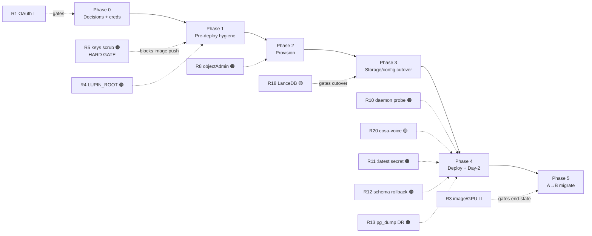

#### Acceptance Criteria — verification gate per risk row

These ride on §100% COVERAGE MANDATE for any **new** code. The mitigations themselves are owned by their respective plan sections; the criteria below are the verification gates the register asserts. **Every register row now has an AC (the CRITICAL rows R1/R2/R3 and every MEDIUM row included — previously only R4/R5/R10/R11/R12/R13/R16 had them).**

- [ ] [LUPIN] **R1** — D1 resolved + recorded (§4.4); a bounded job authenticates as Max on the VM with $0 console movement pre-2026-06-15 (§2.10), AND U1/U2 credit-headroom measured (§3.6) so the post-2026-06-15 exposure is known.
- [ ] [LUPIN] **R2** — CPU Deployment manifest has **no HPA object** and a `PodDisruptionBudget maxUnavailable:0`; a CI lint asserts HPA-absence; no deploy path produces 2 compute pods (§9.3).
- [ ] [LUPIN] **R3** — Milestone-1 VM runs the 31.7/20.1 GB images successfully (D7 deferred-slim AC, §2.10); for the GKE move, the compute image is proven **< 15 GB** (§9.2) before any GKE rolling deploy.
- [ ] [LUPIN] **R4** — `cloud-run-deploy.sh` injects `LUPIN_ROOT=/var/lupin`; a boot assertion aborts if `${LUPIN_ROOT}/src/conf/lupin-app.ini` is absent; both branches unit-tested (§5 Fix 1).
- [ ] [LUPIN] **R5** — secret-scan gate fails the build on any key material under `src/conf/keys/` (11 files); `git log --all -- src/conf/keys/` shows no key blobs post-scrub; rotated keys verified. HARD GATE before any remote push (§5 Fix 2).
- [ ] [LUPIN] **R6** — `cloudbuild.yaml` builds both images on the custom CUDA-12.4 builder without OOM; images push to Artifact Registry, base pinned by digest (§8.1.2).
- [ ] [LUPIN] **R7** — vLLM reachable over the tunnel with `VLLM_URL` injected (§2.10); **`LUPIN_API_BASE_URL` injected for in-container agents with read-and-set landing together, unit-tested (§8.5.2)**; cosa-voice headless-ask proxy resolves (R20 AC).
- [ ] [LUPIN] **R8** — `runtime-sa` holds per-bucket `objectUser` not `objectAdmin`; a negative test confirms `gsutil rb` / object-delete on the LanceDB store is denied (§6.3.6).
- [ ] [LUPIN] **R9** — uptime check + alert on shallow `/health` failure provisioned; the SLO *target* recorded as Q1's answer (the AC is "Q1 answered and the chosen posture — best-effort vs real SLO — recorded in the Phase-0 findings record").
- [ ] [LUPIN] **R10** — `/api/health/deep` returns 200 only with all three daemons alive, 503 + offending-daemon list otherwise; all-alive + 3 single-dead branches covered (§8.2).
- [ ] [LUPIN] **R11** — deploy mounts a pinned secret version (never `:latest`); a rollback test confirms old-code + old-secret resolve together (§8.4.1).
- [ ] [LUPIN] **R12** — expand→contract cycle shipped + image rollback across the boundary exercised on :8000; rollback detects an `alembic_head` mismatch and refuses-or-reconciles rather than serving code/schema-skew; migration confirmed pre-deploy, NOT boot-time (§7.3.3, §8.4).
- [ ] [LUPIN] **R13** — Cloud SQL automated backups + PITR enabled; a restore tested into a clone with the verification harness passing; **DR-drill cadence scheduled (§8.3 recurrence AC)**.
- [ ] [LUPIN] **R14** — the four-tier gate is wired so only a gate-passing digest is promotable; a red tier blocks promotion; verified no curl / side-door submission (§8.1.2).
- [ ] [LUPIN] **R15** — every egress path mapped with per-GB cost AND a **measured round-trip latency budget** for the vLLM hot path (§6.3.7 latency AC, §10 measure-egress AC) recorded before the VPN is treated as permanent — this is the number D5's flip depends on.
- [ ] [LUPIN] **R16** — CORS allowlist explicit (no `["*"]` in the cloud-backed block); integration test asserts extension origin allowed + unknown origin rejected (both branches); client seed-TODOs filed (§8.5).
- [ ] [LUPIN] **R17** — the GCP test environment provisioned at `db-custom-2-7680` (not `f1-micro`; may downsize for the 15-conn test pool, §7.3.4); a connection-count smoke confirms the 15-conn pool stays within the instance ceiling (§6.3.2, §7.3.4).
- [ ] [LUPIN] **R18** — the LanceDB GCS xfail is removed and the suite is green; a `:7999` local-backend regression locks the fix (§7.2).
- [ ] [LUPIN] **R19** — startup probe budgets ≥ 300 s; a cold-start timing test confirms the full Whisper + LanceDB-warmup chain completes within the probe window (§9.3).
- [ ] [LUPIN] **R20** — cosa-voice deployed as its own unit (Terraform module + compose/manifest entry, §8.5.3/§9.3); decision-proxy auto-answer wired; an integration test confirms a headless blocking ask resolves via the proxy rather than hanging.
- [ ] [LUPIN] **R21** — PII column inventory produced; `us-central1` residency adequacy recorded as Q2's answer (the AC is "Q2 answered and the inventory + region adequacy recorded").

### 12.2 Decision Ledger (pointer — not duplicated here)

The flippable straw-man choices **D1–D9 + IaC tooling** live in §1 (the Decision Ledger). Each risk row above that carries a 🧩 tag references its governing decision (D1 in R1, D2/D7 in R3, D4 in R17, D5 in R7/R15, D6 in R2, D8 in R5). **Flipping a ledger decision re-rates the linked risk** — e.g. flipping D2 to "GKE end-state first" promotes R3's image-slim work from Phase 5 into a Milestone-1 blocker, and flipping D1 to the SDK fallback dissolves R1's OAuth blocker but adds metered Anthropic spend. The open questions below are deliberately **kept separate** from the ledger: the ledger holds choices the straw-man *made*; the questions below are inputs the straw-man *could not synthesize* from the codebase.

### 12.3 Open Questions for Rick (the straw-man could not resolve these)

These are not flippable defaults — they are missing inputs. Each is tagged with the risk it gates, and each carries an **acceptance criterion stating how/when the answer is captured and which phase gate consumes it** — so the gate is enforced, not merely asked.

- [ ] [LUPIN] **Q1 — SLO / availability target.** The single-VM / `replicas=1` topology (D6) has **no failover by design** (R9, R10). What availability target does Lupin need? *If* "best-effort, single instance fine" → straw-man stands, R9/R10 reduce to uptime-check + paging. *If* a real SLO (e.g. 99.9%) → R2's distributed-state epic must pull forward, contradicting D6. **AC:** Q1 is answered and the chosen posture is recorded in the **Phase-0 findings record**; the **Phase-2 provisioning gate** consumes it (a real-SLO answer blocks the single-VM provisioning until the distributed-state epic is scheduled). *Gates:* R2, R9, R10.

- [ ] [LUPIN] **Q2 — PII data-residency requirements.** Cloud SQL holds Users, RefreshTokens, ApiKeys, Notifications, PredictionLog; `us-central1` is assumed (D3). Are there residency/jurisdiction obligations (GDPR, regional pinning, data-locality contracts)? *If none* → `us-central1` stands. *If yes* → D3 region (and possibly managed-service choices + log region) must change. **AC:** Q2 is answered and the PII inventory + region adequacy is recorded in the **Phase-0 findings record**; the **D3 region decision (Phase-0 gate)** consumes it before any provisioning. *Gates:* R21, D3.

- [ ] [LUPIN] **Q3 — Is a staging environment needed?** The straw-man provisions a single dedicated GCP test project (D3) with no separate staging tier. Without staging, the destructive cutover steps (§7: LanceDB copy, `pg_dump` import, the cloud-backed-config guard; §8.5: CORS change) are validated only against a *throwaway target*, not a persistent pre-cutover environment — raising the cost of a bad migration (§7.4.3 staging caveat). *If yes* → Phase 2 provisioning roughly doubles (second project/buckets/SQL) and the merge gate (R14) wires to staging-first promotion. *If no* → the dry-run-against-throwaway discipline is the only mitigation. **AC:** Q3 is answered and recorded in the Phase-0 findings record; the **Phase-2 provisioning plan** consumes it (a "yes" adds the staging environment to the Terraform `envs/` set and re-targets the §7 cutover dry-runs at staging first). *Gates:* R12, R14, R16, R18.

- [ ] [LUPIN] **Q4 — Budget ceiling.** A continuous GPU VM with `min=max=1` and no scale-to-zero (D6) is the **cost floor** — it bills 24/7 (GPU + Cloud SQL + egress for the cross-cloud vLLM hot path R15 + LB + build), ≈$896/mo straw-man (§10, itself unmeasured). What monthly ceiling is acceptable? *If tight* → the GPU-elimination alternative (D9: managed STT + Vertex embeddings) and a smaller Cloud SQL tier (R17) come back on the table, and the always-on GPU is reconsidered. *If generous* → the straw-man stands. **AC:** Q4 is answered and recorded; the **§10.6 budget-alert AC** consumes it (the GCP Budget threshold is set to Q4's ceiling, not the straw-man total, and the alert margin accounts for the post-2026-06-15 bounded-CC exposure, U1). *Gates:* R15, R17, D6, D9.

> **Note on scope separation:** Q1–Q4 are intentionally **not** in the Decision Ledger. The ledger answers "what did we pick, and what flips it?" (D1–D9). These four answer "what does the straw-man not know that only Rick can supply?" Answering them may *re-open* a ledger decision (Q1↔D6, Q2↔D3, Q4↔D6/D9) — that is the expected coupling, captured in each "Gates:" line and each AC's named consuming gate.

---

## Footer — Authoring Workflow & Commit Status

**Authoring workflow:** This straw-man was assembled section-by-section by Sam 🎙️ (cosa-voice session 657452e9) from twelve independently-drafted section bodies, then editorially reconciled to resolve five cross-section contradictions (the Alembic-migrate-on-startup myth, the Milestone-1 HTTPS-LB cost line, the 2026-06-15 Agent-SDK credit time-bomb, the D1 Variant-α-vs-β mechanism, and the 10-vs-11 key-file count), to add the inline 🧩 STRAW-MAN / ↩ Flip-if marker to every previously-untagged assumption, to add the missing acceptance-criteria checkboxes (the Decision Ledger gate, the U1/U2 auth unknowns, every risk-register row, the cosa-voice MCP + `LUPIN_API_BASE_URL` work, the DR-drill cadence, the OAuth-rotation alert, and the Q1–Q4 phase-gate bindings), and to close the named coverage gaps (R15 latency budget, R20 cosa-voice deployment home, R7 commons half, D1 option-c exclude path, staging-environment caveat). Section bodies are otherwise preserved verbatim; the only edits were contradiction resolution, consistent heading numbering, and light transition smoothing.

**Commit status:** Mid-session **checkpoint committed** 2026-05-30 (Rick-authorized "document and checkpoint") on branch `wip-v0.1.8-2026.05.29-preparing-for-gcp-deployment` — **selective** staging of this `src/rnd/v0.1.8/2026.05.30-gcp-deployment/` subdir plus `history.md` + `TODO.md` only (parallel-session-safe; `src/rnd/README.md` index links **deferred** as a multi-session conflict file). **NOT pushed** — per the never-auto-push doctrine, pushing awaits Rick's explicit go-ahead.
