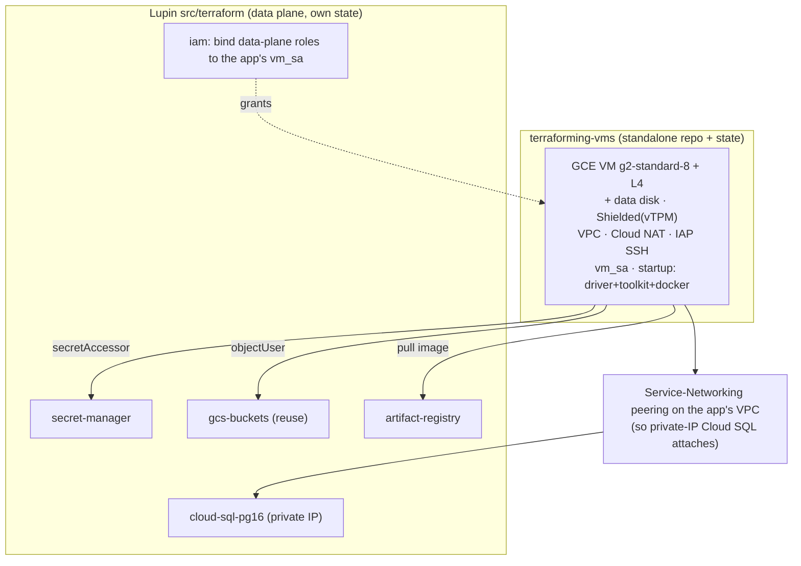

# Evaluation & Integration: reusing `terraforming-vms` for the Lupin GCP VM

**Date:** 2026-06-02
**Author:** Mr. Radio 🦉 (session c0aede3d)
**Subject app:** `/mnt/DATA01/include/www.deepily.ai/projects/google/terraforming-vms` (separate repo)
**Relates to:** GCP Milestone-1 provisioning ([plan §6](2026.05.30-gcp-deployment-provisioning-plan.md), [Phase-2 execution log](2026.06.02-phase2-terraform-execution.md))
**Status:** Reuse verdict + GPU tweak WIRED (in the app, uncommitted) + integration design

---

## 1. Verdict — reuse it (strict upgrade)

`terraforming-vms` is a mature **Python-CLI-over-Terraform** VM manager. For the "spin up + manage + SSH a VM from anywhere" job it is **more capable and more hardened** than the `gce-gpu-vm` + VPC/firewall modules I hand-rolled in Phase 2. Reuse it; do not rebuild.

| Capability | `terraforming-vms` | My Phase-2 `gce-gpu-vm`/`vpc-vpn` |
|---|---|---|
| SSH from anywhere | ✅ **IAP tunnel** (no external IP) | external-IP SSH (weaker) |
| Egress | ✅ Cloud Router + **Cloud NAT** | — |
| Keys | ✅ ED25519 generated + output | host-mounted (deploy concern) |
| Hardening | ✅ **Shielded VM**, OS Login, block-project-keys | — |
| Lifecycle UX | ✅ **16-command Python CLI**, 47 tests | raw `terraform` only |
| Cost control | ✅ overnight start/stop scheduling | — |
| Multi-VM | ✅ isolated state per VM | single |
| GPU | ⛔→✅ (wired here) | ✅ (now redundant) |

Its own design doc already planned a GPU workstation, so GPU was always intended.

## 2. GPU tweak — WIRED (in the app; uncommitted, separate repo)

Minimal, **behavior-preserving** (non-GPU VMs unchanged), general (any GPU VM, not Lupin-specific):

1. **`variables.tf`** — added `g2-standard-4/8/16` (L4) + `a2-highgpu-1g` (A100) to the `machine_type` allowlist. g2/a2 **bundle** the accelerator → no `guest_accelerator` block.
2. **`compute.tf`** — `local.is_gpu = can(regex("^(g2|a2)-", var.machine_type))`; added `scheduling { on_host_maintenance = is_gpu ? "TERMINATE" : "MIGRATE" }` (**TERMINATE is mandatory for GPU**; non-GPU keeps MIGRATE). Secure Boot is now `is_gpu ? false : true` (Secure Boot blocks the NVIDIA driver's unsigned kernel modules; vTPM + integrity monitoring stay on).
3. **`compute.tf` + `variables.tf`** — optional persistent **data disk** (`enable_data_disk`, default false; `data_disk_size`=200, `data_disk_type`=pd-ssd) with `prevent_destroy`, attached via a `dynamic "attached_disk"`.
4. **`src/bash/startup.sh`** — appended a GPU-gated block (detects g2/a2 via the **GCE metadata server**) that installs NVIDIA driver (GCP installer) + Container Toolkit + Docker. Non-GPU VMs skip it.

**Verified:** `terraform fmt` clean · `terraform validate` → *"configuration is valid"* · `bash -n startup.sh` OK.

## 3. Integration model — STANDALONE, invoked from Lupin (recommended)

**The app stays its own repo/tool; Lupin *calls* it. It is NOT absorbed into the Lupin tree.**

Why standalone over vendoring the code into `src/`:
- It's a **general-purpose** GPU-capable VM manager with its own CLI, tests, state, and lifecycle. Lupin is one consumer; other projects can use it too.
- Absorbing it = a fork that drifts from the original, duplicate maintenance, loss of its standalone utility, and repo bloat.
- Clean separation of concerns: **VM + SSH + network lifecycle = the app's job; Lupin app data-plane + deploy = Lupin's job.**

### Division of responsibility

### Deploy & update workflow (the orchestration)

A thin Lupin **deploy runbook / wrapper** (evolving the `cloud-run-*.sh` scripts) sequences the two stacks:

1. **Provision VM** — `cd terraforming-vms && vm-manager create` with `machine_type=g2-standard-8`, `enable_data_disk=true`. → VM + VPC + NAT + IAP SSH + GPU. Capture its `vm_sa` email + internal IP + VPC.
2. **Provision data plane** — `cd lupin/src/terraform/envs/test && terraform apply`. Add **Service-Networking peering** to the app's VPC so Cloud SQL gets a private IP. Lupin's `iam` binds the per-bucket/per-secret/cloudsql roles to the **app's `vm_sa`** (instead of creating a separate runtime-sa).
3. **Deploy app** — build + push image to AR; SSH via the app's `iap_ssh_command` output; `docker compose pull && docker compose up -d` on the VM (with `LUPIN_CLOUD_BACKED=true` + `CLOUD_SQL_CONNECTION_NAME` from the Lupin TF output).
4. **Update** — re-push image → IAP SSH → `compose pull && up -d`. VM start/stop/destroy/ssh via the app's CLI; cost scheduling via its overnight pause.

### The contract (so the two stacks compose)
- **Lupin → app (inputs):** `project_id`, `machine_type=g2-standard-8`, `enable_data_disk=true`, `data_disk_size`, `zone`.
- **app → Lupin (outputs consumed):** `vm_sa` email (→ Lupin `iam` data-plane bindings), VM internal IP, VPC self-link/network (→ Service-Networking peering + Cloud SQL `private_network`), `iap_ssh_command` (→ deploy wrapper).

## 4. What this superseded in Phase 2 — DONE (2026-06-02)

Adopting the app retired two of my Phase-2 modules (which were committed in `2bea93f`):
- ✅ **Deleted `gce-gpu-vm`** — fully superseded by the app's (better) VM.
- ✅ **Replaced `vpc-vpn` → `onprem-vpn`** — VPC/subnet/NAT/SSH-firewall dropped (the app owns them); the slim module keeps **only the on-prem vLLM VPN** (gateway + tunnel + route + vLLM egress firewall), parameterized on the app's VPC via `var.network`, fully gated on `enable_vpn` (default false).
- ✅ **`envs/test` repointed** — VM/VPC come from the app via `var.app_vpc_self_link`; the **Service-Networking peering** for Cloud SQL's private IP is created at env level against that VPC (a bridge resource, gated until the link is supplied).
- ✅ **Kept** `secret-manager`, `cloud-sql-pg16`, `gcs-buckets`, `artifact-registry`, `iam`.
- ⏳ **`iam` follow-up (noted in code):** bind data-plane roles to the app's `vm_sa` rather than the `runtime-sa` it currently creates.

**Verified:** `terraform validate` → valid · `fmt` clean · 11/11 bats-equivalent assertions (incl. "onprem-vpn fully gated" + "superseded modules deleted"). This delta is **uncommitted** — a follow-up commit on top of `2bea93f`.

## 5. Caveats
- **Separate repo + state.** `terraforming-vms` keeps its own `terraform.tfstate` (a GCS-backend migration exists). Two states to coordinate; the deploy runbook is the seam.
- **Secure Boot off for GPU** (driver signing) — documented trade-off; vTPM + integrity monitoring remain.
- **The app's GPU tweak is uncommitted in its own repo** — review + commit there separately (not from the Lupin session).
- **Cross-cloud vLLM latency (R15)** still unmeasured — unchanged by this decision.

## 6. Open decisions for Rick
- [ ] Ratify **standalone-invoked** (vs absorb-into-Lupin).
- [ ] Approve retiring `gce-gpu-vm` + the `vpc-vpn` VPC/firewall half; repoint `iam` to the app's `vm_sa`.
- [ ] Where the on-prem vLLM VPN + Service-Networking peering live (app's VPC vs a Lupin network add-on).
- [ ] Commit the GPU tweak in the `terraforming-vms` repo (separate session/context).
