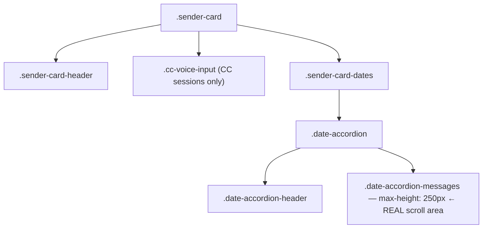

# Notifications UI — Focus-Mode Card Height + Broadcast "Show More" Toggle

**Date**: 2026-05-30
**Session**: fb0bc8a5 (Speedy 🌿)
**Scope**: Two user-requested UI tweaks to the notifications surface, plus regression tests.
**Status**: ✅ Code complete + syntax/compile verified. E2E (`:8000`, scheduled) held at user's request — to be run before merge.

---

## TL;DR

Two voice-requested tweaks:

1. **Focus-mode height boost** — when CC session focus mode is ON, the focused sender card's per-day message lists **double** (250px → 500px) so more of the in-focus conversation is readable; non-focus mode unchanged. (Originally shipped at +50% / 375px; bumped to a full doubling per Rick on 2026-05-30.)
2. **Broadcast "Show more" toggle** — the toggle on `commons-activity-entry` rows was permanently hidden for entries rendered while the Recent Activity panel was collapsed (notably system broadcasts arriving via WebSocket), leaving the clamped content unreadable. Fixed with a deferred re-measure.

Both fixes were initially mis-implemented against a wrong assumption and corrected after live debugging — documented below because the root causes are non-obvious traps.

---

## Task 1 — Focus-mode height boost

### Requirement
> "Increase the maximum height of the `sender-card` element in the notifications UI by 50% when displayed in focus mode. Keep the current maximum height when not in focus mode."

### The trap (first attempt failed)
The first attempt targeted `.sender-card-messages { max-height: 300px → 450px }`. **No visible effect** — because `.sender-card-messages` is an **orphaned legacy CSS class that no render path produces**. `createSenderCard()` builds this DOM instead:



The real per-day scrollable region is `.date-accordion-messages` (`max-height: 250px`). The `.sender-card` root itself has only `overflow: hidden` (no max-height), and `.sender-card-dates` is an unbounded flex container. So the cap the user actually sees is **250px per date accordion**.

### Fix
A CSS-only rule keyed on the strip toggle's existing, reliable `data-focus-active="true"` signal (set in `_enterFocusMode` / cleared in `_exitFocusMode`). The focused card is the single one **without** `data-focus-hidden`; all others get that attribute and are `display:none`. Since the toggle is not a DOM ancestor of the cards, `:has()` bridges from it (`:has()` is already used 7× in this stylesheet, so it's an accepted pattern):

```css
body:has( #cc-strip-toggle[data-focus-active="true"] )
    .sender-card:not( [data-focus-hidden] ) .date-accordion-messages {
    max-height: 500px;   /* 250px × 2 */
}
```

- Out-of-focus: toggle is `"false"`/absent → `body:has()` doesn't match → 250px default untouched.
- High specificity (ID inside `:has()`) cleanly overrides the base `.date-accordion-messages { max-height: 250px }`.

**File**: `src/fastapi_app/static/css/notifications.css` (rule after the base `.date-accordion-messages` def).
**Cache-bust**: bumped `notifications.css?v=20260505c → ?v=20260530a` in `src/fastapi_app/static/html/notifications.html` so soft refreshes pick it up.

### Observability caveat
`max-height` only changes *visible* height when the focused card has **>250px of messages**. A short card sizes to its content in both modes, so the tweak is invisible without enough content. Manual confirm: hard-refresh → enter focus → DevTools inspect a `.date-accordion-messages` in the focused card → computed `max-height` = `500px` (`250px` when focus off).

---

## Task 2 — Broadcast "Show more" toggle not displaying

### Requirement
> "I can't see the 'Show more' toggle in the system broadcast type `commons-activity-entry` because it's not displayed — I can't see the contents of my system broadcasts."

### Root cause
`_renderCommonsEntry()` creates a toggle hidden by default and reveals it via a **one-shot `requestAnimationFrame` overflow check**:

```js
requestAnimationFrame( () => {
    const overflows = content.scrollHeight > content.clientHeight + 1;
    if ( overflows ) toggle.hidden = false;
} );
```

The Recent Activity section is collapsible: `#commons-recent-activity-body.collapsed { display: none; }`. When a system broadcast arrives **via WebSocket while that panel is collapsed**, the entry is rendered into a `display:none` container, so `scrollHeight`/`clientHeight` both read **0** at rAF time → `0 > 1` is false → the toggle stays hidden **permanently**. When the user later expands the panel, the CSS clamp (`-webkit-line-clamp: 2` + `max-height: 3em`) hides the content with no toggle to expand it. This is a classic **measure-while-hidden** bug; system broadcasts hit it most because they arrive asynchronously while the panel isn't the active view.

### Fix
Keep the immediate measure for the common (visible) case, but when the content has no layout yet, defer to a `ResizeObserver` that re-measures once it gains a non-zero height (e.g. the section is expanded), then disconnects:

```js
const revealToggleIfOverflowing = () => {
    if ( content.clientHeight === 0 ) return false;   // not laid out yet — cannot measure
    if ( content.scrollHeight > content.clientHeight + 1 ) toggle.hidden = false;
    return true;
};
requestAnimationFrame( () => {
    if ( revealToggleIfOverflowing() ) return;
    if ( typeof ResizeObserver === "undefined" ) return;
    const ro = new ResizeObserver( () => {
        if ( revealToggleIfOverflowing() ) ro.disconnect();
    } );
    ro.observe( content );
} );
```

This is type-agnostic — it fixes every entry rendered while hidden, not just broadcasts.

**File**: `src/fastapi_app/static/js/notifications.js` (`_renderCommonsEntry`).

---

## Tests added (test-ownership mandate)

| Test | File | Asserts |
|---|---|---|
| `TestCommonsActivityToggleRenderedWhileCollapsed::test_toggle_revealed_after_expand` | `src/tests/e2e_ui/test_commons_activity_toggle.py` | Long entry rendered while section collapsed → toggle hidden → expand → toggle revealed (ResizeObserver re-measure) |
| `TestFocusMode::test_focused_card_messages_get_height_boost` | `src/tests/e2e_ui/test_cc_session_strip_and_focus.py` | Focused card `.date-accordion-messages` = 500px in focus, 250px default/exit |

Both are Playwright E2E (venue `:8000`, monopolize-mode, scheduled). The focus test seeds a date accordion via `createDateAccordion` so the real `.date-accordion-messages` element exists for the computed-style assertion.

---

## Verification status

| Layer | Result |
|---|---|
| CSS brace balance | ✅ 803/803 |
| `node --check` notifications.js | ✅ OK |
| py_compile both test files | ✅ OK |
| E2E (`:8000`, scheduled) | ⏸ Held per user — run before merge: `-k "test_focused_card_messages_get_height_boost or test_toggle_revealed_after_expand"`, `auto_fix_on_failure: false` |

---

## Files changed

- `src/fastapi_app/static/css/notifications.css` — focus-mode height-boost `:has()` rule
- `src/fastapi_app/static/html/notifications.html` — cache-bust bump
- `src/fastapi_app/static/js/notifications.js` — ResizeObserver toggle re-measure
- `src/tests/e2e_ui/test_commons_activity_toggle.py` — render-while-collapsed regression test
- `src/tests/e2e_ui/test_cc_session_strip_and_focus.py` — focus-mode height-boost test

## Lessons

1. **CSS targeting a class name from a doc/grep ≠ targeting a live element.** `.sender-card-messages` looked authoritative but was orphaned; always confirm the element is produced by the render path (`createSenderCard`) before styling it.
2. **One-shot rAF measurement is unreliable for collapsible/async-rendered content.** Prefer a `ResizeObserver` fallback when the element may be `display:none` at render time.
