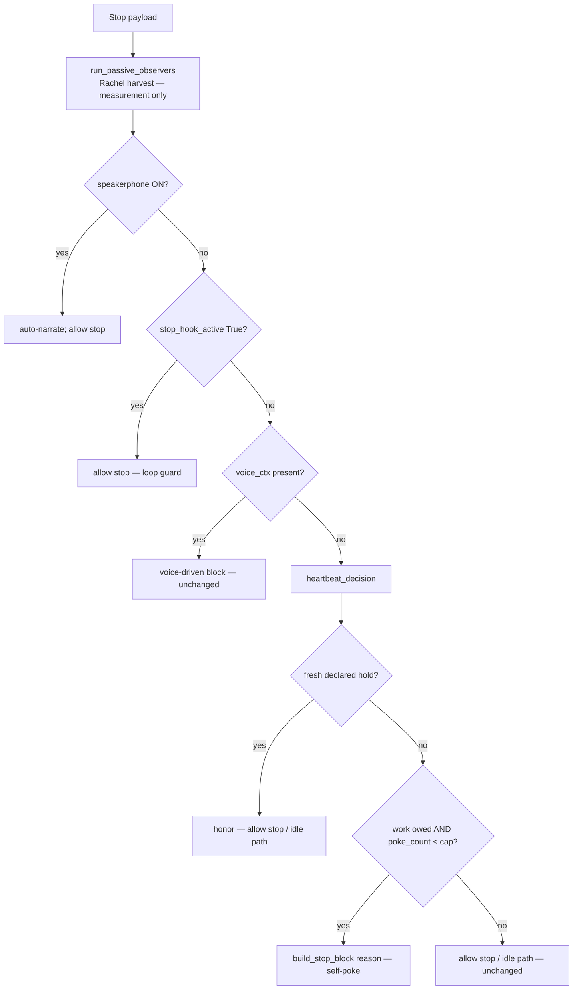

# Heartbeat Hook — `stop.py` Seam-Factoring Proposal

**Author:** Tiffany 💍 (Lupin session `d1554246`, heartbeat-hook implementer)
**For async review by:** Rachel 🕊️ (token-rate / context-rate instrumentation, TODO line 11)
**Design owner:** María 🌸 · **Manager:** Tiberius 👑
**Date:** 2026-06-04
**Status:** ✅ **v1 COMPLETE — Rick authorized COMMIT (commit only; NO push, NO `settings.json` flip).** Seam resolved, 6 leaf modules @ 100%, `stop.py` Branch-C adapter + emit wired & reviewed, poke wording applied verbatim per Rick. Full unit collection: **5366 passed, 1 xfailed.** Heartbeat ships **OFF by default** (`enabled=FALSE`) — merge is a no-op until a future `settings.json` flip. (Original proposal preserved below as the rationale.)
**Companion:** `01-spike-findings-and-stop-py-seam-analysis.md` (read first — establishes the loop guard + current `stop.py` decision flow).
**Canonical design:** `planning-is-prompting/src/rnd/2026.06.02-stop-hook-natural-heartbeat-poker.md` §0 (LOCKED).

---

## ✅ RESOLUTION (2026-06-04 — converged Tiffany 💍 + Rachel 🕊️ + María 🌸)

The async review is **resolved**. Recorded decisions:

1. **Seam = Option B (harvest) + inline Branch-C (heartbeat).** Rachel's token/context-RATE harvest is passive and wants per-tool cadence → it rides a **separate `PostToolUse` hook**, NOT `stop.py`'s decision flow. The heartbeat decision rides **Branch C inline** on the one `Stop` hook. B and C converge on identical heartbeat code; a future Stop-side passive observer is an additive side-effect-only call at the top of `main()` that never touches the heartbeat. → **one Stop hook + one PostToolUse hook, zero competing decision flows.**
2. **Lane / test split (Tiberius-approved):** Rachel writes the `stop.py` Branch-C wiring (her substrate); Tiffany owns the leaf modules + the adapter/integration tests holding the 100% gate. Flag Tiberius before any `settings.json` change.
3. **v1 scope (María's on-record call — SHIP):** the adapter wires the **hold-declared signal only** (`oracle_verdict=None`). v1 honors fresh reasoned holds and pokes stale/reasonless self-declared `work_owed=True` holds — the "defend your quiescence" core with **zero false-positive risk** (never pokes on a heuristic).
4. **v2 = the undeclared-lazy-stop FM-19 catch — DEFERRED to María's §C.3 Q4.** Poking a session that did NOT declare a hold requires an *authoritative* per-session work-owed source + `owned_by_me` attribution (TODO parsing is heuristic; ownership is the hard part). The `heartbeat_work_owed` oracle module is built + 100% tested + ready, so v2 is a **small adapter change** (pass a real `oracle_verdict` instead of `None`) once María rules.
5. **v1 contract is already test-validated:** `src/tests/unit/test_heartbeat_v1_composition.py` exercises the full v1 pipeline end-to-end (honor / done / stale-owed-poke-to-cap / reset) across the real leaf modules with zero `stop.py` dependency — Rachel's wiring must satisfy this contract.
6. **`poke_count` reset (RESOLVED, v1):** reset on genuine user re-engagement via a one-liner in `user_prompt_submit.py` (`reset_poke_count(session_id)` beside the existing `backoff_index=0` reset) — cap is per-idle-episode, not one-shot. No silent one-shot cap.
7. **Cap notify (RESOLVED):** `notify_user_sync` is SSE-**blocking** and would hang the Stop hook — so v1 uses **non-blocking `log_to_stream(phase="heartbeat_cap_reached", extra={session_id, poke_count})`**. A user-facing **async** cap notify (the §0 #6 intent — the user should learn nudging stopped) is **v1.1** polish. (Rachel's catch.)
8. **Opt-in default (RESOLVED, storm-safe):** new `lib/heartbeat_settings.py` (mirrors `idle_settings.py`) → `load_heartbeat_settings()` → `{enabled, poke_cap}` from `~/.claude/settings.json["heartbeat"]`; **`enabled` defaults FALSE when the block is absent**. So merging the wiring is a literal **no-op** until the `settings.json` flip — code-merge needs no settings change; only **turning it on** is Tiberius-gated. Malformed `poke_cap` → `ValueError` (fail-loud at parse); `_run_heartbeat` catches it → `None` (fail-safe at the hook boundary — never poke on bad config).

**Adapter signatures (Rachel-owned, v1):** `_run_heartbeat(session_id) -> dict|None` (block dict on `OUTCOME_POKE`, else `None` → existing idle path runs unchanged); `_notify_cap_reached(session_id) -> None`. **Placement:** `stop.py main()` Branch C no-voice `else:`, immediately after `reset_stop_block_count`, before `load_idle_settings`, downstream of the `stop_hook_active` loop guard + the voice branch (`hb = _run_heartbeat(session_id); if hb is not None: emit_json(hb); return`).

9. **"EMIT NOW, CONSUME LATER" (RESOLVED, v1 — María steer via Tiberius):** v1's poke path writes a fire-and-forget poke-outcome record so the v2 fleet arbiter lands as a PURE CONSUMER (zero hook retrofit). New leaf module `lib/heartbeat_events.py` (Tiffany, 100% line+branch) — `emit_outcome(session_id, persona, outcome, poke_count, cap, work_owed=None, awaiting=None, reason=None, ts=None, base_dir=None) -> bool`; never raises, never blocks. Canonical schema = PIP design **§0.2** (María, arbiter owner): per-session **fleet-wide** JSONL at `~/.claude/heartbeat-events/<session_id>.jsonl` (deliberate divergence from the project-root hold artifact — the consumer is cross-fleet; this is the one place the `get_project_root()` mandate intentionally doesn't apply). Record: `schema_version·session_id·persona·ts·outcome(poke|honored|cap_reached)·poke_count(after increment)·cap·work_owed(null in v1)·awaiting·reason(poke only)`. **Emit policy:** only `{poke, honored, cap_reached}` — `not_owed` is skipped (per-turn noise). Call-site = one fire-and-forget line in Rachel's `_run_heartbeat` after the increment/notify side effects (self-filters; no branching). **Deferred v2 (flagged, NOT built):** JSONL rotation / line-cap.

The remainder of this doc (the A/B/C option analysis below) is preserved as the rationale that led to the resolution above.

---

## Why this doc exists

Two workstreams want to extend the **same production file** `src/lupin_cli/claude_code/hooks/stop.py`:

1. **Heartbeat Hook** (Tiffany) — an *active decision*: on quiescence-with-work-owed, return `{"decision":"block","reason":…}` to self-poke.
2. **Token/context-rate instrumentation** (Rachel, TODO line 11) — a *passive measurement*: parse session JSONL → emit a harvest-rate signal to cosa-voice.

María's mandate: **build the shared substrate once, fan out to both — never ship two competing hooks.** This proposal lays out the factoring options so Rachel can pick the seam before either of us edits the file. The whole point is that Rachel reviews a concrete draft, not a cold start.

## The one question that decides everything

> **Rachel — does your token-rate instrumentation need the `Stop` lifecycle event specifically, or does `PostToolUse` suffice? And is it purely passive (measurement only, never alters the stop decision)?**

Your answer collapses the option set:

- **If `PostToolUse` suffices** → Option B: we never share `stop.py`'s decision flow at all. Cleanest.
- **If you need the `Stop` event, and it's passive** → Option C: you ride a passive-observer call; heartbeat rides Branch C. No serialization, minimal disturbance.
- **If you need the `Stop` event AND want a unified dispatch layer** → Option A: full substrate extraction.

## Fixed constraints (independent of which option)

These are settled (María-ratified in `01-…` + canonical §0/§0.1) and bind every option:

| # | Constraint | Source |
|---|---|---|
| 1 | Heartbeat poke rides the top-level **`reason`** field — **NEVER `systemMessage`** (CC silently ignores it on Stop hooks, `hook_common.py:549`). | §0.1 errata + `01-…` §A.3 |
| 2 | Heartbeat uses its **own** per-session counter (`HEARTBEAT_POKE_CAP`, default 3) — **separate** from the voice `MAX_STOP_BLOCKS` counter. Independent budgets. | María 2026-06-04 |
| 3 | Heartbeat decision sits **downstream of the `stop_hook_active is True` loop guard** (`stop.py:687-691`) — never poke on a re-fire. | `01-…` §A |
| 4 | **Voice always wins** — heartbeat lives in the no-voice branch only; never competes with `voice_ctx`. | `01-…` §C.2 |
| 5 | Hold-artifact reads come from the standalone `heartbeat_hold` module (already shipped, 100% cov) — no new file I/O logic in `stop.py`. | this milestone |

## Current `stop.py` decision flow (recap from `01-…` §b)

```
main(): payload → stop_hook_active → session_id
  A. speakerphone ON   → auto-narrate; allow stop; EXIT      (early-exit, pre-everything)
  B. loop guard        → if stop_hook_active is True: allow stop; EXIT
  C. voice_ctx present → voice-driven block (the ONLY existing block path; capped)
  D. no voice_ctx      → reset voice counter; idle-waiter | "Anything else?"
```

Heartbeat's natural home is **D** (no-voice quiescence). Rachel's harvest is *measurement* — orthogonal to the decision.

---

## Option A — Unified dispatch substrate (extract + refactor)

Extract a thin substrate both hooks call:

```
hook_substrate.derive_session_state( payload ) -> SessionState
hook_substrate.run( payload, handlers=[ passive_observers..., decision_handlers... ] )
```

`stop.py main()` becomes: build state once → run passive observers (Rachel's harvest) → run decision handlers in the existing priority order (voice block, then heartbeat). Each handler is independently unit-tested.

- **Pro:** single seam; zero payload-parse duplication; future hooks plug in; the cleanest end-state.
- **Con:** largest blast radius on a production hook; **serializes** Rachel + Tiffany (the refactor must land before either feature); higher regression risk on the existing voice/idle/auto-narrate paths.

## Option B — Inline heartbeat in Branch D; Rachel on `PostToolUse` (minimal)

Heartbeat adds its block decision inline in `stop.py` Branch D. Rachel's harvest hangs off a **separate `PostToolUse` hook** reading session JSONL — a different lifecycle event, so **no `stop.py` decision-flow collision at all**.

- **Pro:** smallest blast radius; the two concerns physically separate (Stop vs PostToolUse); **no serialization** — both land independently.
- **Con:** does not build the "substrate once" if you later also need a Stop-side signal; minor payload-parse duplication across two hook files.
- **Valid iff** your harvest is satisfied by per-tool `PostToolUse` cadence.

## Option C — Passive-observer call + inline heartbeat (recommended middle) ⭐

Keep `stop.py`'s decision flow **exactly as-is**, add ONE early side-effect-only call:

```
main():
  payload → stop_hook_active → session_id
  run_passive_observers( payload, session_id )   # NEW — Rachel's harvest; never alters the decision
  A. speakerphone ... (unchanged)
  B. loop guard       (unchanged)
  C. voice block      (unchanged)
  D. no voice_ctx:
       reset voice counter
       heartbeat_decision( session_id, payload )  # NEW — hold read + work-owed + capped poke
       └─ poke?  → emit build_stop_block(reason); return
       └─ else   → existing idle-waiter | "Anything else?" (unchanged)
```



- **Pro:** cleanly separates **passive measurement** (observer list — Rachel) from **active decision** (Branch D — heartbeat); minimal decision-flow disturbance; **no serialization**; future passive observers plug into the list; honors all five fixed constraints by construction.
- **Con:** two small insertion sites instead of one — but each is orthogonal and independently testable.

## Recommendation

**Option C** if your harvest needs the `Stop` event (you become the first passive observer; heartbeat rides Branch D). **Option B** if `PostToolUse` alone suffices (we don't share `stop.py` at all — even cleaner). **Option A** only if we expect several more Stop-side hooks soon and want the unified dispatch now — its serialization cost isn't justified by just our two features today.

My lean: **C** — it gives us the "substrate once" (the observer list) for passive consumers while keeping heartbeat's active decision surgically contained in the branch that already owns "quiet, no voice," with zero change to the speakerphone / loop-guard / voice / idle paths.

## What I will NOT do before your sign-off

- Touch `stop.py`'s decision flow or `main()`.
- Wire anything into `.claude/settings.json`.
- Add the `HEARTBEAT_POKE_CAP` counter helpers to `hook_common.py`.

## What proceeds in parallel NOW (no `stop.py` dependency)

**ALL pure leaf logic is now SHIPPED at 100% line+branch cov (79 tests total) — the Rachel-gated surface is reduced to a thin adapter:**

| Module | Role | Tests | Cov |
|---|---|---|---|
| `heartbeat_hold.py` | hold-artifact read/write (§0 #7) | 35 | 100% |
| `heartbeat_work_owed.py` | pure work-owed oracle (§0 #3) | 19 | 100% |
| `heartbeat_poke_cap.py` | per-session poke-cap counter (§0 #6; separate from `MAX_STOP_BLOCKS`) | 14 | 100% |
| `heartbeat_decision.py` | pure `decide_heartbeat(hold, oracle_verdict, poke_count, cap)` composing the three leaves (§0 5-step) | 11 | 100% |

**`decide_heartbeat` returns a structured result** — `{ outcome, hook_output, should_increment, should_notify_cap }` — NOT the bare Stop-hook dict. `hook_output` is the exact dict to emit; `should_increment` / `should_notify_cap` tell the side-effecting adapter when to bump the counter / fire the cap notify, keeping the core pure. (Design choice flagged to María.)

**Therefore the ONLY remaining Rachel-gated work is the thin Branch-C adapter** (whose shape depends on your A/B/C pick):
```
session_id ← hook input
hold       ← heartbeat_hold.read_hold( session_id )
verdict    ← heartbeat_work_owed.evaluate_work_owed( <live TODO/Pending/DM state> )
count      ← heartbeat_poke_cap.get_poke_count( session_id )
result     ← heartbeat_decision.decide_heartbeat( hold, verdict, count, cap )
if result.should_increment:  heartbeat_poke_cap.increment_poke_count( session_id )
if result.should_notify_cap: notify( "max auto-nudges reached, awaiting user" )
emit_json( result.hook_output )
```
The live-state fetch (`<live TODO/Pending/DM state>`) + where this adapter is invoked in `stop.py` is exactly the §C.3 Q1 seam decision awaiting your review.

---

## Open items for the async thread

1. **Rachel:** Stop vs PostToolUse for harvest? Passive-only? → picks B / C / A.
2. **Rachel:** if Option C, is a simple ordered observer list enough, or do you want a registry/priority?
3. **All:** speakerphone posture (§0/Rachel Q3) — default non-speakerphone grind workers (no Branch-A change) vs hoist the work-owed check above the Branch-A early-exit. Proposal assumes the former.
4. **All:** TTL default for the hold artifact (§0 build knob; module default = 900 s).

*Ping Tiffany 💍 or María 🌸 on `dm-tiffany` / `dm-maria` when reviewed.*
