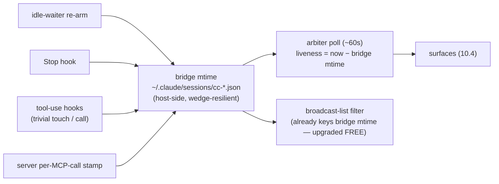

# Heartbeat Arbiter — v2 Design

**Status:** ✅ **MANAGER-APPROVED (Tiberius, 2026-06-04), UNCOMMITTED pending Rick's commit word.** All design decisions closed — §6.2 idle-detection RULED **Option C / HYBRID** (Rick, 2026-06-04). Four review nits (N1–N4) folded.
**Author:** María 🌸 (PIP session `4347c712`, design author + arbiter owner). Implementers-in-waiting: Tiffany 💍 + Rachel 🕊️. Manager: Tiberius 👑.
**Design authority:** canonical local-Hook design + emission schema + Q4 ruling — planning-is-prompting `src/rnd/2026.06.02-stop-hook-natural-heartbeat-poker.md` §0 / §0.2 / §0.3.
**Siblings:** `01-spike-findings-and-stop-py-seam-analysis.md` · `02-stop-py-seam-factoring-proposal.md` · (Rachel) `04-v2-oracle-livefetch-plan.md`.
**Cross-ref (existing Poker family):** `lupin/src/rnd/v0.1.7/2026.05.20-generic-heartbeat-poker-abstraction-design.md` + the D1–D4 spec series.

---

## 1. Purpose & scope

The **Heartbeat Hook** (v1, shipped) is a *per-instance, local* `Stop`-hook that self-pokes on quiescence-with-work-owed and emits a fire-and-forget poke-outcome record. The **Heartbeat Arbiter** (v2, this doc) is the *managed-fleet* consumer of that exhaust: it reads every session's emitted records, builds a cross-fleet view, and drives three fleet behaviors — **auto-ping-the-blocker**, **idle-roster surfacing**, and **dependency-graph analysis** — while the **manager actuates** reassignment.

**Invariant inherited from the Hook (§0 #2):** the local poke is autonomous and `:7999`-free; the arbiter is an **additive observer of the Hook's exhaust, never a dependency in the poke path.** If the arbiter is down, every local Hook still pokes normally.

## 2. Home / identity (point 6)

Realize the arbiter by **extending the existing agentic Heartbeat Poker** (`HeartbeatPokerJob` / `cascade_heartbeat_scheduler`) — reuse its poll loop + commons-DM delivery rather than building a new daemon. The Hook=per-instance vs Poker=managed-fleet split already exists; this gives the Poker its sensory input (the event stream) and its analysis layer.

## 3. Input — consumer of the Hook's exhaust (point 1)

- **Source:** glob `~/.claude/heartbeat-events/*.jsonl` (the fleet-wide emit dir, canonical §0.2). One file per session; the arbiter is a **pure consumer — zero Hook retrofit** (the whole point of emit-now).
- **Tailing:** track a per-file read offset (or last-seen `ts`); on each poll, read only new lines. Resilient to malformed lines (skip, per `read_events`).
- **Record fields consumed** (schema_version 1): `session_id` · `persona` · `ts` · `outcome` (**poke / honored / cap_reached / idle** — `idle` = the v2 genuine-idle beacon) · `poke_count` · `cap` · `work_owed` (real bool once v2 oracle wires; null pre-v2) · `awaiting` · `reason`.

## 4. Data model — the fleet spine

Per-session view, rebuilt each poll from events + `commons_who`:

| Field | Source | Meaning |
|---|---|---|
| `liveness` | **event-file `ts` = PRIMARY**, `commons_who` = SECONDARY | recent ⇒ alive. Event-file ts is `:7999`-free (local read), so liveness/inference **degrades gracefully when `:7999` saturates** (our wedge history); `commons_who` only enriches it, never gates it. |
| `state` | last `outcome` | `poke`=nudged/working · `honored`=holding · `cap_reached`=stuck |
| `holding_on` | `awaiting` edge | `peer:X` / `user:Y` / `commons:Z` / `none` |
| `stuck` | repeated `cap_reached` + `work_owed=true` | poked to the cap, still owed ⇒ needs help |
| `poke_pressure` | `poke_count` vs `cap` | proximity to the cap |

**Dependency graph** — assembled from all `awaiting: peer:*` edges (who-waits-on-whom):
- **Cycle detection** = deadlock (A→B→A) ⇒ escalate to the user (no autonomous break).
- **`awaiting: user:<offline>`** = the AFK `owner_id` case ⇒ feeds the owner-pre-resolution / fleet keep-alive line (the original Poker arbiter concern).

## 5. Work-owed source / Q4 — RESOLVED (ref canonical §0.3)

The arbiter does **not** compute work-owed; the **local Hook v2** does, and stamps `work_owed` into each emitted record. Q4 ruling (canonical §0.3, summarized): the local oracle's source = **the session's OWN `Task*` state, replayed from its `transcript_path`** (`Stop`-hook input) — `TaskCreate` + `TaskUpdate` replayed by `taskId` → `work_owed = any task whose latest status ∈ {in_progress, pending}`. `owned_by_me` **TRUE BY CONSTRUCTION** (the calls live in that session's transcript — no cross-session attribution); **`:7999`-free** (local file read); built on the **same transcript-reader Rachel's token-rate instrumentation needs** (build once, fan out). **(Source re-targeted `TodoWrite`→`Task*` after Rachel's §0.3-mandated spike found `TodoWrite` is a dead signal — zero calls / not in this harness's registry; see canonical §0.3 correction.)** v2 scope = `Task*` only; project-`TODO.md` Pending-Decisions (no ownership) + inbound-`expect_reply`-DM (keep `:7999`-free) deferred to v2.1. Net effect for the arbiter: `work_owed` becomes a **real bool** in the event stream (was null in v1), enabling true `stuck` detection.

## 6. Behaviors

### 6.1 Auto-ping-the-blocker (point 4 — Rick condition 2)
For each session holding on `awaiting: peer:X`, the arbiter DMs X: *"Session ⟨persona⟩ is holding on you for: ⟨reason⟩ — where are we?"*
- **Throttle:** at most one ping per `(holder, X, reason)` edge per backoff window — never re-ping every poll (no storm; Sam-TTS lesson).
- **Resolution:** when the holder's next event drops the `awaiting:peer:X` edge (resumed or re-held elsewhere), clear the edge.
- **Escalation:** if X is offline / unresponsive past a threshold, surface to the manager (X may be a phantom or genuinely stuck).

### 6.2 Idle-roster (point 2 — Rick condition 3) — ✅ RULED: Option C, HYBRID (Rick, 2026-06-04)
Assemble the fleet-wide list of **idle / nothing-owed** sessions → manager-visible (for manager-actuated reassignment, §6.3). Detection uses **BOTH** signals:
- **INFERENCE (broad net):** idle ≈ alive (by **event-file `ts` PRIMARY**, `commons_who` secondary — N3) **AND** quiet (no heartbeat events + no commons activity) for ≥ `idle_threshold_seconds`. Catches every quiet session, including those that never emit a beacon. Heuristic ("quiet" can mean a long tool-run).
  - **⚠️ THRESHOLD INVARIANT (F3 — Mr. Radio integration finding, 2026-06-04):** the inferred branch needs `idle_threshold_seconds ≤ age ≤ alive_threshold_seconds` off the single `last_activity_ts`, so the window is non-empty ONLY when **`idle_threshold_seconds < alive_threshold_seconds`**. The original defaults (`idle_threshold=900 > alive_threshold_seconds=600`) made the window EMPTY → the inference half was config-dead → the roster silently degraded to **declared-only**, defeating the hybrid. **Fix:** (a) params `idle_threshold_seconds` (semantically the duration-of-quiet floor) + `alive_threshold_seconds` — names kept to match Rachel's + Tiffany's code (`idle`, not `quiet`); (b) default `idle_threshold_seconds=300 < alive_threshold_seconds=600` (committed `f768a59`; a brief 900/3600 ratification was REVERSED 2026-06-05 — 300/600 stays since it's committed+tested + the thresholds are tunable config, so we widen at deploy if prod is noisy rather than churn code mid-sprint; ANY `idle < alive` is correct — the invariant is what matters); (c) **fail-fast config invariant** — `ArbiterConsumerJob` init raises if `idle_threshold_seconds ≥ alive_threshold_seconds` (so the bug-class can't reship silently). Lock with a config-validation regression test + an INFER path test (do NOT hardcode `alive=True` — that hollowed the original unit test). **Bounded-window note:** a session quiet beyond `alive_threshold_seconds` with no beacon is treated as presumed-offline; the **declared beacon (sticky, alive-independent) backstops long-idle**, so inference is the backup for *missed* beacons within `[idle_threshold_seconds, alive_threshold_seconds]`. **v2.1 robustness (flagged):** decouple `alive` (from `commons_who`) from `quiet` (from event-ts) to remove the single-timestamp window bound entirely.
- **DECLARATION (authoritative beacon):** the arbiter consumes an explicit **genuine-idle** emission the Hook fires on `not_owed` + **empty `Task*` set** (the cascade below). A session that emits this is *authoritatively* available. **STICKY-until-superseded (N4):** because the emit is edge-triggered, treat the latest `idle` beacon as the session's standing state **until a later event supersedes it** (`poke`/`honored`/`cap_reached` ⇒ back to work). An arbiter restart / offset-reset can miss the original transition edge — **inference backstops that gap** (a session sitting idle still reads quiet), so the two signals together never strand a genuinely-idle session off the roster.
- **TRUST LABELING (Rick's mandate):** each roster entry is labeled **`quiet (inferred)`** vs **`declared-available`** so the **manager can weight trust** before reassigning — a declared-available session is a safer reassignment target than an inferred-quiet one (which might just be mid-long-run).
- **Roster output:** post to a `fleet-idle-roster` commons topic + DM the manager on roster change; entries carry the trust label + last-activity ts.

**Cascade to the Hook (v2 additive emit):** the current emit fires on `{poke, honored, cap_reached}`; **ADD a `idle` emission on `not_owed` + empty-`Task*` set** so the declared-available beacon exists for the arbiter to upgrade on. Small additive `emit_outcome` extension (Rachel/Tiffany lane; same fire-and-forget invariant; 100%-tested). **Constraint (María):** emit the `idle` beacon **edge-triggered / de-duped** — fire on the *transition* into idle (last emitted event for the session was not already `idle`), NOT on every idle stop, so a no-tasks session doesn't spam an `idle` line per turn. Canonical schema update in PIP §0.2.

### 6.3 Reassignment (point 3) — DECIDED: sensor + recommender; manager actuates
The arbiter is a **sensor + recommender, NOT an actuator.** It surfaces the idle-roster (§6.2) + the blocked dependency-graph (§4) to the **manager**, who **actuates** reassignment (pulls an idle worker, assigns work) under the standing spawn/harvest authority. Rationale: Rick's explicit framing (*"you Tiberius have the list and assign them something"*), lower blast-radius (auto-assigning work is high-risk), and it fits the manager-autonomy grant (`feedback_manager_standing_spawn_authority`). The arbiter MAY *recommend* a pairing (idle worker ↔ queued work) but never assigns autonomously.

### 6.4 Dependency-graph analyses (bonus)
Cycle=deadlock→escalate user; `awaiting:user-offline`=AFK owner_id keep-alive; longest-wait-edge surfaced first to the manager.

## 7. Safety — bounded by construction
- **Fleet-wide ping/poke throttle** (Wave-3 prereq B): a global rate cap across all arbiter-originated DMs; per-edge backoff (§6.1).
- **No-storm invariant** (Sam-TTS postmortem): every arbiter-originated message is rate-bounded; a backlog never replays unbounded.
- **Read-only on the Hook's plane:** the arbiter never writes the event logs; it only reads. It cannot corrupt a session's local state.
- **Degrades safe:** arbiter down ⇒ local Hooks unaffected (§1 invariant).

## 8. Build plan (on Rick's nod → implementers)
1. **Shared transcript-reader** (with Rachel's token-rate line, TODO 11) — build ONCE; fan out to (a) token-rate, (b) the Hook-v2 work-owed oracle feed (§5). *Pre-build spike: DONE (Rachel) — caught the `TodoWrite`→`Task*` correction; reader replays `TaskCreate`/`TaskUpdate` by `taskId`.*
2. **Hook v2 wire** (**Rachel** — the `stop.py` Branch-C adapter / call-site is her lane per the ratified v1 split; Tiffany owns the pure leaves): thin Branch-C adapter passes a REAL `oracle_verdict` (`Task*`-replay-fed `evaluate_work_owed`) instead of `None`. Oracle + `decide_heartbeat` already built/tested — last wire.
2b. **Genuine-idle emit** (Rachel/Tiffany lane): additive `emit_outcome` extension — fire an `idle` event on `not_owed` + empty-`Task*` set, **edge-triggered/de-duped** (§6.2 constraint). Same fire-and-forget invariant; 100%-tested; canonical schema in PIP §0.2.
3. **Arbiter consumer** (extends `HeartbeatPokerJob`): event-glob+tail (§3) → fleet data model (§4) → §6.1 auto-ping + §6.4 graph. 100% tested against synthetic event logs.
4. **Idle-roster** (§6.2) — HYBRID per Rick: inference (`commons_who` + event-quiet) UNION the declared `idle` beacon; each entry trust-labeled `quiet (inferred)` vs `declared-available`.
5. **Manager surface** (§6.3): roster + blocked-graph → manager DM / commons topic.

## 9. Open questions / deferred
- ✅ **§6.2 idle-detection source** — RULED **Option C / HYBRID** (Rick, 2026-06-04): inference + declared beacon + trust labels. No longer open.
- **Cross-host fleet** — `~/.claude/heartbeat-events/` is per-host; a multi-host fleet needs a shared/synced dir or a per-host arbiter. (v2 assumes single-host.)
- **v2.1 work-owed signals** — project-`TODO.md` Pending-Decisions (needs per-session ownership) + inbound-`expect_reply`-DM (file-based commons read, `:7999`-free).
- ✅ **v2.1 Direct-State Visibility** — RULED + APPROVED + BLESSED 2026-06-05; specified in **§10** (consumer-side; bridge-mtime convergence; no producer change). No longer open.
- **Poll cadence + offset persistence** — tune against fleet size; persist offsets across arbiter restarts.

---

## 10. v2.1 — Direct-State Visibility (Rick-directed; DESIGN-FINAL 2026-06-05)

**Provenance:** Rick-directed; design analysis + decision walkthrough authored in planning-is-prompting `src/rnd/2026.06.05-arbiter-direct-state-visibility.md`. **D1–D4 ruled by Rick → reviewed + APPROVED by Tiberius (manager, arbiter-runner) → bridge-mtime convergence BLESSED by Rick, 2026-06-05.** Folds here on Rick's go. **No code yet** (Rick's standing instruction).

**Requirement (Rick):** *"I want to see your state no matter what it is. I don't want to infer it."* The arbiter recalculates and surfaces the **full** fleet every ~minute; every session's true state is shown as **fact**, not deduced from a stale proxy.

**Architectural pivot:** the `Stop` hook is **edge-triggered** — it fires only at turn-end, so it *cannot* report a session that's actively working. Increasing producer cadence is therefore the wrong lever. **The fix is entirely consumer-side; the producer (Stop hook) is UNTOUCHED.**

### 10.1 Liveness clock — the convergence (supersedes the §4/§6.2 single-event-ts liveness)
**Liveness = ONE host-side bridge-file mtime** (`~/.claude/sessions/cc-*.json`), bumped by *many* writers:
- **idle-waiter re-arm + Stop** (existing host-side writers),
- **tool-use hooks** (new — a trivial mtime touch on Pre/PostToolUse → refreshes on *every tool call*, covering heads-down work),
- **server per-MCP-call stamp** (new — the cosa-voice server stamps the same bridge mtime on every inbound request).

Because the file is written **host-side (not through `:7999`)**, the clock **survives a server wedge** — a true saturation-resilient liveness source (D4 condition met; Tiberius confirmed the host-side writers). One signal, many writers — **do NOT fork a parallel last-seen store.** (event-file `ts` and transcript mtime drop to optional/secondary.)

### 10.2 State vs liveness — two orthogonal columns (redline 4)
- **state** = last *semantic* heartbeat outcome (`idle` / working=`poke` / holding=`honored` / stuck=`cap_reached`) — edge-triggered, unchanged from §4.
- **liveness** = last-seen **age** off the bridge clock. Shown as ages (`bridge 4s · event 35m`), never a bare boolean; a `verdict` label (`LIVE` / `quiet 6m` / `stale` / `offline`) rides *over* the ages but never hides them. **Never collapse state and liveness.**

### 10.3 Render cadence (D1)
Every poll (~60s): **full table on change**; a **1-line tick when unchanged showing duration-since-last-change** — e.g. `tick · no changes for 12m (since 22:29) · 5 sessions · 22:41`. Guarantees a sign of life each minute without a wall of repeated tables.

### 10.4 Surfaces (D3) — three sinks, NO standalone arbiter HTTP (redline 2)
1. **Greppable log file** — durable, replayable history.
2. **Queryable snapshot via `:7999`** — the arbiter **pushes** its latest fleet snapshot to lupin-rest; `:7999` exposes **`GET /api/arbiter/fleet-snapshot`** returning the cached snapshot, **mirroring the existing `GET /api/queue/pool-status`** (reuses auth, one HTTP surface, queryable from a distance). In-pool variant updates a server singleton; standalone variant POSTs the snapshot.
3. **`fleet-arbiter` commons topic** — kept (manager + peers read it for coordination; near-zero cost at the tick cadence).

### 10.5 Free win — broadcast-list upgrade
The broadcast "all-sessions" liveness filter **already keys on bridge mtime**. The new writers (10.1) refresh it, so a **working session stops aging off the broadcast roster for free** — directly fixing the drop-off that removed María from a broadcast on 2026-06-05.

### 10.6 Redlines (hard)
1. **Trivial tool-use stamp only** — a bare mtime touch (`os.utime` / one-byte write); **no transcript reads, no server POSTs, no heavy logic.** PreToolUse fires dozens/turn × every session; anything heavier degrades every tool call fleet-wide. If a stamp ever needs I/O beyond the bridge touch → PostToolUse-only or debounce.
2. **No standalone arbiter HTTP server** — push to `:7999`, mirror `pool-status`.
3. **Converge liveness on bridge-mtime** — no parallel last-seen store.
4. **State ≠ liveness** — two orthogonal columns, never collapsed.

### 10.7 Build lanes (on Rick's go — no code yet)
- **Server per-MCP-call stamp** → MCP-server lane (`lupin_mcp/cosa_voice_mcp.py`).
- **Tool-use hook touch** → hooks lane (extend the EXISTING Pre/PostToolUse hooks — add a line, no new hook).
- **Arbiter render + snapshot push + `/api/arbiter/fleet-snapshot`** → arbiter lane.
- **D4 bridge-mtime adoption** → confirmed server-independent (host-side writers); adopt as the unified clock.

---

*Authored 2026-06-04 by María (design author), on Tiberius's approved shape. UNCOMMITTED pending Rick's nod; §6.2 finalizes on his idle-detection ruling.*

*2026-06-05 — §10 (v2.1 Direct-State Visibility) FOLDED IN by María at Rick's direction: D1–D4 ruled (Rick) → reviewed/APPROVED (Tiberius) → bridge-mtime convergence BLESSED (Rick). Source analysis: planning-is-prompting `src/rnd/2026.06.05-arbiter-direct-state-visibility.md`. Design-final; no code yet. Lupin-side commit remains a Lupin session's call.*
