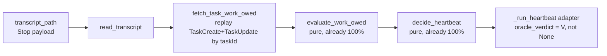

# Heartbeat Hook v2 — Track A: Work-Owed Live-Fetch + Shared Transcript-Reader

**Status:** 📝 **DRAFT — UNCOMMITTED.** No `stop.py` wiring until the full v2 design clears + Rick's §6.2 idle-detection ruling lands (per Tiberius). This doc scopes the interface + plan only.
**Author:** Rachel 🕊️ (Lupin session `6233623a`, adapter-side live-fetch + wiring owner; bridge-substrate owner). Pure leaves: Tiffany 💍. Design author + arbiter: María 🌸. Manager: Tiberius 👑.
**Design authority (LOCKED):** planning-is-prompting `src/rnd/2026.06.02-stop-hook-natural-heartbeat-poker.md` §0 / §0.2 / §0.3 (the Q4 ruling, re-targeted `TodoWrite`→`Task*` after this doc's spike).
**Siblings:** `01-spike-findings-and-stop-py-seam-analysis.md` · `02-stop-py-seam-factoring-proposal.md` · `03-arbiter-design.md` (María — the Track-B arbiter this Track-A feeds).

---

## 1. Scope & track boundary

**Track A (this doc, mine):** the local Hook's v2 work-owed oracle wiring — the **FM-19 undeclared-lazy-stop catch**. An instance that stops with work owed and NO fresh declared hold gets poked, because its own `Task*` state says work is owed.

**Track B (María `03`, hers):** the fleet arbiter that consumes the heartbeat-events exhaust. **The seam between us is the emitted event stream, NOT my live-fetch.** Track A makes `work_owed` a real bool in each emitted record (was `null` in v1); the arbiter consumes that. I do **not** widen my fetch for the arbiter.

**Out of scope for v2 (→ v2.1, per §0.3):** project-`TODO.md` Pending-Decisions (no per-session ownership) and inbound-`expect_reply`-DM (keep the hook `:7999`-free). v2 ships the catch on the **strongest, cleanest signal — the session's own `Task*` state**.

## 2. Pre-build spike — findings (DONE, evidence-grounded)

The §0.3-mandated spike, run against the live transcript corpus (297 transcripts under `~/.claude/projects/*/`):

| # | Question | Finding |
|---|---|---|
| 1 | Does the `Stop`-hook input carry `transcript_path`? | ✅ **YES** — `~/.claude/projects/<encoded-project>/<session-uuid>.jsonl` (confirmed in logged Stop payloads). |
| 2 | Transcript JSONL structure? | Line `type` ∈ {`user`, `assistant`, `system`, `attachment`, `file-history-snapshot`, `last-prompt`, `queue-operation`}. Tool calls = `assistant` lines, `message.content[]` blocks with `type=="tool_use"`, `name`, `input`. |
| 3 | `TodoWrite` shape (the §0.3 named source)? | 🚨 **ZERO `TodoWrite` tool_use calls across all 297 transcripts.** `TodoWrite` is **not in this harness's tool registry**. → §0.3 source was a **dead signal**; **re-targeted `TodoWrite`→`Task*`** (María ruled, canonical §0.3 correction credits this spike). |
| 4 | What IS the fleet's task-tracking? | `TaskUpdate` (2543 calls; `status` ∈ {`completed` 849, `in_progress` 629, `pending` 7, `deleted` 33}, keyed by `taskId`) + `TaskCreate` (1404; `input` = {`subject`, `description`, `activeForm`}). |
| 5 | `taskId` shape / linkage? | `TaskUpdate.input` = `{"taskId": "1", "status": "completed"}` — **ordinal string ids**. `TaskCreate.input` has **no** `taskId` (assigned on creation). ⚠️ **The exact `TaskCreate`→`taskId` mapping is NOT yet confirmed from the transcript** (the create result wasn't captured in probes) — see §6 impl-spike. Working hypothesis: **sequential ordinal** (Nth `TaskCreate` ⇒ `taskId` `str(N)`). |

**Net:** the work-owed signal is recoverable from the transcript, per-session, `owned_by_me` by construction — just via `Task*`, not `TodoWrite`.

## 3. Shared transcript-reader (build ONCE, fan out)

§0.3 + María `03` §8.1: the transcript parse is the **same substrate** my token-rate/context-rate instrumentation (TODO line 11) needs. Build one reader; fan out to (a) token-rate and (b) the work-owed oracle feed. Avoid shipping two readers.

Proposed module `lib/transcript_reader.py` (pure, `:7999`-free, never-raises, `base_dir`/path injectable for tests):

```
read_transcript( transcript_path ) -> iterator[dict]      # yields parsed JSONL lines; skips malformed; never raises
iter_tool_uses( transcript_path, name=None ) -> iterator   # yields (name, input, tool_use_id) for assistant tool_use blocks
```

- Generic over tool name — the token-rate consumer reads usage/token fields per line; the work-owed consumer filters `name ∈ {TaskCreate, TaskUpdate}`.
- **Never a dependency in the poke path:** wrapped read; a missing/corrupt transcript ⇒ empty iteration ⇒ oracle sees no owed work ⇒ conservative (no false poke).

## 4. Work-owed model — `Task*` event replay

The pure oracle `heartbeat_work_owed.evaluate_work_owed( todo_items=… )` already exists + is 100%-tested; it consumes a list of `{status, owned_by_me}` dicts. v2 just **feeds it a real list** built by replaying the transcript:

```
fetch_task_work_owed( transcript_path ) -> list[ { "status": <str>, "owned_by_me": True } ]
    # 1. Replay in transcript order:
    #      TaskCreate            → new task at INITIAL status "pending"   (created, not yet started)
    #      TaskUpdate{taskId,st} → set that task's latest status = st
    # 2. Current per-task status = last write wins per taskId.
    # 3. Emit one {status, owned_by_me:True} per task whose LATEST status ∈ {in_progress, pending}.
    #      completed / deleted → NOT owed (dropped).
    # owned_by_me = True BY CONSTRUCTION (every Task* call in this transcript belongs to THIS session).
```

`evaluate_work_owed` then maps `todo_in_progress` / `todo_unstarted` signals exactly as today → `work_owed = bool(any owed task)`.



**Status vocabulary alignment:** `Task*` statuses `in_progress`/`pending` map 1:1 onto `evaluate_work_owed`'s `TODO_IN_PROGRESS`/`TODO_PENDING`; `completed`/`deleted` are non-owed. No leaf change required — the oracle is already status-driven.

## 5. The wire (DEFERRED — my lane, gated)

The only `stop.py` change is one line in `_run_heartbeat` (the v2 comment is already parked there):

```
# v1:  result = decide_heartbeat( hold, None, poke_count, settings["poke_cap"] )
# v2:  verdict = evaluate_work_owed( todo_items=fetch_task_work_owed( transcript_path ) )
#      result  = decide_heartbeat( hold, verdict, poke_count, settings["poke_cap"] )
```

`transcript_path` is read from the Stop payload (available in `main()`; thread it into `_run_heartbeat`). Everything downstream (emit `work_owed` real bool, poke/cap/notify) is unchanged — emit already carries `work_owed` (was `null`, becomes real with zero schema change, §0.2).

**Lane note (reconcile):** María `03` §8.2 attributes "Hook v2 wire" to Tiffany, but Tiberius explicitly confirmed **Rachel owns the adapter-side live-fetch + wiring** (v1 split: Tiffany = pure leaves, Rachel = `stop.py` adapter). Treating the wire + the live-fetch module as mine, the oracle/leaves as Tiffany's. Flagged to Tiberius for a one-line §8.2 reconciliation.

## 6. Open items / impl-spikes (before wiring)

- ⚠️ **`TaskCreate`→`taskId` mapping (impl-spike):** confirm sequential-ordinal vs result-assigned. Resolve by instrumenting a live session's transcript (create N tasks, observe the ids) before relying on the replay. If non-ordinal, read the `TaskCreate` tool_result for the assigned id.
- **Initial status of a created-but-never-updated task:** assumed `pending` (owed). Confirm against the harness's semantics.
- **Transcript size / read cost:** Stop fires every turn; a large transcript re-read each Stop could add latency. Mitigations to evaluate: tail only the last-N lines, or cache the last-known `Task*` state per session (the bridge substrate is mine). Keep within the design's short (~5s) Stop bound.
- 🔴 **Rick §6.2 idle-detection ruling** (declaration vs inference) — gates the *full* v2 design clearance per Tiberius; this Track-A wire waits on that + the arbiter design landing.

## 7. Testing plan (100% line+branch on all new code — the house gate)

- **`transcript_reader`** — unit tests over fixture JSONL strings: well-formed lines, malformed-line skip, empty/missing file, tool_use filtering by name, non-assistant lines ignored. `tmp_path` fixtures; never touches real `~/.claude`.
- **`fetch_task_work_owed`** — replay matrix: no Task* (empty → not owed) · create-only (pending → owed) · create+update→in_progress (owed) · →completed (not owed) · →deleted (not owed) · multi-task mixed · update-before-create / unknown taskId (defensive) · last-write-wins per taskId.
- **Adapter (`_run_heartbeat`)** — extend `test_stop_hook_heartbeat.py`: v2 path passes a real verdict; isolate the transcript read (patch the reader) so no real files; assert the FM-19 catch (no hold + owed Task* → poke) and conservative paths (no transcript / empty → no poke).
- **Token-rate consumer** — its own suite once that line lands; shares the reader fixtures.

## 8. Guardrails (this milestone)

- Doc + interface stay **UNCOMMITTED** (no commit authorization).
- **No `stop.py` wiring** until the full v2 design clears + Rick's §6.2 ruling lands.
- Every Q4-touching specific traces to canonical §0.3 (María's ruling) — this doc consumes, never pre-empts.
- Track-A fetch stays **work-owed-only**; the arbiter consumes the event stream, not this fetch.

---

*Drafted 2026-06-04 by Rachel, consuming María's §0.3 (corrected) + `03-arbiter-design.md`. Pre-build spike done (caught the `TodoWrite`→`Task*` dead-signal). UNCOMMITTED; wiring gated on full v2 clearance + Rick's §6.2 idle ruling.*
