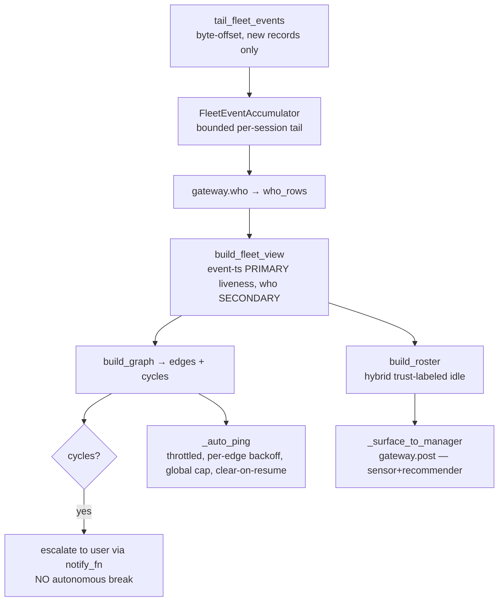

# Heartbeat Arbiter — Consumer Implementation + Seam Findings

**Status:** ✅ Code-complete + 100% (UNCOMMITTED — held for Tiberius's pre-commit review). This doc committed per Rick's documentation-commit directive (2026-06-05).
**Author:** Rachel 🕊️ (wiring lane). Pure leaves: Tiffany 💍. Integration: Mr. Radio 🦉. Design author + threshold rulings: María 🌸. Manager: Tiberius 👑.
**Implements:** `03-arbiter-design.md` (María) §3–§6 + `04-v2-oracle-livefetch-plan.md` (Track A).
**Canonical authority:** planning-is-prompting `src/rnd/2026.06.02-stop-hook-natural-heartbeat-poker.md` §0 / §0.2 / §0.3 / §6.2.

---

## 1. What shipped

The fleet **Heartbeat Arbiter** — the cross-fleet CONSUMER of the local Hook's event exhaust (`~/.claude/heartbeat-events/*.jsonl`). It is a SENSOR + RECOMMENDER (the manager actuates reassignment; the arbiter never auto-assigns), and an **additive observer** of the Hook's exhaust — never a dependency of any local poke (§0 #2). If the arbiter is down, every Hook still pokes.

Package `src/cosa/agents/heartbeat_arbiter/` — **387 stmts / 118 branch / 0 miss = 100%, 103 unit tests**:

| Module | Lane | Role |
|---|---|---|
| `events_tail.py` | Rachel | byte-offset glob/tail of the fleet dir; partial-line-safe, rotation-safe, never-raises |
| `arbiter_state.py` | Rachel | `FleetEventAccumulator` (bounded per-session tail) + `PingLedger` (clear-on-resume) |
| `arbiter_job.py` | Rachel | `ArbiterConsumerJob(AgenticJobBase)` — the poll loop composing the leaves + side effects |
| `arbiter_gateway.py` | Rachel | `LupinArbiterGateway` over `CommonsStore` (`who`/`send_to`/`post`) |
| `fleet_data_model.py` | Tiffany | `build_fleet_view` — per-session `{liveness, state, holding_on, stuck, poke_pressure}` |
| `dependency_graph.py` | Tiffany | `build_graph` — wait-edges + deadlock-cycle detection |
| `ping_throttle.py` | Tiffany | `edge_key` / `should_ping` / `backoff_for_attempt` / `under_global_cap` |
| `idle_roster.py` | Tiffany | `build_roster` — HYBRID (declared ∪ inferred), trust-labeled |

## 2. Architecture — the poll cycle

`ArbiterConsumerJob` extends `AgenticJobBase` (CJ Flow agentic job) with the same injected seams as `HeartbeatPokerJob` — a `Clock` (FakeClock drives the poll/hard-cap loop without real waiting) and an `ArbiterGateway` (FakeGateway records `who`/`send_to`/`post`) → 100% testable, zero real I/O. Each `_poll_once`:

**Lifecycle:** cancelled / hard-cap RETURN normally → queue marks `done`; a single poll's exception is swallowed + logged (observer invariant — one bad poll never kills the arbiter); only an unexpected top-level exception → `dead`.

## 3. Seam findings — the adversarial review paid off

Three real defects were caught by independent reviewers (Tiffany leaf-contract, Tiberius manager, Mr. Radio integration) BEFORE commit — the multi-perspective review is the headline process win:

- **F1 — persona/session_id lookup (med).** `_auto_ping` keyed `edges` by PERSONA but did `fleet_view.get(holder)` on a SESSION_ID-keyed dict → always missed → ping `reason` collapsed to "none" and the throttle degraded to per-(holder,awaited). **Fix (b):** dropped the dead lookup + the unsourceable `{reason}` entirely (the holder's only wait-signal is `awaiting="peer:X"` — circular). Message is now honest ("Session {holder} is holding on you — where are we?"); throttle is correctly per-`(holder, awaited)` via a stable `"blocked"` key.
- **F2 — backoff off-by-one (med).** `backoff_for_attempt(attempt)` used the post-fire count, so the first GATED gap read `backoff_for_attempt(1)=300` not `=60` → schedule was 300/900/3600/3600. **Fix:** `backoff_for_attempt(attempt - 1)` → correct **60 → 300 → 900 → 3600**. Locked by an advancing-clock unit test.
- **F3 — config-dead inference window (med).** Original defaults `idle_threshold=900 > alive_threshold=600` made the inference window `[quiet, alive]` EMPTY → the hybrid roster silently degraded to declared-only, defeating Rick's Option-C hybrid. **Fix (María §6.2):** rename `idle_threshold`→`quiet_threshold`; default `quiet=300 < alive=600`; **fail-fast `__init__` invariant** — raises if `quiet ≥ alive` so the bug-class can never reship silently. Locked by an invariant regression test + a NON-HOLLOW INFER-path test (real timestamps, never hardcoding `alive` — the exact hollowing that hid F3). María confirmed 300/600 canonical (2026-06-05).
  - **Heuristic caveat (María, flag-only):** with `quiet=300` a long single tool-run (>5min/Stop) can read "quiet (inferred)" though working — mitigated by the trust-label (manager weighs an inferred entry before reassigning) + tunability (widen toward 600/1200 if prod is noisy).

## 4. v2.1 perf opt (Hook side)

The Stop hook fires every turn; v2 replayed the transcript TWICE (`fetch_task_work_owed` + `is_task_set_empty`). Refactored `heartbeat_task_state` to expose `owed_items_from_state` + `is_empty_state` (pure, over a replayed state dict); `_run_heartbeat` now calls `replay_task_state` ONCE and derives both → ~230ms → ~115ms worst-case (14MB transcript). `heartbeat_task_state` + the added `stop.py` lines 100%.

## 5. Status + remaining

- ✅ Arbiter package 100% (103 unit tests); v2.1 perf opt 100%; F1/F2/F3 fixed + locked.
- ✅ Full `src/tests/unit/` collection green except the transient F3 rename red-window in Mr. Radio's integration suite (old `idle_threshold` kwarg → re-greening).
- ⏭ Remaining: Mr. Radio integration re-green + F3 defaults-lock → full collection green → Tiberius pre-commit review → combined-commit scope → Rachel commits → **Rick-gated settings.json re-enable** (the heartbeat goes live; the occasional tap on the shoulder begins).
- **Config defaults** (`ArbiterConsumerJob`): `poll_seconds` (required) · `alive_threshold=600` · `quiet_threshold=300` · `ping_global_cap=10` · `ping_cap_window=3600` · `max_duration=43200`. Tunable; the F3 invariant is the guard.

---

*Authored 2026-06-05 by Rachel. The arbiter consumer composes María's design, Tiffany's pure leaves, Rachel's wiring, and Mr. Radio's integration — one dormant-but-ready fleet observer.*
