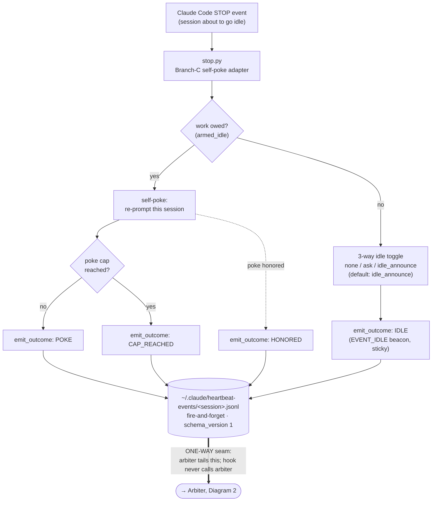
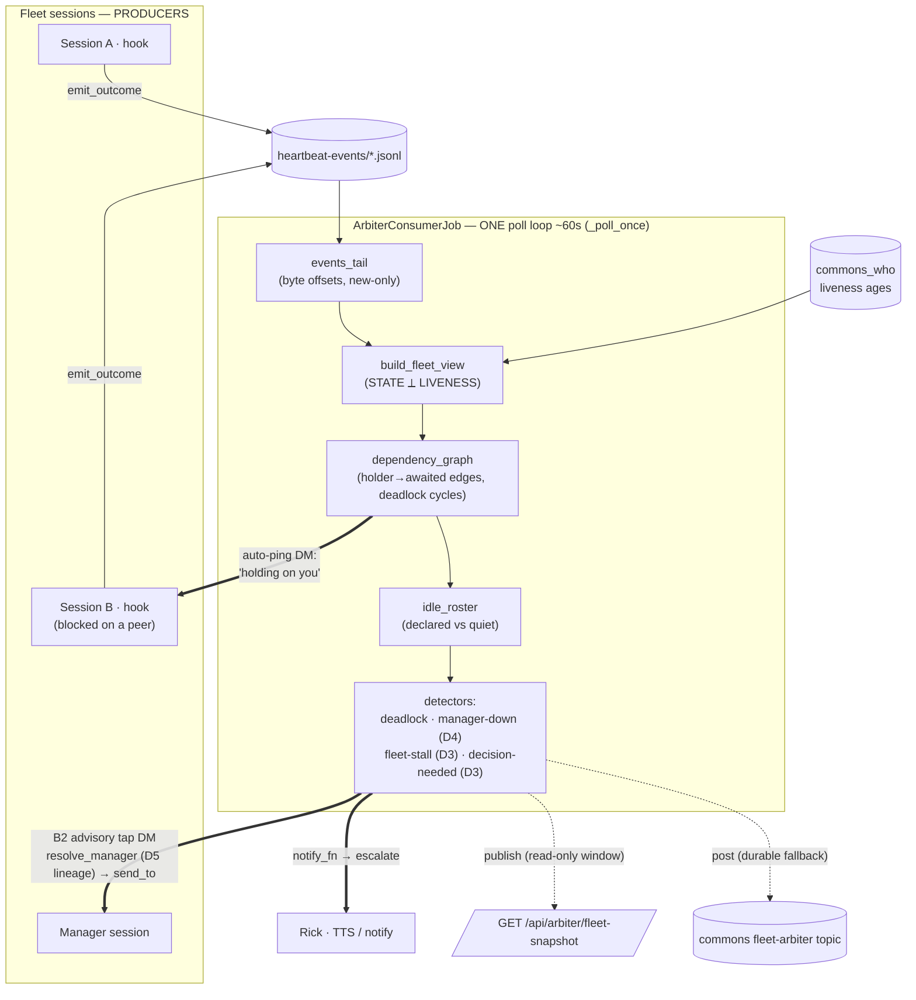
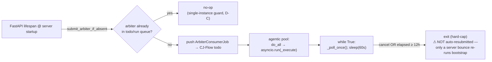
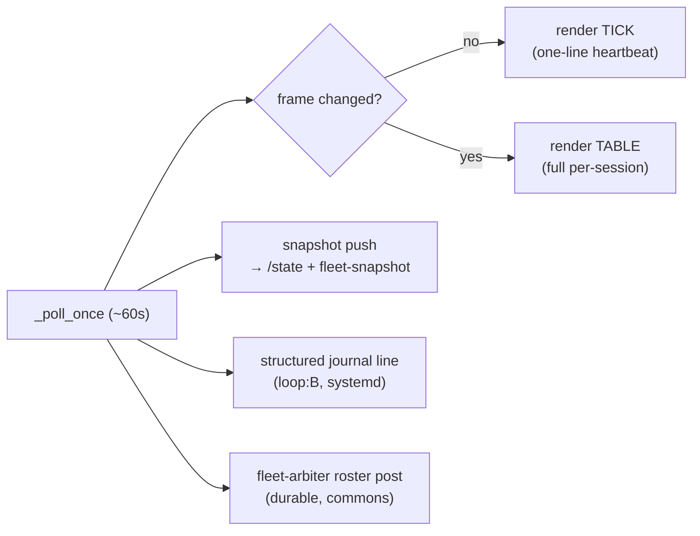
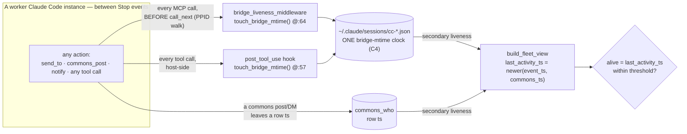

# Heartbeat Hook + Arbiter — Architecture Diagrams (v2.2, as-built)

**Author:** Tiberius 👑 (fleet manager) · **Date:** 2026-06-07
**Scope:** the implementation up to and including the v2.2 closed-loop arbiter, source-grounded.
**Companion to:** the v2.2 engagement docs in `src/rnd/v0.1.8/2026.06.04-heartbeat-hook/` (01-design … 07-clayton-v2.2-closed-loop-log).

---

## TL;DR — the three things Rick asked

1. **How do the components interact?** Two halves joined by one file-system seam. The **Heartbeat Hook** (per session) *writes* outcome events; the **Arbiter** (one standing job) *reads* them and acts. The dependency points **one way only** — the hook never calls the arbiter (María's additive-observer redline).
2. **Who consumes the arbiter's output — does the arbiter itself tap the manager?** **Yes.** The arbiter is its *own* consumer and actuator: inside one poll cycle it reads the event exhaust, builds the fleet picture, and **directly DMs the manager** (`gateway.send_to`). The snapshot endpoint and the `fleet-arbiter` commons topic are *visibility windows only* — nothing reads them to drive the loop.
3. **What remains for a fully-autonomous run with no separate poker?** Three items — see §4. The single iterative loop you want already exists (`_poll_once`); the gaps are *verify-live*, *container file-visibility on :8000*, and *self-perpetuation past the 12h hard-cap*. The interim poker is now **redundant — do not build it**.

---

## 1. Diagram — The Heartbeat Hook (producer side, Thread A)

Each Claude Code session, on its **Stop** event, runs the Branch-C self-poke adapter (`stop.py`). It decides whether work is owed, optionally self-pokes, and emits a canonical outcome record (fire-and-forget) into a per-session JSON-lines file. That file is the **only** coupling to the arbiter.

**Key files:** `src/lupin_cli/claude_code/hooks/stop.py` (emit at :811/:930) · `src/lupin_cli/claude_code/hooks/lib/heartbeat_events.py` (`emit_outcome`, EVENT_IDLE @:62, policy @:64-66).

**Thread A (engagement #2) contribution:** the `none / ask / idle_announce` toggle — `idle_announce` is the default, which emits the EVENT_IDLE beacon so the arbiter can trust-label a session as *declared-idle* (vs merely *quiet/inferred*).

---

## 2. Diagram — The Arbiter closed loop (consumer side)

One in-process job runs a poll loop (~60s). Each pass: tail new events → merge with `commons_who` liveness → build the wait-graph + idle-roster → run detectors → **act**. Actuation is PUSH: the arbiter sends the DMs and escalations itself.

**The consumer answer, precisely:** the **solid arrows** (auto-ping, B2 tap, escalate) are the arbiter *acting*. The **dotted arrows** (snapshot endpoint, fleet-arbiter topic) are *visibility only* — a human/dashboard may read them, but nothing in the control loop does. The manager is tapped by a **direct DM from the arbiter**, not by anyone polling the snapshot.

**Key file:** `src/cosa/agents/heartbeat_arbiter/arbiter_job.py` — `_poll_once` @:261, B2 tap send @:548, auto-ping send @:376, escalations @:402/:606/:645/:697.

### The four v2.2 detectors (D1–D4 + D5 routing)

| # | Detector | Trigger | Action |
|---|----------|---------|--------|
| **D1** | Render cadence | every poll | full table on change, else one-line tick (sign-of-life) |
| **D3a** | Decision-needed | new post on reserved `fleet-decision-needed` topic (PULL/read) | escalate each to Rick |
| **D3b** | Whole-fleet-stall | no *progress* signature change ≥30min **with work owed** | escalate to Rick |
| **D4** | Manager-down | tapped manager silent ≥600s ack-window | escalate + HOLD (no auto-assign) |
| **D5** | Manager routing | per stuck worker | `resolve_manager()` via spawn-lineage, never a hardcoded name |

---

## 3. Diagram — Arbiter lifecycle (B1 standing cadence)

How it runs today. The bootstrap is wired into FastAPI's lifespan; it submits exactly one job to CJ Flow, guarded against duplicates and degrade-safe.

**Architectural decision (design D-A):** in-process CJ-Flow job, **not** cron, **not** a separate host-side daemon — it "dies with the server gracefully." **Key files:** `src/cosa/rest/arbiter_bootstrap.py` (`submit_arbiter_if_absent` @:94) · wired at `src/fastapi_app/main.py:847-848` · loop `_execute` @arbiter_job.py:706, hard-cap `max_duration_seconds = 43_200` @:118.

---

## 4. What remains for "fully autonomous, no poker"

The standing arbiter (lane B1) is **built and committed** (`0d7adad`) and its bootstrap **actually fired on :7999** — the dev log shows `[ARBITER] standing arbiter submitted to CJ Flow (B1 standing cadence)`. So "built ≠ live" collapses to a short list:

1. **Confirm active polling.** Bootstrap-submitted is verified; I have **not yet** confirmed the loop is producing tick/table renders (no render lines surfaced in the log grep — needs the exact render-format grep or an authed `/api/arbiter/fleet-snapshot` read). *Open.*
2. **:8000 container file-visibility.** The arbiter reads host paths (`~/.claude/heartbeat-events/*.jsonl`, session bridges). Inside the test container these must be **bind-mounted**. This is the one real open deployment question — now narrowed from "in-container vs host-side" (decided: in-process) to "are the mounts present."
3. **Self-perpetuation past the 12h hard-cap.** On `max_duration_seconds` exit, nothing re-submits except a server bounce. For *forever*-autonomy: drop/extend the cap, re-enqueue a successor on exit, or add a periodic "ensure-present" tick. **This is the last code gap.**
4. **Interim poker = redundant.** Its only residual function the arbiter doesn't do (stamping idle managers' bridges for broadcast-reachability) belongs to the separate **broadcast-miss listener bug**, which is decoupled. **Do not build the poker.**

---

## 5. Correction logged (verify-before-asserting)

An earlier session memento framed B1 as "designed, not built; the real close." That was **stale**. B1's bootstrap is in-tree, wired into startup, and has fired on the dev server. The honest residual is *verify-live + mounts + self-perpetuation*, not a from-scratch engagement.

---

## 6. The arbiter's OUTPUT side — what it emits on silence, stalls & non-responsiveness

> *Appended by María 🌸 per Rick's 2026-06-07 request.* Source-grounded in `arbiter_job.py`, `arbiter_vigilance/loop_b.py`, and `fleet_render.py`. **Message shapes are identical** for the in-process arbiter (§2–3) and the standalone **:8001** `arbiter-vigilance` service — `loop_b.py` reuses `ArbiterConsumerJob` *verbatim*; only the escalation *routing* differs (§6.5). The :8001 service is now the deploy target (see `planning-is-prompting → src/rnd/2026.06.07-arbiter-deploy-architecture.md`), superseding Diagram 3's in-process lifecycle.

### 6.1 The cardinal invariant stamped on every message

The verb set is **{ who, read, send_to, post }** + `notify_fn` + render/snapshot sinks — all **sense / recommend / escalate, NEVER actuate.** No message assigns work, breaks a deadlock, or reassigns a manager. The phrase *"I observe + recommend; you actuate"* is literally the first line of the manager tap.

### 6.2 How it signals "I'm watching" — sign-of-life even when the fleet is silent

Four parallel channels fire every ~60s poll, so a quiet fleet never makes the arbiter *look* quiet:

| # | Channel | Surfaces at | Example (real format) |
|---|---------|-------------|------------------------|
| S1 | **Render TICK** (unchanged frame = heartbeat) | render sink → log/journal | `tick · no changes for 12m (since 22:29) · 5 sessions · 22:41` |
| S2 | **Render TABLE** (changed frame) | render sink → log/journal | multi-line per-session STATE ⟂ LIVENESS table |
| S3 | **Snapshot push** (queryable state) | `:8001 /state` (`loop_b_fleet` section) · in-proc `GET /api/arbiter/fleet-snapshot` · :7999 proxy `/api/arbiter/fleet-state` | `{ "generated_at": "2026-06-07T22:41:…", "session_count": 5, "sessions": [ … ] }` |
| S4 | **Structured journal line** (per poll, :8001) | systemd journal | `{"ts":"…","service":"arbiter-vigilance","loop":"B","event":"poll_complete","pings":0,"taps":1}` |

**S1 is the load-bearing one:** the TICK distinguishes a *healthy-quiet fleet* (arbiter alive, nothing changed) from a *dead arbiter* (no tick at all). It shows the duration **since the last change**, per Rick's proviso — so "no changes for 110m" is itself a signal.

### 6.3 The message catalog — every kind, one example each

**Family A — ACTIONS (commons DMs + topic posts; the arbiter reaching out):**

| Kind | Trigger | Channel → recipient | Verbatim example |
|------|---------|---------------------|------------------|
| **A1 · Auto-ping a blocker** | a `holder→awaited` blocked edge; throttled (backoff 60→300→900→3600s, global cap 10/hr, clear-on-resume) | `send_to` DM → the **awaited** peer | `Session Clayton is holding on you — where are we?` |
| **A2 · Manager advisory tap** | a stuck/blocked worker needs attention; routed by **D5 lineage** → manager; fires only on crew-summary CHANGE + ≥300s min-interval (anti-storm) | `send_to` DM → manager-on-duty | `Heartbeat arbiter (advisory — I observe + recommend; you actuate).` `I observe: 2 stuck/dead · 1 blocked · 3 free fleet-wide · 0 deadlock cycle(s).` `Stuck: Clayton, Sam` `Blocked: Tiffany` `I recommend: pull a free worker to unblock the stuck, or cajole the blockers. (Recommendation only — I do not assign.)` |
| **A3 · Roster surface** | every poll (durable fallback + visibility window) | `post` → `fleet-arbiter` topic | `Fleet arbiter — 5 session(s).` `Idle-roster (2): Krishna [declared-idle], Mr-Radio [quiet]` `Blocked edges (1): Tiffany→Rachel` `⚠️ DEADLOCK cycle(s) — manager escalation: Rachel → Clayton → Rachel` `Stuck (≥2 cap-reached, work owed): Clayton` |

**Family B — ESCALATIONS to Rick (`notify_fn`; on :8001 each ALSO posts durably to `fleet-escalations`, then best-effort live TTS — §6.5):**

| Kind | Trigger (detector) | Verbatim example |
|------|--------------------|------------------|
| **B1 · Deadlock** | a holder→awaited cycle (NEVER auto-broken) | `DEADLOCK detected (no autonomous break) — escalating: Rachel → Clayton → Rachel` |
| **B2 · Decision-needed** (D3a) | a new post on the reserved `fleet-decision-needed` topic | `DECISION-NEEDED (escalating to Rick) — Tiffany: prod schema migration — drop the column or soft-delete?` |
| **B3 · Whole-fleet-stall** (D3b) | no fleet **progress** ≥1800s **with work owed** — fires *even if the manager's bridge is fresh* ("present but not acting") | `WHOLE-FLEET-STALL: no fleet progress for ≥1800s with work owed — escalating to Rick (manager present-but-not-acting?)` |
| **B4 · Manager-down** (D4) | a tapped manager gives **no liveness within the 600s ack-window** | `MANAGER-DOWN: Tiberius did not ack the arbiter tap within 600s (no liveness since tap) — escalating to Rick + HOLDING (no auto-assign)` |
| **B5 · Unresolved-manager** (D5 routing failure) | a stuck worker whose manager can't be resolved by lineage (never a wrong-manager DM) | `Unresolved manager for attention-needing worker Sam — escalating to Rick` |

### 6.4 Worked example — today's gate-dormancy through the LIVE arbiter

The stall we hit today (build done through L3, manager heads-down on a Rick question, ~110min quiet) maps cleanly onto the catalog. Had the :8001 arbiter been **live**, it would have:
1. fired an **A2 manager tap** to Tiberius when the crew went stuck/quiet;
2. if Tiberius stayed silent past 600s → **B4 manager-down** escalation to Rick;
3. independently, no fleet progress past 1800s with work owed → **B3 whole-fleet-stall** escalation to Rick.

That is exactly the manual stall-catch the Steward did by hand this session — **automated, and triggered in ~30min instead of ~110.**

### 6.5 Escalation routing — in-process vs :8001 standalone

- **In-process (§2–3):** `notify_fn` = the injected sink (TTS / log) — single channel.
- **:8001 standalone (`loop_b.make_escalation_notify_fn`):** every escalation **ALWAYS** posts to the **durable `fleet-escalations`** commons topic (write failure swallowed + logged), **AND** best-effort fires a live notify — the **only** :7999-touching hop, escalation-path only, never per-poll, so a :7999 outage can never block detection (R4 independence). A per-job **warm-up** suppresses escalations for the first `start_period_seconds` after every (re)start, so cold boot / systemd restart / recycle never false-fire.

---

## 7. The fleet's signs-of-life — passive liveness evidence from DMs, commons posts & every tool call (INPUT side)

> *Appended by María 🌸 per Rick's 2026-06-08 request.* Symmetric to §6: §6 is the arbiter's OWN sign-of-life (its **output**); **this is the fleet's signs-of-life that the arbiter CONSUMES (its input).** Source-grounded in `fleet_data_model.py`, `bridge_liveness_middleware.py`, `post_tool_use.py`.

§1's heartbeat exhaust is the **explicit, declared** signal — but it only fires at a session's **Stop** boundary. Between Stops, a Claude Code instance keeps emitting **implicit signs of life** simply by *interacting*: every DM (`send_to`), every commons post/read, every `notify`, in fact **every tool call**. The arbiter already folds these in — they are the **SECONDARY liveness signal** behind the `STATE ⟂ LIVENESS` split in Diagram 2. This section makes that evidence layer explicit, because it is precisely what stops a **heads-down worker from looking dead.**

### 7.1 Two signals, two timescales

| | **Heartbeat-hook event** (§1) | **Interaction sign-of-life** (§7) |
|---|---|---|
| Fires when | session hits **Stop** (idle boundary) | **continuously** — on any DM / commons post / tool call |
| Carries | declared outcome + owed-work + `holding_on` → **STATE** | a recency timestamp (+ semantic content if a DM/post) → **LIVENESS** |
| Role in `build_fleet_view` | **PRIMARY** + the membership gate (≥1 event ⇒ trackable) | **SECONDARY** liveness, folded via `_newer( event_ts, commons_ts )` |
| Blind spot it covers | — | the **long heads-down task**: no Stop for an hour, yet plainly alive |

### 7.2 The two capture mechanisms — both feed ONE host-side clock

- **commons_who ts** — a worker's DM/commons post stamps a row whose ts `build_fleet_view` folds in via `_newer( last_event_ts, _commons_ts_for_session( who_rows, sid ) )` (`fleet_data_model.py:150`). So **talking to a peer is itself a liveness ping.**
- **bridge-mtime clock** — every MCP tool call bumps the calling session's bridge mtime **BEFORE** the call runs (`bridge_liveness_middleware.py:64`; PPID/grandparent walk attributes the stamp to the **calling** CC session, not the shared server), and the host-side **PostToolUse** hook stamps on **every** tool call "so a heads-down worker" stays fresh (`post_tool_use.py:48-57`). This covers the worker who is busy but **not** touching commons at all.

### 7.3 Why it's EVIDENCE, not noise — the state-inference grid

Cross the two channels and the worker's true state falls out with a confidence **neither channel alone gives**:

| Event exhaust | Interaction freshness | Inferred state | Confidence |
|---|---|---|---|
| fresh **IDLE** beacon | (any) | **declared-idle / holding** | high — *declared* |
| **stale** (no Stop ≥ window) | **fresh** (DM / post / tool call) | **alive, heads-down working** | the **blind-spot save** — reads "stale/dead" on a Stop-only view |
| fresh | fresh | **corroborated working** | high — two channels agree |
| **stale** | **stale** | **genuine stall / possibly-dead** | **high — two independent channels agree** ⇒ the real escalation trigger |

Two things the bare mtime can't give:
1. **Semantic disclosure** — a DM/commons post isn't only a tick; its *content* discloses state (`holding_on: Rachel`, a `fleet-decision-needed` post, an A3-style roster line). The interaction layer is a **state** signal, not merely a **liveness** signal.
2. **Independence** — the event-file ts is `:7999`-free (local read) while commons_who rides `:7999`; with two capture paths a single saturation/outage never blinds the liveness read (the R4 independence property, seen from the consumer side).

### 7.4 The precise caveat — an ENRICHER, never a membership SOURCE

`build_fleet_view` returns a VIEW **only for a session with ≥1 valid heartbeat event**; *"sessions with no/invalid events are skipped (not trackable)"* (`fleet_data_model.py:127,134`). So the signs-of-life layer **sharpens the liveness + state of already-known sessions — it never ADDS one.** A worker that posts to commons but has **never** emitted a heartbeat event is invisible to the roster. Liveness is **event-ts PRIMARY, commons_who SECONDARY** (`fleet_data_model.py:11-15`): the interaction layer is the corroborating witness; the heartbeat exhaust is still the gate of record.

---

— 🌸 María, Workflow Steward, 2026-06-07 (§6 arbiter output) + 2026-06-08 (§7 fleet signs-of-life input), appended per Rick; source-grounded
