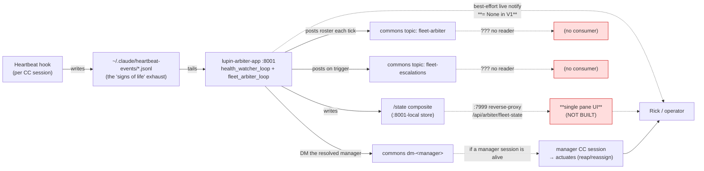

# Heartbeat Arbiter — Consumption Gap & Operator Loop (backfill)

**Date:** 2026-06-08
**Author:** Tiberius 👑 (session d9e65cd8)
**Why this doc:** Rick asked the questions the design docs never answered head-on — *who consumes `/api/arbiter/fleet-state`? where is it rendered? what does the arbiter actually DO when it decides a worker should be reaped? how do we USE and DRIVE this thing?* — and sensed "something is missing." This doc answers each from the **live, verified system** (not the design intent), names the gap, and lists the decisions to close it. It is a **documentation/architecture deliverable** — no code is changed here.

---

## TL;DR

The arbiter is **live and working** — it consumes the heartbeat-hook exhaust, renders a fleet view, and **escalates** on triggers. But the loop is **open on the output side**: its escalations and state surface have **no consumer**. Proven in the live data — the arbiter posted *"WHOLE-FLEET-STALL … escalating to Rick"* to a commons topic **twice (14:43 + 15:17 EDT on 2026-06-08) and Rick never received it**, because (1) the live-notify push to Rick is `None` in V1, (2) no UI renders `/fleet-state` or the escalation feed, and (3) nothing watches the commons topics it writes to. **We built the sensor; we did not build the receiver.**

---

## Part 1 — What the arbiter is, and its place in the system

The Heartbeat Arbiter is a **standalone, out-of-band SENSOR + RECOMMENDER** — now running as the host-side `lupin-arbiter-app` systemd service on `:8001` (post-R0 cutover, 2026-06-08). It is, by hard design, **never an actuator**: its verb set is `{who, send_to, post, read}` — all sense/recommend/escalate, **zero** actuate (`arbiter_job.py:92`).

The dotted/red paths are the gap. The solid paths all work today.

---

## Part 2 — What actions the arbiter ACTUALLY takes (Rick's explicit ask — verified live)

### 2a. Observational actions (active, verified)
| Action | Detail | Evidence |
|---|---|---|
| **Consume** the heartbeat exhaust | tails `~/.claude/heartbeat-events/*.jsonl` from tracked offsets | service log `loop_b_render · 20 session(s)` |
| **Health-watch** 4 containers | `docker inspect` every 30s → healthy/transitions | log `health_obs` for lupin-rest-dev/test/model-server/postgres |
| **Write** the `/state` composite | sections `health_watcher` + `fleet_arbiter` (**current code:** `loop_a` + `loop_b_fleet` — renaming globally per Decision 6) to the :8001-local store | `:8001/state` returns the composite |

### 2b. Communication / escalation actions (active, verified — these are the only "outward" actions)
| Action | Topic / target | Trigger | Evidence (live) |
|---|---|---|---|
| **Post fleet roster** | commons `fleet-arbiter` (`ROSTER_TOPIC`) | every poll (~60s) | posted at 15:22, 15:23, 15:24 EDT… — "Fleet arbiter — 20 session(s). Idle-roster (17)… Blocked edges: (none)" |
| **Post escalation** | commons `fleet-escalations` (`ESCALATION_TOPIC`) | deadlock cycle · whole-fleet-stall · manager-down | **FIRED**: "WHOLE-FLEET-STALL: no fleet progress for ≥1800s with work owed — escalating to Rick" at **14:43 + 15:17 EDT** |
| **DM the resolved manager** | commons `dm-<manager>` via `send_to` | a stuck worker whose manager resolves from spawn-lineage | code `arbiter_job.py:548`; advisory "I observe… / I recommend…" tap |
| **Ping a blocker** | commons `dm-<blocker>` via `send_to` | an awaited dependency holder | code `arbiter_job.py:376` |
| **Read** decision requests | commons `fleet-decision-needed` (`DECISION_TOPIC`) | tails it; re-escalates new posts | code `arbiter_job.py:635` |
| **Best-effort live notify to Rick** | a `:7999` notify hop | escalation only | **`None` in V1** (`app.py:208` — "documented build-time follow-up"); **never fires today** |

### 2c. Actuation actions — **NONE** (verified)
Grepped both arbiter packages for `reap|kill|dismiss|terminate|spawn|delete|stop|cancel`. **No fleet actuation exists.** The only matches are: `os.kill(pid, 0)` (a *liveness probe* — signal 0 checks existence, kills nothing — and it's in Rachel's separate `context_pressure.py` leaf, not the arbiter loop), and `loop.stop()` (the service stopping its *own* background threads on shutdown). **So when the arbiter "decides a worker needs reaping," it does NOT reap — it posts an advisory recommendation and escalates. A human (Rick) or a manager CC session must do the actual reaping.**

---

## Part 3 — The consumption gap (the "something missing"), proven

The arbiter's three output channels each terminate in a **non-consumer**:

1. **`/api/arbiter/fleet-state`** — a queryable state surface. The `:7999`/`:8000` reverse-proxy (just wired, Option 2, 2026-06-08) makes it *reachable*, **but no frontend renders it.** Grepped all of `static/html/` + `static/js/` — zero references. It is an **orphan endpoint**: a "single pane" with no pane.
2. **Live notify to Rick** — `live_notify_fn = None` in V1 (`app.py:208`). **The arbiter never pushes to Rick.** Escalations go only to the durable commons topic.
3. **Commons topics `fleet-arbiter` / `fleet-escalations`** — durable + shared (readable via `commons_read`), **but nothing/nobody watches them.** No UI, no listener, no always-on consumer.

**The proof it matters:** at 14:43 and 15:17 EDT the arbiter detected a whole-fleet stall and posted *"escalating to Rick (manager present-but-not-acting?)"*. Rick was at the console the whole time and **received nothing** — the escalation landed in `fleet-escalations` with no reader. The arbiter did exactly its job; the message had no destination.

> **Calibration nuance (separate, log it):** that "no fleet progress for ≥1800s with work owed" fired *while the fleet was actively working* (the rename + cutover). The stall detector keys on heartbeat-event *progress signals*; our interactive work apparently didn't emit the signal it counts as "progress." So the detector currently has a **false-positive mode** worth tuning before escalations are pushed to Rick (else he'd get noise).

---

## Part 4 — How to observe/drive it TODAY (current-state operator playbook)

Until the gap is closed, the arbiter's output is reachable **only** by pull:
- **Fleet roster:** `commons_read(topic="fleet-arbiter")` — the latest fleet view (sessions, idle-roster, blocked edges), refreshed ~60s.
- **Escalations:** `commons_read(topic="fleet-escalations")` — deadlock / stall / manager-down alerts.
- **Raw state:** host-side `curl http://127.0.0.1:8001/state` (or via the now-wired proxy `GET /api/arbiter/fleet-state` with JWT/X-API-Key).
- **Service health/logs:** `systemctl --user status lupin-arbiter-app` · `journalctl --user -u lupin-arbiter-app -f`.
- **Acting on an escalation:** there is no automated path — a human or a manager session reads the recommendation and actuates (reap/reassign/unblock) manually.

---

## Part 5 — Open decisions to close the gap (NOT a build plan — your calls)

1. **Push escalations to Rick.** Wire the V1 `live_notify_fn` to a real `:7999` notify (the "documented build-time follow-up"). Smallest, highest-leverage fix — turns silent escalations into a ping. **Gate on the Part-3 detector calibration first** so the first thing Rick gets isn't a false stall.
2. **Build a consumer/renderer.** Decide the surface: a `/fleet-state` dashboard page in the web UI? a "fleet" tab that tails `fleet-arbiter` + `fleet-escalations`? a notifications-inbox card? This is the "single pane" that was designed-around but never built.
3. **Guarantee an escalation consumer.** Today it assumes a manager CC session is alive to receive DMs. Decide: always-on manager? a durable inbox Rick checks? auto-route escalations into the existing notifications system?
4. **Calibrate the stall/decision detectors** (Part-3 false positive) before #1 ships.
5. **Decide the actuation policy** — the never-actuate redline is deliberate; confirm it stays advisory-only (human/manager actuates) vs. ever granting bounded actuation (e.g., auto-reap a provably-dead worker).
6. **Rename the loops — ONE descriptive name everywhere, no mapping, break the contract (Rick's ruling, 2026-06-08).** The generic `loop_a` / `loop_b` / `loop_b_fleet` / `LoopBRunner` labels — build-lane shorthand ("Loop A/B", lanes L1–L4) that **leaked out of the implementation and into the public `/state` contract** — get replaced by the **same descriptive name at every layer** (class, runner, store section, `/state` field, log event, docs, INI keys), with **no aliasing and no backward-compat shim** — *we own every consumer, so change it globally*:

   | Concept | OLD (generic) | NEW (one name everywhere) |
   |---|---|---|
   | Health-watch loop (class / runner) | `HealthWatchLoop` / "Loop A" | `health_watcher_loop` / `HealthWatcherLoop` |
   | Fleet-arbiter loop (class / runner) | `LoopBRunner` / "Loop B" | `fleet_arbiter_loop` / `FleetArbiterLoop` |
   | `/state` section — health output | `loop_a` | `health_watcher` |
   | `/state` section — fleet output | `loop_b_fleet` | `fleet_arbiter` |
   | log events | `loop_a_disabled`, `loop_b_render` | `health_watcher_disabled`, `fleet_arbiter_render` |

   **Blast radius (rename together, no shim):** `local_snapshot_store.py` (section keys), `app.py` (`/state` composite keys + the per-section `awaiting` placeholders), `loop_b.py` / `health_watch.py` (class + runner + log-event names), the `:7999` proxy `routers/arbiter.py` (it reads `loop_a` / `loop_b_fleet` from the pulled composite), every test asserting those keys, and this doc. **Principle (Rick, verbatim): "break everything and do it right" — we control all the pieces; no compatibility layer.** Best run as a coordinated rename engagement (the `lupin_app` model: implementer + reviewer, case-insensitive zero-residual grep, the full gate) — not a drive-by. *(Open micro-choice: the fleet section could be `fleet_arbiter` (matches the loop root, no mapping) or `fleet_view` (output-noun) — defaulting to `fleet_arbiter` per "same name everywhere.")*

---

### 5b — Recipient routing model (Rick's direction, 2026-06-08)

The fix for Part 3 is **not** "add a reader to the blackboard topics" — it is **route each output, by directed push, to the human/sessions who must act on it**, and stop writing to voids. The current topic-posts ARE the blackboard; the target is push-DM-to-recipient.

| Arbiter output | Current (verified) | → Recipient(s) | → Mechanism |
|---|---|---|---|
| **Escalation** (stall / deadlock / manager-down) | post to `fleet-escalations` topic (no reader) | **Rick (the human operator)** + **every active manager on duty** | push DM to Rick (the live-notify, Decision 1) **+** `send_to` each live manager |
| **Stuck / dead worker** | `send_to` the resolved manager (already exists, `arbiter_job.py:548`) | **the worker's manager(s)** | keep — directed manager DM (Rick affirmed) |
| **Blocker in the critical path** | terse `send_to` ping (already exists, `arbiter_job.py:376`) | **the blocker, directly** | an explicit, actionable DM, e.g. *"You're getting in the way of progress — worker X is blocked waiting on you. Post your status / unblock them."* (names the blocked worker + the ask) |
| **Fleet roster** (every ~60s) | post to `fleet-arbiter` topic (no reader) | **nobody, as a broadcast** | this is *pull* state — it IS `/state` (+ a future UI). **Question the per-tick topic-post entirely**: a roster is something you *query*, not something the arbiter spams every minute. Likely drop it. |

**Net principle:** escalations + worker-problems + blocker-nudges are **push** (directed DMs that wake the recipient); the roster/fleet-view is **pull** (`/state`). Stop posting push-shaped content to topics nobody polls.

**Net-new this requires — an "active managers on duty" resolver:** to push an escalation to *every* active manager, the arbiter must enumerate live manager sessions at escalation time (e.g. `commons_who` + a manager-role signal). That resolver does not exist yet.

**Two judgment calls for Rick:** (a) escalate to **ALL** active managers vs. only the **owning/resolved** manager (all = more eyes, but noisier with a big crew); (b) **drop** the roster topic-post entirely vs. keep a lightweight version as an audit trail.

---

## Part 6 — Comprehensive output review (every case: recipient + mechanism + utility)

Every distinct message the arbiter emits, enumerated from the code, each with a reasoned default per Rick's recipient model (push to who-must-act; drop blackboard voids; blockers get direct actionable DMs). **Today:** every `notify_fn(...)` case posts to `fleet-escalations` (→void); `send_to(...)` cases are directed DMs (reach the recipient if alive); the roster is a `fleet-arbiter` post (→void).

| # | Case (trigger) | Loop | Today | → Recipient(s) | → Mechanism | Utility verdict |
|---|---|---|---|---|---|---|
| 1 | **Container enter-unhealthy** (postgres/model-server goes unhealthy) | A | →void | **Rick (operator)** | push | KEEP — ops alert; managers don't act on infra |
| 2 | **Container flapping** | A | →void | **Rick** | push | KEEP — ops alert |
| 3 | **Health-watch BLIND** (watcher's own `docker inspect` failed) | A | →void | **Rick** | push (high) | KEEP — "the arbiter's eyes are out"; operator must know |
| 4 | **Blocker holding up a worker** | B | DM blocker (terse: *"Session X is holding on you — where are we?"*) | **the blocker** (+ cc owning manager?) | push DM | KEEP + **REWRITE**: *"You're blocking worker X — they're waiting on you; post your status / unblock them."* |
| 5 | **Deadlock cycle** (mutual block, never auto-broken) | B | →void | **Rick + the involved managers** | push | KEEP — needs a human/manager to break it |
| 6 | **Fleet roster** (full roster every ~60s) | B | post→`fleet-arbiter` (void) | **nobody, as a push** | — | **DROP the per-tick post** — it's pull state (`/state` + a future UI); a roster is *queried*, not broadcast |
| 7 | **Manager tap** (*"I observe N stuck · M blocked · I recommend…"*) | B | DM resolved manager | **the owning manager** | push DM | KEEP — the core actionable manager nudge |
| 8 | **Unresolved-manager worker** (stuck worker, no manager resolves) | B | →void ("to Rick") | **Rick + all active managers** | push | KEEP — last resort; any manager could adopt the orphan |
| 9 | **Manager-down + HOLD** (a manager went dark mid-engagement) | B | →void ("to Rick") | **Rick + all active managers** | push | KEEP — leaderless crew; re-staff |
| 10 | **Decision-needed** (a session asked for a human decision) | B | →void ("to Rick") | **Rick** (+ owning manager if known) | push | KEEP — decisions are the human's domain |
| 11 | **Whole-fleet-stall** (no progress ≥Ns, work owed) | B | →void ("to Rick") | **Rick + all active managers** | push | KEEP — but **calibrate first** (the false-positive that fired while we worked) |
| 12 | **Arbiter poll-error** (self-error, loop continues) | B | →void | **(none)** | log-only | **DEMOTE to log** — transient self-diagnostic; escalate to Rick only if persistent |

**The pattern that falls out — three recipient tiers + two cuts:**
- **Operator (Rick) only, push:** infra + self-health (#1, #2, #3) — managers don't act on containers.
- **Rick + all active managers, push:** fleet-level crises (#5 deadlock, #8 orphan worker, #9 manager-down, #11 fleet-stall) + decisions (#10, Rick-primary).
- **Owning manager / the blocker, DM:** the per-worker manager nudge (#7) and the blocker (#4, rewritten).
- **Cut:** drop the roster broadcast (#6 → `/state`); demote the poll-error (#12 → log).

**Net-new mechanisms this implies:** (a) the **live push to Rick** (Decision 1 — `live_notify_fn` is `None` today); (b) an **"active managers on duty" resolver** (`commons_who` + a manager-role signal) for the Rick+managers tier; (c) **message rewrites** (#4) + a **per-tier severity/priority**.

**Judgment calls — RESOLVED (Rick, 2026-06-08, guided walkthrough):**
1. **#6 roster → DROP the broadcast entirely.** It's pull-state (`/state`); history, if ever wanted, logs separately.
2. **#4 blocker → DM the blocker AND cc the blocker's manager.** Direct nudge + the manager looped in to chase if the blocker goes silent.
3. **Fleet crises (#5/#8/#9/#11) → push to Rick + ALL active managers.** Resilient to the owning-manager-is-down case; rare+severe so noise is negligible.
4. **#12 poll-error → log normally; escalate to Rick only if PERSISTENT** (N consecutive failures = arbiter effectively down). No spam on transients.
5. **#1–3 infra/self-health → Rick only.** Alerts go to whoever can act; only the operator restarts containers. (A total shared-server outage needing a fleet heads-up is a narrow later special-case, not the default.)

**→ The recipient model is now fully ratified.** Remaining to make it real (a BUILD, not yet started): wire the **live push to Rick** (`live_notify_fn`, currently `None`), build the **"active managers on duty" resolver**, apply the **drop/demote/cc/fanout** routing per the table, rewrite the **blocker message**, add **per-tier severity**, and calibrate the **whole-fleet-stall** detector (#11) before #11 ships. Best run as a coordinated crew engagement (the `lupin_app` model) — alongside or after the Decision-6 loop-rename.

---

## Part 7 — Liveness unification (Phase-2 design; Tiberius + Rachel, 2026-06-08)

### ✅ AGREED DEFINITION OF LIVENESS — multi-signal union (the common reference point)

> *(Updated per Rick's reframe — Tiberius + Rachel concur; **✅ LOCKED Rick 2026-06-08**. Supersedes the bridge-only draft.)*
>
> **A worker is ALIVE if ANY recent live signal says so** — the union **biases toward ALIVE** (a false-DEAD that loses a live worker is worse than a brief false-ALIVE that ages out fast). Two liveness INPUTS, OR'd:
>
> **(1) Process liveness** — session bridge exists AND **the resolved process pid** (Q2: `listener_pid` / `cc_pid` / both) passes `kill -0`, bridge mtime fresh. The PURE leaf primitive `context_pressure.assess_liveness` (stdlib only), three states:
> - **ACTIVE** — the resolved pid alive AND bridge mtime fresh (< `idle_mtime_seconds`): up and recently moving.
> - **IDLE (still ALIVE)** — the resolved pid alive but bridge mtime stale: up but quiet. **An idle worker is ALIVE — "no recent events" must NEVER be read as dead/offline.**
> - **DEAD** (process axis) — no live bridge, or PID fails `kill -0`.
>
> **(2) Behavioral liveness** — recent **commons activity** (DM / notification / post) within the recency window. PID-agnostic + bridge-agnostic; from the arbiter's own `who_rows`. **Backstops the process axis** — covers a `listener_pid`/`cc_pid` proxy misread, and a live session that has no bridge.
>
> **(3) Idle-prompt liveness** *(Rick's catch, 2026-06-08 — the 4th signal, added post-lock)* — the native CC **`Notification` event of type `idle_prompt`** ("Claude is waiting for your input"), emitted by the **Claude CLI itself (`cc_pid`)** when a session goes idle. **The STRONGEST passive signal we have:** every other input is a weaker proxy — bridge-mtime + `kill -0` prove only the *listener sidecar*; commons-recency proves only *something posted*; `idle_prompt` proves the *exact turn-producing process* reached idle. It **passively resolves the #2 BOTH-pid concern for the idle case** — free, unambiguous `cc_pid` evidence with zero injection (it does NOT replace the BOTH-pid check, which still covers the working/silent case). **Today it is DISCARDED:** `notification.py`'s `idle_prompt` branch does only `log_payload` + voice-buffer drain + `send_tts` — it emits **no** heartbeat/fleet event, so `build_fleet_view` (stop-stream + `who_rows` only) never sees it (verified in code, 2026-06-08). **Caveat — it's an EDGE event:** fires once, at the moment of going idle, not continuously; a busy session never emits it (consistent with busy-vs-wedged staying passively unresolvable). So it is a **recency/age INPUT (a fourth age), NOT a new continuous axis.**
>
> A session is **DEAD only when NO input is recent.**
>
> **The ARBITER is the integrator / authority:** it discovers the roster as the **UNION** of (bridge-discovered sessions, via the pure leaf primitive) ∪ (commons-active sessions, via `who_rows`), and OR's the two inputs. **The leaf stays a pure process primitive — the union is an arbiter-layer concern.**
>
> **Four liveness signals, four DISTINCT ages** — never collapsed: `bridge_age_s`, `commons_age_s`, `idle_prompt_age_s`, `stop_event_age_s`; `freshest_age_s = min(...)` so a consumer sees WHICH signal proved liveness. (Today's bug = the roster was built from `stop_event_age` ALONE.)
>
> **ACTIVITY is still the separate, orthogonal axis** — working / stuck / holding / blocked, from event *content*. Same commons stream, two questions: **recency → liveness; content → activity** (v2.1 **C4** orthogonality).
>
> **Consumers** (the memory-pressure readout + the routing "active-managers-on-duty" resolver) build off the arbiter's published liveness; the pure leaf is their interim/fallback (per the Ownership block below).
>
> **Forward-note (readout impl, Rachel-owned):** a session that is **process-DEAD but commons-recent** is union-ALIVE, but its transcript is frozen — so its memory-pressure figure is **last-known, not current** (useful: "died at 87%"). The readout must **label pressure as STALE** when liveness was proven by commons-only.

**The finding (Rachel, decisively tested):** the arbiter's live-roster is empty of the actually-running fleet. Probing the live `:8001/state` `loop_b_fleet`: 20 sessions, **every one `verdict: offline`**, `event_age_s` 2+ days, `bridge_age_s: null`. Meanwhile 5 workers are genuinely alive (Rachel/Tiberius/maria active; Tiffany/Rio idle-but-alive).

**Root cause (corrected — NOT a lookup bug).** Rachel tested the `get_bridge_mtime` hypothesis and disproved it — given the *live* session_ids it returns fresh mtimes (27s, 46s). The real bug is **upstream**: the arbiter builds its roster from a **frozen event source** (`build_fleet_view` over `events_tail`, events 2+ days stale). It tracks ~20 **dead historical** sessions (old session_ids; their bridges are gone → `bridge_age` null → offline) and is **blind to the live sessions** — they never entered the event-sourced roster at all. The `alive` verdict is itself event-recency (`fleet_data_model`: alive = activity within the ~1h `alive_threshold`), so even a live session in the roster would read "offline" while idle. **Event-blindness is primary; bridge-null + PID-absent are downstream symptoms on an already-dead roster.**

**This is the root of the false WHOLE-FLEET-STALL** (Part 3 + #11): the arbiter saw its dead roster as 100% offline → "no progress" → escalated. Live-bridge discovery eliminates that false escalation.

**RICK'S REFRAME (2026-06-08 — OPEN; Tiberius confirmed in code, Tiberius+Rachel aligning).** The root is *deeper* than "the arbiter doesn't use bridge/PID." The arbiter **already captures live per-session activity timestamps** — commons DM / notification / post activity (`who_rows`) — which are unambiguous liveness markers. But `build_fleet_view` (`fleet_data_model.py:139`) builds the roster by iterating **`events_by_session` ONLY** ("sessions with no valid event are SKIPPED — not trackable"); `who_rows` is used merely to *annotate* the liveness of a session **already in** the roster (`:150` `_commons_ts_for_session`), never to **add** one. And `events_by_session` = the **STOP-hook outcome log** (`stop.py` `emit_outcome`) — sparse (fires only on turn-completion) + frozen for the live fleet (the live sessions have **no** entries in `~/.claude/heartbeat-events/` at all). **So the arbiter HAS the live activity data and discards it for roster-building.** → The fix should be **MULTI-SIGNAL**: a session is **ALIVE if ANY recent live signal** — **(a)** bridge-mtime fresh + PID up (process liveness), OR **(b)** recent commons activity — DM/notification/post (behavioral liveness, already in `who_rows`). **Roster = UNION** of all sessions with any recent live signal; the stop-outcome events demote to one input on the ACTIVITY axis (working/idle/stuck). This also **backstops the FLAG-2 listener-PID-proxy risk** — the process + behavioral axes cover each other. *(Pending Tiberius+Rachel concurrence + Rick's lock; the agreed-definition box above will broaden to "process-up OR recent-commons-activity" once locked.)*

**The fix — one canonical LIVENESS axis, orthogonal to ACTIVITY (the v2.1 C4 principle, applied to roster construction):**
- **LIVENESS (is the process up?)** = **live-bridge discovery** — `session_bridge.find_active_voice_persona_sessions()` → bridge mtime + `listener_pid` `kill -0` (3-state). This *builds the roster*. Rachel's `context_pressure` leaf already implements this primitive.
- **ACTIVITY (what is it doing?)** = the **event tail** (working / stuck / holding / blocked) — kept, but **demoted** from "decides existence" to "annotates a live session," joined by `session_id`.
- **ONE canonical liveness primitive**, living in `heartbeat_arbiter` (the shared engine every host imports), feeds: **(a)** the arbiter roster-builder + `verdict`, **(b)** Rachel's context/memory-pressure readout, **(c)** the routing **"active-managers-on-duty" resolver** (Part 6). No divergent liveness implementations disagreeing.

**For Rick's memory-pressure readout NOW (Q3 = JOIN):** Rachel's bridge/PID liveness is the live-filter source-of-truth; pull the arbiter `/state` for supplementary *context* only (roles, blocked-edges, holding-on) — do **not** trust the arbiter's liveness verdict until Phase 2 lands.

**Ownership (Rick's directive, 2026-06-08 — ✅ CONFIRMED):** the **ARBITER holds the canonical liveness.** Fix the arbiter's roster-capture FIRST (build the roster from bridge-discovery, below), then downstream consumers **build off the arbiter's published `/state` liveness.** Concretely:
- **Shared primitive (canonical, import-not-reimplement):** `session_bridge.find_active_voice_persona_sessions(stale_threshold_seconds=43200)` (discovery — already applies a COARSE host-side PID + 12h-mtime filter) → re-read each bridge for `listener_pid` → `context_pressure.assess_liveness(listener_pid, mtime, *, now, idle_mtime_seconds=1800)` (⚠️ `now` is a **REQUIRED kw-only arg** — pass `now=time.time()` or an injected clock) → `ACTIVE` / `IDLE` / `DEAD` (drop DEAD) → JOIN the event-tail ACTIVITY by `session_id`. **Layering:** `find_*` is the coarse discovery filter; `assess_liveness` is the PRECISE 3-state refinement on top (belt + suspenders). Pure-leaf, 100% covered.
- **Arbiter = single authority** — its roster-builder uses the primitive + publishes the correct fleet-liveness in `/state`.
- **Rachel's memory-pressure readout consumes the arbiter's `/state` liveness (post-fix), gated on a FRESHNESS + TRUSTWORTHY check:** prefer `/state` when `generated_at` is recent (within ~2× the arbiter poll interval); **fall back to the leaf-direct primitive when `/state` is (a) unreachable, (b) stale, OR (c) not-yet-fixed.** Right now `/state` liveness is WRONG (all-offline), so leaf-direct is the interim source until the fix lands. Rule: *"consume `/state` when fresh AND trustworthy, else leaf-direct."*
- **Trade-off (mitigated):** consuming the arbiter couples the readout to arbiter uptime/freshness; the freshness-gated direct-primitive fallback covers unreachable / stale / unfixed.
- **✅ LOCKED #1 (Rick, 2026-06-08, guided walkthrough) — sequencing: FIX-ARBITER-FIRST, no interim.** The **arbiter roster-from-bridge-discovery fix is the priority deliverable**; Rachel's readout-off-`/state` is gated behind it (the readout ships only against the fixed `/state`). No throwaway interim leaf-direct readout. *(The freshness-gated leaf-direct FALLBACK still exists for when `/state` is unreachable/stale — fix-first declines the interim as the PRIMARY path, it doesn't remove the fallback.)*
- **✅ LOCKED #2 (Rick, 2026-06-08, guided walkthrough) — liveness PROXY: check BOTH.** A session is process-alive iff **EITHER `listener_pid` OR `cc_pid` passes `kill -0`.** Rationale: `assess_liveness`'s `kill -0` today targets only `listener_pid` = the **`cc_notification_listener` sidecar**, NOT the claude CLI (`cc_pid` / filename ppid) — so the failure modes are listener-dies-while-CLI-lives → **false DEAD** and CLI-dies-while-listener-lingers → **false ALIVE**. OR-both eliminates the false-DEAD (the worse case under bias-to-alive); the residual false-ALIVE (lingering listener) is absorbed by the commons behavioral axis + ageout. **Build implication:** resolve + store `cc_pid` in the bridge so both are checkable.

### ⏳ Active-probe tier (Rick's question, 2026-06-08 — PROVISIONAL, pending lock; Tiberius + Rachel converged)

**Rick's question (verbatim intent):** *when there are no signs of life less than ~1h old, then **PING** to ascertain liveness* — with the explicit caveats that pings are **expensive, latent, and can fail.** Does an active-probe tier bolster liveness quality, and how do we do it without those costs biting?

**Tiberius's lean (the cheap default + a narrow probe):** make the probe a **confidence tier on top of the union, NOT a primary signal**, scoped to exactly the ambiguous zone:
- passive **FRESH** → ALIVE, no probe.
- passive **STALE + `kill -0` FAILS** → already DEAD, no probe (a ping would just fail too — pure waste).
- passive **STALE + `kill -0` PASSES** → **AMBIGUOUS** (process exists but behaviorally silent) → the only place a probe could add information the passive signals can't.
- Rick's **"<1h"** = the gate *into* the ambiguous zone, not "probe everything stale."
- Three cost-disciplines answering his caveats: **ASYNC** (never block the verdict — arbiter publishes the freshest passive verdict now, the probe folds in on the next poll; latency doesn't gate `/state`); **FAIL-SOFT** (a missed/timed-out ping is **not** a flip to DEAD — leaves the verdict at last-known **UNCERTAIN**, bias-to-alive; escalate-as-uncertain, never escalate-as-stall); **REUSE** `heartbeat_poker_job.py` (`HeartbeatPokerJob`, CJ Flow L1, already exists).

**Rachel's refutation + sharpening (materially corrects the lean — folded in):**

1. **The zone isn't rare — but the probe's *discriminating power inside it* is weak.** "Passive-stale AND `kill -0`-passes" is precisely the **heads-down-working-vs-wedged** population — the most operationally important case, not a corner. But a busy session **and** a wedged session BOTH fail to ack a probe promptly: a session mid-long-turn (a Workflow run, a big compile, a deep-research turn) does **not** process an injected message until the current turn completes — so a probe against "deep in work" times out **exactly like** a probe against a hung process. **The probe does NOT cleanly separate busy-vs-wedged.** `bias-to-alive + ageout` already handles "long-but-live turn" correctly (don't escalate; let it age out). So the probe is **not** gold-plating by frequency, but it was **over-credited in discriminating power** — it really only resolves the **idle-at-prompt** case.

2. **There is no cheap-AND-strong probe — surface the tension explicitly for Rick.** The bar ("success must mean *this session will produce a next turn*, not *a sidecar answered*") splits the options:
   - **listener-auto-ack** = CHEAP but proves only the sidecar (**fails the bar** — it's the `listener_pid` signal again, FLAG-2).
   - **poker-job** (CLI must emit a turn) = STRONG (proves `cc_pid` WILL turn — the one thing passive PID can't) but **IS** the expensive/latent thing Rick + the supersession flagged, and **can't beat the busy-vs-wedged latency** (it queues behind the live turn).
   - **Resolution — LAYER, don't pick one:** cheap **listener-ack** as the routine narrow-zone confirmation (free; proves tmux/sidecar up; partial FLAG-2 backstop); reserve the **poker** as a **RARE, operator-gated "final knock before reap"** — fired only after **UNCERTAIN has persisted across multiple ageout windows**, never autonomous-continuous.
   - **Why the cheap ack is NOT redundant with our passive `kill -0 listener_pid` (Rachel):** `kill -0` proves the PID *exists*; the ack proves the listener loop is actually *servicing*. It catches a **hung/zombie listener** whose PID lingers in the process table but whose event loop is dead — the **servicing-vs-existence gap** IS the cheap layer's justification. Without naming it, the cheap layer reads as a duplicate of the passive check.
   - **Honest supersession reconciliation:** poke-as-confirmation survives the June-6 supersession **only if it is also rare-AND-late, not merely narrow.** Narrow alone does NOT satisfy what the supersession asked; **narrow + rare + late** does. (So the reconciliation holds — not rationalizing — but only with the rare+late discipline added.)

3. **The strongest pro-probe argument — tighten the gate to exactly it.** The probe's best justification is **not** "confirm liveness" (the union already does that) — it's **resolving FLAG-2**: when `listener_pid` and `cc_pid` **disagree**, a poker that draws a CLI turn proves `cc_pid`-liveness directly — the one signal passive PID checks structurally cannot give. So the trigger is **not** bare "<1h passive-stale → probe" but:

   > **passive-stale AND `kill -0`-passes AND (the two PID proxies DISAGREE *or* UNCERTAIN has persisted past N ageout windows) → probe.**

   Rick's "<1h" stays as the gate into the ambiguous zone; the **PID-disagreement / persisted-uncertain** condition is what makes the probe *earn its keep* inside it.

4. **Ownership — arbiter-layer, leaf stays pure (full concur).** The probe is **effectful by definition** (dispatches a CJ-Flow job / posts to commons) — it **cannot** live in the stdlib leaf. The arbiter owns the union + commons + dispatch; the probe is its concern. **Zero change to `context_pressure`.**

**The one honest LIMIT to flag Rick up front:** **no probe cleanly separates busy-working from wedged within a single turn** — that is a fundamental property of the turn-execution model, not a fixable design gap. **Ageout is the real backstop there**; the probe's genuine win is the **PID-disagreement** case.

**✅ LOCKED #3 (Rick, 2026-06-08, guided walkthrough) — active-probe tier: ACCEPT, BUILD LAST.** The tier is accepted as designed: (i) **tightened trigger** — *passive-stale AND `kill -0`-passes AND (PID-disagree OR persisted-uncertain)*, not bare "<1h"; (ii) **two-layer probe** — cheap listener-ack routine / poker **rare + operator-gated + late**; (iii) **async + fail-soft + bias-alive**; (iv) **`N` (ageout windows before the poker fires) + the recency windows are CONFIG KNOBS** — INI keys alongside the existing `arbiter context *` keys. **Build order: built LAST** — after the arbiter liveness fix and the routing rework, never folded into the critical fix (it's the least-proven, lowest-leverage piece; scope-creep guardrail). *(Prior art: `src/cosa/agents/heartbeat_poker_job.py`; supersession context: `src/rnd/v0.1.8/2026.06.06-heartbeat-poke-scaffold-vs-v2.1-supersession.md`.)* **Rachel's review pass: DONE — APPROVED.**

---

**Diagnosis-of-record (Rachel):** `src/rnd/v0.1.8/2026.06.07-managing-context-memory/2026.06.08-arbiter-liveness-gap-diagnosis.md`.
**Status: ✅ LOCKED (Rick, 2026-06-08, guided walkthrough).** Tiberius + Rachel converged + reviewer-approved; all three open items now ruled: **#1 fix-arbiter-first (no interim)** · **#2 check BOTH pids (listener_pid OR cc_pid)** · **#3 accept the probe tier, build it LAST.** Arbiter = the canonical liveness authority. **Build order: (1) arbiter liveness fix [roster from live-bridge discovery + multi-signal union (now FOUR signals, incl. `idle_prompt`) + BOTH-pid check; emit a heartbeat-event on `notification.py`'s `idle_prompt` branch so the arbiter sees it], (2) routing rework + live-push-to-Rick + loop rename, (3) probe tier (justification now near-zero — see below).** (My earlier `get_bridge_mtime` key-mismatch hypothesis was wrong — corrected by Rachel's decisive test.)

### ✅ Locked decisions log (Rick, 2026-06-08)
- **#1 Sequencing → FIX-ARBITER-FIRST, no interim readout.** *Why:* one source of truth, no throwaway code, matches Rick's stated order; leaf-direct fallback still covers unreachable/stale `/state`.
- **#2 PID proxy → check BOTH (`listener_pid` OR `cc_pid` passes `kill -0`).** *Why:* eliminates the false-DEAD mode (worse under bias-to-alive); commons axis + ageout absorb the residual false-ALIVE; requires storing `cc_pid` in the bridge.
- **#3 Active-probe tier → ACCEPT (tightened trigger + two-layer + config knobs), BUILD LAST.** *Why:* keeps the narrow genuine wins (PID-disagreement confirmation + hung-listener catch) without delaying or scope-creeping the high-value arbiter fix.
  - **Post-lock erosion (Rick's `idle_prompt` catch, 2026-06-08):** the probe's only genuine wins were idle-at-prompt + PID-disagreement. The 4th union signal (`idle_prompt`) now covers **idle-at-prompt passively, for free, with cc-native evidence** — so what's LEFT for the active probe is busy-vs-wedged, which no probe resolves anyway. **The probe tier's justification shrinks to near-zero; "build last" stands, and it may end up rarely-if-ever fired.** (Lock unchanged — accepted + last — but the bar to ever build it is now higher.)
- **Decision 6 — Loop rename → ✅ IMPLEMENTED (Round 2a, Cheech 🌿, 2026-06-09).** ONE descriptive name everywhere, no alias/shim: `git mv` `loop_b.py`→`fleet_arbiter_loop.py` + `health_watch.py`→`health_watcher.py` (+ both test files); `LoopBRunner`→`FleetArbiterLoop`, `HealthWatchLoop`→`HealthWatcherLoop`; `/state` keys `loop_a`→`health_watcher`, `loop_b_fleet`→`fleet_arbiter` (service + `:7999` proxy lockstep); all `fleet_arbiter_*`/`health_watcher_*` log events + the `"loop"` log field + thread names + escalation-msg prefixes + prose. **Zero behavior change** — `/state` before/after diff = only the 2 keys moved. 58 unit tests green, 100% L/B on all 6 touched files; negative test asserts the old keys are ABSENT. **HELD for Rick** (built on `457ff14`, not committed). Deploy step (restart `:8001`) is post-commit, manager/Rick-owned.

---

## Appendix — verification evidence
- Actuation grep: no `reap/kill/dismiss/spawn/delete` in the arbiter loop (only `os.kill(pid,0)` liveness in `context_pressure.py:296` + loop self-`stop()`).
- Topics: `ESCALATION_TOPIC="fleet-escalations"` (`fleet_arbiter_loop.py:45`, was `loop_b.py:45` pre-rename), `ROSTER_TOPIC="fleet-arbiter"` (`arbiter_job.py:63`), `DECISION_TOPIC="fleet-decision-needed"` (`arbiter_job.py:68`).
- `live_notify_fn` None in V1: `app.py:208-209`.
- Frontend grep for `fleet-state`/`arbiter`: zero hits in `static/html` + `static/js`.
- Live posts: `fleet-arbiter` roster every ~60s; `fleet-escalations` whole-fleet-stall at **14:43 + 15:17 EDT** (= 18:43 + 19:17 UTC, 2026-06-08), sender `lupin-arbiter-app-8001`.
- **Timezone note:** all wall-clock times in this doc are **EDT** (host/app TZ `America/New_York`, UTC−4 in June). The commons/ISO source timestamps are **UTC** (`+00:00`); converted here via `TZ='America/New_York' date`.
- Design lineage: `03-arbiter-design.md`, `05-arbiter-consumer-implementation.md`, `07-clayton-v2.2-closed-loop-log.md`, `2026.06.07-arbiter-and-heartbeat-hook-diagrams.md` (this doc backfills the *operator/consumption* layer they omit).
