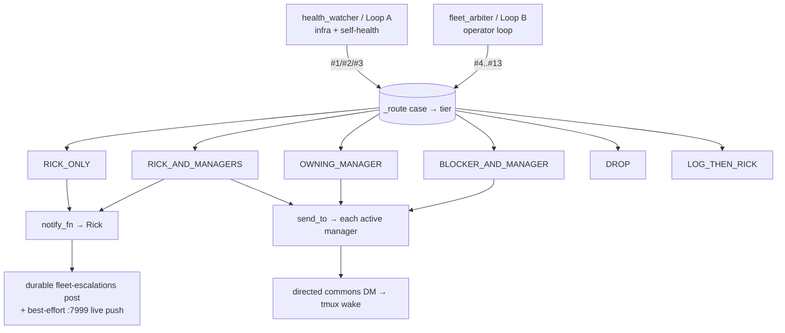

# Heartbeat-Arbiter — How it decides WHO to contact (routing + recipients summary)

**Date:** 2026-06-09
**Author:** Tiberius 👑 (fleet manager)
**Purpose:** One-page reference answering "how does the arbiter determine who to contact across all scenarios, and does the health-check loop notify too?" — distilled from the live code (`arbiter_routing.py`, `arbiter_job.py`, `manager_resolver.py`, `lupin_arbiter_app/app.py`, `fleet_arbiter_loop.py`).

---

## 1. Two loops, one routing model

The arbiter runs two loops that both feed a single recipient-routing model:

- **`health_watcher`** (Loop A) — infrastructure + self-health watcher.
- **`fleet_arbiter`** (Loop B) — the fleet operator loop.

Every distinct arbiter output is one of **13 numbered cases**, each mapped to exactly **one of 6 recipient tiers** in a pure table (`arbiter_routing.py` → `CASE_TIERS`). The consumer (`arbiter_job`) dispatches via `_route(case, …)`, which consults `tier_for(case)` and executes **only two non-destructive channels**:

- `notify_fn` → **Rick**
- `commons.send_to` → **a directed manager/blocker DM**

It **never actuates** (no reap/kill/replace/spawn) — that is the standing redline, enforced by an AST-scan test.

## 2. The recipient tiers (the Part-6 table)

| Tier | Who it reaches | Cases | Why |
|------|----------------|-------|-----|
| **RICK_ONLY** | Rick only, no managers | #1 container enter-unhealthy · #2 container flapping · #3 health-watch BLIND · #10 decision-needed (+owning mgr if known) | Infra + decisions are the human's domain; managers don't act on containers |
| **RICK_AND_MANAGERS** | Rick + every active manager | #5 deadlock cycle · #8 orphan/unresolved-manager worker · #9 manager-down + HOLD · #11 whole-fleet-stall · #13 auto-poke reap-**recommendation** | Fleet-level crises — resilient to owning-manager-down; rare + severe |
| **OWNING_MANAGER** | the resolved owning manager (DM) | #7 manager tap | The core per-worker actionable nudge |
| **BLOCKER_AND_MANAGER** | the blocker (DM) + cc its owning manager | #4 blocker holding up a worker | Direct nudge + manager looped in |
| **DROP** | nobody — pull-state via `/state` | #6 per-tick fleet roster | The roster broadcast is cut; the single-pane `/state` is the pull replacement |
| **LOG_THEN_RICK** | log; escalate to Rick only if **persistent** | #12 arbiter poll-error | Demoted from a per-error ping; streak ≥ threshold → escalate-once |

**Case #13** (auto-poke reap-recommendation, 2b-3) is a post-Part-6 addition routed through the same dispatcher. It is a **recommendation only** — after a stuck *live* session absorbs ≤N bounded non-destructive pokes with no recovery, the arbiter recommends a reap/replace to Rick + all managers but **never executes it**.

## 3. Who counts as an "active manager"?

`resolve_active_managers` (`manager_resolver.py`):

1. **Candidate set** = commons-active (`who_rows`) ∪ bridge-present sessions.
2. **∩ ROLE** — must have a manager manifest from spawn-lineage (`list_manager_session_ids`).
3. **PHANTOM GUARD** — must have a **live bridge** (PID + mtime-filtered `find_active_voice_persona_sessions`). A reaped manager whose commons last-post *lingers* is **excluded**, because its dead bridge is absent. Raw `commons_who` is the phantom-prone signal; bridge-presence is the guard.
4. Must have a DM-able **persona** (prefers the authoritative bridge value).

If the manager set resolves **empty**, `RICK_AND_MANAGERS` degrades cleanly to **Rick-only** — no crash, no lost escalation.

## 4. The two delivery mechanisms

- **To Rick** (`notify_fn` = `make_escalation_notify_fn`): **always** posts to the durable `fleet-escalations` commons topic (the primary channel), **plus** a best-effort live push to `:7999 /api/notify` (the 2b-1 live-push hop — the key for which is being moved to `~/.lupin/config` right now). Both are degrade-safe: a failure on either is swallowed + logged and never kills the loop.
- **To managers / blockers** (`commons.send_to`): a directed commons DM that pushes/wakes the recipient's tmux session.

## 5. Does the health-check loop notify? — YES

`health_watcher` (Loop A) escalates **#1 / #2 / #3** — container enter-unhealthy, container flapping, and "health-watch BLIND" (the watcher noticing its own eyes are out, e.g. docker daemon down) — through `_make_health_notify_fn`.

- **Recipient: RICK ONLY** — hard-wired, **no manager fanout** (managers don't act on containers).
- **Mechanism: the SAME shared sink** as Loop B — durable `fleet-escalations` post + best-effort `:7999` live push — **plus** a structured `health_escalation` log line.
- Degrade-safe: never raises.

So both loops converge on one Rick sink. The difference: Loop A is **fixed to Rick-only** (infra), while Loop B routes **per-case across all six tiers**.

## 6. Source pointers

| Concern | File |
|---------|------|
| The 13-case → 6-tier contract (pure table) | `src/cosa/agents/heartbeat_arbiter/arbiter_routing.py` |
| `_route` dispatcher + per-case detectors | `src/cosa/agents/heartbeat_arbiter/arbiter_job.py` |
| Active-manager resolver + phantom guard | `src/cosa/agents/heartbeat_arbiter/manager_resolver.py` |
| Rick escalation sink (durable + live push) | `src/lupin_arbiter_app/fleet_arbiter_loop.py` (`make_escalation_notify_fn`) |
| Health-loop (Loop A) → Rick-only wiring | `src/lupin_arbiter_app/app.py` (`_make_health_notify_fn`) |
| Live-push :7999 hop | `src/lupin_arbiter_app/arbiter_live_notify.py` |

**Design origin:** Part 6 of `src/rnd/v0.1.8/2026.06.04-heartbeat-hook/2026.06.08-arbiter-consumption-gap-and-operator-loop.md` (judgment calls ratified by Rick 2026-06-08).
