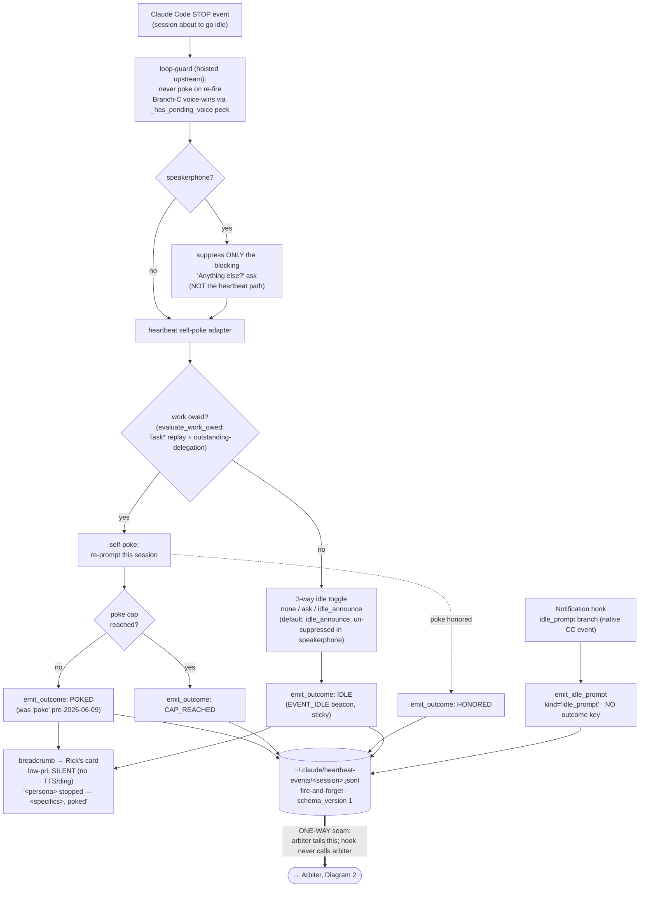
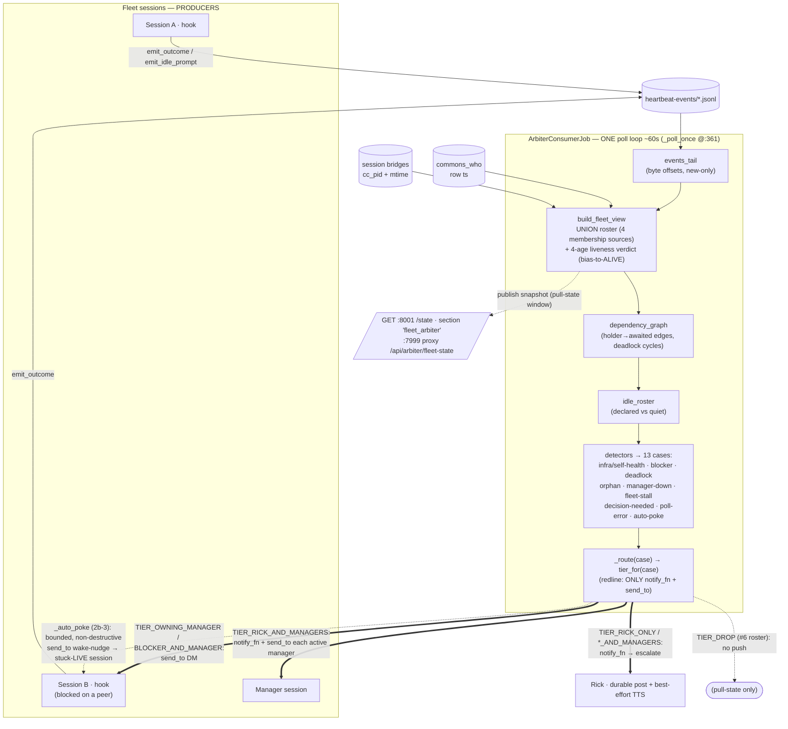
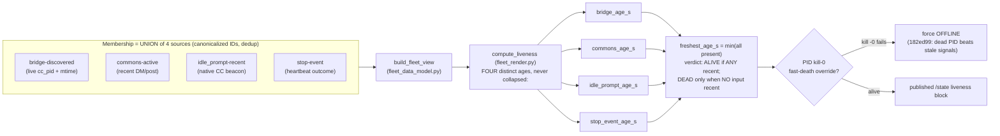
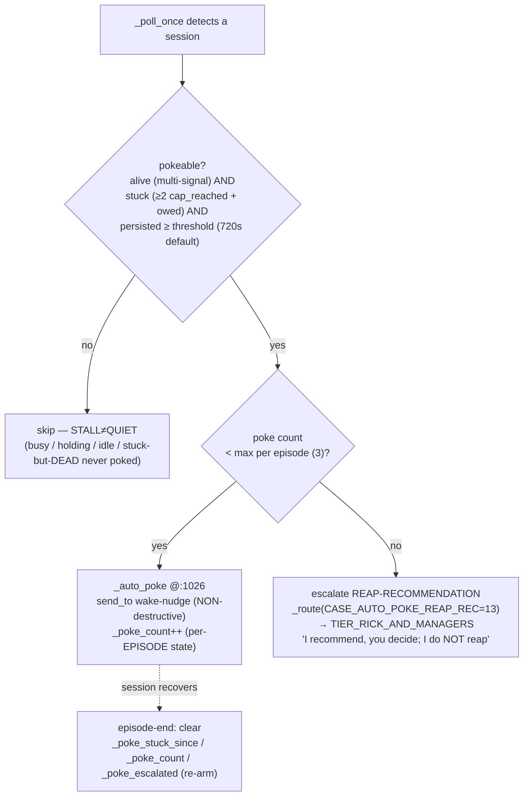
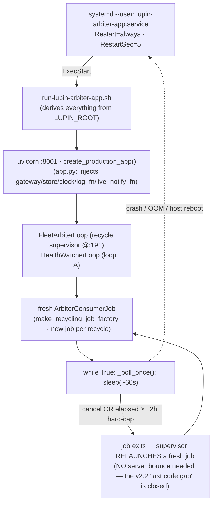
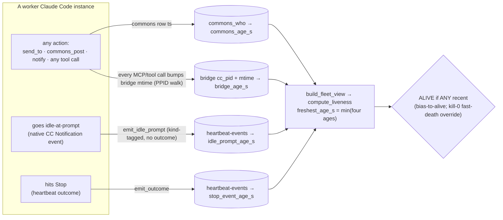

# Heartbeat Hook + Arbiter — Architecture Diagrams (v3.0, as-built)

**Author:** María 🌸 (Workflow Steward) · **Date:** 2026-06-10
**Supersedes:** `2026.06.07-arbiter-and-heartbeat-hook-diagrams.md` (v2.2, Tiberius 👑 + María 🌸).
**Scope:** the system as-built through **Round 2b** (the closed operator loop), the **multi-signal liveness overhaul** (Phase 1), the **loop rename** (Decision 6), and the **standalone `:8001` deploy** — source-grounded on current `HEAD`.
**Companion to:** the engagement docs in `src/rnd/v0.1.8/2026.06.04-heartbeat-hook/` (01-design … 2026.06.09-* operator-loop + routing) and `planning-is-prompting → src/rnd/2026.06.07-arbiter-deploy-architecture.md`.

> **Why a v3.** The v2.2 doc was accurate for 2026-06-07, but four bodies of work landed in the three days after it: (1) the arbiter was found **blind to the live fleet** and got a multi-signal liveness rebuild; (2) the in-process lifecycle was **retired** for a standalone `:8001` systemd service; (3) the output loop was **closed** with directed push-routing + bounded auto-poke; (4) the stop-hook **speakerphone poke bug** was fixed. This version is the as-built picture; §8 is the explicit v2.2 → v3.0 changelog if you only want the delta.

---

## TL;DR — what changed since v2.2

1. **The arbiter is no longer in-process.** Diagram 3's FastAPI-lifespan CJ-Flow job is **retired**. The arbiter now runs as a **standalone `:8001` systemd `--user` service** (`lupin-arbiter-app.service`, `Restart=always`), self-perpetuating through an internal **recycle supervisor** (`FleetArbiterLoop`) — so the 12h hard-cap is no longer a death sentence, and a `:7999` outage can't blind detection.
2. **Liveness was rebuilt from one source to four.** The old roster tracked dead historical sessions and read every live-but-quiet worker as `offline` (it caused a real false WHOLE-FLEET-STALL on 2026-06-08). The roster is now a **UNION** of four membership sources and the verdict crosses **four independent ages** with a **bias toward ALIVE**.
3. **The output loop is closed, and the redline moved one notch.** The arbiter now **routes** every output through a 13-case → 6-tier table (directed DMs, not a blackboard) and may fire a **bounded, non-destructive auto-poke** at genuinely-stuck live sessions. The redline narrowed from *"never actuate"* to **"never *destructively* actuate"** — poke is allowed; reap stays a human/manager recommendation. The interim poker is now **retired, not just redundant.**
4. **The stop-hook speakerphone poke bug is fixed**, the `idle_prompt` 4th signal and `outstanding-delegation` work-owed signal were added, and the `poke` outcome value was renamed to `poked`.

---

## 1. Diagram — The Heartbeat Hook (producer side)

Each Claude Code session, on its **Stop** event, runs the Branch-C self-poke adapter (`stop.py`). It decides whether work is owed, optionally self-pokes, drops a silent breadcrumb to Rick's card, and emits a canonical outcome record (fire-and-forget) into a per-session JSON-lines file. A **second** producer path — the **Notification hook's `idle_prompt` branch** — emits a kind-tagged recency event. Both files are the **only** coupling to the arbiter.

**Key files:**
- `src/lupin_cli/claude_code/hooks/stop.py` — speakerphone split (suppress ask, **not** poke), loop-guard hoisting, breadcrumb emit, outcome emit.
- `src/lupin_cli/claude_code/hooks/lib/heartbeat_events.py` — `emit_outcome` · `OUTCOME_POKE` value now `"poked"` (@:38) · `EVENT_IDLE="idle"` (@:68) · `EMITTED_OUTCOMES` (@:72, `not_owed` is skipped as per-turn noise) · `EVENT_KIND_IDLE_PROMPT="idle_prompt"` (@:81) · `emit_idle_prompt` (@:162).
- `src/lupin_cli/claude_code/hooks/lib/notification.py` — `idle_prompt` branch calls `emit_idle_prompt`.

**What's new here vs v2.2:**
- **Speakerphone poke fix (`24f85fb`).** v2.2's `stop.py` had an all-or-nothing early-exit (~:990) that bailed before the heartbeat path — so **every speakerphone session (i.e. every manager) silently never self-poked**. The fix *relocates* the exit: speakerphone now suppresses only the noisy blocking ask; the work-owed oracle is the real gate and runs for everyone.
- **`idle_prompt` 4th signal (`852ab83`).** The Notification hook now emits a kind-tagged recency record when CC goes idle-at-prompt. It carries **no `outcome` key** (the discriminator is load-bearing) so it feeds only the liveness `idle_prompt_age_s`, never the activity/state axis.
- **`outstanding-delegation` work-owed signal (`c9b5eb8`, heartbeat v3).** The work-owed oracle now also counts **unanswered inbound commons DMs** (tenure-floored to the session's persona-assign time, so you don't inherit a prior holder's debt) — an unhandled DM means work is owed, so the session pokes rather than going dark.
- **Breadcrumb to Rick's card (`24f85fb` §4).** Every `POKED` and every idle now drops a **silent** (no TTS, no ding) low-priority card notification, so Rick has a passive trail of who stopped and why.
- **`poke` → `poked` rename (`24f85fb` §5).** The `OUTCOME_POKE` *constant* is unchanged; its *value* changed. Consumers reference the constant; old on-disk records carrying `"poke"` are **not migrated** — they age out of the read window.

---

## 2. Diagram — The Arbiter closed loop (consumer side)

One job runs a poll loop (~60s) inside the standalone `:8001` service. Each pass: tail new events → discover bridges → merge `commons_who` → build the **UNION** roster with a **4-age liveness verdict** → build the wait-graph + idle-roster → run detectors → **route** each output through the tier table. Actuation is still PUSH and now includes a **bounded, non-destructive auto-poke**.

**The consumer answer, precisely:** the **solid arrows** (manager tap, blocker ping, escalate) and the **auto-poke dotted arrow** are the arbiter *acting*. The **snapshot** is pull-state visibility only — nothing in the control loop reads it. Roster broadcast (case #6) was **dropped** to pull-state; what used to be a "post to `fleet-arbiter` topic" actuation step is now `TIER_DROP`.

**Key file:** `src/cosa/agents/heartbeat_arbiter/arbiter_job.py` — `_poll_once` @:361 · `_publish_fleet_snapshot` @:422 · `_route` dispatcher @:490 (redline invariant: *"calls ONLY {notify_fn, send_to} — NO actuation"*) · `_escalate_deadlocks` @:609 · `_tap_managers` @:710 · `_auto_poke` @:1026 (*"NEVER reaps — the redline holds"*) · `_execute` loop @:1090 · hard-cap check @:1102 · `max_duration_seconds=43_200` @:181.

### 2.1 The liveness model — UNION roster + 4-age verdict

This is the heart of the Phase-1 fix (`234e47d` leaf + `852ab83` integration). The v2.2 roster was built from **one** frozen source (the STOP-hook outcome log), so it tracked ~20 dead historical sessions and was blind to anyone who hadn't recently hit Stop. The rebuild made membership a **UNION** and the verdict a cross of **four independent ages**.

- **Membership is UNION, not annotation.** `build_fleet_view` now **adds** members from any of the four sources; v2.2 only annotated event-sourced sessions, so commons-only and idle-only sessions were invisible. (Caveat preserved from v2.2 §7.4: a session still needs *some* trackable signal to enter — the UNION simply widened "trackable" from one source to four.)
- **Four ages, never collapsed.** `bridge_age_s` (process up & working), `commons_age_s` (talking to peers), `idle_prompt_age_s` (the strongest passive "I'm waiting" beacon), `stop_event_age_s` (activity, not liveness-primary). `freshest_age_s = min(present)`.
- **Bias toward ALIVE.** A false-DEAD (escalating about a healthy heads-down worker) is worse than a brief false-ALIVE that ages out — so the verdict reads ALIVE if *any* signal is fresh.
- **PID fast-death override (`182ed99`).** The one exception to bias-to-alive: if `kill -0` on the process fails, the session is forced OFFLINE even if commons echoes linger — a truly dead PID overrides recent-but-stale signals.
- **`cc_pid` rename + BOTH-pid OR (`852ab83`).** The bridge field formerly misnamed `ppid` (confused with genuine parent-pid locals) is now `cc_pid`. `assess_liveness` (`context_pressure.py`) is alive iff `listener_pid` **OR** `cc_pid` passes `kill -0` — so a dead listener sidecar beside a live CLI no longer reads DEAD.

### 2.2 The output routing model — 13 cases → 6 tiers

v2.2 escalation was effectively "post to a topic + maybe notify." v3 routes **every** output through a pure table (`arbiter_routing.py`), dispatched by `_route` (@:490) which is **structurally constrained to call only `{notify_fn, send_to}`** (the redline invariant).

| Tier | Mechanism | Cases |
|------|-----------|-------|
| `TIER_RICK_ONLY` | `notify_fn` (durable post + live push), **no** managers | #1–3 infra/self-health, #10 decision-needed |
| `TIER_RICK_AND_MANAGERS` | `notify_fn` + `send_to` **each active manager** | #5, #8, #9, #11 fleet crises + **#13 auto-poke reap-rec** |
| `TIER_OWNING_MANAGER` | `send_to` the resolved owning manager | #7 manager tap (core per-worker nudge) |
| `TIER_BLOCKER_AND_MANAGER` | `send_to` the blocker + cc its owning manager | #4 blocker holding a worker |
| `TIER_DROP` | no push — pull-state via `/state` | #6 fleet roster (was a topic post in v2.2) |
| `TIER_LOG_THEN_RICK` | log; escalate to Rick **only if persistent** | #12 poll-error |

**Active-manager resolution (`manager_resolver.py`).** `RICK_AND_MANAGERS` and `OWNING_MANAGER` need to name live managers without guessing:
- `resolve_manager(worker_sid)` (@:226) uses **`bridge.spawned_by` as the PRIMARY, globally-unique lineage source** (`ace0665`), falling back to a tmux-manifest scan only for legacy bridges. This fixed the **2026-06-09 collision bug**: the old manifest-name join keyed on a persona-reused child name (`cc-reviewer-tiberius-1`) that appeared in three stale Tiberius manifests → collision guard → "Unmanaged." A real session id can't be claimed by multiple managers, so the collision can't arise.
- `resolve_active_managers()` (@:146) enumerates DM-able managers = commons-active ∪ bridge-present, ∩ role (has a manifest), ∩ **phantom guard** (`fc657e4` — a reaped session whose commons echo lingers but has no live bridge is excluded).
- **Exactly-one-else-unresolved** (@:101): a multi-match never produces a wrong-manager DM; it escalates `SOURCE_UNRESOLVED` to Rick instead.

### 2.3 The auto-poke — the redline narrowed, not abandoned (2b-3, `ba57416`)

v2.2's cardinal invariant was *"sense / recommend / escalate, NEVER actuate."* Round 2b-3 narrowed it (Rick-confirmed) to **"never *destructively* actuate."** A poke is a non-destructive `send_to` wake-nudge (the same verb already used for blocker pings); reap stays a human/manager decision.

- **Bounded & anti-storm (FM-20 hardening, María's 3 conditions):** pokeable requires *alive* AND *stuck* AND *persisted past threshold*; per-**episode** state (`_poke_stuck_since`, `_poke_count`, `_poke_escalated`) persists across ticks and clears on recovery; ≤N pokes total → ONE reap-recommendation → silence.
- **STALL ≠ QUIET.** Busy/working, declared-hold, idle, and stuck-but-DEAD sessions are **never** poked — they consume the same multi-signal liveness + owed-work oracle, not a naive event timestamp.
- **Standing redline test.** An AST-scan test asserts **zero** destructive calls (`reap|kill|replace|spawn`) anywhere in `arbiter_job`, including `_auto_poke`. It is part of the regression gate.
- **Config knobs** (`lupin-app.ini` + splainer, make-before-break): `arbiter auto poke enabled`, `poke stall threshold seconds=720` (12 min), `poke max per episode=3` — all with `ValueError` validation.

---

## 3. Diagram — Arbiter lifecycle (the standalone `:8001` service)

**This replaces v2.2's Diagram 3 entirely.** The in-process FastAPI-lifespan CJ-Flow job is **retired**. The arbiter now runs out-of-band as a systemd `--user` service, and self-perpetuation is solved at **two** layers: an internal recycle supervisor *and* `Restart=always`.

- **Service:** `src/lupin_arbiter_app/systemd/lupin-arbiter-app.service` — *"out-of-band fleet watcher (:8001)"*, `Restart=always`, `RestartSec=5`, `ExecStart=…/src/scripts/run-lupin-arbiter-app.sh`. Chosen as `systemd --user` because the `:8001` user has no root and we still want the unconditional restart guarantee.
- **Recycle supervisor:** `src/lupin_arbiter_app/fleet_arbiter_loop.py` → `FleetArbiterLoop` (@:191) wraps `ArbiterConsumerJob` in a sequential recycle (single-instance by construction). On the 12h hard-cap exit it relaunches a fresh job — so the cap is now hygiene (bounded memory/state per job), not a death. `make_recycling_job_factory` builds a fresh, fully-wired job each cycle (@:144, `start_period_seconds=120` warm-up default).
- **Two name surfaces renamed (Decision 6, `21189d4`):** the loop classes/files/`/state` keys went generic→descriptive with **no alias**: `LoopBRunner`→`FleetArbiterLoop`, `HealthWatchLoop`→`HealthWatcherLoop`, files `loop_b.py`→`fleet_arbiter_loop.py` / `health_watch.py`→`health_watcher.py`, `/state` keys `loop_b_fleet`→`fleet_arbiter` and `loop_a`→`health_watcher`. The `:7999` proxy (`routers/arbiter.py`) ships lockstep so the `/state` contract never skews.

**Architectural decision history:** v2.2's D-A chose in-process *"dies with the server gracefully."* The 2026-06-08 consumption-gap analysis reversed it: an in-process arbiter dies silently while uvicorn keeps serving, and `:7999`-coupling means a `:7999` outage blinds detection (the R4 independence concern). The standalone `:8001` service + recycle + `Restart=always` is the resolution. See `planning-is-prompting → src/rnd/2026.06.07-arbiter-deploy-architecture.md`.

---

## 4. What remains for "fully autonomous, no poker"

v2.2's §4 listed three open gaps. **All three are closed:**

| v2.2 gap | v3 status |
|----------|-----------|
| 1. Confirm active polling produces renders | ✅ The `:8001` service publishes `/state` (section `fleet_arbiter`) every poll; the `:7999` proxy `/api/arbiter/fleet-state` reads it. |
| 2. `:8000`/container file-visibility (host paths bind-mounted) | ✅ Moot — the arbiter runs **host-side** as a systemd `--user` service reading host paths directly; no container mount question remains. |
| 3. Self-perpetuation past the 12h hard-cap | ✅ Closed at two layers: the `FleetArbiterLoop` recycle supervisor relaunches on cap-exit, and `Restart=always` covers crash/OOM/reboot. |
| 4. Interim poker = redundant | ✅ **Retired** in design — its wake-nudge function is now the arbiter's own bounded `_auto_poke` (2b-3). Per make-before-break, the manual cascade-poker + María's `/loop` stay live until 2b-3 is *proven in prod*, then stand down. The decoupled broadcast-miss listener bug is the only residual, and it never belonged to the poker. |

**Deploy state (git-confirmed 2026-06-10):** all of the above is **committed and pushed** on `wip-v0.1.8` (0 ahead of `origin`; commits `852ab83`/`21189d4`/`06fb0b3`/`b4441d7`/`ba57416`/`24f85fb`/`c9b5eb8`/`182ed99`) and the `:8001` `lupin-arbiter-app.service` is **active**. The honest remaining residual is operational, not architectural: the live-push hop to Rick (`:7999 /api/notify`) now reads its key from `~/.lupin/config` `[development] api_key_file` (code landed; `app.py:_build_live_notify_fn`), but until that key is confirmed to resolve at runtime, escalations degrade safely to durable-`fleet-escalations`-only. The make-before-break stand-down of the manual poker is the only behavioral gate left (proof-in-prod, not a deploy).

---

## 5. The arbiter's OUTPUT side — what it emits on silence, stalls & non-responsiveness

> *Carried forward from v2.2 §6 (María), updated for the closed loop.* Message **shapes** are unchanged; what changed is **routing** (now the 13-case → 6-tier table, §2.2), **delivery** (durable `fleet-escalations` post is always primary; live TTS is best-effort), and the **addition** of the auto-poke reap-recommendation.

### 5.1 The cardinal invariant (narrowed)

The verb set is **{ who, read, send_to, post }** + `notify_fn` + render/snapshot sinks — all **sense / recommend / escalate, and now bounded-non-destructively-poke, but NEVER *destructively* actuate.** No message reaps, kills, replaces, or spawns. `arbiter_job.py:155` states the verb set; `_route` (@:490) and `_auto_poke` (@:1026) both carry the redline invariant in their contracts, and the standing AST test enforces it.

### 5.2 Sign-of-life even when the fleet is silent

Unchanged from v2.2 in spirit (TICK on unchanged frame, TABLE on change, snapshot push, structured journal line), with the snapshot now keyed `fleet_arbiter` (not `loop_b_fleet`) and a **per-job warm-up** (`make_warmup_notify_fn` @:98, `start_period_seconds=120`) that suppresses escalations for the first interval after every (re)start — so cold boot / systemd restart / recycle never false-fire.

### 5.3 The message catalog — updated routing

**Family A — ACTIONS (directed DMs; the arbiter reaching out):**

| Kind | Trigger | Tier → recipient |
|------|---------|------------------|
| **A1 · Auto-ping a blocker** | a `holder→awaited` blocked edge; throttled (backoff 60→300→900→3600s, cap 10/hr, clear-on-resume) | `TIER_BLOCKER_AND_MANAGER` → the **awaited** peer + cc its owning manager (#4) |
| **A2 · Manager advisory tap** | a stuck/blocked worker needs attention; fires on crew-summary CHANGE + ≥300s min-interval | `TIER_OWNING_MANAGER` → resolved owning manager (#7) |
| **A3 · Auto-poke wake-nudge** *(NEW, 2b-3)* | a genuinely-stuck **live** session past the poke threshold | `send_to` → the stuck session (non-destructive); after N pokes → A4-style reap-rec |
| **A4 · Reap-recommendation** *(NEW, 2b-3)* | N pokes exhausted, no recovery | `TIER_RICK_AND_MANAGERS` (#13) → *"I recommend, you decide; I do NOT reap."* |

(Roster surface — the old A3 "post to `fleet-arbiter` topic" — is now `TIER_DROP` (#6): pull-state via `/state`, no push.)

**Family B — ESCALATIONS to Rick (`notify_fn`; ALWAYS durable post to `fleet-escalations` + best-effort live TTS):**

| Kind | Trigger | Tier |
|------|---------|------|
| **B1 · Deadlock** | a holder→awaited cycle (NEVER auto-broken) | `RICK_AND_MANAGERS` (#5) |
| **B2 · Decision-needed** | a new post on reserved `fleet-decision-needed` | `RICK_ONLY` + owning manager if known (#10) |
| **B3 · Whole-fleet-stall** | no fleet **progress** ≥ window **with work owed** — **calibrated in 2b-1** so it no longer false-fires during active crew work | `RICK_AND_MANAGERS` (#11) |
| **B4 · Manager-down** | tapped manager silent past the 600s ack-window | `RICK_AND_MANAGERS` + HOLD (#9) |
| **B5 · Orphan / unresolved-manager** | stuck worker whose manager can't be resolved by lineage | `RICK_AND_MANAGERS` (#8) |
| **B6 · Poll-error** | the loop itself errored | `TIER_LOG_THEN_RICK` (#12) — log; escalate only if persistent |

### 5.4 Escalation delivery — durable-first, live best-effort

`make_escalation_notify_fn` (`fleet_arbiter_loop.py:62`) ALWAYS posts to the durable **`fleet-escalations`** commons topic (write failure swallowed + logged), AND best-effort fires a live `:7999 /api/notify` push — the **only** `:7999`-touching hop, escalation-path only, never per-poll, so a `:7999` outage can never block detection (R4 independence). The health-watcher (loop A) routes its infra escalations (#1/2/3) to **Rick-only** through the same shared sink (`app.py:_make_health_notify_fn` @:134).

---

## 6. The fleet's signs-of-life — the INPUT side (what the arbiter consumes)

> *Carried forward from v2.2 §7 (María), now describing the four-signal model that §2.1 builds the roster from.* This is symmetric to §5: §5 is the arbiter's own output sign-of-life; this is the fleet's signs-of-life that the arbiter consumes.

The v2.2 picture was **two** signals (heartbeat-event PRIMARY + commons_who SECONDARY). The Phase-1 rebuild made it **four**, all unioned:

| Signal | Captures | Role |
|--------|----------|------|
| **`stop_event_age_s`** | declared outcome at Stop boundary (poked/honored/cap/idle) | activity + the membership gate of record |
| **`commons_age_s`** | any DM/post/notify — *talking is a liveness ping*; content also discloses STATE (`holding_on`, decision-needed) | behavioral liveness + semantic state |
| **`bridge_age_s`** | every MCP/tool call bumps the calling session's bridge mtime (PPID walk attributes to the **caller**, not the shared server) | covers the heads-down worker not touching commons |
| **`idle_prompt_age_s`** *(NEW)* | native CC idle-at-prompt beacon — the strongest passive "I'm alive, waiting" signal | covers the genuinely-idle-but-live session that emits nothing else |

**Why four beats two:** the v2.2 blind spot — a worker heads-down for an hour with no Stop reading as "dead" — is now covered three independent ways (bridge mtime, commons, idle_prompt), and a truly dead PID is caught by the `kill -0` fast-death override. The cross-product still yields high-confidence states (stale-everywhere + work-owed ⇒ the real escalation trigger; fresh-anywhere ⇒ alive). **Independence** is preserved: bridge mtime and event files are `:7999`-free local reads, so a `:7999` saturation never blinds the liveness read.

---

## 7. Source map (current `HEAD`)

| Concern | File | Key symbols |
|---------|------|-------------|
| Hook producer | `src/lupin_cli/claude_code/hooks/stop.py` | speakerphone split · loop-guard hoist · breadcrumb · outcome emit |
| Outcome schema + signals | `…/hooks/lib/heartbeat_events.py` | `emit_outcome` · `OUTCOME_POKE`="poked" (@:38) · `EVENT_IDLE` (@:68) · `EVENT_KIND_IDLE_PROMPT` (@:81) · `emit_idle_prompt` (@:162) |
| idle_prompt emission | `…/hooks/lib/notification.py` | idle_prompt branch |
| Liveness primitive (leaf) | `src/cosa/agents/heartbeat_arbiter/context_pressure.py` | `assess_liveness` (BOTH-pid OR; `cc_pid` kw-arg) |
| Roster (UNION) | `…/heartbeat_arbiter/fleet_data_model.py` | `build_fleet_view` · `_STATE_BY_OUTCOME` (references `OUTCOME_POKE`) |
| 4-age verdict | `…/heartbeat_arbiter/fleet_render.py` | `compute_liveness` · `build_snapshot` |
| Routing table (pure) | `…/heartbeat_arbiter/arbiter_routing.py` | 6 tiers (@:30-35) · `CASE_TIERS` (@:65) · `CASE_AUTO_POKE_REAP_REC=13` (@:63) · `tier_for` (@:82) |
| Manager resolution | `…/heartbeat_arbiter/manager_resolver.py` | `resolve_manager` (@:226, `spawned_by` primary) · `resolve_active_managers` (@:146, phantom guard) |
| Core orchestrator | `…/heartbeat_arbiter/arbiter_job.py` | `_poll_once` (@:361) · `_route` (@:490) · `_tap_managers` (@:710) · `_auto_poke` (@:1026) · `_execute` (@:1090) |
| Recycle + escalation sink | `src/lupin_arbiter_app/fleet_arbiter_loop.py` | `FleetArbiterLoop` (@:191) · `make_escalation_notify_fn` (@:62) · `make_warmup_notify_fn` (@:98) · `ESCALATION_TOPIC` (@:45) |
| Service bootstrap | `src/lupin_arbiter_app/app.py` | `create_production_app` · `_make_health_notify_fn` (@:134) · `_build_live_notify_fn` (@:294) |
| Live-push hop | `src/lupin_arbiter_app/arbiter_live_notify.py` | `build_notify_request` · `make_live_notify_fn` |
| Deploy unit | `src/lupin_arbiter_app/systemd/lupin-arbiter-app.service` | `Restart=always` · `ExecStart=run-lupin-arbiter-app.sh` |
| `:7999` proxy | `src/cosa/rest/routers/arbiter.py` | `/api/arbiter/fleet-state` (reads `health_watcher` + `fleet_arbiter`) |

---

## 8. v2.2 → v3.0 changelog (the explicit delta)

| Area | v2.2 (2026-06-07) | v3.0 (2026-06-10) | Driver |
|------|-------------------|-------------------|--------|
| **Deploy** | in-process CJ-Flow job on `:7999` lifespan; 12h cap = death until bounce | standalone `:8001` systemd `--user` service; recycle supervisor + `Restart=always` | `21189d4` rename + deploy-architecture doc |
| **Liveness membership** | event-log ONLY (tracked dead history; blind to live fleet) | UNION of bridge + commons + idle_prompt + stop-event | `234e47d`, `852ab83` |
| **Liveness verdict** | event-ts PRIMARY, commons SECONDARY (2 ages) | 4 distinct ages, freshest=min, **bias-to-ALIVE** + `kill -0` fast-death override | `852ab83`, `182ed99` |
| **PID field** | `ppid` (overloaded) | `cc_pid`; alive = listener_pid OR cc_pid | `852ab83` |
| **Output routing** | post-to-topic + maybe notify | 13-case → 6-tier directed table; `_route` redline-constrained | `b4441d7` |
| **Manager resolution** | tmux-manifest name join (collision-prone) | `bridge.spawned_by` primary + phantom guard | `ace0665`, `fc657e4` |
| **Actuation redline** | never actuate | never **destructively** actuate — bounded non-destructive auto-poke + reap-recommendation | `ba57416` |
| **Stall detector** | false-fired during active work | calibrated before live-push enabled | `06fb0b3` |
| **Stop-hook poke** | silently skipped for ALL speakerphone (manager) sessions | relocate-don't-gate fix; pokes for everyone with owed work | `24f85fb` |
| **Signals** | poke/honored/cap/idle | + `idle_prompt` 4th signal, + `outstanding-delegation` work-owed | `852ab83`, `c9b5eb8` |
| **Outcome value** | `"poke"` | `"poked"` (no on-disk migration) | `24f85fb` |
| **Breadcrumb** | — | silent low-pri card notify on poke/idle | `24f85fb` |
| **Interim poker** | redundant — do not build | retired — auto-poke supersedes it | 2b-3 |

**Commit appendix (since v2.2, in dependency order):** `234e47d` (context-pressure leaf + diagnosis) → `852ab83` (UNION roster + 4-age + cc_pid) → `ba42572` (idle-announce order-of-ops) → `21189d4` (loop rename, Decision 6) → `06fb0b3` (2b-1 stall calibration + live-push) → `b4441d7` (2b-2 routing + manager resolver) → `ba57416` (2b-3 auto-poke + reap-rec) → `24f85fb` (stop-hook speakerphone fix + breadcrumb + poke→poked) → `2a8cfb6` (fleet-status enrichment) → `04aa652` (prune offline) → `ace0665` (spawned_by lineage) → `fc657e4` (phantom guard) → `366c43e` (idle-announce text) → `c9b5eb8` (heartbeat v3 outstanding-delegation) → `182ed99` (PID fast-death override).

---

— 🌸 María, Workflow Steward, 2026-06-10. v3.0 refresh of the Tiberius+María v2.2 doc; source-grounded on current `HEAD`. Builds on the v2.2 §6/§7 I authored 2026-06-07/08.
