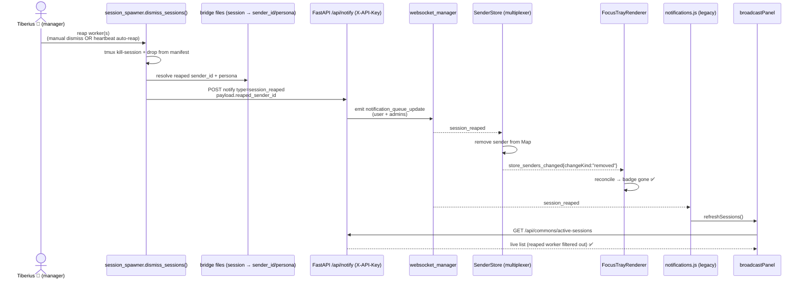

# Reap Event → Focus-Bar Badge Drop + Broadcast-Card Refresh

**Date**: 2026-06-05
**Author**: Sam 🎙️ (in coordination with Tiberius 👑, who owns the reap/harvest path)
**Status**: ✅ **VALIDATED LIVE end-to-end (2026-06-05)** — producer (Tiberius) + consumer (Sam)
proven together on `:7999` with Rick watching: spawned worker "Rio ⚡" → badge appeared → real
`dismiss_sessions` reap → `session_reaped` 200 OK → **Rick confirmed the badge vanished + Rio
dropped from the broadcast list**. Both original requirements met. Uncommitted (Rick's gate).
**Branch**: `wip-v0.1.8-2026.05.29-preparing-for-gcp-deployment`

### Live end-to-end validation log (2026-06-05)
Joint demo, Rick observing his `notifications.html` page:
1. Tiberius spawned a throwaway worker (`cc-observer-tiberius-1`, persona Rio ⚡,
   `sender_id=…#24588638`) with a startup notify → **Rick confirmed (blocking yes/no) the badge
   appeared.**
2. Tiberius reaped via a **direct import** of his live `session_spawner.dismiss_sessions` (his
   *running* MCP server predated his producer edits → stale; direct import = live code):
   `bridges_deleted=1`, `session_reaped` emit `POST /api/notify → 200 OK`
   (`target_user=Rick`).
3. **Rick confirmed (blocking yes/no) Rio's badge vanished + dropped from the broadcast
   send-to list** — rendered by the consumer (`SenderStore` removal + `_removeStripIcon` +
   `refreshSessions`).

Two real bugs Tiberius caught during prep (both would've silently broken it): (a) stale-MCP →
direct-import workaround; (b) emit missing required `target_user` → 422 silent-drop, fixed +
11 producer tests green.

---

## TL;DR

When Tiberius harvests (reaps) a worker session — dead, dormant, or otherwise no longer
needed — the user gets **no visual confirmation** in the notification web client. The reaped
worker's persona badge lingers in the focus bar, and the broadcast card's "sending to"
recipient list still lists it.

This design wires a **reap event** from the server-side teardown code through to the web
client so that, on harvest:

1. **Focus bar** — the reaped worker's persona badge **disappears** (visual confirmation the
   reap landed).
2. **Broadcast card** — the "sending to" recipient list **refreshes**, dropping the reaped
   worker.

The design **rides the existing notification rail** (`notification_queue_update` carrying a
new state-update type `session_reaped`) — no new top-level WebSocket event, consistent with
the established `voice_persona_released` / `speakerphone_changed` pattern.

---

## Design corrections (Tiberius review, 2026-06-05)

Tiberius (owner of the reap/liveness code) reviewed the draft and confirmed Q1–Q3 (see
Resolved Questions below) **plus caught one critical hole and one testability fix**. The
corrected design below incorporates both.

1. **⚠️ CRITICAL — broadcast refresh needs a bridge DELETE, not just a re-fetch.**
   `/api/commons/active-sessions` now filters on **bridge-file mtime** (Tiberius's
   2026-06-05 liveness fix, threshold 8h). A reap kills tmux + drops the manifest but does
   **not** delete the `cc-<pid>.json` bridge → its mtime stays fresh → `refreshSessions()`
   would **still return the reaped session for up to 8h**. **Fix**: `dismiss_sessions()`
   **unlinks the bridge file** (after capturing persona). This is the single source of truth
   that fixes *both* the focus bar (badge) and the broadcast list, and immediately frees the
   persona slot for re-allocation.

2. **Injectable, fail-safe emit.** The producer's WS emit is injected as a callback param
   (`emit_reap_fn`, default = the real X-API-Key POST), wrapped in try/except — mirrors the
   heartbeat arbiter's `notify_fn`/`emit_outcome` seam. Keeps the pure host-side function
   100%-unit-coverable, and a down Lupin server can never break a reap.

3. **Simplification (from reading the `voice_persona_released` emit).** Set the emit's
   **envelope `sender_id` = the reaped worker's sender_id** (exactly like
   `voice_persona_released` at `voice_persona.py:463`). The multiplexer `SenderStore` already
   dispatches state-update types by `notification.sender_id`, so it removes that sender
   directly — **no separate `payload.reaped_sender_id` field needed**.

4. **Ordering (locked)**: capture persona+sender_id → `tmux kill-session` → manifest rewrite
   → **unlink bridge** → emit. (Emit only after a successful teardown; read persona before
   the unlink; unlink before emit so `active-sessions` already excludes it when the client
   re-fetches.)

5. **Forward-invariant**: the heartbeat arbiter has **zero** reap path today (ping + roster
   only — confirmed by grep). IF it ever gains reassignment-with-reap, it **MUST** route
   through `dismiss_sessions()` to preserve the single chokepoint.

## Problem Statement

| Aspect | Current behavior | Desired behavior |
|---|---|---|
| Reap visibility | Silent — no client event emitted | A `session_reaped` event reaches the user's browser |
| Focus-bar badge | Stays until page reload | Disappears live when the worker is reaped |
| Broadcast "sending to" list | Stale until manual refresh | Auto-refreshes, dropping the reaped worker |

The reap itself already works (`tmux kill-session` + manifest drop). What's missing is the
**propagation to the UI**. The active-sessions endpoint *already* liveness-filters dead
bridges, so the data is correct on next fetch — the gap is purely the **live push** that
tells the client to re-render now instead of on next reload.

---

## Architecture

### End-to-end sequence



### Why ride `notification_queue_update` instead of a new WS event

The 2026-04-29 WS-event cleanup deliberately consolidated state-update events
(`voice_persona_assigned`, `voice_persona_released`, `speakerphone_changed`) onto the single
`notification_queue_update` channel, discriminated by `notification.type`. Adding
`session_reaped` as another state-update **type** keeps that consolidation intact: no new
entry in the `websocket available events` INI list, no new subscription plumbing, and the
multiplexer `SenderStore` + legacy `notifications.js` already have a `switch (notification.type)`
dispatch we extend by one case each.

A brand-new top-level event would mean: new INI event name, new subscription wiring on both
client paths, and a divergence from the established pattern — more surface, less consistency.
**Rejected** unless Rick prefers it.

---

## Component breakdown

### 1. Producer — host MCP server (Python)

**Hook point**: the **pure function** `session_spawner.dismiss_sessions()`
(`src/lupin_mcp/session_spawner.py:333`), *not* only the MCP wrapper
(`cosa_voice_mcp.py:2247`).

> **Why the pure function**: it is the single teardown chokepoint that both the manual
> `dismiss_sessions` MCP tool **and** Tiberius's heartbeat-arbiter auto-reap converge on.
> Hooking here means every reap path emits the event for free. *(This is the key item to
> confirm with Tiberius — see Open Questions.)*

Sketch (corrected per Tiberius review — see Design Corrections above):

```python
# inside session_spawner.dismiss_sessions(...), per reaped session_name:
bridge = find_session_by_tmux( session_name )          # session_bridge.py:1458 — keys off tmux_session
if bridge:
    persona    = bridge.get( "voice_persona" )         # name/icon/color — what the badge needs
    sid        = bridge.get( "stable_session_id" ) or bridge.get( "session_id" )
    sender_id  = build_sender_id_for_cc( sid )          # session_bridge.py:436
    # ... after tmux-kill + manifest rewrite succeed ...
    _unlink_bridge_for_tmux( session_name, session_dir )  # DELETE cc-<pid>.json (frees mtime + persona slot)
    try:
        emit_reap_fn( { "reaped_sender_id": sender_id, "persona_name": persona_name, "reason": reason } )
    except Exception:
        pass   # fail-safe: a down server must never break a reap
```

- **`emit_reap_fn`** is a new injected param (default = real POST). The default posts to a thin
  FastAPI broadcast endpoint using the **existing outbound `X-API-Key` pattern**
  (`cosa_voice_mcp.py:2847` — `_mcp_outbound_api_key()` + `X-API-Key`). Tests inject a fake.
- **Bridge delete** uses the shared `SESSION_DIR` (`~/.claude/sessions` — same dir as the
  manifest; `session_name` == bridge `tmux_session`). Injectable `session_dir` keeps it
  unit-testable on a tmpdir.
- **Server endpoint** (new, thin): `POST /api/cosa-voice/session-reaped` — body
  `{ reaped_sender_id, persona_name, reason }`, auth `require_api_key_or_jwt`. Mirrors the
  `voice_persona_released` emit: `notification_queue.push_notification(type="session_reaped",
  user_id=authenticated_user_id, sender_id=reaped_sender_id, suppress_ding=True, ...)`.

### 2. Server — FastAPI (Python)

- Add `"session_reaped"` to `valid_types` in `notifications.py:398`.
- No new endpoint: the notify path already fans `notification_queue_update` out to the user
  **and** admins. State-update typed notifications are non-user-facing (no card render, no
  ding) — same treatment as the existing state-update types.

### 3. Consumer 1 — Focus bar (multiplexer, TypeScript)

- **`stores/SenderStore.ts`**: add `"session_reaped"` to `STATE_UPDATE_TYPES`; new handler
  `handleSessionReaped(senderId)` that **removes** the sender from the `Map` and emits
  `store_senders_changed{ changeKind: "removed", sender_id }`. (The `"removed"` change kind
  already exists in the `SenderChangeKind` union — it simply has no producer today.)
- **`render/NotificationsListRenderer.ts`**: handle `changeKind === "removed"` by deleting
  that sender's section from the DOM. *(NotificationsListRenderer owns sender-card
  lifecycle; FocusTrayRenderer only hides/shows existing cards.)*
- **`render/FocusTrayRenderer.ts`**: **no change** — it already reconciles on every
  `store_senders_changed`, so once the card is gone its tray list updates and the badge
  vanishes automatically.

### 4. Consumer 2 — Broadcast card (legacy, JavaScript)

- **`static/js/notifications.js`**: new `case "session_reaped":` in the state-update switch
  (alongside `voice_persona_released` at line 5639) that:
  - calls `window.broadcastPanel.refreshSessions()` (`broadcast-panel.js:500`) — re-fetches
    `/api/commons/active-sessions`. **This now correctly drops the reaped worker BECAUSE the
    producer deleted its bridge file** (without the delete, the mtime liveness filter would
    keep returning it for 8h — see Design Correction #1);
  - removes the legacy sender card for that `sender_id` (mirror `voice_persona_released`'s
    `_setPersonaBadgeOnCard(..., null)` + card removal);
  - re-applies the hide-inactive strip filter.

---

## Data model — the `session_reaped` notification

```jsonc
{
  "type"      : "session_reaped",
  "sender_id" : "claude.code@lupin.deepily.ai#<hash>",   // the REAPED worker's sender_id (envelope)
  "voice_persona" : { "name": "<persona>", "released": true },
  "suppress_ding" : true,
  "payload"   : {
    "persona_name" : "<for logging/UX>",
    "reason"       : "<echoed teardown reason>"
  }
}
```

> **Simplified per Tiberius review (#3)**: the envelope `sender_id` IS the reaped worker —
> exactly like `voice_persona_released`. Because `session_reaped` is a state-update type, the
> SenderStore takes the state-update branch (which dispatches by `notification.sender_id`) and
> **removes** that sender — it never hits the regular-arrival branch that would re-add it. No
> separate `payload.reaped_sender_id` field is required.

---

## Test plan (100% coverage mandate — lines + branches + functions)

| Layer | Venue | What |
|---|---|---|
| Python unit | :7999 | `dismiss_sessions()` emits one `session_reaped` per reaped worker; emit failure is swallowed (reap still returns); `session_reaped` accepted by `valid_types` |
| TS unit (Vitest + c8 --100) | n/a (node) | `SenderStore` removes the sender + emits `changeKind:"removed"`; `NotificationsListRenderer` deletes the section on `"removed"`; focus tray reconcile no longer lists the badge |
| JS unit | :7999 | `notifications.js` `session_reaped` case → `refreshSessions()` called + card removed |
| E2E (optional) | :8000 (scheduled) | Playwright: focus mode ON, simulate reap event, assert badge gone + broadcast chip-row refreshed |

---

## Resolved questions (Tiberius confirmed, 2026-06-05)

1. **Reap entry point** — ✅ `dismiss_sessions()` is the **sole** reap chokepoint. The
   heartbeat arbiter has zero reap path (ping + roster only; grep-confirmed in both
   directions). One hook covers 100%. (See forward-invariant, Correction #5.)
2. **sender_id resolution** — ✅ `find_session_by_tmux(session_name)` → bridge dict →
   `persona = bridge["voice_persona"]`, `sid = bridge.get("stable_session_id") or
   bridge.get("session_id")`, `sender_id = build_sender_id_for_cc(sid)`. The manifest record
   carries `session_name`, which equals the bridge `tmux_session` — no session_id needed in
   the manifest.
3. **Timing vs. host-side prune** — ✅ `dismiss_sessions()` does **not** delete the bridge;
   `voice_persona` is fully present at reap time. The persona-null prune
   (`prune_dead_persona_bridges`) runs later at the next SessionStart. So we capture persona
   *before* our own new bridge-unlink (Correction #1).

---

## Acceptance criteria

- **AC1** — Reaping a worker (manual `dismiss_sessions` MCP call) emits exactly one
  `session_reaped` per reaped worker, carrying `payload.reaped_sender_id`.
- **AC2** — The heartbeat-arbiter auto-reap path emits the same event (single shared hook).
- **AC3** — With focus mode ON, the reaped worker's persona badge disappears from the focus
  bar without a page reload.
- **AC4** — The broadcast card's "sending to" recipient list refreshes and no longer lists
  the reaped worker.
- **AC5** — A reap whose emit fails still completes the teardown (emit is best-effort).
- **AC6** — 100% line/branch/function coverage on all new/changed Python + TS + JS.

---

## Implementation log — consumer side (Sam, 2026-06-05)

Ownership was load-balanced by Rick mid-flight: **Tiberius owns the producer** (the
`dismiss_sessions` bridge-delete + `emit_reap_fn` seam + server emit endpoint + `valid_types`);
**Sam owns the consumer** (this section). Single owner per file — no two sessions editing
`dismiss_sessions`.

**Shipped (consumer):**
- `multiplexer/stores/SenderStore.ts` — `session_reaped` added to `STATE_UPDATE_TYPES`; new
  `handleSessionReaped(senderId)` removes the sender from the Map and emits
  `store_senders_changed{changeKind:"removed"}` (no-op + no emission when the sender was never
  tracked).
- `multiplexer/render/FocusTrayRenderer.ts` — **CORRECTION to the earlier "zero change" claim**:
  the peer review's #1 failure mode (reaping the *pinned* sender) exposed a real bug — focus
  mode would stay ON anchored to a now-dead sender while the toggle is disabled (no pin),
  stranding the user. Added `onSendersChanged(e)`: when a `"removed"` change targets the focused
  anchor (`lastPinnedId`), auto-exit focus mode before reconcile (mirrors the legacy
  `_removeStripIcon` auto-exit). For a *non-pinned* reap it reconciles normally → badge drops.
- `static/js/notifications.js` — new `case "session_reaped"`: clears the card persona badge,
  calls `_removeStripIcon(sender_id)` (legacy focus-bar badge + auto-exit focus mode if that
  was the focused session), re-applies the hide-inactive filter, then
  `window.broadcastPanel.refreshSessions()`.

**Verification (all on :7999-eligible / node):**

| Check | Result |
|---|---|
| `tsc --noEmit` typecheck | ✅ exit 0 |
| `SenderStore.ts` coverage (`c8 --100`) | ✅ 100% stmts / branches / funcs / lines |
| SenderStore unit tests (`session_reaped` ×3: tracked-remove, untracked-noop, isolation) | ✅ pass |
| Integration: real `SenderStore` + `FocusTrayRenderer` → reaped badge vanishes | ✅ pass |
| Full multiplexer suite (regression) | ✅ 384/384 |
| `notifications.js` syntax (`node --check`) | ✅ valid |
| Multiplexer production bundle (esbuild) | ✅ builds (exit 0) |

**Honest coverage gap (stated per testing mandate):** the legacy `notifications.js`
`session_reaped` case has **no JS unit test** — the 9700-line legacy file has no jsdom/unit
harness (it's Playwright-E2E-only; the `voice_persona_released` case it mirrors is likewise
unit-untested). Appropriate coverage is a **joint E2E of the full reap flow**, which requires
Tiberius's producer to emit real events end-to-end → schedule on **:8000** after both halves
merge. This is a venue/dependency constraint, not a deferral of owned work.

## Integration-test design — FOR PEER REVIEW (Tiberius), requested by Rick 2026-06-05

**Why this section**: Rick asked for a properly-*designed* integration test, peer-reviewed by
Tiberius (the producer owner) before it's built — to raise the quality bar. Design first →
Tiberius reviews → then build.

### Honest current state

- ✅ **Consumer-internal integration test EXISTS + PASSES** —
  `sender_reap_focus_tray_integration.test.ts` wires the **real** `SenderStore` + **real**
  `FocusTrayRenderer` and proves: `session_reaped` event → tray badge vanishes. **Limitation**:
  it feeds a *hand-shaped* notification; it does **not** exercise Tiberius's real producer emit
  or the exact wire payload. It proves my half's internal wiring, not the seam.
- ❌ **Gap**: a true **cross-boundary** integration test (producer emit → consumer DOM).

### Proposed tiers

**Tier A — Wire-contract test (node, fast, Sam owns) — NEW**
Drive the consumer with a notification **byte-for-byte matching Tiberius's real emit**:
`{ type:"session_reaped", sender_id:<reaped worker sender_id>, payload:{ message:"<persona> reaped", priority:"low" } }`.
- Multiplexer: assert `SenderStore` removes the sender + the badge drops — but feeding the
  **exact** producer payload shape (not a synthetic one), so a future producer field-rename
  breaks the test loudly.
- Legacy: minimal jsdom harness around the `notifications.js` `session_reaped` case (or extract
  the handler) → assert `_removeStripIcon(sender_id)` fires + `broadcastPanel.refreshSessions()`
  is invoked (mocked). **This closes the legacy unit gap.**
- Venue: :7999-eligible (node). Proves my half against his real contract; no cross-process.

**Tier B — Joint full-loop E2E (Playwright, :8000 scheduled, Sam + Tiberius) — NEW**
Real browser + real server, full loop:
1. Spawn a throwaway worker → it emits a notification → assert badge present in focus tray +
   broadcast chip-row.
2. Reap it via the real `dismiss_sessions` → assert (a) tray badge disappears, (b) broadcast
   chip-row drops it, (c) `/api/commons/active-sessions` no longer returns it (bridge deleted).
- Gated on both halves merged + a confirmed :8000 slot.

**Tier C — Producer-side server test (Python, Tiberius owns; referenced)**
`dismiss_sessions` → correct `session_reaped` emit + bridge deleted + active-sessions excludes.
Tiberius reports 6 unit tests already covering his half.

### Review asks for Tiberius
1. Does Tier A's wire payload match your real emit **byte-for-byte** (type, envelope
   `sender_id`, payload field names/values)?
2. Tier B: what's the minimal throwaway-worker spawn path that emits a notification, so the
   badge reliably appears *pre*-reap?
3. Which failure modes should Tier B assert — reap of a never-notified worker (no-op), double
   reap (idempotency), reap of the *pinned* sender?
4. Tier B home: extend the existing Playwright E2E suite, or a new spec?

### Review outcome (Tiberius, 2026-06-05) — APPROVED with refinements

- **Structure approved** (3-tier split + the honest "consumer-internal ≠ seam" call-out).
- **Ask 1**: `type` + `sender_id` match. Corrections: (a) Tiberius's producer sends **flat query
  params** to `/api/notify` (no nested `payload` on his side); the **server** wraps them, so the
  Tier A fixture must match the **server `notification_queue_update` envelope** (`{ notification:
  notification.to_dict() }`), not his flat params — verified by reading
  `notification_fifo_queue.py:427`. (b) `message` is `f"{persona} reaped"` with fallback
  `"A worker reaped"` when the bridge has no persona — test both. (c) Tiberius will capture the
  **real wire frame** off a `:7999` reap for an authoritative fixture — **HELD** pending Rick's
  go + a clean point in Tiffany's notification-rail health-check-hang investigation (capturing
  injects an event on that same rail). I build against my **code-derived envelope** now; the real
  frame is a 2-min confirm/swap (and a bonus drift assertion if they disagree).
- **Ask 3 — all 4 failure modes**, priority order: ⭐pinned-reap, ⭐double-reap, selective
  (1-of-N), never-notified.
- **Ask 4**: a **new** spec `test_reap_event_focus_bar` in the e2e_ui dir.
- **Tiberius's own gap-closure** (sharp): his 6 producer tests inject a *fake* `emit_fn`, so they
  don't pin `_default_emit_reap`'s real POST — a typo'd `type` would pass both his fakes AND my
  hardcoded fixture, surfacing only at expensive Tier B. He's adding a producer test that mocks
  `requests.post` + asserts the exact `type`/`sender_id`/`message`. → producer-emits-contract +
  consumer-consumes-contract = drift caught at unit tier.

### Tier A build status (Sam) — DONE for the multiplexer half

| Item | Status |
|---|---|
| ⭐ pinned-sender reap → focus-mode auto-exit (bug found + **fixed** in FocusTrayRenderer) | ✅ test passes |
| ⭐ double-reap idempotency (single `removed` emission) | ✅ test passes |
| selective reap (1-of-N — only target badge drops) | ✅ test passes (SenderStore) |
| never-notified worker reap → no-op | ✅ test passes (SenderStore) |
| `FocusTrayRenderer.ts` + `SenderStore.ts` coverage | ✅ 100% both (c8) |
| Full multiplexer suite | ✅ 386/386 |

### ⚠️ SCOPE CORRECTION (Rick, 2026-06-05) — target is `notifications.js`, NOT the multiplexer

Rick clarified the UI in scope is the **legacy `notifications.html` page (`notifications.js`)**.
**Verified**: the focus bar (`#cc-session-strip`) AND the broadcast card (`broadcast-panel.js`)
exist **only** on `notifications.html`; `multiplexer.html` is a separate newer page that doesn't
even have the broadcast card. **Both of Rick's requirements are inherently `notifications.js`.**

**My drift (owned)**: I'd put all unit tests + the pinned-reap bug-fix into the *multiplexer* — a
page Rick isn't using — leaving the actual `notifications.js` change untested.

**Rick's decision (ask_multiple_choice)**: **Option A — refocus on `notifications.js`; PARK the
multiplexer changes** (keep them as a correct, 100%-tested, out-of-scope bonus for if/when that
page is adopted — don't fold them into this deliverable, don't revert).

### Legacy `notifications.js` jsdom harness — BUILT (reverses earlier "too fragile" call)

I'd first concluded a jsdom harness was too brittle and routed coverage to Tier B. **That was
wrong — I built it and it passes.** `src/tests/unit/notifications_js/session_reaped_handler.test.ts`:
- Loads the class by slicing the source at the unique bottom init marker (`"// Initialize when DOM
  is ready"` — note `"// INITIALIZATION"` *also* appears at ~line 386 inside the class, a trap)
  and `vm.runInThisContext` under happy-dom; **bypasses the heavy constructor via
  `Object.create(prototype)`** (the real `new NotificationsUI()` spins up audio/WS/timers).
- Drives the **real** `handleNotificationUpdate({notification:{type:"session_reaped",…}})` against
  a minimal `#cc-session-strip` DOM.
- **3 tests, all green** — covering both branches of the new case: (a) badge removed + broadcast
  refreshed (scoped: a second sender's badge survives), (b) refresh fires even with no
  `sender_id`, (c) clean no-op when `window.broadcastPanel` is absent. → **every branch of the
  changed code exercised** (a file-level `c8 --100` is meaningless on an 18.5k-line legacy file
  with one new case; branch-complete on the changed lines is the real bar).

**Remaining**: (1) Tiberius's producer-emit assertion (his); (2) Tier B `test_reap_event_focus_bar`
joint E2E — co-scheduled on `:8000` post-merge (real spawn→reap→assert; the real-wire-frame
drift-guard); (3) commit/push (Rick's gate — nothing committed).

## Non-goals

- No change to the reap mechanics themselves (tmux kill, manifest drop, memento).
- No new top-level WebSocket event (rides `notification_queue_update`).
- No change to the `/api/commons/active-sessions` liveness filter (already correct).

---

## Spin-up symmetry (Rachel 🕊️, 2026-06-06) — the inverse of the reap event

**Rick's directive (2026-06-06)**: complete the symmetry. Reaping a worker drops it from
**both** the focus bar and the broadcast bar (above). Spinning a worker **up** must do the
inverse: the new persona appears on **both** surfaces **automatically** — no page reload, no
broadcast-refresh-button click.

### Key finding — no new producer/event is needed

The natural spin-up signal **already exists and already fires**: `voice_persona_assigned`.
Every session (manual `claude` launch, manager `spawn_sessions`, heartbeat spawn) runs the
SessionStart hook (`register_session.py`) → `_allocate_voice_persona_via_http` → the server's
`allocate_voice_persona_endpoint` (`voice_persona.py`). That endpoint:

1. Writes the persona onto the bridge file (`set_voice_persona`) — **bridge written FIRST**.
2. **Then** emits `voice_persona_assigned` carrying `sender_id`, `voice_persona`, and
   `payload.session_id` (`voice_persona.py:348`).

Because the bridge already has the persona at emit time, a `refreshSessions()` fired from this
event's consumer hits `/api/commons/active-sessions` and the **new session is already in the
mtime-filtered list**. This is the exact mirror of the reap correction #1 (reap had to *delete*
the bridge before refresh; spawn gets the bridge *written* before emit — both make the
subsequent `active-sessions` re-fetch correct).

So spin-up is a **consumer-only** change: extend the existing `voice_persona_assigned` case in
`notifications.js` (it previously only updated the persona map + patched an existing card badge
+ re-applied the strip filter). A dedicated `session_spawned` event was **rejected** — it would
add a new type, a new producer emit, and a new SessionStart hook edit for zero behavioral gain,
since `voice_persona_assigned` already fires at exactly the right moment with exactly the right
payload.

### Symmetry table

| Surface | Reap (removal) | Spin-up (addition) |
|---|---|---|
| Event | `session_reaped` (dedicated; bridge-delete is reap-specific) | `voice_persona_assigned` (already fires at alloc time) |
| Bridge state at emit | **deleted** by producer → `active-sessions` excludes it | **written** by server → `active-sessions` includes it |
| Focus bar | `_removeStripIcon(sender_id)` (+ auto-exit focus if pinned) | `_addStripIcon(sender_id, project, persona, sessionId)` (idempotent) |
| Broadcast card | `broadcastPanel.refreshSessions()` | `broadcastPanel.refreshSessions()` |

### Consumer change (notifications.js — `voice_persona_assigned` case)

Inside the existing `if ( notification.sender_id && notification.voice_persona )` guard, after
`_setPersonaBadgeOnCard`, added:

```js
const parsed = this.parseSenderId( notification.sender_id );
this._addStripIcon( notification.sender_id, parsed.project.toUpperCase(),
                    notification.voice_persona, parsed.sessionId );
if ( window.broadcastPanel && typeof window.broadcastPanel.refreshSessions === "function" ) {
    window.broadcastPanel.refreshSessions();
}
```

- `_addStripIcon` is **idempotent** (early-returns if the icon id already exists, `:9334`), so
  re-allocation contexts (/clear carry-forward, persona swap) are harmless no-ops on the badge.
- `refreshSessions()` re-fetches the recipient list on every assign — exactly the freshness Rick
  asked for; harmless when it fires for an already-listed session.
- Fires for **all** spawn paths because all sessions allocate a persona via the same endpoint.

### Verification (Rachel, 2026-06-06 — all :7999-eligible / node)

| Check | Result |
|---|---|
| `node --check notifications.js` | ✅ syntax valid |
| `voice_persona_assigned_handler.test.ts` — new-worker badge appears + broadcast refresh (×1) | ✅ pass |
| idempotency — re-assign same sender → single badge, no duplicate | ✅ pass |
| no-op clean when `window.broadcastPanel` absent (badge still added, no throw) | ✅ pass |
| guard skip — no `voice_persona` → no badge, no refresh | ✅ pass |
| `session_reaped_handler.test.ts` regression | ✅ 3/3 pass |
| full `src/tests/unit/notifications_js/` suite | ✅ 9/9 pass |

### Tweak 2 (companion, same session) — remove duplicative bubble hover

Rick's second 2026-06-06 tweak: the `.message-text` notification bubbles in the CC session
cards carried `title="<full message>"`. On hover the browser re-rendered the entire message as
a native tooltip — duplicating the text already visible directly beneath it. Removed the `title`
attribute from all four `.message-text` render paths in `notifications.js` (progress-group head,
plain bubble, in-place update, and `addMessageToSenderCard`). Regression guard:
`message_bubble_no_hover_title.test.ts` (2 tests) asserts the rendered bubble has no `title`.

### Spin-up acceptance criteria

- **AC-S1** — A freshly-spawned worker's persona badge appears in the focus bar with no page
  reload. ✅ (unit)
- **AC-S2** — The broadcast card's recipient list refreshes to include the new worker with no
  manual refresh click. ✅ (unit — `refreshSessions` invoked)
- **AC-S3** — Idempotent / harmless on re-allocation (/clear, swap). ✅ (unit)
- **AC-S4** — Bubble hover text removed; visible text intact. ✅ (unit)
- **AC-S5** — Joint live E2E (real spawn → badge + broadcast chip both appear) co-scheduled on
  :8000 alongside the reap Tier B `test_reap_event_focus_bar` spec — **pending** (same
  venue/dependency constraint as the reap E2E; not a deferral of owned unit work).
