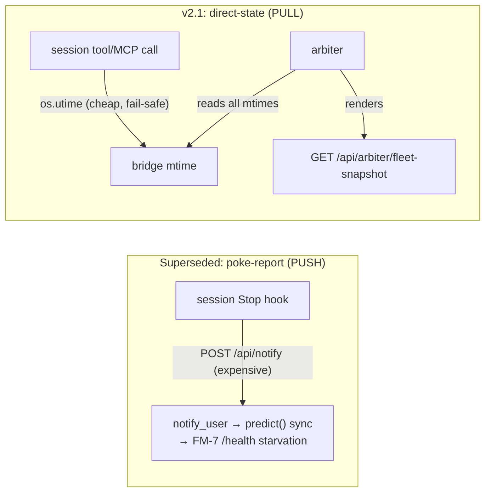

# Heartbeat: the superseded "poke-report" scaffold vs v2.1 direct-state visibility

**Date:** 2026-06-06 · **Author:** Tiberius 👑 · **For:** Rick (out-of-interest walkthrough, Thread A decision context)
**TL;DR:** the held `stop.py` carries a half-finished **on-behalf "poke-report" scaffold** — a *push* model where every session POSTs a notification per Stop to verbalize its own heartbeat state. It was **paused** (it ran the prediction engine synchronously → the FM-7 `/health` timeout). **v2.1 direct-state visibility supersedes it** by flipping push → **pull**: each session cheaply stamps its bridge-file mtime; the arbiter reads all mtimes centrally and renders the fleet. The poke scaffold is therefore obsolete; Thread A's resolution (feature-flag the idle-waiter) **drops it**.

---

## 1. The superseded scaffold (what it looks like)

Two pieces were added to `stop.py` in the **2026-06-05 observability experiment**:

**(a) `_heartbeat_state_sentence(...)`** — renders a first-person, voice-friendly state sentence per `OUTCOME_*`:

```python
def _heartbeat_state_sentence( outcome, persona_name, poke_count, cap, awaiting=None ):
    who = persona_name or "a worker"
    if outcome == OUTCOME_POKE:        ...
    if outcome == OUTCOME_HONORED:     tail = f", awaiting {awaiting}" if awaiting else ""; ...
    if outcome == OUTCOME_CAP_REACHED: return f"I'm {who}. I hit my poke cap ({poke_count}/{cap}) — I'll stop nudging."
    if outcome == OUTCOME_NOT_OWED:    ...
    return f"I'm {who}. Heartbeat stop — state {outcome}."
```

**(b) `_send_poke_report(...)`** — POSTs that sentence to `/api/notify` so the persona "speaks" its own state on-behalf:

```python
def _send_poke_report( session_id, persona_name, outcome, poke_count, cap, awaiting ):
    # NEVER raises / never blocks the Stop (try/except; mirrors the emit-outcome invariant).
    # The /api/notify POST is a deliberate :7999 round-trip so the report is spoken AS that persona.
    sentence = _heartbeat_state_sentence( outcome, persona_name, poke_count, cap, awaiting )
    request  = ...( message=sentence, abstract=f"Heartbeat outcome: `{outcome}` · poke {poke_count}/{cap}", ... )
    notify_user_async( request )
```

**Why it was PAUSED (still commented out in the working tree):**

```python
# ⏸ PAUSED 2026-06-05 (Tiberius, at Tiffany's request): each call POSTs
# /api/notify → notify_user → prediction_engine.predict() SYNCHRONOUSLY on the
# event loop → starves async health() → the FM-7 /health timeout.
# _send_poke_report( session_id, persona_name, result["outcome"], ... )
```

That FM-7 starvation is exactly what Tiffany 💍 later root-caused + fixed in `f3cfabf` (wrapping the hot path in `asyncio.to_thread`). But even fixed, the **push model itself is the wrong shape** for fleet liveness — see §2.

## 2. How v2.1 supersedes it (push → pull)

| Axis | Superseded poke-report (PUSH) | v2.1 direct-state (PULL) |
|---|---|---|
| **Mechanism** | Each session POSTs `/api/notify` per Stop to verbalize its state | Each session stamps its **bridge-file mtime** (`touch_bridge_mtime()`, metadata-only `os.utime`) per tool/MCP call |
| **Cost per signal** | A full HTTP round-trip → `notify_user` → `prediction_engine.predict()` (GPU embed + LanceDB + reentrant self-call) | One `os.utime` syscall — no I/O, no content write, fail-safe total-no-throw |
| **Failure mode** | Synchronous load multiplier → **FM-7 `/health` timeout** (the reason it was paused) | A swallowed stamp ages the session to an **honest "bridge 45m"** (C4), never a false signal; observable via counter + one-shot stderr |
| **Who renders fleet state** | Nobody centrally — each session pushes its own narration | The **arbiter pulls** all bridge mtimes → `GET /api/arbiter/fleet-snapshot` (change-or-tick render), state ⊥ liveness |
| **Frequency** | Per-Stop (bursty, expensive) | Per-tool-call (cheap) — granular liveness without cost |



**The essence:** the poke-report tried to make *liveness* a verbalized push event (costly, blocking, narration-shaped). v2.1 makes liveness a **cheap, centrally-pulled, honest age** — the right shape. The "I'm María, I hit my poke cap" narration is a *separate* concern (voice UX), not a fleet-liveness mechanism; v2.1 cleanly separates them.

## 3. Thread A resolution (decided 2026-06-06)

Ratified by Rick (guided walkthrough): **feature-flag the old `_arm_idle_waiter` "Anything else?" idle-waiter** behind an INI toggle (preserves both paths per standing preference), and **drop the now-superseded poke scaffold** (`_heartbeat_state_sentence` + `_send_poke_report`) — v2.1 owns liveness. Restore the 16 red tests to green + cover the flag branches to 100%. Implemented as a SWE-team follow-on (Clayton implement → Krishna review → Mr-Radio test → manager gate).

**Companions:** `03-arbiter-design.md` §10 (v2.1 design), `05-clayton-v2.1-implementation-log.md` (v2.1 impl), `2026.06.05-prediction-hook-eventloop-offload.md` (the FM-7 fix that the poke push triggered).
