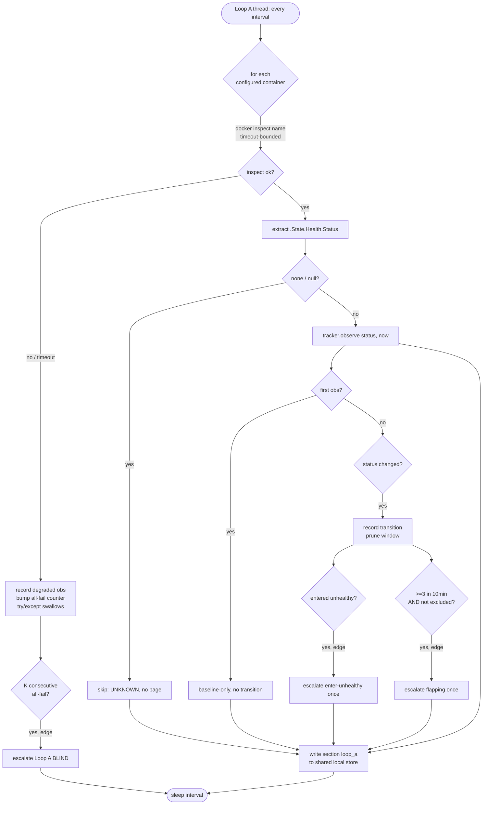

# Arbiter-Vigilance (:8001) — B1 Implementation Log

**Date:** 2026-06-07. **Implementer:** Sam 🎙️ (`e5e708e4`). **Manager:** Tiberius 👑 (`1f9f3c4c`). **Reviewer (L3, independent):** Tiffany 💍 (`7664c500`).
**Status:** IN PROGRESS — L1 ✅ complete + reviewer-PASSED; L2 design-nodded, implementing.
**Held for Rick:** nothing committed/staged/pushed; systemd unit staged-not-enabled.

## Relationship to the design corpus

This is the **accreting execution log** for the B1 build (one doc, one section per lane: design + outcome — the BFE design+execution-log pattern). The **architecture authority** is María's deploy doc; this log records *how it was built*, not *what to build*.

- Architecture authority: [`planning-is-prompting/src/rnd/2026.06.07-arbiter-deploy-architecture.md`](../../../../planning-is-prompting/src/rnd/2026.06.07-arbiter-deploy-architecture.md)
- R0 cutover spec: `planning-is-prompting/src/rnd/2026.06.07-arbiter-r0-inprocess-decommission-spec.md`
- Code lives in **Lupin** (`src/arbiter_vigilance/`); this log lives in Lupin R&D.

## Why a standalone :8001 service

A monitor must be **out-of-band** from the monitored (deploy §2). The dev (`:7999`) and test (`:8000`) servers are bounced routinely and monopolized by test runs; any arbiter logic *inside* them dies on every bounce and is shoved aside by a heavy test run — vigilance is lost exactly during disruption. So the arbiter is a separate host-side uvicorn process on `:8001`, supervised by systemd `--user` with `Restart=always` (the regress terminator, deploy §6).

## Build-time environment findings (verified 2026-06-07, not asserted)

| Q | Finding | Consequence |
|---|---|---|
| Q1 supervisor | uid 1001, **no root / no passwordless sudo**; `systemctl --user` running; `~/.config/systemd/user/` exists; Linger=no | Rung = **systemd `--user` + `loginctl enable-linger`** (keeps `Restart=always`; cron-only rejected — loses the unconditional-restart guarantee). Linger enable may need a one-time polkit/sudo grant → escalate to Rick, never self-actuate. |
| Q2 commons-write | store host-native at `$LUPIN_ROOT/io/commons/`, owner rruiz, **writable** by the service user; no container-volume segment | Service reuses `LupinArbiterGateway.from_environment(sender_session_id="arbiter-vigilance-8001")` **bridge-less** — zero commons-I/O porting (L3). |
| Q3 port | `:8001` free (only 7999+8000 listening) | Bind **127.0.0.1 explicit** (R3); `:7999` reverse-proxy is the only external view path. |
| Loop A feed | `docker inspect <name> --format '{{json .State.Health}}'` works from host → `.State.Health` populated; HEALTHCHECK interval 30s / timeout 10s / start-period 60s / retries 3 | Loop A has a real feed with **zero new dev-side infra**. |

---

## Lane index

| Lane | Scope | Status |
|---|---|---|
| **L1** | scaffold: uvicorn `:8001` + `GET /health` + systemd `--user` unit | ✅ complete · reviewer-PASSED |
| **L2** | Loop A: per-container docker-inspect health watch + flapping | 🔨 implementing (design-nodded) |
| **L3** | Loop B: port v2.2 arbiter to standing cadence + R0 decommission | ⏳ pending (high-stakes — closest scrutiny) |
| **L4** | `GET /state` single-pane + `:7999` reverse-proxy + INI/splainer | ✅ complete · reviewer-PASSED (Tiffany 💍 clean pass) |

---

## L1 — scaffold (✅ complete, reviewer-PASSED)

**Design:** smallest shippable = a supervised heartbeat that survives a dev bounce. `GET /health` only (loops are L2/L3). The entrypoint is designed so the **`:8001`-LOCAL snapshot sink is injectable** — `create_app(snapshot_store=...)` — closing Tiffany's pre-build "snapshot-sink direction trap" (the v2.1 `_snapshot_sink` defaults to PUSH to `:7999 /api/arbiter/fleet-snapshot`, which would violate R4) before any loop code exists.

**As-built (7 files, commit-less):**
- `src/arbiter_vigilance/__init__.py` — package + `__version__`
- `src/arbiter_vigilance/app.py` — `create_app()` factory + `GET /health`; injectable local snapshot-store seam on `app.state`
- `src/arbiter_vigilance/local_snapshot_store.py` — the R4 linchpin (in-process, zero `cosa.rest`/HTTP) — **evolved to section-keyed in L2, see below**
- `src/arbiter_vigilance/systemd/arbiter-vigilance.service` — systemd `--user` unit, `Restart=always`+`RestartSec=5`, **staged-not-enabled**
- `src/arbiter_vigilance/systemd/README.md` — install/enable/linger/bounce-survival/cron/rollback (run-by-Rick)
- `src/scripts/run-arbiter-vigilance.sh` — uvicorn `127.0.0.1:8001`, `reload=False`, `LUPIN_ROOT` guard
- `src/tests/unit/test_arbiter_vigilance_app.py` — TestClient tests (no curl)

**Verification:** py_compile OK · `bash -n` OK · pytest 4/4 · coverage **100% line+branch** (37 stmts, 0 miss, 0 brpart) · ephemeral `:8001` boot via the run script → `/health`=`{"status":"ok",...}` → clean teardown, port released · **AST-level R4 proof**: zero `cosa.rest`/`requests`/`httpx`/`urllib` imports in the package.

**Reviewer verdict (Tiffany 💍, independent re-derive):** ✅ PASS — own coverage run (100%), own AST import-walk (VIOLATIONS NONE), own live boot (200 → released clean).

---

## L2 — Loop A: per-container health watch (design, implementing)

### Feed (verified)
`.State.Health` = `{ Status, FailingStreak, Log[last-5 probe results] }`. `Status ∈ {none, starting, healthy, unhealthy}`. All four containers share the same healthcheck shape → **inspect each BY NAME, never a global**.

### Design decisions
1. **Per-container by name** — config list `arbiter health watch containers` (default: `lupin-rest-dev,lupin-rest-test,lupin-model-server,lupin-postgres`). `Status` null/`none` (no healthcheck) → UNKNOWN, skip (never false-page).
2. **Transitions from our OWN successive observations** (poll-to-poll), NOT Docker's 5-deep `Log` (that's probe ExitCodes, not status transitions). Per container: last-seen status + a rolling deque of transition timestamps. A transition = observed status ≠ previous observed status.
3. **Flapping = ≥3 transitions / 10 min** — deque pruned to `arbiter health flap window seconds`=600; `len ≥ arbiter health flap threshold transitions`=3 → flapping. One blip never pages.
4. **V1 = notify-only** (no auto-bounce; auto-remediation is V2). Two **edge-triggered, once-per-episode** escalations (re-arm on recovery):
   - enter-unhealthy: `(starting|healthy) → unhealthy` → escalate once; re-arm on `→ healthy`.
   - flapping-detected: ≥3/10min → escalate once; re-arm when the window clears.
5. **Warm-up** — the FIRST observation of each container is **baseline-only** (no phantom `unknown→healthy` transition). A container in `starting` (inside its 60s Docker start-period) is benign, never paged.
6. **`/health` never blocks** (hard constraint) — three guards: Loop A runs on its **own background thread** (`/health` reads only the cheap in-process `started_at`+`version`, touches docker never); each `docker inspect` is bounded by `arbiter health inspect timeout seconds`=5 (< Docker's 10s probe timeout); **per-container AND per-poll try/except** — one container's failure is swallowed+logged, the loop continues. After K consecutive **all-container** inspect failures → escalate "Loop A BLIND — docker inspect failing" (the watcher noticing it has gone blind is itself a real signal).
7. **State exposure** — Loop A writes section `"loop_a"` of the **same** `app.state.snapshot_store` instance `/state` (L4) reads (Tiffany/Tiberius note #1). Stays local — zero `:7999`.
8. **Structured logging** (Tiberius/Tiffany note #4) — injected `log_fn` seam, default emits structured JSON lines (`ts`/`event`/fields) to stdout→journal, not bare prints (deploy §7).

### Reshape (Tiberius): dev-bounce false-flap
`:7999` (dev) is **bounced routinely** during development. Each bounce reads as `healthy → starting → healthy` ≈ 2 transitions; two bounces in 10 min = 4 transitions = a **false flapping page**. Mitigation (config knob + documented note, not over-engineered):
- **`arbiter health flap exclude containers`** (default `lupin-rest-dev`) — excluded containers are **never flap-paged**, but **still get enter-unhealthy alerts** (a dev container that goes genuinely unhealthy and stays is still surfaced). Silences dev-bounce noise without losing real-failure signal; trivially tunable.
- **Known V1 limitation:** for any container NOT on the exclude list, a burst of legitimate restarts can still read as flapping. Per-container flap thresholds are a documented **V2** refinement; V1 ships the exclude knob.

### Store evolution (note #1 consequence)
`LocalSnapshotStore` evolves from a single-dict holder to a **section-keyed** holder so Loop A (`"loop_a"`) and Loop B (`"loop_b_fleet"`, written via a sink-adapter so the v2.2 code is untouched) coexist in ONE instance without clobber: `set_section(name, value)` / `get_section(name)` / `get()` → composite / `clear()`. The L1 store unit test is updated accordingly (same engagement, re-routed to Tiffany). R4 unchanged: still zero I/O, zero network.

### Loop A flow

### New INI keys (each + matching splainer entry)
| Key | Default | Meaning |
|---|---|---|
| `arbiter health watch enabled` | `True` | master enable for Loop A |
| `arbiter health watch interval seconds` | `30` | poll cadence (matches Docker's probe interval; faster is waste) |
| `arbiter health watch containers` | `lupin-rest-dev,lupin-rest-test,lupin-model-server,lupin-postgres` | containers to inspect, by name |
| `arbiter health inspect timeout seconds` | `5` | per-inspect subprocess timeout (< Docker's 10s probe timeout) |
| `arbiter health flap window seconds` | `600` | rolling flap window |
| `arbiter health flap threshold transitions` | `3` | transitions-in-window that = flapping |
| `arbiter health flap exclude containers` | `lupin-rest-dev` | containers excluded from flap-paging (still enter-unhealthy paged) |
| `arbiter health blind threshold polls` | `3` | consecutive all-container inspect failures → "Loop A BLIND" |

### Testability (100% line+branch+function)
Injected seams: `inspect_fn(name)->dict|None` (the only real-subprocess IO boundary → `pragma: no cover`, like `gateway.from_environment`), `clock`, `notify_fn`, `log_fn`. All transition/flap/warm-up/throttle/blind logic lives in pure leaves, driven in unit tests by synthetic `Status` sequences (healthy→unhealthy→healthy×N for flap; first-obs baseline; `starting` benign; inspect-timeout; all-blind; flap-excluded). **No live docker in unit tests.**

### Outcome (✅ implemented — awaiting reviewer verdict)

**Files (new):** `src/arbiter_vigilance/health_watch.py` (Loop A: `ContainerHealthTracker` pure leaf + `HealthWatchLoop` + `SystemClock`/`docker_inspect_health`/`_default_log_fn` seams), `src/tests/unit/test_arbiter_vigilance_health_watch.py`.
**Files (modified):** `local_snapshot_store.py` → **section-keyed** (`set_section`/`get_section`/`get` composite/`clear`); `app.py` → lifespan start/stop of an injectable `health_loop` + `create_production_app()` factory; `run-arbiter-vigilance.sh` → uvicorn `--factory create_production_app`; `test_arbiter_vigilance_app.py` → section API + lifespan tests; `lupin-app.ini` + `lupin-app-splainer.ini` → 8 keys each.

**Wiring shape:** module-level `app = create_app()` stays **loop-less** (safe import, unit tests spawn no threads/docker); production uses `create_production_app()` via `--factory`, which builds the real `docker_inspect_health` seam + the loop wired to the **same** store instance `/state` (L4) will read. The lifespan start()s Loop A on boot, stop()s on shutdown.

**Verification (all green):**
- py_compile OK · `bash -n` OK
- pytest **31/31 pass** · coverage **100% line+branch** (196 stmts, 0 miss; 52 branches, 0 brpart) across all 4 package modules
- only `pragma: no cover` = `docker_inspect_health` (real subprocess) + `SystemClock.sleep` (real sleep) + `create_production_app` (real config/docker/escalation wiring) — the IO boundaries; ALL logic (tracker, poll, escalate, blind, write_state, run, start/stop) is covered
- **integration proof**: ephemeral boot of the production factory → `/health`=ok → Loop A polled **all 4 named containers** vs real docker (`health_obs` × 4, all healthy) → clean teardown, port released
- **R4 (AST)**: zero `cosa.rest`/`requests`/`httpx`/`urllib` imports (cosa.config for INI is allowed; `subprocess docker inspect` is Loop A's legitimate feed, not :7999 HTTP)

**Bug found + fixed during testing (test-ownership):** `_log("escalate", event=…)` collided with `_log(self, event, **fields)`'s positional param (`TypeError: multiple values for 'event'`); the escalation field was renamed `escalation=` at both call sites. Caught by the unit tests before any boot.

**Reviewer note delta:** both forward notes folded — (#1) Loop A writes the **same** `app.state.snapshot_store` section `loop_a` (section-keyed store, no clobber with Loop B's `loop_b_fleet`); (#4) structured JSON `log_fn` with `flush=True` (an unflushed watcher log is a silent watcher — surfaced by the first ephemeral boot where buffered logs were lost).

**Reviewer verdict (Tiffany 💍) — round 1: ❌ FAIL (deploy-wiring gap, not a logic gap).** Unit layer accepted (100%, R4 clean, 136 green, logic correct), but the deployable service couldn't boot under a systemd-faithful env. Four items (A+B required, MEDIUM + SOFT→REQUIRED):

| # | Defect | Fix |
|---|---|---|
| **A** | `create_production_app` needs `LUPIN_CONFIG_MGR_CLI_ARGS`; the unit set only `LUPIN_ROOT`; the run script never exported it. My "integration ok" was a **false pass** — my interactive shell had the var inherited; systemd's clean env wouldn't → `ValueError` → `Restart=always` crash-loop. | Run script exports `LUPIN_CONFIG_MGR_CLI_ARGS` (`:-` default; `config_block_id=Lupin:+Development`); unit comment documents it. |
| **B** | Run script used bare `python` → under systemd `--user`'s minimal PATH = system python, no uvicorn. | Run script uses `"$LUPIN_ROOT/.venv/bin/python"` (+ executable guard). |
| **MEDIUM** | `arbiter health watch enabled` was a **dead key** (never read; Loop A started unconditionally). | `create_production_app` now gates Loop A construction on it (disabled → `health_loop=None` + a `loop_a_disabled` log). |
| **SOFT→REQUIRED** | The blanket `docker_inspect_health` pragma hid 4 testable parse arms (the same blind-spot class that hid A). | Extracted pure `_parse_inspect_result(returncode, stdout)` + unit-tested all arms; pragma shrunk to just `subprocess.run`+except. |

**Re-verification (round 2, all green):** py_compile + `bash -n` OK · pytest **32/32** · coverage **100% line+branch** (206 stmts/0 miss, 56 br/0 brpart) · **CLEAN-ENV systemd-faithful boot** (`env -i`, `LUPIN_CONFIG_MGR_CLI_ARGS` unset, `PATH=/usr/bin:/bin`, run-script-driven) → `/health`=ok → Loop A polled all 4 containers (`health_obs`×4) → clean teardown, zero crash/`ValueError`/`ModuleNotFound` · 136-arbiter baseline still green (388 passed). **Lesson carried to L3: minimize pragma scope — what's behind it is a test blind spot.**

**Reviewer verdict (Tiffany 💍) — round 2: ⚠️ CONDITIONAL PASS.** A/B/SOFT/parse/136/coverage all independently re-verified (clean-env boot with the var UNSET → `/health` ok + `health_obs`×4, zero `ValueError`/`Traceback`). ONE remaining REQUIRED — the **same pragma-blind-spot anti-pattern**: the `enabled` kill-switch gate sat inside `create_production_app` (blanket `# pragma: no cover`), so its true/false branches were untested testable logic.

**Round-3 fix:** made `create_production_app( cfg=None )` injectable (default → real ConfigurationManager); unit-tested **both** arms with a fake cfg (enabled→loop wired; disabled→`health_loop=None` + `loop_a_disabled` log). The pragma shrank to **only** the `if cfg is None:` ConfigurationManager construction. `app.py` is now 48 counted stmts (was 30 blanket-pragma'd). Re-verified: pytest **34/34** · **100% line+branch** (224 stmts/0 miss, 58 br/0 brpart) · clean-env re-boot (new factory signature) → `/health` ok + `health_obs`×4 + clean teardown. Pragma scope now = 3 genuine IO boundaries only (config construction, `SystemClock.sleep`, `docker_inspect_health` subprocess).

**Principle locked for L3 (Tiberius):** a factory that BRANCHES on config is NOT an IO boundary — inject the dependency so the branches are testable; pragma only the literal external construction. Carries directly into L3's `create_production_app` Loop-B wiring + the recycle-wrapper (built injectable from the start).

**Reviewer verdict (Tiffany 💍) — round 3: ✅ CLEAN PASS — L2 CLOSED.** Independently re-derived: enabled gate outside the pragma with both arms covered (enabled→`HealthWatchLoop`, disabled→`None`+`loop_a_disabled`), pragma scoped to the 3 genuine boundaries, coverage 34/100% (224/0/58/0), final clean-env boot (`env -i`, var unset, `cfg=None` factory) → `/health` ok + `health_obs`×4 + zero tracebacks + clean release, 136 baseline green.

---

## L3 — Loop B + R0 decommission (design — BUILD-NODDED, implementing)

**Verify-before-edit (confirmed):** `SystemClock.sleep` is `async` (heartbeat_poker_job:101); `ArbiterConsumerJob._execute` checks `_cancel_requested` at top-of-loop (718) and exits on the 12h `max_duration` cap; `AgenticJobBase.__init__` is pure in-memory (no DB/server). So the v2.2 job runs standalone via `do_all()` → `asyncio.run(_execute())` on a background thread, cancelled via `request_cancel()`.

### Design
- **Loop B = the v2.2 `ArbiterConsumerJob` REUSED AS-IS** (zero logic edits → invariants preserved by construction: never-auto-assign {who,send_to,post,read} · additive-observer one-way · lineage routing, no hardcoded persona). Thresholds from the existing 7 INI keys (poll 60 / alive 600 / quiet 300 / tap 300 / ack 600 / stall 1800).
- **Recycle-wrapper (`LoopBRunner`, REQUIRED — 12h cap self-perpetuation):** a background thread runs `while not stop: job = job_factory(); job.do_all()` — at the clean 12h `max_duration` cap-exit it RELAUNCHES a fresh job (systemd can't catch a clean background-thread return). SEQUENTIAL by construction (`do_all()` returns before the next job starts). A fresh job re-tails from offset 0 and re-baselines `_last_progress_sig`/`_decision_since` on its first poll → **no false stall / backlog re-escalation on recycle**. Injectable `job_factory` → recycle path 100% unit-tested.
- **Sink (out-of-band):** `snapshot_sink = lambda snap: store.set_section( "loop_b_fleet", snap )` → the SAME `:8001`-local store Loop A + `/state` (L4) use. The default `arbiter_snapshot_store.set_snapshot` (an inert in-process singleton setter; never called) is overridden. **DETECTION path stays strictly `:7999`-free** (events_tail / who / manager_resolver / sink all filesystem).
- **Escalation (ruling A, detection-pure / output-best-effort):** the job's `notify_fn` = an escalation-OUTPUT sink that (1) ALWAYS posts to the new durable `fleet-escalations` commons topic via the bridge-less gateway (**degrade-safe — swallow+log on write failure, note 3**), AND (2) best-effort fires an injected, swallowed `live_notify_fn` (the only place a `:7999` notify may occur — escalation path ONLY, never per-poll; default no-op so escalation never blocks). Manager taps (`send_to`) + roster surface (`post`) ride the same bridge-less gateway.
- **Warm-up (ruling B):** new INI `arbiter start period seconds`=120. Each fresh job's `notify_fn` is wrapped to SUPPRESS escalations while `(now − job_start) < 120s` — applied **per-job-start** (resets on each recycle) so cold boot / restart / recycle never false-fire.
- **Graceful stop (ruling C):** `request_cancel()` checked at top-of-loop → ≤`poll_seconds` (60s) to exit; systemd `TimeoutStopSec=75` covers the kill. Sub-slicing the sleep = V2.

### R0 — atomic decommission (never-two across BOTH mechanisms, note 1)
- New INI flag `arbiter in-process bootstrap enabled` (default `True` = today's behavior) + splainer.
- New testable wrapper `submit_arbiter_if_enabled( todo, run, cfg, *, submit_fn=submit_arbiter_if_absent, log )` in `arbiter_bootstrap.py`: reads the flag ONCE; True → `submit_fn(...)`; False → greppable DISABLED log + `None`. **Malformed value → coerced False (in-process OFF) + LOUD WARNING** (ruling D — a typo must not silently disable vigilance). `main.py:847-848` calls the wrapper.
- **Two-mechanism never-two (explicit):** the `:8001` side runs via the single `LoopBRunner` thread (one sequential job at a time) = the `:8001`-side single-instance. The in-process side is guarded by `arbiter_already_present` (double-submit belt) and gated OFF by the R0 flag. The flag ensures **only ONE path ever actuates**; cutover is break-before-make (flag False → bounce → enable :8001), brief zero-arbiter window OK, never two.
- **redline-C2 retirement (atomic):** `routers/arbiter.py:17-18` "NO standalone arbiter HTTP server" comment reworded to "SUPERSEDED — `:8001` /state authoritative; legacy in-process surface retiring with the in-process arbiter." Comment-only → `test_arbiter_router` stays green.
- **T1–T5 matrix** on the wrapper (True / False / absent→default / malformed→False+warn / read-once).

### Injectable-from-the-start (Tiberius's locked principle)
`assemble_app( cfg, gateway, store, live_notify_fn, … )` holds ALL testable wiring (Loop A enable-gate, Loop B factory + runner, `create_app`); `create_production_app()` is a thin `# pragma: no cover` wrapper building the literal externals (ConfigurationManager, `LupinArbiterGateway.from_environment`, the real `:7999` live-notify). `LoopBRunner`, `make_escalation_notify_fn`, `make_warmup_notify_fn`, `build_loop_b_job_factory` are each 100% unit-tested with fakes — no real gateway / docker / job-run in unit tests.

### Known V1 behavior (note 2)
A fresh post-recycle job has an EMPTY `PingLedger` → it may re-ping a still-blocked edge ONCE at the 12h recycle boundary (bounded by the global ≤10/hr ping cap). Persisting the ledger across recycle = V2; not done now.

### Outcome (✅ implemented — awaiting reviewer verdict)

**Files (new):** `src/arbiter_vigilance/loop_b.py` (`LoopBRunner` recycle supervisor + `make_escalation_notify_fn` + `make_warmup_notify_fn` + `build_loop_b_job_factory`), `src/tests/unit/test_arbiter_vigilance_loop_b.py`.
**Files (modified):** `app.py` → split into testable `assemble_app(cfg, gateway, …)` + thin `# pragma` `create_production_app()` (Loop B wired alongside Loop A; lifespan starts/stops both); `arbiter_bootstrap.py` → `submit_arbiter_if_enabled()` R0 wrapper; `main.py:847-848` → calls the wrapper; `routers/arbiter.py` → redline-C2 comment retired; `lupin-app.ini`+splainer → 2 keys (`arbiter in-process bootstrap enabled`, `arbiter start period seconds`); systemd unit → `TimeoutStopSec=75`; `test_arbiter_vigilance_app.py` → assemble + both-loops lifespan tests; `test_arbiter_bootstrap.py` → T1–T5.

**Verification (all green):**
- py_compile + import-chain (`main.py`'s `submit_arbiter_if_enabled`) OK
- **arbiter_vigilance 100% line+branch** (299 stmts/0 miss, 74 br/0 brpart; 48 tests) — pragma scope = the 4 literal external-construction boundaries only (`create_production_app`, `docker_inspect_health`, `SystemClock.sleep`, the `if cfg is None` config build)
- **arbiter_bootstrap 100%** (30 stmts, 12 br; R0 wrapper, 16 tests incl. T1–T5)
- **136-arbiter baseline → 409 passed** (grew with T1–T5; zero regressions)
- **R4 (AST):** zero `cosa.rest`/`requests`/`httpx`/`urllib` imports in the package (`cosa.agents.arbiter_job` is filesystem/in-process; `cosa.config` is INI-only)
- **Loop B integration probe (safe):** a REAL `ArbiterConsumerJob` ran through `LoopBRunner` against a **fake gateway** → `loop_b_job_start` logged, 1 cycle, a real poll built a 17-session fleet view from real filesystem bridges, wrote the `loop_b_fleet` store section, posted its roster to the **fake** gateway (zero real-commons actuation), and stopped cleanly on cancel.

**Deliberately NOT run — a live production-factory uvicorn boot.** The in-process arbiter is currently active (R0 flag default `True` on `:7999`/`:8000`); booting live Loop B would transiently create **two** actuating arbiters — exactly the never-two violation R0 exists to prevent. The live boot is Rick's break-before-make cutover step (flag `False` → bounce → enable `:8001`), not a test. Refusing to double-actuate even for a test IS the R0 discipline.

**Never-two across BOTH mechanisms (verified):** the `:8001` side = the single `LoopBRunner` thread (sequential recycle — one job at a time); the in-process side = `arbiter_already_present` (double-submit belt) gated OFF by the R0 flag. T1–T5 prove the flag gate (True/False/absent/malformed→False+warn/read-once).

**Reviewer verdict (Tiffany 💍):** _(pending — routed)_

## L4 — /state single-pane + :7999 proxy (✅ implemented — awaiting reviewer verdict)

**Implementer:** Mr. Radio 🦉 (`bbe3ebda`, replaced the dormant worker). **Design-nodded by Tiberius** with one required refinement (folded — see below).

### Design (as-built)
- **Surface 1 — `GET /state` on :8001** (`app.py`, inside `create_app`, mirrors `/health`): reads the composite via `store.get()` → `{loop_a, loop_b_fleet}`. **Top-level `status:"ok"`** = the watcher is alive; **each section is its real value once its loop has written it, else an explicit per-section `"awaiting"` placeholder** — never a bare null, so a cold loop is distinguishable from a genuinely empty fleet (the §10.4 awaiting idiom, mirrored from `/api/arbiter/fleet-snapshot`). Read-only, zero outbound HTTP, inherits the run-script's 127.0.0.1 bind (R3/R4 intact).
- **Surface 2 — `GET /api/arbiter/fleet-state` on :7999** (`routers/arbiter.py`): thin reverse-proxy that **PULLS** `:8001/state` (R3 — :7999 never pushes), inherits `require_api_key_or_jwt` (same credential as the legacy pair). HTTP-pull seam = module-level `_pull_arbiter_state(url, timeout)` (the ONE `# pragma: no cover` line — the literal httpx boundary). On any `httpx.HTTPError` (connect-refused / timeout / non-2xx) returns an explicit `{status:"unreachable", loop_a:null, loop_b_fleet:null}` envelope at **HTTP 200** (the proxy is up, the upstream watcher is not — consistent with the awaiting idiom), never a 5xx or a hang.
- **Which wins post-cutover:** legacy GET/POST `/api/arbiter/fleet-snapshot` STAYS until R0 cutover (both coexist); **post-cutover `/api/arbiter/fleet-state` is authoritative** and the in-process pair retires with the in-process arbiter (gated off by `arbiter in-process bootstrap enabled`). Documented in the router module docstring.

### Tiberius's required refinement (folded)
**No module-scope `ConfigurationManager` in `routers/arbiter.py`** — that would run at import and couple test collection to `LUPIN_CONFIG_MGR_CLI_ARGS` being set (the L2-boot-bug class). Instead the handler reads config **lazily**, reusing the canonical singleton `get_config_manager()` from `cosa.rest.dependencies.config` via a **function-local import inside `get_fleet_state()`** — `arbiter.py`'s module import stays 100% config-free. **Proof:** `pytest --collect-only` on `test_arbiter_router.py` + `test_arbiter_vigilance_app.py` with `env -u LUPIN_CONFIG_MGR_CLI_ARGS` → 18 tests collected, zero error.

### New INI keys (each + matching splainer entry)
| Key | Default | Meaning |
|---|---|---|
| `arbiter vigilance state url` | `http://127.0.0.1:8001/state` | upstream the :7999 proxy PULLS the composite from (R3) |
| `arbiter vigilance state timeout seconds` | `5` | per-pull httpx timeout (fail to "unreachable", never hang :7999) |

### Files
**Modified:** `arbiter_vigilance/app.py` (+`GET /state` handler + docstring), `cosa/rest/routers/arbiter.py` (+`GET /api/arbiter/fleet-state` + `_pull_arbiter_state` seam + httpx import + superseded-note rewrite), `conf/lupin-app.ini` + `conf/lupin-app-splainer.ini` (2 keys each), `tests/unit/test_arbiter_vigilance_app.py` (+3 /state tests), `tests/unit/test_arbiter_router.py` (+3 fleet-state tests + httpx import).

### Verification (all green)
- py_compile OK (both source files)
- **collect-only with env UNSET** → 18 collected, 0 error (the refinement proof)
- pytest **18/18** on the two touched files · **100% line+branch** on both touched modules (`app.py` 55 stmts/0 miss/10 br/0 brpart; `routers/arbiter.py` 31 stmts/0 miss/2 br/0 brpart) — function coverage 100% (every testable function entered; only the literal httpx line is pragma'd)
- arbiter unit baseline **`-k "arbiter or heartbeat"` → 415 passed** (was 409 → +6 L4 tests; zero regressions)
- R3 (proxy pulls only) ✅ · R4 untouched (`app.py` adds zero `cosa.rest`/http imports — `/state` reads the in-process store) ✅ · :7999 touch = the proxy GET only ✅ · nothing committed/staged/pushed ✅

**Reviewer verdict (Tiffany 💍) — ✅ CLEAN PASS, L4 CLOSED.** Independently re-derived: /state reads the same composite both loops write (awaiting-not-null, both arms covered, app.py 10/0 br); proxy PULLS :8001/state and never pushes; app.py zero `cosa.rest`/http (R4 holds — httpx only on the :7999 side); `_pull_arbiter_state` pragma scoped to the one httpx line with the unreachable-200 path tested; function-local `get_config_manager` keeps the module import config-free (her own `env -u` collect-only = 18 collected/0 errors — the exact class that tripped earlier lanes, clean here); 100% both files (app.py 55/0 10/0, arbiter.py 31/0 2/0); baseline 415. **No findings.**
