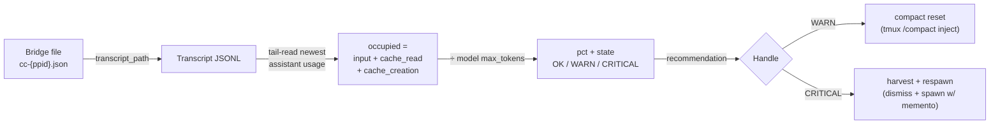

# Fleet Context-Pressure Assessment Utility — Proposal

**Date:** 2026-06-07
**Author:** Clayton 😎 (session 19581015)
**Status:** PROPOSAL — awaiting Rick's go-ahead before implementation
**Source R&D:** [`2026.06.07-managing-context-memory.md`](2026.06.07-managing-context-memory.md) *(same directory)*
**Ephemeral plan file (claude-plans scope):** `~/.claude/plans/rustling-knitting-mccarthy.md`

---

## 1. Context (why)

The fleet runs many Claude Code worker instances (persona sessions). As a worker's
context window fills, it silently degrades and eventually **autocompacts** — losing
fidelity right when it's mid-task — with **no fleet-level visibility**. Rick asked for
a utility we can call **on the fly as part of the health check** to:

1. **Surface** which workers are running low on context, and
2. **Handle** them — either *reset* (compact) or *harvest-and-respawn* with a
   rehydration memento — **before** autocompact silently bites.

## 2. Key finding that shapes the whole design (verified, not assumed)

The source R&D doc's headline mechanism — `ClaudeSDKClient.get_context_usage()` —
**does NOT apply to our workers.** Fleet workers are **tmux-driven `claude` CLI
processes** (`src/lupin_mcp/session_spawner.py` → `src/scripts/start-cc-with-tmux.sh`),
not `ClaudeSDKClient` sessions. The SDK is used only by orchestration agents
(BFE / TFE / SWE-team) via one-shot `sdk_query()`, and **nothing calls
`get_context_usage()`** anywhere in the codebase. The source doc itself flags this
(caveat #1: "won't work in fire-and-forget loops; fine for a sidecar topology").

**The pivot (verified live):** every worker's bridge file
(`~/.claude/sessions/cc-{ppid}.json`) carries a `transcript_path`, and Claude Code
transcripts are JSONL with per-message `usage`. The **last assistant message's**
`input_tokens + cache_read_input_tokens + cache_creation_input_tokens` = the prompt
size sent that turn = **current context occupancy** — the `/context` `totalTokens`
equivalent, readable entirely out-of-band.

> **Probe (María's live session, 2026-06-07):** model `claude-opus-4-8`, last-turn
> usage = input 1,350 + cache-creation 1,032 + cache-read 457,280 = **459,662 tokens**
> → **~46% of a 1M window**. Confirms the signal is present and correct.

This transcript-parsing approach is **strictly more applicable** than the source doc's
recommendation: it covers the whole tmux-CLI fleet, needs no live SDK client, and reads
only files the arbiter already scans.



## 3. Recommended approach

### A. Core utility (pure-logic — the "assess on the fly" deliverable)

New module `src/cosa/agents/heartbeat_arbiter/context_pressure.py`:

- `read_last_usage(transcript_path) -> Usage | None` — bounded **tail** read of the
  JSONL (seek from EOF, scan backward for the newest `message.role=="assistant"` with
  a `usage` dict). Fast, tolerant of partial/short files.
- `assess_context_pressure(transcript_path, *, model=None, max_tokens=None) -> ContextPressure`
  → `{ occupied_tokens, max_tokens, pct, model, last_turn_ts, state }`, where
  `occupied = input + cache_read + cache_creation` and
  `state ∈ {OK, WARN, CRITICAL, UNKNOWN}` by configured thresholds.
- `max_tokens` resolution: model→window map + a 1M-beta inference (occupancy already
  >200k ⇒ session is on the `[1m]` window) + config override. Fleet default = 1,000,000.

### B. Fleet helper (the health-check surface)

- `assess_fleet_context_pressure() -> list[WorkerContextPressure]` — enumerate active
  workers via the **existing** `session_bridge.find_active_voice_persona_sessions()`,
  read each bridge's `transcript_path`, call `assess_context_pressure`, attach
  `{session_id, persona, tmux_session, recommendation}`.

### C. On-the-fly entry points

- `quick_smoke_test()` / `python -m cosa.agents.heartbeat_arbiter.context_pressure` →
  prints the live fleet pressure table (persona · pct · state · rec).
- A read-only REST surface: extend the arbiter `/state` (and the `:7999`
  `/api/arbiter/fleet-state` reverse-proxy) with a `context_pressure` section.

### D. Handling (sensor + recommender — never auto-act in Phase 1/2)

Both mechanisms **already exist**; we only wire recommendations to them:

- **Reset/compact** — inject `/compact` into the worker's tmux session via the same
  `tmux send-keys` path `cc_notification_listener` uses (`_resolve_tmux_session` +
  `_inject_via_tmux`). Manager-triggered.
- **Harvest+respawn** — existing `dismiss_sessions(...)` (idempotent kill + bridge
  unlink + `session_reaped` event) → `spawn_sessions(..., seed_memento=...)` (memento
  appended as trailing appendix per `render_task_prompt`). Manager-triggered.

Per the arbiter invariant ("sensor + recommender, never auto-assign"), Phase 1/2 only
surface + recommend; a CRITICAL worker posts to a reserved `context-harvest-decision`
topic + `notify()` to the manager. Auto-action is Phase 3, gated.

### E. Config (`lupin-app.ini` + matching `lupin-app-splainer.ini`)

```ini
arbiter context watch enabled            = true
arbiter context window tokens            = 1000000   # fleet [1m] default; model-map overrides
arbiter context warn threshold pct       = 70
arbiter context critical threshold pct   = 85        # proactive, before ~92% autocompact
arbiter context harvest decision topic   = context-harvest-decision
arbiter context auto handle              = false     # Phase 3 gate
```

## 4. Phasing (each phase independently shippable + reviewable)

| Phase | Scope | Gate |
|---|---|---|
| **P1** | The utility: `context_pressure.py` + fleet helper + on-the-fly CLI table. Pure-logic, 100% line+branch. Usable standalone immediately. **(Smallest, highest-value — this is what Rick asked for.)** | Krishna L3 → Rick |
| **P2** | Wire the fleet helper into the arbiter as a pure leaf (Loop B preferred — it already builds the per-session fleet view), surface in `/state` + `/api/arbiter/fleet-state`, emit CRITICAL recommendations to the decision topic + `notify()`. Still sensor-only. | Krishna L3 → Rick |
| **P3** *(gated, optional, default OFF)* | Behind `arbiter context auto handle`: manager one-click (or arbiter, if Rick later allows) compact / harvest+respawn-with-memento. | Explicit Rick opt-in |

## 5. Files

- NEW `src/cosa/agents/heartbeat_arbiter/context_pressure.py` (P1)
- NEW `src/tests/unit/.../test_context_pressure.py` (P1, 100% cov; synthetic-`usage` fixture transcripts)
- REUSE `src/lupin_cli/claude_code/hooks/lib/session_bridge.py` (`find_active_voice_persona_sessions`, bridge `transcript_path`)
- REUSE `src/lupin_mcp/session_spawner.py` (`dismiss_sessions` / `spawn_sessions` / memento) — P3
- REUSE `src/lupin_cli/claude_code/hooks/lib/cc_notification_listener.py` (tmux inject) — P3
- EDIT (P2) `src/arbiter_vigilance/loop_b.py` + `local_snapshot_store.py` + `app.py` (/state) + `src/cosa/rest/routers/arbiter.py`
- EDIT `src/conf/lupin-app.ini` + `src/conf/lupin-app-splainer.ini`

## 6. Verification

- **Unit:** synthetic transcript fixtures (OK / WARN / CRITICAL / no-usage / truncated /
  1M-vs-200k inference / tail-read correctness). 100% line+branch on `context_pressure.py`.
- **On-the-fly E2E (read-only, `:7999`-safe):** run the CLI table against the LIVE bridge
  files; confirm it reports real fleet pressure (reproduces María's ~46%). No state mutation.
- **P2/P3:** arbiter leaf unit tests + a `:8000` integration check that `/state` exposes the
  section; P3 handling tested with a throwaway spawned worker.

## 7. Open questions for Rick

1. **Scope now:** ship **Phase 1 only** (the standalone on-the-fly utility) and stop for
   review before Phase 2 wiring? *(Recommended — smallest reviewable unit.)*
2. **Thresholds:** WARN 70% / CRITICAL 85%? *(85% leaves headroom before ~92% autocompact
   so we harvest deliberately, not reactively.)*
3. **Auto-handling:** keep it **sensor-only** (manager approves every compact/harvest)?
   *(Recommended — matches the arbiter "never auto-act" invariant.)*

> **Recommendation: yes / yes / yes.** Status remains PROPOSAL until Rick's explicit go.
