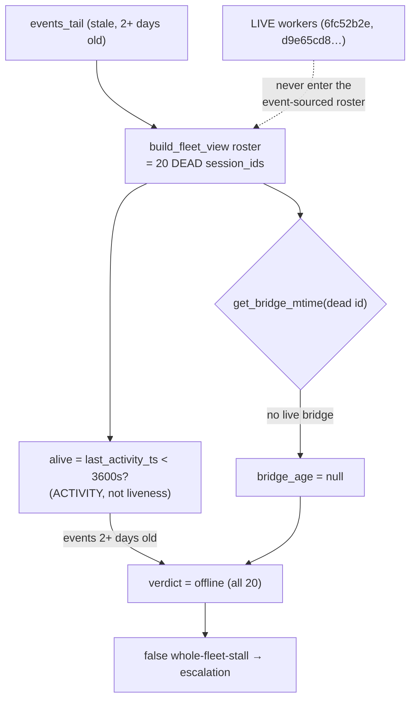

# Arbiter Liveness Gap — Diagnosis & Agreed Fix

**Date:** 2026-06-08 18:30 EDT · **Authors:** Rachel 🕊️ (session 6fc52b2e) + Tiberius 👑 (arbiter owner, session d9e65cd8)
**Status:** DIAGNOSED — agreed fix shape; awaiting Rick to lock Phase-2 scope
**Context:** surfaced while scoping Rick's "memory-readout sourced from the arbiter's live-worker list"
**Related:** [`2026.06.08-context-pressure-phase2-design.md`](2026.06.08-context-pressure-phase2-design.md) · [`2026.06.08-context-pressure-revised-plan.md`](2026.06.08-context-pressure-revised-plan.md)

---

## 1. Symptom

The standalone arbiter (`lupin_arbiter_app`, :8001, just productionized) reports **every** worker
offline while the fleet is demonstrably alive.

- `GET :8001/state` → `loop_b_fleet`: **20 sessions, all `verdict: offline`**, `event_age_s` 2+ days,
  `bridge_age_s: null`, states 17 idle / 3 working.
- The Phase-1 context-pressure leaf (bridge mtime + `kill -0` on `listener_pid`) finds workers **alive**
  right now (Rachel, Tiberius, María active; Tiffany, Rio idle-but-alive).

**Collateral damage (Tiberius):** this is the root cause of an earlier **false whole-fleet-stall** —
the arbiter saw its roster all-offline → inferred "no progress" → escalated. The liveness gap mis-fires
escalations.

---

## 2. Decisive test (Rachel, live, 18:29 EDT)

Pulled the arbiter's 20 tracked session_ids, compared to the **current** bridge files, and called
`get_bridge_mtime()` on the live ids directly:

| | Arbiter roster | Actual live workers |
|---|---|---|
| Session ids | **old** — Tiberius `060c8d6b`, Rachel `7c849abc`, … | **different** — Rachel `6fc52b2e` (bridge 27s), Tiberius `d9e65cd8` (46s) |
| `in_arbiter_roster` (live id) | — | **False** for both |
| `get_bridge_mtime(live id)` | — | **resolves True** for both |

---

## 3. Root cause (corrects the first hypothesis)

The initial suspicion was a **key-mismatch in `get_bridge_mtime`** (lookup by session_id vs PPID-keyed
bridge filenames). **The test refutes that** — `get_bridge_mtime` resolves the live session_ids fine
(`find_session_path_by_id` matches on bridge *content* ids, not the filename).

**The real bug is upstream: a stale event-sourced roster.**

- The arbiter builds its roster from `fleet_data_model.build_fleet_view` over `events_tail` — and its
  `alive` verdict rides off `last_activity_ts within alive_threshold` (default 3600s).
- That **conflates ACTIVITY with LIVENESS**: an idle-but-alive worker emits no recent events → marked
  not-alive. *Activity ≠ liveness.*
- The roster's 20 sessions are **dead historical sessions** (events 2+ days old); their bridges are gone
  → `bridge_age null` → `offline`. The **currently-live** sessions have new ids that **never enter the
  event-sourced roster at all**, so the arbiter is blind to them.
- The arbiter uses **no PID / `kill -0`** anywhere (the only `os.kill` in the tree is the Phase-1 leaf).

**Failure stack:** event-blind (primary) → bridge-null + PID-absent (downstream symptoms on an
already-dead roster) → all-offline → false escalations.

---

## 4. The two orthogonal axes (the conceptual fix)

| Axis | Question | Correct source | Wrong source (today) |
|---|---|---|---|
| **Liveness** | Is the process up / will it produce the next turn? | bridge mtime + `kill -0 listener_pid` (the Phase-1 leaf's 3-state ACTIVE/IDLE/DEAD) | event recency (what the arbiter uses) |
| **Activity** | Is it working / stuck / holding? | event/commons recency + outcomes (`build_fleet_view`) | — (this part is fine) |

The arbiter currently derives **liveness** from the **activity** signal. They must be **separated**:
liveness from bridge+PID, activity stays event-sourced. This is Tiberius's own C4 orthogonality
("state and liveness are orthogonal columns") — the bug is that the *liveness* column was wired to the
wrong source.

---

## 5. Agreed fix (Rachel + Tiberius aligned; Rick to lock)

**One canonical liveness primitive**, owned in `heartbeat_arbiter`, that **enumerates live workers from
the bridge files** (`find_active_voice_persona_sessions` → `kill -0` → mtime 3-state). The Phase-1
`context_pressure` leaf **already implements it**.

That single source **feeds three consumers** — no divergent re-implementations:
1. the **arbiter's roster + liveness verdict** (replaces the event-sourced `alive`);
2. **Rachel's context/memory-pressure readout** (Rick's ask);
3. **Tiberius's routing "active-managers-on-duty" resolver** (from the routing rework he ratified with Rick).

Events are **demoted to the activity axis** (working / stuck / holding) — orthogonal to liveness.

### Decisions captured
- **Q1 — gap, not by-design.** Refined: stale event-sourced roster, **not** a `get_bridge_mtime` bug.
- **Q2 — YES, unify.** One bridge+PID liveness primitive; the leaf feeds the arbiter (the Phase-2 direction).
- **Q3 — JOIN now (option b).** For Rick's readout TODAY: the leaf's bridge/PID liveness is the
  live-filter source-of-truth (it works now); pull the arbiter `/state` for supplementary **context**
  (roles, holding-on, blocked-edges) but **do not trust its liveness verdict**. Don't hold; don't
  fix-arbiter-first.

---

## 6. Open items for Rick (lock when back)

1. **Phase-2 shape:** canonical liveness primitive in `heartbeat_arbiter` consumed by the arbiter
   roster-builder + verdict, the readout, and the routing resolver — confirm this is the single-source
   design you want (vs. a lighter patch).
2. **Arbiter repair priority:** the liveness gap is **mis-firing escalations now** (false whole-fleet
   stalls). Repair as part of Phase 2, or a faster standalone hotfix first?
3. **Readout green-light:** ship Rachel's memory readout now on the JOIN model (leaf liveness +
   arbiter-context), per Q3.

> Readout build remains **paused** until Rick locks §6.3. Diagnosis stands on the §2 evidence; the
> fix shape is Rachel+Tiberius-agreed and awaits Rick.
