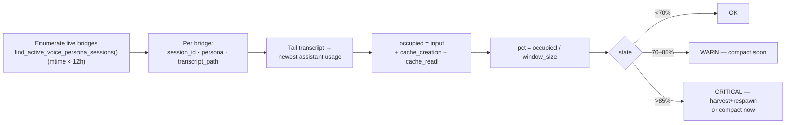

# Context-Pressure Logic — Validation Brief (for local-expert review)

**Date:** 2026-06-08 · **Author:** Rachel 🕊️ (session 6fc52b2e) · **Status:** FOR EXPERT VALIDATION — no build until logic is blessed
**Companion docs (same directory):**
- Proposal: [`2026.06.07-fleet-context-pressure-assessment.md`](2026.06.07-fleet-context-pressure-assessment.md)
- Source R&D: [`2026.06.07-managing-context-memory.md`](2026.06.07-managing-context-memory.md)
- Ephemeral plan (claude-plans scope): `~/.claude/plans/rustling-knitting-mccarthy.md`

---

## 0. What we want from you (the expert)

We intend to compute, **out-of-band**, the approximate **context-window pressure** of every
Claude Code worker in the fleet, and we want you to **validate the logic before we build it**.
There are exactly **two claims** that carry the whole design. If either is wrong, the utility
is wrong. Please scrutinize §3 (the occupancy formula) and §5 (the assumptions) hardest — the
rest is plumbing.

> **One framing caveat up front:** "memory pressure" here means **LLM context-window
> occupancy** (how full each Claude session's prompt window is), **NOT** host/OS RAM on the
> cloud VM. They are unrelated. A worker can sit at 5% RSS on the box while its 1M-token
> context window is 90% full and about to autocompact. The window is what silently degrades a
> worker mid-task, so the window is what we measure.

---

## 1. TL;DR

- Each Claude Code worker is a **tmux-driven `claude` CLI process** that writes a **JSONL
  transcript**. Every assistant turn in that transcript carries a `usage` dict.
- **Claim A (occupancy):** the last assistant turn's
  `input_tokens + cache_creation_input_tokens + cache_read_input_tokens`
  **= the prompt size sent that turn = current context-window occupancy** (the number
  `/context` reports as `totalTokens`). `output_tokens` is **excluded**.
- **Claim B (denominator):** `pct = occupied / window_size`, where `window_size` is the model's
  context window — **1,000,000** for our `[1m]`-beta fleet, **200,000** otherwise.
- We distinguish one Claude instance from another via the **session bridge file**, which keys a
  worker by Claude `session_id` (+ human-readable voice persona) and points at its
  `transcript_path`. Liveness is an **mtime-freshness** test.

If Claims A and B hold, the rest (thresholds, recommendations, CLI table) is trivial bookkeeping.

---

## 2. Environment / topology (the facts the logic rests on)

| Fact | Value | Source |
|---|---|---|
| Worker process model | tmux-driven `claude` **CLI**, not an SDK client | `session_spawner.py` → `start-cc-with-tmux.sh` |
| Per-worker bridge file | `~/.claude/sessions/cc-{ppid}.json` | live, verified |
| Bridge keys (relevant) | `session_id`, `stable_session_id`, `transcript_path`, `tmux_session`, `voice_persona`, `cwd`, `ppid`, `listener_pid` | live bridge dump |
| Transcript format | JSONL, one object per message; assistant objects carry `message.usage` | live, verified |
| `usage` token fields | `input_tokens`, `cache_creation_input_tokens`, `cache_read_input_tokens`, `output_tokens` (+ non-token extras) | live, verified |
| Fleet enumerator | `find_active_voice_persona_sessions(stale_threshold_seconds=43200)` | `session_bridge.py:1509` |

**Why not the SDK's `get_context_usage()`?** That method exists but lives on a *live
`ClaudeSDKClient`*. Our workers are CLI processes — nothing holds a client handle to them, and
nothing in the codebase calls it. The transcript-parsing approach is the only one that reaches
the whole tmux-CLI fleet out-of-band. (The source R&D doc reached the SDK conclusion; this brief
is the corrected, fleet-applicable pivot.)

---

## 3. The occupancy calculation (Claim A — validate this first)

```
occupied_tokens = last_assistant.usage.input_tokens
                + last_assistant.usage.cache_creation_input_tokens
                + last_assistant.usage.cache_read_input_tokens
                                                    # output_tokens deliberately EXCLUDED
```

**Rationale we're asking you to confirm or refute:**

The prompt sent on any turn **is** the entire context window content at that instant — system
prompt + tool defs + memory/CLAUDE.md + full conversation history. With prompt caching, the API
splits that one prompt across three billing buckets:

- `cache_read_input_tokens` — the already-cached prefix (the bulk on a warm turn),
- `cache_creation_input_tokens` — the slice newly written to cache this turn,
- `input_tokens` — the uncached remainder.

These three are **mutually exclusive partitions of the same prompt**, so their **sum is
cache-split-invariant**: whether the cache is hot or cold, the total equals the prompt size =
occupancy. `output_tokens` is the *generation*, which is not yet context (it folds into the
*next* turn's input), so we exclude it.

**Worked example (live):**

| Source | input | cache_creation | cache_read | **occupied** | output (excl.) |
|---|---|---|---|---|---|
| María's session, 2026-06-07 | 1,350 | 1,032 | 457,280 | **459,662** | — |
| Live worker, 2026-06-08 | 2 | 655 | 138,241 | **138,898** | 454 |

459,662 / 1,000,000 = **~46%**. 138,898 / 1,000,000 = **~13.9%**.

---

## 4. Distinguishing one Claude instance from another (the identity logic)

Each worker = one bridge file. We resolve a stable identity tuple per instance:

| Dimension | Field | Role |
|---|---|---|
| **Canonical key** | `stable_session_id` (falls back to `session_id`) | survives `/clear`; the join key |
| **Human disambiguator** | `voice_persona.name` (Rachel, Tiberius, María…) | what people/managers call it |
| **Host binding** | `tmux_session`, `ppid`, `cwd` | which process/pane on which box |
| **Data source** | `transcript_path` | the JSONL we read occupancy from |

**Liveness (validate this too):** `find_active_voice_persona_sessions()` admits a bridge only if
its file mtime is within `stale_threshold_seconds` (currently **43,200 s = 12 h**). A **phantom**
— a dead host process whose bridge file lingers — would otherwise yield a *stale* transcript and a
meaningless pressure reading. **Open question:** is mtime-freshness a sufficient liveness test, or
should we additionally confirm the `ppid`/`listener_pid` is alive before trusting a reading?



---

## 5. The assumptions most likely to be wrong (please attack these)

| # | Assumption | Why it might fail | What we'd do if you reject it |
|---|---|---|---|
| **A1** | Sum of the 3 input buckets = `/context` totalTokens | If the API's input accounting omits some prompt component (rare, but unverified against `/context` side-by-side) | Calibrate once against a live `/context` dump; apply a correction factor or switch source |
| **A2** | `output_tokens` should be excluded | The prior turn's output *is* in the next turn's input — so a one-turn lag exists | Accept the one-turn lag (negligible for a 30–60s tick) or add last output to the estimate |
| **A3** | **Denominator = 1M for the fleet** (heuristic: occupancy >200k ⇒ on `[1m]` window) | A worker on a **200k** window at 138k reads **13.9%** (false-OK) when it's really **~69%** (CRITICAL). This is the **weakest link.** | Read model id + beta flag authoritatively, or pin window-size per worker in config |
| **A4** | Divide by the **raw** window (1M) | `/context` uses an **effective** ceiling reduced by an **autocompact reserve** (`maxTokens` < `rawMaxTokens`). Thresholds tuned to raw will trip late | Divide by the effective ceiling; re-tune 70/85 against it |
| **A5** | Newest assistant turn is fresh enough | If a worker is mid-turn or idle, the reading is the last *completed* turn | Acceptable for a health check; flag `last_turn_ts` so consumers see staleness |

---

## 6. Cloud / multi-instance wrinkle (GCP deployment)

This branch is `…preparing-for-gcp-deployment`. The logic above reads **local-disk** bridge files
and transcripts. On a **single host** that's complete. In a **multi-VM cloud fleet**, each
instance's transcripts live on **its own local disk** — a central arbiter cannot read a peer
VM's files without either (a) shared storage (GCS-FUSE / NFS) or (b) a **per-instance sidecar**
that assesses its local workers and reports a small JSON summary upward.

**Open question for you:** should context-pressure assessment be **per-instance-local** (each VM
judges its own workers, arbiter aggregates summaries) or **centralized** (shared transcript
storage)? This shapes whether the utility is a pure local leaf or grows a transport.

---

## 7. Reproducer (read a live worker's occupancy, no dependencies)

```python
import json, glob, os
bridge = sorted( glob.glob( os.path.expanduser( "~/.claude/sessions/cc-*.json" ) ),
                 key=os.path.getmtime, reverse=True )[ 0 ]
tp = json.load( open( bridge ) )[ "transcript_path" ]
last = None
for line in open( tp ):
    try: o = json.loads( line )
    except: continue
    m = o.get( "message", {} )
    if m.get( "role" ) == "assistant" and isinstance( m.get( "usage" ), dict ): last = m[ "usage" ]
occupied = last[ "input_tokens" ] + last[ "cache_creation_input_tokens" ] + last[ "cache_read_input_tokens" ]
print( f"occupied = {occupied:,} tokens  ({occupied/1_000_000:.1%} of a 1M window)" )
```

---

## 8. The one question that gates the build

> **Is `occupied = input + cache_creation + cache_read` of the last assistant turn an accurate
> stand-in for `/context` total occupancy — and is a 1M denominator safe for our fleet, or must
> we read the true window size per worker?**

If you bless A1 + A3 (with whatever correction you prescribe), we build Phase 1 (the pure-logic
leaf in `heartbeat_arbiter`) exactly as proposed. If you reject either, we adjust the source or
the denominator first.
