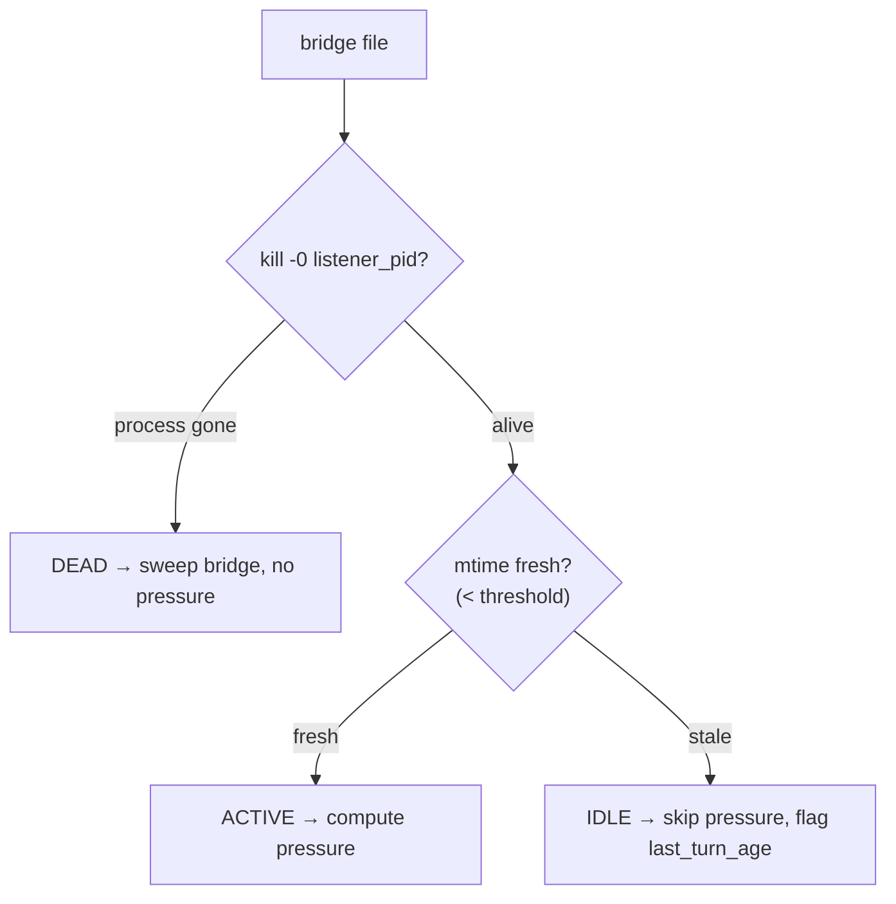

# Revised Plan — Fleet Context-Pressure Assessment Utility (post-expert-review)

**Date:** 2026-06-08 · **Author:** Rachel 🕊️ (session 6fc52b2e) · **Status:** REVISED PLAN — awaiting Rick's go-ahead
**Supersedes:** [`2026.06.07-fleet-context-pressure-assessment.md`](2026.06.07-fleet-context-pressure-assessment.md) (Clayton's original proposal)
**Driven by expert review:** [`2026.06.08-context-pressure-logic-validation-brief-response.md`](2026.06.08-context-pressure-logic-validation-brief-response.md)
**Brief it answers:** [`2026.06.08-context-pressure-logic-validation-brief.md`](2026.06.08-context-pressure-logic-validation-brief.md)

---

## 0. What this plan is

The validation brief went out, an expert (Claude Opus 4.7) reviewed it, and the verdict is:
**the core formula is sound, but three corrections and one new measurement are required before the
metric is honest.** This plan folds every accepted correction into a buildable Phase-1 spec. All
claims below were re-verified against a **live** worker transcript + bridge file on 2026-06-08
(receipts in §2/§5).

> **Placement (settled, Tiberius's architectural call):** `context_pressure.py` is a **pure leaf**
> in `src/cosa/agents/heartbeat_arbiter/` — the shared engine both arbiter hosts import from. Its
> Phase-2 consumer is the standalone host, now **renamed `src/lupin_arbiter_app/`** (was
> `arbiter_vigilance`; rename in flight this session). The leaf must NOT import up into any host /
> `cosa.rest` / HTTP layer. See [[2026.06.08-rename-lupin-app-and-lupin-arbiter-app]].

---

## 1. Expert verdict → change log

| Brief assumption | Expert verdict | Change in this plan |
|---|---|---|
| **A1** formula `= input + cache_creation + cache_read` | ✅ **Bless** + harden | Keep, but guard format drift (§3) |
| **A2** exclude `output_tokens` | ❌ **Revise — include it** | Pressure rides `next_prompt_estimate` (§2) |
| **NEW** pending msgs since last assistant turn | ⚠️ **The one to lose sleep over** | Add `pending_input_estimate` scan (§2) |
| **A3** denominator (1M heuristic) | ❌ **Bless my rejection** — pin in bridge | `window_size` pinned at spawn (§4) |
| **A4** raw vs effective ceiling | ❌ **Bless my rejection** — effective | Divide by calibrated effective ceiling (§4) |
| **A5** last-turn freshness | ✅ Acceptable + surface staleness | Expose `last_turn_age`, `pending_input_estimate` (§2) |
| **Liveness** mtime-only | ❌ Wrong both directions | 3-state ACTIVE/IDLE/DEAD + `kill -0` (§5) |
| **Cloud** local vs shared FS | per-VM **sidecar**, not shared FS | Topology reframed (§7) |

---

## 2. Revised occupancy model (the heart of the change)

The brief measured **one** number (last prompt size). The expert showed that a *pressure* metric —
one whose job is to fire WARN/CRITICAL **before** degradation — must measure the prompt the worker is
**about to send**, not the one it last sent. Three quantities, computed per worker:

```
last_prompt_size      = input_tokens + cache_creation_input_tokens + cache_read_input_tokens   # A1, blessed
pending_input_estimate = Σ  ceil(len(content)/4)  for every message AFTER the last assistant turn   # NEW
next_prompt_estimate  = last_prompt_size + last_output_tokens + pending_input_estimate            # the pressure number
```

- **`last_output_tokens`** (A2 fix): the model's last response is now in message history and rides the
  next input. At the red line this is the WARN↔CRITICAL swing — a worker at 84% who just emitted a 30k
  Opus+thinking response is really ~87% going in.
- **`pending_input_estimate`** (the unsurfaced gap): between assistant turns, tool_results (multi-KB
  `view`/`bash` stdout) and user messages accumulate, invisible to A1. A CC subagent can read 60%, sit
  on 40k of unread `view` output, and jump to 90% the instant the next turn fires. The `len/4`
  Latin-char heuristic is deliberately conservative and **stays pure** (stdlib only); optional
  `anthropic.tokenizer` fidelity is a later, non-leaf concern.

**`ContextPressure` dataclass (Phase-1 return shape):**

| Field | Meaning |
|---|---|
| `last_prompt_size` | authoritative A1 sum (the number you can defend exactly) |
| `last_output_tokens` | last assistant `output_tokens` |
| `pending_input_estimate` | conservative est. of unread tool/user input since last assistant turn |
| `next_prompt_estimate` | `occupied` — the value thresholds ride |
| `window_size` | from the **bridge**, not inferred (§4) |
| `effective_ceiling` | `window_size − autocompact_reserve − max_response_tokens` (§4) |
| `pct` | `next_prompt_estimate / effective_ceiling` |
| `state` | `OK / WARN / CRITICAL / UNKNOWN` |
| `model` | from assistant msg (`claude-opus-4-8`, live-verified) — cross-check for window |
| `last_turn_ts`, `last_turn_age` | staleness surfacing (A5) |
| `liveness` | `ACTIVE / IDLE / DEAD` (§5) |

Consumers that want the strict original semantics still read `last_prompt_size`; the pressure
state rides `next_prompt_estimate`.

---

## 3. Parser hardening (A1 format-drift — all live-verified today)

The live `usage` object on our fleet **already** carries the drift hazards the expert named:

```json
"cache_creation_input_tokens": 655,
"cache_creation": { "ephemeral_1h_input_tokens": 842, "ephemeral_5m_input_tokens": 0 },
"server_tool_use": { "web_search_requests": 0, "web_fetch_requests": 0 }
```

`read_last_usage()` must therefore:
1. **Nested-dict fallback** — if the flat `cache_creation_input_tokens` is ever absent/`None`, fall back
   to `sum(usage["cache_creation"].values())`. Cheap insurance against a future flat-field deprecation.
2. **Explicitly ignore `server_tool_use`** — those tokens are consumed server-side, not in the context
   window. Ignore them *deliberately* (with a comment), not incidentally.
3. **None-guard the cold worker** — a transcript with **no assistant turn yet** (fresh spawn /
   post-`/clear`) → `read_last_usage` returns `None` → `assess_context_pressure` returns `state=UNKNOWN`,
   never crashes on the addition.
4. **Count parse failures** — don't bare-`except`-swallow malformed JSONL; tally `parse_failures` (a
   leading indicator of concurrent-write transcript corruption) and expose it.

---

## 4. Window size — bridge-pinned, effective ceiling (A3 + A4)

**A3 — pin, don't infer.** The `[1m]` window is gated by the `context-1m-2025-08-07` beta header on the
*request*, which never appears in the assistant response. A 1M worker at 138k and a 200k worker at 138k
are **identical from the transcript** — and the 200k one is on fire. So:

- **One-line `session_spawner.py` change**: write `"window_size": 1000000` into the bridge JSON at spawn,
  next to `persona`/`tmux_session`. (Live-verified: the bridge has **no** `window_size` key today.)
- `assess_context_pressure` reads `window_size` from the bridge; `model` field is a cross-check only.
- The Path-2 heuristic ("occupancy >200k ⇒ 1M") is **explicitly rejected** — never ship it.

**A4 — divide by the effective ceiling.** `/context` reports against
`effective = rawMaxTokens − autocompact_reserve − max_response_tokens`, not raw. Dividing by raw makes
85% fire late (autocompact may already have bitten). So:

- `effective_ceiling = window_size − cfg(autocompact reserve tokens) − cfg(max response tokens)`.
- **Calibrate once**: capture a live `/context` dump from a known-state worker and tune the reserve to
  match. The expert cites ~45k reserve for 200k windows historically but says measure, don't trust a
  number. → A Phase-1 calibration step (§12), config-driven so it's tunable without code.

---

## 5. Liveness — three-state, `kill -0` AND-gate

mtime alone is wrong **both** directions (live-verified the bridge carries `listener_pid`, e.g. 12992):

- healthy-but-idle worker → stale mtime → **false-dead**;
- hung worker with side-effecting hooks still touching files → fresh mtime → **false-alive**.



The semantics we actually want: *"is there a process that will produce the next assistant turn?"* —
which is exactly `kill -0 listener_pid`. For phantoms, a dead `listener_pid` is the definitive signal.

---

## 6. Phase-1 module API (pure leaf — `heartbeat_arbiter/context_pressure.py`)

```
read_last_usage(transcript_path)            -> Usage | None        # tail-read newest assistant usage; drift-hardened
estimate_pending_input(transcript_path)     -> int                 # Σ ceil(len(content)/4) after last assistant turn
assess_context_pressure(transcript_path, *, window_size, reserve, max_response, model=None)
                                            -> ContextPressure      # the §2 dataclass; UNKNOWN on cold worker
assess_fleet_context_pressure()             -> list[WorkerContextPressure]
                                            # enumerate live bridges → liveness gate (§5) → per-worker assess
                                            # attaches session_id, persona, tmux_session, window_size, liveness, recommendation
```

- **Purity guardrail**: stdlib (+ maybe `fleet_data_model`) only. No imports up into `lupin_arbiter_app`,
  `cosa.rest`, or HTTP. Keeps both the in-process host and the standalone host able to consume it.
- **On-the-fly entry point**: `quick_smoke_test()` / `python -m cosa.agents.heartbeat_arbiter.context_pressure`
  prints the live fleet table (persona · pct · state · liveness · pending-est · rec).

---

## 7. Cloud topology — per-VM sidecar, not shared FS (§6 of brief)

Expert: "not a close call." Shared transcript storage (GCS-FUSE/NFS) buys read latency ×fleet,
eventual-consistency hazards (half-written JSONL during a hot write), fate-sharing (lose the mount →
lose visibility for *every* VM), and egress on a 30–60s poll.

**Adopted shape:** each VM runs a sidecar that assesses its **local** workers and emits a ~200-byte JSON
summary per worker — `{persona, session_id, occupied, pct, state, pending_estimate, last_turn_age, liveness}`
— over pub/sub or a thin HTTP endpoint. The arbiter **aggregates summaries**; the hot path never crosses
shared FS. 1000 workers ≈ <1 MB/tick. Post-mortem forensics (arbiter reading a peer's full transcript)
is solved separately by **on-demand transcript shipping on arbiter request**, never on the hot path.

This reframes **Phase 2**: not "arbiter reaches across to read files" but "arbiter aggregates
sidecar-emitted summaries." Phase 1 (the pure leaf) is exactly what each sidecar calls locally — unchanged.

---

## 8. Config (add to `lupin-app.ini` + matching `lupin-app-splainer.ini`)

```
arbiter context watch enabled              = true
arbiter context default window tokens      = 1000000     # fallback only; bridge window_size wins
arbiter context autocompact reserve tokens = 45000       # CALIBRATE against live /context (§4/§12)
arbiter context max response tokens        = 32000       # subtracted from effective ceiling
arbiter context warn threshold pct         = 70
arbiter context critical threshold pct     = 85          # rides next_prompt_estimate / effective ceiling
arbiter context idle mtime seconds         = 1800        # ACTIVE vs IDLE boundary (§5)
arbiter context harvest decision topic     = context-harvest-decision
arbiter context auto handle                = false       # Phase 3 gate
```

---

## 9. Revised phasing

| Phase | Scope | Gate |
|---|---|---|
| **P1** | Pure-leaf `context_pressure.py` with the §2 three-number model, §3 hardening, §4 bridge-pinned window + effective ceiling, §5 three-state liveness, on-the-fly CLI table. **+ the one-line `session_spawner.py` `window_size` pin.** 100% line+branch+function. | Reviewer → Rick |
| **P1-cal** | One-shot **calibration**: capture live `/context` from a known worker, tune `autocompact reserve tokens` so `pct` matches `/context` percentage. | Rick sees the calibrated delta |
| **P2** | Per-VM **sidecar** emits summaries; arbiter (`lupin_arbiter_app`) **aggregates** + surfaces in `/state` + `/api/arbiter/fleet-state`; CRITICAL → decision topic + `notify()`. Sensor-only. | Reviewer → Rick |
| **P3** *(gated, default OFF)* | Behind `arbiter context auto handle`: manager one-click compact (`/compact` tmux inject) or harvest+respawn-with-memento. | Explicit Rick opt-in |

---

## 10. Files

- NEW `src/cosa/agents/heartbeat_arbiter/context_pressure.py` (P1, pure leaf)
- NEW `src/tests/unit/.../test_context_pressure.py` (P1, 100% cov)
- EDIT `src/lupin_mcp/session_spawner.py` (P1 — one-line `window_size` bridge pin)
- EDIT `src/conf/lupin-app.ini` + `src/conf/lupin-app-splainer.ini` (P1 config keys)
- NEW sidecar surface under `src/lupin_arbiter_app/` (P2) + EDIT `loop_b.py` / `local_snapshot_store.py` /
  `app.py` (aggregation), `src/cosa/rest/routers/arbiter.py` (reverse-proxy passthrough) — **post-rename names**
- REUSE `session_bridge.py` (`find_active_voice_persona_sessions`, `listener_pid`, `transcript_path`)
- REUSE (P3) `session_spawner.py` `dismiss_sessions`/`spawn_sessions`/memento; `cc_notification_listener.py` tmux inject

---

## 11. Verification (100% coverage mandate — lines + branches + functions)

**Unit fixtures (synthetic transcripts + bridges):**
- A1 sum correctness; **nested `cache_creation` fallback** (flat field removed); **`server_tool_use` ignored**.
- A2: `output_tokens` included in `next_prompt_estimate`, excluded from `last_prompt_size`.
- **Pending-input**: tool_results + user msgs after last assistant turn → non-zero `pending_input_estimate`;
  the "60% looks stable, +40k pending" scenario asserted explicitly.
- **Cold worker** (no assistant turn) → `state=UNKNOWN`, no crash.
- **Parse-failure counting** on malformed JSONL lines.
- A3: bridge `window_size` honored; missing key → documented fallback. A4: effective-ceiling math.
- **Liveness**: `kill -0` alive+fresh→ACTIVE; alive+stale→IDLE; dead pid→DEAD (mock the pid probe).
- Tail-read correctness on partial/short files.

**On-the-fly E2E (read-only, `:7999`-safe):** run the CLI table against LIVE bridges; reproduce a real
worker's pressure (e.g. the live 138,898-token reading captured today). No state mutation.

**P1-cal:** assert calibrated `pct` is within tolerance of a captured live `/context` percentage.

**P2/P3:** sidecar-summary unit tests; `:8000` integration that `/state` exposes the aggregated section;
P3 handling tested with a throwaway spawned worker.

---

## 12. Decisions (RULED 2026-06-08, Rick via guided walkthrough — all per recommendation)

| # | Decision | Ruling | Why |
|---|---|---|---|
| 1 | **Scope** | **P1 + `session_spawner.py` window-pin + calibration, then STOP for review** before P2 sidecar | Smallest *honest* reviewable unit; pin + calibration are prerequisites for trustworthy numbers |
| 2 | **Pressure semantics** | Thresholds ride **`next_prompt_estimate`** (last_prompt + last_output + pending_input) | Fires *before* degradation; `last_prompt_size` still exposed as the auditable number |
| 3 | **Thresholds** | **Keep 70 / 85** against the **effective** ceiling; recheck after calibration | 85% sits ~7pts below ~92% autocompact once we divide by the effective ceiling |
| 4 | **Pending-input fidelity** | **Zero-dep `len/4` heuristic** (pure leaf); tokenizer deferred to a later non-leaf pass | Conservative-high estimate is enough for a health alarm; preserves the purity guardrail |
| 5 | **Calibration** | **YES — capture one live `/context` dump** to tune the autocompact reserve | Read-only; makes the effective ceiling real, not a guessed 45k |

**Status:** ruling on Decision 1 = **GO for Phase 1 implementation** (this scope only; stop for Rick's review before P2). Build authorized 2026-06-08.

---

## 13. Calibration outcome (Decision 5 — RESOLVED 2026-06-08)

**Ground truth** — Rick ran `/context` in **María's** session (Tiberius relayed):
total **218.3k / 1M = 22%**; free **781.2k (78.1%)**; categories: system prompt 2.7k, system tools
12.8k, MCP tools 3.9k, memory 22.4k, skills 3.1k, messages 173.8k. **used + free ≈ a flat 1M.**

**Two findings:**

1. **Claim A validated to ~0.2%.** The leaf read María's occupied at ~218.8k vs `/context`'s 218.3k —
   the 3-field sum (`input + cache_creation + cache_read`) is an accurate `/context`-total stand-in.

2. **A4 REFUTED by measurement.** The expert assumed `/context`'s percentage is against an *effective*
   ceiling (raw − autocompact reserve − max_response). Ground truth shows used + free ≈ a flat 1M, so
   **`/context`'s percentage is against the RAW window.** Calibration result: divide pct by the **raw**
   window (matches what an operator sees in `/context`). The autocompact reserve / max-response knobs are
   kept configurable at **0** for a future "autocompact-imminent" overlay flag — they no longer reduce the
   pct ceiling. This *refines* Decision 3's "recheck after calibration" clause: thresholds 70/85 now ride
   **raw**; CRITICAL 85% (850k of 1M) still sits safely below where autocompact fires near the top.

**Code/config landed:** `DEFAULT_RESERVE_TOKENS`/`DEFAULT_MAX_RESPONSE_TOKENS` → 0 (calibration note in
source); `arbiter context autocompact reserve tokens` / `max response tokens` → 0 in `lupin-app.ini` +
rewritten splainer entries.

---

## 14. Phase 1 — COMPLETE (2026-06-08)

| Item | Status |
|---|---|
| `src/cosa/agents/heartbeat_arbiter/context_pressure.py` (pure leaf) | ✅ **100% line+branch** (213 stmts / 60 branches / 0 miss) |
| `src/lupin_cli/claude_code/hooks/register_session.py` window-pin | ✅ `_resolve_window_tokens` (+4 tests; existing 11 green) — *corrected from the plan's `session_spawner.py` guess; it's the live SessionStart hook, edit is strictly defensive* |
| `src/conf/lupin-app.ini` + splainer (7 keys) | ✅ calibrated |
| `src/tests/unit/test_context_pressure.py` (38) + register_session (+4) | ✅ **53 pass, both file orderings** |
| Calibration (Decision 5) | ✅ resolved — see §13 |

**Verified:** import chains clean; `py_compile` OK; live read-only smoke reproduces real fleet pressure
and the 3-state liveness (workers observed flipping ACTIVE→IDLE in the wild). **Nothing committed** — awaiting
Rick's review (no auto-commit). P2 (sidecar / `lupin_arbiter_app` wiring) remains behind Rick's review gate.
