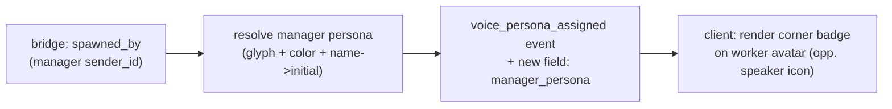

# Worker→Manager Focus-Bar Badge — Design

**Date:** 2026-06-08 (evening) · **Author:** Rachel 🕊️ (session 6fc52b2e) · **Requested by:** Rick
**Status:** DESIGN — awaiting Rick's build-go
**Surface:** notifications UI focus bar · **Scope:** plumbing + render + CSS (no new infrastructure)

---

## 1. Goal

Let the operator see, at a glance in the focus bar, **which manager spawned each live worker** — the
fleet's reporting lineage made visible. A small badge superimposed on the worker's persona avatar,
carrying the **manager's persona glyph + color + initial**, positioned **180° opposite the existing
speaker icon** so the two corner marks never collide.

Rick's framing (verbatim intent): *"marking the worker persona's badge in the focus bar, superimposing
a small 'T' bubble 180° opposite the little speaker icon that shows who created the worker"* — refined
to **glyph + color + initial** together (Rick, 2026-06-08), and with **more breathing room** around and
between badges and inside the focus bar (Rick, 2026-06-08).

## 2. Relationship visualized

**Spawn lineage** (who-created-whom), NOT live message flow. Each worker has exactly one creator, set
once at spawn → the badge is **static** (no live-update machinery). This is the lowest-build, highest-
clarity option from the 2026-06-08 scoping discussion.

## 3. Data source — already captured

The creator is already persisted on the worker's bridge:

- `src/lupin_cli/claude_code/hooks/register_session.py:818-820` —
  `session_data["spawned_by"] = os.environ.get( "COSA_VOICE_SPAWNED_BY" )`
  (set by the spawn path; from the 2026-05-28 manager-spawned-reviewers work).

**No new capture is needed.** `spawned_by` holds the manager's identity (sender_id / persona name).

## 4. The gap — `spawned_by` does NOT reach the client

Grep-confirmed (2026-06-08): `spawned_by` appears **only** in `register_session.py`. It is absent from
every server event payload and all client JS. So the **required plumbing**:

## 5. Design

### 5a. Server — surface + resolve (new)
- Where: `src/cosa/rest/routers/voice_persona.py` (the `voice_persona_assigned` notification is built at
  ~:343-350; payload already carries the worker's `voice_persona` dict).
- Add: read the worker's bridge `spawned_by` → resolve the **manager's** persona from the same persona
  registry that fills `voice_persona` (icon/glyph, color, name) → derive the **initial** from the name →
  attach a new **`manager_persona`** field (`{ icon, color, name, initial }` or `null`) to the event.
- `spawned_by` absent (top-level session / a root manager) → `manager_persona = null`.

### 5b. Client — render the corner badge (new)
- Where: `src/lupin_app/static/js/notifications.js` — the persona-badge builder `_buildPersonaBadgeHTML`
  (~:9204-9242) and `_setPersonaBadgeOnCard` (~:9261); the focus-bar strip badge added on
  `voice_persona_assigned` (~:5627-5647).
- When `manager_persona` is present, superimpose a small **`.manager-badge`** corner element on the
  worker's persona avatar: the manager's **glyph**, tinted with the manager's **color**, with the
  **initial** (glyph + color + initial together, per Rick). Positioned at the corner **180° opposite the
  speaker icon** (🔊/🤭 indicator, ~:11315/11826).
- `manager_persona == null` → no badge (clean default).

### 5c. CSS — breathing room (Rick's ask) + the new badge
- Increase the **gap between persona badges** and the **internal padding of the focus bar** so the marks
  aren't cramped and the new corner badge has room.
- `.manager-badge`: small (sub-avatar) absolutely-positioned corner mark, manager-color background/ring,
  glyph + initial; opposite corner from the speaker icon.
- **Collision check (build-time):** confirm nothing already occupies that opposite corner (reap badge /
  status dot / unread count) before placing it.

## 6. Edge cases
- **No manager** (top-level / root): no badge.
- **Manager-of-manager:** the badge shows the *direct* spawner only (one hop), not the full chain.
- **Reaped worker:** focus-bar strip already drops on reap (2026-06-05 reap-event work) → badge goes with it.
- **Same-initial managers:** disambiguated by glyph + color (why we don't rely on the letter alone).

## 7. Testing plan
- **Unit (server):** manager-persona resolution — `spawned_by` present → correct `{icon,color,name,initial}`;
  absent → `null`; unknown/stale spawner → graceful `null` (fail-safe, never raises in the event path).
- **Unit/JS:** badge HTML built only when `manager_persona` present; omitted when null.
- **E2E UI + visual regression (:8000):** focus bar with a spawned worker shows the manager corner badge
  opposite the speaker icon; top-level session shows none; snapshot the new spacing. (Visual diff is the
  right tool for the "breathing room" + corner-placement intent.)

## 8. Open / refinements for Rick
- Exact badge size + the spacing deltas (px) — propose at build, confirm via the visual snapshot.
- Initial = first letter of the manager's persona name (e.g. Tiberius → "T")? Confirm casing/multi-word.
- README index link for this doc is **deferred**: `src/rnd/README.md` is currently co-edited with Tiberius
  (uncommitted) — adding it now would compound that conflict. Link lands when the README co-edit resolves.

> Build remains **paused** pending Rick's go. Design-before-build per the workflow; this is Phase 0.
