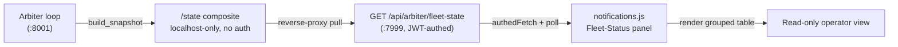

# Fleet-Status Table in the Notifications Client — Design

**Date**: 2026.06.09
**Author**: Rio ⚡ (session `110ff47d`), with Rick
**Status**: 🟡 Design — awaiting Rick's go-ahead to implement
**Lineage**: heartbeat-arbiter visibility (`src/rnd/v0.1.8/2026.06.04-heartbeat-hook/03-arbiter-design.md` §10 "direct-state visibility")
**Companion (yesterday)**: Rachel's arbiter-determination consumption work — this is the **belt-and-suspenders** read-only operator view that sits alongside it.

---

## 1. Goal (Rick's ask, verbatim intent)

> "Design a proxy for me that consumes `/api/state` and displays current status in
> table format for all workers and their managers. Table should also display
> hierarchy — who manages whom, who reports to whom. Add this to the notifications.js
> client. The output from `/api/state` is voluminous; I need only the essentials for
> now, **read-only**."

A read-only fleet-status panel in the notifications client showing every active
session (worker or manager), the **essentials only**, **grouped by hierarchy**
(workers nested under their managers).

---

## 2. Decision record

| # | Decision | Resolution | Date |
|---|----------|-----------|------|
| D1 | Hierarchy approach | **Option A — enrich the endpoint server-side + group in the client** (chosen by Rick via ask_multiple_choice, 2026-06-09) | locked |
| D2 | Read/write posture | **Read-only.** No actions, no buttons that mutate fleet state. Pure observability. | locked |
| D3 | "Essentials" projection | **Six columns** (§5): Who · Role · State · Holding-on · Stuck · Liveness verdict. Raw 4 ages → hover tooltip. | locked |
| D4 | Refresh + timestamp | **60s auto-poll** + **manual refresh button**; show **last-updated `HH:MM:SS TZ`** (e.g. `14:32:07 EDT`). Timezone read **at runtime** from config key `app timezone` (currently `America/New_York`), formatted client-side via `Intl.DateTimeFormat` (DST-aware). NOT hardcoded. | locked |
| D5 | Container-health block | **Omit from v1** (sessions only). Optional summary strip is a fast-follow. | locked |

All of D1–D5 are **locked** (D3–D5 decided by Rick via the 3-step walkthrough, 2026-06-09).

---

## 3. Data source & flow

The browser **cannot** reach the authoritative `/state` directly: it lives on the
standalone arbiter app at **`:8001/state`** — localhost-only (R3) and **unauthenticated**.

The main `:7999` server already exposes a **JWT-authed reverse-proxy** that pulls
`:8001/state` and returns its body verbatim:

- `GET /api/arbiter/fleet-state` — `src/cosa/rest/routers/arbiter.py:120-162`
  - Auth: `X-API-Key` **or** `Bearer JWT` (`require_api_key_or_jwt`)
  - On upstream failure → HTTP 200 with `{ status: "unreachable", health_watcher: null, fleet_arbiter: null }` (never 5xx, never hangs)



**Consequence**: notifications.js fetches `/api/arbiter/fleet-state` via its existing
`authedFetch()` helper. **No new backend proxy** is needed for transport — the
enrichment (§4) rides the existing snapshot.

### Current payload shape (relevant slice)

```jsonc
{
  "status": "ok",
  "health_watcher": { "containers": { ... }, "blind": false, "updated_at": "..." },
  "fleet_arbiter": {
    "generated_at": "<iso>",
    "session_count": 5,
    "sessions": [
      {
        "session_id": "d9e65cd8",
        "persona": "Tiberius",
        "state": "working",
        "holding_on": "none",
        "stuck": false,
        "liveness": {
          "bridge_age_s": 4, "event_age_s": 2100, "commons_age_s": null,
          "idle_prompt_age_s": null, "freshest_age_s": 4, "verdict": "LIVE"
        }
      }
    ]
  }
}
```

Rows are **flat** — no manager linkage today. That is the gap §4 closes.

---

## 4. Backend enrichment (Option A) — `manager` + `role` per session

Hierarchy data already exists; it is computed server-side **for routing** but not
surfaced in the snapshot:

- `manager_resolver.resolve_manager( worker_session_id )` →
  `{ manager_session_id, manager_persona, source ∈ {lineage, declared, unresolved} }`
  (`src/cosa/agents/heartbeat_arbiter/manager_resolver.py:217-265`)
- `manager_resolver.list_manager_session_ids()` → set of session-ids that spawned ≥1
  child (own a `spawned-<id>.json` manifest) — i.e. the **managers** (`:107-134`)

### Insertion point

The `:7999` endpoint is a **verbatim** proxy, so enrichment must happen at the
**snapshot-build site** so both `:8001/state` and its `:7999` mirror carry it:

- `fleet_render.build_snapshot()` (`src/cosa/agents/heartbeat_arbiter/fleet_render.py:160-200`)
  is **pure**. Add an **injected resolver seam** — mirroring the existing
  `resolve_active_managers_fn` injection pattern in `arbiter_job.py:175-280` — so the
  pure function stays pure and 100%-testable with fakes.

### Enriched row (two new keys)

```python
rows.append( {
    "session_id" : sid,
    "persona"    : view.get( "persona" ),
    "state"      : view.get( "state" ),
    "holding_on" : view.get( "holding_on" ),
    "stuck"      : bool( view.get( "stuck" ) ),
    "liveness"   : liveness,
    "role"       : role,        # "manager" | "worker"  (NEW)
    "manager"    : manager,     # manager persona, or None for managers/top-level (NEW)
} )
```

- `role` = `"manager"` if `sid ∈ list_manager_session_ids()` else `"worker"`.
- `manager` = `resolve_manager( sid ).manager_persona` when `source == "lineage"`,
  else `None` (degrade-safe: we **never** show a guessed manager — `unresolved`/
  `declared` surface as an "unmanaged" group rather than a wrong parent).

### Degradation contract (carried from `resolve_manager`)

- Brittle/ambiguous lineage hop → `manager = None` → row lands in the **Unmanaged**
  group. **Never mis-parents a worker.** (Prefer unresolved over wrong — `manager_resolver` §multi-match + round-trip guards.)
- Whole resolver fails → all rows render flat under **Unmanaged**; table still works.

### 4.1 Timezone exposure (D4) — `app_timezone` on the `:7999` mirror

The client formats the last-updated timestamp in the **configured** zone, pulled at
runtime — never hardcoded. The IANA zone lives in config:

- `app timezone = America/New_York` — `src/conf/lupin-app.ini:516` (splainer at
  `lupin-app-splainer.ini:10`). DST-aware IANA name.

The browser can't read the INI, so the **`:7999` proxy** (`get_fleet_state`, which
already holds `get_config_manager()`) injects one top-level field into the otherwise-
verbatim composite it returns:

```python
result[ "app_timezone" ] = config_mgr.get( "app timezone", default="America/New_York" )
```

This is the ONLY deviation from verbatim-proxy and is `:7999`-local (no `:8001`
change). The client reads `composite.app_timezone` and feeds it to `Intl.DateTimeFormat`
(§6.2). If absent (older server / unreachable), the client falls back to the browser's
local zone — display-only, never blocks the table.

---

## 5. The "essentials" projection (drop the voluminous parts)

Default columns (everything else hidden):

| Column | Source field | Notes |
|--------|--------------|-------|
| **Who** | `persona` ‖ `session_id` | persona preferred; short sid fallback |
| **Role** | `role` | manager / worker (drives grouping + a small badge) |
| **State** | `state` | working / idle / stuck / unknown |
| **Holding on** | `holding_on` | "none" rendered as "—" |
| **Stuck** | `stuck` | ✓ / — (red when ✓) |
| **Liveness** | `liveness.verdict` (+ `freshest_age_s` tooltip) | LIVE / quiet Nm / stale Nm / offline |

**Dropped from default view** (the "voluminous" part):
- The 4 raw liveness ages (`bridge/event/commons/idle_prompt_age_s`) — fold into a hover tooltip on the Liveness cell.
- `health_watcher` container-health block — omit v1 (D5).
- `session_id` UUID, `generated_at`, flap counters — omit (sid shown only as fallback label).

---

## 6. Frontend — notifications.js panel

**Target**: `src/lupin_app/static/js/notifications.js` (`window.notificationsUI`),
HTML in `src/lupin_app/static/html/notifications.html`, CSS in
`src/lupin_app/static/css/notifications.css`.

### 6.1 HTML — taskbar icon + new collapsible section (placement locked by Rick 2026-06-09)

**Two anchors, both confirmed against the live HTML:**

**(a) Taskbar icon** — add a jump-icon to `#section-toolbar` (notifications.html:24),
mirroring the existing notifications button (`:38`):

```html
<button class="toolbar-btn" data-section="section-fleet-status"
        data-testid="fleet-status-toolbar-btn" title="Fleet Status">🛰️</button>
```
(Icon 🛰️ proposed — "watch the fleet"; trivially changeable. The `data-section`
wiring is what scrolls/activates the accordion, same as every other toolbar btn.)

**(b) Accordion** — insert `#section-fleet-status` as a `collapsible-section`
**immediately beneath `#section-notifications`** ("Claude Code Notifications",
`:615`) and **before `#section-queues`** (`:848`). Mirror the `section-time-saved`
structure (`:973`):

```html
<div class="collapsible-section" id="section-fleet-status">
  <h3>Fleet Status: <span id="fleet-status-count">0</span>
      <span id="fleet-status-updated"></span>           <!-- HH:MM:SS TZ -->
      <button id="fleet-status-refresh" title="Refresh now">⟳</button></h3>
  <div id="fleet-status-container"><!-- rendered grouped table --></div>
</div>
```

### 6.2 JS — fetch + render + poll

New methods on `NotificationsUI` (DbC docstrings, project style):

- `async fetchFleetState()` → `authedFetch( "/api/arbiter/fleet-state" )`; returns the
  parsed composite or an `{ status: "unreachable" }`-shaped object (already the
  endpoint's contract — no throw path for upstream-down).
- `groupFleetByManager( sessions )` → builds the hierarchy model (§7) — **pure**,
  unit-testable in isolation.
- `renderFleetStatusTable( model )` → template-literal → `innerHTML` (matches
  `renderJobCard` pattern). Managers as group headers; workers indented beneath;
  an **Unmanaged** group last.
- `startFleetStatusPolling()` / `stopFleetStatusPolling()` → `setInterval` **60s** (D4),
  guarded by a handle like the existing `tokenRefreshIntervalHandle` /
  `healthCheckIntervalHandle`. A **manual refresh button** triggers an immediate
  re-fetch (and is debounced against the interval).
- **Last-updated timestamp** (D4): on each successful fetch, stamp `new Date()` and
  render it as `HH:MM:SS TZ` (e.g. `14:32:07 EDT`) via
  `Intl.DateTimeFormat( undefined, { timeZone: <iana>, hour12: false, hour:"2-digit",
  minute:"2-digit", second:"2-digit", timeZoneName:"short" } )`. The `<iana>` zone
  comes from the server (§4.1) — **never hardcoded**; `Intl` resolves EDT/EST
  automatically with DST.

### 6.3 Read-only guarantee

No buttons that POST/PATCH/DELETE. The refresh button only re-fetches. No action
column. This is pure observability (D2).

### 6.4 States to render

| Condition | Render |
|-----------|--------|
| `status: "unreachable"` or `fleet_arbiter: null` | "Arbiter offline — last known: none" banner |
| `fleet_arbiter.sessions == []` | "No active sessions" |
| populated | grouped table |
| auth expired | rely on existing `authedFetch` token-refresh; on hard 401 show "sign-in required" |

---

## 7. Hierarchy rendering model

```
▾ Tiberius 👑  (manager · LIVE)
    └ Rio        worker   working   holding: —        LIVE
    └ Mr. Radio  worker   stuck     holding: peer:Rio stale 12m   ⚠
▾ (Unmanaged)
    · María      worker   idle      holding: —        quiet 6m
```

- Managers sorted by persona; their workers nested + sorted.
- A session that is both a manager **and** has a manager (sub-manager) renders under
  its own manager, then as a group header for its workers (two-level is enough for
  current fleets; deeper nesting degrades gracefully to flat-under-nearest).
- **Unmanaged** group collects workers whose `manager` is `None` (unresolved/declared/
  solo) — explicitly labeled so absence-of-parent is visible, never faked.

---

## 8. Testing plan (100% coverage mandate — lines/branches/functions)

| Tier | Venue | What |
|------|-------|------|
| Unit (Python) | :7999 | `build_snapshot` enrichment: role assignment, manager resolution via injected fakes, degradation (unresolved→None, resolver-throws→flat). Extend `fleet_render` smoke + new unit tests. |
| Unit (JS) | n/a (node/c8) | `groupFleetByManager` pure-function: nesting, unmanaged bucket, empty, manager-with-no-workers. `c8 --100`. |
| Smoke (inline) | :7999 | `fleet_render.quick_smoke_test()` extended for the two new keys. |
| Integration | :8000 (scheduled) | `GET /api/arbiter/fleet-state` returns enriched rows end-to-end (authed). |
| E2E UI (Playwright) | :8000 (scheduled) | Panel renders grouped table from a seeded/stubbed state; read-only (no mutating controls); unreachable + empty states. Visual snapshot. |

All new Python at 100% L/B/F (`--cov-fail-under=100`); all new TS/JS at `c8 --100`.
Per the test-ownership mandate, **I** write + run + report every tier; Rick never tests.

---

## 9. Phases & companion execution logs

Per the "design docs + paired execution logs" convention:

| Phase | Scope | Design | Execution log |
|-------|-------|--------|---------------|
| P0 | This design doc + README link | `01-design.md` | — |
| P1 | Backend enrichment (`build_snapshot` + resolver seam) + Python tests | `01-design.md §4,§8` | `90-p1-backend-enrichment-log.md` |
| P2 | Frontend panel (HTML/CSS/JS) + JS tests | `01-design.md §6,§7` | `91-p2-frontend-panel-log.md` |
| P3 | Integration + E2E UI (scheduled :8000) | `01-design.md §8` | `92-p3-integration-e2e-log.md` |

---

## 10. Documentation touchpoints

- `routers/arbiter.py` — `get_fleet_state` now injects one top-level `app_timezone`
  field (§4.1); note in the endpoint docstring. Row enrichment itself is in `fleet_render.py`.
- `src/docs/rest-api-reference.md` — note the two new row keys (`role`, `manager`) plus
  the top-level `app_timezone` on `/api/arbiter/fleet-state`.
- `src/rnd/README.md` — add a link to this doc.

---

## 11. Deployment / rollout (which surfaces need a bounce)

The enrichment splits across **two** running surfaces with **different reload regimes**:

| Change | Runs on | Reload regime | Action to go live |
|--------|---------|---------------|-------------------|
| `build_snapshot` manager/role enrichment (`fleet_render.py`, called at `arbiter_job.py:419`) | **`:8001` `lupin-arbiter-app`** (standalone arbiter service) | **No auto-reload** | **Restart the arbiter service** — `systemctl --user restart lupin-arbiter-app` |
| `app_timezone` injection (`arbiter.py get_fleet_state`) | `:7999` main dev server | `--reload` ON | Auto-picks-up; no manual bounce |
| Frontend panel (`notifications.js/html/css`, static) | served by `:7999` | n/a | Browser hard-refresh |

**Key point (Rick's question):** the "connect-the-dots" hierarchy lives in the arbiter
service. Until `:8001` is restarted, `/state` (and its `:7999` mirror) keeps emitting
the OLD flat rows — the UI would render under "Unmanaged" because `role`/`manager` are
absent. So the arbiter restart is the **deploy step** for P1.

**Gate**: the arbiter restart is **Rick's call** (deploy gate). An allow-rule
`Bash(systemctl --user restart lupin-arbiter-app:*)` is being added to
`.claude/settings.local.json`; until it lands, Rick runs the restart in-band. I will
NOT restart the arbiter without your word.

---

## 12. Decisions — all resolved (2026-06-09)

All five decisions are **locked**; implementation is unblocked pending Rick's go.

1. **D1** — enrich endpoint + group (Option A).
2. **D2** — read-only.
3. **D3** — six columns (Who · Role · State · Holding-on · Stuck · Liveness verdict; raw ages → tooltip).
4. **D4** — 60s auto-poll + manual refresh button + last-updated `HH:MM:SS TZ`, timezone from config `app timezone` at runtime (client-side `Intl`, DST-aware).
5. **D5** — omit container-health in v1 (sessions only).
