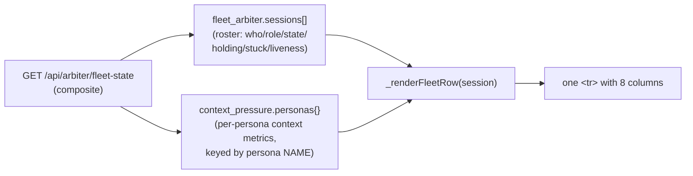

# Fleet-Status §9 — "% Window" + "Window" columns (context-pressure join)

**Date**: 2026-06-09
**Author**: Rio ⚡ (session 110ff47d)
**Status**: ✅ Built · 58 JS tests green · 100% L/B/F on changed surface · HELD (no push)
**Parent design**: [`01-design.md`](01-design.md) (the read-only operator Fleet-Status table — §5 six columns, §6 fetch/render/poll, §7 hierarchy model)

---

## 1. Request

Rick (voice, 2026-06-09): the Fleet-Status table has six text columns. Add **two more**:

1. **% of the context window consumed** — per session.
2. **Window size** — formatted compactly: `1000000 → "1M"`, `200000 → "200K"`.

This extends the §5 column set from **six → eight**.

## 2. Where the data lives — and why this is a *join*, not a new field

The Fleet-Status table renders from the `/api/arbiter/fleet-state` composite. That composite carries **two independent top-level sections** (per the context-pressure design, `2026.06.07-managing-context-memory/2026.06.09-context-pressure-published-headroom-service-design.md`):



- The **roster** (`fleet_arbiter.sessions`) is a flat array of session rows — it does **not** carry any context/window fields.
- The **context-pressure** data (`context_pressure.personas`) is a **map keyed by persona name**, each record holding `window_size`, `consumption_pct_of_window`, `budget_ceiling_tokens`, `headroom_*`, `pressure_state`, etc. (built by `context_pressure_writer._persona_record`).

So the two new columns are produced by **joining the two sections in the frontend, by persona name** — `personas[ session.persona ]`. No backend change was required: both sections already ship in the one composite.

## 3. The two fields used

From each persona record (`context_pressure_writer.py:_persona_record`):

| Column | Source field | Example | Unmeasured |
|---|---|---|---|
| **% Window** | `consumption_pct_of_window` (pre-rounded to 1 dp by the backend) | `21.9` → `"21.9%"` | `null` (idle/dead, no assistant turn yet) → `"—"` |
| **Window** | `window_size` (1000000 or 200000) | `1000000` → `"1M"` | `null` (IDLE/DEAD skip the transcript read, so the window was never resolved) → `"—"` |

Note the backend is **sign-honest / no-false-zero**: an unmeasured session carries `null`, never `0`. The frontend mirrors that — a measured `0%` renders `"0%"`, but a `null` renders `"—"`.

## 4. Implementation (3 files, all client-side)

### 4.1 `src/lupin_app/static/js/notifications.js`

Two new **pure** formatters (string in → string out, no DOM, fully unit-testable):

- `_formatWindowSize( windowSize )` — exact-million → `"<n>M"`, exact-thousand → `"<n>K"`, any other positive integer → its string, falsy/≤0 → `"—"`.
- `_formatConsumptionPct( pct )` — number → `"<pct>%"`, `null`/`undefined` → `"—"`.

The `personas` map is **threaded** through the render chain so every layer stays pure:

```
renderFleetStatus( composite )                       // extracts composite.context_pressure.personas
  → renderFleetStatusTable( model, personas )         // passes it down; group-header colspan 6 → 8
    → _renderFleetRow( session, indented, personas )  // joins personas[ session.persona ], renders 2 cells
```

- `renderFleetStatusTable`: header gains `<th class="fleet-col-window-pct">% Window</th>` + `<th class="fleet-col-window">Window</th>`; the group-header `<td colspan>` goes **6 → 8**.
- `_renderFleetRow`: looks up `const ctx = ( session.persona && personas[ session.persona ] ) || {}` and emits the two `<td>` cells.

### 4.2 `src/lupin_app/static/css/notifications.css`

A rule mirroring the existing `.fleet-col-stuck` centering — the two numeric columns are **right-aligned** with `font-variant-numeric: tabular-nums` and `white-space: nowrap`.

### 4.3 `src/tests/unit/notifications_js/fleet_status_panel.test.ts`

See §6.

## 5. Degrade-safety (the table NEVER breaks)

Every failure mode resolves to `"—"`, never an exception:

| Condition | Result |
|---|---|
| `context_pressure` section absent (arbiter not yet publishing) | `personas = {}` → both cells `"—"` |
| `context_pressure` present but no `personas` key (`status: "awaiting"`) | `personas = {}` → both cells `"—"` |
| Session's persona absent from the map | `ctx = {}` → both cells `"—"` |
| Persona present, window measured, consumption `null` (idle) | `% Window = "—"`, `Window` still shown (e.g. `"1M"`) |
| `renderFleetStatusTable` / `_renderFleetRow` called with no `personas` arg | default `= {}` → both cells `"—"` |

## 6. Tests & coverage

**Suite**: `src/tests/unit/notifications_js/fleet_status_panel.test.ts` — **58 tests pass** (+11 new; was 47).

New coverage:
- `_formatWindowSize`: 1M, 200K, exact-thousand/million (2M, 128K), arbitrary (1234), and all falsy/non-positive (`null`/`undefined`/`0`/`-5`).
- `_formatConsumptionPct`: numeric, a measured `0` (→ `"0%"`, NOT `"—"`), `null`, `undefined`.
- `_renderFleetRow`: per-persona join (1M + 200K rows), measured-window-but-null-consumption, persona-absent-from-map, no-personas-arg default.
- `renderFleetStatusTable`: threads `personas` through; header now carries `% Window` + `Window`; `colspan="8"`.
- `renderFleetStatus` (DOM): joins the `context_pressure` section into the cells; degrades to `"—"` when the section is absent, and when the section exists but `personas` is missing.

**Coverage** (c8, JSON report over the changed region, lines 8640–8835 of `notifications.js`): **zero uncovered statements, branches, or functions** — 100% L/B/F on the changed surface (per the changed-surface coverage-gate ruling).

```
Changed-surface region 8640-8835:
  uncovered statements: NONE ✓
  uncovered branches:   NONE ✓
  uncovered functions:  NONE ✓
```

## 7. Deploy

**Client-side static JS/CSS only.** No `:7999` or `:8001` bounce needed — a browser refresh picks it up. The backend already served both composite sections; nothing on the server changed.

## 8. Status / gates

- **HELD** — committed as a held checkpoint on `wip-v0.1.8…`, **not pushed** (Rick's push gate).
- No behavior change to the roster, the liveness verdicts, the live-only filter (§5.1), or the offline prune (§5.2) — purely additive columns.
