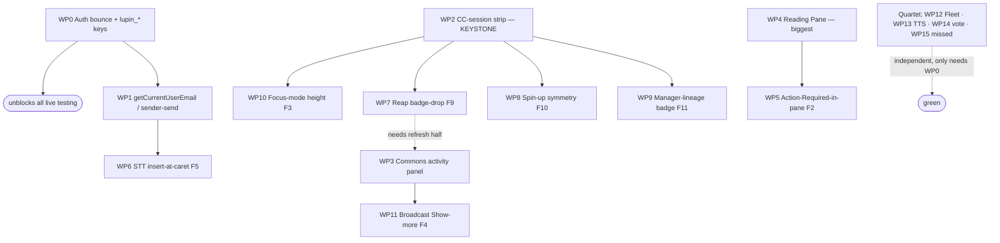

# Bridging Work Plan — notifications.js → multiplexer parity & deprecation

**Author:** Rachel 🕊️ (for Tiberius 👑) · **Date:** 2026-06-10 · **Target:** **FULL PARITY by Sat 2026-06-14, hard redirect if green**
**Deliverable 3 of 3** — builds on [`00-functional-change-summary.md`](00-functional-change-summary.md) + [`01-gap-analysis.md`](01-gap-analysis.md).

> **Revision r2 (2026-06-10, post-Tiberius/Rick ratification).** The original r1 sized this in
> *human* engineer-days and judged Saturday "not credible." Rick rejected the **units, not the
> facts**: Claude-crew lanes run **10–20× faster** than a human engineer. Recalibrated, the same
> ~156 human-hours ≈ **8–16 Claude-lane-hours**, and **parallelized across lanes the wall-clock is
> the critical path (~2–4.5 Claude-lane-hours), not the sum.** Under that recalibration **full
> parity by Saturday is credible.** Ratified decisions now baked in: (1) bar = **full parity**
> (MVD-no-redirect demoted to the Friday-night fallback cut-line); (2) token keys = **migrate
> multiplexer to `lupin_*`, no dual-read**; (3) **parallel implementer lanes**; (4) **Reading Pane
> IN scope**.

## The real binding constraint is not implementation time — it's two serialization points

With parallel Claude lanes the raw coding is fast. Two things actually gate the wall-clock:

1. **`:8000` E2E is monopolize-mode (one job at a time).** Unit/`c8` runs unrestricted in parallel
   on `:7999`, but every `test_multiplexer_*` Playwright suite serializes through the single `:8000`
   queue. This — not coding — is the schedule's long pole. Mitigation: batch E2E, schedule
   back-to-back, keep suites targeted/small, and do the full sweep once at integration.
2. **`boot.ts` + shared stores are a write-contention hot spot.** Every lane appends a renderer
   wiring + store registration to `boot.ts`. Without coordination, lanes collide there. Mitigation:
   **worktree isolation per lane** + a pre-agreed `boot.ts` mount-slot convention (the Phase 6c
   8-line mount-handshake is the template) + a single integration owner who serializes merges.

## Effort table — both unit systems (human-hours ÷ 10–20 = Claude-lane-hours)

| WP | Feature | Human-days | Human-hrs | **Claude-lane-hrs** |
|---|---|--:|--:|--:|
| WP0 | Auth bounce + token-key migrate (`lupin_*`) | 0.5 | 4 | **0.2–0.4** |
| WP1 | `getCurrentUserEmail` / sender-send | 0.5 | 4 | **0.2–0.4** |
| WP2 | **CC-session strip subsystem (keystone)** | 3 | 24 | **1.2–2.4** |
| WP3 | Commons "Recent Activity" panel | 2 | 16 | **0.8–1.6** |
| WP4 | **Reading Pane subsystem (F1)** | 4 | 32 | **1.6–3.2** |
| WP5 | Action-Required-in-pane (F2) | 1 | 8 | **0.4–0.8** |
| WP6 | STT insert-at-caret (F5) | 0.5 | 4 | **0.2–0.4** |
| WP7 | Reap → badge drop + broadcast refresh (F9) | 1 | 8 | **0.4–0.8** |
| WP8 | Spin-up persona symmetry (F10) | 0.5 | 4 | **0.2–0.4** |
| WP9 | Manager-lineage badge (F11) | 1 | 8 | **0.4–0.8** |
| WP10 | Focus-mode card height (F3) | 0.5 | 4 | **0.2–0.4** |
| WP11 | Broadcast "Show more" toggle (F4) | 0.5 | 4 | **0.2–0.4** |
| WP12 | Fleet-Status table (F12) | 2 | 16 | **0.8–1.6** |
| WP13 | TTS preview slider (F6) | 0.5 | 4 | **0.2–0.4** |
| WP14 | Prediction-hint vote (F8) | 1 | 8 | **0.4–0.8** |
| WP15 | Missed badge + Reset (F7) | 1 | 8 | **0.4–0.8** |
| **Σ serial** | | **19.5** | **156** | **7.8–15.6** |
| **Critical path (parallel)** | Reading-Pane lane: WP0→WP4→WP5 | — | — | **≈2.2–4.4** |

**Read:** serial sum confirms Tiberius's 8–16 lane-hour figure; but with ≥5 parallel lanes the
wall-clock collapses to the **Reading-Pane critical path (~2.2–4.4 Claude-lane-hrs of implementation)**.
The Saturday risk is therefore **E2E serialization + integration/review overhead**, not coding.

## Dependency spine

Three independent heavy lanes (**WP2 strip**, **WP4 Reading Pane**, **WP3 commons**) plus the
**self-contained quartet** can all run from the moment WP0 lands. WP1→WP6 is a short side-chain.

## Crew topology (proposed — Tiberius staffs)

Each implementer lane runs in **its own git worktree** (multiplexer `src/` is contended); a fresh
**critical reviewer** (reproduce-not-trust) gates each lane's **held** commit before it merges.

| Lane | Owner role | Work packages | Lane-hrs | Notes |
|---|---|---|--:|---|
| **A — Foundation** | impl #1 | WP0, WP1 | 0.4–0.8 | **Merges first**; unblocks every other lane's live testing + send path. Also lands the agreed `boot.ts` mount-slot convention. |
| **B — Strip keystone** | impl #2 | WP2 → then WP10, WP7, WP8, WP9 | 2.4–4.8 | One owner end-to-end so the strip store/renderer isn't co-edited. Dependents are sub-tasks after WP2 lands. WP7's refresh-half coordinates with Lane D. |
| **C — Reading Pane** | impl #3 | WP4 → WP5 | 2.0–4.0 | Largest single chunk; the critical path. Confirm `X-Frame-Options: SAMEORIGIN` on `/app/docs` is present server-side before iframe work. |
| **D — Commons panel** | impl #4 | WP3 → WP11 | 1.0–2.0 | Net-new panel; coordinates the recipient-list refresh with Lane B's WP7. |
| **E — Quartet** | impl #5 (split to 5a/5b if capacity) | WP12, WP13, WP14, WP15 | 1.8–3.6 | All self-contained, no strip/pane dep. Pair the heavy WP12 Fleet-Status with the tiny WP13; WP14+WP15 as the second sub-lane. WP6 STT can fold here after WP1. |

**Integration owner** (Tiberius or a thin dedicated lane) serializes `boot.ts` wiring as lanes land,
runs the final bundle rebuild (`npm run build`), the full multiplexer `c8 --100`, then the `:8000`
E2E sweep + integration gate.

### Merge / integration order (held branch, not pushed)
1. **Lane A** (WP0+WP1) — foundation + `boot.ts` slot convention.
2. **Lane B WP2** strip subsystem (keystone) — then its dependents WP10/WP7/WP8/WP9 merge as each goes green.
3. **Lanes C, D, E** merge independently as they go green (no ordering between them).
4. **WP5** after WP4; **WP11** after WP3; strip dependents after WP2.
5. **Final integration pass:** rebuild bundle → `c8 --100` on full multiplexer → `:8000` E2E sweep → integration gate → (if all green) the deprecation cutover (route redirect).

### Review gating per lane
Each lane: implementer → **fresh critical reviewer reproduces (not trusts)** → held commit. Mirrors
the Mr. Radio engagement pattern. No lane self-certifies.

### E2E cadence on `:8000` (the long pole)
- **Per-lane gate is unit/`c8` on `:7999`** (unrestricted, parallel) — a lane may NOT merge below 100% lines/branches/functions.
- **`test_multiplexer_*` Playwright suites batch-submit to `:8000`** via `POST /api/test-suite/submit`, `--bg`, scheduled **back-to-back** (monopolize; self-authorized on a verified-idle `:8000`, placed behind anything already scheduled).
- Keep suites **targeted** (per-WP, not the full ~285-test sweep) until the final integration pass; the full sweep + integration gate runs **once** at the end.

## Work packages (definitions + test plan unchanged from r1; sizing now per table above)

> Descriptions condensed — full surface/identifier detail is in §00. Every WP carries a **unit layer
> (`:7999`, `c8 --100`)** and an **E2E layer (`:8000` scheduled, `test_multiplexer_*`)** per the
> coverage + venue mandates.

- **WP0 — Auth bounce + token-key migrate.** Add missing-token redirect → `/app/auth/login?redirect=/app/multiplexer`; **migrate `AuthManager` from `auth_token` to `lupin_access_token`/`lupin_refresh_token`** (ratified — no dual-read). Tests: unit redirect/storage branches; E2E `test_multiplexer_auth_bounce.py`.
- **WP1 — `getCurrentUserEmail` / sender-send.** Implement from JWT claims; wire `boot.ts:307-320` (drop `currentUserEmail:""`). Tests: unit claim extraction; E2E send round-trip.
- **WP2 — CC-session strip subsystem (keystone).** New `SessionStripStore` + `SessionStripRenderer` (icon add/remove, hide-inactive filter, persona badge on card, focus-active attr). Tests: unit add/remove/filter (100% branches); E2E `test_multiplexer_session_strip.py`.
- **WP3 — Commons "Recent Activity" panel.** Net-new panel consuming commons-activity WS events. Tests: unit + E2E.
- **WP4 — Reading Pane subsystem (F1).** `ReadingPaneStore` + `ReadingPaneRenderer`: open/close/back/bust-out, iframe doc embed, abstract markdown, toggle-on-second-click, split-ratio + toolbar centering, center-scroll preserve. Tests: unit history/ratio/toggle/scroll-anchor; E2E mirroring `test_layout_mode_toolbar_centering.py` + `test_abstract_indicator_toggle.py` + iframe smoke.
- **WP5 — Action-Required-in-pane (F2).** Lift AR widget into pane at 50/50, stash/restore on drain (AR-interactive already exists). Tests: unit stash/restore; E2E `test_multiplexer_action_required_in_pane.py`.
- **WP6 — STT insert-at-caret (F5).** `insertTranscriptionText` caret-range insert. Tests: unit caret math; E2E `test_multiplexer_stt_insert_at_cursor.py`.
- **WP7 — Reap → badge drop + broadcast refresh (F9).** `session_reaped` handling. Tests: unit reducer; E2E `test_multiplexer_reap_badge_drop.py` (**closes the JS-side E2E gap** — `8702cb3` had none).
- **WP8 — Spin-up symmetry (F10).** Extend `voice_persona_assigned` → idempotent strip icon + recipient refresh. Tests: unit idempotency; E2E (**closes the `282be5d` gap**).
- **WP9 — Manager-lineage badge (F11).** `managerPersonaMap` analog; top-left badge from `payload.manager_persona` (live + cold-reload hydration); single idempotent apply (the `a9ea8ab` lesson). Tests: unit populate/clear/hydration; E2E `test_multiplexer_manager_badge.py`.
- **WP10 — Focus-mode height (F3).** CSS 500/250px on focus-active + date-accordion DOM. Tests: E2E height assertion.
- **WP11 — Broadcast Show-more (F4).** Port `revealToggleIfOverflowing` + `ResizeObserver`. Tests: E2E `test_multiplexer_commons_activity_toggle.py`.
- **WP12 — Fleet-Status table (F12).** `FleetStatusStore` + `FleetStatusRenderer` (60s poll timer, not WS); port grouping/split/format pure fns; **add the missing `.fleet-offline-toggle*` CSS** (JS-side gap). Server `/api/arbiter/fleet-state` is client-agnostic — no server work. Tests: unit grouping/split/format incl. unreachable-arbiter + empty-roster branches; E2E `test_multiplexer_fleet_status.py`.
- **WP13 — TTS preview slider (F6).** 9-stop 12.5% slider + datalist + label; persist via `StorageService`; seed INI default via `/api/multiplexer/config`. Tests: unit slider→fraction + persistence; E2E `test_multiplexer_tts_controls.py`.
- **WP14 — Prediction-hint vote (F8).** Vote controls (≥50% gate) + `votePrediction` store action → `POST /api/notify/prediction-vote/{id}`; delegated listeners (no inline onclick). Tests: unit gate + vote reducer; E2E `test_multiplexer_prediction_vote.py`.
- **WP15 — Missed badge + Reset (F7).** Consume `auth_success.undelivered_count`; render badge + Reset → `POST /api/notifications/undelivered/dismiss`. Tests: unit visibility + reset reducer; E2E `test_multiplexer_missed_badge.py`.

## Friday-night fallback cut-line (the demoted MVD)

If a lane is **not green by Friday night 2026-06-13**, we do **not** hard-redirect Saturday. We drop
to **MVD-no-redirect**: make `/app/multiplexer` the **landing-page default** (repoint
`landing-card-notifications`, add a "Classic UI" link to `/app/notifications`), keep
`/app/notifications` **alive** (no redirect), announce the cutover, and ship the hard redirect
**Monday 2026-06-16** once the cut lanes land.

**Cut order (drop heaviest / least-essential first):**
1. **First cut — Lane C (WP4 Reading Pane + WP5).** Biggest chunk, cleanest fast-follow. Landing default ships without master-detail; users keep the JS client for doc-pane work.
2. **Second cut — Lane D (WP3 commons panel + WP11).** Broadcast visibility falls back to the JS client.
3. **Keep at all costs:** Lane A (WP0/WP1 blockers), Lane E quartet (WP12/13/14/15 — high value, self-contained, low risk), Lane B strip + dependents (WP2/WP10/WP7/WP8/WP9 — operator-visible fleet/persona affordances).

## "Deprecate notifications UI" — cutover checklist (runs only when full parity is green)

1. **Route/redirect:** `pages.py` `/app/notifications` → `RedirectResponse` to `/app/multiplexer` (keep the route alive for bookmarks, don't 404).
2. **Landing page:** repoint `landing-card-notifications` (`landing.html:116`) to `/app/multiplexer`.
3. **Server bits:** `multiplexer_config` router stays; client-agnostic endpoints (`/api/notifications/undelivered*`, `/api/notify/prediction-vote/*`, `/api/arbiter/fleet-state`) stay.
4. **E2E migration:** the ~12 JS-client E2E suites each gain a `test_multiplexer_*` counterpart (named above). **Do not delete the JS suites until the redirect soaks** — they guard the fallback.
5. **Docs:** update `notification-api.md`, `rest-api-reference.md` (Pages), `websocket-events.md`, and the `DOCUMENTATION TOUCHPOINTS` table in `CLAUDE.md` to name `/app/multiplexer` canonical; mark `notifications.js` deprecated.
6. **Build/cache-bust:** `npm run build`, verify served `dist/multiplexer/boot.js` hash, bump multiplexer HTML `?v=`.
7. **Coverage gate:** full multiplexer stays at **100% lines/branches/functions** (`c8 --100`) after every WP.
8. **Decommission (later):** deleting `notifications.js`/`.html`/`.css` + the ~26-file `dist/` history is a separate explicit call after the redirect soaks — out of scope here.

## Decisions — now ratified (was "open" in r1)

1. **Deprecation bar = FULL PARITY by Saturday, hard redirect if green** (MVD-no-redirect = Friday-night fallback).
2. **Token keys = migrate multiplexer to `lupin_*`, no dual-read.**
3. **Crew = parallel implementer lanes** (topology above).
4. **Reading Pane = IN scope** (Lane C, the critical path).
