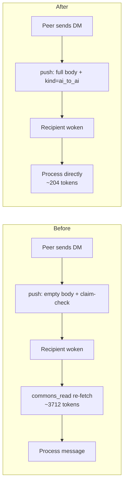

# DM Body-in-Push — Phase 1 Token-Reduction Design

**Date**: 2026.06.13
**Author**: Mr. Radio 🦉 (with Rick, architect)
**Status**: DESIGN — approved to serialize; implementation pending
**Engagement**: cosa-voice MCP token reduction (Rick measured DM traffic at ~75% of his inference budget; cosa-voice turned OFF 2026-06-12 over the cost)
**Scope**: TEMPORARY high-leverage fix to stop the bleeding. Offline-recipient replay is explicitly **Phase 2 (Monday)** — see §8.

---

## 1. Problem

When a peer session sends a DM via `commons_send_to` / `commons_ask_async`, the
recipient's push notification carries an **empty body plus a claim-check**
(`question_id` + `topic`). Doctrine then says "ALWAYS re-fetch via `commons_read`"
— so retrieving ONE ~181-token message costs **~3,712 tokens**.

Smoking gun — `src/cosa/rest/routers/commons.py:1034`:

```python
notification_queue.push_notification(
    message = "",                              # ← recipient gets NOTHING
    type    = "user_initiated_message",
    title   = "action:commons_question_received",
    payload = { "question_id": ..., "topic": ..., ... },   # claim-check only
)
```

## 2. Baseline measurements (captured 2026-06-13)

Measured from live `io/commons/dm-*.md` (entry separator
`<<<__lupin_commons_entry_boundary__>>>`):

| Metric | Value |
|---|---|
| DM entries / topics / disk | 714 entries · 12 topics · 720 KB |
| Avg full entry | 990 chars = **247 tokens** |
| Avg body only | 727 chars = **181 tokens** |
| Max single body | 5,532 chars = 1,383 tokens |
| `commons_read(limit=15)` | **~3,712 tokens / call** |
| `commons_read(limit=5)` | ~1,237 tokens / call |

## 3. The fix (Phase 1)

**Carry the full DM body inside the push system-reminder**, plus an explicit
provenance discriminator. The recipient then processes the message directly
(~204 tokens: ts + sender + thread_id + body) with **zero `commons_read`**.

- **Before**: ~3,712 tokens / received DM
- **After**: ~204 tokens / received DM
- **Savings**: ≈ 3,508 tokens / DM — **~18× reduction**
- At 50 DM exchanges in a heavy fleet session: **~175,000 tokens saved**

Fallback discipline: any catch-up `commons_read` MUST pass `since=<last_seen_ts>`,
never a bare `limit=N`.

## 4. The `kind` discriminator (DECISION)

```
kind = { "human_to_ai" | "ai_to_ai" }
```

- `"human_to_ai"` — a message from Rick (the human voice path). **Default value**,
  so the existing voice path is untouched / back-compatible.
- `"ai_to_ai"` — a peer DM from another persona session.

**Rationale** (Rick + Mr. Radio, 2026-06-13): the earlier `peer_llm_to_llm` was
redundant — "LLM-to-LLM" already implies peer. `human_to_ai` / `ai_to_ai` are
symmetric (`_to_ai` tail), non-redundant, and name *message provenance* (who sent
it) rather than the model layer. We deliberately avoid `llm` here so as not to
blur the message-origin concept with the existing `Llm` model abstraction.

**One-name-everywhere rule** (per `feedback_one_descriptive_name_everywhere_break_contract`):
the exact strings `human_to_ai` / `ai_to_ai` appear identically in the push payload,
the buffered entry, and the formatter dispatch — no aliases, no shims, no mapping.

## 5. Three-layer design (current → proposed)

### Layer 1 — sender push (`commons.py:1034`, `_send_question_received_notification`)

```python
# PROPOSED
message = dm_body                          # the actual message text
payload = {
    "kind"           : "ai_to_ai",
    "sender_persona" : sender_persona,     # "María"
    "sender_icon"    : sender_icon,        # "🌸"
    "thread_id"      : question_id,        # reply correlation
    "topic"          : topic,
    "reply_to"       : asker_session_id,   # where a reply routes
}
```

### Layer 2 — buffer entry (`cc_notification_listener.py:716`, `_buffer_message`)

The buffer already serializes a structured object ("whole object, not just body"
is **already true** — 7 fields today). Add four pass-through fields:

```python
entry = {
    "message"        : notification.get( "message", "" ),
    "priority"       : notification.get( "priority", "normal" ),
    "job_id"         : notification.get( "job_id", "" ),
    "sender_id"      : notification.get( "sender_id", "" ),
    "notification_id": notification.get( "id", "" ),
    "timestamp"      : notification.get( "timestamp", ... ),
    "buffered_at"    : ...,
    # NEW — lifted from notification.payload:
    "kind"           : notification.get( "kind", "human_to_ai" ),
    "sender_persona" : notification.get( "sender_persona", "" ),
    "sender_icon"    : notification.get( "sender_icon", "" ),
    "reply_to"       : notification.get( "reply_to", "" ),
}
```

### Layer 3 — formatter dispatch (`hook_common.py:397`, `format_voice_context`)

```python
# PROPOSED
for msg in messages:
    text = msg.get( "message", "" ).strip()
    if not text: continue
    kind = msg.get( "kind", "human_to_ai" )
    if kind == "ai_to_ai":
        persona = msg.get( "sender_persona", "a colleague" )
        icon    = msg.get( "sender_icon", "" )
        lines.append( f"[DM from {persona} {icon}]: {text}" )
        lines.append( f"    ↳ To reply, send a DM to {persona}." )   # reply affordance
    else:   # human_to_ai (default)
        lines.append( f"[Voice from Rick]: {text}" )
```

Mixed batches work for free: `drain_voice_buffer` returns the buffered list in
arrival order, so one `human_to_ai` line and three `ai_to_ai` lines arrive in a
single `additionalContext` block, each with its own envelope, attended top-to-bottom.

## 6. Flow (before vs after)



## 7. Acceptance criteria

- **AC1** — `commons.py` DM push sends `message=dm_body` (not `""`) and a payload
  carrying `kind="ai_to_ai"`, `sender_persona`, `sender_icon`, `thread_id`,
  `topic`, `reply_to`.
- **AC2** — `_buffer_message` passes `kind`/`sender_persona`/`sender_icon`/`reply_to`
  through onto the buffered entry; `kind` defaults to `"human_to_ai"` when absent.
- **AC3** — `format_voice_context` branches on `kind`: `human_to_ai` →
  `[Voice from Rick]: ...`; `ai_to_ai` → `[DM from <persona> <icon>]: ...` + reply line.
- **AC4** — Existing voice path unchanged: a notification with no `kind` renders
  exactly as today (`human_to_ai` default), proven by an unchanged-behavior test.
- **AC5** — 100% lines/branches/functions on all three touched functions
  (per §100% COVERAGE MANDATE) — unit tests on `:7999`.
- **AC6** — `commons_read` docstring in `cosa_voice_mcp.py` updated: "always
  re-fetch" → "process the pushed body directly; only `commons_read(since=...)`
  for catch-up."

## 8. Out of scope — Phase 2 (Monday)

**Offline-recipient DB-inbox replay** is deferred. When the named persona is NOT
allocated to a live session, `_resolve_dm_recipient` fails and the DM must be
persisted to a DB inbox and replayed on the recipient's next SessionStart. That
is a separate phase; Phase 1 covers the **live-recipient** path only, which is the
dominant token sink today.

## 9. Testing

| Tier | Venue | What |
|---|---|---|
| Unit | :7999 | formatter dispatch (both kinds + default), buffer pass-through, push payload shape |
| Smoke (inline) | :7999 | `py_compile` + import chain on all three files |
| Pre/post measurement | n/a | quantify realized savings vs §2 baseline (Task #7) |

## 10. Edit list (implementation order)

1. `src/cosa/rest/routers/commons.py:1034` — body + `kind`/persona/reply payload
2. `src/lupin_cli/claude_code/hooks/lib/cc_notification_listener.py:716` — entry pass-through
3. `src/lupin_cli/claude_code/hooks/lib/hook_common.py:397` — formatter branch
4. `src/lupin_mcp/cosa_voice_mcp.py` — `commons_read` docstring (AC6)
5. Unit tests for 1–3 (AC5)
