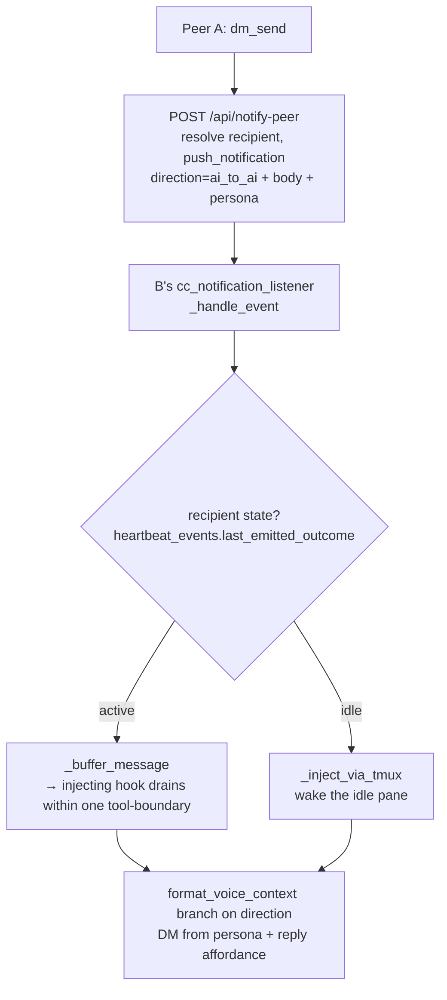

# Notification-Native AI↔AI Messaging — Design

**Date**: 2026.06.15
**Author**: Mr. Radio 🦉 (with Rick, architect)
**Status**: DESIGN — approved (plan accepted 2026-06-15); implementation in progress
**Supersedes**: the Layer-2/3 edit list in `01-dm-body-in-push-phase1-design.md`
**Engagement**: cosa-voice MCP token reduction (DM traffic measured at ~75% of Rick's
inference budget; cosa-voice turned OFF 2026-06-12 over the cost)

---

## 1. Problem

A peer DM today rides the commons `register-question` machinery. The server pushes an
**empty-body claim-check** (`question_id` + `topic`) and doctrine forces the recipient to
call `commons_read(...)` to fetch the body — **~3,712 tokens per received DM**
(`commons_read(limit=15)`). That is the dominant token sink that got the server turned off.

The body **is already carried inline on the reply path** today
(`commons.py` answer dispatch sets `payload["body"]`, and
`cc_notification_listener._handle_commons_answer_received` injects it directly with no
re-fetch). Only the question/DM path still does empty-body + claim-check.

## 2. Goal

Carry AI↔AI messages as **ordinary notifications with the body inline**, delivered by the
notification infrastructure that already exists — **~204 tokens/received DM (~18×
reduction)**, in **both** directions (send *and* respond). Retire the claim-check, the
forced `commons_read`, and the watcher-based reply poll for live DMs.

## 3. Two findings that corrected doc 01

1. **Delivery is buffer-drain, not tmux — but only for ACTIVE recipients.** Six hooks
   touch the per-session voice buffer. Five *inject* (`user_prompt_submit`,
   `pre_tool_use`, `post_tool_use`, `stop` [non-speakerphone], `permission_request`) via
   `additionalContext`/deny/block — so an actively-working peer is delivered to **before
   and after every tool call**. The writer `_buffer_message`
   (`cc_notification_listener.py:696`) is currently dead and just needs wiring.
   - **Landmine:** the sixth hook, the **Notification hook** (`notification.py:55`), fires
     at the busy→idle transition (`idle_prompt`) and **drains-and-DISCARDS** — its output
     is ignored by CC ("Observation-only"), so it has no injection channel. Once we buffer
     DMs, a recipient going idle would have its buffered DM *eaten*.
   - **Therefore tmux is irreducible for the idle case** — it is the only path that
     reaches a fully-idle-at-prompt session (no injecting hook fires there).

2. **The notification DB is the persistence/audit substrate — not the commons board.** A
   durable Postgres `notifications` table (`postgres_models.py:490`) persists
   `message`/`title`/`type`/`sender_id`/state/timestamps. Commons needed its board *only
   because the free-form `payload` dict is not persisted*. Put durable content in **real
   columns** and the board is unnecessary for DMs.

## 4. Locked design decisions (Rick, 2026-06-15)

- **First-class columns**, not a JSONB blob, not overloaded columns. Wire JSON keys map
  **1:1** to column names — the external representation *is* the internal representation
  (`row → dict`, `dict → row(**fields)`; no translation layer).
- A new **`direction`** column. NOT `kind` (collides with `type` — synonyms in English);
  NOT `sender_class` (the values are directional, not sender classes). Values:
  `human_to_ai` | `ai_to_ai` | `ai_to_human`.
- `direction` is **cross-cutting**: set at **every** notification call site. `ai_to_human`
  is the bulk (AI→Rick, TTS/cards), `human_to_ai` is voice-in, `ai_to_ai` is the new peer
  path.
- `type` stays the **event-category** axis (`progress`/`alert`/`commons_*`/…); `direction`
  is the orthogonal **provenance/direction** axis. They are not synonyms once you see that
  `type` answers "what event" and `direction` answers "from whom, to whom".

## 5. Data model — first-class columns on `notifications`

Body reuses the existing **`message`** column. New nullable columns
(`src/cosa/rest/postgres_models.py`):

| Column | Type | Notes |
|---|---|---|
| `direction` | String(20), indexed | `human_to_ai` \| `ai_to_ai` \| `ai_to_human`; `server_default='ai_to_human'` |
| `sender_persona` | String(64) | e.g. `María` |
| `sender_icon` | String(16) | e.g. `🌸` |
| `reply_to` | String(64) | id of the message this answers (threading) |
| `thread_id` | String(64), indexed | conversation correlation |

**Idiom precedent in the same table:** the `response_*` nullable group is populated only
for response-required notifications. These follow that exact pattern — populated for
DMs/voice, NULL otherwise.

## 6. Delivery model — idle-aware

- **active → buffer** (clean, non-invasive; the injecting hooks deliver fast).
- **idle → tmux-wake** (the only path that reaches an idle pane).
- State is read from the **existing** `heartbeat_events` outcome store
  (`~/.claude/heartbeat-events/<id>.jsonl`, `last_emitted_outcome(session_id)`) — no new
  tracker.
- **Fix `notification.py:55`** so the idle Notification hook no longer drains-and-discards
  a buffered DM (at `idle_prompt`, drain + `_inject_via_tmux` any pending DM).
- **Stop-hook speakerphone refinement** (`stop.py:1428-1477`): when a pending message is
  `ai_to_ai`, drain + block + inject instead of peek-and-leave.

### 6a. Direction-specific framing & rider (MANDATE — Rick, 2026-06-15)

The injected envelope AND the system-reminder rider are **human-voice protocol** and
must NOT be applied to a peer DM. Today a notification-native `ai_to_ai` DM falls through
to the generic `user_initiated_message` path → `_inject_via_tmux(wrap=True)` →
`speakerphone_wrap()`, which wraps it as `<voice-message from-distance>` + the speakerphone
rider ("the user spoke… call `notify()` to speak your reply aloud… TTS brevity… chorus").
That hands an AI peer the *human-voice* contract — framed as if Rick spoke, and instructed
to TTS-speak a reply. Wrong.

**Requirement:** the receive path branches on `direction`:
- `human_to_ai` → `speakerphone_wrap()` voice rider (unchanged).
- `ai_to_ai` → a **peer-DM envelope** — `[DM from <persona> <icon>]` + `message_id` +
  `thread_id` — and a **peer reply affordance** ("reply via `dm_send(recipient=…,
  reply_to=<message_id>, thread_id=<thread_id>)`"). **NO `speakerphone_wrap`, NO "user
  spoke", NO notify-to-speak instruction** — peers reply via `dm_send`, never TTS.

So `_handle_event` must route an `ai_to_ai` notification (read `notification.get("direction")`,
which the push already carries) away from the voice `_inject_via_tmux(wrap=True)` path:
active → buffer (drained + framed by `format_voice_context`'s `ai_to_ai` branch); idle →
`_inject_via_tmux(wrap=False)` with the peer envelope. The `message_id`/`thread_id` surfaced
here are what let the recipient thread a `dm_send` reply.

## 7. Phases

- **Phase 0 — Docs** (this doc + amend `01`). *Documentation-first gate.*
- **Phase 1 — `direction` column + cross-cutting retrofit.** Migration; thread through
  `NotificationItem`/`push_notification`/`_persist_notification_sync`/WS payload; add
  `direction` to `POST /api/notify`; set `direction` at every call site. Unit tests 100%.
- **Phase 2 — AI→AI send/respond on-ramp.** New `POST /api/notify-peer` reusing
  `_resolve_dm_recipient`; new MCP tool `dm_send`; reply = same path with
  `reply_to`/`thread_id`. Tests.
- **Phase 3 — idle-aware receive/delivery.** Listener routing; `_buffer_message` fields;
  `format_voice_context` direction branch; fix `notification.py` discard; stop-hook
  speakerphone deliver-on-pending-DM. Tests.
- **Phase 4 — retire commons DM live path.** Feature-flag/deprecate `register-question` DM
  dispatch + `CommonsQuestionWatcher` reply poll for live DMs; update `commons_read`
  docstring; repoint `commons_send_to`/`commons_ask_async`.

## 8. What gets retired

Empty-body claim-check · forced `commons_read` re-fetch · watcher-based reply polling for
live DMs · commons-board mirror for DMs. (Commons board retained for non-DM topics —
broadcasts/presence — if still used.)

## 9. Verification

- **Unit (:7999)**: all new/changed functions at 100% lines/branches/functions.
- **Smoke (:7999)**: `py_compile` + import chain on every touched file.
- **Protocol E2E (:7999, AI-run)**: two CC sessions; A `dm_send`s B; assert B's next hook
  injects body inline with `[DM from <persona>]` framing and **zero `commons_read`**; B
  replies; assert it threads back to A via `reply_to`/`thread_id`. Exercise both an active
  and an idle recipient.
- **Integration / E2E UI (:8000 scheduled)**: notification regression + peer-DM flow;
  final merge gate.
- **Token measurement**: received-DM cost vs the §2 baseline of `01` (~3,712 → ~204).

## 10. Open risks

- **Idle/active race**: state may flip between the listener's read and delivery — benign
  (worst case: a buffered message waits for the next hook, or a tmux nudge queues at a
  just-active pane's prompt).
- **Retrofit breadth**: setting `direction` everywhere is wide but mechanical; the
  `ai_to_human` server-default keeps un-retrofitted sites correct in the interim.
- **Coverage gate**: migration + new endpoint + MCP tool all carry the 100% mandate.
