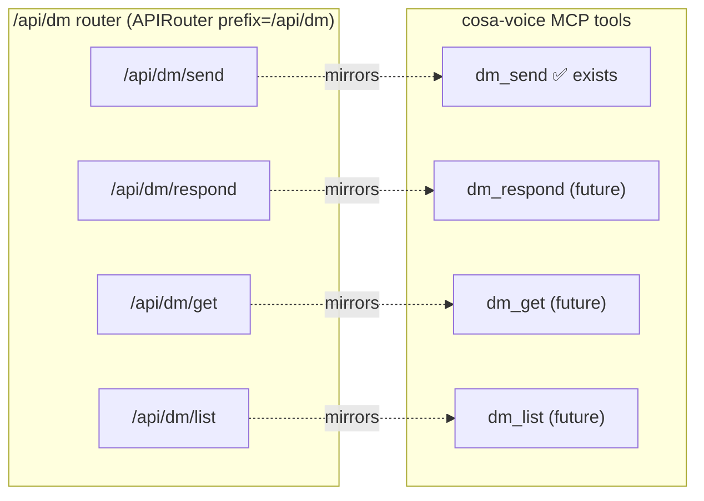

# DM API Namespace Design — `/api/dm/<verb>`

**Date**: 2026-06-16
**Author**: Tiberius 👑 (session 570d9733)
**Decision provenance**: Rick (voice, 2026-06-16) — chose the **nested verb namespace** over a flat `/api/dm-send` endpoint, explicitly for its expansionist benefit ("a short base I can append send/respond/get/list to").
**Status**: PLAN — Phase 1 in flight (delegated); Phases 2+ staged for delegation.

---

## 1. Problem & Vision

Today the peer-DM REST surface is a single endpoint **`/api/notify-peer`**, while the MCP tool and every Python symbol are named **`dm_send`**. That naming split is the exact one-name-doctrine violation we're retiring (TODO #2). The function is `dm_send` everywhere; only the HTTP route lags.

**Vision**: collapse the split into a coherent **`/api/dm` namespace** — a base resource with verb sub-routes, each mirroring a `dm_<verb>` MCP tool **1:1**. The contract reads itself: every `/api/dm/<verb>` has a `dm_<verb>` tool, and vice-versa.

## 2. Architecture

- **One router**: `src/cosa/rest/routers/dm.py` → `APIRouter( prefix="/api/dm", tags=["dm"] )`, registered in `src/lupin_app/main.py`. Shared JWT auth dependency, one grouped section in `/docs`, siblings added with zero per-route boilerplate.
- **No alias, no shim** — hard rename. We own every in-tree caller; "break everything, do it right."
- **Symbol alignment**: `build_notify_peer_payload` → `build_dm_send_payload`; any `notify_peer`/`dm_push` symbols → dm-send-aligned names.

## 3. Endpoint Family

| Route | Method | MCP mirror | Purpose | Phase |
|---|---|---|---|---|
| `/api/dm/send` | POST | `dm_send` (exists) | Send a DM (inline body) — today's `notify-peer` | **1 (now)** |
| `/api/dm/respond` | POST | `dm_respond` (future) | Threaded reply (`reply_to` + `thread_id`) | 2 |
| `/api/dm/get` | GET | `dm_get` (future) | Fetch one message by id | 2 |
| `/api/dm/list` | GET | `dm_list` (future) | List / poll a thread or inbox | 2 |

Request/response schemas for send are carried over verbatim from `/api/notify-peer` (no behavior change in Phase 1 — pure rename + relocation). Respond/get/list schemas are designed in Phase 2 against the existing `dm-<persona>` board + thread model.

## 4. Phase 1 — Rename Migration (IN FLIGHT)

**Owner**: builder `cc-author-tiberius-1` (live). **Scope** (pure rename + router scaffold, no behavior change):
- Move the `/api/notify-peer` handler into the new `/api/dm` router as `POST /api/dm/send`.
- Rename `build_notify_peer_payload` → `build_dm_send_payload`; update arbiter (`arbiter_live_notify.py`, `app.py`) + MCP (`cosa_voice_mcp.py`).
- Rename `test_notify_peer.py` → `test_dm_send_endpoint.py`; update `test_arbiter_*`, `test_dm_send.py`, `test_commons_ac14_registration.py`.
- **Zero `notify-peer` / `notify_peer` survivors** (tree-wide grep proof required).
- Docs: `rest-api-reference.md`, `notification-api.md`, BFE/TFE rows; regen `/docs`.
- Gates: 100% lines/branches/functions; py_compile + startup import chain; selective-stage; **held commit, no push**.

**Exit**: held commit DM'd → fresh-critical review (reproduce-not-trust) → held on `wip-v0.1.8` → Rick's push.

## 5. Phase 2 — Verb Build-Out (STAGED, delegated on Rick's word)

Sequenced **after** Phase 1 lands (the `/api/dm` router must exist first — Phase 2 edits the same `routers/dm.py`, so it cannot run concurrently without a file collision).

- Design + implement `/api/dm/respond`, `/api/dm/get`, `/api/dm/list` + their request/response schemas.
- Add the mirroring MCP tools `dm_respond` / `dm_get` / `dm_list` in `cosa_voice_mcp.py` (cross-repo MCP touch — same review + restart discipline).
- Each verb: 100% coverage, fresh-critical review, held, Rick push gate.

**Crew shape**: 1 builder (verbs + schemas) + 1 builder (MCP tool mirrors) can run in parallel once the router exists (different files); 1 fresh-critical reviewer per held commit.

## 6. Open Questions for Rick

1. **Phase 2 timing**: build `respond/get/list` now (immediately after Phase 1 router lands), or land the rename first and schedule the verb family next?
2. **Phase 2 scope**: all three verbs, or a subset (e.g. `respond` + `list` first; `get` only if a fetch-by-id use case is real)?

## 7. Delegation Ledger

| Phase | Work | Owner | State |
|---|---|---|---|
| 1 | Rename → `/api/dm/send` + router scaffold | `cc-author-tiberius-1` | 🔨 building |
| 1 | Fresh-critical review of held commit | (spawn on hold) | pending |
| 2 | `respond`/`get`/`list` endpoints + schemas | (spawn after Phase 1) | staged |
| 2 | MCP `dm_respond`/`dm_get`/`dm_list` | (spawn after Phase 1) | staged |

All work HELD on `wip-v0.1.8` — push is Rick's gate.
