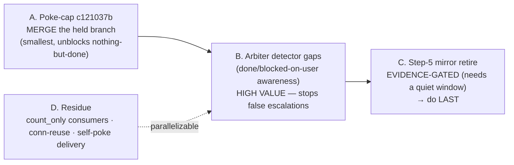

# Unified Task-Store — Open Follow-Ups Implementation Plan

**Date**: 2026-06-17 · **Author**: Mr. Radio 🦉 · **Status**: PLAN (for Rick's review / re-spin)
**Context**: The store-canonical cutover is LIVE (one store, three readers). This plan covers everything that remains. Architecture: `src/docs/fleet-liveness-and-task-store-architecture.md`. Design/cutover record: `src/rnd/v0.1.8/2026.06.16-store-canonical-task-mgmt-cascade-review.md`.

All work follows the standing pattern: **spawn worker → worktree → 100% L/B/F changed-surface tests → fresh-critical review (reproduce-not-trust) → merge `--no-ff` HELD → push is Rick's word.** Live hook files (`stop.py`, `post_tool_use.py`, `task_store_mirror.py`, arbiter code) are built in **worktrees**, never the live tree.

---

## Priority / sequencing at a glance

Recommended order: **A (quick win) → B (highest value) → D (cheap cleanups) → C (gated, last)**.

---

## A. Poke-cap `c121037b` — land the held fix

- **State**: BUILT + fresh-critical APPROVED + green, held on branch `wt-4eb44397-pokecap` @ `4de2406a` (50 tests pass). NOT merged, NOT pushed. This is the oldest piece of held work — it predates the task-store engagement.
- **What it fixes**: `poke_cap` never enforced (counter never persisted → self-poke nags every turn) + the heartbeat HOLD must be written at the **stable** session id (a hold at the short/CC id is silently ignored) + base-dir hardwired to `$LUPIN_ROOT`.
- **Scope**: `heartbeat_poke_cap.py` + `stop.py` hold-id resolution + `user_prompt_submit.py` reset path. (Already done in the held branch.)
- **Approach**: this is purely a **merge decision** — the build + review are done. Verify the branch still rebases cleanly onto current HEAD, re-run `test_stop_hook.py` + the poke-cap suite, then `git merge --no-ff wt-4eb44397-pokecap` held.
- **Sequencing**: do FIRST (no dependencies; smallest). **Gating**: Rick's call on whether to merge now (it's been held pending his word).
- **Effort**: ~15 min (re-verify + merge). **Risk**: low (reviewed, green).

## B. Arbiter detector gaps — done / blocked-on-user awareness

- **Why (highest value)**: the arbiter's **tap-ACK** (600s) and **whole-fleet-stall** (1800s) detectors flag a manager whenever it owes work and hasn't recently *progressed* — with **no** notion of "this work is done" or "this work is blocked on the user." Result: a finished or legitimately Rick-gated manager generates repeating false `MANAGER-DOWN` / `WHOLE-FLEET-STALL` escalations to Rick (observed live overnight 2026-06-17). Relates to dropped bug `332af094`.
- **Scope**: `src/cosa/agents/heartbeat_arbiter/{arbiter_job.py, fleet_data_model.py}` — the stall/tap-ACK gating logic.
- **Design (proposed, for review)**:
  1. **Blocked-on-user exclusion**: when a manager's only owed items are `gate_class=ricks_court` and/or `status=blocked` with `blocked_by:[{kind:user}]`, the manager is **not** "present-but-not-acting" — suppress the stall/tap-ACK escalation (or downgrade to a single "awaiting Rick" advisory, not a repeating MANAGER-DOWN). The arbiter already reads the store, so it can see these.
  2. **Done-aware**: a manager whose owed-count is 0 should not be tap-ACK'd as if it owes work; if it's genuinely idle-done, advise "consider reaping" once, not repeating.
  3. **Tap-ACK window vs loop cadence**: document/relax the 600s tap-ACK so it can't out-pace a sane management loop, OR have the tap-ACK honor the same blocked-on-user/done exclusions.
- **Approach**: investigate-first (enumerate the exact gating predicates today) → DM plan → worker builds in worktree → 100% L/B/F on changed surface (incl. the new exclusion branches) → fresh-critical review → merge held → **bounce `:8001`** (`systemctl --user restart lupin-arbiter-app.service`, standing authority) to deploy.
- **Sequencing**: after A. **Gating**: design approval (the suppression rules are a judgment call — present via the store/UI so Rick sees it).
- **Effort**: ~half a day (investigate + build + review + deploy).

## C. Step-5 — retire the harness→store mirror (EVIDENCE-GATED, do LAST)

- **Why last**: the mirror is the **bridge** that keeps not-yet-migrated sessions safe during the transition. Pulling it early silently darks them (a real owed item, store-count 0, never poked — the dangerous inverse of a spurious poke).
- **Scope**: `post_tool_use.py:104-106`, `lib/task_store_mirror.py`, and the `TASK_STORE_WRITE_TOOLS` list (`post_tool_use.py:46-49`).
- **Approach (two stages)**:
  1. **Now-ish**: convert the mirror to a **deprecated, logged no-op** (emit a fire-log line each time a native `TaskCreate`/`TaskUpdate` would have mirrored). Build/review/merge held like any change.
  2. **After a quiet window**: once the mirror fire-log is quiet **fleet-wide** for a defined window (evidence the fleet has fully stopped using native `TaskCreate` for owed work), DELETE the mirror + drop the dead `TASK_STORE_WRITE_TOOLS` entries (so the arbiter progress beacon doesn't fire storeless on stray native calls). Bugs `9bf1dc4a` / `9b23d5bc` die with it.
- **Sequencing**: stage-1 anytime after the doctrine is live (it is); stage-2 gated on the quiet-window evidence. **Gating**: the quiet-window threshold is a Rick/operator decision.
- **Effort**: stage-1 ~1-2 hrs; stage-2 ~30 min once the window passes.

## D. Residue / cleanups (cheap, parallelizable)

| Item | What | Effort |
|---|---|---|
| **count_only consumers** | The `count_only=true` param on `GET /api/tasks` exists (O2). Confirm the Stop-hook poke path uses it (true `COUNT(*)`, not a page-length) and any other count consumers adopt it. | ~30 min |
| **Connection reuse (O3)** | `task_store_client.query_owed` does a fresh urllib connection per status query — latency-only, non-blocking. Add connection reuse if the per-Stop latency matters. | ~30 min |
| **Self-poke delivery (`f0d79d71`)** | The Stop-hook `decision:block` self-poke is *detected* but may not force a continuation turn — the reliable wake is the arbiter tmux-inject. Confirm against the current CC Stop-hook contract; either fix the emit format or formally document the arbiter as the canonical wake. | ~half day (investigation-heavy) |
| **On-demand `task_query` terse mode (§G)** | If/when the model queries the store to "see its list," add a projection/terse mode (id/title/status/blocked_by/next_chase/priority — drop body+audit) before that becomes a per-pick habit, to avoid the MCP token burn. | ~1 hr |

---

## What is NOT in scope (already done / live)

Spine Steps 1-4 + cutover-prep (merged, pushed `09b323ae`), the live flag flip, the migration drain, María's doctrine flip (`e1ff385`), the UI card, and the architecture doc (`b915045b`). The store is the live source of truth.

## Recommendation to Rick

Re-spin a fresh manager session on this plan; tackle **A** immediately (it's a one-step merge of reviewed work), then **B** (the highest-value fix — it stops the false-escalation noise you saw overnight), fold in **D** opportunistically, and hold **C** stage-2 until the mirror fire-log is demonstrably quiet.
