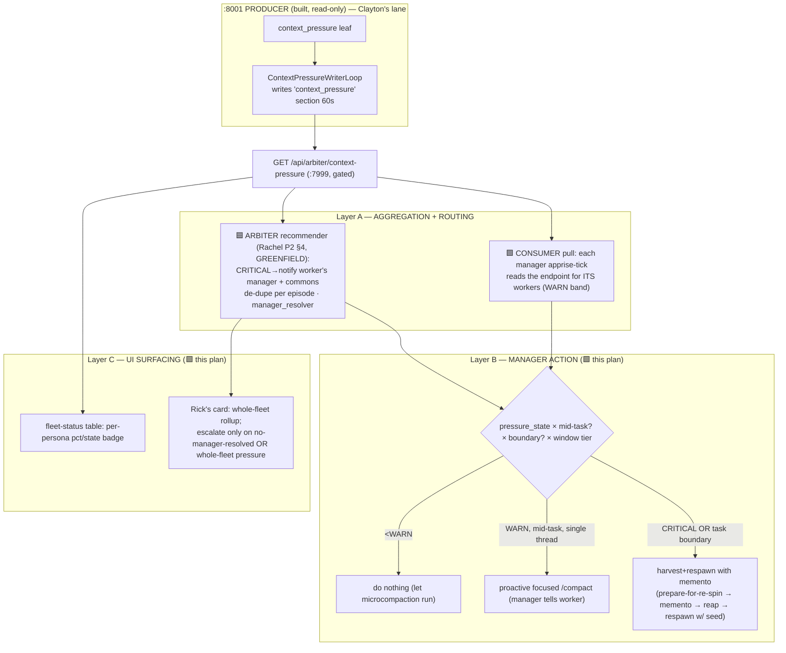

# Context-Pressure USAGE / CONSUMPTION Plan — How the Fleet Acts on WARN / CRITICAL

**Author**: Sam 🎙️ (session `27db6c04`, on Tiberius 👑's SWE crew — manager `5d550c64`)
**Date**: 2026-06-18
**Status**: DESIGN / PLAN ONLY — no code, **no arbiter edits**. Execute-ready spec for the missing consumption half.
**Lane**: parallel to lane 4 (Clayton owns the arbiter producer surface). This plan is the DOWNSTREAM consumer; arbiter-side pieces are flagged as **proposals for Clayton**, not edits I make.

## The gap in one sentence

The **sensor is built** (`context_pressure` leaf + `ContextPressureWriterLoop` publishing a persona-keyed section, live on :8001, read-only). **Nothing consumes it.** WARN(70%)/CRITICAL(85%) numbers are published every 60s and read by no one to drive a compact, a harvest, a respawn, or a UI badge. This plan specifies that consumption layer.

## Primary sources (all read, not reconstructed)

| Artifact | What it gives |
|---|---|
| `src/cosa/agents/heartbeat_arbiter/context_pressure.py` (BUILT+LIVE) | The leaf: per-worker `pressure_state` (OK/WARN/CRITICAL/UNKNOWN), `pct`, `next_prompt_estimate`, liveness (ACTIVE/IDLE/DEAD), and `recommend(liveness, state)` → the one-line manager rec string already in the section. |
| `src/lupin_arbiter_app/context_pressure_writer.py` (BUILT+LIVE) | The producer: `ContextPressureWriterLoop` ticks 60s → leaf → budget transform → persona-keyed `context_pressure` section → `store.set_section`. **Explicitly read-only: "NO commons emission, NO notify."** |
| `src/cosa/rest/routers/arbiter.py:177-223` | The consumer-facing surface: `GET /api/arbiter/context-pressure` (:7999, API-key/JWT-gated) returns the section; it also rides `/api/arbiter/fleet-state`. |
| `2026.06.08-context-pressure-phase2-design.md` (Rachel, DESIGN) §4 | The **recommender** half (CRITICAL→commons `context-harvest-decision` + notify manager, de-dupe per episode). Designed, **NOT built** — the live writer is read-only (Clayton confirmed 2026-06-18: greenfield). Arbiter-side consumption piece = Clayton's lane. |
| `2026.06.09-context-pressure-published-headroom-service-design.md` (Rio) | Persona-keyed read-only headroom service + Rick's 5 locked decisions (budget fractions 1M→50%/200K→75%, expose-both-occupancies, dedicated endpoint, one-writer). |
| `2026.06.08-mementos-vs-compaction.md` (research) | **The policy core**: <WARN do nothing; WARN mid-task→proactive focused `/compact`; CRITICAL **or task boundary**→harvest+respawn-with-memento; tune CRITICAL *below* the ~83.5% autocompact trigger so the controlled harvest wins the race. |
| `CLAUDE.md` § MANAGER SPAWN/HARVEST AUTONOMY + memento workflow (`/plan-memento`, "prepare for re-spin") | Harvest/respawn/compact are **STANDING manager authority** (no Rick gate); the memento is the continuity artifact. |

> **Coordination (brief mandate — coordinate-not-collide).** Clayton owns the arbiter surface (lane 4). I DM'd him (`06a764e5`); he confirmed (`7d3b72fd`): the Phase-2 §4 recommender emission is **NOT built — greenfield** (writer is read-only per `context_pressure_writer.py:9`), and our split is clean (I'm downstream/read-only; lane 4 is the arbiter FP-suppression surface). Every arbiter-side hook below is a **proposal for Clayton/Rachel**, demarcated 🟦 **[ARBITER — Clayton]**. Manager-side + UI consumption is demarcated 🟩 **[CONSUMER — this plan]**.

---

## 1. The producer contract the consumer reads (what's already published)

`GET /api/arbiter/context-pressure` → persona-keyed map. Per persona (ACTIVE+measured): `pressure_state` (OK/WARN/CRITICAL), `pressure_pct`, `occupancy_tokens`, `next_prompt_estimate`, `window_size`, `budget_*`/`headroom_*`, `status` (within/over_budget), `liveness`, `last_turn_age_s`, and `recommendation` (the leaf's `recommend()` string). IDLE/DEAD/UNKNOWN → measurement fields null + status idle/dead/unknown. Plus a `summary` block (counts) and `generated_at` (UTC).

**Two thresholds, two meanings — keep them distinct in the consumer:**
- **`pressure_state` WARN(70%)/CRITICAL(85%) of the RAW window** = the *degradation/autocompact-proximity* alarm. **This drives the act-or-not decision.**
- **`status` within/over the soft *budget* line (50%/75%)** = Rick's *headroom budget* read. This drives UI/reporting, not auto-action (a 1M worker can be "over budget" at 55% yet nowhere near degradation).

The consumer keys its ACTIONS off `pressure_state`; it uses `status`/headroom for human surfacing.

---

## 2. The three consumption layers (Tiberius's named scope)

### Layer A — Aggregation + routing (who gets told what)

The section is a flat per-persona map; consumption needs to route each worker's signal to **the persona accountable for acting on it** = the worker's **manager** (`heartbeat_arbiter/manager_resolver.py`, already exists). Two complementary trigger paths:

- 🟦 **[ARBITER — Clayton] CRITICAL push** (low-latency): the Rachel-P2-§4 recommender — on a worker crossing CRITICAL, the arbiter resolves its manager and `notify()`s + posts the recommendation to commons `context-harvest-decision`, **de-duped once per CRITICAL episode** (track last-emitted state per `session_id` so a parked-at-CRITICAL worker doesn't spam every 60s tick). **Greenfield (Clayton confirmed); lives on the arbiter = Clayton's to implement. Proposal, not my edit.**
- 🟩 **[CONSUMER — this plan] WARN pull** (zero arbiter change): managers already run an apprise-loop. Each tick, a manager `GET`s `/api/arbiter/context-pressure`, filters to the personas it owns (resolved via the lineage manifest it already holds), and reads their `pressure_state`. WARN-band workers get a proactive-compact nudge **without** needing the arbiter to push — the manager is already awake and looping. This is the cheapest path to close 80% of the gap and needs no arbiter code.

**Recommendation: hybrid** — pull for WARN (manager-driven, no arbiter change, ships now), push for CRITICAL (arbiter-driven, low-latency, needs Clayton's recommender). See **DU1**.

**Whole-fleet aggregation**: the consumer also computes a fleet rollup from the `summary` block (how many WARN/CRITICAL across the fleet). A *whole-fleet* pressure spike (e.g. ≥N workers CRITICAL) is a different signal than one hot worker — it escalates to Rick directly (Layer C), because it may mean a coordinated harvest wave is needed and managers themselves may be pressured.

### Layer B — Manager action: the compact-vs-harvest-respawn decision (the heart)

When a manager receives a pressure signal (push or pull) for a worker it owns, it runs this decision — grounded in the mementos-vs-compaction research (§4 policy mapping) and standing manager autonomy:

| Condition | Action | Why |
|---|---|---|
| `pressure_state` < WARN (OK) | **Do nothing.** | Tier-1 microcompaction + tool-result disk-paging run free and cache-friendly below WARN. |
| **WARN (70–85%)**, worker is **mid-task on a single coherent thread** | **Proactive focused `/compact`** — manager DMs the worker to `/compact` now with a focus hint (or lets autocompact ride if the worker is about to idle). | WARN is where compaction's token/latency win is real and fidelity risk lowest; firing proactively (vs waiting for the blind autocompact near the reserve) lets the worker control the focus hint and summarize from higher-signal context. |
| **CRITICAL (≥85%)** OR the worker is **at a task boundary** (lane/phase done), whichever first | **Harvest + respawn with memento** — manager issues "prepare for re-spin" → worker reaches a safe checkpoint + writes its memento (`/plan-memento`) + ACKs "ready" → manager reaps → respawns with `seed_memento`. | At CRITICAL you're near the ~13K autocompact reserve where the blind compaction would fire and "decide for itself" what survives; pre-empt with a controlled harvest where the manager+worker choose what survives (determinism, auditability). At a task boundary the memento's determinism dominates and you get a clean cache reset anyway. |
| Worker is **IDLE** at WARN/CRITICAL | **Defer** — skip pressure action (the leaf already flags IDLE; stale transcript). Reap-with-memento on the normal idle-reap path if no owed work. | Don't harvest a worker that isn't producing turns; its pressure is frozen. |
| **Manager's OWN** pressure hits WARN→CRITICAL (self-pressure) | **Self-harvest via prepare-for-re-spin** *before going dark* — write own memento, hand off, request own re-spawn. | A manager that silently autocompacts mid-coordination can drop fleet state / go dark ([[feedback_dont_park_keep_session_alive_until_done]]). The manager is a worker too; it must retire itself deliberately. See **DU4**. |

**Threshold-tuning note (research §4 / §"tune the trigger"):** the leaf's CRITICAL=85% is of the *raw* window and sits safely below the ~83.5%-of-*effective* autocompact trigger — but on a **1M window** lost-in-the-middle degradation begins long before 85%, so for `[1m]` workers the manager should bias toward **harvest at task boundaries regardless of raw occupancy** (practitioners cap effective working set ~60% on 1M), not wait for 85%. This is why `status`/headroom (Rick's 50% budget line for 1M) is a useful *secondary* nudge for the human even though `pressure_state` drives the hard action. See **DU2**.

**Authority**: every action above is **STANDING manager authority** (compact/harvest/respawn/reap per CLAUDE.md § MANAGER SPAWN/HARVEST AUTONOMY) — no Rick gate, act-then-announce. The only gates remain push-to-origin and shared-infra bounces (unaffected here).

### Layer C — UI surfacing

- 🟩 **Fleet-status table** (already a surface in the arbiter's `fleet_render`): add a per-persona context column — `pct` + a colored `pressure_state` badge (OK/WARN/CRITICAL) + headroom-to-budget. Read-only render of the published section; the data already exists. (If the render lives in `fleet_render.py` on the arbiter, the *render change* is Clayton's lane — flag as 🟦 proposal; if it's a :7999 UI card, it's 🟩 mine.)
- 🟩 **Rick's human card**: a whole-fleet rollup (e.g. "fleet context: 3 OK · 1 WARN · 0 CRITICAL") so Rick sees fleet memory health at a glance, plus a breadcrumb when a CRITICAL harvest fires (act-then-announce visibility).
- **Rick-escalation threshold**: notify Rick directly **only** on (a) no-manager-resolved for a CRITICAL worker (the escalation-ladder fallthrough), or (b) a *whole-fleet* pressure spike (≥N CRITICAL at once). Single hot workers with a live manager are handled manager-first, no Rick noise. See **DU5**.

---

## 3. Decisions for Rick (walkthrough-ready — one-line question + recommended-first options)

### DU1 — Consumption trigger: push, pull, or hybrid?
| Option | Pros | Cons |
|---|---|---|
| **Hybrid: manager-pull for WARN + arbiter-push for CRITICAL [RECOMMENDED]** | WARN closes now with zero arbiter change (managers already loop); CRITICAL gets low-latency push via Clayton's recommender. | Two code paths; CRITICAL path gated on Clayton's lane-4 work. |
| Pull-only (managers poll the endpoint each tick) | Zero arbiter change; ships entirely in the consumer. | CRITICAL latency bounded by the manager's loop cadence (could be minutes); a dark manager misses it. |
| Push-only (arbiter notifies on every threshold crossing) | Lowest latency for both bands. | All of it is arbiter-side (Clayton); more notify traffic; couples WARN handling to arbiter availability. |

**Flip-condition:** hybrid → push-only if manager apprise-loops prove too slow/unreliable to catch WARN in time. **Recommendation: hybrid** — fastest path to value, lowest coupling.

### DU2 — Compact-vs-harvest threshold policy
| Option | Pros | Cons |
|---|---|---|
| **Research hybrid: <WARN nothing · WARN→focused compact · CRITICAL/boundary→harvest+memento · 1M-bias-to-boundary [RECOMMENDED]** | Assigns each mechanism to the regime it dominates; determinism at boundaries; beats blind autocompact. | Most nuanced; needs the manager to know "mid-task vs boundary" + window tier. |
| Always harvest+respawn on WARN+ (never in-place compact) | Maximally deterministic/auditable; one mechanism. | Pays memento + cold re-read every time; throws away compaction's cheap mid-task continuity. |
| Always let native autocompact run (no manager action) | Zero work; nothing to build. | The exact silent-constraint-reversion / mid-task-timing failure the sensor exists to prevent. |

**Flip-condition:** if measured cache-read ratio is high AND workers run long single threads, shift WARN band up and prefer compaction more. **Recommendation: research hybrid.**

### DU3 — Auto-act or recommend-then-manager-acts?
| Option | Pros | Cons |
|---|---|---|
| **Recommend → manager executes at its discretion [RECOMMENDED]** | Manager judges mid-turn-vs-safe-checkpoint before harvesting (never interrupts a mid-turn worker blindly); matches standing autonomy + act-then-announce; the `arbiter context auto handle` flag stays OFF. | A distracted/dark manager may sit on a recommendation (mitigated: arbiter re-emits, and self-pressure rule). |
| Fully automatic arbiter-driven harvest on CRITICAL | No manager-in-the-loop latency. | Blindly harvesting a mid-turn worker can lose its in-flight turn; removes human/manager judgment; bigger blast radius; needs the gated Phase-3 `auto handle`. |

**Flip-condition:** auto-act only if recommend-then-act proves too slow at fleet scale AND the harvest is provably safe mid-turn. **Recommendation: recommend-then-manager-acts** (Phase-3 auto-handle stays gated OFF).

### DU4 — Manager self-pressure handling
| Option | Pros | Cons |
|---|---|---|
| **Manager self-harvests via prepare-for-re-spin before going dark [RECOMMENDED]** | Prevents a pressured manager silently autocompacting mid-coordination and dropping fleet state; the manager retires itself deliberately with a memento. | Manager must monitor its own `pressure_state` in its loop (one extra read of its own persona record). |
| Treat managers like any worker (peer/arbiter harvests them) | Uniform mechanism. | Who harvests the harvester? A manager mid-coordination has no peer watching; risks the dark-manager failure. |

**Flip-condition:** none strong — self-monitoring is cheap. **Recommendation: self-harvest rule** baked into the manager apprise-loop.

### DU5 — UI surfacing scope + Rick-escalation threshold
| Option | Pros | Cons |
|---|---|---|
| **Fleet-table badge + Rick rollup; escalate to Rick only on no-manager-resolved OR whole-fleet spike [RECOMMENDED]** | Rick sees health at a glance without per-worker noise; mirrors the existing escalation ladder. | Needs a render change (possibly Clayton's lane if in `fleet_render`). |
| Full per-worker notify to Rick on every WARN/CRITICAL | Maximum visibility. | Notify flood; violates manager-first routing; TTS-hostile at the fleet's cadence. |

**Flip-condition:** escalate more to Rick only if managers prove unreliable at acting. **Recommendation: badge + rollup, manager-first.**

### DU6 — Ownership split (arbiter vs consumer)
The CRITICAL-push recommender + any `fleet_render` change are **arbiter-side = Clayton's lane**; manager-pull consumption, the compact-vs-harvest decision logic, self-pressure handling, and any :7999 UI card are **consumer-side = this plan's implementers**. **Recommendation: keep the split as drawn; I (Sam) will not edit the arbiter — those pieces ship as proposals Clayton implements.** Coordination DMs exchanged with Clayton (`06a764e5` / `7d3b72fd`): split confirmed clean, recommender confirmed greenfield.

---

## 4. Execute-ready build outline (when Rick ratifies — DESIGN ONLY here)

**Phase U1 — manager-pull WARN consumption (no arbiter change, ships first):**
- A consumer helper (consumer-side module, e.g. under the `heartbeat` hook lib or a manager utility — NOT the arbiter) that `GET`s `/api/arbiter/context-pressure`, filters to owned personas, returns each worker's `pressure_state` + recommendation.
- Wire it into the manager apprise-loop: on WARN → DM the worker a focused-compact nudge; on CRITICAL → run the Layer-B harvest decision; on own-record WARN/CRIT → self-harvest (DU4).
- **Test (this plan's implementer runs all tiers):** unit 100% L/B/F on the filter/decision logic (mock the endpoint payload — OK/WARN/CRITICAL/IDLE/over-budget/null cases, owned-vs-unowned filtering, mid-task-vs-boundary branch, self-pressure branch); smoke on :7999 (read the live endpoint, assert parse); WS-smoke if a UI card lands. **:7999-eligible** (read-only, <2min, no persistent mutation).

**Phase U2 — arbiter CRITICAL push recommender (🟦 Clayton's lane — proposal):** implement Rachel-P2-§4 (resolve manager, notify + commons post, de-dupe per episode). Specified here as the contract; Clayton builds it on the arbiter.

**Phase U3 — UI surfacing:** fleet-table context badge (🟦 if `fleet_render`) + Rick rollup card (🟩). Render-only over the published section.

**Sequence:** U1 first (closes most of the gap, zero arbiter coupling) → U2 (low-latency CRITICAL, Clayton) → U3 (visibility). Each phase independently shippable.

## 5. What this plan explicitly does NOT do
- ❌ No edits to `context_pressure.py`, `context_pressure_writer.py`, the arbiter app, or any :8001/:7999 arbiter code (Clayton's lane — coordinate-not-collide).
- ❌ No flipping of `arbiter context auto handle` (Phase-3 auto-harvest stays gated OFF — DU3).
- ❌ No new producer/section (one writer, one section — Rio Decision 4 holds; the consumer reads what exists).
- ❌ No code in this session — design/plan only, per the re-task brief.

## 6. Open coordination thread
- DM exchange with Clayton (`06a764e5` → `7d3b72fd`): the Phase-2 §4 recommender is **greenfield** (writer is read-only), and the split is clean (I'm downstream/read-only; lane 4 is the arbiter FP-suppression surface). U2 lands as his/Rachel's work, not a collision. Not blocking U1 (consumer-side, independent).
