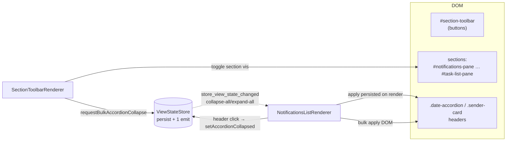

# Mux Section-Toolbar Carbon-Copy + Per-Accordion Collapse Toggle — Design

**Lane:** Mr. Radio 🦉 SWE crew · Implementer **Rachel** 🕊️ · 2026-06-23
**Branch:** `mux-section-toolbar-accordion-toggle` (off `wip-v0.1.9-2026.06.21-bug-fix-implementation` HEAD)
**Store task:** `f6dc0043` · **Origin:** Rick bug report 2026-06-23 (+ follow-up scope expansion)

## Problem (two halves, ship together)

1. **(a) Missing section-toolbar.** The legacy notifications client (`notifications.html:32-61`)
   has a floating `#section-toolbar` — per-section visibility toggles + task-accordion
   collapse-all/expand-all. The multiplexer has **none**.
2. **(b) Dead accordions.** The mux renders `.date-accordion` (`dateAccordion.ts:52-57`)
   and `.sender-card` (`senderCard.ts:157-171`) headers with `role="button"` + a `▼`
   toggle glyph + `data-collapsed="false"` — but **nothing wires the click**.
   `NotificationsListRenderer.attachClickDelegation` (`NotificationsListRenderer.ts:396-416`)
   handles ONLY `.progress-group-toggle`. The chevrons are **pure cosmetic** (confirmed
   dead — not a stale-global onclick like the `freshQueueUI` bite; there is simply no handler).

## Root-cause proof (b)

- The collapse CSS already exists in the **shared sheet**:
  `.date-accordion-messages.collapsed, .date-accordion[data-collapsed="true"] .date-accordion-messages { display:none }`
  (`notifications-surface.css:355-358`). So half (b) is a **missing JS handler only** for
  date-accordions. Sender-cards additionally need a collapse CSS rule (legacy collapses them
  via inline `style.display`, so no shared class exists — added as a mux mechanism).

## Scope decision — layout-mode toggle: **mux-N/A (out of scope)**

The legacy `#section-toolbar` carries a `.layout-mode-btn` (`⇆`) as its first child. The mux
**already ships that exact control**, standalone and fully wired, in `#reading-pane-toolbar`
(`multiplexer.html:51-57`) backed by `ReadingPaneStore` (`lupin:reading-pane:*`). Carbon-copying
it into the new toolbar would **duplicate a working control** — a regression. **Decision
(Mr. Radio-ratified):** leave the existing `⇆` as-is; do NOT relocate it. The new `#section-toolbar`
carries ONLY collapse-all/expand-all + the 6 per-section visibility toggles. Functional parity
with legacy = **one** layout toggle.

## Architecture

- **`ViewStateStore`** — pure state + `StorageService` persistence. Two maps:
  `sectionVisibility` (`view_state_section_visibility`, default *visible*) and
  `accordionCollapsed` (`view_state_accordion_collapsed`, default *expanded*). Section + accordion
  setters persist silently (the owning renderer applies DOM directly). The ONE cross-renderer
  signal is `requestBulkAccordionCollapse(collapsed)` → emits `store_view_state_changed`
  (`changeKind: "collapse-all" | "expand-all"`), which `NotificationsListRenderer` consumes to
  flip every accordion. (Avoids an N-emit storm on bulk.)
- **`SectionToolbarRenderer`** — builds `#section-toolbar`, owns the **section** DOM (top-level
  panes). Delegated clicks (NO inline onclick): `.section-toolbar-btn[data-section]` → toggle
  section `.section-hidden` + button `.active` + persist; `#section-toolbar-collapse-all` /
  `-expand-all` → `store.requestBulkAccordionCollapse(true/false)`. Applies persisted section
  visibility on mount.
- **`NotificationsListRenderer`** (extended) — owns ALL accordion DOM. Click delegation extended
  for `.date-accordion-header` + `.sender-card-header` → toggle that accordion (compute stable id,
  `store.setAccordionCollapsed`, flip `data-collapsed` + glyph). On render, applies persisted
  collapse per accordion. Subscribes to `store_view_state_changed` for the bulk collapse/expand.

### Stable accordion ids (persistence keys)
- sender-card: `sender::<sender_id>` (from `.sender-card[data-sender-id]`).
- date-accordion: `date::<sender_id>::<date_key>` (closest `.sender-card[data-sender-id]` +
  `.date-accordion[data-date-key]`). Stable across keyed re-renders.

### Collapse behavior (carbon-copy of legacy `toggleDateAccordion` / `toggleSenderCard`)
- date-accordion: `data-collapsed="true"` on `.date-accordion` (hides `.date-accordion-messages`
  via existing shared CSS), glyph `▼`→`▶`.
- sender-card: `data-collapsed="true"` on `.sender-card` (new mux CSS hides `.sender-card-dates`),
  glyph `▼`→`▶`. Matches legacy (hides only the dates region, not the voice-input row).

## CSS sourcing (parity-true, no fork drift)
- **Shared sheet** (`css/shared/notifications-surface.css`): the parity-true **button appearance**
  rules carbon-copied byte-faithfully from legacy (`.section-toolbar-btn` ≈ legacy `.toolbar-btn`,
  `.active`/hover states; the accordion-action button ≈ legacy `.task-accordion-btn`). Legacy is
  unaffected (its monolith links AFTER + wins; rules are identical).
- **Mux sheet** (`css/multiplexer/section-toolbar.css`): the `#section-toolbar` **container**
  (horizontal top-bar — mirrors legacy *horizontal-mode* `.section-toolbar`, the layout that fits
  the mux two-pane shell; legacy's vertical `position:fixed` is bound to its 1000px centred
  container and does not port) + `.section-hidden`.
- **Mux list sheet** (`css/multiplexer/notifications-list.css`): `.sender-card[data-collapsed="true"]
  .sender-card-dates { display:none }` (sender-card is a mux mechanism — legacy uses inline style).

## Gates
- 100% c8 lines+branches+functions on all changed/new `.ts` (`pragma` only for genuinely-unreachable
  + same-line reason). `tsc --noEmit` clean. eslint clean (no-globals / no inline onclick).
- Unit: `ViewStateStore` (defaults, toggle/persist round-trip, hydrate, bulk emit), 
  `SectionToolbarRenderer` (build, each section toggle, collapse/expand-all, persisted apply on mount),
  `NotificationsListRenderer` accordion toggle (date + sender header click, persisted-apply-on-render,
  bulk collapse/expand).
- E2E (Playwright): collapse-all/expand-all, each section toggle, per-accordion header-click toggle,
  AND a persistence round-trip (toggle → reload → state restored).

Commit-HELD on the branch; Mr. Radio reviews → merges. No push.
