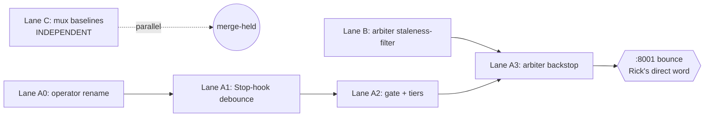

# Mr. Radio's Lane — Build Plan: Proactive-Manager Mechanism + Arbiter-Staleness + Mux-Baselines

**Date**: 2026-06-23 · **Manager/owner**: Mr. Radio 🦉 (session bbb83a10) · **Status**: 🏗️ BUILD IN PROGRESS — 3 authors live (Lanes A/B/C); plan sanity-checked vs design by María 🌸
**Branch**: `wip-v0.1.9-2026.06.21-bug-fix-implementation` (HEAD `5c371a05`)
**Mandate**: Rick's board-completion re-spin (2026-06-23) — "close completables, then drive ALL outstanding work; workers build, not me."

> This is the umbrella plan for the **three composing items** that fell to my lane after manager
> coordination (Tiberius handoff DM `afd466a5`; María steward handoff DM `9b2e7d88`). Each lane below is
> independently shippable; Lanes A and B compose at the arbiter backstop. Execution log → `90-execution-log.md`.

---

## 0. Lane summary + ownership

| Lane | Store id | Pri | Item | Design-of-record | Review routing |
|---|---|---|---|---|---|
| **A** | `fcb5dbc0` | P1 | Proactive-manager mechanism (Stop-hook debounce + operator-gate queue + 3 urgency tiers + arbiter dark-session backstop) + **operator rename** (folds in `47ba26fd`) | María's `planning-is-prompting/src/rnd/2026.06.23-proactive-manager-doctrine-and-mechanism.md` (DESIGN COMPLETE, 5/5 + rename) | fresh-critical reviewer (my crew) |
| **B** | `bc1bc373` | P2 | Arbiter staleness-filter: dead/expired/`work_owed=false`/past-`next_chase` holds OUT of bridge-graph edge inference | María DM `9b2e7d88` + task body | **María** (reproduce-not-trust) before merge |
| **C** | `6ca79dc2` | P2 | Mux visual-snapshot baselines can't reach clean-green on `:8000` — commit baselines to a **tracked dir** | María DM `9b2e7d88` (design call: commit, NOT bind-mount) + task body | **María** (reproduce-not-trust) before merge |

**Not in this lane** (María keeps): `47ba26fd` title-hygiene half (deferred, low-value), `18eebb46` receipt-whitelist (P3, she'll quick-spec, sequenced last). The **operator rename half of `47ba26fd` rides Lane A** — single build, no separate crew (María's call, avoids double-build collision).

**Standing rules honored**: commit + merge are STANDING after green+reviewed; **PUSH is Rick's word alone** (never surfaced as a prompt). The shared **`:8001` arbiter bounce** is **Rick's direct word — non-launderable** (NOT manager authority; neither a manager nor a peer relay can authorize it): surfaced to Rick when due, sequenced behind any in-flight arbiter work, with **Tiberius looped for awareness only** (not authorization).

---

## 1. Lane A — Proactive-manager mechanism (`fcb5dbc0`, P1)

Design is COMPLETE (María, 5/5 decisions + rename). This is the lupin **build** breakdown. Code home: lupin Stop-hook (`heartbeat_work_owed.py` / `stop.py`) + `:8001` arbiter. Reuse — do not reinvent — the receipts-of-progress debounce (`6929f4ac`, the `last_looked_in_on_workers_ts` throttle) and the `pending_user_gates` / `outstanding_user_gate` work-owed signal already shipped.

### Phase A0 — `operator` rename (foundational, do first)
Rename `gate_class` value `ricks_court` → `operator` everywhere (one-name-everywhere; **no compat shim/alias** per Rick's contract rule).
- Store `gate_class` enum + any validator/migration for the value.
- Every code site filtering/minting `ricks_court` (grep parent + `src/cosa`).
- Doctrine docs referencing `ricks_court` (coordinate the planning-is-prompting doc edits with María — cross-project; this lane edits **lupin** sites only).
- Global memory line (flag to Rick/me for the auto-memory edit).
- **AC-A0.1**: `grep -rn "ricks_court"` over lupin returns **zero** code hits (docs/historical excepted, called out).
- **AC-A0.2**: `task_query(gate_class=operator)` resolves; the retired value 422s or is rejected per the store's enum policy.
- **Tests**: unit on the enum + every changed filter; 100% L/B/F on changed modules.

### Phase A1 — Stop-hook debounced self-check (Face A + Face B)
Two per-manager timestamps, persisted in per-session state that **survives `/clear`**: `last_spinup_check_ts` (Face A), `last_surfaced_questions_ts` (Face B). On each Stop, the work-owed oracle does a debounced elapsed-check (generalize the `6929f4ac` pattern):
- **Face A (nudge DOWN)**: `elapsed ≥ T_spinup` AND backlog `≥ N` AND idle crew capacity → NAME owed work "big backlog, no active crew → consider spinning up a crew." Manager **decides + acts of its own accord** (nudge, not auto-spin). Backlog source = `task_query(accountable_manager=me, status in {queued,in_progress})`.
- **Face B (surface UP)**: `elapsed ≥ T_surface` AND open `operator` gates → re-fire the operator-gate asks.
- **Both under threshold** → rest, no poke.
- Thresholds **INI-configurable**, per-face (mirror `T_escalate`; default ~10 min). Add keys to `lupin-app.ini [Lupin: Baseline]` + splainer.
- **AC-A1.1**: a Stop with `elapsed ≥ T_spinup` + backlog≥N + idle capacity names the spin-up nudge exactly once until acted/timestamp-bumped.
- **AC-A1.2**: a Stop with `elapsed < threshold` produces **no** poke (debounce honored).
- **AC-A1.3**: timestamps survive a simulated `/clear` (persisted to per-session state, not in-memory).
- **Tests**: unit for both faces + threshold boundaries (`<`, `=`, `>`) + debounce persistence; integration on the Stop-hook owed-work path.

### Phase A2 — Gate minting + urgency tiering (D3 + D4)
Every user-blocking question → a typed `operator` gate in the store at mint time, carrying an **`urgency`** dimension (NOT the `priority` importance field): `urgent` | `normal` | `low`, **default `normal`**.
- Arbiter as **single pusher**: `urgent` → push immediately (interrupt); `normal` → batched digest (INI cadence); `low` → sits until pulled.
- Answer-routing-back: human answers once → gate clears → asking session (woken if parked) receives answer + stops re-surfacing.
- **AC-A2.1**: minting an `operator` gate defaults `urgency=normal`; explicit tiers round-trip.
- **AC-A2.2**: tier→push routing is exact (urgent immediate / normal digest / low queue-only) — unit-proven on the arbiter pusher.
- **AC-A2.3**: gate-clear wakes the parked asking session and halts re-surface.
- **Tests**: unit on tier routing + gate lifecycle; integration on mint→push→clear.

### Phase A3 — Thin arbiter backstop (D1) — **DEPENDS ON Lane B**
`:8001` arbiter resurfaces aged `operator` gates + flags an idle-manager-sitting-on-backlog, **for the dark-session case only** (a manager that never reaches a Stop). Extends the existing case-18 dark-session resurface from dark-only to all open gates.
- **Hard dependency**: the backstop is only trustworthy once **Lane B** (`bc1bc373`) lands — a dead/stale hold must not feed a phantom edge that the backstop then escalates (design §6). Sequence A3 **after** B.
- **Shared-infra `:8001` restart**: **Rick's direct word — non-launderable** (NOT manager authority; neither a manager nor a peer relay can authorize it). Surfaced to Rick for his direct word, sequenced behind any in-flight arbiter work, with **Tiberius looped for awareness only**.
- **AC-A3.1**: an aged open `operator` gate from a dark session is resurfaced exactly once per cadence.
- **AC-A3.2**: no escalation fires off a hold that Lane B's predicate marks dead/stale (regression guard tying A3 to B).
- **Tests**: arbiter unit + live `:8001` verify (after bounce).

### Phase A4 — Doctrine (D5) — **planning-is-prompting lane, coordinate with María**
D5 gate-minting classification (blast-radius + when-uncertain-surface) lands in `workflow/manager-autonomy.md` + `workflow/task-store-discipline.md`. This is María's doctrine home — **the lupin build enforces** the tier + gate lifecycle; the prose is a cross-project handoff to María (handoff doc per the cross-project rule). Not gating Lanes A0–A3.

---

## 2. Lane B — Arbiter staleness-filter (`bc1bc373`, P2)

Add a **staleness predicate on hold ingestion** so expired / `work_owed=false` / past-`next_chase` holds **cannot contribute to any inferred edge** (blocked-edge, deadlock, manager-blocking advisory) in the arbiter's bridge graph. This kills the phantom "mr radio blocking Tiffany" / "DEADLOCK Tiffany→mr radio" loop durably (replaces my per-incident hand-sweep).
- **GUARDRAIL (María)**: do **NOT** touch the deployed deadlock path `4ed948c7` (cycles=0, verified). **Additive predicate only** — filter the hold inputs upstream of edge inference.
- **AC-B.1**: a hold that is expired / `work_owed=false` / past `next_chase` contributes **zero** inferred edges (unit-proven on the ingestion filter).
- **AC-B.2**: a live, honored, work-owed hold still contributes its edge (no over-filtering regression).
- **AC-B.3**: the deployed deadlock-on-store-`blocked_by` gate (`436a366b`) behavior is unchanged (regression guard).
- **Tests**: unit on the predicate truth table (each staleness axis × live/dead) + edge-contribution assertions; arbiter integration. 100% L/B/F on changed modules.
- **Review**: route review-request → **María** (reproduce-not-trust) before merge.

---

## 3. Lane C — Mux visual baselines tracked-dir (`6ca79dc2`, P2)

Mux playwright visual-snapshot baselines live under gitignored `io/test-suite/visual-baselines/` and don't round-trip into the containerized test-runner → every mux visual test ERRORs ("New snapshot(s) created. Please review") and a re-run never clears it. Functional E2E is unaffected (green).
- **Design call (María)**: **commit the baselines to a version-controlled / tracked dir** (the CI-portable fix matching the stated goal) — **NOT** the bind-mount option (which only fixes the local container).
- Crew **confirms the target dir + `.gitignore` carve-out** (a tracked subtree under the e2e fixtures, e.g. alongside `src/tests/e2e_ui/fixtures/`, vs. the gitignored `io/` pixel store) and the playwright-visual-snapshot wiring that reads it.
- **AC-C.1**: mux visual tests find their baselines inside a fresh `:8000` container (no host-resident dependency) → **no teardown ERROR**.
- **AC-C.2**: the chosen dir is git-tracked; the `.gitignore` carve is scoped (doesn't un-ignore the pixel `io/` store).
- **AC-C.3**: a `:8000` scheduled run of the mux visual suite reaches clean-green (submit via `/api/test-suite/submit`; self-authorized on verified-idle).
- **Tests**: the suite itself is the proof; add a smoke assertion that baselines resolve container-side. Eyeball the rebaseline (subjective — name it, ask Rick if a visual judgment is required).
- **Review**: route review-request → **María** (reproduce-not-trust) before merge.

---

## 4. Dependencies, sequencing & crew

**Sequencing**:
1. **Lane C** — fully independent, smallest; spawn first / in parallel.
2. **Lane B** — foundation for A3; spawn in parallel with C.
3. **Lane A0 → A1 → A2** — proactive-mechanism core; can run while B/C proceed.
4. **Lane A3** — only after **B lands**; carries the `:8001` bounce (**Rick's direct word, non-launderable**; Tiberius looped for awareness only; sequence behind in-flight arbiter work).
5. **Lane A4** — doctrine handoff to María (non-gating).

**Crew (cap-8 fleet bound; currently ~4 live: me, Tiberius, María, Tiffany → room for ~4 workers)**:
- 1 author for **Lane C** (small, independent) — fast win.
- 1 author for **Lane B** (focused arbiter predicate).
- 1 author for **Lane A** (the multi-phase core; seed with María's design doc).
- Reviewers: María does B + C design-review (reproduce-not-trust); spawn 1 fresh-critical reviewer for Lane A at green. Stay under the cap — stagger reviewer spawns after authors reach green; reap idle workers with mementos.

**Testing venues** (per §TESTING VENUES): unit + inline smoke on `:7999` (AI-discretionary); the mux visual suite + any integration on `:8000` (scheduled, self-authorized on verified-idle, submit via `/api/test-suite/submit`). 100% coverage mandate (lines+branches+functions) on all changed modules.

---

## 5. Gates & done-definition
- Each lane: green (100% L/B/F) → reviewed (María for B/C; fresh-critical for A) → **commit + merge-held** (`--no-ff`, NO push) on `wip-v0.1.9-2026.06.21-bug-fix-implementation`.
- `:8001` bounce only after Lane B + A3 green — **Rick's direct word (non-launderable)**, surfaced to Rick, **Tiberius looped for awareness only**, sequenced behind in-flight arbiter work.
- **PUSH** of the held stack stays **Rick's word alone** — surfaced as status, never as a prompt.
- Store: each item `→ done` with receipts (commit + test_run) only after merge-held + review APPROVE.
