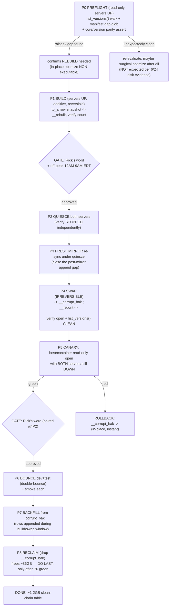
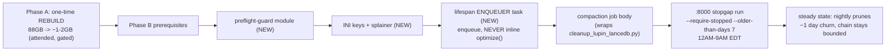

# LanceDB `input_and_output_tbl` 88 GB Bloat + Manifest-Chain Incident — Post-Mortem & Remediation Runbook

**Date**: 2026-06-24
**Author**: synthesis session (Claude Code, read-only forensic corpus + live disk inspection)
**Scope**: `src/conf/long-term-memory/lupin.lancedb/input_and_output_tbl.lance`
**Version line**: v0.1.9
**Status**: ⛔ **NOTHING DESTRUCTIVE HAS BEEN EXECUTED.** This document is a plan only. Every irreversible step below is **human-gated** (Rick's explicit word) and venue-bound. No DB mutation, no `git commit`, no server bounce has been performed by the authoring session.

> **READ THIS FIRST — the headline finding overturns the brief's premise.**
> The task brief's ground truth said *"BLOATED, not (necessarily) corrupt this time."* **Live disk inspection on 2026-06-24 contradicts that.** The version chain references manifests that are **absent from disk** (see § 1.4). The recommended path is therefore **NOT** the consensus's surgical `optimize()` — it is a **REBUILD** that reads the live data into a fresh table and abandons the broken chain. The judge consensus and two of three skeptics built their reasoning on the bloat-only premise; the third skeptic (Skeptic 3, verdict `unsafe`) was correct, and disk evidence here corroborates it independently. This doc adopts Skeptic 3's pivot as the spine and grafts the consensus's safety scaffolding onto it.

---

## 0. TL;DR (for the human)

- One LanceDB table, `input_and_output_tbl.lance`, is **88 GB** — of which only **~1.4 GB is live data**; the rest (~86 GB) is an uncompacted, partially-broken version chain (41,237 manifest files measured 2026-06-24).
- It is **not merely bloated — the chain head references manifests that do not exist on disk** (the top manifest present is `...518748`, but the chain points ~268 versions higher to manifests that are absent). This is the **same failure CLASS as the 2026-05-29 incident**, and is what an in-place `optimize()` would crash on.
- The table **still opens and reads its CURRENT data fine** (restored verbatim from the DATA02 mirror after last night's incident). The corruption is in the *historical version chain*, not the live rows.
- **Recommended fix**: a **staged REBUILD** (snapshot live rows → fresh single-fragment table → swap → bounce → backfill → reclaim), run **inside the server container** (not the host venv), with the DATA02 mirror as the outer net. Expected: **88 GB → ~1–2 GB**, ~86 GB reclaimed (precedent: 2026-05-29 took the same table 82 GB → 679 MB).
- **Recurrence prevention**: a **standing nightly compaction job** stood up *after* the one-time rebuild (durable in-app, off-peak, scheme-preflight-gated). This is the cadence three one-time firefights never installed.
- **All destructive steps are human-gated.** Disk is at **99 % used / 21 G free on DATA01** — this constrains rollback and is a hard precondition.

---

## 1. Incident Post-Mortem (2026-06-23)

### 1.1 What was attempted

During the 2026-06-23 outage, `input_and_output_tbl` had grown to ~80–88 GB across ~100k uncompacted versions. A recovery was attempted using a **fork of the canonical rebuild tool**, `src/scripts/lancedb_incident_recovery_2026_06_23.py` (created live by Mr. Radio), which adds four emergency phases (`promote-rebuilt`, `drop-husk`, `restore-from-backup`, `verbatim-restore-db`) to the canonical 5-phase `rebuild_lancedb_table.py`.

### 1.2 What failed — the V1/V2 manifest trap (root cause)

Per the fork's own header (`lancedb_incident_recovery_2026_06_23.py:13-19`):

- The **host venv** ran `lancedb 0.23.0 / lance ~0.29`, which writes **V1 manifests**.
- The **server container** ran `lance 4.0.0`, which writes **V2 manifests**.
- A host-venv lance-API operation (build/swap/promote) wrote a **V1 manifest into a table the container served as V2** → **mixed manifest schemes in one table** → **both REST servers crash-loop on open**.

The manifest's scheme (V1 vs V2) is determined by **which lance binary writes it**. The trap has exactly three ingredients, all of which must be present to re-trigger it:

1. a **second writer** at a different lance version than the server, **or**
2. a **cross-version handoff** (one version writes, another reads), **and**
3. a write operation that **mints a fresh manifest** (rebuild's `create_table`, or a host-venv `optimize()`).

### 1.3 How it ended

The incident was resolved by **restoring the table verbatim from the DATA02 backup mirror** (`/mnt/DATA02/include/www.deepily.ai/projects/lupin/src/conf/long-term-memory/lupin.lancedb`). This brought the table back to an **openable-but-still-88 GB** state. No leftover incident artifacts remain on disk (no `*__broken_husk.lance`, `*__corrupt_bak.lance`, `*__rebuilt.lance`, no `-quarantine` dir) — last night's recovery cleaned them. **The 88 GB bloat was re-imported with the restore** — restoring from the mirror reclaimed zero bytes.

### 1.4 ⚠️ Disk-evidence finding (2026-06-24): the chain is BROKEN, not merely bloated

Strictly read-only inspection of `_versions/` on 2026-06-24:

| Observation | Measured value |
|---|---|
| Manifest files in `_versions/` | **41,237** |
| Highest manifest present on disk | `18446744073709518748.manifest` |
| Conflict marker present | `18446744073709487463.manifest#1` (one, alongside its base `...487463.manifest`) |
| Manifest the 6/23 error stack referenced as missing | `18446744073709519016.manifest` → **ABSENT from disk** |
| Versions referenced above the top manifest present | **~268** (519016 − 518748) |
| `_versions/`, `data/`, `_transactions/` mtime | **2026-06-24 10:17** — i.e. the table is **actively being appended right now** (voice path on :7999) |

**Interpretation**: the chain references ~268 versions whose manifests are not on disk (the highest present is `...518748`; the head points to `...519016`-class). A `list_versions()` / `optimize()` history walk **will trip** on the first missing manifest — exactly the 2026-05-29 failure mode. The lone `*.manifest#1` conflict marker (a V2 naming-conflict residue) is a *separate, secondary* hazard the judges fixated on; the **primary** hazard is the **missing** manifest, not the conflict marker.

> **DbC — incident invariant (violated)**: *Ensures: for every version V in the chain head's lineage, `_versions/<V>.manifest` exists on disk.* This invariant is currently **FALSE**. Any tool that assumes it (in-place `optimize()`) is non-executable against this table.

### 1.5 Why this matters for the fix

- **In-place `optimize(cleanup_older_than=...)` is OFF THE TABLE** for the one-time reclaim: it walks the same broken chain and raises, just like 5/29. The judge-consensus PRIMARY (surgical compaction) is **non-executable here**.
- The viable path is the **REBUILD**: read the *latest-version live data* via `to_arrow()` into a fresh single-fragment table, **leave the broken chain behind**, swap, bounce, backfill, reclaim. This is what `rebuild_lancedb_table.py` was built for (its header: *"optimize() trips on a missing/shifting `_versions/NNNNN.manifest`"*).
- The DATA02 mirror is a **verbatim copy of the same broken chain** — it is a **row-data source** (latest-version snapshot), **NOT a clean-chain restore target**. Restoring from it re-imports the break and reclaims nothing.

---

## 2. The Version-Trap Doctrine (pinned rule)

> **DOCTRINE — who may EVER touch `input_and_output_tbl` with the lance API.**
>
> **Only a process whose lance binary writes the SAME manifest scheme the serving containers read may perform any lance-API write (build / swap / create_table / optimize) against this table.**

### 2.1 Pinned versions (verify at run time, do not trust this doc's snapshot)

| Surface | lancedb | pylance / lance (Python wrapper) | Manifest scheme |
|---|---|---|---|
| Host venv | `0.30.2` (measured 2026-06-24) | `0.36.0` | V2 (reported) |
| `lupin-rest-dev` container (:7999) | `0.30.2` | `0.36.0` | V2 |
| `lupin-rest-test` container (:8000) | `0.30.2` | `0.36.0` | V2 |

The 6/23 host-vs-container **skew has been reconciled** in the *currently measured* environment (uniform `0.30.2 / 0.36.0`). **BUT** — Skeptic 3 raised an unresolved caveat that this doctrine treats as binding:

> **CAVEAT (must verify before any host-venv write)**: the manifest scheme is set by the **Rust `lance-table` CORE**, not the Python wrapper version. The 6/23 live error stack showed core `lance-table 4.0.0`. `pip show` reporting wrapper `0.36.0` everywhere does **not** prove the host venv's bundled Rust core equals the container's core. **Until the core is verified equal, prefer running every lance-API write IN-CONTAINER (`docker exec lupin-rest-test`), not the host venv.**

### 2.2 The rule, operationally

1. **Default venue for any lance-API write = `docker exec lupin-rest-test`** (the monopolizable test container). The `./src` bind-mount is **rw** and inode-identical to the host live tree, so the container writes the same bytes — no copy, no path divergence — and it is provably the V2 core the dev server also runs.
2. **Never** run a lance-API build/swap/create_table/optimize from the **host venv** unless `lance.__version__` AND the underlying Rust core are asserted equal to the container at run time, printed before the step.
3. `rename_table` is `NotImplementedError` on LanceDB OSS — the swap is a **non-atomic FS dir-rename**, with a documented **husk-on-ENOTEMPTY** failure (6/23). Treat the swap window as the single most dangerous moment.
4. Filesystem-only phases (`restore-from-backup` copytree, `verbatim-restore-db` rsync) are **version-agnostic-safe** — they never touch the lance API. Their *trailing verify* (which opens the table) is the only version-sensitive part.

---

## 3. Recommended Remediation — Staged, Dry-Run-First, Verify-Gated REBUILD

**Executable**: the **canonical** `src/scripts/rebuild_lancedb_table.py` (reverted to pre-incident state, version-controlled), **NOT** the untracked fork — unless a phase the fork uniquely provides is needed (then run *that phase* in-container; see § 6).

**Venue**: `docker exec lupin-rest-test python /var/lupin/src/scripts/rebuild_lancedb_table.py --phase 
` for every lance-API phase. Rationale: container core is the verified V2 writer; bind-mount is inode-identical; using the **test** container (not dev) keeps the live voice path on :7999 untouched during the additive `build` phase.

**Outer net**: the DATA02 mirror — but as a **row-data source only**, not a clean-chain restore target (§ 1.5). The instant in-place net during the swap window is `__corrupt_bak` (retained until `reclaim`).

### 3.1 Flow

### 3.2 Step-by-step (DbC framing; destructive steps flagged 🔴)

#### P0 — Preflight integrity probe (read-only, servers UP) — **HARD GATE**
- **Requires**: live table readable; both containers up.
- **Action**: from the container, attempt `t.list_versions()` (the missing-manifest detector); glob `_versions/` for any `*.manifest#<N>` conflict marker AND for chain-head manifests absent on disk; assert host==container `lance.__version__` **and** Rust core.
- **Ensures**: if `list_versions()` raises OR a referenced manifest is absent → **confirm REBUILD path** (do NOT attempt in-place `optimize()`). If it unexpectedly walks clean → reconsider (not expected per § 1.4).
- **Destructive**: NO. **Rollback**: n/a.
- **DbC**: *Ensures: no irreversible step runs until the chain state is empirically classified.*

#### P1 — Build (servers UP, additive, reversible)
- **Requires**: P0 classified REBUILD; `__rebuilt` does not exist (or is dropped first).
- **Action**: `--phase build` — snapshot-read all rows at the latest *readable* version via `to_arrow()`, create `<table>__rebuilt` (overwrite), verify row count matches the live snapshot.
- **Ensures**: a fresh single-fragment V2 table exists alongside the live one; live table untouched.
- **Destructive**: NO (additive). **Rollback**: drop `__rebuilt`.
- **Risk**: if `to_arrow()` trips on the broken chain, fall back to snapshotting from the DATA02 mirror's *latest readable version* (still a broken-chain source, but its head may differ) OR from a pinned-version read. If neither reads, escalate to Rick.

#### 🔴 GATE 1 — Rick's explicit word for the server stop, in the **12 AM–9 AM EDT off-peak window**.
- Stopping :7999 takes the **voice path dark** — user-visible, **NOT self-authorizable**. Pair this gate with GATE 2 (restart).

#### P2 — Quiesce both servers (verify independently)
- **Requires**: GATE 1 approval.
- **Action**: stop `lupin-rest-dev` and `lupin-rest-test`. **Independently verify** with your own `docker ps` that both are ABSENT, AND check no host python process holds the `.lance` dir open (`lsof` / `pgrep`). Do **NOT** rely on the cleanup tool's `--require-stopped` (it fails OPEN on a `docker ps` error — § 5).
- **Destructive**: service-state only (reversible). **Rollback**: restart servers.

#### P3 — Fresh mirror re-sync under quiesce
- **Requires**: both servers verified stopped.
- **Action**: re-sync the DATA02 mirror from the now-quiesced live table (verify `du` parity + a read), closing the gap between the last mirror sync and the live appends (the table was appending at 10:17 on 6/24).
- **Ensures**: the outer net covers the rows that exist at swap time.
- **Destructive**: overwrites the mirror (the mirror is on the dedicated DATA02 drive, 3.3 T free). **Rollback**: the bloated live table is still present until P4.
- **Note**: per house policy backups go ONLY to the dedicated drive — DATA02 is correct.

#### 🔴 P4 — Swap (THE IRREVERSIBLE MOMENT)
- **Requires**: P1 `__rebuilt` verified; P2 quiesce verified; P3 mirror fresh.
- **Action**: `--phase swap` — rename `<table>` → `<table>__corrupt_bak` (drop any stale bak first), rename `<table>__rebuilt` → `<table>`. Verify the new `<table>` opens, counts match, and `list_versions()` is **CLEAN**.
- **Ensures**: live slot now holds the fresh clean-chain table; the broken 88 GB chain is preserved in `__corrupt_bak` (instant rollback).
- **Destructive**: 🔴 YES — non-atomic FS dir-renames; husk-on-ENOTEMPTY possible (6/23).
- **Rollback**: rename `__corrupt_bak` → `<table>` (in-place, instant, no copy — fits the 21 G ceiling because it's a rename not a copy). If the swap left a husk, the fork's `promote-rebuilt`/`drop-husk` phases exist for exactly this — run them **in-container**.

#### P5 — Canary: read-only open with BOTH servers still DOWN — **NON-SKIPPABLE**
- **Requires**: P4 done.
- **Action**: open the new `<table>` read-only from the container's lance, confirm a row-count + `list_versions()` read succeeds, **before restarting any server**.
- **Ensures**: the only empirical guard against a "lying version string" producing a server-unreadable scheme. If RED → roll back via `__corrupt_bak` rename, do NOT bring servers up.
- **Destructive**: NO. **Rollback**: `__corrupt_bak` rename.

#### 🔴 GATE 2 — Rick's word to restart (paired with GATE 1).

#### P6 — Double-bounce dev + test, smoke each
- **Requires**: P5 green + GATE 2.
- **Action**: bring both containers up so each reopens the fresh table; run a table-touching read on each.
- **Ensures**: no server holds a freed inode handle; both serve the clean table.
- **Destructive**: service-state only. **Rollback**: re-bounce; if crash-loop, stop both + restore `__corrupt_bak`.

#### P7 — Backfill from `__corrupt_bak`
- **Requires**: P6 green.
- **Action**: `--phase backfill` — append rows written to the OLD table during the build/swap window (now in `__corrupt_bak`), selected by `(date, time)` strictly greater than the snapshot's max. Makes the rebuild lossless for the append-only log.
- **Destructive**: additive to the new table. **Rollback**: n/a (additive).

#### 🔴 P8 — Reclaim (frees ~86 GB) — **DO LAST**
- **Requires**: P6 green AND P7 done. **Defer a day if any doubt.**
- **Action**: `--phase reclaim` — drop `<table>__corrupt_bak`.
- **Ensures**: ~86 GB freed on DATA01.
- **Destructive**: 🔴 YES — destroys the instant-rollback substrate. After this, the ONLY net is the DATA02 mirror (which is a broken-chain row source). **Rollback**: restore from DATA02 mirror **via `create_table`-from-snapshot (lands ~1.4 G live data only)** — NEVER `copytree` the 88 G mirror onto 21 G-free DATA01 (§ 5).

### 3.3 Reclaim estimate

**~86 GB reclaimed: 88 GB → ~1–2 GB.** `_versions/` is ~86 GB of stale/broken manifests; `data/` is only ~1.4 GB live. Precedents: 2026-05-29 same table **82 GB → 679 MB** (101,521 rows preserved); 2026-04-27 **43 GB → 620 MB**. DATA01 free goes from **21 G (99 %)** to **~107 G**.

---

## 4. Recurrence Prevention — Standing Nightly Compaction (Phase B)

The 88 GB regrew because there is **no compaction cadence**: an append-only log with no scheduled `optimize()` regrows unbounded (43 G by 4/27, 82 G by 5/29, 88 G by 6/23 — a recurring ~few-week doubling). The rebuild **reclaims but does not prevent** — Phase B is the cure.

### 4.1 Sequencing: Phase B lands AFTER Phase A is green
Phase B's first nightly run must operate on the **already-rebuilt clean-chain ~1–2 GB table** — never against the broken 88 GB monster (it would raise on the missing manifest every night). The heavy first reclaim is the **attended, version-hand-verified Phase A rebuild**, not an unattended maiden flight.

### 4.2 Design (discharges TODO debt 461/462/1668/1745)

- **Primary (TODO.md:1745)**: a FastAPI **lifespan background task** (alongside `clock_loop`/`websocket_heartbeat_loop`/`websocket_cleanup_loop` at `main.py:388`), behind a new INI key. **CRITICAL CONSTRAINT**: the lifespan task **ENQUEUES** a `--require-stopped` quiesced compaction job — it **MUST NOT call `optimize()` in-process** while the server holds the table open (that is the active-writer hazard `--require-stopped` exists to prevent). Annotate loudly in code + this doc so a future "simplifier" cannot inline it.
- **Operational stopgap (TODO.md:1668)** until the durable recurring-job mechanism (TODO.md:461/462 "first durable client") ships: a `:8000` schedulable job wrapping `cleanup_lupin_lancedb.py`, submitted via `POST /api/test-suite/submit` with `scheduled_at` in the **12 AM–9 AM EDT** window, `--require-stopped`, `--older-than-days 7`, completion notify with bytes reclaimed.
- **Scheme-preflight on EVERY run**: glob for `*.manifest#<N>`, require `list_versions()` to walk clean (missing-manifest detector), assert host==container lance version **and Rust core**. Fail-LOUD-abort with urgent notify rather than `optimize()`-ing into ambiguity. This is the single most important guard for an **unattended** job — a future container image bump could silently reintroduce V1/V2 skew.
- **`--older-than-days 7`** (not 1) — conservative against any latent time-travel consumer while bounding regrowth.
- **NEVER OS crontab** — Rick declined it 2026-05-30 (TODO.md:462). The durable in-app mechanism is the proper home.

---

## 5. Adversarial Must-Fix-Before-Execution Checklist

Every item is a **hard gate**; none is self-authorizable past the irreversible line without Rick's word for the server stop.

- [ ] **[LUPIN] Treat the chain-walk probe as a HARD GATE (Skeptic 3 BLOCKER, corroborated by 6/24 disk evidence)**. The 6/23 error referenced missing manifest `...519016`, confirmed ABSENT on disk 6/24; chain head points ~268 versions above the highest manifest present. **Do NOT run in-place `optimize()`** — it walks the same broken chain and trips. Pivot to REBUILD. Verify the executor honors the abort.
- [ ] **[LUPIN] The residual hazard is a MISSING manifest, NOT only the `*.manifest#N` conflict marker**. A preflight that *only* globs `*.manifest#<N>` will PASS and let `optimize()` proceed to its death. The preflight MUST gate on `list_versions()` returning without raising.
- [ ] **[LUPIN] The DATA02 mirror carries the SAME corruption** (verbatim 88 G copy, same missing manifest). Treat it as a **row-data source** (latest-version snapshot), NOT a clean-chain restore target. Restore-from-mirror does **not** repair the chain. Verify the mirror's own `list_versions()` before relying on it for anything but row data.
- [ ] **[LUPIN] Verify the host venv's lance-table Rust CORE == container 4.0.0 BEFORE any host-venv lance-API write**. `pip show` only checks the Python wrapper. If the rebuild's writer must be lance-API, run it via `docker exec lupin-rest-test` (core-verified, inode-identical rw mount). Add a runtime core assert printed before the destructive step.
- [ ] **[LUPIN] Quiesce is mandatory and independently verified**. `:7999` IS the live voice writer (appending `input_and_output_tbl` every turn; table mtime 10:17 on 6/24). Stop BOTH containers for the swap window; do NOT rely on the cleanup tool's `--require-stopped` — `check_writers_stopped()` **fails OPEN** (returns `[]` on a `docker ps` error/timeout) and is container-name-only. Independently `docker ps` + `lsof`/`pgrep` the `.lance` dir.
- [ ] **[LUPIN] The swap is non-atomic FS dir-renames with a known husk-on-ENOTEMPTY failure (6/23)**. Retain `__corrupt_bak` as instant in-place rollback **through P6 health-check**; do NOT run `reclaim` (P8, drops `__corrupt_bak`) until both servers reopen the fresh table green.
- [ ] **[LUPIN] Make P5 (servers-DOWN read-only reopen canary) non-skippable**; servers restart (P6) ONLY after P5 succeeds. Do not parallelize.
- [ ] **[LUPIN] Bake the 21 G-free / 99 %-used DATA01 ENOSPC constraint into the runbook**. NEVER `copytree`/`rsync` the full 88 G mirror onto DATA01. The fresh `__rebuilt` table is ~1.4 G (fits). Reclaim of the old 88 G chain must precede any second large artifact. Rollback restore = `create_table`-from-snapshot (~1.4 G) or move-broken-dir-aside-to-DATA02-first — never a full-dir copy.
- [ ] **[LUPIN] `df -h` headroom precondition before any write phase** — `optimize()`/rebuild may write fragments before purging; a transient bump over 21 G ENOSPC-fails mid-flight. Abort-loud if margin is insufficient.
- [ ] **[LUPIN] Confirm DATA02 mirror freshness under quiesce (P3) before the irreversible step** — the mirror is the deeper net; appends as recent as 10:17 on 6/24 are unrecoverable if not captured. Re-sync under quiesce or document the loss window.
- [ ] **[LUPIN] Phase B anti-regression**: the standing nightly job MUST enqueue a `--require-stopped` quiesced job, NEVER inline `optimize()` in the FastAPI lifespan. Annotate loudly in code + R&D.
- [ ] **[LUPIN] Server stop/restart stays behind Rick's explicit gate**, in the 12 AM–9 AM EDT off-peak window. Stopping :7999 takes voice dark; user-visible; NOT self-authorizable.

---

## 6. Disposition of the Untracked Forensic Script

**File**: `src/scripts/lancedb_incident_recovery_2026_06_23.py` (untracked, 17,690 bytes, 359 lines — a fork of canonical `rebuild_lancedb_table.py` + 4 emergency phases).

**Recommendation**: **COMMIT it as a version-controlled forensic/playbook artifact** (its own file, NOT merged into the canonical tool), with two amendments first:

1. **Update its header CAVEAT**: the V1/V2 host-vs-container skew it documents (host `lance 0.29`/V1 vs container `4.0.0`/V2) is **no longer the current environment state** (host + both containers now report `lancedb 0.30.2 / pylance 0.36.0`). Add a note: *"Skew reconciled at the Python-wrapper level 2026-06-24; the Rust-core equality remains unverified — prefer `docker exec` for lance-API phases regardless."*
2. **Add the missing-manifest preflight** to its phase guards (it currently leans on the conflict-marker hazard; the 6/23 + 6/24 evidence shows the operative break is a *missing* manifest).

**Rationale**: the canonical `rebuild_lancedb_table.py` was genuinely reverted to pre-incident state — the fork is the **only carrier of the four emergency phases** (`promote-rebuilt`, `drop-husk`, `restore-from-backup`, `verbatim-restore-db`), which were load-bearing during the 6/23 recovery and are the documented escape hatches for the swap's husk-on-ENOTEMPTY failure. Leaving the incident playbook untracked means the next firefight has no version-controlled tool. **Whether to merge the 4 phases back into the canonical tool vs. keep them as a separate forensic artifact is an open decision for Rick (§ 7).**

The **commit itself is a non-destructive, immediately-safe action** (no DB mutation, no push). Per house policy, commit + merge to the working branch is standing (reviewed-green); **push remains Rick's word alone**.

---

## 7. Open Decisions for Rick

1. **Confirm the corruption diagnosis & path pivot.** Disk evidence (§ 1.4) shows missing chain-head manifests → REBUILD, not surgical `optimize()`. Approve the REBUILD spine, or request a second independent `list_versions()` probe under monopolize-mode first?
2. **Rust-core verification.** Do you want the host venv's `lance-table` Rust core verified equal to the container's `4.0.0` (to license host-venv runs), or accept the in-container (`docker exec lupin-rest-test`) venue as the standing rule and skip host-venv lance-API writes entirely?
3. **Schedule the destructive window.** The swap + bounce must run in the 12 AM–9 AM EDT off-peak window with both servers stopped (voice goes dark). Which night?
4. **Forensic-script disposition.** Commit the fork as a separate version-controlled playbook artifact (recommended), OR merge its 4 emergency phases back into the canonical `rebuild_lancedb_table.py`, OR keep it untracked?
5. **Phase B durable mechanism.** Approve the lifespan-enqueuer (TODO.md:1745) as primary + `:8000` stopgap (TODO.md:1668) as the bridge? (Crontab stays declined.)
6. **Backfill loss-window tolerance.** Accept a re-sync of the DATA02 mirror under quiesce (P3) to minimize the append loss window, or is the existing mirror + `__corrupt_bak` backfill sufficient?

### 7.1 Rulings (2026-06-24, Rick — guided walkthrough, Mr. Radio 🦉)

> **Implementation remains DEFERRED** (Rick's word); these rulings settle the plan so execution is turn-key once a night is picked.

| # | Decision | Ruling | Note |
|---|---|---|---|
| 1 | Diagnosis & path pivot | **Approve REBUILD spine** | Disk evidence (missing chain-head manifests) accepted; in-place `optimize()` non-executable. P0 preflight still re-verifies empirically. |
| 2 | Write venue | **In-container standing rule** (`docker exec lupin-rest-test`) | Skip host-venv lance-API writes entirely; sidesteps the unverified Rust-core equality + the 6/23 V1/V2 trap. |
| 3 | Destructive window | **Hold the date — re-surface tomorrow** | Pick the off-peak night (12 AM–9 AM EDT) when ready to take voice dark; task chased for 6/25 AM. |
| 4 | Phase B (nightly compaction) | **Phase A only — DEFER Phase B** | ⚠️ Rick is seriously contemplating **replacing LanceDB with PostgreSQL + an embedding plugin** — do not invest in compaction machinery for a store that may be retired. Revisit Phase B only if LanceDB stays. |
| 5 | Backfill loss-window | **Re-sync DATA02 mirror under quiesce (P3)** | Deeper net covers swap-window appends even in the husk-on-ENOTEMPTY path. |
| 6 | Forensic-script disposition | **Commit fork as a separate version-controlled playbook artifact** | After 2 header amendments first: (a) skew-reconciled-at-wrapper note + prefer-`docker exec`; (b) add the missing-manifest preflight to its phase guards. Non-destructive; push stays Rick's word. |

---

## Appendix A — Measured Ground Truth (2026-06-24, read-only)

| Metric | Value |
|---|---|
| DATA01 free / used | 21 G free / 99 % used (1.8 T volume) |
| DATA02 free | 3.3 T free (4 % used) — sound backup substrate |
| `_versions/` manifest count | 41,237 |
| Highest manifest on disk | `...518748.manifest` |
| Chain-head referenced (6/23 error) | `...519016.manifest` → **ABSENT** |
| Conflict marker | `...487463.manifest#1` (one) |
| Table mtime (`data/`, `_transactions/`, `_versions/`) | 2026-06-24 10:17 (actively appending) |
| host / dev / test lancedb | `0.30.2` (Python wrapper); Rust core equality **unverified** |

## Appendix B — Precedent ladder

| Date | Tool | Before → After | Mechanism |
|---|---|---|---|
| 2026-04-27 | `cleanup_lupin_lancedb.py` | 43 G → 620 MB | in-place `optimize(cleanup_older_than)` |
| 2026-05-29 | `rebuild_lancedb_table.py` | 82 G → 679 MB (101,521 rows) | staged rebuild (missing-manifest corruption) |
| 2026-06-23 | `lancedb_incident_recovery_2026_06_23.py` | crash-loop → restored 88 G | host-venv V1 write into V2 table → mixed scheme; ended verbatim-restore |
| 2026-06-24 | **this plan** | 88 G → ~1–2 G (proposed) | **in-container staged rebuild** (missing-manifest corruption, NOT bloat-only) |
