# Gap Analysis — Legacy CC-Notifications Section vs Multiplexer

**Date**: 2026-06-25
**Author**: Mr. Radio 🦉 (session 6c59295b)
**Status**: Analysis + proposed methodology (read-only; no code changed). **REVISED** 2026-06-25 after Rick's correction — see §0.1.
**Trigger**: Rick — "the layout order inside the CC-notifications accordion is wrong … contrast the multiplexer implementation against the legacy notifications HTML. Pay attention to order and functionality; IDs should match — if not, infer intent from the source names."

---

## 0.1 Correction log (READ FIRST)

An earlier draft of this doc led with: *"the complaint is real but mostly NOT inside the accordion — the sender-card/header order is faithful; only the pane wrapper is reshuffled."* **That framing was wrong and dismissive.** It answered the *per-sender-card* accordion (a small, internally-consistent sub-structure) while Rick's complaint is the **whole CC-notifications section's top-to-bottom order**, which is genuinely and substantially reordered. Verified below against the live HTML. **Rick is right on every point.**

Two concrete errors in the first draft, owned here:
1. **Mischaracterized the section order as "faithful."** It is not — broadcast, focus bar, TTS preview, and Recent-Activity are all in the wrong positions (§0.2, §2).
2. **A grep that masked a real element.** I grepped the *legacy* id `commons-recent-activity` against the mux, got 0 hits, and called the Recent-Activity feed "missing." The mux **renamed** it `commons-recent-activity-*` → `commons-activity-*`. The feed is present — but **de-nested** from the broadcast card. This is the exact id-rename trap my own §5 methodology warns about; I failed to apply step 5 to the section-level elements. Corrected throughout.

---

## 0.2 TL;DR — the verdict (corrected)

**Intended (legacy) order, top → bottom** — matches Rick's description verbatim:
1. **Broadcast-to-all-CC card** — *containing a nested Recent-Activity history card*
2. **Focus bar** (CC session strip) — with the **TTS-preview control in the section header above it**
3. **Sessions container** (active sessions in focus mode; last-N-hours otherwise)

**Multiplexer ACTUAL order, top → bottom** (`multiplexer.html`):
1. Focus bar `#cc-session-strip` (L81) — **hoisted to the very top**
2. TTS-preview slider `#tts-preview-slider-mount` (L101) — **a sibling BELOW/outside the focus bar**
3. Sessions: `#notifications-pane` (L104) → `#action-required-section` (L110) → `#sender-cards-container` (L113)
4. Jobs pane `#jobs-pane` (L118)
5. **Broadcast-to-all card `#broadcast-card-mount` (L133) — exiled to the BOTTOM**, below jobs + sessions
6. **Recent-Activity `#commons-activity-pane` (L138) — a SEPARATE sibling section, NOT nested inside the broadcast card**

**Every one of Rick's four observations, confirmed:**

| # | Rick's observation | Ground truth | Verdict |
|---|---|---|---|
| 1 | Order is "absolutely not what I see in the multiplexer" | legacy `broadcast→focus→list` vs mux `focus→tts→list→jobs→broadcast→recent-activity` | ✅ wholesale reorder |
| 2 | TTS preview "rendered outside of the focus bar" at the bottom | mux mounts `#tts-preview-slider-mount` (L101) as a **sibling after** `#cc-session-strip` (L81-92), not within it | ✅ confirmed |
| 3 | Broadcast "does not contain the history of broadcast sessions" | legacy nests `#commons-recent-activity-section` (L740) **inside** `#broadcast-submit-card` (L692); mux makes Recent-Activity a **standalone** `#commons-activity-pane` (L138), de-nested | ✅ confirmed |
| 4 | Broadcast bar should be at the top, focus bar beneath it | mux puts focus bar at top (L81), broadcast at the **bottom** (L133) | ✅ confirmed (inverted) |

---

## 1. The two anchored roots

| | Legacy | Multiplexer |
|---|---|---|
| Static shell | `static/html/notifications.html` — `#section-notifications` (L631) | `static/html/multiplexer.html` — `main.container` (L73) |
| Card mount | `#notifications-list` (L828) | `#sender-cards-container` (L113) |
| Sender-card builder | `notifications.js` → `createSenderCard()` (L13445) | `multiplexer/render/templates/senderCard.ts` (L52) |
| Broadcast card | inline `#broadcast-submit-card` (L692) **+ nested** `#commons-recent-activity-section` (L740) | `BroadcastCardRenderer` → `broadcastCard.ts` (mount `#broadcast-card-mount` L133) **+ separate** `CommonsActivityRenderer` (`#commons-activity-pane` L138) |
| TTS preview | inline `#cc-tts-fraction-slider` in section-header (L647) | `TtsPreviewSliderRenderer` / `ttsPreviewSlider.ts` (mount `#tts-preview-slider-mount` L101) — *ports the same `#cc-tts-fraction-slider`* |
| Focus bar | `#cc-session-strip` (L810) | `#cc-session-strip` (L81) |

Note the renames that mask presence: `commons-recent-activity-*` → `commons-activity-*`; the TTS control keeps its inner id `#cc-tts-fraction-slider` but is wrapped by a renamed mount. Diff on **function**, not id (§5).

---

## 2. Section composition — side by side (the real defect)

```mermaid
graph TB
    subgraph LEGACY["LEGACY  notifications.html  (intended order)"]
        L1["section-header<br/>count · filter-badge · TTS-preview slider · history-dropdown · clear-all"]
        L2["#broadcast-submit-card  (L692)"]
        L2b["└ nested #commons-recent-activity-section  (L740)"]
        L3["#cc-session-strip  — FOCUS BAR  (L810)"]
        L4["#notifications-list  — SESSIONS  (L828)"]
        L1 --> L2 --> L2b --> L3 --> L4
    end
    subgraph MUX["MULTIPLEXER  multiplexer.html  (actual order)"]
        M1["#cc-session-strip — FOCUS BAR  (L81)  ← hoisted to top"]
        M2["#tts-preview-slider-mount  (L101)  ← sibling, OUTSIDE focus bar"]
        M3["#notifications-pane (L104): action-required → SESSIONS"]
        M4["#jobs-pane  (L118)"]
        M5["#broadcast-card-mount  (L133)  ← exiled to BOTTOM"]
        M6["#commons-activity-pane (L138) ← SEPARATE, de-nested from broadcast"]
        M1 --> M2 --> M3 --> M4 --> M5 --> M6
    end
```



**Element-by-element:**

| Element | Legacy position | Mux position | Status |
|---|---|---|---|
| Broadcast-to-all card | top of content (L692) | **bottom** (L133), below jobs + sessions | **REORDERED top→bottom** |
| Recent-Activity history | **nested inside** broadcast (L740) | **separate sibling** `#commons-activity-pane` (L138) | **DE-NESTED** (+ id-renamed) |
| Focus bar (CC strip) | below broadcast, above list (L810) | **very top** (L81) | **REORDERED to top** |
| TTS-preview slider | in section-header, top (L647) | **sibling below the focus bar** (L101) | **PRESENT but mislocated** (was wrongly called "missing" in draft 1) |
| Sessions list | bottom (L828) | middle, in `#notifications-pane` (L113) | shifted |
| Section-header controls: count, filter-badge, history-dropdown, clear-all | present, top | **0 refs** — `#section-toolbar-mount` is a *different* mechanism (per-section visibility) | **APPARENTLY MISSING** (confirm not renamed) |
| `#action-required-section` | separate top-level section (L563) | inside `#notifications-pane` above cards (L110) | **RELOCATED into pane** |

This is the "I have no idea how these got out of order." The two cross-session surfaces (broadcast + recent-activity) were split apart and dropped to the bottom; the focus bar was hoisted to the top; the TTS preview was orphaned outside the focus bar.

---

## 3. Sender-CARD interior — internally consistent (smaller scope, NOT what Rick flagged)

For completeness, and to scope precisely: the *per-sender-card* accordion (one session's header + voice row + date accordions) IS internally order-consistent between the two clients — same `header → [CC] voice-row → date-accordions → messages` stack, with documented renames (`sender-display-name→sender-project-name`, `persona-badge→sender-persona-badge`). **This is a different, smaller structure than the section-level CC-notifications accordion Rick is describing**; its internal consistency does NOT excuse the section-level reorder in §0.2/§2. (Draft 1's error was conflating the two.)

---

## 4. Per-message functionality — real regressions

Message bubble (`.sender-message`) contents, legacy vs mux:

| Element | Purpose | Legacy | Mux | Status |
|---|---|---|---|---|
| `notification-corner-pause-btn` | ⏸ pause TTS for this message | 1 | **0** | **MISSING** |
| `notification-corner-stop-btn` | ⏹ stop TTS + advance | 1 | **0** | **MISSING** |
| `proxy-ratify-link` | ratify a proxy vote from a message | 1 | **0** | **MISSING** |
| `prediction-vote` (👍/👎) | reinforce/steer prediction | — | 5 | mux-native ADD |
| `progress-group-toggle` + history | collapse progress runs | partial | 2 | mux-native ADD |

For a TTS-centric surface, the dropped per-message ⏸/⏹ is the sharpest functional regression.

---

## 5. Proposed methodology for a scrupulous comparison

Evidence-first, repeatable. **Draft 1 proved why step 5 is non-optional** (the commons-rename miss):

1. **Anchor both roots** — static shell + every dynamic builder per side (§1). Never compare one layer alone.
2. **Flatten each side to an ordered DOM spine** — depth-numbered, document-order: `(depth, tag, id, class, data-*, handler, purpose, file:line)`. For the mux, the spine MUST include the mount-point order in `multiplexer.html` (L72-200), because position is decided by mount order, not by the renderer.
3. **Normalize ids to a semantic key** — map renames (`commons-recent-activity↔commons-activity`, `sender-display-name↔sender-project-name`, mount-id↔inner-id) to the element's FUNCTION. Diff on function, not raw id.
4. **Classify into six buckets**: IDENTICAL · RENAMED-EQUIVALENT · MISSING · ADDED · RELOCATED (different parent/index) · REORDERED (same parent, different index).
5. **Relocated/renamed-vs-deleted test (MANDATORY)** — for every "missing," grep the whole mux bundle for BOTH the legacy id AND plausible renames/function words before concluding deleted. *(Draft 1 skipped the rename half and falsely declared the Recent-Activity feed missing.)*
6. **Wiring check** — confirm each handler is actually attached in the mux (delegated listener exists), not an orphaned template.
7. **Ground-truth render** — mount one CC session with persona + ≥2 dated accordions + progress group + the broadcast/focus/TTS chrome; render both clients (the "samples page Phase 0" rule). Source diff cannot see position decided by CSS order/grid.
8. **Pin the viewport, overlay** — deterministic viewport, screenshot both, diff. Residual disorder after 1-6 are clean ⇒ CSS.

---

## 6. Remediation buckets (for a follow-up plan — not done here)

- **B1 — Restore section order**: broadcast card (**with Recent-Activity re-nested inside it**) at the TOP → focus bar beneath it → sessions container. Move `#broadcast-card-mount` + re-nest `#commons-activity-pane`; move `#cc-session-strip` below the broadcast.
- **B2 — Relocate the TTS preview** into/above the focus bar (legacy puts it in the section header), not as an orphan sibling at L101.
- **B3 — Restore the section-header controls** (count, filter-badge, history-dropdown, clear-all) — confirm absent vs renamed first.
- **B4 — Restore per-message TTS controls** (pause/stop) + decide proxy-ratify-link fate.
- **B5 — CSS pass** last, gated on §5 step 7-8.

**Design calls for Rick** (gate the plan): (a) Is the focus-bar-at-top + broadcast-at-bottom an *intentional* mux redesign or accidental drift? (Comments say "mirrors legacy order" — but the mounts don't.) (b) Should Recent-Activity be re-nested inside broadcast, or is a standalone pane acceptable? (c) Are per-message pause/stop still wanted given the global TTS chrome?

---

## 7. Evidence appendix (2026-06-25)

```
MUX vertical mount order (multiplexer.html):
  L72  #section-toolbar-mount
  L74  <h1>Multiplexer</h1>
  L81  #cc-session-strip        ← FOCUS BAR (top)
  L97  #missed-badge-mount
  L101 #tts-preview-slider-mount ← TTS PREVIEW (sibling, outside focus bar)
  L104 #notifications-pane → L110 #action-required-section → L113 #sender-cards-container  ← SESSIONS
  L118 #jobs-pane
  L133 #broadcast-card-mount     ← BROADCAST (bottom)
  L138 #commons-activity-pane    ← RECENT-ACTIVITY (separate, de-nested)
  L186 #tts-pane (hidden) · L195+ fleet-status

LEGACY vertical order (notifications.html):
  L647 #cc-tts-fraction-slider (in section-header, top)
  L692 #broadcast-submit-card
  L740   └ #commons-recent-activity-section  (NESTED in broadcast)
  L810 #cc-session-strip  (focus bar)
  L828 #notifications-list (sessions)

Renames that masked presence (draft-1 grep miss):
  commons-recent-activity-*  →  commons-activity-*   (feed present, de-nested — NOT missing)
  TTS control inner id #cc-tts-fraction-slider retained, wrapped by #tts-preview-slider-mount (present, mislocated)

Per-message corner controls (legacy vs mux file hits):
  notification-corner-pause-btn  1 / 0   stop-btn  1 / 0   proxy-ratify-link  1 / 0
  prediction-vote  1 / 5   progress-group-toggle  1 / 2
```
